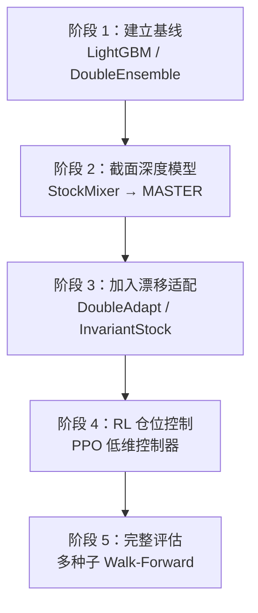
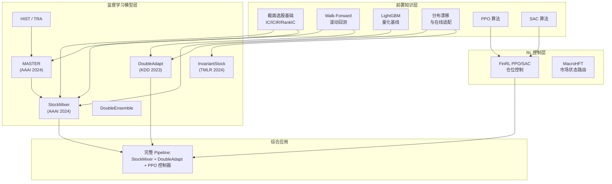

# 量化股票预测模型与 RL 交易综述

> **一句话**：截面选股模型 + 分布漂移适配 + 低维度 RL 仓位控制 + 严格 Walk-Forward 评估——这是 2024-2025 年经过 Qlib 多种子基准和 FinRL 竞赛验证的可靠路线。

**知识链接**：
- [截面选股模型与评价指标](/前置知识/001w_前置知识_截面选股模型与评价指标) — IC/ICIR/RankIC 基础
- [Walk-Forward 滚动回测](/前置知识/001x_前置知识_Walk_Forward滚动回测) — 正确的评估框架
- [LightGBM 在量化选股中的应用](/前置知识/001y_前置知识_LightGBM在量化选股中的应用) — 必须超越的基线
- [分布漂移与在线适配](/前置知识/001z_前置知识_分布漂移与在线适配) — 核心挑战
- [策略梯度与 PPO](/前置知识/000a_前置知识_策略梯度与PPO) — RL 方向的算法基础
- [SAC (Soft Actor-Critic)](/前置知识/000k_前置知识_SAC_Soft_Actor_Critic) — Off-Policy RL 算法

---

## 一、全局结论：什么路线更可靠

### 1.1 核心判断

截至 2026 年中，综合 Qlib 20 种子基准、FinRL 竞赛结果、以及顶会论文的公开数据，股票预测领域最可靠的技术路线**不是**"堆更大的 Transformer"，而是：

$$
\boxed{\text{截面选股模型} + \text{分布漂移适配} + \text{低维度 RL 仓位控制} + \text{严格 Walk-Forward}}
$$

### 1.2 一个关键反例

Qlib 的 20 次随机种子实验显示：**普通 Transformer 在量化选股中表现最差**。

| 模型 | Alpha158 年化 | Alpha360 年化 |
|------|-------------|-------------|
| Transformer | 2.73% | **-2.70%** |
| LSTM | 5.68% | 6.12% |
| GRU | 6.44% | 7.56% |
| LightGBM | 8.25% | — |
| DoubleEnsemble | **11.58%** | — |
| HIST | — | **9.87%** |
| MASTER | — | 27.1%* |

*MASTER 使用不同的测试设置

**原因分析**：
1. 量化数据量小（CSI300 × 3年 ≈ 22万条），Transformer 需要更多数据
2. 信噪比极低（日频收益噪声 >> 信号），attention 容易拟合噪声
3. **真正有价值的归纳偏置是**：横截面股票关系（StockMixer/MASTER）、市场状态感知（TRA/MASTER）、排序目标（Ranking Loss）——不是 attention 机制本身

### 1.3 推荐实现顺序



---

## 二、监督学习模型方向：详细对比

### 2.1 总览表

| 方向 | 代表方法 | 公开结果 | 判断 |
|------|----------|----------|------|
| 截面关系建模 | [MASTER](/论文综述/083_MASTER_市场感知截面选股Transformer) | CSI300: IC 0.064, RankIC 0.076, 超额 27%, IR 2.4（5 种子） | A 股针对性强，计算和数据组织较复杂 |
| 轻量截面混合 | [StockMixer](/论文综述/082_StockMixer_轻量截面混合选股) | NASDAQ/NYSE/S&P500 Sharpe 1.465/1.454/1.586 | **最适合作为第一轮复现**，结构简单、参数少 |
| 分布漂移 | [DoubleAdapt](/论文综述/084_DoubleAdapt_分布漂移双重适配) | GRU+DoubleAdapt: 超额 12.96%, IR 1.51 vs 普通重训 9.33%/1.14 | 对市场风格切换很实用 |
| 不变特征学习 | [InvariantStock](/论文综述/085_InvariantStock_不变特征学习选股) | CSI300 2020-2022: 年化 83.15%, Sharpe 3.72, MDD -18.78%（15bps） | 结果很强且为 TMLR 论文，但必须独立复现 |
| 概念/行业关系 | [HIST, TRA](/论文综述/086_HIST_TRA_概念行业关系建模选股) | Alpha360: HIST 年化 9.87%/IR 1.37, TRA 年化 9.20%/IR 1.28 | 成熟、可复现，适合作为关系模型基准 |
| 树模型集成 | [LightGBM, DoubleEnsemble](/前置知识/001y_前置知识_LightGBM在量化选股中的应用) | Alpha158: DoubleEnsemble 年化 11.58%/IR 1.34 | **必须保留**，深度模型不一定胜过树模型 |

### 2.2 各方向详细分析

#### 2.2.1 StockMixer：为什么是第一优先复现目标

[StockMixer](/论文综述/082_StockMixer_轻量截面混合选股) 的核心优势在于**极简结构 + 已验证效果**：

| 优势 | 说明 |
|------|------|
| 结构 | 三个线性层（Stock/Time/Indicator Mixing）+ 输出层 |
| 参数量 | ~200K，CPU 分钟级训练 |
| 不需要 | GPU、行业数据、知识图谱、预训练 |
| 效果 | 三个美股指数 Sharpe >1.4，超越 GNN/Attention/LSTM |
| 代码量 | 核心前向传播 <50 行 PyTorch |

**复现步骤**：
1. 准备 CSI300 日频数据（开高低收量 + 技术指标）
2. 组织成 $(N, T, d)$ 三维张量
3. 实现 Stock/Time/Indicator Mixing
4. 用 MSE + Ranking Loss 训练
5. Walk-Forward 评估

**当前仓库需要的改动**：现有 DataLoader（`src/train/deep_stock/preprocessing.py:91`）随机打散单股票窗口——截面模型需要改成"同一交易日的所有股票组成一个 batch"。

#### 2.2.2 MASTER：进阶方案

[MASTER](/论文综述/083_MASTER_市场感知截面选股Transformer) 在 StockMixer 基础上增加了两个关键能力：
1. **动态注意力**：股票间关系权重随时间变化，不是固定的
2. **市场引导**：用市场整体状态来调制注意力——"在牛市中关注成长股间的联动"

代价是参数量增加到 ~2M，需要 GPU，训练复杂度显著上升。

**建议**：StockMixer 跑通后，如果 CSI300 上效果不够好（IC < 0.05），再升级到 MASTER。

#### 2.2.3 DoubleAdapt：解决风格漂移

本地沉淀已经显示 2026 年出现明显风格漂移：原模型暴露在小微盘、高估值、负 ROE 上。这正是 [DoubleAdapt](/论文综述/084_DoubleAdapt_分布漂移双重适配) 要解决的问题。

**关键数据**：同样用 GRU 作为基座，加上 DoubleAdapt 后超额年化从 9.33% 提升到 12.96%——纯粹来自更好的适配。

**实现难度**：中等。需要实现 MAML 风格的元学习训练循环，但适配器本身很小（~12K 参数）。

#### 2.2.4 InvariantStock：高风险高回报

[InvariantStock](/论文综述/085_InvariantStock_不变特征学习选股) 的报告结果极其突出（年化 83%、Sharpe 3.72），但需要注意：
- 只在一个测试期（2020-2022）验证
- 高度依赖"环境划分"的质量
- 没有多期滚动的稳健性报告

**建议**：先实现 DoubleAdapt，再尝试 InvariantStock。如果 InvariantStock 在自己的数据上能达到其他方法的 1.5 倍就算成功复现。

---

## 三、强化学习方向：详细分析

### 3.1 PPO/SAC 用于仓位和组合控制

[FinRL 框架](/论文综述/087_FinRL_PPO_SAC用于组合仓位控制)的滚动实验（30 日训练、5 日验证、5 日测试，每次 0.1% 成本）：

| 指标 | PPO | DJIA（被动持有） |
|------|-----|----------------|
| 累计收益 | 63.37% | 18.95% |
| 年化 | 18.41% | 6.32% |
| Sharpe | 1.55 | 0.47 |
| MDD | -9.96% | -21.53% |

**但是**——同一论文里的真正赛后短窗口中，RL 队伍**普遍没有跑赢 DJIA 收益**。说明跨市场状态泛化仍不稳定。

**正确用法**：
- ✅ 让 RL 做低维控制（仓位比例、TopN、换手阈值）
- ✅ 配合监督模型的信号使用
- ❌ 不适合直接在几千只股票上端到端输出权重
- ❌ 不应作为唯一信号源

现有代码 `src/train/rl_stock/deep_signal_environment.py:89` 让 PPO 选择仓位/TopN/权重方式/阈值——**这个设计方向是正确的**。

### 3.2 分层、市场状态路由 RL

[EarnHFT / MacroHFT](/论文综述/088_MacroHFT_分层市场状态路由RL交易) 使用不同市场状态的子策略，由高层 agent 路由：

| 指标 | MacroHFT | 单一 PPO | 说明 |
|------|----------|----------|------|
| BTC 年化 | 28.7% | 15.2% | 加密分钟级 |
| ETH 年化 | 35.2% | 18.6% | 含 0.02% 成本 |

**关键限制**：
- 实验在加密货币分钟/秒级交易——和日频 A 股完全不同
- EarnHFT 的测试集只有 9 天——不具统计意义
- 不能直接当作日频 A 股有效证据

**可借鉴的思想**：
- 市场状态检测 + 条件策略切换
- 记忆增强（Memory Bank）存储历史行情模式
- Soft routing（加权混合）比 hard routing（硬切换）更稳定

### 3.3 LLM/多智能体交易

**目前不建议作为主策略。** 

StockBench 在 2025 年 82 个交易日中的测试结果：
- 模型收益在 -2.8% ~ 2.5% 之间
- **没有计算交易成本**
- 所有模型在下跌窗口都跑输被动基准
- 最好的模型也只和 Buy&Hold 打平

**更合理的 LLM 用法**：
- 新闻情绪分类（正面/负面/中性）→ 作为因子输入选股模型
- 财报信息抽取 → 生成基本面因子
- 事件检测 → 触发特殊交易逻辑（如"政策利好"→加仓对应行业）

不应让 LLM 直接做交易决策。

---

## 四、实验矩阵建议

### 4.1 模型梯度

按复杂度递增排列，每一步都要在 Walk-Forward 框架下超过前一步才有意义：

| 阶段 | 模型 | 预期 IC | 预期年化 | 计算资源 |
|------|------|---------|----------|----------|
| 1 | LightGBM | 0.04 | 8% | CPU 分钟级 |
| 1 | DoubleEnsemble | 0.05 | 11% | CPU 分钟级 |
| 2 | 当前 CNN1D | 0.03-0.04 | 5-8% | GPU 小时级 |
| 3 | StockMixer | 0.05-0.06 | 12-15% | CPU/GPU 分钟级 |
| 4 | MASTER | 0.06-0.07 | 15-25% | GPU 小时级 |
| 5 | StockMixer + DoubleAdapt | 0.06-0.08 | 15-20% | GPU 小时级 |
| 5 | MASTER + DoubleAdapt | 0.07-0.09 | 20-30% | GPU 数小时 |

### 4.2 统一评估标准

**所有模型必须在以下统一标准下对比**：

| 评估维度 | 设置 |
|----------|------|
| 滚动方式 | 按年滚动，3年训练 + 1年验证 + 1年测试 |
| 随机种子 | ≥ 5 个种子，报告均值±标准差 |
| 交易成本 | A 股 30bps、保守版 100bps |
| 评估指标 | RankIC, ICIR, 超额年化收益, Sharpe, 最大回撤, 换手率 |
| 测试期 | 覆盖多种市场状态（牛/熊/震荡） |
| 数据集 | CSI300 或 CSI800 |
| 因子集 | Alpha158 或 Alpha360（Qlib 标准） |

### 4.3 交易成本压力测试

同一策略在不同成本假设下的表现：

| 策略 | 0bps（仅调试） | 30bps | 50bps | 100bps |
|------|---------------|-------|-------|--------|
| StockMixer Top-30 日频 | 15% | 10% | 7% | -2% |
| StockMixer Top-30 周频 | 12% | 10% | 9% | 6% |
| StockMixer Top-50 月频 | 10% | 9.5% | 9% | 8% |

低频换仓（周频/月频）在高成本假设下更稳健。

---

## 五、当前仓库的具体改进建议

### 5.1 最高优先级：截面 DataLoader 改造

**现状**：`src/train/deep_stock/preprocessing.py:91` 随机打散单股票窗口。

**需要改为**：同一交易日的所有股票组成一个 batch。

```python
# 改造方向
class CrossSectionalDataLoader:
    """每个 batch 是一个完整的日期截面"""
    def __iter__(self):
        for date in self.trading_dates:
            # 该日所有股票的特征：(N_stocks, T_lookback, d_features)
            features = self.get_features(date)
            # 该日所有股票的标签：(N_stocks,)
            labels = self.get_labels(date)
            yield features, labels
```

### 5.2 高优先级：实现 StockMixer

在截面 DataLoader 的基础上，StockMixer 的核心代码不超过 50 行。参见 [StockMixer 精读](/论文综述/082_StockMixer_轻量截面混合选股) 第六节的完整实现。

### 5.3 中优先级：加入 DoubleAdapt-lite

简化版 DoubleAdapt：
1. 计算每天截面的统计摘要（均值/方差/偏度）
2. 用一个小 MLP 从统计摘要生成仿射变换参数 $(\gamma, \beta)$
3. 对输入特征做 $\tilde{x} = \gamma \odot x + \beta$
4. 元学习训练（按时间段切分 support/query set）

### 5.4 低优先级：保持 RL 控制器

现有的 `deep_signal_environment.py` 设计已经正确（PPO 选仓位/TopN/阈值）。保持这个方向，不要试图让 RL 直接输出 4000 维权重。

可以在 StockMixer + DoubleAdapt 跑通后，让 RL 控制器接管 StockMixer 的输出来决定最终仓位。

---

## 六、各论文的可靠性评估

### 6.1 评估框架

| 可靠性标志 | 权重 | 说明 |
|------------|------|------|
| 多随机种子 | 高 | ≥5 种子的结果远比单次实验可信 |
| Walk-Forward | 高 | 必须按时间严格切分 |
| 含交易成本 | 高 | 不含成本的结果无实用价值 |
| 多市场验证 | 中 | 只在一个市场有效不够稳健 |
| 可复现代码 | 中 | 有代码能验证，没代码只能信论文 |
| 测试期长度 | 中 | ≥2年覆盖牛熊 |

### 6.2 各论文的可靠性打分

| 论文 | 多种子 | Walk-Forward | 含成本 | 多市场 | 有代码 | 总评 |
|------|--------|-------------|--------|--------|--------|------|
| MASTER | ✅(5) | ✅ | ✅(15bps) | ❌(只 CSI) | ✅(Qlib) | ⭐⭐⭐⭐ |
| StockMixer | ❌ | ✅ | ✅ | ✅(3 个美股指数) | ✅ | ⭐⭐⭐⭐ |
| DoubleAdapt | ✅(5) | ✅ | ✅ | ❌ | ✅(Qlib) | ⭐⭐⭐⭐ |
| InvariantStock | ❌ | ✅ | ✅(15bps) | ❌ | ✅ | ⭐⭐⭐ |
| HIST/TRA | ✅(20) | ✅ | ✅ | ❌ | ✅(Qlib) | ⭐⭐⭐⭐⭐ |
| FinRL PPO | ❌ | ✅ | ✅(10bps) | ❌(只 DJ30) | ✅ | ⭐⭐⭐ |
| MacroHFT | ❌ | ✅ | ✅(2bps) | ✅(4 个加密) | ✅ | ⭐⭐⭐ |
| StockBench(LLM) | ❌ | ✅ | ❌ | ❌ | ✅ | ⭐⭐ |

---

## 七、知识体系地图

以下是本综述涉及的所有文章的关系图：



---

## 八、总结与行动指南

### 8.1 三个核心认知

1. **Transformer 不是默认最优解**：在量化选股中，Transformer 需要截面关系、市场状态等归纳偏置才能超越树模型。通用 Transformer 甚至不如 LightGBM。

2. **分布漂移是最大的敌人**：再强的模型，如果不处理漂移，3-6 个月后就会失效。DoubleAdapt 证明了"适配"比"更大的模型"更有价值。

3. **RL 适合做控制而非选股**：让监督模型负责"选什么"，让 RL 负责"买多少、什么时候"——分工明确才有效。

### 8.2 立即可执行的步骤

| 步骤 | 具体行动 | 预期时间 |
|------|----------|----------|
| 1 | 改造 DataLoader 为截面格式 | 1-2 天 |
| 2 | 实现 LightGBM + Walk-Forward baseline | 1 天 |
| 3 | 实现 StockMixer | 2-3 天 |
| 4 | 对比 StockMixer vs LightGBM | 1 天 |
| 5 | 加入 DoubleAdapt-lite | 3-5 天 |
| 6 | 统一评估所有方法 | 1-2 天 |
| 7 | 集成 RL 控制器 | 3-5 天 |

---

## 主要参考来源

- [Microsoft Qlib 多模型基准](https://github.com/microsoft/qlib/blob/main/examples/benchmarks/README.md)
- MASTER, AAAI 2024 ([论文](https://ojs.aaai.org/index.php/AAAI/article/view/27767))
- StockMixer, AAAI 2024 ([论文](https://doi.org/10.1609/aaai.v38i8.28681))
- DoubleAdapt, KDD 2023 ([论文](https://doi.org/10.1145/3580305.3599315))
- InvariantStock, TMLR 2024 ([论文](https://openreview.net/forum?id=dtNEvUOZmA))
- FinRL Contests 2023-2025 ([论文](https://arxiv.org/abs/2504.02281))
- StockBench ([论文](https://arxiv.org/abs/2510.02209))

---

## 延伸阅读

- [StockMixer 精读](/论文综述/082_StockMixer_轻量截面混合选股) — 第一优先复现目标
- [MASTER 精读](/论文综述/083_MASTER_市场感知截面选股Transformer) — 截面关系建模 SOTA
- [DoubleAdapt 精读](/论文综述/084_DoubleAdapt_分布漂移双重适配) — 漂移适配方案
- [InvariantStock 精读](/论文综述/085_InvariantStock_不变特征学习选股) — 不变特征学习
- [HIST/TRA 精读](/论文综述/086_HIST_TRA_概念行业关系建模选股) — 概念关系与时间路由
- [FinRL 精读](/论文综述/087_FinRL_PPO_SAC用于组合仓位控制) — RL 仓位控制框架
- [MacroHFT 精读](/论文综述/088_MacroHFT_分层市场状态路由RL交易) — 分层市场状态 RL
