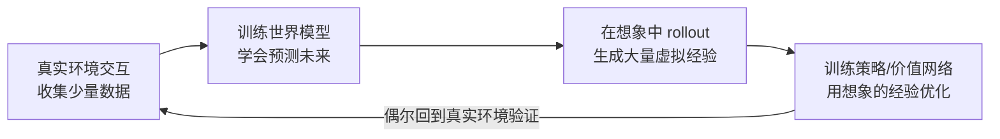
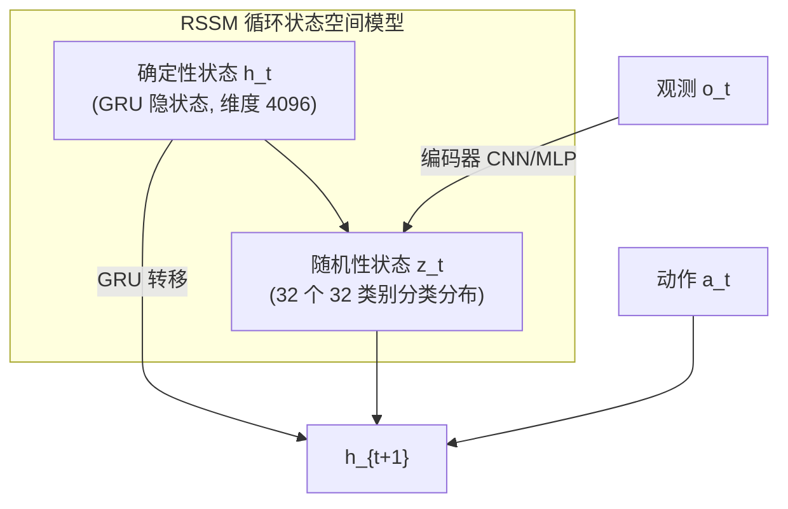
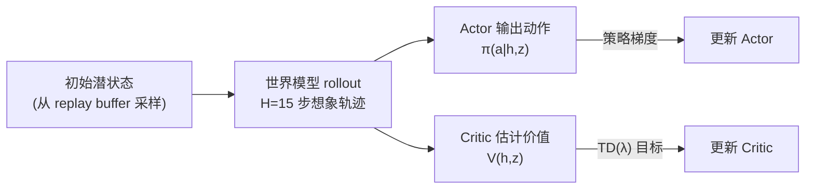
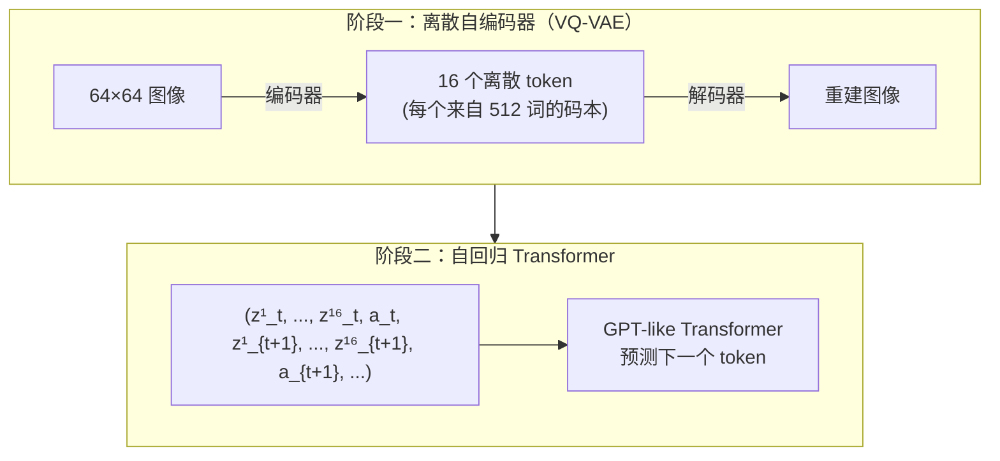
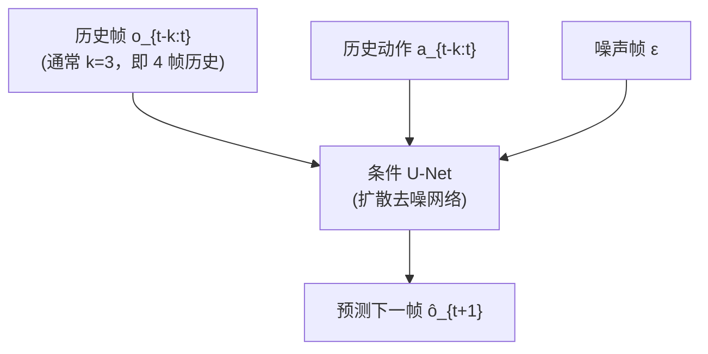
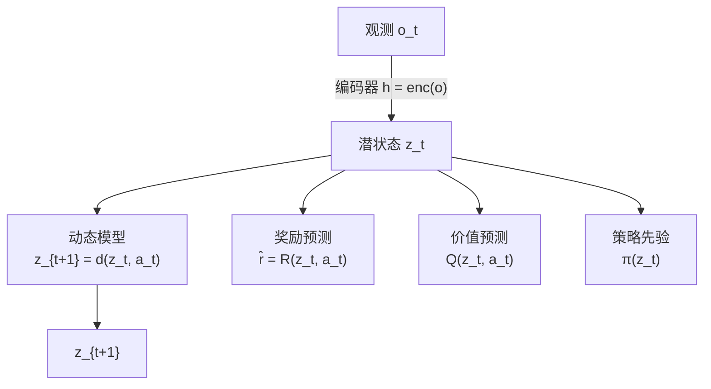
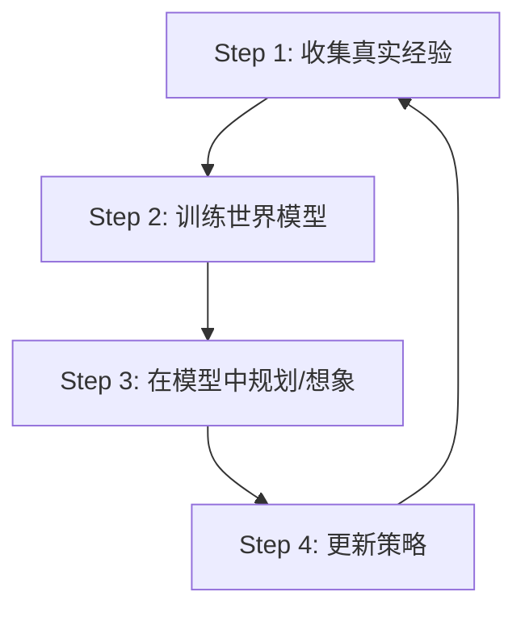
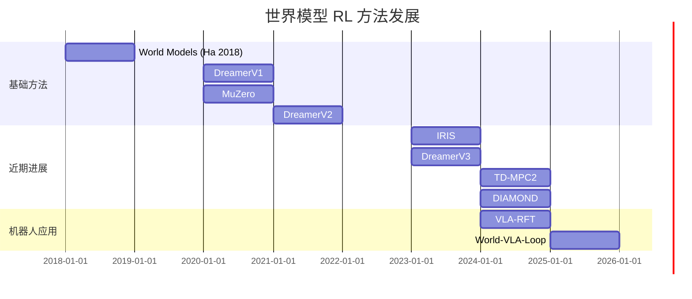

# 世界模型强化学习综述：从 Dreamer 到 DIAMOND

> **一句话概括**：学一个环境的"心理模型"，在想象中训练策略——省数据、省交互、还能规划未来。

**标签**: `#世界模型` `#Model-Based RL` `#DreamerV3` `#IRIS` `#DIAMOND` `#TD-MPC2` `#MuZero` `#想象训练` `#潜空间规划`

**知识链接**：
- [世界模型基础](/前置知识/000t_前置知识_世界模型基础) — 世界模型的概念入门
- [策略梯度与 PPO](/前置知识/000a_前置知识_策略梯度与PPO) — Actor-Critic 基础
- [Q 函数与 Value 函数](/前置知识/000o_前置知识_Q函数与Value函数) — 价值估计
- [扩散模型 DDPM](/前置知识/000b_前置知识_扩散模型DDPM) — DIAMOND 的核心技术
- [向量量化与离散表示学习](/前置知识/001q_前置知识_向量量化与离散表示学习) — IRIS 的 tokenization
- [VLA-RFT：世界模型验证奖励 RL 微调](/论文综述/017_VLA_RFT_世界模型验证奖励RL微调) — 世界模型在 VLA 中的应用
- [World-VLA-Loop：闭环世界模型与 VLA 策略协同学习](/论文综述/044_WorldVLALoop_闭环世界模型与VLA策略学习) — 闭环改进

---

## 一、为什么需要世界模型做 RL

### 1.1 Model-Free RL 的致命瓶颈

Model-Free RL（如 PPO、SAC）直接和环境交互学习。问题是：

1. **采样效率极低**：PPO 训 Atari 需要约 2 亿帧交互（人类只需几分钟）
2. **真实环境交互代价高**：机器人每次失败可能损坏设备
3. **无法预判后果**：策略只能"试了才知道"

### 1.2 世界模型的核心思路

**在脑中模拟环境，在想象中训练策略。**

```mermaid
flowchart LR
    A["真实环境交互<br/>收集少量数据"] --> B["训练世界模型<br/>学会预测未来"]
    B --> C["在想象中 rollout<br/>生成大量虚拟经验"]
    C --> D["训练策略/价值网络<br/>用想象的经验优化"]
    D -->|"偶尔回到真实环境验证"| A
```

核心公式：世界模型学习一个转移函数 $f_\psi$：

$$
\hat{s}_{t+1}, \hat{r}_t = f_\psi(s_t, a_t)
$$

**这个公式在做什么**：训练一个"预言家"网络，输入当前状态和动作，直接吐出下一个状态和这一步能拿到的奖励——相当于把整个环境的物理规律浓缩进一个函数里。

::: details 📐 公式详解（点击展开）

| 子表达式 | 它是谁 | 它在干嘛 |
|---------|--------|---------|
| $s_t, a_t$ | **当前处境** | 世界模型的输入：现在在哪、准备做什么 |
| $f_\psi(\cdot)$ | **预言家网络** | 参数为 $\psi$ 的神经网络，扮演"环境"的替身 |
| $\hat{s}_{t+1}$ | **预测的下一状态** | 模型猜测的、下一时刻会看到的状态（带 hat 表示是估计值，不是真实值） |
| $\hat{r}_t$ | **预测的即时奖励** | 模型猜测的这一步能拿多少分 |

**用人话读**："给预言家看一眼现在的状态和打算做的动作，它直接告诉你下一步会变成什么样、这一步能得多少分——不用真的去做就知道结果。"

**为什么是这个形式**：只要这个函数足够准，后面所有的训练（想象 rollout、策略优化）都可以在这个函数里空转，完全不用碰真实环境——这是省交互次数的根本原因。
:::

有了这个模型，就可以在"想象"中生成任意长度的轨迹：

$$
\hat{\tau} = (\hat{s}_0, a_0, \hat{r}_0, \hat{s}_1, a_1, \hat{r}_1, \ldots, \hat{s}_H)
$$

**这个公式在做什么**：把 $f_\psi$ 反复调用 $H$ 次，串成一条完整的"虚拟经历"——就像闭着眼睛在脑子里彩排一整局游戏。

::: details 📐 公式详解（点击展开）

| 子表达式 | 它是谁 | 它在干嘛 |
|---------|--------|---------|
| $\hat{s}_0$ | **起点** | 想象轨迹的初始状态，通常取自真实历史数据 |
| $a_0, a_1, \ldots$ | **每一步的决定** | 策略在想象中依次选择的动作 |
| $\hat{r}_0, \hat{r}_1, \ldots$ | **每一步的得分** | 世界模型预测的即时奖励序列 |
| $\hat{\tau}$ | **完整的虚拟剧本** | 状态-动作-奖励交替排列的整条轨迹，长度 $H$ |

**用人话读**："从一个起点出发，一步步用预言家网络往前推，把状态、动作、奖励串成一整条从头到尾都是脑补出来的轨迹。"

**为什么是这个形式**：只要 $f_\psi$ 够准，这条轨迹就可以当成"真实经验"一样拿去训练策略——这就是"在想象中训练"的字面含义，也是世界模型 RL 省真实交互次数的核心机制。
:::

然后用这些想象轨迹训练策略——**不需要和真实环境交互**。

### 1.3 贯穿全文的例子

> **场景**：一个 Atari Breakout 游戏。屏幕 64×64 像素，动作有 4 个（左、右、发球、不动）。
>
> - Model-Free 方法：需要玩 2 亿帧游戏才能学会（约 39 天连续玩）
> - World Model 方法：玩 10 万帧（约 2 小时），学一个"游戏物理"模型，在脑中想象玩 100 万局，最终达到甚至超过 Model-Free 的水平

### 1.4 五大代表性方法概览

| 方法 | 年份 | 会议 | 世界模型架构 | 策略学习方式 | 状态空间 |
|------|------|------|-------------|-------------|---------|
| **DreamerV3** | 2023 | Nature | RSSM（RNN + 离散潜变量） | Actor-Critic（想象中） | 潜空间 |
| **IRIS** | 2023 | ICLR | 离散自编码器 + Transformer | Actor-Critic（想象中） | 离散 token 序列 |
| **DIAMOND** | 2024 | NeurIPS | 扩散模型（U-Net） | Actor-Critic（想象中） | 像素空间 |
| **TD-MPC2** | 2024 | ICLR | 隐式世界模型（无解码器） | MPC 规划 + TD 学习 | 连续潜空间 |
| **MuZero** | 2020 | Nature | 学习的动态模型 | MCTS 规划 | 潜空间 |

---

## 二、DreamerV3：通用世界模型 RL 的标杆

### 2.1 论文信息

> **论文标题**: Mastering Diverse Domains through World Models  
> **作者**: Danijar Hafner, Jurgis Pasukonis, Jimmy Ba, Timothy Lillicrap  
> **机构**: DeepMind, University of Toronto  
> **发表**: Nature 2025 / arXiv:2301.04104 (2023)  
> **代码**: https://github.com/danijar/dreamerv3

**核心贡献**：用**一套固定超参数**在 150+ 种任务上超越专门化方法，包括首次从零在 Minecraft 中收集到钻石。

### 2.2 RSSM：循环状态空间模型

DreamerV3 的世界模型核心是 **RSSM（Recurrent State-Space Model）**，它把潜空间状态分为两部分：

```mermaid
flowchart TD
    subgraph RSSM["RSSM 循环状态空间模型"]
        h["确定性状态 h_t<br/>(GRU 隐状态, 维度 4096)"]
        z["随机性状态 z_t<br/>(32 个 32 类别分类分布)"]
        h --> z
    end
    obs["观测 o_t"] -->|"编码器 CNN/MLP"| z
    h -->|"GRU 转移"| h_next["h_{t+1}"]
    z --> h_next
    act["动作 a_t"] --> h_next
```

RSSM 由以下组件构成：

$$
\begin{aligned}
\text{编码器:} \quad & z_t \sim q_\phi(z_t \mid h_t, o_t) \\
\text{转移先验:} \quad & \hat{z}_t \sim p_\phi(\hat{z}_t \mid h_t) \\
\text{循环模型:} \quad & h_t = f_\phi(h_{t-1}, z_{t-1}, a_{t-1}) \\
\text{解码器:} \quad & \hat{o}_t \sim p_\phi(o_t \mid h_t, z_t) \\
\text{奖励预测:} \quad & \hat{r}_t \sim p_\phi(r_t \mid h_t, z_t) \\
\text{继续标志:} \quad & \hat{c}_t \sim p_\phi(c_t \mid h_t, z_t)
\end{aligned}
$$

**这个公式在做什么**：定义 RSSM（Recurrent State-Space Model，循环状态空间模型）的六个组件，把"看观测、记历史、想未来、检查想象、猜分数、判断是否结束"这六件事分给六个子网络分别负责。

::: details 📐 公式详解（点击展开）

| 子表达式 | 它是谁 | 它在干嘛 |
|---------|--------|---------|
| $q_\phi(z_t\mid h_t,o_t)$ | **观察员** | 看到真实观测 $o_t$ 后，总结出当前的随机性状态 $z_t$ |
| $p_\phi(\hat{z}_t\mid h_t)$ | **蒙眼猜测者** | 不看观测，只凭历史记忆 $h_t$ 猜 $z_t$ 应该是什么——这是想象 rollout 时唯一能用的分支 |
| $f_\phi(h_{t-1},z_{t-1},a_{t-1})$ | **记忆管家** | GRU 循环网络，把"上一刻的记忆+随机状态+动作"打包更新成新的确定性记忆 $h_t$ |
| $p_\phi(o_t\mid h_t,z_t)$ | **审阅员** | 尝试从潜状态重建出原始观测，用来检验潜状态是否保留了足够信息 |
| $p_\phi(r_t\mid h_t,z_t)$、$p_\phi(c_t\mid h_t,z_t)$ | **计分员/裁判** | 分别预测这一步的奖励和游戏是否还在继续 |

**用人话读**："观察员看真实画面总结出一个'当前感觉'，蒙眼猜测者试着不看画面也猜出同样的感觉，记忆管家把这些串成长期记忆，审阅员、计分员、裁判再分别检查重建、算分、判断结束——六个角色配合出一个完整的'心理环境模拟器'。"

**为什么是这个形式**：想象 rollout 时没有真实观测可看，只能靠"蒙眼猜测者" $p_\phi(\hat z_t\mid h_t)$；训练时则用"观察员" $q_\phi$ 提供更准的监督信号去纠正蒙眼猜测者——这组"看得见 vs 看不见"的配对正是后面 KL 正则化要解决的问题。
:::

**为什么需要这些组件？** 让我们逐一拆解：

| 组件 | 作用 | 直觉 |
|------|------|------|
| 编码器 $q_\phi$ | 从观测中提取潜变量 | "看到屏幕后总结当前状态" |
| 转移先验 $p_\phi$ | 不看观测只靠历史预测 | "纯靠想象预测下一步" |
| 循环模型 $f_\phi$ | 维护长期记忆 | "记住之前发生了什么" |
| 解码器 | 从潜变量重建观测 | "检查想象是否合理" |
| 奖励/继续预测 | 预测 reward 和终止 | "估计这一步能得多少分" |

**关键设计**：$z_t$ 使用 **32 个 32-way 分类分布**（而非连续高斯）。这意味着 $z_t$ 是一个 $32 \times 32 = 1024$ 维的 one-hot 拼接向量。

**为什么用分类分布而不是高斯？**
- 分类分布的表达力更强：32 个独立类别变量可以表示 $32^{32} \approx 10^{48}$ 种组合
- 高斯分布的模式坍缩问题：VAE 中常见的后验坍缩在分类分布上不那么严重
- 直接用 straight-through 梯度估计，训练更稳定

### 2.3 世界模型的训练目标

DreamerV3 的世界模型通过最大化 ELBO（证据下界）来训练：

$$
\mathcal{L}_{\text{wm}} = \sum_t \left[ \underbrace{\ln p_\phi(o_t \mid h_t, z_t)}_{\text{重建损失}} + \underbrace{\ln p_\phi(r_t \mid h_t, z_t)}_{\text{奖励预测}} + \underbrace{\ln p_\phi(c_t \mid h_t, z_t)}_{\text{继续预测}} - \underbrace{\beta \cdot \text{KL}[q_\phi(z_t \mid h_t, o_t) \| p_\phi(z_t \mid h_t)]}_{\text{正则化}} \right]
$$

**这个公式在做什么**：DreamerV3 世界模型的总训练目标（ELBO，Evidence Lower Bound，证据下界）——同时逼着模型"能还原真实画面""能猜准得分""能判断游戏是否结束"，还要让"看画面后的判断"和"纯靠想象的猜测"不要偏离太远。

::: details 📐 公式详解（点击展开）

| 子表达式 | 它是谁 | 它在干嘛 |
|---------|--------|---------|
| $\ln p_\phi(o_t\mid h_t,z_t)$ | **重建打分** | 解码器从潜状态还原观测的对数似然，还原得越像原图分数越高 |
| $\ln p_\phi(r_t\mid h_t,z_t)$ | **算分打分** | 奖励预测头猜中真实奖励的程度 |
| $\ln p_\phi(c_t\mid h_t,z_t)$ | **续命判断打分** | 继续标志（$c_t=1$ 表示还没死）预测准不准 |
| $\beta\cdot\text{KL}[q_\phi\|p_\phi]$ | **纪律惩罚** | 惩罚"看到画面后的判断"$q_\phi$ 和"纯靠想象的猜测"$p_\phi$ 之间差太远 |
| $\sum_t[\cdot]$ | **逐帧累加** | 把一整段序列里每一步的分数加总 |

**用人话读**："这一段轨迹里每一帧都要检查四件事——重建得像不像、分数猜得准不准、结束判断得对不对、看画面判断和纯想象判断差不差太多——四项加起来（前三项越大越好、KL 项越小越好）就是要优化的总目标。"

**为什么是这个形式**：前三项保证潜状态里保留了"重建、算分、判断结束"所需的全部信息；KL 项则专门为"想象 rollout 时看不到真实画面"这件事做准备——逼着"蒙眼猜测者" $p_\phi$ 尽量学得和"观察员" $q_\phi$ 一样准，这样脱离真实观测后模型仍然可靠。
:::

**DreamerV3 的 KL 平衡技巧**：

普通 KL 正则会让编码器变得"懒惰"（直接输出先验）。DreamerV3 使用非对称 KL：

$$
\text{KL}_{\text{balanced}} = \alpha \cdot \text{KL}[\text{sg}(q) \| p] + (1-\alpha) \cdot \text{KL}[q \| \text{sg}(p)]
$$

**这个公式在做什么**：把上面的 KL 正则项拆成两个方向分别加权，专门解决"编码器躺平"的问题——逼着"蒙眼猜测者"多学、"观察员"少简化。

::: details 📐 公式详解（点击展开）

| 子表达式 | 它是谁 | 它在干嘛 |
|---------|--------|---------|
| $\text{sg}(\cdot)$ | **冻结开关** | stop-gradient，切断梯度，让被包住的项在这次更新里当作常数 |
| $\text{KL}[\text{sg}(q)\|p]$ | **训练先验的信号** | $q$ 被冻住，只有 $p$（蒙眼猜测者）的参数会被这一项的梯度更新 |
| $\text{KL}[q\|\text{sg}(p)]$ | **训练编码器的信号** | $p$ 被冻住，只有 $q$（观察员）的参数会被这一项的梯度更新 |
| $\alpha=0.8$ | **偏心旋钮** | 80% 权重给"训练先验"，只有 20% 给"训练编码器" |

**用人话读**："把'谁该学准'这件事拆成两条独立的梯度：一条只逼着蒙眼猜测者去追观察员（权重 80%），另一条只逼着观察员别学得太复杂（权重 20%）——不让编码器偷懒直接抄先验的答案。"

**为什么是这个形式**：普通对称 KL 会给编码器一条"捷径"——直接输出和先验一样的分布就能让 KL 项变小，这样编码器就学不到观测里的有效信息（后验坍缩）。拆成两个 stop-gradient 分支后，主要压力压在先验身上（让它去追更准的编码器），编码器只承受很小的简化压力，避免了这条捷径。
:::

### 2.4 Symlog 预测：处理跨域奖励尺度

DreamerV3 需要一套超参数跑所有任务——但不同任务的奖励尺度差异巨大：

- Atari Breakout：奖励 0~50
- Minecraft：奖励 0~1
- 连续控制：奖励 -1000~0

**解决方案：Symlog 变换**

$$
\text{symlog}(x) = \text{sign}(x) \cdot \ln(|x| + 1)
$$

**这个公式在做什么**：把任意尺度的数值（从 0.01 到 1000）压缩到一个统一的、可控的范围内，同时保留原始符号——这样奖励尺度差几个数量级的不同任务，可以用同一套超参数训练。

::: details 📐 公式详解（点击展开）

| 子表达式 | 它是谁 | 它在干嘛 |
|---------|--------|---------|
| $\text{sign}(x)$ | **符号保留器** | 记住原始值是正是负，处理完再乘回去 |
| $|x|+1$ | **防零垫底** | 先取绝对值再加 1，保证对数里面永远大于 0（$x=0$ 时刚好取 $\ln 1=0$） |
| $\ln(\cdot)$ | **大数压缩机** | 对数函数天生把大数压得扁、小数变化保留得细——这是压缩尺度的核心 |
| $\text{symlog}(x)$ | **统一量纲后的值** | 经过压缩、符号还原后的最终输出，供网络的所有预测头使用 |

**用人话读**："不管原始奖励是 0.5 还是 1000，都先取绝对值加 1 再取对数，把差距拉近到几十以内，最后把正负号还原——这样网络不用为不同任务单独调学习率。"

**为什么是这个形式**：直接取 $\ln(x)$ 在 $x\le0$ 时没有定义，也不对称；`sign(x)·ln(|x|+1)` 同时解决了"负数怎么办"和"$x$ 接近 0 时要保持线性、不能梯度爆炸"两个问题，$x\to0$ 时 $\text{symlog}(x)\approx x$，$|x|$ 很大时增长速度骤降为对数级。
:::

| 原始值 $x$ | $\text{symlog}(x)$ |
|-----------|---------------------|
| 0 | 0 |
| 1 | 0.69 |
| 10 | 2.40 |
| 1000 | 6.91 |
| -100 | -4.62 |

所有预测头（奖励、价值、解码器）都在 symlog 空间中操作。这让网络不需要针对不同任务调整学习率——所有目标的量级都在 $[-10, 10]$ 范围内。

### 2.5 想象中的 Actor-Critic 训练

世界模型训练好之后，策略和价值网络**完全在想象中**训练，不再需要真实环境：

```mermaid
flowchart LR
    s0["初始潜状态<br/>(从 replay buffer 采样)"] --> imagine["世界模型 rollout<br/>H=15 步想象轨迹"]
    imagine --> actor["Actor 输出动作<br/>π(a|h,z)"]
    imagine --> critic["Critic 估计价值<br/>V(h,z)"]
    actor -->|"策略梯度"| update_a["更新 Actor"]
    critic -->|"TD(λ) 目标"| update_c["更新 Critic"]
```

**Actor 的训练目标**：

$$
\mathcal{L}_{\text{actor}} = -\mathbb{E}_{p_\phi, \pi_\theta} \left[ \sum_{t=0}^{H-1} V_t^\lambda - \eta \cdot H(\pi_\theta) \right]
$$

**这个公式在做什么**：训练策略网络（Actor），让它在想象轨迹中选出的动作能拿到尽量高的长期回报，同时保留一点随机性不要太快变得死板。

::: details 📐 公式详解（点击展开）

| 子表达式 | 它是谁 | 它在干嘛 |
|---------|--------|---------|
| $V_t^\lambda$ | **回报打分器** | λ-回报（TD(λ)），综合短期 TD 估计和长期蒙特卡洛回报的一个折中估计 |
| $\mathbb{E}_{p_\phi,\pi_\theta}[\cdot]$ | **想象考场** | 在世界模型 $p_\phi$ 生成、策略 $\pi_\theta$ 参与决策的想象轨迹上取期望。实际做法：从 replay buffer 采初始状态，世界模型展开 $H=15$ 步 |
| $H(\pi_\theta)$ | **好奇心奖励** | 策略输出分布的熵，熵越大说明策略越"不确定"、越爱探索 |
| $\eta$ | **好奇心旋钮** | 控制熵项的权重，越大越鼓励探索 |
| 整体取负号 | **翻译成 loss** | 原本是要最大化的目标，加负号变成梯度下降要最小化的 loss |

**用人话读**："让策略在想象里跑一遍，把每一步的长期回报加起来，再加上一点'保持随机性'的奖励，取负号变成 loss——梯度下降的方向就是让回报变高、同时不要太快变得死板。"

**为什么是这个形式**：熵项 $\eta H(\pi_\theta)$ 防止策略过早收敛到一个动作（陷入局部最优），是标准的 [Actor-Critic](/前置知识/000a_前置知识_策略梯度与PPO) 里的探索-利用权衡机制；因为整条轨迹全部发生在想象里，不需要真实环境交互，这一步的更新几乎零成本。
:::

**Critic 的训练目标**：

$$
\mathcal{L}_{\text{critic}} = \sum_{t=0}^{H-1} \left( v_\psi(h_t, z_t) - \text{sg}(V_t^\lambda) \right)^2
$$

**这个公式在做什么**：训练价值网络（Critic），让它对每个想象中的潜状态的打分尽量逼近"更靠谱"的 λ-回报估计。

::: details 📐 公式详解（点击展开）

| 子表达式 | 它是谁 | 它在干嘛 |
|---------|--------|---------|
| $v_\psi(h_t,z_t)$ | **当前打分** | Critic 网络对想象中这一步潜状态给出的价值估计 |
| $\text{sg}(V_t^\lambda)$ | **回归目标** | 上面 Actor 用到的同一个 λ-回报，但用 stop-gradient 冻住，只当作固定标签，不让梯度通过它反向传播 |
| $(v_\psi - \text{sg}(V_t^\lambda))^2$ | **均方误差** | 打分和目标差多少，差得越多惩罚越大 |
| $\sum_{t=0}^{H-1}$ | **逐步累加** | 把想象轨迹里每一步的误差加总 |

**用人话读**："让 Critic 学会预测'这个想象出来的状态到底值多少分'，标准答案就是 λ-回报（当作已知常数，不参与反向传播）。"

**为什么要 stop-gradient**：如果不冻住 $V_t^\lambda$，Critic 的更新目标会随着 Critic 自己的输出变化而变化（自己在追自己的尾巴），训练会不稳定；冻住之后目标在这一步是固定的，回归问题变得干净、稳定。
:::

### 2.6 DreamerV3 的完整训练循环

用 Breakout 例子走一遍完整流程：

1. **收集数据**：用当前策略在真实 Atari 环境中玩 1 个 episode，把 $(o_t, a_t, r_t)$ 存入 replay buffer
2. **训练世界模型**：从 buffer 中采 batch size=16 的 64 步序列，优化 $\mathcal{L}_{\text{wm}}$
3. **想象训练**：从 buffer 中随机取 16 个状态作为起点，用世界模型展开 H=15 步想象轨迹，得到 $16 \times 15 = 240$ 个虚拟经验。用这些经验更新 Actor 和 Critic
4. **重复**：每收集 1 步真实数据，做 1 次想象训练

**关键数字**：Atari 100k benchmark（只允许 10 万帧真实交互，约 2 小时游戏时间），DreamerV3 在 26 个游戏上的平均人类归一化分数 (HNS) 达到 **1.21**——超过人类水平。

### 2.7 DreamerV3 的局限

| 局限 | 说明 |
|------|------|
| 模型误差累积 | 想象 H=15 步后误差可能很大 |
| 计算开销 | RSSM 是 RNN，难以并行 |
| 观测空间有限 | 对超高分辨率图像效率下降 |
| 长 horizon 规划弱 | 最多看 15 步，不适合需要几百步规划的任务 |

---

## 三、IRIS：Transformer 作为世界模型

### 3.1 论文信息

> **论文标题**: Transformers are Sample-Efficient World Models  
> **作者**: Vincent Micheli, Eloi Alonso, François Fleuret  
> **机构**: University of Geneva  
> **发表**: ICLR 2023 (Notable Top 5%)  
> **代码**: https://github.com/eloialonso/iris

**核心思路**：把"环境动力学建模"重新定义为"序列预测"——用离散自编码器把图像变成 token 序列，然后用 Transformer 预测未来的 token。

### 3.2 两阶段架构

IRIS 由两个模块组成：

```mermaid
flowchart TD
    subgraph Stage1["阶段一：离散自编码器（VQ-VAE）"]
        img["64×64 图像"] -->|"编码器"| tokens["16 个离散 token<br/>(每个来自 512 词的码本)"]
        tokens -->|"解码器"| recon["重建图像"]
    end
    subgraph Stage2["阶段二：自回归 Transformer"]
        seq["(z¹_t, ..., z¹⁶_t, a_t, z¹_{t+1}, ..., z¹⁶_{t+1}, a_{t+1}, ...)"]
        seq --> GPT["GPT-like Transformer<br/>预测下一个 token"]
    end
    Stage1 --> Stage2
```

### 3.3 阶段一：把图像变成离散 token

IRIS 使用 **VQ-VAE（Vector Quantized Variational Autoencoder）** 把每帧 64×64 的游戏画面编码为 16 个离散 token。

**具体过程**：

1. 编码器（CNN）把 64×64×3 的图像映射为 4×4×256 的特征图
2. 把 4×4=16 个 256 维向量各自量化到最近的码本向量（码本大小 512）
3. 得到 16 个整数 token：$z^1, z^2, \ldots, z^{16}$，每个 $z^i \in \{0, 1, \ldots, 511\}$
4. 解码器从 16 个量化向量重建原图

**为什么要离散化？**
- Transformer 天然擅长处理离散序列（NLP 中的 token 预测）
- 离散表示的信息密度更高：16 个 token 比连续潜变量更紧凑
- 避免了"预测模糊均值"的问题——离散分布必须做出明确选择

**数值例子**：

一帧 Breakout 画面（64×64×3 = 12,288 维）被压缩为 16 个 token（每个 9-bit），信息量约 $16 \times 9 = 144$ bit。压缩比约 682:1。这使得 Transformer 的序列长度大幅缩短。

### 3.4 阶段二：Transformer 预测未来

将时间步的 token 序列拼接为：

$$
\text{seq} = (z^1_1, \ldots, z^{16}_1, a_1, z^1_2, \ldots, z^{16}_2, a_2, \ldots)
$$

**这个公式在做什么**：把每一帧的 16 个离散 token 和这一帧对应的动作按时间顺序串成一条长序列——把"预测下一帧画面"这个问题，改造成 Transformer 最擅长的"预测下一个 token"问题。

::: details 📐 公式详解（点击展开）

| 子表达式 | 它是谁 | 它在干嘛 |
|---------|--------|---------|
| $z^1_1,\ldots,z^{16}_1$ | **第 1 帧的 16 个碎片** | VQ-VAE（Vector Quantized VAE）把第一帧画面量化出的 16 个离散 token，按空间顺序排列 |
| $a_1$ | **第 1 步的动作** | 紧跟在这一帧 16 个 token 后面，标记"看完这帧后做了什么" |
| $z^1_2,\ldots,z^{16}_2,a_2$ | **第 2 帧的碎片+动作** | 同样的模式重复到下一个时间步 |
| $\text{seq}$ | **拉直后的整条序列** | 所有帧的 token 和动作交替排列拼成的一维序列，是 Transformer 的直接输入 |

**用人话读**："把每一帧拆成 16 个碎片，碎片后面跟着这一步的动作，所有时间步的碎片和动作依次首尾相连，拼成一条长长的一维序列。"

**为什么是这个形式**：Transformer 只认一维 token 序列，不认二维图像；这样拼接后，"预测下一帧画面"就变成了"预测序列里接下来的 16 个 token"，可以直接套用 GPT 式的自回归训练，不需要为图像单独设计架构。
:::

一个标准的因果 Transformer 在这个序列上做自回归预测：

$$
p(z^i_{t+1} \mid z^1_1, \ldots, z^{16}_1, a_1, \ldots, z^{16}_t, a_t, z^1_{t+1}, \ldots, z^{i-1}_{t+1})
$$

**这个公式在做什么**：定义 Transformer 要学的条件概率——给定到目前为止的所有历史 token 和动作，以及下一帧已经预测出来的前几个 token，猜下一帧的第 $i$ 个 token 是什么。

::: details 📐 公式详解（点击展开）

| 子表达式 | 它是谁 | 它在干嘛 |
|---------|--------|---------|
| $z^i_{t+1}$ | **要猜的碎片** | 下一帧 16 个 token 中的第 $i$ 个，当前要预测的目标 |
| $z^1_1,\ldots,a_t$ | **全部历史** | 从最开始到当前时间步 $t$ 的所有帧 token 和动作，一字不漏 |
| $z^1_{t+1},\ldots,z^{i-1}_{t+1}$ | **本帧已出炉的部分** | 下一帧里排在第 $i$ 个之前、已经预测出来的 token，按顺序逐个补全时可以用上 |
| $p(\cdot\mid\cdot)$ | **条件概率分布** | Transformer 输出的、关于第 $i$ 个 token 取值的概率分布 |

**用人话读**："像 GPT 逐词生成句子一样，Transformer 看着所有历史帧、历史动作，以及这一帧目前已经补出来的碎片，逐个猜出下一帧剩下的 16 个碎片。"

**为什么是这个形式**：把图像生成拆成逐 token 自回归预测，天然复用了语言模型里最成熟的架构（因果自注意力 + 交叉熵训练），不需要单独设计图像生成模块；代价是生成一帧要做 16 次前向预测，比 DreamerV3 一次 GRU 前传要慢。
:::

**和 DreamerV3 的关键区别**：

| 维度 | DreamerV3 (RSSM) | IRIS (Transformer) |
|------|------------------|--------------------|
| 时序建模 | RNN（GRU），顺序处理 | Transformer，并行注意力 |
| 状态表示 | 连续（高斯/分类） + 确定性 | 纯离散 token |
| 长程依赖 | 靠 GRU 隐状态传递，会遗忘 | 注意力直接关注任意历史帧 |
| 计算效率 | 想象中高效（一次 GRU 前传） | 上下文窗口有限（通常 4-8 帧） |
| 可扩展性 | 受限于 GRU 的表达力 | 可直接扩大模型规模 |

### 3.5 策略学习：在想象的 token 世界中训练

IRIS 在 Transformer 生成的想象轨迹上训练 Actor-Critic：

1. 从 replay buffer 中取一段真实历史作为 context
2. 用 Transformer 自回归采样未来 token（相当于"想象未来帧"）
3. 在想象轨迹上用 Actor-Critic 更新策略

**训练目标**与 DreamerV3 类似：Actor 最大化想象中的累积奖励，Critic 拟合 λ-回报。

### 3.6 IRIS 的性能

在 Atari 100k benchmark 上：
- IRIS 平均 HNS = **1.05**（2023 年的 SOTA）
- 后被 DreamerV3（1.21）和 DIAMOND（1.46）超越
- 但在某些游戏（如 Alien、MsPacman）上仍表现最好——这些游戏需要长程记忆

### 3.7 Δ-IRIS：增量预测改进

2024 年的后续工作 Δ-IRIS 改进了原始 IRIS：

- 不再预测完整的下一帧 token，而是预测**帧之间的变化量**（delta）
- 用连续 token 总结当前状态作为 context
- 只对变化的部分做预测→大幅减少计算量

---

## 四、DIAMOND：扩散模型作为世界模型

### 4.1 论文信息

> **论文标题**: Diffusion for World Modeling: Visual Details Matter in Atari  
> **作者**: Eloi Alonso, Adam Jelley, Vincent Micheli, Anssi Kanervisto, Amos Storkey, Tim Pearce, François Fleuret  
> **机构**: University of Geneva, Microsoft Research, University of Edinburgh  
> **发表**: NeurIPS 2024 (Spotlight)  
> **代码**: https://github.com/eloialonso/diamond

**核心贡献**：用扩散模型直接在**像素空间**建模环境转移，在 Atari 100k 上首次将纯世界模型内训练的 agent 推到 HNS = **1.46**（新 SOTA）。

### 4.2 核心动机：为什么用扩散模型做世界模型

之前的世界模型要么在潜空间操作（DreamerV3），要么用离散 token（IRIS）。DIAMOND 的观察是：

**RL agent 的决策依赖视觉细节。** 比如：
- Breakout 中球的精确位置（1 像素之差 = 失分 vs 得分）
- Pong 中挡板的边缘（精确反弹角度不同）

潜空间模型和离散 token 模型都会**丢失视觉细节**——量化误差和重建模糊可能让 agent 看不到关键像素。

**扩散模型的优势**：
- 生成质量极高，细节保真度远超 VAE 和 VQ-VAE
- 可以直接在像素空间操作，不需要额外的编码器/解码器
- 天然处理随机性环境（一个状态-动作对可能有多个后继状态）

### 4.3 DIAMOND 的架构

DIAMOND 的世界模型是一个**条件扩散模型**，预测下一帧图像：

$$
p_\theta(o_{t+1} \mid o_{t-k:t}, a_{t-k:t}) \approx \text{DDPM}(o_{t+1}; \text{condition} = [o_{t-k:t}, a_{t-k:t}])
$$

**这个公式在做什么**：把"预测下一帧画面"这个问题直接交给条件[扩散模型 DDPM](/前置知识/000b_前置知识_扩散模型DDPM) 来做——不经过任何潜空间压缩或离散化，直接在像素空间里从噪声一步步去噪出下一帧。

::: details 📐 公式详解（点击展开）

| 子表达式 | 它是谁 | 它在干嘛 |
|---------|--------|---------|
| $o_{t-k:t}$ | **历史底片** | 过去 $k+1$ 帧的真实像素画面（通常 $k=3$，即 4 帧历史） |
| $a_{t-k:t}$ | **历史操作记录** | 与这些历史帧对应的动作序列 |
| $\text{condition}=[\cdot,\cdot]$ | **提词卡** | 把历史帧和历史动作拼在一起，作为扩散模型去噪时的条件输入 |
| $\text{DDPM}(o_{t+1};\cdot)$ | **像素级画家** | 以提词卡为条件，从纯噪声出发逐步去噪，最终画出下一帧 $o_{t+1}$ 的完整像素 |
| $p_\theta(o_{t+1}\mid\cdot)$ | **建模的目标分布** | 给定历史条件下，下一帧真实图像应该服从的概率分布 |

**用人话读**："给扩散模型看过去 4 帧画面和对应的按键操作，让它直接在像素层面画出下一帧——不经过任何压缩或离散化的中间步骤。"

**为什么是这个形式**：DreamerV3 和 IRIS 都要先把图像压缩成潜变量或离散 token，压缩过程会丢失细节（比如球的精确像素位置）；扩散模型直接对像素建模，绕开了这个信息瓶颈，代价是每帧要多步去噪、计算更慢。
:::

**架构细节**：

```mermaid
flowchart TD
    hist["历史帧 o_{t-k:t}<br/>(通常 k=3，即 4 帧历史)"] --> unet["条件 U-Net<br/>(扩散去噪网络)"]
    acts["历史动作 a_{t-k:t}"] --> unet
    noise["噪声帧 ε"] --> unet
    unet --> pred["预测下一帧 ô_{t+1}"]
```

- **骨干网络**：2D U-Net（与图像扩散模型相同）
- **条件输入**：过去 4 帧 + 对应动作，拼接在通道维度上
- **去噪步数**：训练时 1000 步标准 DDPM；推理时用 DDIM 加速到 **10 步**
- **输入尺寸**：64×64×3（标准 Atari 预处理后）

**为什么不在潜空间做扩散？**

DIAMOND 发现：在像素空间做扩散虽然更慢，但对 RL 的性能影响是正面的。原因是：
1. 不存在编码器/解码器的信息瓶颈
2. Agent 可以直接从像素中读取精确的游戏状态
3. 不需要额外的表示学习——简化了整个 pipeline

### 4.4 在想象中训练 Agent

DIAMOND 的策略训练流程：

1. **收集数据**：在真实 Atari 环境中用 ε-greedy 策略交互，存入 replay buffer
2. **训练扩散世界模型**：从 buffer 采样 $(o_{t-3:t}, a_{t-3:t}, o_{t+1})$，训练条件 DDPM
3. **想象 rollout**：从 buffer 采初始 4 帧，用世界模型逐帧生成想象轨迹（每帧 10 步 DDIM 采样）
4. **训练策略**：在想象轨迹上用 Actor-Critic 更新（类似 DreamerV3）

**关键数字**：

- 想象 rollout 长度：通常 15-50 步
- 每一步想象需要 10 次 U-Net 前传（10 步 DDIM）→ 比 DreamerV3 慢 ~10 倍
- 但生成质量更高 → 想象更长的轨迹也不会崩溃

### 4.5 为什么 DIAMOND 比 IRIS/DreamerV3 强

DIAMOND 在 Atari 100k 上达到 HNS = 1.46 的原因：

| 因素 | DIAMOND 的优势 |
|------|---------------|
| 视觉细节 | 像素级扩散保留了球/挡板的精确位置 |
| 生成多样性 | 扩散模型天然支持随机环境（同一输入可能产生不同结果） |
| 无信息瓶颈 | 不经过 VQ-VAE 或 VAE 的压缩 |
| 长期一致性 | 扩散模型的模式覆盖能力避免了"预测均值"的模糊问题 |

**代价**：计算量约是 DreamerV3 的 10 倍（每步想象需要多步去噪）。

### 4.6 DIAMOND 作为"神经游戏引擎"

DIAMOND 的一个惊人副产品：训练好的扩散世界模型可以**独立运行为一个可交互的游戏**——给定一个初始帧和玩家输入的动作序列，它会持续生成新帧。

作者在 CS:GO 静态游戏画面上训练了 DIAMOND，结果可以生成逼真的第一人称射击游戏画面。这说明扩散世界模型不仅对 RL 有用，还可以作为游戏/模拟器的生成引擎。

---

## 五、TD-MPC2：隐式世界模型 + 规划

### 5.1 论文信息

> **论文标题**: TD-MPC2: Scalable, Robust World Models for Continuous Control  
> **作者**: Nicklas Hansen, Hao Su, Xiaolong Wang  
> **机构**: UC San Diego  
> **发表**: ICLR 2024  
> **代码**: https://github.com/nicklashansen/tdmpc2

**核心思路**：不要预测观测（不需要解码器），只学一个**隐式世界模型**——能准确预测"回报"和"下一个潜状态"就够了。然后用 Model Predictive Control (MPC) 在潜空间中做短 horizon 规划。

### 5.2 为什么不需要解码器

DreamerV3/IRIS/DIAMOND 都有一个"重建观测"的目标——训练世界模型去还原像素。TD-MPC2 的核心 insight：

> **策略学习不需要重建观测。** 只要潜空间能准确预测奖励和动态，就够了。

这带来两个好处：
1. **不浪费模型容量**在重建无关细节上（如背景纹理）
2. **训练更快**——没有像素重建的大解码器

### 5.3 TD-MPC2 的架构

```mermaid
flowchart TD
    obs["观测 o_t"] -->|"编码器 h = enc(o)"| z["潜状态 z_t"]
    z --> dyn["动态模型<br/>z_{t+1} = d(z_t, a_t)"]
    z --> reward["奖励预测<br/>r̂ = R(z_t, a_t)"]
    z --> value["价值预测<br/>Q(z_t, a_t)"]
    z --> pi["策略先验<br/>π(z_t)"]
    dyn --> z_next["z_{t+1}"]
```

**五个组件**：

| 组件 | 输入 | 输出 | 作用 |
|------|------|------|------|
| 编码器 $h$ | 观测 $o_t$ | 潜状态 $z_t$ | 把高维观测压缩 |
| 动态模型 $d$ | $(z_t, a_t)$ | $z_{t+1}$ | 预测潜空间转移 |
| 奖励模型 $R$ | $(z_t, a_t)$ | $\hat{r}_t$ | 预测即时奖励 |
| Q 函数 | $(z_t, a_t)$ | $Q(z_t, a_t)$ | 估计长期回报 |
| 策略先验 $\pi$ | $z_t$ | $a_t$ | 给 MPC 提供初始猜测 |

注意：**没有解码器！** 这就是"隐式"（implicit）世界模型的含义。

### 5.4 联合训练目标

TD-MPC2 的所有组件通过一个联合目标训练：

$$
\mathcal{L} = \sum_{t=0}^{H-1} \left[ \underbrace{\lambda_r \|R(z_t, a_t) - r_t\|^2}_{\text{奖励预测}} + \underbrace{\lambda_d \|d(z_t, a_t) - \text{sg}(h(o_{t+1}))\|^2}_{\text{动态预测}} + \underbrace{\lambda_Q \|Q(z_t, a_t) - y_t\|^2}_{\text{TD 学习}} \right]
$$

**这个公式在做什么**：把 TD-MPC2 的编码器、动态模型、奖励模型、Q 函数四个网络绑在一起联合训练——不需要重建像素，只要求潜空间能准确预测奖励、下一状态的编码和长期回报即可。

::: details 📐 公式详解（点击展开）

| 子表达式 | 它是谁 | 它在干嘛 |
|---------|--------|---------|
| $\lambda_r\|R(z_t,a_t)-r_t\|^2$ | **算分员的作业** | 奖励模型 $R$ 预测即时奖励，用均方误差（MSE，Mean Squared Error）和真实奖励 $r_t$ 对齐 |
| $\lambda_d\|d(z_t,a_t)-\text{sg}(h(o_{t+1}))\|^2$ | **预言家的作业** | 动态模型 $d$ 预测下一潜状态，标签是"真实下一帧观测"经编码器编码后的结果（冻住梯度，不让编码器被这一项直接改写） |
| $\lambda_Q\|Q(z_t,a_t)-y_t\|^2$ | **打分员的作业** | Q 函数按标准 TD 学习目标 $y_t=r_t+\gamma Q_{\text{target}}(z_{t+1},\pi(z_{t+1}))$ 回归 |
| $\lambda_r,\lambda_d,\lambda_Q$ | **三门课的权重** | 分别控制三项损失在总 loss 里的比重 |
| $\sum_{t=0}^{H-1}$ | **逐步累加** | 把展开的 $H$ 步中每一步的损失加总 |

**用人话读**："编码器、动态模型、奖励模型、Q 函数四个网络一起训练——奖励模型要猜中真实奖励，动态模型要猜中'真实下一帧被编码器编码后的样子'，Q 函数要满足标准的时序差分方程——三门课的成绩加权求和就是总 loss。"

**为什么是这个形式**：动态模型的监督信号是"编码器编码后的下一状态"而不是"原始下一帧像素"，这意味着完全不需要解码器；同时编码器和动态模型在训练中共同演化——编码器被迫学出"动态模型能预测"的表示，这是"隐式世界模型"敢跳过重建目标的关键设计。
:::

**为什么需要 Q 函数？** 因为 TD-MPC2 用 MPC 做规划，MPC 的 horizon 有限（通常 5 步）。H 步之后的长期回报由 Q 函数兜底——这就是 "TD" 的含义（Temporal Difference）。

### 5.5 MPC 规划：Model Predictive Path Integral (MPPI)

TD-MPC2 在**决策时**使用 MPC 规划——和 Dreamer/IRIS/DIAMOND 的"训练完策略直接用"不同：

$$
a_0^* = \arg\max_{a_{0:H-1}} \left[ \sum_{t=0}^{H-1} \gamma^t R(z_t, a_t) + \gamma^H Q(z_H, \pi(z_H)) \right]
$$

**这个公式在做什么**：在决策的那一瞬间，试很多条未来 $H$ 步的动作序列，用"短期真实展开的奖励 + 长期 Q 函数兜底"给每条序列打分，选分数最高的那条序列的第一个动作去执行。

::: details 📐 公式详解（点击展开）

| 子表达式 | 它是谁 | 它在干嘛 |
|---------|--------|---------|
| $a_{0:H-1}$ | **候选方案** | 一条长度为 $H$ 的动作序列，是要被搜索/优化的对象 |
| $\sum_{t=0}^{H-1}\gamma^t R(z_t,a_t)$ | **近期收益预估** | 用世界模型逐步展开这条候选序列，把每一步的（打折）预测奖励加总 |
| $\gamma^H Q(z_H,\pi(z_H))$ | **远期收益兜底** | 展开 $H$ 步后，剩下的无穷远未来交给 Q 函数一次性估计，避免展开步数太多导致误差累积 |
| $\arg\max_{a_{0:H-1}}$ | **打分裁判** | 在所有候选序列里选出总分最高的那一条 |
| $a_0^*$ | **最终执行动作** | 只取最优序列的第一步付诸实施，下一步重新规划 |

**用人话读**："在脑子里试很多套未来 $H$ 步的动作方案，把每套方案的短期奖励加上长期 Q 值算出总分，挑分数最高的那套，只执行它的第一步——然后马上重新规划。"

**为什么是这个形式**：短 horizon 展开（通常 $H=5$）加上 Q 函数兜底，是"精确但会累积误差的模型展开"和"粗略但稳定的价值估计"之间的折中；只执行第一步再重新规划（Model Predictive Control 的标准做法），让每一步决策都基于最新信息，对模型误差更鲁棒。
:::

**MPPI 算法流程**（用 Breakout 例子）：

1. 用策略先验 $\pi(z_0)$ 生成 512 条候选动作序列（每条 5 步）
2. 对每条序列，用动态模型 rollout 5 步，计算累积奖励 + 末端 Q 值
3. 对 512 条序列按得分加权平均，得到优化后的动作序列
4. 执行第一个动作 $a_0$，下一步重复

**vs Actor-Critic 的对比**：

| 维度 | Actor-Critic（DreamerV3） | MPC 规划（TD-MPC2） |
|------|--------------------------|---------------------|
| 决策方式 | 策略网络直接输出动作 | 每一步在线搜索最优动作 |
| 计算开销（推理） | 低（一次前传） | 高（512 次 rollout） |
| 适应性 | 训练后固定 | 每步都重新规划→对模型错误更鲁棒 |
| 适用场景 | 离散/连续动作 | 主要用于连续动作 |

### 5.6 TD-MPC2 的规模化

TD-MPC2 展示了世界模型的**多任务规模化**能力：

- 单个 **317M 参数**的模型，训练在 80 个任务上（跨多个机器人、不同动作空间）
- 性能：在大多数任务上达到或超过单任务专家
- 这是首次展示世界模型 RL 可以像基础模型一样 scale

### 5.7 TD-MPC2 的优势与局限

**优势**：
- 连续控制任务上的 SOTA（DMControl, MetaWorld）
- 无需解码器→训练高效
- MPC 规划提供了对模型误差的在线鲁棒性
- 可跨任务、跨体规模化

**局限**：
- MPC 推理计算量大（不适合需要实时决策的场景）
- 对离散动作空间支持不好（MPC 天然适合连续空间）
- 没有像素重建→可解释性差

---

## 六、MuZero：学习模型 + 树搜索规划

### 6.1 论文信息

> **论文标题**: Mastering Atari, Go, Chess and Shogi by Planning with a Learned Model  
> **作者**: Julian Schrittwieser, Ioannis Antonoglou, Thomas Hubert, et al.  
> **机构**: DeepMind  
> **发表**: Nature 2020  
> **代码**: 非官方实现众多

**核心贡献**：不需要知道环境规则，学习一个世界模型，然后用 MCTS（蒙特卡洛树搜索）在学习的模型中规划。在围棋、象棋、将棋、Atari 上达到超人水平。

### 6.2 MuZero 与 AlphaZero 的关系

AlphaZero 需要**完美的环境模型**（棋盘规则）来做 MCTS。MuZero 的突破是：**把环境模型也学出来**。

| 维度 | AlphaZero | MuZero |
|------|-----------|--------|
| 环境模型 | 需要人工提供（棋盘规则） | 从数据中学习 |
| 适用范围 | 仅完美信息博弈 | 任何序列决策（包括 Atari） |
| 规划方式 | MCTS（用真实规则展开） | MCTS（用学习的模型展开） |
| 状态表示 | 真实棋盘状态 | 学习的潜表示 |

### 6.3 MuZero 的三个网络

MuZero 学习三个函数：

$$
\begin{aligned}
\text{表示函数:} \quad & s^0 = h_\theta(o_1, \ldots, o_t) \\
\text{动态函数:} \quad & r^k, s^{k+1} = g_\theta(s^k, a^{k+1}) \\
\text{预测函数:} \quad & p^k, v^k = f_\theta(s^k)
\end{aligned}
$$

**这个公式在做什么**：定义 MuZero 学习的三个网络——一个把真实历史打包成起点潜状态，一个在潜空间里反复推演"如果这样做接下来会怎样"，一个在每个推演出的潜状态上给出"该怎么走、这个状态值多少分"的判断，三者配合支撑起 MCTS 搜索。

::: details 📐 公式详解（点击展开）

| 子表达式 | 它是谁 | 它在干嘛 |
|---------|--------|---------|
| $h_\theta(o_1,\ldots,o_t)$ | **历史打包员** | 表示函数，把从头到当前的整段真实观测历史一次性编码成一个起点潜状态 $s^0$ |
| $g_\theta(s^k,a^{k+1})$ | **推演引擎** | 动态函数，给定潜状态和下一个动作，预测（虚拟）奖励 $r^k$ 和下一个潜状态 $s^{k+1}$——注意 $k$ 是规划步数，不是真实时间步 |
| $f_\theta(s^k)$ | **裁判兼参谋** | 预测函数，对每个潜状态同时给出"哪些动作值得走"的策略分布 $p^k$ 和"这个状态值多少分"的价值 $v^k$ |
| $s^0, s^1, \ldots$ | **纯潜空间轨迹** | 全部是模型内部的向量表示，不对应任何真实观测，也不会被解码还原成图像 |

**用人话读**："先把真实历史一口气编码成一个起点，然后在这个起点上反复问'如果接下来这样走，奖励和下一状态会是什么样'，每走一步还顺便问一句'这个状态该怎么走、值多少分'——整个过程完全在潜空间里发生，不需要还原出任何真实画面。"

**为什么是这个形式**：MuZero 完全不需要解码器，因为 MCTS 搜索只需要"策略、价值、奖励"这三个量来评估和排序候选走法，重建像素对搜索本身没有帮助；这和 TD-MPC2 的"隐式世界模型"思路一致，区别只在于用 MCTS 还是 MPPI 做规划。
:::

**关键 insight**：MuZero 的世界模型**只预测对规划有用的量**（策略、价值、奖励），而不预测像素。这和 TD-MPC2 的隐式模型思路一致——但 MuZero 用 MCTS 规划而非 MPPI。

### 6.4 MCTS 在学习的模型中规划

MuZero 的 MCTS 流程（以围棋为例）：

1. **选择**：从根节点出发，按 UCB 分数选动作，沿树下行
2. **展开**：到达叶子节点时，用动态函数 $g_\theta$ 展开一步新状态
3. **评估**：用预测函数 $f_\theta$ 估计新状态的价值
4. **回传**：把价值沿路径回传更新

重复 50-800 次模拟后，根据每个动作的访问次数选择最终动作。

**数值例子**（Atari Breakout 中的 MuZero）：

- 当前观测：球快要到达挡板左侧
- MCTS 展开 50 次模拟：
  - 30 次模拟选择"左移"→ 平均预测价值 +3.2
  - 15 次选择"不动"→ 平均预测价值 -1.5（球会掉）
  - 5 次选择"右移"→ 平均预测价值 -2.0
- 最终选择"左移"（访问次数最多）

### 6.5 MuZero 的训练

MuZero 通过 **self-play + 模型展开** 训练所有三个网络：

$$
\mathcal{L} = \sum_{k=0}^{K} \left[ l^p(p^k, \pi_t^k) + l^v(v^k, z_t^k) + l^r(r^k, u_{t+k}) \right] + c \|\theta\|^2
$$

**这个公式在做什么**：MuZero 的联合训练目标——把模型往未来展开 $K$ 步，让每一步预测出的策略、价值、奖励都去逼近"更靠谱的标签"（MCTS 搜索结果、真实回报、真实奖励），外加一个防止权重过大的正则项。

::: details 📐 公式详解（点击展开）

| 子表达式 | 它是谁 | 它在干嘛 |
|---------|--------|---------|
| $l^p(p^k,\pi_t^k)$ | **策略作业** | 模型预测的策略 $p^k$ 和 MCTS 搜索后按访问次数归一化得到的"改进策略" $\pi_t^k$ 之间的交叉熵 |
| $l^v(v^k,z_t^k)$ | **价值作业** | 模型预测的价值 $v^k$ 和真实游戏跑出来的 n-step 回报 $z_t^k$ 之间的误差 |
| $l^r(r^k,u_{t+k})$ | **奖励作业** | 动态函数预测的奖励 $r^k$ 和真实观测到的奖励 $u_{t+k}$ 之间的误差 |
| $\sum_{k=0}^K$ | **多步累加** | 把模型展开的 $K$ 步（如 Atari/围棋常用 $K=5$）里每一步的三项损失都加起来 |
| $c\|\theta\|^2$ | **瘦身惩罚** | L2 正则项，防止网络权重过大导致过拟合 |

**用人话读**："把模型在脑子里展开 5 步，每一步都检查三件事——预测的走法像不像 MCTS 搜索后真正认可的走法、预测的分数像不像真实游戏跑出来的回报、预测的奖励像不像真实拿到的奖励——三项误差加总，再加一点权重惩罚，就是总 loss。"

**为什么是这个形式**：MCTS 搜索后的策略 $\pi_t^k$ 通常比模型直接输出的 $p^k$ 更准（搜索起到了"策略改进"的作用），用它做监督标签能让 $p^k$ 持续变准；展开多步（而不是只监督一步）能让动态函数 $g_\theta$ 学会长程一致的推演，这对 MCTS 深层搜索的可靠性至关重要。
:::

Atari 和围棋场景通常都展开 $K=5$ 步。

### 6.6 MuZero 的历史地位

- **首次**不需要环境规则就能在围棋上达到 AlphaZero 水平
- **首次**用同一个架构同时解决棋盘游戏（完美信息）和 Atari（不完美信息）
- 证明了"学习模型 + 搜索"的范式可以通用

**局限**：
- MCTS 搜索计算量大（每步 50-800 次模拟）
- 对连续动作空间扩展困难（MCTS 天然适合离散动作）
- 主要在完美信息/近完美信息场景验证

---

## 七、方法对比与统一视角

### 7.1 五大方法的统一框架

所有世界模型 RL 方法都遵循同一个高层框架：

```mermaid
flowchart TD
    A["Step 1: 收集真实经验"] --> B["Step 2: 训练世界模型"]
    B --> C["Step 3: 在模型中规划/想象"]
    C --> D["Step 4: 更新策略"]
    D --> A
```

区别在于每一步的具体实现：

### 7.2 全维度对比表

| 维度 | DreamerV3 | IRIS | DIAMOND | TD-MPC2 | MuZero |
|------|-----------|------|---------|---------|--------|
| **世界模型架构** | RSSM (GRU+离散潜变量) | VQ-VAE + Transformer | 条件扩散 U-Net | MLP（隐式） | MLP（隐式） |
| **操作空间** | 潜空间 | 离散 token | 像素空间 | 连续潜空间 | 潜空间 |
| **有解码器?** | ✅ 重建像素 | ✅ VQ-VAE 解码 | ❌ 直接像素预测 | ❌ 无解码器 | ❌ 无解码器 |
| **策略学习** | Actor-Critic（想象中） | Actor-Critic（想象中） | Actor-Critic（想象中） | MPC + TD 学习 | MCTS + 策略蒸馏 |
| **推理方式** | 直接前传 | 直接前传 | 直接前传 | 在线 MPC 搜索 | 在线 MCTS 搜索 |
| **适合动作类型** | 离散+连续 | 离散 | 离散 | 连续 | 离散 |
| **计算效率** | 高 | 中 | 低（多步去噪） | 中（MPC 搜索） | 低（MCTS 搜索） |
| **核心优势** | 通用性、稳定性 | 长程依赖 | 视觉细节保真 | 连续控制 SOTA | 搜索质量最高 |
| **代表性 benchmark** | 150+ 任务 | Atari 100k | Atari 100k | DMControl 80 tasks | 围棋+Atari |

### 7.3 性能对比（Atari 100k Benchmark）

| 方法 | 平均 HNS | 超人游戏数 (26 个) | 训练帧数 |
|------|----------|-----------------|---------|
| 人类 | 1.00 | — | — |
| DreamerV3 | 1.21 | 15 | 100k |
| IRIS | 1.05 | 12 | 100k |
| **DIAMOND** | **1.46** | **18** | 100k |
| SimPLe (2019) | 0.44 | 3 | 100k |
| EfficientZero (MuZero变体) | 1.16 | 14 | 100k |

**关键观察**：
- DIAMOND > DreamerV3 > EfficientZero > IRIS：扩散模型的视觉保真度优势明显
- 所有世界模型方法都能在 100k 帧内超过人类——Model-Free 方法需要 2 亿帧
- 采样效率提升约 **2000 倍**

### 7.4 各方法适用场景

| 场景 | 推荐方法 | 原因 |
|------|----------|------|
| 视觉游戏（Atari） | DIAMOND | 视觉细节保真度最高 |
| 连续控制（机器人关节） | TD-MPC2 | 隐式模型 + MPC 规划 |
| 通用 RL 研究（快速 baseline） | DreamerV3 | 一套超参跑所有任务 |
| 离散决策 + 长规划（棋类） | MuZero | MCTS 搜索质量最高 |
| 需要长程记忆的游戏 | IRIS | Transformer 的长程注意力 |
| 机器人视觉策略 + 世界模型 | DreamerV3 | 在潜空间操作，对图像模糊不敏感 |

---

## 八、世界模型 RL 的关键挑战

### 8.1 模型误差累积（Compounding Error）

世界模型并不完美。每预测一步，误差就累积一点。展开 H 步后，想象的轨迹可能和真实世界差别很大。

$$
\text{error}(H) \approx H \cdot \epsilon_{\text{单步}}
$$

**这个公式在做什么**：粗略估算"想象展开 $H$ 步后累积的误差有多大"——用来说明为什么所有世界模型方法都要限制想象的 horizon 长度。

::: details 📐 公式详解（点击展开）

| 子表达式 | 它是谁 | 它在干嘛 |
|---------|--------|---------|
| $\epsilon_{\text{单步}}$ | **一步的失真度** | 世界模型每调用一次 $f_\psi$（或 $g_\theta$、$d$ 等）产生的平均预测误差 |
| $H$ | **想象的步数** | 从起点往后展开的步数，步数越多离真实世界越远 |
| $\text{error}(H)$ | **累积失真度** | 展开 $H$ 步之后，想象轨迹和真实世界之间偏离的大致程度 |

**用人话读**："世界模型每往前推一步就会带一点误差，这些误差不会互相抵消，而是逐步叠加——想象的步数越长，最后的画面偏离真实世界越远。"

**为什么是这个形式（近似线性）**：这是最简化的估计——真实情况里误差往往是超线性累积的（因为每一步的误差会作为下一步的输入，被模型进一步放大），但线性近似已经足够说明"horizon 不能开太长"这个核心结论，这也是 DreamerV3 限制 $H=15$、TD-MPC2 限制 $H=5$ 的直接动机。
:::

**各方法的应对策略**：

| 方法 | 应对策略 |
|------|----------|
| DreamerV3 | 限制想象 horizon H=15；KL 正则让先验学准 |
| IRIS | 上下文窗口限制（4-8 帧历史） |
| DIAMOND | 高质量扩散减少单步误差；但 horizon 仍有限 |
| TD-MPC2 | 短 horizon MPC (H=5) + Q 函数兜底长期回报 |
| MuZero | MCTS 搜索可以部分纠正模型错误 |

### 8.2 探索与利用

世界模型只能预测它"见过"的状态空间。如果 agent 从不探索某些区域，世界模型对那些区域的预测就是垃圾——形成"想象中一切都好，实际很差"的幻觉。

**解决方向**：
- Plan2Explore：用世界模型的不确定性驱动探索
- 乐观探索：对世界模型预测不确定的区域给予奖励加成
- 定期回到真实环境验证想象中学到的策略

### 8.3 计算效率

| 方法 | 单步想象计算量 | 瓶颈 |
|------|-------------|------|
| DreamerV3 | 1 次 GRU 前传 | 快，但 RNN 不能并行 |
| IRIS | 1 次 Transformer 前传 | 随上下文长度平方增长 |
| DIAMOND | 10 次 U-Net 前传 | 扩散的多步去噪 |
| TD-MPC2 | 512×5 次 MLP 前传 | MPC 搜索的候选数量 |
| MuZero | 50-800 次展开 | MCTS 模拟次数 |

---

## 九、世界模型在机器人中的应用

### 9.1 从 Atari 到机器人

上述方法主要在游戏/仿真 benchmark 上验证。在真实机器人上的应用面临额外挑战：

| 挑战 | 游戏 | 机器人 |
|------|------|--------|
| 数据获取 | 快速并行采集 | 一次只能操作一个机器人 |
| 安全性 | 无所谓 | 碰撞可能损坏设备 |
| 状态空间 | 低维（像素 64×64） | 高维（多相机、力传感器） |
| 动作空间 | 离散 4-18 个 | 连续 6-22 维 |
| 任务 horizon | 几百步 | 可能上千步 |

### 9.2 机器人世界模型的实际路线

目前机器人领域最成功的世界模型应用有两条路线：

**路线 A：潜空间世界模型 + 策略学习**

代表：DreamerV3 for robotics、TD-MPC2

```mermaid
flowchart LR
    A["真实机器人交互<br/>(100 episodes)"] --> B["学习潜空间<br/>世界模型"]
    B --> C["在潜空间中<br/>想象 10K 轨迹"]
    C --> D["训练策略"]
    D --> E["部署"]
```

- 优势：sample efficient，少量真实交互就能学会
- 劣势：潜空间可能丢失对操作重要的细节

**路线 B：视频世界模型 + VLA 策略**

代表：[VLA-RFT](/论文综述/017_VLA_RFT_世界模型验证奖励RL微调)、[World-VLA-Loop](/论文综述/044_WorldVLALoop_闭环世界模型与VLA策略学习)、[WorldGymnast](/论文综述/038_WorldGymnast_视频世界模型RL训练机器人)

```mermaid
flowchart LR
    A["大量机器人视频<br/>(离线数据)"] --> B["训练视频预测<br/>世界模型"]
    B --> C["VLA 策略在<br/>想象视频中练习"]
    C --> D["验证器过滤<br/>不可靠预测"]
    D --> E["RL 更新策略"]
```

- 优势：利用大量现有视频数据；视频级别的世界模型已经很成熟（Sora、Cosmos）
- 劣势：视频预测有幻觉；推理慢

### 9.3 未来趋势

1. **大规模视频世界模型**：随着 Sora/Cosmos 级别的视频生成模型出现，"在想象中训练"的质量会大幅提升
2. **世界模型 + Foundation Model**：把 LLM/VLM 的知识注入世界模型（理解物理常识）
3. **闭环学习**：[World-VLA-Loop](/论文综述/044_WorldVLALoop_闭环世界模型与VLA策略学习) 展示的方向——策略和世界模型互相改进
4. **多模态世界模型**：不只预测视觉，还预测触觉、力反馈、声音
5. **层次化世界模型**：高层模型做长期规划（"先去桌子那里"），低层模型做精细控制（"伸手抓取"）

---

## 十、总结

### 10.1 核心 takeaway

1. **世界模型 RL 的本质**是用"想象"代替"试错"——学一个环境模拟器，在脑中练习
2. **五大方法各有所长**：DreamerV3 通用、IRIS 有长程记忆、DIAMOND 视觉保真、TD-MPC2 连续控制强、MuZero 搜索质量高
3. **采样效率提升约 2000 倍**：100k 帧就能超越 2 亿帧训练的 Model-Free 方法
4. **核心挑战**仍然是模型误差累积和探索问题
5. **在机器人领域**，视频世界模型 + VLA 策略正在成为主流方向

### 10.2 方法发展时间线

```mermaid
gantt
    title 世界模型 RL 方法发展
    dateFormat  YYYY
    section 基础方法
    World Models (Ha 2018)     :2018, 1y
    DreamerV1                  :2020, 1y
    MuZero                     :2020, 1y
    DreamerV2                  :2021, 1y
    section 近期进展
    IRIS                       :2023, 1y
    DreamerV3                  :2023, 1y
    TD-MPC2                    :2024, 1y
    DIAMOND                    :2024, 1y
    section 机器人应用
    VLA-RFT                    :2024, 1y
    World-VLA-Loop             :2025, 1y
```

### 10.3 一句话记忆

| 方法 | 一句话 |
|------|--------|
| DreamerV3 | "RNN 世界模型 + 想象中 Actor-Critic，一套超参打所有" |
| IRIS | "把游戏帧变成 token，用 GPT 预测下一帧" |
| DIAMOND | "用扩散模型直接在像素空间想象未来，细节最好" |
| TD-MPC2 | "不重建像素，只学能预测回报的隐式模型，用 MPC 规划" |
| MuZero | "学一个模型，在模型里做 MCTS 搜索" |

---

## 延伸阅读

- [世界模型基础](/前置知识/000t_前置知识_世界模型基础) — 概念入门
- [策略梯度与 PPO](/前置知识/000a_前置知识_策略梯度与PPO) — Actor-Critic 基础
- [扩散模型 DDPM](/前置知识/000b_前置知识_扩散模型DDPM) — DIAMOND 的底层技术
- [Dreamer 4 精读](/论文综述/092_Dreamer4_可扩展Transformer世界模型) — Transformer 世界模型 + Shortcut Forcing
- [Fast-WAM 精读](/论文综述/093_FastWAM_世界动作模型无需推理时想象) — WAM 加速：推理时不需要想象
- [Dyna-2 精读](/论文综述/134_Dyna2_百万小时人类视频到机器人策略) — 一百万小时人类视频预训练与跨具身缩放证据
- [VLA-RFT：世界模型验证奖励 RL 微调](/论文综述/017_VLA_RFT_世界模型验证奖励RL微调) — 世界模型在 VLA 中的应用
- [World-VLA-Loop：闭环世界模型与 VLA 策略协同学习](/论文综述/044_WorldVLALoop_闭环世界模型与VLA策略学习) — 闭环改进方案
- [WorldGymnast：视频世界模型 RL 训练机器人](/论文综述/038_WorldGymnast_视频世界模型RL训练机器人) — 迭代改进方案
- [Q 函数与 Value 函数](/前置知识/000o_前置知识_Q函数与Value函数) — TD-MPC2 的核心组件
- [向量量化与离散表示学习](/前置知识/001q_前置知识_向量量化与离散表示学习) — IRIS 的 VQ-VAE 基础
