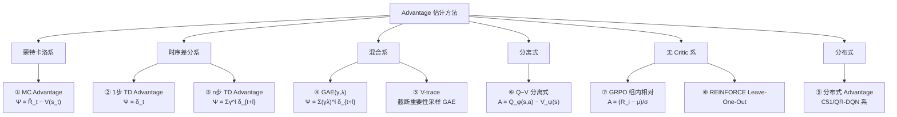
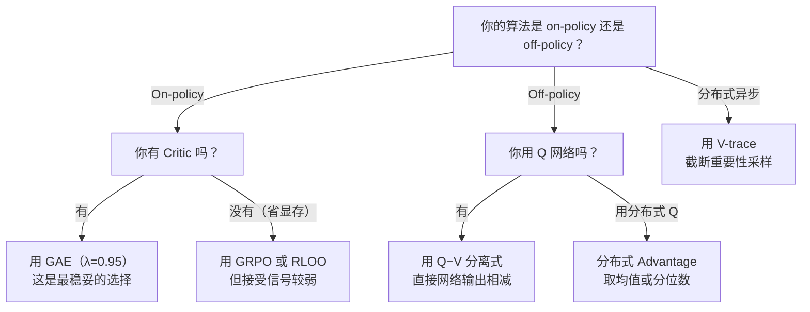

# 强化学习优势函数估计方法综述：从蒙特卡洛到 GAE，所有"打分方式"的统一视角

> **综述范围**：强化学习中所有常见的 Advantage 估计方法——MC Advantage、1 步 TD Advantage、n 步 Advantage、GAE、V-trace、GRPO 组内相对优势、Q−V 分离式等
> **关键词**：Advantage Function、Bias-Variance Tradeoff、GAE、TD Error、Baseline
> **适用读者**：了解基本 RL 概念（策略、奖励、折扣因子），想系统理解"到底有多少种方法可以估计 advantage、它们之间是什么关系"

---

## 相关阅读

在阅读本文前，建议先了解以下前置知识：

- [Q 函数与 Value 函数](/前置知识/000o_前置知识_Q函数与Value函数) — Advantage 的定义 $A(s,a)=Q(s,a)-V(s)$
- [策略梯度与 PPO](/前置知识/000a_前置知识_策略梯度与PPO) — Advantage 在策略梯度中的作用、GAE 的详细推导
- [TD 学习与 n 步回报的偏差问题](/前置知识/001k_前置知识_TD学习与n步回报的偏差问题) — n 步 TD 的偏差来源
- [GRPO](/前置知识/000m_前置知识_GRPO_Group_Relative_Policy_Optimization) — 无 Critic 的组内相对优势估计

关联文章：

- [深度强化学习方法综述](./S01_深度强化学习方法综述) — RL 算法全景
- [VLA 模型的 RL 后训练综述](./S06_VLA模型的RL后训练综述) — 各种优势估计在 VLA 中的应用
- [DPPO：扩散策略策略优化](./001_DPPO_扩散策略策略优化) — GAE 在扩散策略中的实际使用

---

## 贯穿全文的例子

> **场景**：一个机械臂在桌面上抓取方块。状态 $s$ 包含手臂关节角 + 方块位置，动作 $a$ 是 7 维末端增量 $[\Delta x, \Delta y, \Delta z, \Delta r_x, \Delta r_y, \Delta r_z, g]$。
>
> **奖励设计**：每步 $r = -0.01$（时间惩罚），成功抓取 $r = +10$。折扣因子 $\gamma = 0.99$。
>
> **具体轨迹**（后面反复使用）：
> | 时刻 $t$ | 状态描述 | 动作 | 奖励 $r_t$ | Critic 预测 $V(s_t)$ |
> |----------|---------|------|-----------|---------------------|
> | 0 | 手在方块上方 10cm | 向下移动 3cm | -0.01 | 6.0 |
> | 1 | 手在方块上方 7cm | 向下移动 3cm | -0.01 | 7.2 |
> | 2 | 手在方块上方 4cm | 向下移动 3cm | -0.01 | 8.5 |
> | 3 | 手在方块上方 1cm | 向下移动 1cm + 闭合夹爪 | -0.01 | 9.3 |
> | 4 | 夹住方块，抬起 | 抬起 2cm | +10.0 | 9.8 |
> | 5 | 任务完成 | — | — | 0 (终止) |
>
> 这条轨迹总共 5 步就成功了。后面每种方法我们都会代入这组数字算一遍。

---

## 一、为什么需要 Advantage：策略梯度的核心"打分器"

### 1.1 回顾：策略梯度需要一个"信号"

[策略梯度定理](/前置知识/000a_前置知识_策略梯度与PPO)告诉我们，策略的更新方向是：

$$
\nabla_\theta J(\theta) = \mathbb{E}_{(s_t,a_t)\sim\pi_\theta}\big[\nabla_\theta\log\pi_\theta(a_t|s_t)\cdot \Psi_t\big]
$$

**这个公式在做什么**：策略梯度的方向由两部分决定——$\nabla_\theta\log\pi_\theta(a_t|s_t)$ 是"怎么调参数能让这个动作概率变大"的方向，$\Psi_t$ 是一个标量"打分"。如果 $\Psi_t > 0$，这个动作的概率就被推高；如果 $\Psi_t < 0$，就被压低。

::: details 📐 逐符号拆解 + 数值代入（点击展开）
**逐符号拆解**：

| 符号 | 含义 | 具体是什么 |
|------|------|-----------|
| $\nabla_\theta J(\theta)$ | 目标函数对策略参数的梯度 | 指示"参数往哪个方向调，期望回报会增大" |
| $\mathbb{E}_{(s_t,a_t)\sim\pi_\theta}$ | 对策略 $\pi_\theta$ 采集的轨迹求期望 | 实际训练中通过从 replay buffer 或在线 rollout 采 mini-batch 近似 |
| $\nabla_\theta\log\pi_\theta(a_t\|s_t)$ | 对数概率的梯度（score function） | 方向：让动作 $a_t$ 在状态 $s_t$ 下的概率增大。若策略是高斯，这就是 $(a_t - \mu_\theta(s_t))/\sigma^2$ 方向 |
| $\Psi_t$ | 标量信号（"打分器"） | 可以是蒙特卡洛回报 $G_t$、Q 值 $Q(s_t,a_t)$、或优势 $A(s_t,a_t)$——本文的主题就是讨论 $\Psi_t$ 的各种选择 |

**数值代入**（用贯穿例子中 $t=3$ 时刻——"手距方块 1cm，选择向下+闭合夹爪"）：

假设策略是高斯分布 $\pi_\theta(a|s_3) = \mathcal{N}(\mu_\theta(s_3), \sigma^2)$，当前 $\mu_\theta(s_3) = 0.5$（向下 0.5cm），实际采样动作 $a_3 = 1.0$（向下 1cm+闭合），$\sigma = 0.5$：

$$
\nabla_\theta\log\pi_\theta(a_3|s_3) \propto \frac{a_3 - \mu_\theta(s_3)}{\sigma^2} = \frac{1.0 - 0.5}{0.25} = 2.0
$$

如果 $\Psi_3 = +5$（这个动作比平均好很多），梯度信号 = $2.0 \times 5 = 10$ → 参数会被大幅推向"让 $\mu$ 靠近 1.0"的方向。如果 $\Psi_3 = -1$（这个动作比平均差），梯度信号 = $2.0 \times (-1) = -2$ → 参数被推向"让 $\mu$ 远离 1.0"的方向。

**为什么是这个形式**：这就是 REINFORCE 的核心——用采样到的轨迹回报作为权重，加权 score function 求梯度。乘以 $\Psi_t$ 而不是直接最大化所有动作概率，是因为我们只想增大"好动作"的概率、压低"差动作"的概率。$\Psi_t$ 的选择决定了方差大小，这正是本文要讨论的核心问题。
:::

**核心问题**：$\Psi_t$ 到底用什么？不同的选择就对应不同的优势估计方法。

### 1.2 所有合法的 $\Psi_t$ 选择

理论上，$\Psi_t$ 可以是以下任何一种（梯度期望相同，方差不同）：

| 编号 | $\Psi_t$ 的选择 | 名称 | 方差 | 偏差 |
|------|----------------|------|------|------|
| ① | $R(\tau) = \sum_{t'=0}^T \gamma^{t'} r_{t'}$ | 轨迹总回报 | 极高 | 无 |
| ② | $\hat{R}_t = \sum_{t'=t}^T \gamma^{t'-t} r_{t'}$ | Reward-to-go | 高 | 无 |
| ③ | $\hat{R}_t - b(s_t)$ | Reward-to-go − Baseline | 中 | 无（若 $b$ 不依赖 $a$） |
| ④ | $Q^\pi(s_t, a_t) - V^\pi(s_t)$ | 真实 Advantage | 最低（理论最优） | 无 |
| ⑤ | $\hat{A}_t$（各种估计方法） | Advantage 估计 | 取决于方法 | 取决于方法 |

**关键洞察**：④ 是理论最优（方差最小且无偏），但 $Q^\pi$ 和 $V^\pi$ 都不知道真实值，需要用网络去估计——**怎么估计，就是本文要回答的核心问题**。

### 1.3 Advantage 的本质：相对比较

$$
A^\pi(s_t, a_t) = Q^\pi(s_t, a_t) - V^\pi(s_t)
$$

**这个公式在做什么**：$Q(s,a)$ 是"在状态 $s$ 做动作 $a$ 然后一直按策略走，能拿多少总分"；$V(s)$ 是"在状态 $s$ 按策略**随机选**动作，平均能拿多少分"。两者之差就是"这个具体动作比随机选的平均水平好多少"。

::: details 📐 逐符号拆解 + 数值代入（点击展开）
**逐符号拆解**：

| 符号 | 含义 | 在机械臂例子中 |
|------|------|---------------|
| $Q^\pi(s_t, a_t)$ | 在状态 $s_t$ 执行动作 $a_t$，之后按 $\pi$ 走的期望回报 | "此刻向下移 3cm，后续按策略走，平均能拿多少分" |
| $V^\pi(s_t)$ | 在状态 $s_t$ 按策略随机选动作的期望回报 | "此刻让策略随机选，平均能拿多少分" |
| $A^\pi(s_t, a_t)$ | 两者之差 | "向下移 3cm 比随机选平均好多少" |

**数值代入**：在 $t=0$ 时刻（手在方块上方 10cm），假设 $Q^\pi(s_0, \text{向下3cm})=6.5$，$V^\pi(s_0)=6.0$：

$$
A^\pi(s_0, \text{向下3cm}) = 6.5 - 6.0 = +0.5
$$

这说明"向下移 3cm"比"在这个状态下策略的平均表现"好 0.5 分——是一个好动作，应该提高它的概率。

**为什么是这个形式**：如果直接用 $Q(s,a)$ 做 $\Psi_t$，那么即使在一个"本身就很好"的状态 $s$（$V(s)$ 很高），所有动作的 $Q$ 值都很高——梯度信号会无差别地强化所有动作，学不到"哪个更好"。减掉 $V(s)$ 后，只有**真正比平均好**的动作才得到正信号，这才是有效的学习信号。
:::

---

## 二、方法全景：六大类优势估计

在深入讲解每种方法之前，先给出一张全景图。所有优势估计方法可以归为以下六大类：

下表是一个速查对比（后面各节详细展开）：

| 方法 | 需要 Critic? | 偏差 | 方差 | On/Off-Policy | 典型应用 |
|------|------------|------|------|---------------|---------|
| MC Advantage | 是（$V$） | 无偏 | 高 | On-policy | REINFORCE + baseline |
| 1 步 TD ($\delta_t$) | 是（$V$） | 有偏 | 低 | 两者 | A2C/A3C |
| $n$ 步 TD | 是（$V$） | 有偏（偏差随 $n$ 减小） | 中 | On-policy | Rainbow |
| **GAE**$(\gamma,\lambda)$ | 是（$V$） | 有偏（$\lambda<1$ 时） | 可调 | On-policy | **PPO**（最主流） |
| V-trace | 是（$V$） | 有偏（截断纠正） | 低 | Off-policy | IMPALA |
| $Q-V$ 分离 | 是（$Q$ + $V$） | 有偏 | 低 | Off-policy | SAC、TD3 |
| GRPO 组内相对 | 否 | 有偏 | 高 | On-policy | DeepSeek-R1、VLA-RL |
| RLOO | 否 | 无偏 | 中 | On-policy | LLM RLHF |
| 分布式 Advantage | 是（分布 $Q$） | 有偏 | 低 | Off-policy | C51、QR-DQN |

---

## 三、方法①：蒙特卡洛 Advantage（MC Advantage）

### 3.1 定义

蒙特卡洛优势（Monte Carlo Advantage）是最朴素的方法：跑完一整条轨迹，把**真实拿到的折扣回报**减去 Critic 的预测。

$$
\hat{A}_t^{\text{MC}} = \hat{R}_t - V_\phi(s_t) = \left(\sum_{t'=t}^{T} \gamma^{t'-t} r_{t'}\right) - V_\phi(s_t)
$$

**这个公式在做什么**：先算出"从 $t$ 时刻开始到轨迹结束，真实拿到的折扣奖励之和"，再减去 Critic 事先对这个状态的预测值。差值就是"实际表现比预期好多少"。

::: details 📐 逐符号拆解 + 数值代入（点击展开）
**逐符号拆解**：

| 符号 | 含义 | 具体对应 |
|------|------|---------|
| $\hat{R}_t$ | 从 $t$ 开始的真实折扣回报（reward-to-go） | 跑完轨迹后才能算 |
| $\sum_{t'=t}^T \gamma^{t'-t} r_{t'}$ | 对 $t$ 之后每步奖励按折扣求和 | $r_t + \gamma r_{t+1} + \gamma^2 r_{t+2} + \cdots$ |
| $V_\phi(s_t)$ | Critic 网络对状态 $s_t$ 的价值预测 | 训练中的神经网络输出 |
| $T$ | 轨迹终止时刻 | episode 结束 |

**数值代入**（用贯穿例子，计算 $t=0$ 的 MC Advantage）：

$$
\hat{R}_0 = r_0 + \gamma r_1 + \gamma^2 r_2 + \gamma^3 r_3 + \gamma^4 r_4
$$

代入 $\gamma=0.99$，奖励序列 $[-0.01, -0.01, -0.01, -0.01, +10.0]$：

$$
\hat{R}_0 = -0.01 + 0.99\times(-0.01) + 0.99^2\times(-0.01) + 0.99^3\times(-0.01) + 0.99^4\times10.0
$$

$$
= -0.01 - 0.0099 - 0.0098 - 0.0097 + 9.606 = 9.567
$$

$$
\hat{A}_0^{\text{MC}} = 9.567 - V_\phi(s_0) = 9.567 - 6.0 = +3.567
$$

**梯度方向**：$\hat{A}_0^{\text{MC}} = +3.567 > 0$，说明 $t=0$ 时刻的"向下移 3cm"这个动作，实际表现比 Critic 预期好了 3.567 分。策略梯度会增大这个动作的概率。

**为什么是这个形式**：$\hat{R}_t$ 是 $Q^\pi(s_t,a_t)$ 的无偏估计量（一条轨迹的样本），$V_\phi(s_t)$ 是 $V^\pi(s_t)$ 的近似。所以 $\hat{A}_t^{\text{MC}} \approx Q^\pi - V^\pi = A^\pi$，是 Advantage 的无偏估计（如果 $V_\phi$ 完全准确的话）。
:::

### 3.2 优缺点

| 维度 | 评价 |
|------|------|
| **偏差** | 无偏（使用真实轨迹奖励，不依赖任何估计值做"填补"） |
| **方差** | 极高（$\hat{R}_t$ 累加了整条轨迹后续所有的随机性） |
| **需要的数据** | 必须跑完整条轨迹才能计算（不能中途截断） |
| **计算代价** | 低（只需加法） |
| **适用场景** | 轨迹很短（$T \le 50$）、奖励密集的情况 |

### 3.3 方差问题的直觉

为什么说 MC Advantage 方差高？因为 $\hat{R}_t$ 的值取决于从 $t$ 到 $T$ 之间**所有**后续步骤的随机性——包括策略的随机采样和环境的随机转移。哪怕策略完全相同，同一个状态 $s_t$ 做同一个动作 $a_t$，后续轨迹可能因为一次微小的随机扰动而走向完全不同的结果。

用我们的例子说明：假设机械臂在 $t=0$ 做了相同的"向下 3cm"动作，但因为随机扰动，有两种后续可能：
- 轨迹 A：后续一路顺利，5 步抓住 → $\hat{R}_0 = 9.567$
- 轨迹 B：$t=2$ 时手指打滑，多花了 20 步 → $\hat{R}_0 \approx 7.8$

同一个 $(s_0, a_0)$ 得到了差距为 $1.77$ 的两个 $\hat{A}$ 值——这个差距完全来自 $t=0$ 之后的随机性，和 $a_0$ 本身的好坏无关。这就是方差。

---

## 四、方法②：1 步 TD Advantage

### 4.1 定义

1 步时序差分优势（1-step TD Advantage）只往前看一步，剩下的全部交给 Critic "猜"：

$$
\hat{A}_t^{\text{TD}(1)} = \delta_t = r_t + \gamma V_\phi(s_{t+1}) - V_\phi(s_t)
$$

**这个公式在做什么**：用"这一步的真实奖励 + Critic 对下一状态的估值"来构造一个 $V(s_t)$ 的新估计，再减去 Critic 当前的预测。差值就是"这一步的惊喜程度"——Bellman 等式的残差。

::: details 📐 逐符号拆解 + 数值代入（点击展开）
**逐符号拆解**：

| 符号 | 含义 | 在机械臂例子中 |
|------|------|---------------|
| $r_t$ | 第 $t$ 步即时奖励 | $-0.01$（时间惩罚） |
| $\gamma V_\phi(s_{t+1})$ | Critic 对下一状态的折扣估值 | "网络认为到了下一状态后，未来还值多少" |
| $V_\phi(s_t)$ | Critic 对当前状态的估值 | "网络认为当前状态值多少" |
| $r_t + \gamma V_\phi(s_{t+1})$ | 对 $V(s_t)$ 的"1 步展开"重估计 | "真实拿了一步 + 剩余部分让 Critic 猜" |

**数值代入**（$t=0$）：

$$
\delta_0 = r_0 + \gamma V_\phi(s_1) - V_\phi(s_0) = -0.01 + 0.99 \times 7.2 - 6.0 = -0.01 + 7.128 - 6.0 = +1.118
$$

**对比 MC 结果**：MC Advantage 算出 $+3.567$，TD(1) 只算出 $+1.118$。TD 的估计更"保守"——它没看到后面 $t=4$ 时拿到的 $+10$ 大奖励，只看到了"下一状态的 Critic 估值比当前高了一点"。

**梯度方向**：$\delta_0 = +1.118 > 0$，梯度方向和 MC 相同（增大"向下 3cm"的概率），但力度弱了很多。

**为什么是这个形式**：这就是 Bellman 方程 $V(s_t) = \mathbb{E}[r_t + \gamma V(s_{t+1})]$ 的"残差"——如果 Critic 完美，$\delta_t$ 的期望应该为 0（Bellman 方程恰好满足）。$\delta_t \ne 0$ 说明要么这一步比预期好/差，要么 Critic 不够准确。
:::

### 4.2 优缺点

| 维度 | 评价 |
|------|------|
| **偏差** | 有偏（$V_\phi(s_{t+1})$ 不等于真实 $V^\pi(s_{t+1})$，Critic 的误差直接传入） |
| **方差** | 极低（只涉及一步随机性 $r_t$ 和一步转移 $s_{t+1}$） |
| **需要的数据** | 只需一步转移 $(s_t, a_t, r_t, s_{t+1})$，不需要完整轨迹 |
| **计算代价** | 极低 |
| **适用场景** | Critic 准确时效果好；A2C/A3C 早期常用 |

### 4.3 偏差问题的直觉

为什么 1 步 TD 有偏？因为 $V_\phi(s_{t+1})$ 是一个神经网络的输出，它**不等于**真实值 $V^\pi(s_{t+1})$。训练早期 Critic 可能完全瞎猜（比如把一个很好的状态估成 0），这个错误会直接被当成"下一状态的价值"参与 advantage 计算，误导策略更新。

用我们的例子：如果训练刚开始，Critic 还很不准，把 $V_\phi(s_1)$ 从正确的 $7.2$ 错误估计成 $5.0$：

$$
\delta_0^{\text{错误}} = -0.01 + 0.99 \times 5.0 - 6.0 = -0.01 + 4.95 - 6.0 = -1.06
$$

**这个公式在做什么**：展示当 Critic 不准时（把 $V_\phi(s_1)$ 从正确的 $7.2$ 错误估成 $5.0$），TD advantage 会算出完全错误的值（从正变负），直观说明 1 步 TD 的偏差危害。

::: details 📐 逐符号拆解 + 数值代入（点击展开）
**逐符号拆解**：

| 符号 | 含义 | 具体是什么 |
|------|------|-----------|
| $\delta_0^{\text{错误}}$ | 用错误 Critic 算出的 TD advantage | 本应是正值（好动作），现在变负 |
| $-0.01$ | 即时奖励 $r_0$ | 机械臂每步的微小惩罚 |
| $0.99$ | 折扣因子 $\gamma$ | — |
| $5.0$ | **错误的** $V_\phi(s_1)$ | 训练早期 Critic 瞎猜的值（真实值是 $7.2$） |
| $6.0$ | $V_\phi(s_0)$ | 当前状态的 Critic 估值 |

**数值代入**：

正确情况：$\delta_0 = -0.01 + 0.99 \times 7.2 - 6.0 = -0.01 + 7.128 - 6.0 = +1.118$（正值，说明是好动作）

错误情况：$\delta_0^{\text{错误}} = -0.01 + 0.99 \times 5.0 - 6.0 = -0.01 + 4.95 - 6.0 = -1.06$（负值！）

**梯度方向**：正确情况下策略梯度会增大这个动作的概率；错误情况下策略梯度反而**压低**这个动作的概率——一步好棋被错误地惩罚了。

**为什么是这个形式**：这不是一个新公式，而是前面 TD advantage 公式 $\delta_t = r_t + \gamma V_\phi(s_{t+1}) - V_\phi(s_t)$ 在 Critic 估计错误时的数值演示。
:::

变成了负数！策略梯度会**错误地压低**"向下 3cm"这个明明是正确的动作的概率——这就是偏差带来的实际危害。

---

## 五、方法③：$n$ 步 TD Advantage

### 5.1 定义

$n$ 步 TD Advantage 是 MC 和 1 步 TD 之间的过渡：往前看 $n$ 步真实奖励，剩余部分用 Critic 估计。

$$
\hat{A}_t^{(n)} = \sum_{l=0}^{n-1} \gamma^l r_{t+l} + \gamma^n V_\phi(s_{t+n}) - V_\phi(s_t)
$$

**这个公式在做什么**：信任前 $n$ 步的真实奖励（因为它们已经观测到，没有估计误差），第 $n$ 步之后的未来就交给 Critic 去猜。$n$ 越大越接近 MC（越无偏但方差越大），$n$ 越小越接近 1 步 TD（越有偏但方差越低）。

::: details 📐 逐符号拆解 + 数值代入（点击展开）
**逐符号拆解**：

| 符号 | 含义 | 直觉 |
|------|------|------|
| $\sum_{l=0}^{n-1} \gamma^l r_{t+l}$ | 前 $n$ 步的折扣奖励和 | "前 $n$ 步亲眼看到的真实收入" |
| $\gamma^n V_\phi(s_{t+n})$ | 第 $n$ 步之后由 Critic 估计的折扣剩余价值 | "第 $n$ 步之后让网络猜" |
| $V_\phi(s_t)$ | 当前状态的 Critic 估值（被减去） | "原本的预期" |
| $n$ | 展望步数 | 越大→越信任真实奖励→越接近 MC |

**数值代入**（$t=0$, $n=3$）：

$$
\hat{A}_0^{(3)} = r_0 + \gamma r_1 + \gamma^2 r_2 + \gamma^3 V_\phi(s_3) - V_\phi(s_0)
$$

$$
= -0.01 + 0.99\times(-0.01) + 0.99^2\times(-0.01) + 0.99^3\times9.3 - 6.0
$$

$$
= -0.01 - 0.0099 - 0.0098 + 9.022 - 6.0 = +2.992
$$

对比：MC 给出 $+3.567$，TD(1) 给出 $+1.118$，3 步 TD 给出 $+2.992$——果然在两者之间。

**为什么 3 步的结果更接近 MC 而非 TD(1)**：因为这条轨迹很短（只有 5 步），3 步已经看到了大部分信息，只有最后 2 步交给 Critic 估计。如果轨迹更长（比如 100 步），$n=3$ 和 MC 的差距就会大得多。
:::

### 5.2 不同 $n$ 值的权衡

| $n$ | 看到的真实步数 | 偏差来源 | 方差来源 | 等价于 |
|-----|-------------|---------|---------|--------|
| 1 | 只有 $r_t$ | $V_\phi(s_{t+1})$ 不准 | 只有 $r_t$ 和 $s_{t+1}$ 的随机性 | 1 步 TD |
| 3 | $r_t, r_{t+1}, r_{t+2}$ | $V_\phi(s_{t+3})$ 不准 | 3 步的累积随机性 | — |
| $T-t$ | 全部 | 无（没用 Critic） | 整条轨迹的随机性 | MC |

### 5.3 实践中的问题

$n$ 步 TD 有一个尴尬：**$n$ 是固定的超参数**。但最优的 $n$ 取决于"Critic 多准"和"环境方差多大"——这两个东西随训练进度变化。训练初期 Critic 很差，应该用大 $n$（多信任真实奖励）；训练后期 Critic 变准了，应该用小 $n$（少累积方差）。固定 $n$ 在两个阶段都不是最优的。

**这正是 GAE 要解决的问题**——用一个可调参数 $\lambda$ 把所有 $n$ 值混在一起。

---

## 六、方法④：广义优势估计 GAE（Generalized Advantage Estimation）

### 6.1 核心思想

GAE（Schulman et al., 2015）的核心洞察：**不选一个固定的 $n$，而是把所有 $n$ 的估计按指数衰减权重混合**。近处的估计权重大（因为涉及更少的 Critic 估计误差和更少的随机性累积），远处的估计权重小。

$$
\hat{A}_t^{\text{GAE}(\gamma,\lambda)} = \sum_{l=0}^{T-t-1} (\gamma\lambda)^l \delta_{t+l}
$$

**这个公式在做什么**：把每一步的 TD 误差 $\delta_{t+l}$（"那一步比 Critic 预期好多少"）从当前时刻开始逐步累加，但越远的贡献按 $(\gamma\lambda)^l$ 指数衰减。$\lambda$ 控制"愿意往后看多远"——$\lambda=0$ 只看当前一步，$\lambda=1$ 看到轨迹末尾。

::: details 📐 逐符号拆解 + 数值代入（点击展开）
**逐符号拆解**：

| 符号 | 含义 | 典型值 |
|------|------|--------|
| $\delta_{t+l} = r_{t+l} + \gamma V_\phi(s_{t+l+1}) - V_\phi(s_{t+l})$ | 第 $t+l$ 步的 TD 误差 | 每一步都能算出一个 |
| $(\gamma\lambda)^l$ | 第 $l$ 步的衰减权重 | $\gamma=0.99,\lambda=0.95$ 时 $(\gamma\lambda)^l = 0.9405^l$ |
| $\lambda \in [0,1]$ | GAE 超参数，控制 bias-variance 权衡 | 实践中通常 $0.95$ 或 $0.97$ |
| $T-t-1$ | 从当前到轨迹结束的步数 | 实际截断位置 |

**数值代入**（$t=0$, $\gamma=0.99$, $\lambda=0.95$）：

先算每一步的 TD 误差：

| $l$ | $\delta_{t+l}$ | 计算过程 |
|-----|---------------|---------|
| 0 | $\delta_0 = r_0 + \gamma V(s_1) - V(s_0) = -0.01 + 0.99\times7.2 - 6.0 = +1.118$ | |
| 1 | $\delta_1 = r_1 + \gamma V(s_2) - V(s_1) = -0.01 + 0.99\times8.5 - 7.2 = +1.205$ | |
| 2 | $\delta_2 = r_2 + \gamma V(s_3) - V(s_2) = -0.01 + 0.99\times9.3 - 8.5 = +0.697$ | |
| 3 | $\delta_3 = r_3 + \gamma V(s_4) - V(s_3) = -0.01 + 0.99\times9.8 - 9.3 = +0.392$ | |
| 4 | $\delta_4 = r_4 + \gamma V(s_5) - V(s_4) = +10.0 + 0.99\times0 - 9.8 = +0.200$ | 终止状态 $V=0$ |

然后按 GAE 公式加权求和（$\gamma\lambda = 0.99\times0.95 = 0.9405$）：

$$
\hat{A}_0^{\text{GAE}} = 1.0\times1.118 + 0.9405\times1.205 + 0.9405^2\times0.697 + 0.9405^3\times0.392 + 0.9405^4\times0.200
$$

逐项计算：
- $l=0$: $1.0 \times 1.118 = 1.118$
- $l=1$: $0.9405 \times 1.205 = 1.133$
- $l=2$: $0.8845 \times 0.697 = 0.616$
- $l=3$: $0.8319 \times 0.392 = 0.326$
- $l=4$: $0.7823 \times 0.200 = 0.156$

$$
\hat{A}_0^{\text{GAE}} = 1.118 + 1.133 + 0.616 + 0.326 + 0.156 = 3.349
$$

**对比所有方法**：

| 方法 | $\hat{A}_0$ 的值 | 备注 |
|------|----------------|------|
| MC | $+3.567$ | 无偏但方差最高 |
| **GAE**($\lambda=0.95$) | $+3.349$ | 接近 MC 但稍有偏差（$\lambda<1$ 的代价） |
| 3 步 TD | $+2.992$ | |
| 1 步 TD | $+1.118$ | 偏差最大但方差最低 |

GAE 的结果（$3.349$）非常接近 MC（$3.567$），因为 $\lambda=0.95$ 接近 1（接近 MC 端）。如果把 $\lambda$ 调低到 $0.5$，结果会更接近 TD(1)。

**为什么是 $(\gamma\lambda)^l$ 这个衰减形式**：$\gamma^l$ 是折扣因子本身的自然衰减（奖励天然要打折），$\lambda^l$ 是额外引入的"对远处 TD 误差的信任度衰减"。两者相乘使得远处的 $\delta$ 贡献双重衰减，是 Schulman 等人从 TD($\lambda$) 理论中推导出的最优形式。
:::

### 6.2 $\lambda$ 的选择指南

| $\lambda$ 值 | 等价于 | 偏差 | 方差 | 适用场景 |
|-------------|--------|------|------|---------|
| $0$ | 1 步 TD | 高（完全依赖 Critic） | 极低 | Critic 非常准时 |
| $0.5$ | 中等混合 | 中 | 中 | 少见 |
| $0.9$ | 偏 MC | 低 | 较高 | 常见选择 |
| $\mathbf{0.95}$ | **PPO 默认** | 很低 | 较高 | **最常用** |
| $0.97$ | 接近 MC | 极低 | 高 | 长 horizon 任务 |
| $1.0$ | 纯 MC | 无 | 最高 | 轨迹极短时 |

**实践经验**：
- PPO 论文默认 $\lambda=0.95$，大多数机器人 RL 工作沿用
- 长 horizon 任务（$T > 200$）可以试 $\lambda=0.97$（因为需要看更远）
- 如果 Critic 训练得特别好（比如先用大量 offline 数据预训练），可以降到 $\lambda=0.9$ 减少方差
- 极短轨迹（$T < 20$）直接用 $\lambda=1$（MC）也可以，因为方差不高

### 6.3 GAE 的高效递归实现

$$
\hat{A}_t^{\text{GAE}} = \delta_t + \gamma\lambda \cdot \hat{A}_{t+1}^{\text{GAE}}
$$

**这个公式在做什么**：把 $O(T^2)$ 的前向求和变成 $O(T)$ 的从后往前递推——当前时刻的 GAE 等于"这一步的 TD 误差"加上"下一时刻已经算好的 GAE 打一次折"。

::: details 📐 逐符号拆解 + 数值代入（点击展开）
**逐符号拆解**：

| 符号 | 含义 |
|------|------|
| $\hat{A}_t^{\text{GAE}}$ | 当前时刻要算的 GAE 值 |
| $\delta_t$ | 当前时刻的 TD 误差（一步信息） |
| $\gamma\lambda$ | 衰减系数，把未来的 GAE 折算回当前 |
| $\hat{A}_{t+1}^{\text{GAE}}$ | 下一时刻已经（从后往前）算好的 GAE 值 |

**数值验证**（从后往前递推）：

- $\hat{A}_4^{\text{GAE}} = \delta_4 = 0.200$（最后一步，没有未来）
- $\hat{A}_3^{\text{GAE}} = \delta_3 + 0.9405 \times \hat{A}_4 = 0.392 + 0.9405 \times 0.200 = 0.392 + 0.188 = 0.580$
- $\hat{A}_2^{\text{GAE}} = \delta_2 + 0.9405 \times \hat{A}_3 = 0.697 + 0.9405 \times 0.580 = 0.697 + 0.545 = 1.242$
- $\hat{A}_1^{\text{GAE}} = \delta_1 + 0.9405 \times \hat{A}_2 = 1.205 + 0.9405 \times 1.242 = 1.205 + 1.168 = 2.373$
- $\hat{A}_0^{\text{GAE}} = \delta_0 + 0.9405 \times \hat{A}_1 = 1.118 + 0.9405 \times 2.373 = 1.118 + 2.232 = 3.350$

和直接求和（$3.349$）误差在浮点精度范围内，验证了递推写法正确。
:::

### 6.4 GAE 是当前 On-Policy RL 的事实标准

几乎所有主流 on-policy 算法都使用 GAE：PPO、DPPO、TRPO、VLA-RL、SimpleVLA-RL 等。原因很简单——它是**唯一一个能用单个超参数 $\lambda$ 平滑调节 bias-variance 的方法**，且有高效递归实现，几乎零额外计算开销。

---

## 七、方法⑤：V-trace（截断重要性采样修正）

### 7.1 动机：Off-Policy 下 GAE 的失效

GAE 假设数据是 on-policy 的——即产生数据的策略 $\mu$ 和正在优化的策略 $\pi$ 是同一个。但在分布式训练中（如 IMPALA 架构），多个 actor 异步收集数据，当 learner 拿到数据时，策略可能已经更新了好几轮——**数据是 off-policy 的**。此时直接用 GAE 会引入额外偏差。

V-trace（Espeholt et al., 2018, IMPALA 论文）专门解决这个问题：在 GAE 的基础上加入**截断的重要性采样比**来纠正分布偏移。

### 7.2 定义

$$
\hat{A}_t^{\text{V-trace}} = \sum_{l=0}^{T-t-1} \left(\gamma\lambda\right)^l \left(\prod_{i=0}^{l-1} c_{t+i}\right) \rho_{t+l}\, \delta_{t+l}^{\mu}
$$

**这个公式在做什么**：和 GAE 几乎一样的结构（$(\gamma\lambda)^l$ 衰减、TD 误差求和），但每一项额外乘了两类截断系数：$\rho$ 修正"这个动作在新旧策略下概率不同"的偏差，$c$ 修正"后续步也用了旧策略"的累积偏差。截断（$\min$）保证单个权重不会爆炸。

::: details 📐 逐符号拆解 + 数值代入（点击展开）
**逐符号拆解**：

| 符号 | 含义 | 直觉 |
|------|------|------|
| $\mu(a_t\|s_t)$ | 行为策略（收集数据时的旧策略）选 $a_t$ 的概率 | "数据是在什么策略下采的" |
| $\pi(a_t\|s_t)$ | 目标策略（当前正在优化的策略）选 $a_t$ 的概率 | "我们真正想优化的策略觉得这个动作概率多大" |
| $\pi/\mu$ | 重要性采样比 | 新策略比旧策略更喜欢这个动作→权重 >1 |
| $\bar{\rho}$, $\bar{c}$ | 截断上限（典型值 $\bar{\rho}=1.0$, $\bar{c}=1.0$） | 防止单个权重过大导致方差爆炸 |
| $\rho_t$ | 截断后的重要性权重，修正当前步 | "这一步的数据有多'过时'，截断后的校正" |
| $c_t$ | 截断后的 trace 权重，控制往后传播多远 | "旧数据能被信任到什么程度" |
| $\prod_{i=0}^{l-1} c_{t+i}$ | trace 权重的连乘 | 累积多步后如果数据太旧，权重会被压到接近 0 |
| $\delta_{t+l}^\mu$ | 第 $t+l$ 步的 TD 误差 | $r_{t+l} + \gamma V(s_{t+l+1}) - V(s_{t+l})$，和 GAE 中的 $\delta$ 完全相同 |

**数值代入**（简化示例）：假设行为策略 $\mu$ 在某状态选"向下 3cm"概率 $0.7$，当前策略 $\pi$ 概率 $0.9$，$\bar\rho=\bar c=1.0$，$\delta_t=0.3$, $\delta_{t+1}=0.1$, $\gamma=0.99$, $\lambda=0.95$：

- $\pi/\mu = 0.9/0.7 = 1.286$，截断后 $\rho_t = c_t = \min(1.0, 1.286) = 1.0$
- 第 $l=0$ 项：$(\gamma\lambda)^0 \cdot 1 \cdot \rho_t \cdot \delta_t = 1 \times 1.0 \times 0.3 = 0.3$
- 第 $l=1$ 项：$(\gamma\lambda)^1 \cdot c_t \cdot \rho_{t+1} \cdot \delta_{t+1} = 0.9405 \times 1.0 \times 1.0 \times 0.1 = 0.094$
- 合计：$\hat{A}_t \approx 0.3 + 0.094 = 0.394$

由于截断为 1.0，这一步的 V-trace 退化为普通 GAE。只有当 $\pi/\mu < 1$（新策略不太喜欢这个旧数据的动作）时，$\rho < 1$ 才会把这一步的贡献**缩小**——直觉上合理：旧策略选了一个新策略不太认同的动作，那这步的经验就不太值得信任。

**为什么要截断而不用完整的重要性采样比**：如果 $\pi/\mu$ 非常大（比如 10），不截断的话单个样本权重过大，会导致梯度估计方差爆炸。截断牺牲了一点偏差来换取方差可控——和 PPO 的 clip 思路异曲同工。
:::

其中截断系数 $\rho_t$ 和 $c_t$ 的定义为：

$$
\rho_t = \min\left(\bar{\rho},\; \frac{\pi(a_t|s_t)}{\mu(a_t|s_t)}\right), \quad c_t = \min\left(\bar{c},\; \frac{\pi(a_t|s_t)}{\mu(a_t|s_t)}\right)
$$

**这个公式在做什么**：对原始重要性采样比 $\pi/\mu$ 取 $\min$ 截断——$\rho_t$ 用于修正当前步 TD 误差的权重，$c_t$ 用于控制多步 trace 的传播衰减。两者区别仅在截断上限可以不同（实践中通常都设为 1.0）。

::: details 📐 逐符号拆解 + 数值代入（点击展开）
**逐符号拆解**：

| 符号 | 含义 | 典型值 |
|------|------|--------|
| $\bar{\rho}$ | $\rho$ 的截断上限 | IMPALA 默认 1.0 |
| $\bar{c}$ | $c$ 的截断上限 | IMPALA 默认 1.0 |
| $\pi(a_t\|s_t)/\mu(a_t\|s_t)$ | 原始重要性采样比 | 范围 $(0, +\infty)$ |

**数值代入**：

场景 1（新策略更喜欢这个动作）：$\pi=0.9$, $\mu=0.3$, $\bar\rho=1.0$

$$
\rho_t = \min(1.0,\; 0.9/0.3) = \min(1.0, 3.0) = 1.0
$$

→ 截断生效，权重被压到 1.0，防止这个样本主导梯度。

场景 2（新策略不太认同这个动作）：$\pi=0.2$, $\mu=0.8$, $\bar\rho=1.0$

$$
\rho_t = \min(1.0,\; 0.2/0.8) = \min(1.0, 0.25) = 0.25
$$

→ 不触发截断，权重 0.25 自然缩小了这步 TD 误差的贡献——新策略认为这个动作不好，所以不太信任这步的经验。

**为什么是这个形式**：$\min$ 截断是最简单的方差控制手段——比完整 IS 低方差，比完全忽略 off-policy 低偏差，是一个偏差-方差的折中点。
:::

TD 误差 $\delta_t^\mu$ 的定义和 GAE 中完全一致：

$$
\delta_t^\mu = r_t + \gamma V_\phi(s_{t+1}) - V_\phi(s_t)
$$

**这个公式在做什么**：单步 TD 误差——"实际拿到的即时奖励 + 下一状态的折扣价值估计"减去"当前状态的价值估计"，衡量 Critic 在这一步的预测误差。正值意味着"比 Critic 预期的好"，负值意味着"比预期的差"。

::: details 📐 逐符号拆解 + 数值代入（点击展开）
**逐符号拆解**：

| 符号 | 含义 | 具体是什么 |
|------|------|-----------|
| $r_t$ | 第 $t$ 步环境返回的即时奖励 | 标量，如机器人移动 1cm 得 +0.01 |
| $\gamma$ | 折扣因子 | 典型值 0.99 |
| $V_\phi(s_{t+1})$ | Critic 对下一状态的价值估计 | 神经网络输出的标量 |
| $V_\phi(s_t)$ | Critic 对当前状态的价值估计 | 神经网络输出的标量 |

**数值代入**：$r_t = 0.5$, $\gamma = 0.99$, $V_\phi(s_{t+1}) = 8.0$, $V_\phi(s_t) = 8.2$：

$$
\delta_t^\mu = 0.5 + 0.99 \times 8.0 - 8.2 = 0.5 + 7.92 - 8.2 = 0.22
$$

正值 → 这一步的实际收益比 Critic 预期稍好。

**为什么是这个形式**：这就是标准的 TD(0) 误差，是所有基于 TD 的优势估计方法的基本构建块。
:::

### 7.3 与 GAE 的关系

| 条件 | V-trace 退化为 |
|------|---------------|
| $\mu = \pi$（on-policy） | 所有 $\rho=c=1$，退化为标准 GAE |
| $\bar\rho = \bar c = \infty$（不截断） | 完整重要性采样修正的 GAE（无偏但高方差） |
| $\bar\rho = \bar c = 1$（强截断，IMPALA 默认） | 保守修正，偏差可控 |

### 7.4 适用场景

V-trace 主要用于**大规模分布式训练**（IMPALA、SEED RL）——几百个 actor 异步采数据、一个中心 learner 更新参数。数据延迟导致 actor 用的策略可能比 learner 当前的策略旧好几个版本。V-trace 通过截断重要性采样把这种"版本差"的影响控制住。

在 VLA/机器人领域，由于 rollout 通常是同步的（或仅有很小延迟），V-trace 用得较少，GAE 是主流。

---

## 八、方法⑥：$Q - V$ 分离式 Advantage

### 8.1 定义

在 off-policy actor-critic 算法（如 [SAC](/前置知识/000k_前置知识_SAC_Soft_Actor_Critic)、[DDPG](/前置知识/000p_前置知识_DDPG_确定性策略梯度)、[TD3](/前置知识/000q_前置知识_TD3)）中，Advantage 不通过 GAE 计算，而是**直接用 Q 网络和 V 网络的输出相减**：

$$
\hat{A}(s_t, a_t) = Q_\phi(s_t, a_t) - V_\psi(s_t)
$$

**这个公式在做什么**：直接回到 Advantage 的定义——$Q$ 值减去 $V$ 值。不需要跑完轨迹，不需要计算 TD 误差序列。只需要两个网络各做一次前向传播。

::: details 📐 逐符号拆解 + 数值代入（点击展开）
**逐符号拆解**：

| 符号 | 含义 | 在 SAC 中具体是什么 |
|------|------|-------------------|
| $Q_\phi(s_t, a_t)$ | Q 网络对 $(s_t, a_t)$ 的价值估计 | 两个 Q 网络取 min 的输出 |
| $V_\psi(s_t)$ | V 网络对状态 $s_t$ 的价值估计 | 或用 $\mathbb{E}_{a'\sim\pi}[Q(s_t,a')]$ 代替 |

**数值代入**：假设 SAC 在 $t=0$ 时，$Q_\phi(s_0, \text{向下3cm}) = 6.8$，$V_\psi(s_0) = 6.1$：

$$
\hat{A}(s_0, \text{向下3cm}) = 6.8 - 6.1 = +0.7
$$

正值 → "向下 3cm"这个动作比该状态下的平均表现好 0.7。

**为什么是这个形式**：这是 Advantage 定义的直接计算，没有任何近似。偏差完全来自 $Q_\phi$ 和 $V_\psi$ 本身的训练误差。
:::

或者在只有 Q 网络的情况下（SAC 的常见实现），用策略下 Q 值的期望代替 $V$：

$$
\hat{A}(s_t, a_t) = Q_\phi(s_t, a_t) - \mathbb{E}_{a'\sim\pi}[Q_\phi(s_t, a')]
$$

**这个公式在做什么**：当没有独立 V 网络时，用"从当前策略采样若干动作算 Q 值平均"来代替 $V(s_t)$——本质上是用蒙特卡洛近似 $V = \mathbb{E}_\pi[Q]$。

::: details 📐 逐符号拆解 + 数值代入（点击展开）
**逐符号拆解**：

| 符号 | 含义 | 具体是什么 |
|------|------|-----------|
| $Q_\phi(s_t, a_t)$ | Q 网络对实际执行动作的估值 | 前向传播一次得到 |
| $\mathbb{E}_{a'\sim\pi}[Q_\phi(s_t, a')]$ | 当前策略下 Q 值的期望 | 采样 $N$ 个动作算平均近似 |

**数值代入**：$Q_\phi(s_0, \text{向下3cm}) = 6.8$，策略在 $s_0$ 采样 10 个动作算出 $\mathbb{E}_{a'}[Q(s_0,a')] = 6.1$：

$$
\hat{A}(s_0, \text{向下3cm}) = 6.8 - 6.1 = +0.7
$$

**对比 GAE 的 $+3.349$**：为什么差这么多？因为 Q 网络是通过 1 步 TD 目标训练的（$Q \leftarrow r + \gamma Q'(s', a')$），它本身内化了"只看一步"的特性——**Q 网络的输出已经是对整个未来的估计**，不需要再像 GAE 那样手动往后展望。但这也意味着如果 Q 网络不准，偏差会全部反映在结果里。

**为什么是这个形式**：省去独立 V 网络的存储和训练成本，用 Q 网络+采样近似代替。
:::

### 8.2 何时用 $Q-V$ 而非 GAE

| 场景 | 用 GAE | 用 $Q-V$ |
|------|--------|----------|
| On-policy（PPO） | ✅ | ❌（没有 Q 网络） |
| Off-policy（SAC/TD3） | ❌（需要完整轨迹） | ✅ |
| Replay buffer 复用旧数据 | 不适用（数据是 off-policy 的） | ✅ |
| 连续动作 + 高采样效率 | — | ✅ |

**核心区别**：GAE 需要一段连续轨迹（因为要计算 $\delta_t, \delta_{t+1}, \ldots$ 的序列），off-policy 算法从 replay buffer 采的是散乱的 $(s,a,r,s')$ 四元组，用不了 GAE。$Q-V$ 只需要单步数据就能算。

### 8.3 Double Q 技巧

在实践中，SAC/TD3 不直接用单个 $Q$ 网络，而是维护两个 Q 网络取 min（减少 Q 值过估计）：

$$
\hat{A}(s_t, a_t) = \min(Q_{\phi_1}(s_t, a_t),\; Q_{\phi_2}(s_t, a_t)) - V_\psi(s_t)
$$

**这个公式在做什么**：用两个 Q 网络的较小值来计算 Advantage——取 min 是为了对抗 Q 值过估计（overestimation），让 Advantage 估计偏保守而非偏乐观。

::: details 📐 逐符号拆解 + 数值代入（点击展开）
**逐符号拆解**：

| 符号 | 含义 | 具体是什么 |
|------|------|-----------|
| $Q_{\phi_1}$, $Q_{\phi_2}$ | 两个独立训练的 Q 网络 | 结构相同，初始化不同，各自独立更新 |
| $\min(\cdot, \cdot)$ | 取较小值 | 保守估计：两个网络意见不一时，信较悲观的那个 |
| $V_\psi(s_t)$ | V 网络的状态价值估计 | 或用 $\mathbb{E}_{a'\sim\pi}[\min(Q_1, Q_2)]$ 代替 |

**数值代入**：$Q_{\phi_1}(s_0, a) = 7.2$，$Q_{\phi_2}(s_0, a) = 6.5$，$V_\psi(s_0) = 6.1$：

$$
\hat{A} = \min(7.2, 6.5) - 6.1 = 6.5 - 6.1 = +0.4
$$

如果只用 $Q_{\phi_1}$，Advantage 会是 $7.2 - 6.1 = 1.1$——过估计会让策略过于激进地强化这个动作。取 min 后 $+0.4$ 更保守。

**为什么是这个形式**：单个 Q 网络容易因 bootstrapping 误差累积而系统性地高估 Q 值（函数逼近 + max 操作的正偏差）。两个独立网络的高估不太可能在同一个 $(s,a)$ 上同时发生，取 min 就能有效压制这种偏差。这是 TD3（Twin Delayed DDPG）的核心思想。
:::

这是 TD3 的核心贡献之一，直接减少了 Advantage 估计中的正偏差。

---

## 九、方法⑦：GRPO 组内相对 Advantage（无 Critic）

### 9.1 动机

[GRPO（Group Relative Policy Optimization）](/前置知识/000m_前置知识_GRPO_Group_Relative_Policy_Optimization)（DeepSeek, 2024）的出发点是：**训练和维护 Critic 太贵了**（对 7B 的 VLA/LLM 来说显存翻倍），能不能不要 Critic 也能估计 advantage？

答案：**可以，用同一输入的多次采样互相比较**。

### 9.2 定义

对同一个输入（状态/prompt），采样 $G$ 条轨迹（或回复），每条获得一个 outcome reward $R_i$：

$$
\hat{A}_i^{\text{GRPO}} = \frac{R_i - \mu_G}{\sigma_G}
$$

其中 $\mu_G = \frac{1}{G}\sum_{j=1}^G R_j$，$\sigma_G = \sqrt{\frac{1}{G}\sum_{j=1}^G (R_j - \mu_G)^2}$。

**这个公式在做什么**：在这一组采样内部做 z-score 归一化——比组内平均好的轨迹得到正 advantage，比平均差的得到负 advantage。不需要 Critic，只需要一组轨迹互相比较。

::: details 📐 逐符号拆解 + 数值代入（点击展开）
**逐符号拆解**：

| 符号 | 含义 | 直觉 |
|------|------|------|
| $G$ | 组内采样数（典型值 4~16） | "对同一个任务跑几次" |
| $R_i$ | 第 $i$ 条轨迹的 outcome reward | 通常是 0/1 的 success/fail |
| $\mu_G$ | 组内平均奖励 | "这组的平均水平" |
| $\sigma_G$ | 组内标准差 | "这组的差异程度" |
| $\hat{A}_i$ | 归一化后的相对优势 | ">0 = 比同伴好，<0 = 比同伴差" |

**数值代入**：机械臂执行"抓方块"任务，组内 $G=8$ 条轨迹的奖励：$[0, 0, 1, 0, 0, 0, 1, 0]$

$$
\mu_G = \frac{0+0+1+0+0+0+1+0}{8} = 0.25
$$

$$
\sigma_G = \sqrt{\frac{6\times(0-0.25)^2 + 2\times(1-0.25)^2}{8}} = \sqrt{\frac{6\times0.0625 + 2\times0.5625}{8}} = \sqrt{\frac{1.5}{8}} = 0.433
$$

- 成功轨迹（$R=1$）的 advantage：$\hat{A} = \frac{1-0.25}{0.433} = +1.73$
- 失败轨迹（$R=0$）的 advantage：$\hat{A} = \frac{0-0.25}{0.433} = -0.577$

**为什么是这个形式**：z-score 归一化确保 advantage 均值为 0、标准差为 1，让 PPO 的 clip 超参数 $\epsilon$ 在不同 batch 间具有一致的约束力度。
:::

### 9.3 轨迹级 vs Token 级

在 VLA/LLM 场景中，GRPO 有两种粒度：

| 粒度 | 做法 | 代表工作 |
|------|------|---------|
| **轨迹级** | 整条轨迹一个 advantage，分配给每个 token | TGRPO、RIPT-VLA |
| **Token 级** | 每个 token 独立估计 advantage（需要 token 级 reward） | 标准 LLM GRPO |

机器人任务通常只有轨迹终点的 sparse reward，所以只能用轨迹级——**每条轨迹内所有时间步共享同一个 advantage 值**。

### 9.4 GRPO 的根本局限

GRPO 的信号完全来自"组内比较"。当组内大部分轨迹都失败时（reward 全是 0），信号极弱：

- $G=8$，全失败：$\mu=0$，$\sigma=0$，**无法计算 advantage**（分母为 0）
- $G=8$，7 失败 1 成功：只有两个 advantage 值（$+1.73$ 和 $-0.577$），信号粗糙
- $G=8$，4 成功 4 失败：$\hat{A} \in \{+1, -1\}$，信号最丰富

**对比 GAE**：GAE 在即使只有 1 条轨迹时也能提供每一步的 advantage 信号（因为 Critic 提供了 per-step 的 baseline），而 GRPO 在 sparse reward 下信息量严重不足。这是为什么在机器人 RL 中 PPO+GAE 仍然是主流（参见 [What Can RL Bring to VLA](./009_What_Can_RL_Bring_VLA泛化实证研究) 的实验结论：PPO 显著优于 GRPO）。

---

## 十、方法⑧：REINFORCE Leave-One-Out (RLOO)

### 10.1 动机

RLOO（Kool et al., 2019）是 GRPO 的一个理论更优的变体，同样不需要 Critic，但比 GRPO 的 z-score 归一化有更好的方差性质。

### 10.2 定义

对同一输入采样 $K$ 条轨迹，第 $i$ 条的 advantage 用**除自己以外的其他所有轨迹的均值**作为 baseline：

$$
\hat{A}_i^{\text{RLOO}} = R_i - \frac{1}{K-1}\sum_{j \ne i} R_j
$$

**这个公式在做什么**：用"其他同伴的平均成绩"作为 baseline 来评价第 $i$ 条轨迹。和 GRPO 的 z-score 相比，RLOO 不做标准差归一化，但用 leave-one-out 均值代替全组均值——这避免了"自己的分数影响自己的 baseline"的微妙偏差。

::: details 📐 逐符号拆解 + 数值代入（点击展开）
**逐符号拆解**：

| 符号 | 含义 | 和 GRPO 的区别 |
|------|------|---------------|
| $R_i$ | 第 $i$ 条轨迹的奖励 | 相同 |
| $\frac{1}{K-1}\sum_{j\ne i} R_j$ | 除第 $i$ 条外所有轨迹的均值 | GRPO 用的是包含 $i$ 的全组均值 $\mu_G$ |
| 无 $\sigma$ 归一化 | — | GRPO 还除以 $\sigma_G$ |

**数值代入**：同样 8 条轨迹 $[0, 0, 1, 0, 0, 0, 1, 0]$，看第 3 条（$R_3=1$）：

$$
\hat{A}_3^{\text{RLOO}} = 1 - \frac{0+0+0+0+0+1+0}{7} = 1 - \frac{1}{7} = 1 - 0.143 = +0.857
$$

看第 1 条（$R_1=0$）：

$$
\hat{A}_1^{\text{RLOO}} = 0 - \frac{0+1+0+0+0+1+0}{7} = 0 - \frac{2}{7} = -0.286
$$

**对比 GRPO**：GRPO 给成功轨迹 $+1.73$，RLOO 给 $+0.857$——数值不同但符号相同。RLOO 的优势在于它是**无偏的** baseline 估计量（可以证明 leave-one-out 均值满足无偏 baseline 条件），而 GRPO 的 z-score 因为除以了依赖数据的 $\sigma_G$ 引入了微小偏差。
:::

### 10.3 RLOO vs GRPO

| 维度 | GRPO | RLOO |
|------|------|------|
| Baseline | 全组均值 $\mu_G$（含自己） | Leave-one-out 均值（不含自己） |
| 归一化 | 除以 $\sigma_G$ | 不归一化 |
| 偏差 | 微小偏差（$\sigma$ 引入） | 无偏 |
| 方差 | 略低（因为归一化压缩了幅度） | 略高 |
| 实践效果 | 与 RLOO 差异不大 | LLM 领域实验表明与 GRPO 接近 |
| 实现复杂度 | 简单 | 同样简单 |

在实践中两者差距不大，GRPO 因为 DeepSeek-R1 的影响力使用更广泛。

---

## 十一、方法⑨：分布式 Advantage

### 11.1 动机

前面所有方法估计的都是一个**标量** advantage——"这个动作比平均好多少**分**"。但一个标量丢失了重要信息：**不确定性有多大？**

比如两个动作：
- 动作 A：advantage 期望 $+2$，但方差很大（可能 $-5$ 到 $+9$）
- 动作 B：advantage 期望 $+2$，方差很小（稳定在 $+1$ 到 $+3$）

如果只看标量 advantage，两者相同。但风险规避的策略应该更喜欢 B。

### 11.2 分布式 Q 学习

[分布式值函数](/前置知识/002q_前置知识_分布式值函数与类别化回报预测)方法（C51、QR-DQN、IQN）不学 $Q(s,a)$ 的期望值，而是学 $Q(s,a)$ 的**整个分布** $Z(s,a)$：

$$
Q(s,a) = \mathbb{E}[Z(s,a)], \quad \text{但 } Z(s,a) \text{ 本身是一个随机变量}
$$

**这个公式在做什么**：标准 Q 函数只是回报分布 $Z(s,a)$ 的期望值。分布式方法直接学习整个分布 $Z$，保留了方差、偏度等更丰富的信息。

::: details 📐 逐符号拆解 + 数值代入（点击展开）
**逐符号拆解**：

| 符号 | 含义 | 具体是什么 |
|------|------|-----------|
| $Z(s,a)$ | 回报的随机变量（一个分布） | 执行动作 $a$ 后未来总回报的完整分布，而非一个标量 |
| $\mathbb{E}[Z(s,a)]$ | 该分布的期望 | 就是传统的 $Q(s,a)$ 值 |
| $Q(s,a)$ | 标量 Q 值 | 分布 $Z$ 的均值，丢掉了方差等高阶信息 |

**数值代入**：假设动作 A 的回报分布为"50% 概率回报 10，50% 概率回报 0"，则 $Q(s, A) = \mathbb{E}[Z] = 0.5 \times 10 + 0.5 \times 0 = 5$。动作 B 的回报确定为 5，$Q(s, B) = 5$。两者 Q 值相同，但 $Z(s,A)$ 方差为 25，$Z(s,B)$ 方差为 0——分布式方法能区分这种差异。

**为什么是这个形式**：说明标量 Q 只是分布的一个统计量（均值），分布式方法保留了完整信息，可以用于风险敏感的决策。
:::

Advantage 可以从分布中提取：

$$
\hat{A}(s,a) = \mathbb{E}[Z(s,a)] - \mathbb{E}_{a'\sim\pi}[\mathbb{E}[Z(s,a')]]
$$

**这个公式在做什么**：从分布式 Q 值中提取 Advantage——把当前动作的期望回报减去策略下所有动作的平均期望回报。形式上和标量 $Q-V$ 完全一致，只是底层的 $Q$ 现在来自分布的均值。

::: details 📐 逐符号拆解 + 数值代入（点击展开）
**逐符号拆解**：

| 符号 | 含义 | 具体是什么 |
|------|------|-----------|
| $\mathbb{E}[Z(s,a)]$ | 动作 $a$ 的期望回报 | 分布式 Critic 输出的分布取均值 |
| $\mathbb{E}_{a'\sim\pi}[\cdot]$ | 策略下所有动作的期望 | 采样多个动作求平均，近似 $V(s)$ |

**数值代入**：$\mathbb{E}[Z(s, \text{动作A})] = 7.5$，策略采样 5 个动作的均值分别为 $[6.0, 7.5, 5.5, 6.8, 7.2]$，平均 = $6.6$：

$$
\hat{A}(s, \text{动作A}) = 7.5 - 6.6 = +0.9
$$

**为什么是这个形式**：和标量 $Q - V$ 在结构上完全一致。分布式方法的额外价值不在于改变 Advantage 的计算公式，而在于提供更准确的 $Q$ 估计（分布式 Critic 训练更稳定）以及可选的风险敏感度量。
:::

### 11.3 在机器人 RL 中的应用

分布式 Advantage 在机器人领域的直接使用不多（因为大部分 VLA RL 工作用 on-policy PPO），但在以下场景有价值：

- **安全约束场景**：需要知道"最坏情况的 advantage 是多少"（用分布的下分位数）
- **稀疏奖励分配**：分布的多模态特性可以帮助识别"时而成功时而失败"的不确定动作
- **off-policy 值估计**：分布式 Critic 比标量 Critic 更稳定（参见 [分布式值函数前置知识](/前置知识/002q_前置知识_分布式值函数与类别化回报预测)）

---

## 十二、大对比：所有方法的统一视角

### 12.1 统一框架

所有优势估计方法都可以写成以下统一形式：

$$
\hat{A}_t = \sum_{l=0}^{H-1} w_l \cdot \underbrace{\left(\sum_{k=0}^{l} \gamma^k r_{t+k} + \gamma^{l+1} V_\phi(s_{t+l+1}) - V_\phi(s_t)\right)}_{A_t^{(l+1)}:\text{ (l+1) 步 advantage 估计}}
$$

**这个公式在做什么**：所有优势估计方法的统一表达——把不同步数的 advantage 估计 $A_t^{(1)}, A_t^{(2)}, \ldots$ 用权重 $w_l$ 加权求和。不同方法唯一的区别就是权重如何分配。

::: details 📐 逐符号拆解 + 数值代入（点击展开）
**逐符号拆解**：

| 符号 | 含义 | 具体是什么 |
|------|------|-----------|
| $w_l$ | 第 $(l+1)$ 步估计的权重 | 非负，所有 $w_l$ 求和 = 1 |
| $A_t^{(l+1)}$ | $(l+1)$ 步 advantage 估计 | 用前 $l+1$ 步真实奖励 + bootstrap |
| $\sum_{k=0}^l \gamma^k r_{t+k}$ | 前 $l+1$ 步的折扣奖励和 | 真实观测到的奖励 |
| $\gamma^{l+1} V_\phi(s_{t+l+1})$ | 第 $l+1$ 步后 bootstrap | Critic 对剩余未来的估计 |
| $V_\phi(s_t)$ | 当前状态价值的 baseline | 减去它得到 advantage |

**数值代入**：以 GAE($\lambda=0.95$) 为例，$w_l = (1-0.95) \times 0.95^l$。设 $\gamma=0.99$, $r_0=0.5$, $r_1=0.3$, $V(s_0)=5.0$, $V(s_1)=5.2$, $V(s_2)=5.5$：

- $A_t^{(1)} = r_0 + \gamma V(s_1) - V(s_0) = 0.5 + 0.99 \times 5.2 - 5.0 = 0.648$
- $A_t^{(2)} = r_0 + \gamma r_1 + \gamma^2 V(s_2) - V(s_0) = 0.5 + 0.297 + 0.98 \times 5.5 - 5.0 = 1.187$
- $w_0 = 0.05$, $w_1 = 0.05 \times 0.95 = 0.0475$, ...
- 加权求和：$\hat{A}_t \approx 0.05 \times 0.648 + 0.0475 \times 1.187 + \ldots$

**为什么是这个形式**：把所有方法纳入同一个框架后可以清晰地看到——选择一种优势估计方法，本质上就是选择"如何在短期真实奖励和长期 bootstrap 估计之间做权衡"。GAE 选了指数衰减权重，是信息论意义下给定均值约束的最大熵选择。
:::

其中 $w_l \ge 0$，$\sum_l w_l = 1$。不同方法对应不同的权重分配 $\{w_l\}$：

| 方法 | 权重分配 $w_l$ |
|------|---------------|
| 1 步 TD | $w_0 = 1$，其余 = 0 |
| $n$ 步 TD | $w_{n-1} = 1$，其余 = 0 |
| MC | $w_{T-t-1} = 1$，其余 = 0 |
| **GAE($\lambda$)** | $w_l = (1-\lambda)\lambda^l$（几何分布，指数衰减） |
| 均匀混合 | $w_l = \frac{1}{T-t}$（所有步数等权） |

**核心洞察**：GAE 的 $\lambda$ 参数本质上就是在选择"权重如何在不同步数之间分配"——它选的是几何衰减（指数分布），这是在所有可能的权重分配中，信息论意义下最"保守"的选择（最大熵分布在给定均值约束下就是指数/几何分布）。

### 12.2 Bias-Variance 权衡全景图

### 12.3 在 VLA / 机器人 RL 中的选择建议

根据当前（2025-2026）VLA RL 文献中的实际使用情况：

| 场景 | 推荐方法 | 原因 |
|------|---------|------|
| **On-policy PPO 训 VLA**（主流） | GAE($\lambda=0.95$) | 简单、可靠、零额外代价 |
| Off-policy SAC/TD3 训 Residual 网络 | $Q-V$ 分离 | off-policy 天然匹配 |
| 7B 模型显存紧张，不想要 Critic | GRPO | 省显存，但信号弱 |
| 分布式异步训练（多环境） | V-trace | 处理数据延迟 |
| 稀疏奖励 + 长 horizon | GAE($\lambda=0.97$) 或 MC | 需要看更远的信号 |
| 真实机器人（极少数据） | $Q-V$ + Replay Buffer | 最大化数据复用 |

### 12.4 数值对比总结

回到我们贯穿全文的例子，$t=0$ 时刻"向下移 3cm"这个动作的 advantage：

| 方法 | $\hat{A}_0$ | 偏差来源 | 方差来源 |
|------|------------|---------|---------|
| MC | $+3.567$ | 无 | 后续 5 步的全部随机性 |
| GAE($\lambda=0.95$) | $+3.349$ | Critic 误差 × 衰减 | 5 步但衰减后 |
| GAE($\lambda=0.5$) | $+1.97$（估） | Critic 误差更大 | 更少步 |
| 3 步 TD | $+2.992$ | $V(s_3)$ 不准 | 3 步随机性 |
| 1 步 TD | $+1.118$ | $V(s_1)$ 不准 | 仅 1 步 |
| GRPO（8 条，2 成功） | 成功: $+1.73$ / 失败: $-0.577$ | 组内比较粗糙 | 组内采样差异 |
| $Q-V$（假设 Q 网络输出 6.8） | $+0.7$ | Q 网络训练误差 | 低 |

**观察**：
1. 所有方法给出的**符号一致**（正值），说明"向下 3cm"确实是好动作
2. 数值差异巨大（$0.7$ 到 $3.567$），但这不代表哪个更"对"——关键是哪个在反复使用中能给出更稳定的梯度方向
3. GAE 是最好的折中：数值接近 MC（信息量大），但方差比 MC 低（有衰减）

---

## 十三、进阶话题：Advantage 的归一化与裁剪

### 13.1 Advantage 归一化

几乎所有 PPO 实现都会在用 advantage 之前做 batch 内标准化：

$$
\hat{A}_t \leftarrow \frac{\hat{A}_t - \text{mean}(\hat{A})}{\text{std}(\hat{A}) + \epsilon}
$$

**这个公式在做什么**：对一个 batch 内所有样本的 advantage 做 z-score 标准化——减均值除标准差，使归一化后的 advantage 均值为 0、标准差为 1，让 PPO 的 clip 参数在不同任务/阶段都能保持一致的约束强度。

::: details 📐 逐符号拆解 + 数值代入（点击展开）
**逐符号拆解**：

| 符号 | 含义 | 具体是什么 |
|------|------|-----------|
| $\hat{A}_t$ | 原始 advantage 值 | GAE/MC/V-trace 等方法算出的值 |
| $\text{mean}(\hat{A})$ | batch 内 advantage 的均值 | $\frac{1}{N}\sum_t \hat{A}_t$ |
| $\text{std}(\hat{A})$ | batch 内 advantage 的标准差 | $\sqrt{\frac{1}{N}\sum_t (\hat{A}_t - \text{mean})^2}$ |
| $\epsilon$ | 防除零小常数 | 典型值 $10^{-8}$ |

**数值代入**：假设 batch 内 4 个样本的 advantage 为 $[+3.0, +1.0, -1.0, -3.0]$：

- $\text{mean} = 0$，$\text{std} = 2.236$
- 归一化后：$[+1.34, +0.45, -0.45, -1.34]$

现在 PPO 的 clip 范围 $[1-\epsilon, 1+\epsilon] = [0.8, 1.2]$ 对这些标准化后的值有一致的约束效果，不受原始奖励量级的影响。

**为什么是这个形式**：z-score 是最简单的标准化——把分布"拍"到均值 0 标准差 1。这样 PPO 的超参数 $\epsilon=0.2$ 在奖励量级为 0.01 的任务和奖励量级为 100 的任务中，效果一致。
:::

### 13.2 Advantage 裁剪 / Whitening

一些实现会对 advantage 做更激进的处理：

- **裁剪极端值**：$\hat{A}_t = \text{clip}(\hat{A}_t, -C, +C)$，防止个别异常样本主导梯度
- **只取正 advantage**（用于离线 RL）：$\hat{A}_t^+ = \max(0, \hat{A}_t)$，只强化好动作（[AWR](/前置知识/000u_前置知识_AWR_优势加权回归) 的核心思想）

### 13.3 Advantage 加权的变体

| 方法 | Advantage 的使用方式 | 代表工作 |
|------|---------------------|---------|
| PPO Clip | $\min(r(\theta)\hat A, \text{clip}(r(\theta))\hat A)$ | PPO |
| AWR | $\exp(\hat A / \beta)$ 作为权重 | [AWR](/前置知识/000u_前置知识_AWR_优势加权回归)、[AWAC](/前置知识/002w_前置知识_AWAC_Advantage_Weighted_Actor_Critic) |
| CRR | $\mathbb{1}(\hat A > 0)$ 作为 filter | [CRR](./098_CRR_Critic正则化回归离线RL) |
| 二值化 | $\text{sign}(\hat A)$ | 某些简化实现 |
| 百分位 | $\mathbb{1}(\hat A > \text{percentile}_{30\%})$ | RECAP |

---

## 十四、总结

### 14.1 一句话回答"到底有几种优势估计"

**至少 9 种主流变体**，但它们都是同一个核心问题的不同解法："怎么用有限的信息（真实奖励 + Critic 估计）构造一个 $Q(s,a)-V(s)$ 的近似值，使得偏差和方差的总代价最小。"

### 14.2 决策树：我该用哪种？

### 14.3 核心要点总结

1. **Advantage 的本质是"相对比较"**：$A(s,a) = Q(s,a) - V(s)$，衡量"这个动作比平均好多少"
2. **所有估计方法的区别在于 bias-variance 权衡**：用更多真实奖励（MC 端）→ 无偏但高方差；用更多 Critic 估计（TD 端）→ 低方差但有偏
3. **GAE 是 on-policy 的事实标准**：用一个参数 $\lambda$ 平滑插值 MC 和 TD，且有 $O(T)$ 递归实现
4. **$Q-V$ 分离是 off-policy 的标准做法**：SAC/TD3 等算法的自然选择
5. **GRPO/RLOO 是"穷人的 advantage"**：不需要 Critic，但信号质量牺牲大（尤其 sparse reward）
6. **V-trace 是分布式训练的修正方案**：处理 actor-learner 之间的策略延迟
7. **选择哪种方法主要取决于算法框架**（on/off-policy）**和计算预算**（是否能负担 Critic）

---

## 延伸阅读

- [策略梯度与 PPO](/前置知识/000a_前置知识_策略梯度与PPO) — GAE 的完整推导和代码实现
- [TD 学习与 n 步回报的偏差问题](/前置知识/001k_前置知识_TD学习与n步回报的偏差问题) — n 步 TD 在 off-policy 下的偏差分析
- [SAC](/前置知识/000k_前置知识_SAC_Soft_Actor_Critic) — Q−V Advantage 在连续控制中的使用
- [GRPO](/前置知识/000m_前置知识_GRPO_Group_Relative_Policy_Optimization) — 无 Critic 优势估计的完整算法
- [AWR](/前置知识/000u_前置知识_AWR_优势加权回归) — Advantage 作为权重的监督学习式策略优化
- [VLA 模型的 RL 后训练综述](./S06_VLA模型的RL后训练综述) — 各种优势估计在实际大模型训练中的表现
- [RECAP](./016_RECAP_从真实部署经验中RL学习) — Advantage 百分位二值化的实际应用
- [分布式值函数](/前置知识/002q_前置知识_分布式值函数与类别化回报预测) — 分布式 Advantage 的理论基础
