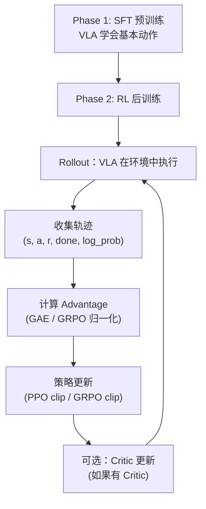
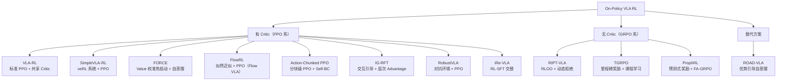
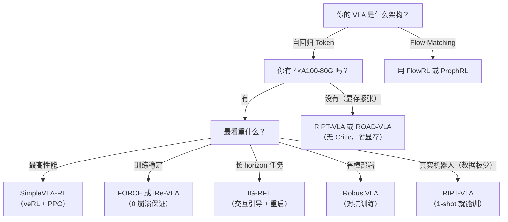

# VLA On-Policy RL 方法综述：PPO、GRPO 及其变体的全景对比

> **综述范围**：2025 年以来所有用 On-Policy RL 训练 VLA 模型的方法——从 PPO 直接训到 GRPO 无 Critic 路线，从自回归 VLA 到 Flow Matching VLA
> **关键词**：VLA、PPO、GRPO、RLOO、On-Policy RL、自回归策略、Flow Matching、动作分块
> **适用读者**：了解基本 RL 和 VLA 概念，想系统理解"当前 VLA + On-Policy RL 这条赛道上有哪些玩家、它们各自解决什么问题、怎么选"

---

## 相关阅读

在阅读本文前，建议先了解以下前置知识：

- [策略梯度与 PPO](/前置知识/000a_前置知识_策略梯度与PPO) — PPO 的 clip 机制和 GAE
- [GRPO](/前置知识/000m_前置知识_GRPO_Group_Relative_Policy_Optimization) — 无 Critic 的组内相对策略优化
- [动作 Token 化与自回归策略](/前置知识/000l_前置知识_动作Token化与自回归策略) — 自回归 VLA 的动作表示
- [Flow Matching 与连续归一化流](/前置知识/000g_前置知识_Flow_Matching与连续归一化流) — Flow VLA（π₀）的生成框架
- [强化学习优势函数估计方法综述](./S11_强化学习优势函数估计方法综述) — 各种 Advantage 估计的对比

关联文章：

- [VLA 模型的 RL 后训练综述](./S06_VLA模型的RL后训练综述) — 包含 off-policy 和 offline 方法的全景图
- [VLA-RL 精读](./006_VLA_RL_PPO直接训练自回归VLA) — PPO 路线的开山之作
- [RIPT-VLA 精读](./007_RIPT_VLA_无Critic的VLA后训练) — GRPO/RLOO 路线的代表
- [FlowRL 精读](./018_FlowRL_Flow_VLA的在线RL微调) — Flow VLA 做 PPO 的技术难点

---

## 贯穿全文的例子

> **场景**：一个 7B 参数的自回归 VLA（OpenVLA），在 LIBERO 仿真环境中执行 40 个桌面操作任务。
>
> - **输入**：$256\times256$ RGB 图像 + 语言指令 "pick up the butter and put it in the basket"
> - **输出**：7 维动作向量量化为 7 个离散 token（每维 256 bins）
> - **SFT 基线**：成功率约 72%
> - **RL 目标**：提升到 90%+，并增强 OOD 鲁棒性

---

## 一、为什么 On-Policy：VLA RL 的主流选择

### 1.1 On-Policy vs Off-Policy 在 VLA 场景下的权衡

| 维度 | On-Policy（PPO/GRPO） | Off-Policy（SAC/TD3） |
|------|----------------------|---------------------|
| 数据复用 | 每批数据只用 1-3 次就丢弃 | 存入 Replay Buffer 反复使用 |
| 采样效率 | 低（需要大量 rollout） | 高 |
| 训练稳定性 | 高（数据分布与策略一致） | 低（分布偏移问题） |
| 适配大模型 | ✅ 天然兼容 7B+ 模型 | ❌ Q 网络需要与 VLA 同等规模 |
| 实现复杂度 | 低（PPO 框架成熟） | 高（需要 Replay Buffer + 目标网络） |
| LLM RLHF 迁移性 | ✅ 直接复用 veRL/OpenRLHF | ❌ 无成熟框架 |

**核心原因**：VLA 本质上是 LLM，LLM 的 RLHF 生态（PPO/GRPO 框架、并行训练系统、clip 机制）可以直接迁移。这是为什么 2025 年几乎所有 VLA RL 论文都选择 on-policy 路线。

### 1.2 On-Policy VLA RL 的通用流程

### 1.3 核心挑战

所有 on-policy VLA RL 方法共同面对的五大挑战：

| 挑战 | 为什么在 VLA 中特别严重 |
|------|----------------------|
| **稀疏奖励** | 机器人任务只有最终 success/fail，中间无信号 |
| **显存爆炸** | 7B Actor + 7B Critic = 14B+，4×A100 才能跑 |
| **采样昂贵** | 物理仿真 rollout 比 LLM 文本生成慢 100 倍 |
| **灾难性遗忘** | RL 微调会破坏 VLA 预训练的泛化能力 |
| **动作空间差异** | 自回归 token、Flow Matching、Diffusion 各不相同 |

后面每个方法，都是在解决上述挑战中的一个或多个。

---

## 二、方法全景图

2025 年以来的 on-policy VLA RL 方法可以按两个维度分类：

**维度一：是否使用 Critic（Value 网络）**

**维度二：解决的核心问题**

| 核心问题 | 代表方法 |
|---------|---------|
| 稀疏奖励 → 密集信号 | VLA-RL（RPRM）、TGRPO（里程碑）、IG-RFT（交互点）、ProphRL（预测器） |
| 训练稳定性 | FORCE（Value 热启动+自蒸馏）、iRe-VLA（RL-SFT交替）、ROAD-VLA（蒸馏替代梯度） |
| 工程效率/可扩展 | SimpleVLA-RL（veRL）、RLinf-VLA（异步调度）、ProphRL（80× 提速） |
| Flow VLA 适配 | FlowRL（似然近似）、ProphRL（FA-GRPO） |
| 鲁棒性 | RobustVLA（对抗训练） |
| 长 horizon | IG-RFT（交互引导）、TGRPO（课程学习） |

---

## 三、PPO 系：有 Critic 的标准路线

### 3.1 VLA-RL：开山之作

> **论文**：Towards Masterful and General Robotic Manipulation with Scalable RL (arXiv 2505.18719, 2025)
>
> **核心贡献**：第一个系统性地证明 PPO 可以直接训练 7B 自回归 VLA

**核心做法**：

1. **共享 Backbone Critic**：Actor 和 Critic 共享 VLA 的 Transformer 骨干，只在最后一层分叉——省 45% 显存
2. **Robotic Process Reward Model（RPRM）**：训练一个轻量 reward model 给出 step-level 密集奖励（类似 LLM 的 PRM），缓解 sparse reward
3. **Critic Warm-up**：先用 SFT 数据训几步 Critic，再开 RL——避免冷启动阶段 Critic 瞎猜误导策略
4. **GAE + KL penalty**：标准 PPO 配方，加 $\beta \cdot D_{\text{KL}}(\pi_\theta \| \pi_{\text{ref}})$ 防遗忘

**关键公式**（token 级 PPO）：

$$
L^{\text{CLIP}}(\theta) = \mathbb{E}_{t,i}\left[\min\left(\frac{\pi_\theta(a_i|s_t, a_{<i})}{\pi_{\theta_{\text{old}}}(a_i|s_t, a_{<i})}\hat{A}_{t,i},\; \text{clip}(\cdot)\hat{A}_{t,i}\right)\right]
$$

**这个公式在做什么**：对 VLA 输出的每个 action token $a_i$，计算新旧策略的概率比，用 PPO clip 限制更新幅度。这里 $i$ 索引的是动作的维度（$i=1,\ldots,7$ 对应 7 个关节），$t$ 索引时间步。

::: details 📐 逐符号拆解 + 数值代入（点击展开）
**逐符号拆解**：

| 符号 | 含义 | 具体对应 |
|------|------|---------|
| $a_i$ | 第 $i$ 维动作 token（0~255 中的一个） | 如第 3 维 $\Delta z$ 的离散化 token |
| $s_t$ | 时刻 $t$ 的观测（图像+语言+历史） | VLA 的完整输入 |
| $a_{<i}$ | 已生成的前 $i-1$ 个 token | 自回归依赖 |
| $\pi_\theta(a_i\|s_t, a_{<i})$ | 当前策略输出 $a_i$ 的 softmax 概率 | VLA 最后一层 softmax 的第 $a_i$ 项 |
| $\hat{A}_{t,i}$ | 该 token 的 advantage 估计 | GAE 算出，通常同一步的 7 个 token 共享 |

**数值代入**：假设某步某维度，旧策略选了 token=128（概率 0.12），新策略对该 token 概率变成 0.18：

$$
r_{t,i} = \frac{0.18}{0.12} = 1.5, \quad \text{clip}(1.5, 0.8, 1.2) = 1.2
$$

若 $\hat{A}_{t,i} = +0.8$：

$$
\min(1.5 \times 0.8,\; 1.2 \times 0.8) = \min(1.2, 0.96) = 0.96
$$

裁剪生效——不允许概率比超过 1.2 时继续获得额外奖励。

**为什么是这个形式**：完全继承 LLM RLHF 的 PPO，区别只是"生成的文本"变成了"生成的动作 token 序列"。
:::

**实验结果**：LIBERO 40 任务平均成功率从 SFT 的 72% → PPO 的 **81%**（+9pp）。其中 RPRM 贡献了约 4pp，Critic warmup 贡献约 5pp。

**局限**：需要额外训练 RPRM 奖励模型（需要成功/失败轨迹的对比数据），增加了 pipeline 复杂度。

---

### 3.2 SimpleVLA-RL：可扩展系统工程

> **论文**：Scaling VLA Training via RL (ICLR 2026, arXiv 2509.09674)
>
> **核心贡献**：基于 veRL 构建 VLA RL 训练系统 + 发现 "pushcut" 涌现行为

**和 VLA-RL 的区别**：VLA-RL 解决"算法能不能跑通"，SimpleVLA-RL 解决"**怎么高效地大规模跑**"。

**核心系统设计**：

| 组件 | 做法 | 效果 |
|------|------|------|
| 基于 veRL 框架 | Actor/Critic/Environment 三阶段流水线化 | GPU 利用率 80%+ |
| 动态 rollout 长度 | 任务成功则提前截断 | 减少无效计算 30% |
| Chunk-level 奖励 | 每 $k$ 步一个奖励信号 | 比 step-level 更稳定 |
| 多环境并行 | 32-128 个仿真实例同时 rollout | 吞吐量线性扩展 |

**"Pushcut" 涌现现象**：RL 训练后，VLA 自发发现了 SFT 数据中从未出现过的动作模式——直接推物体到目标位置（而非标准的抓取-移动-放置流程）。这证明了 RL 能让策略**超越人类示教的上限**。

**实验结果**：LIBERO **94.2%**，MetaWorld **87.5%**，真实机器人比 SFT 提升 **+24.7%**。训练速度比 VLA-RL 快 **2.7×**。

---

### 3.3 FORCE：Value 校准 + 自蒸馏加速收敛

> **论文**：Efficient VLA Reinforcement Fine-Tuning via Value-Calibrated Warm-up and Self-Distillation (arXiv 2606.26006, 2025)
>
> **核心贡献**：解决 PPO 的两大效率瓶颈——Critic 冷启动和策略崩溃

**瓶颈一：Value 冷启动**

PPO 开始时 Critic 随机初始化 → Advantage 估计完全不准 → 前几百步 RL 等于白跑。

**FORCE 的解法——Value-Calibrated Warm-up**：

用 SFT 数据中已有的轨迹（知道最终是否成功），逆向计算每步的"真实" target $\hat{R}_t = \sum_{t'=t}^T \gamma^{t'-t} r_{t'}$，然后用这些 target 预训练 Critic 几个 epoch。这样 RL 一开始 Critic 就有合理的初始估计。

**瓶颈二：策略漂移后崩溃**

RL 训练中策略偏离 SFT 初始化太远 → 进入 VLA 从未见过的状态 → 输出随机 → 不可恢复。

**FORCE 的解法——Self-Distillation**：

维护一个"历史最佳策略"副本 $\pi_{\text{best}}$（按 validation reward 动态更新），在 PPO loss 基础上加一项：

$$
L_{\text{distill}} = D_{\text{KL}}(\pi_{\text{best}}(\cdot|s) \| \pi_\theta(\cdot|s))
$$

**这个公式在做什么**：如果当前策略比历史最佳差（开始崩溃），蒸馏项会把它"拉回"最佳状态的附近；如果当前策略已经超过历史最佳，$\pi_{\text{best}}$ 更新为当前策略，蒸馏项变松。

::: details 📐 逐符号拆解 + 数值代入（点击展开）
**逐符号拆解**：

| 符号 | 含义 | 作用 |
|------|------|------|
| $\pi_{\text{best}}$ | 训练过程中验证表现最好的策略快照 | "安全网" |
| $D_{\text{KL}}$ | KL 散度 | 衡量当前策略偏离最佳多远 |
| $\pi_\theta$ | 当前正在训练的策略 | 如果崩溃，KL 变大，梯度拉回 |

**数值代入**：假设 $\pi_{\text{best}}$ 在某状态输出 token=128 概率 0.3，当前 $\pi_\theta$ 因崩溃变成 0.01：

$$
D_{\text{KL}} \ge 0.3 \times \log\frac{0.3}{0.01} = 0.3 \times 3.40 = 1.02
$$

这个很大的 KL 值产生的梯度会强力把 $\pi_\theta$ 对 token=128 的概率往 0.3 方向推。

**为什么是这个形式**：KL 散度是衡量两个分布差异最自然的工具。用"历史最佳"而非"SFT 初始化"做 anchor，让策略有进步空间（不被钉死在 SFT）。
:::

**实验结果**：训练时间减少 **32.5%**，最终成功率比标准 PPO 高 **+10%**，且 7 次实验 **0 次崩溃**（标准 PPO 崩溃 3/7 次）。

---

### 3.4 FlowRL：让 Flow Matching VLA 也能做 PPO

> **论文**：Online RL Fine-tuning for Flow-based VLA Models (arXiv 2510.25889, 2025)
>
> **核心贡献**：解决 Flow Matching 没有解析 log-probability 的问题，让 PPO 可以直接训练 π₀

**核心难题**：PPO 需要 $\log\pi_\theta(a|s)$，但 Flow Matching 通过 ODE 生成动作，其 $\log$-概率需要计算昂贵的 Jacobian 行列式。

**FlowRL 的两种近似方案**：

| 方法 | 核心思路 | 代价 | 精度 |
|------|---------|------|------|
| **SLE**（Straight-Line Estimator） | 假设 Flow 轨迹近似直线，用条件 Flow Matching loss 近似 log-prob | 极低 | 中 |
| **NIVB**（Noise-Interpolated Variational Bound） | 在生成的动作附近加噪声，用变分下界估计 log-prob | 低 | 高 |

**SLE 近似公式**：

$$
\log\pi_\theta(a|s) \approx -\frac{d}{2}\log(2\pi) - \frac{1}{2}\|a - \mu_\theta(a, 1; s)\|^2
$$

**这个公式在做什么**：假设 Flow 的最终输出分布近似高斯，用 Flow 的速度场在 $t=1$（终点）处的预测 $\mu_\theta$ 和实际生成的动作 $a$ 之间的 MSE 距离作为 log-probability 的近似。距离越小 → 概率越高。

::: details 📐 逐符号拆解 + 数值代入（点击展开）
**逐符号拆解**：

| 符号 | 含义 | 具体是什么 |
|------|------|-----------|
| $d$ | 动作维度 | 7（机械臂 7 自由度） |
| $\mu_\theta(a, 1; s)$ | Flow 速度场网络在 $t=1$ 对样本 $a$ 的预测目标 | 网络"认为"的最终目标位置 |
| $\|a - \mu_\theta\|^2$ | 实际动作和网络预测之间的 MSE | 距离越小说明"这个动作越被认可" |
| $-\frac{d}{2}\log(2\pi)$ | 高斯归一化常数 | 固定值，不影响梯度方向 |

**数值代入**：$d=7$，某次生成动作 $a$ 和 Flow 预测 $\mu_\theta$ 的 MSE 为 0.05：

$$
\log\pi \approx -\frac{7}{2}\log(2\pi) - \frac{1}{2}\times0.05 = -6.43 - 0.025 = -6.455
$$

另一个动作 MSE 为 0.5（偏离更大）：$\log\pi \approx -6.43 - 0.25 = -6.68$。前者概率更高。

**为什么是这个形式**：Flow Matching 的终点分布在训练收敛后近似条件高斯，直接用高斯 log-density 做近似是最简单的选择。精度不如 NIVB，但计算量几乎为零。
:::

**实验结果**：FlowRL-NIVB 在 RoboMimic 上达到 **81.2%**，匹配"先蒸馏成自回归再做 PPO"的上限，但不丢失 Flow Matching 的连续性优势。

---

### 3.5 Action-Chunked PPO：分块提升时间一致性

> **论文**：VLA Post-Training via Action-Chunked PPO and Self Behavior Cloning (arXiv 2509.25718, 2025)
>
> **核心贡献**：把 $k$ 步动作打包为一个 "chunk"，在 chunk 级别做 PPO

**问题**：逐步 PPO（每步一个 advantage）让 VLA 的相邻动作可能被推向矛盾方向——第 $t$ 步被鼓励"向左"，第 $t+1$ 步被鼓励"向右"，导致轨迹抖动。

**解法**：把 $k$ 步打包为一个 chunk，整个 chunk 共享一个 advantage：

$$
\hat{A}_{\text{chunk}} = \sum_{j=0}^{k-1} \gamma^j r_{t+j} + \gamma^k V(s_{t+k}) - V(s_t)
$$

**这个公式在做什么**：把 $k$ 步的真实奖励和累加起来，作为这个 chunk 的"整体表现"。Chunk 内的所有 token 共享这一个 advantage 值，保证方向一致。

::: details 📐 逐符号拆解 + 数值代入（点击展开）
**逐符号拆解**：

| 符号 | 含义 | 典型值 |
|------|------|--------|
| $k$ | chunk 大小 | 5（论文最优值） |
| $\sum_{j=0}^{k-1} \gamma^j r_{t+j}$ | chunk 内 $k$ 步的折扣奖励和 | 5 步奖励的和 |
| $\gamma^k V(s_{t+k})$ | chunk 结束后的 bootstrap | Critic 对 5 步后状态的估值 |
| $V(s_t)$ | chunk 开始时的 baseline | 减去后得到 chunk 级 advantage |

**数值代入**（$k=5$，$\gamma=0.99$，每步 $r=-0.01$，$V(s_t)=6.0$，$V(s_{t+5})=7.5$）：

$$
\hat{A}_{\text{chunk}} = 5\times(-0.01) + 0.99^5 \times 7.5 - 6.0 = -0.05 + 7.13 - 6.0 = +1.08
$$

Chunk 内 5 步×7 维 = 35 个 token 全部用这个 $+1.08$ 作为 advantage。

**为什么是这个形式**：本质是 $n$ 步 TD advantage（$n=k$），但动机不是 bias-variance 权衡，而是"保证 chunk 内动作方向一致"。
:::

**Self Behavior Cloning (Self-BC)**：额外维护一个"成功轨迹缓冲区"，PPO loss 之外加一个 BC loss 模仿自己过去的成功经验。防止 RL 探索把好的行为模式也搞丢。

**实验结果**：MetaWorld 50 任务 **93%** 成功率，$k=5$ 是时间一致性和奖励密度的最佳平衡点。

---

### 3.6 IG-RFT：交互引导的长 Horizon RL

> **论文**：An Interaction-Guided RL Framework for VLA Models in Long-Horizon Manipulation (arXiv 2602.20715, 2025)
>
> **核心贡献**：在物理交互点（接触、抓取、放置）给中间奖励 + 从最后成功交互点重启

**问题**：长 horizon 任务（如"开微波炉→放食物→关门→加热"共 400+ 步），只有最终完成才给 reward=1 → RL 几乎学不到什么。

**两大核心设计**：

1. **Interaction-Point Reward**：在物理交互发生的时刻（力传感器检测到接触、物体位置变化）给予中间奖励
2. **Restart from Last Success**：如果某次 rollout 在第 3 个子任务失败了，下次从第 2 个子任务的末尾状态重新开始——不用每次从头跑

**实验结果**：真实机器人长 horizon 任务从 SFT 的 **18.8%** 提升到 **85.0%**（+66pp）。数据收集效率提升 **4×**。

---

### 3.7 RobustVLA (RAPT)：对抗训练提升鲁棒性

> **论文**：Robustness-Aware RL Post-Training for VLA (arXiv 2511.01331, 2025)
>
> **核心贡献**：不只优化平均性能，还优化最坏情况——对抗环境扰动

**核心公式**（minimax 优化）：

$$
\max_\theta \min_{\xi \in \Xi}\; \mathbb{E}_{\tau\sim\pi_\theta,\text{env}(\xi)}[R(\tau)]
$$

**这个公式在做什么**：外层 max 让策略变强，内层 min 寻找"最刁难策略的环境配置" $\xi$。两者对抗博弈，最终策略在各种扰动下都能保持性能。

::: details 📐 逐符号拆解 + 数值代入（点击展开）
**逐符号拆解**：

| 符号 | 含义 | 具体是什么 |
|------|------|-----------|
| $\theta$ | 策略参数 | VLA 的 7B 权重 |
| $\xi$ | 环境扰动参数 | 光照强度、物体位置偏移、相机角度 |
| $\Xi$ | 扰动范围 | 如光照 $\in [0.5, 1.5]$，位置偏移 $\in [-3cm, +3cm]$ |
| $\text{env}(\xi)$ | 带扰动的环境 | 同一任务但物体位置随机偏移了 2cm |
| $R(\tau)$ | 轨迹奖励 | 成功=1，失败=0 |
| $\min_\xi$ | 寻找最难的扰动 | 用 CEM（交叉熵方法）搜索 |
| $\max_\theta$ | 策略优化 | 标准 PPO |

**数值代入**：假设无扰动成功率 95%，但光照降低 50% 时降到 60%。RAPT 会把光照扰动加大权重，让 PPO 在暗光条件下也能训练出好策略。最终：名义环境 93%（略降），暗光环境 82%（大幅提升 +22pp）。

**为什么是这个形式**：这是经典的鲁棒优化（robust optimization）框架，在博弈论中叫 minimax。贸易少量平均性能换取最坏情况的大幅改善，对真实部署更有价值。
:::

**实验结果**：名义环境性能略降 1.4%，但在 7 种扰动下平均提升 **+22%**。

---

### 3.8 iRe-VLA：RL 和 SFT 交替防崩溃

> **论文**：Improving VLA with Online RL (arXiv 2501.16664, 2025)
>
> **核心贡献**：发现 RL 持续训练 VLA 会崩溃，提出 RL→SFT 交替训练循环

**核心流程**（每轮）：
1. **RL 阶段**：用 PPO 训 $N$ 步（短暂探索，不过度）
2. **收集成功轨迹**：把 RL 阶段成功的轨迹存起来
3. **SFT 阶段**：用原始 demo + RL 成功轨迹一起做 SFT（巩固进步）
4. 重复

**为什么有效**：SFT 阶段起到了"回收站"作用——即使 RL 阶段出了偏差，SFT 会把策略拉回正轨（因为 SFT 数据包含原始 demo）。同时 RL 的成功轨迹被纳入 SFT 数据，让下一轮 RL 有更好的起点。

**实验结果**：5 轮迭代后从 65% → **91%**，全程 0 次崩溃，泛化能力完好保持。

---

## 四、GRPO 系：无 Critic 的轻量路线

### 4.1 RIPT-VLA：VLA 的第三阶段训练

> **论文**：Interactive Post-Training for VLA Models (arXiv 2505.17016, 2025)
>
> **核心贡献**：第一个把 RLOO（Leave-One-Out baseline）引入 VLA + "动态拒绝"机制

**RLOO vs GRPO**：RIPT-VLA 用 RLOO（leave-one-out baseline）而非 GRPO（z-score 归一化），理论上偏差更小（参见 [优势估计综述](./S11_强化学习优势函数估计方法综述#十方法reinforce-leave-one-out-rloo)）。

**动态拒绝（Dynamic Rejection）**：当一个 group 内所有轨迹都失败（$R_i = 0,\forall i$）时，advantage 全是 0（无学习信号）。RIPT-VLA 直接丢弃这种 batch，用下一个有信号的 batch 替代——避免在无信号数据上做无意义的梯度更新。

**Few-shot 场景**：RIPT-VLA 特别关注只有 1-5 条 demo 的场景。结果惊人：仅用 1 条 demo 做 SFT 初始化 + RIPT → **97.2%** 成功率（提升 +93.7pp）。这说明 RL 交互的价值远超数据量的增加。

**实验结果**：50-demo 平均 **93.6%**，在所有 GRPO 类方法中最高。

---

### 4.2 TGRPO：里程碑奖励 + 课程学习

> **论文**：Trajectory-wise Group Relative Policy Optimization (arXiv 2506.08440, 2025)
>
> **核心贡献**：用子任务里程碑提供 dense reward + 按难度递增课程学习

**GRPO 的核心问题**：如果 8 条 rollout 里 7 条都失败（reward=0），组内比较只有两个值（$+1.73$ 和 $-0.577$），信号极弱。

**TGRPO 的解法一——Milestone Dense Reward**：

手动定义每个任务的"里程碑"（如"接触物体"=0.3，"抬起物体"=0.6，"到达目标区域"=0.9，"任务成功"=1.0）。这样即使最终失败，完成了部分里程碑也能获得正 reward。

| 轨迹 | 最终结果 | 传统 reward | 里程碑 reward |
|------|---------|------------|--------------|
| 轨迹 1 | 失败（抬起物体后掉了） | 0 | 0.6 |
| 轨迹 2 | 失败（没碰到物体） | 0 | 0.0 |
| 轨迹 3 | 成功 | 1 | 1.0 |

现在 GRPO 能区分"接近成功"和"完全失败"了。

**TGRPO 的解法二——Per-Timestep Group Normalization**：

标准 GRPO 对整条轨迹给一个 advantage 值。TGRPO 对每个时间步 $t$ 独立做归一化：

$$
\hat{A}_{i,t} = \frac{R_i^{(t)} - \mu_G^{(t)}}{\sigma_G^{(t)}}
$$

**这个公式在做什么**：对每个时间步 $t$ 独立计算组内归一化 advantage——用第 $i$ 条轨迹从 $t$ 开始的 reward-to-go 减去该时间步所有轨迹的均值，再除以标准差。这让早期步和晚期步有各自独立的 baseline，避免混在一起比较。

::: details 📐 逐符号拆解 + 数值代入（点击展开）
**逐符号拆解**：

| 符号 | 含义 | 具体是什么 |
|------|------|-----------|
| $R_i^{(t)}$ | 第 $i$ 条轨迹从 $t$ 时刻开始的 reward-to-go | $\sum_{t'=t}^T \gamma^{t'-t} r_{t'}^{(i)}$ |
| $\mu_G^{(t)}$ | 组内所有轨迹在时刻 $t$ 的 reward-to-go 均值 | $\frac{1}{G}\sum_j R_j^{(t)}$ |
| $\sigma_G^{(t)}$ | 组内标准差 | 该时间步各轨迹 reward-to-go 的波动幅度 |

**数值代入**：$G=4$ 条轨迹在 $t=5$ 的 reward-to-go 分别为 $[0.6, 0, 1.0, 0]$：
- $\mu_G^{(5)} = 0.4$，$\sigma_G^{(5)} = 0.42$
- 第 1 条（$R=0.6$）：$\hat{A}_{1,5} = (0.6-0.4)/0.42 = +0.48$
- 第 3 条（$R=1.0$）：$\hat{A}_{3,5} = (1.0-0.4)/0.42 = +1.43$

**为什么是这个形式**：不同时间步的 reward-to-go 量级差异很大（$t=0$ 的 $R_i^{(0)}$ 包含全轨迹奖励，$t=T-1$ 的只有最后一步），如果不按时间步独立归一化，早期步的 advantage 会被晚期步的大方差淹没。
:::

**TGRPO 的解法三——课程学习**：

从简单子任务开始训（如只训"接触物体"），成功率达标后再加入下一个子任务。逐步提升难度，避免一上来就面对几乎不可能成功的长 horizon 任务。

**实验结果**：LIBERO 平均 **83.4%**（比 RIPT-VLA 高 +5.5%，比 VLA-RL PPO 高 +2.4%）。

---

### 4.3 ProphRL：预测式奖励 + 80× 加速

> **论文**：Reinforcing Action Policies by Prophesying (arXiv 2511.20633, 2025)
>
> **核心贡献**：用视频预测模型"想象"动作效果，不需要真正执行就能评估奖励

**核心思想**：环境 rollout 是 VLA RL 最大的时间瓶颈。如果有一个 "Prophet"（预言者）模型能预测"执行这个动作后画面会变成什么样"，我们就可以：
1. VLA 输出动作 $a$
2. Prophet 预测未来帧 $\hat{o}_{t+1}$
3. 用预测帧计算 reward（而不是真正执行）
4. 只有评估完觉得"值得尝试"的动作才真正发给机器人

**加速效果**：

| 方式 | 评估一个动作的时间 | 加速比 |
|------|------------------|--------|
| 真实环境执行 | ~500ms（物理仿真渲染） | 1× |
| Prophet 预测 | ~6ms（前向传播） | **~80×** |

**FA-GRPO（Flow-Action GRPO）**：把 GRPO 适配到 Flow Matching VLA（π₀），核心修改是把 GRPO 的 token-level 概率比替换为 flow denoising step 级别的损失加权。

**FlowScale**：Flow Matching 的不同 denoising step 对最终动作质量的影响不均匀——靠近终点的步更重要。FlowScale 对每步的梯度做 reweighting。

**实验结果**：仅 **200 步** RL 更新即收敛（标准 GRPO 需要 1000+ 步）。对 Flow VLA 特别高效。

---

## 五、替代方案：ROAD-VLA 优势引导自蒸馏

> **论文**：Robust Online Adaptation via Self-Distillation for VLA Models (arXiv 2606.25800, 2025)
>
> **核心贡献**：完全不用 PPO 的策略梯度，用 advantage 扰动 logits 后做蒸馏

**PPO 的根本风险**：策略梯度直接改变网络参数 → 如果一步走错，参数变化不可逆 → 崩溃。

**ROAD-VLA 的替代思路**：

1. 从当前策略采样轨迹，收集 $(s_t, a_t, r_t)$
2. 用简单方法（MC return - 均值归一化）计算每个 token 的 advantage $\hat{A}_{t,i}$
3. **关键步骤**：把 advantage 信号注入 logits，构造 "teacher" 分布：

$$
\text{logit}^{\text{teacher}}_{t,i}(a) = \text{logit}^{\text{current}}_{t,i}(a) + \alpha \cdot \hat{A}_{t,i} \cdot \mathbb{1}[a = a_t^{\text{sampled}}]
$$

4. 用 KL 蒸馏让策略学习 teacher：$L = D_{\text{KL}}(\text{softmax}(\text{logit}^{\text{teacher}}) \| \pi_\theta)$

**这个公式在做什么**：对采样到的那个 token $a_t$ 的 logit 加上一个和 advantage 成正比的偏移。如果 advantage 为正（好动作），teacher 会把这个 token 的概率调高；反之调低。然后让策略去模仿这个"改进后的 teacher"。

::: details 📐 逐符号拆解 + 数值代入（点击展开）
**逐符号拆解**：

| 符号 | 含义 | 直觉 |
|------|------|------|
| $\text{logit}^{\text{current}}$ | 当前策略的原始 logit 输出 | 未经 softmax 的原始分数 |
| $\alpha$ | advantage 注入强度 | 控制"改进幅度"，典型值 0.1-1.0 |
| $\hat{A}_{t,i}$ | 第 $t$ 步第 $i$ 维的 advantage | 正=好动作，负=差动作 |
| $\mathbb{1}[a = a_t^{\text{sampled}}]$ | 指示函数 | 只对实际采样到的 token 加偏移 |
| $\text{logit}^{\text{teacher}}$ | 构造出的 teacher 分布 | "改进版"的自己 |

**数值代入**：假设某 token 位置，当前 logit 为 $[2.0, 1.5, 0.3, \ldots]$（共 256 维），实际采样到了 token=0（logit=2.0），$\hat{A}=+0.8$，$\alpha=0.5$：

$$
\text{logit}^{\text{teacher}}_0 = 2.0 + 0.5 \times 0.8 = 2.4
$$

其他位置不变。softmax 后 token=0 的概率从原来的比如 0.35 提升到 0.40——teacher 更"确信"这个好动作了。策略通过 KL 蒸馏向 teacher 靠拢。

**为什么是这个形式**：PPO 通过梯度直接改参数（强更新），ROAD-VLA 通过构造 teacher 间接引导策略（软更新）。后者更温和、更不容易崩溃。代价是更新速度略慢。
:::

**实验结果**：7 次实验 **0 次崩溃**（PPO 3/7 崩溃），最终性能比 PPO 高 **+10%**。证明了"温和更新"在 VLA 场景的优势。

---

## 六、大对比表

### 6.1 全方法横向对比

| 方法 | 算法 | Critic? | VLA 架构 | 稀疏奖励解法 | LIBERO 成功率 | 训练稳定性 | 显存需求 |
|------|------|---------|---------|------------|-------------|-----------|---------|
| VLA-RL | PPO | ✅ 共享 | 自回归 | RPRM 密集奖励 | 81.0% | 中（需 warmup） | 高（14B+） |
| SimpleVLA-RL | PPO | ✅ | 自回归 | chunk-level | **94.2%** | 高 | 高 |
| FORCE | PPO | ✅ | 自回归 | 标准 sparse | ~90%+ | **极高（0/7 崩溃）** | 高 |
| FlowRL | PPO | ✅ | **Flow** | 标准 sparse | 81.2% (RoboMimic) | 中 | 高 |
| AC-PPO | PPO | ✅ | 自回归 | chunk 密集 | 93% (MetaWorld) | 高 | 高 |
| IG-RFT | PPO | ✅ | 自回归 | 交互点密集 | 85% (真机长horizon) | 高 | 高 |
| RobustVLA | PPO | ✅ | 自回归 | 标准 sparse | 93% (名义) | 中 | 高 |
| iRe-VLA | PPO+SFT | ✅ | 自回归 | 标准 sparse | 91% | **极高（0 崩溃）** | 高（但分阶段） |
| RIPT-VLA | RLOO | ❌ | 自回归 | 标准 sparse | 93.6% | 高 | **低（省 Critic）** |
| TGRPO | GRPO | ❌ | 自回归 | 里程碑密集 | 83.4% | 高 | **低** |
| ProphRL | FA-GRPO | ❌ | **Flow** | 预测式密集 | — | 高 | 中（需 Prophet） |
| ROAD-VLA | 自蒸馏 | ❌ | 自回归 | 标准 sparse | ~PPO+10% | **极高（0 崩溃）** | **低** |

### 6.2 该选哪个？决策树

---

## 七、共性技巧：所有方法都在用的 Trick

### 7.1 KL 约束防遗忘

几乎所有方法都加了 KL penalty：$L_{\text{total}} = L_{\text{RL}} + \beta D_{\text{KL}}(\pi_\theta \| \pi_{\text{ref}})$

- $\pi_{\text{ref}}$ 通常是 SFT 后的初始策略
- $\beta$ 在 0.01~0.1 之间
- 作用：防止策略偏离预训练太远，保持泛化能力

### 7.2 Advantage 归一化

所有方法（无论 GAE 还是 GRPO）都在 batch 内做标准化：$\hat{A} \leftarrow (\hat{A} - \mu)/\sigma$

### 7.3 SFT 数据混入

多个方法（iRe-VLA、AC-PPO 的 Self-BC、FORCE 的 Value Warm-up）在 RL 训练中混入 SFT 数据，稳定训练。

### 7.4 Token vs Trajectory 级别的 Advantage

| 粒度 | 做法 | 代表方法 | 优缺点 |
|------|------|---------|--------|
| Token 级 | 每个 token 独立概率比和 advantage | VLA-RL、FlowRL | 精细但可能不一致 |
| Step 级 | 每步 7 个 token 共享 advantage | SimpleVLA-RL、FORCE | 一致性更好 |
| Chunk 级 | $k$ 步共享 advantage | AC-PPO | 时间一致性最好 |
| Trajectory 级 | 整条轨迹共享 advantage | RIPT-VLA、TGRPO | 最粗糙但最稳定 |

---

## 八、趋势与展望

### 8.1 2025-2026 的演进趋势

1. **从"能跑通"到"跑得快"**：早期（VLA-RL）证明可行性，现在（SimpleVLA-RL、RLinf、ProphRL）关注训练效率
2. **从仿真到真机**：ConRFT、IG-RFT 开始在真实机器人上验证
3. **从自回归到 Flow**：FlowRL、ProphRL 打通了 Flow VLA 的 RL 路径
4. **稳定性成为硬指标**：FORCE、ROAD-VLA、iRe-VLA 都强调"0 崩溃"
5. **系统工程受重视**：RLinf-VLA 专门做训练系统优化

### 8.2 尚未解决的问题

| 问题 | 现状 | 可能方向 |
|------|------|---------|
| 真实机器人 on-policy RL | 数据极少，reset 困难 | 世界模型辅助 + 少量真机验证 |
| 多任务联合 RL | 大多方法每任务单独训 | 多任务课程学习 + 任务间迁移 |
| 奖励设计自动化 | 大多需要手工设计 | VLM 自动生成奖励 + 自参考（SRPO） |
| 持续学习 | RL 后容易遗忘旧任务 | LoRA 隔离 + 经验回放（见 [持续 VLA RL 综述](./S07_持续终身VLA强化学习综述)） |

---

## 延伸阅读

- [VLA-RL 精读](./006_VLA_RL_PPO直接训练自回归VLA) — PPO 路线详细技术
- [SimpleVLA-RL 精读](./012_SimpleVLA_RL_可扩展VLA_RL训练) — veRL 系统架构
- [RIPT-VLA 精读](./007_RIPT_VLA_无Critic的VLA后训练) — RLOO 无 Critic 路线
- [TGRPO 精读](./019_TGRPO_轨迹级GRPO微调VLA) — 里程碑奖励设计
- [FlowRL 精读](./018_FlowRL_Flow_VLA的在线RL微调) — Flow VLA 似然近似
- [FORCE 精读](./026_FORCE_高效VLA_RL微调) — Value 校准 + 自蒸馏
- [ROAD-VLA 精读](./041_ROAD_VLA_优势自蒸馏在线适配) — 蒸馏替代梯度
- [IG-RFT 精读](./034_IG_RFT_交互引导长horizon_VLA_RL) — 长 horizon 解法
- [RobustVLA 精读](./014_RobustVLA_鲁棒性感知RL后训练) — 鲁棒性优化
- [iRe-VLA 精读](./043_iReVLA_迭代RL_SFT交替训练VLA) — RL-SFT 交替训练
- [ProphRL 精读](./022_ProphRL_预测式VLA后训练) — 预测式奖励加速
- [RLinf-VLA 精读](./028_RLinfVLA_统一高效VLA_RL训练框架) — 训练系统框架
- [Action-Chunked PPO 精读](./030_ActionChunkedPPO_自行为克隆VLA后训练) — 动作分块 PPO
- [强化学习优势函数估计方法综述](./S11_强化学习优势函数估计方法综述) — 所有 Advantage 估计方法对比
