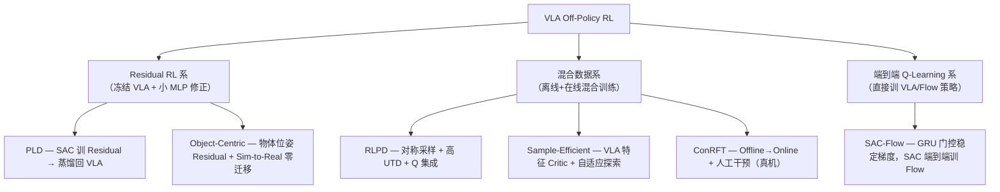
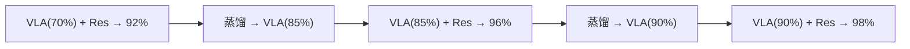
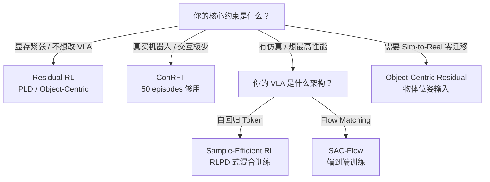

# VLA Off-Policy RL 方法综述：Replay Buffer 驱动的高采样效率训练

> **综述范围**：2024-2026 年所有用 Off-Policy RL（有 Replay Buffer、需少量在线交互）训练/微调 VLA 模型的方法——从 SAC + Residual 到混合数据 Q-Learning，从自回归 VLA 到 Flow Matching VLA
> **关键词**：Off-Policy、SAC、Residual RL、Replay Buffer、Q 函数、RLPD、采样效率
> **适用读者**：了解基本 RL 和 VLA 概念，想理解"用最少的在线交互训好 VLA"的技术路线

---

## 相关阅读

在阅读本文前，建议先了解以下前置知识：

- [SAC (Soft Actor-Critic)](/前置知识/000k_前置知识_SAC_Soft_Actor_Critic) — Off-policy RL 的代表算法
- [Replay Buffer](/前置知识/000r_前置知识_Replay_Buffer_经验回放) — Off-policy 的核心数据结构
- [Q 函数与 Value 函数](/前置知识/000o_前置知识_Q函数与Value函数) — Q-V 分离式 Advantage
- [Flow Matching 与连续归一化流](/前置知识/000g_前置知识_Flow_Matching与连续归一化流) — Flow VLA 的生成框架
- [强化学习优势函数估计方法综述](./S11_强化学习优势函数估计方法综述) — Q−V Advantage 详解

关联文章：

- [VLA On-Policy RL 方法综述](./S12_VLA_On_Policy_RL方法综述) — PPO/GRPO 路线对比
- [VLA Offline RL 方法综述](./S14_VLA_Offline_RL方法综述) — 纯离线路线对比
- [RLPD 精读](./075_RLPD_高效在线RL利用离线数据) — Off-policy 混合数据经典方案
- [SAC-Flow 精读](./079_SAC_Flow_用SAC直接训练Flow策略) — Flow 策略直接做 SAC

---

## 贯穿全文的例子

> **场景**：一个 7B 的 VLA 模型在真实机器人上部署，执行桌面操作任务。
>
> - SFT 成功率约 60%，失败主要是"差几毫米没夹住"这种精度问题
> - 有仿真环境（或愿意做少量真机交互，但不超过 500 episodes）
> - 目标：用最高采样效率把成功率提到 85%+

---

## 一、为什么选 Off-Policy：数据效率是核心

### 1.1 Off-Policy 的核心优势

Off-Policy 方法（SAC、TD3、Q-learning）的最大特点：**数据可以反复复用**。一条轨迹存入 Replay Buffer 后可以被采样训练数十次，而 On-Policy（PPO）每条数据只能用 1-3 次就丢弃。

| 维度 | On-Policy（PPO） | **Off-Policy（SAC）** |
|------|-----------------|---------------------|
| 每条数据使用次数 | 1-3 次 | 20-100 次（高 UTD） |
| 达到 80% SR 所需交互 | 3000-5000 rollouts | **500-1500 rollouts** |
| 真实机器人可行性 | 困难 | **可行** |
| 训练稳定性 | 高 | 中（需要技巧） |
| Critic 类型 | Value 网络 $V(s)$ | Q 网络 $Q(s,a)$ |
| 数据来源要求 | 必须来自当前策略 | **任何策略都行** |

### 1.2 Off-Policy 在 VLA 中的独特挑战

| 挑战 | 原因 | 解法 |
|------|------|------|
| Q 网络要和 VLA 一样大？ | Q(s,a) 输入是高维图像+动作 | 用 VLA 隐层特征初始化 Critic |
| 分布偏移 | Buffer 中旧数据和新策略差异大 | 对称采样、保守正则化 |
| 离散动作 token | 自回归 VLA 输出离散 token | 用 Residual（连续修正）绕过 |
| Flow 策略梯度爆炸 | Q 梯度穿过 K 步 ODE 会爆 | 门控速度网络（SAC-Flow） |

### 1.3 方法全景

---

## 二、Residual RL 系：冻结 VLA + 小网络修正

### 2.1 核心思想

Residual RL 的哲学：**VLA 大方向对了，只差最后的精度微调。用一个极小的 MLP（~100K 参数）学"修正量"，不动 VLA 的 7B 参数。**

$$
a_{\text{final}} = a_{\text{VLA}} + \text{clip}(\pi_{\text{res}}(s),\; -\delta,\; +\delta)
$$

**这个公式在做什么**：VLA 输出基础动作，Residual 网络输出一个被 clip 限制在 $[-\delta, +\delta]$ 范围内的微小修正量。clip 保证 Residual 不会"喧宾夺主"，VLA 的知识完整保留。

::: details 📐 逐符号拆解 + 数值代入（点击展开）
**逐符号拆解**：

| 符号 | 含义 | 典型值 |
|------|------|--------|
| $a_{\text{VLA}} \in \mathbb{R}^7$ | VLA 的原始输出动作 | 7 维末端增量 |
| $\pi_{\text{res}}(s)$ | Residual MLP 的输出 | ~100K 参数的 3 层 MLP |
| $\delta$ | 修正范围上限 | 0.05（每维最多修正 5%） |
| $\text{clip}$ | 截断到 $[-\delta, +\delta]$ | 防止 Residual 完全覆盖 VLA 输出 |

**数值代入**：VLA 输出"向右移 3cm"$a_{\text{VLA}} = [0.03, 0, 0, \ldots]$，但目标在右偏上 2mm。Residual 学到输出 $[0, 0.002, 0, \ldots]$：

$$
a_{\text{final}} = [0.03, 0, 0, \ldots] + [0, 0.002, 0, \ldots] = [0.03, 0.002, 0, \ldots]
$$

**为什么是这个形式**：加法结构保证 VLA 知识完整保留（冻结不动）。clip 保证 Residual 只做"微调"不做"替代"。只有 100K 参数需要训练，SAC 几分钟就能收敛。
:::

### 2.2 PLD：Probe-Learn-Distill 自改进循环

> **论文**：Self-Improving VLA with Data Generation via Residual RL (arXiv 2511.00091, 2025)
>
> **核心贡献**：SAC 训小 Residual → 收集成功轨迹 → SFT 蒸馏回 VLA → 迭代

**三阶段循环**：

| 阶段 | 做什么 | 用什么算法 | 数据量 |
|------|--------|-----------|--------|
| Probe | VLA+Residual 在环境执行 | — | 收集轨迹 |
| Learn | SAC 训 Residual MLP | SAC (off-policy, 100K buffer) | 50K-100K transitions |
| Distill | 成功轨迹 SFT 回 VLA | 监督学习（LoRA） | ~1000 条成功轨迹 |

**迭代的正反馈循环**：

每轮 VLA 起点更高 → Residual 修正更小 → 组合策略更强 → 蒸馏数据更好 → VLA 进步更大。

**关键数字**：SFT 65.8% → PLD 3 轮 **89.8%**（超过直接 PPO 训 VLA 的 80.5%）。泛化保持 **97%**（VLA backbone 只用 LoRA 微调）。

**为什么用 SAC 而非 PPO 训 Residual**：Residual MLP 只有 100K 参数，状态空间 ~20 维（关节角+末端位姿）——这是 SAC 的最佳适用场景。Off-policy 的 Replay Buffer 让数据效率极高，5 万步交互就够收敛。

### 2.3 Object-Centric Residual RL：零迁移 Sim-to-Real

> **论文**：Object-Centric Residual RL for Zero-Shot Sim-to-Real VLA Enhancement (arXiv 2606.18953, 2025, Microsoft Research)
>
> **核心贡献**：用物体 6D 位姿作为 Residual 输入，彻底消除 Sim-to-Real 视觉 gap

**解决的核心问题**：Residual RL 在仿真中训好后，部署到真实机器人时效果大打折扣——因为 Residual 如果用图像作为输入，仿真图像和真实图像的视觉差异（domain gap）会导致输出完全错误。

**Object-Centric 的解法**：

| 输入选择 | Sim-to-Real Gap | 精度 |
|---------|----------------|------|
| 原始图像 | 巨大（渲染 vs 真实） | 高（但不迁移） |
| VLA 隐层特征 | 中等 | 中 |
| **物体 6D 位姿（17 维）** | **几乎为零** | 高且迁移 |

物体位姿是物理量——仿真中用解析计算，真实中用 FoundationPose 估计——两者在同一坐标系、同一精度，不存在 domain gap。

**17 维输入**：目标物体位姿（6D）+ 末端执行器位姿（6D）+ 相对位置（3D）+ 夹爪状态（1D）+ 是否接触（1D）

**实验结果**：VLA alone 55-65% → +Object-Centric Residual **72-85%** 真实机器人。仿真训练仅 **1 小时**。零 Sim-to-Real 适配。

---

## 三、混合数据系：离线经验 + 在线交互

### 3.1 RLPD：简单到令人惊讶的强基线

> **论文**：Efficient Online RL with Offline Data (ICML 2023, UC Berkeley)
>
> **核心贡献**：证明标准 SAC + 三个简单工程选择就能打败所有专门设计的 offline-to-online 方法

**三个关键设计**：

| 设计 | 做法 | 为什么有效 |
|------|------|-----------|
| **对称采样** | mini-batch 50% 在线 + 50% 离线 | 防止离线经验被稀释遗忘 |
| **高 UTD=20** | 每收集 1 步就更新 20 次 | 最大化数据利用率 |
| **10-Ensemble Q + LayerNorm** | 10 个 Q 网络取 subset-of-2 minimum | 防止高 UTD 下 Q 值发散 |

**为什么不需要 CQL/IQL 等保守正则化**：对称采样本身就提供了隐式正则化——50% 的离线数据保证 Q 网络不会只看在线数据的偏分布。LayerNorm + Ensemble 进一步稳定训练。这比 CQL 的"人为压低 OOD Q 值"更自然。

**在 VLA 中的地位**：RLPD 是后续 Q-Chunking、Sample-Efficient RL、Chunked RL 等工作的共同基础。

### 3.2 Sample-Efficient RL for VLA：500 Rollouts 达到 85%

> **论文**：Sample-Efficient RL Finetuning for VLA (arXiv 2605.25477, 2025)
>
> **核心贡献**：把 VLA 达到 80%+ 所需交互量从 5000 rollouts 压缩到 500

**三大组件**：

**组件一——VLA-feature Critic**：Critic 的输入不是原始图像，而是冻结 VLA backbone 输出的 4096 维隐层特征。好处：VLA 预训练已经学好了视觉-语言理解，Critic 站在"巨人肩膀上"——10 步就收敛（vs 随机初始化需要 200+ 步）。

**组件二——Adaptive Exploration**：VLA 输出每个 token 时有一个 softmax 置信度。置信度高（VLA "很确定"）的维度少加噪声；置信度低的维度多加噪声。避免在 VLA 已经会做的维度上做无效探索。

**组件三——Hybrid Replay**：Replay Buffer 分三个区域：

| 区域 | 内容 | 初始占比 | 后期占比 |
|------|------|---------|---------|
| SFT 数据 | 原始示教轨迹 | 60% | 30% |
| 成功经验 | 在线交互的成功轨迹 | 10% | 30% |
| 在线数据 | 所有在线交互（含失败） | 30% | 40% |

随训练推进动态调整比例——早期多用 SFT 数据稳定 Critic，后期更信任在线经验。

**结果**：**500 rollouts** 达到 85% SR。采样效率比 PPO 提升 **10×**。

### 3.3 ConRFT：真实机器人上的 Q-Learning

> **论文**：ConRFT: Reinforced Fine-tuning VLA via Consistency Policy (arXiv 2502.05450, 2025)
>
> **核心贡献**：第一个在真实机器人上做 Q-learning 式 VLA RL 的工作（仅 50-100 episodes）

**为什么其他方法在真实机器人上不可行**：

| 方法 | 真实机器人需交互量 | 可行性 |
|------|-----------------|--------|
| PPO (VLA-RL) | ~5000 episodes (~80h) | ❌ |
| GRPO (RIPT-VLA) | ~2000 episodes (~30h) | ❌ |
| Residual SAC (PLD) | ~500 episodes (~8h) | 勉强 |
| **ConRFT** | **50-100 episodes (~30min)** | ✅ |

**两阶段设计**：

- **Phase 1（纯离线）**：用已有示教数据（~50 条）训练 Q 网络 + Consistency Policy action head。Q 网络学"状态-动作对有多好"，Consistency Policy 学"一步生成连续动作"。
- **Phase 2（少量在线）**：在真实机器人上执行 50-100 episodes，人类在危险时刻可以干预。干预数据的信息密度极高（告诉系统"这个状态必须这样做"）。Q 网络和策略继续更新。

**为什么用 Consistency Policy**：

| 动作头 | log-prob 可算? | Q 梯度可穿过? | 生成速度 |
|--------|--------------|--------------|---------|
| 自回归 Token | ✅ | ❌（离散采样不可导） | 慢（7 步解码） |
| Diffusion | ❌（需近似） | ❌（K 步去噪） | 慢 |
| **Consistency Policy** | ✅（单步） | **✅（一步可导）** | **快（一步）** |

Consistency Policy 一步生成连续动作 → Q 梯度直接穿过（链式法则，无离散/多步问题）→ SAC/TD3 可以直接用。

**结果**：BC 38.8% → 离线阶段 55% → 在线+人工干预 **75%**。仅 50-100 episodes 真实交互（约 25-50 分钟）。

---

## 四、端到端 Q-Learning 系：SAC-Flow

### 4.1 核心问题：Q 梯度穿过 Flow 策略会爆炸

> **论文**：SAC Flow: Sample-Efficient RL of Flow-Based Policies (arXiv 2509.25756, 2025)
>
> **核心贡献**：首次实现 SAC 端到端训练多步 Flow Matching 策略

Flow 策略通过 K 步 ODE 积分生成动作：$A_0 \to A_1 \to \cdots \to A_K$。SAC 的 Actor 更新需要：

$$
\nabla_\theta Q(s, A_K) \cdot \frac{\partial A_K}{\partial \theta}
$$

**这个公式在做什么**：SAC 的 Actor 梯度需要把 Q 网络对最终动作 $A_K$ 的梯度，通过链式法则一路反传回策略参数 $\theta$——问题是 $A_K$ 经过了 K 步 ODE 积分，反传路径极长。

::: details 📐 逐符号拆解 + 数值代入（点击展开）
**逐符号拆解**：

| 符号 | 含义 | 具体是什么 |
|------|------|-----------|
| $\nabla_\theta$ | 对策略网络参数求梯度 | 最终用于 Adam 更新的方向 |
| $Q(s, A_K)$ | Critic 对状态 $s$ 和最终动作 $A_K$ 的打分 | 标量，越高越好 |
| $A_K$ | K 步 ODE 积分后的最终动作 | 从噪声 $A_0 \sim \mathcal{N}(0,I)$ 经过 K 次速度场更新得到 |
| $\frac{\partial A_K}{\partial \theta}$ | 最终动作对参数的雅可比 | 涉及 K 步速度网络的连乘 $\prod_{i=1}^{K} \frac{\partial A_{t_i}}{\partial A_{t_{i-1}}}$ |

**数值代入**：假设 $K=8$，每步速度网络的雅可比谱范数 $\approx 1.5$（常见值）：

$$
\left\|\frac{\partial A_K}{\partial \theta}\right\| \propto 1.5^8 = 25.6
$$

8 步连乘就放大了 25 倍。如果谱范数 $\approx 2$（稍大一点的网络），$2^8 = 256$——梯度爆炸。实测无门控时梯度范数可达 $10^6$+。

**为什么是这个形式**：这就是标准的 DDPG/SAC Actor 梯度公式 $\nabla_\theta Q(s, \pi_\theta(s))$，只不过 $\pi_\theta(s) = A_K$ 是多步 flow 的输出而非单步 MLP 的输出，导致 $\frac{\partial A_K}{\partial \theta}$ 变成了深层连乘。
:::

$\frac{\partial A_K}{\partial \theta}$ 涉及 K 步速度网络的连乘——像 K 层深 RNN 的 BPTT，梯度指数爆炸。

### 4.2 之前的"绕路"方案

| 方法 | 策略 | 代价 |
|------|------|------|
| FQL | 蒸馏单步学生做 RL | 丢失多模态表达力 |
| FlowRL | 近似 log-prob 做 PPO（不穿过 flow） | On-policy 效率低 |
| ReinFlow | REINFORCE 估计器（不穿过 flow） | 高方差 |

### 4.3 SAC-Flow 的正面突破：门控速度网络

**核心公式**（GRU 门控速度网络）：

$$
v_\theta(t_i, A_{t_i}, s) = z_i \odot \tilde{v}_i + (1-z_i) \odot A_{t_i}
$$

**这个公式在做什么**：速度网络输出通过 GRU 门 $z_i$ 在"新计算的速度"和"上一步状态"之间插值。$(1-z_i)$ 项提供梯度直通道——反传时梯度可以不经过非线性变换直接流过，避免 K 步连乘爆炸。

::: details 📐 逐符号拆解 + 数值代入（点击展开）
**逐符号拆解**：

| 符号 | 含义 | 直觉 |
|------|------|------|
| $v_\theta(t_i, A_{t_i}, s)$ | 第 $i$ 步的速度场最终输出 | "这一步动作该往哪走" |
| $z_i \in [0,1]^d$ | GRU 门控值（每维独立） | "多大程度上采用新计算" |
| $\tilde{v}_i$ | 候选速度（完全重新计算） | MLP/Transformer 的原始输出 |
| $(1-z_i) \odot A_{t_i}$ | 跳跃连接（保持上一步） | 梯度直通道 |

**数值代入**：$K=8$ 步 flow，假设所有步的 $z_i \approx 0.7$（70% 用新计算，30% 跳跃）。

反传时梯度通过跳跃连接的衰减：$(1-z)^K = 0.3^8 = 0.00007$（指数衰减很快）。
但 GRU 的 $z$ 是动态的——在梯度需要流过时，网络学会把某些维度的 $z$ 调低（接近 0），让梯度畅通。实测梯度范数在 K=8 步内变化 < 0.3（无门控时爆炸到 $10^6$+）。

**为什么是这个形式**：和 LSTM 防梯度消失的原理完全相同——门控机制让网络自己学会"哪些路径让梯度通过、哪些路径切断"。残差连接是最简单的梯度高速公路。
:::

**两种架构变体**：

| 变体 | 速度网络架构 | 适用场景 |
|------|------------|---------|
| Flow-G | GRU 门控 MLP | 低维控制（MuJoCo） |
| Flow-T | Transformer decoder + 残差 | 高维 VLA（π₀ 级别） |

**实验结果**：首次实现 SAC 端到端训练 K=8 步 Flow 策略。MuJoCo + OGBench 超过 FQL、FlowRL、DIME。梯度范数稳定（最大步间变化 0.29）。

---

## 五、大对比表

### 5.1 全方法横向对比

| 方法 | 核心算法 | VLA 参数是否修改 | VLA 架构 | 所需交互量 | 典型成功率 | 计算代价 |
|------|---------|----------------|---------|-----------|-----------|---------|
| **PLD** | SAC + Residual + 蒸馏 | 蒸馏阶段修改（LoRA） | 任意 | ~100K steps | 89.8% | 低 |
| **Object-Centric** | SAC + Residual | 不修改（冻结） | 任意 | 1h 仿真 | 72-85% 真机 | 极低 |
| **RLPD** | SAC + 对称采样 | 全量修改 | 通用 | 中等 | SOTA 基线 | 中 |
| **Sample-Efficient** | SAC variant | 轻量修改 | 任意 | ~500 rollouts | 85% | 中 |
| **ConRFT** | Q-learning + Consistency | Action Head 修改 | Consistency | 50-100 episodes | 75% 真机 | 中 |
| **SAC-Flow** | SAC 端到端 | 全量修改 | Flow | 标准 off-policy | SOTA | 高 |

### 5.2 该选哪个？

---

## 六、共性技巧与经验

### 6.1 所有方法都在用的 Trick

| Trick | 做法 | 适用方法 |
|-------|------|---------|
| **Q 网络集成** | 2-10 个 Q 网络取 min | RLPD, Sample-Efficient, SAC-Flow |
| **高 UTD** | 每步更新 10-20 次 | RLPD, Sample-Efficient |
| **LayerNorm** | Q 网络每层加 LayerNorm | RLPD, SAC-Flow |
| **目标网络 EMA** | 慢速更新目标 Q | 所有 SAC 方法 |
| **clip Residual** | $\|\Delta a\| \le \delta$ | PLD, Object-Centric |
| **SFT 数据混入** | Replay Buffer 混入示教数据 | Sample-Efficient, ConRFT |

### 6.2 Off-Policy vs On-Policy 的实际性能对比

| 场景 | On-Policy 最佳 | Off-Policy 最佳 | 结论 |
|------|---------------|----------------|------|
| 有仿真、充足算力 | SimpleVLA-RL **94.2%** | PLD 89.8% | On-Policy 略优 |
| 有仿真、节省交互 | PPO ~81% (5000 rollouts) | Sample-Efficient **85% (500 rollouts)** | Off-Policy **10× 效率** |
| 真实机器人 | iRe-VLA 91% (需多轮迭代) | ConRFT **75% (30 min)** | Off-Policy 更实际 |
| Flow VLA | FlowRL 81.2% | SAC-Flow **SOTA** | Off-Policy 更适合 Flow |

**核心结论**：如果你关心**采样效率**（用最少交互达到目标性能），Off-Policy 几乎总是更好的选择。On-Policy 的优势仅在"仿真环境免费+最大化最终性能"时才显现。

---

## 延伸阅读

- [PLD 精读](./015_PLD_Residual_RL自改进VLA) — 三阶段自改进循环详解
- [Object-Centric Residual RL 精读](./023_ObjectCentric_ResidualRL_零迁移VLA) — 零迁移技术细节
- [RLPD 精读](./075_RLPD_高效在线RL利用离线数据) — 对称采样为什么有效
- [Sample-Efficient RL 精读](./033_SampleEfficientRL_VLA_高采样效率RL微调) — VLA 特征 Critic
- [ConRFT 精读](./010_ConRFT_一致性策略RL微调VLA) — 真机 Q-learning + 人工干预
- [SAC-Flow 精读](./079_SAC_Flow_用SAC直接训练Flow策略) — 门控速度网络
- [SAC 前置知识](/前置知识/000k_前置知识_SAC_Soft_Actor_Critic) — SAC 算法原理
- [VLA On-Policy RL 方法综述](./S12_VLA_On_Policy_RL方法综述) — 对比：PPO/GRPO 路线
- [VLA Offline RL 方法综述](./S14_VLA_Offline_RL方法综述) — 对比：纯离线路线
