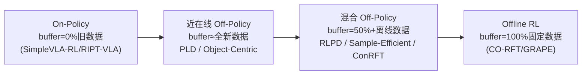
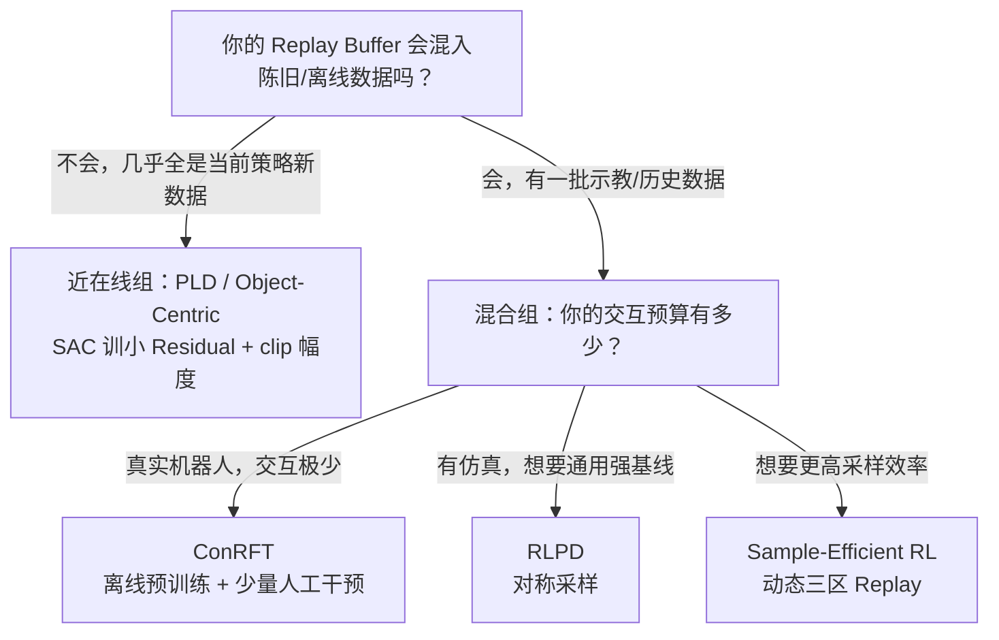

# VLA Off-Policy RL 方法综述：On-Policy 与 Offline 之间的一段谱

> **综述范围**：2024-2026 年所有用 Off-Policy RL（有 Replay Buffer、需少量在线交互）训练/微调 VLA 模型的方法——从 SAC + Residual 到混合数据 Q-Learning
> **关键词**：Off-Policy、SAC、Residual RL、Replay Buffer、外推误差、分布偏移、RLPD、采样效率
> **适用读者**：了解基本 RL 和 VLA 概念，想理解"Off-Policy 到底和 On-Policy、Offline RL 有什么本质区别，而不只是记住几个方法名字"

---

## 相关阅读

在阅读本文前，建议先了解以下前置知识：

- [SAC (Soft Actor-Critic)](/前置知识/000k_前置知识_SAC_Soft_Actor_Critic) — Off-policy RL 的代表算法
- [Replay Buffer](/前置知识/000r_前置知识_Replay_Buffer_经验回放) — Off-policy 的核心数据结构
- [Q 函数与 Value 函数](/前置知识/000o_前置知识_Q函数与Value函数) — Q-V 分离式 Advantage
- [离线强化学习基础](/前置知识/000s_前置知识_离线强化学习基础) — 外推误差 / 分布偏移问题的完整定义，本文第三章直接建立在这篇之上
- [CQL 保守 Q 学习](/前置知识/002g_前置知识_CQL保守Q学习) — 纯 Offline RL 处理外推误差的标准做法，本文会反复用它做对照

关联文章：

- [VLA On-Policy RL 方法综述](./S12_VLA_On_Policy_RL方法综述) — 谱系的一端：数据全部来自当前策略，每批用完就丢
- [VLA Offline RL 方法综述](./S14_VLA_Offline_RL方法综述) — 谱系的另一端：零在线交互，全程只用固定数据集
- [PLD 精读](./015_PLD_Residual_RL自改进VLA)、[Object-Centric Residual RL 精读](./023_ObjectCentric_ResidualRL_零迁移VLA) — 近在线组的两篇原文
- [RLPD 精读](./075_RLPD_高效在线RL利用离线数据)、[Sample-Efficient RL 精读](./033_SampleEfficientRL_VLA_高采样效率RL微调)、[ConRFT 精读](./010_ConRFT_一致性策略RL微调VLA) — 混合组的三篇原文

---

## 贯穿全文的例子

> **场景**：一个 7B 的 VLA 模型在真实机器人上部署，执行桌面操作任务。
>
> - SFT 成功率约 60%，失败主要是"差几毫米没夹住"这种精度问题
> - 有仿真环境（或愿意做少量真机交互，但不超过 500 episodes）
> - 目标：用最高采样效率把成功率提到 85%+
>
> 后面会看到，同样这个场景下，"要不要往 Replay Buffer 里塞离线数据"这一个选择，就决定了你面对的是完全不同的两类风险。

---

## 一、Off-Policy 不是一个方法，是一段谱

### 1.1 先纠正一个常见误解

很多人对三者的区分是这样的："On-Policy 是 PPO，Off-Policy 是 SAC，Offline 是不能交互的 SAC"。这个说法只说对了字面意思，没说到点上。**真正决定一个方法面对什么风险、需要什么机制的，不是它叫什么名字，而是它的 Replay Buffer 里，数据是从哪来的、有多"新鲜"。**

三种设定的本质区别：

| 维度 | On-Policy | Off-Policy | Offline RL |
|------|-----------|------------|------------|
| Buffer 里的数据 | 不存 buffer，用完即丢 | 存 buffer，混合新旧数据 | 只有一份固定数据集，永不更新 |
| 数据是否来自当前策略 | 是（严格同分布） | 部分是（新数据），部分不是（旧数据/离线数据） | 完全不是（来自某个早已过时或未知的策略） |
| 能否继续在线交互 | 能（且必须持续交互） | 能（用交互补充新鲜数据） | 不能（这是定义的一部分） |
| 核心风险 | 无（数据总是新鲜，无过时问题） | **取决于 buffer 里旧数据占比** | 外推误差（策略被 Critic 的虚高估值带偏） |

看最后一行——On-Policy 因为数据永远新鲜，天生没有"过时数据"的问题；Offline RL 因为数据永远不更新，外推误差是无法回避的核心矛盾。**Off-Policy 卡在中间，它面对的风险完全取决于 buffer 里旧数据占的比例。** 这就是为什么"Off-Policy"内部会分裂成两类看起来完全不同的方法。

### 1.2 Off-Policy 内部的分裂：两种完全不同的风险

把方法按"buffer 里离线/陈旧数据占比"排开，会看到清晰的两簇：

```mermaid
flowchart LR
    A["On-Policy<br/>buffer=0%旧数据<br/>(SimpleVLA-RL/RIPT-VLA)"] --> B["近在线 Off-Policy<br/>buffer≈全新数据<br/>PLD / Object-Centric"]
    B --> C["混合 Off-Policy<br/>buffer=50%+离线数据<br/>RLPD / Sample-Efficient / ConRFT"]
    C --> D["Offline RL<br/>buffer=100%固定数据<br/>(CO-RFT/GRAPE)"]
```

**左边这簇（近在线）**：PLD、Object-Centric Residual RL。它们的 buffer 里几乎全是"当前联合策略（VLA + Residual）自己刚跑出来的经验"——虽然技术上属于 off-policy（用了几步之前的策略采的数据，严格意义上不是同分布），但**新旧策略之间差距很小**，Critic 见过的动作和当前策略要选的动作高度重合，因此它们完全不用担心外推误差。它们的实际风险是普通的**训练稳定性**问题：一个从零开始学的小网络，如果不加约束，可能在早期探索中输出过大的修正量，把冻结的 VLA 架空。

**右边这簇（混合）**：RLPD、Sample-Efficient RL、ConRFT。它们的 buffer 里明确混入了大量**陈旧甚至完全来自其他策略的数据**（SFT 示教轨迹、历史 rollout）。这时候 Critic 会被要求对"当前策略可能选的、但离线数据里没见过的动作"打分——这正是 [离线强化学习基础](/前置知识/000s_前置知识_离线强化学习基础) 里讲的**外推误差**：Critic 在没有真实数据校准的区域会给出虚高的估值，策略会一头撞进这些虚高区域。ConRFT 的 Phase 1 甚至就是字面意义上的纯 Offline RL（buffer 100% 离线，零在线交互）。

**判断标准**：如果你的方法在没有任何在线交互的情况下删掉全部离线数据也能正常训练——它属于近在线组。如果删掉离线数据训练直接崩溃——它属于混合组，本质上是"Offline RL + 一点在线数据来续命"。

### 1.3 两类风险，两套完全不同的解法

| | 近在线组 | 混合组 |
|--|---------|--------|
| 核心风险 | 训练稳定性（新网络早期探索可能输出过大修正量） | 外推误差 / 分布偏移 |
| 解法思路 | 限制修正幅度，配合迭代蒸馏逐步收紧 | 约束**策略离数据分布多远**（对称采样、Q ensemble、悲观正则） |
| 最像哪个已知方法 | 一般的探索约束/正则 | CQL / IQL（限制 OOD 动作的 Q 值） |
| 需要 CQL 式悲观正则吗 | 不需要（数据本身新鲜，没有"陌生动作"问题） | 大多不需要显式 CQL，但要用别的机制（对称采样等）达到同等效果 |
| 代表方法 | PLD、Object-Centric | RLPD、Sample-Efficient RL、ConRFT |

这就是本文接下来两章的分工：第二章讲近在线组怎么"限制修正幅度防止训练跑偏"，第三章讲混合组怎么"用数据新鲜度代替悲观正则来控制外推误差"。

---

## 二、近在线组：SAC 训练一个小型 Residual 网络

### 2.1 为什么这两个方法基本不涉及外推误差

PLD 训练 Residual 用的 SAC，buffer 里全是"当前 VLA+Residual 联合策略"自己刚产生的 transition；Object-Centric Residual RL 在仿真里从零训练，同样是标准在线 SAC。两者共同点：**Critic 学到的 Q 值范围和当前策略要探索的动作范围高度重合**，Critic 不会被要求对"从未见过的陌生动作"打分，因此不存在离线数据里典型的虚高估值问题。

它们的核心哲学是：**VLA 大方向对了，只差最后的精度微调。用一个极小的 MLP（~100K 参数）学"修正量"，不动 VLA 的 7B 参数**——SAC 天然适合这种场景：动作空间小（只是一个修正向量）、状态空间不大（关节角+末端位姿量级），几万步交互就能收敛。

### 2.2 核心机制：clip 限制修正幅度

$$
a_{\text{final}} = a_{\text{VLA}} + \text{clip}(\pi_{\text{res}}(s),\; -\delta,\; +\delta)
$$

**这个公式在做什么**：VLA 输出基础动作，Residual 网络输出一个被 clip 限制在 $[-\delta, +\delta]$ 范围内的微小修正量。clip 保证 Residual 不会"喧宾夺主"，VLA 的知识完整保留。

::: details 📐 公式详解（点击展开）

| 子表达式 | 它是谁 | 它在干嘛 |
|---------|--------|---------|
| $a_{\text{VLA}}$ | **老司机的基础路线** | VLA 冻结不动，给出一个大方向基本正确的动作 |
| $\pi_{\text{res}}(s)$ | **微调建议** | 只有 ~100K 参数的小 MLP，输出一个修正向量 |
| $\text{clip}(\cdot, -\delta, +\delta)$ | **安全绳** | 无论 Residual 想输出多大的值，硬性卡在 $\pm\delta$ 以内 |
| $a_{\text{VLA}} + \cdots$ | **叠加** | 把修正量加到基础动作上，得到最终执行的动作 |

**用人话读**："VLA 给出一个大致正确的动作，Residual 只能在这个动作附近的一个小范围内做微调，不能推翻 VLA 的决定。"

**为什么是这个形式**：如果不 clip，Residual 在 SAC 训练早期可能因为探索噪声输出一个很大的值，把 VLA 的知识完全覆盖掉。clip 把风险敞口锁死在一个已知范围内，SAC 只需要在这个小范围内做精调，几分钟就能收敛。
:::

**数值感觉**：VLA 输出"向右移 3cm"$a_{\text{VLA}} = [0.03, 0, 0, \ldots]$，目标其实在右偏上 2mm。Residual 学到 $[0, 0.002, 0, \ldots]$（在 $\delta=0.05$ 范围内），叠加后 $a_{\text{final}} = [0.03, 0.002, 0, \ldots]$——只是精调，不是替代。

**PLD（[精读](./015_PLD_Residual_RL自改进VLA)）** 在此基础上加了一层迭代循环：SAC 训好 Residual → 收集"VLA+Residual"成功轨迹 → 蒸馏回 VLA（SFT/LoRA）→ VLA 起点更高 → Residual 需要修正的幅度更小 → 更容易收敛。三轮之后 SFT 65.8% → **89.8%**（超过直接 PPO 的 80.5%），泛化保持 97%。

**Object-Centric Residual RL（[精读](./023_ObjectCentric_ResidualRL_零迁移VLA)）** 解决的是同一套机制在 Sim-to-Real 时的一个额外问题：如果 Residual 的输入是图像，仿真训练出的 Residual 部署到真实机器人时会因为视觉 domain gap 完全失灵。解法是把输入换成**物体 6D 位姿（17 维）**——这是物理量，仿真里解析计算、真实里用 FoundationPose 估计，两边同一坐标系同一精度，不存在 gap。结果：VLA alone 55-65% → +Residual **72-85%** 真实机器人，仿真训练仅需 1 小时。

### 2.3 近在线组小结

| 方法 | 训练对象 | 核心机制 | 关键结果 |
|------|---------|---------|---------|
| [PLD](./015_PLD_Residual_RL自改进VLA) | Residual MLP（~100K 参数） | clip 幅度 + 蒸馏迭代 | SFT 65.8% → 89.8% |
| [Object-Centric](./023_ObjectCentric_ResidualRL_零迁移VLA) | Residual MLP（物体位姿输入） | clip 幅度 + 物体位姿输入 | 55-65% → 72-85% 真机 |

两者都不需要 CQL 式的"悲观压低 OOD 动作 Q 值"，因为它们的数据本身就是新鲜的——这正是近在线组和下一章的分界线。

---

## 三、混合组：外推误差是绕不开的敌人

### 3.1 混合组和纯 Offline RL 共享同一个问题

一旦 buffer 里塞入了不是当前策略产生的旧数据（示教轨迹、历史 rollout），Critic 就要面对 [离线强化学习基础](/前置知识/000s_前置知识_离线强化学习基础) 里说的核心矛盾：**Critic 只能从数据里学到"数据覆盖过的动作"的真实价值，对数据没覆盖的动作，它的输出是外推（extrapolation）而不是学习结果**。如果策略优化器专挑 Critic 打分最高的动作走，很容易正好挑中一个"Critic 因为没见过而瞎猜出高分"的陌生动作——这就是外推误差，纯 Offline RL 的 [CQL](/前置知识/002g_前置知识_CQL保守Q学习) 靠"主动把陌生动作的 Q 值往下压"来解决它。

混合组的三个方法都面对这个问题，但**都没有直接搬 CQL**。原因很简单：它们还有一点在线交互，可以用"让 Critic 持续见到新数据校正自己"来代替"人为压低陌生动作分数"——这比 CQL 更自然，因为陌生动作的真实价值最终会被新数据验证或推翻，不需要靠一个悲观的先验去猜。

### 3.2 三个方法怎么各自实现"用新数据代替悲观正则"

| 方法 | 离线数据在 buffer 中的角色 | 替代 CQL 的机制 | 为什么够用 |
|------|-------------------------|----------------|-----------|
| [RLPD](./075_RLPD_高效在线RL利用离线数据) | mini-batch 固定 50% | 对称采样 + [Q ensemble](/前置知识/002y_前置知识_Q网络Ensemble与Subset_Minimization) + LayerNorm | 50% 在线数据持续冲刷 Q 网络对旧数据的偏好，ensemble 取 min 天然抑制虚高 |
| [Sample-Efficient RL](./033_SampleEfficientRL_VLA_高采样效率RL微调) | 分区动态调整（60%→30%） | VLA 特征 Critic（站在预训练知识上）+ 混合三区 Replay | 早期靠离线数据稳定 Critic，后期逐步让在线数据主导，动态过渡 |
| [ConRFT](./010_ConRFT_一致性策略RL微调VLA) | Phase 1 = 100%（纯离线） | Phase 1 就是标准 Offline RL（Q-learning）；Phase 2 用人工干预数据（信息密度极高）快速校正 | 45-90 分钟真机交互虽短，但每条干预数据都是"人类明确纠正错误"的高价值信号 |

三者的共同逻辑：**用"数据新鲜度"而不是"数值悲观"来控制外推误差**，区别只在于新鲜数据引入的时机和比例节奏不同。

### 3.3 RLPD：为什么"对称采样"能替代 CQL

> **论文**：Efficient Online RL with Offline Data (ICML 2023, UC Berkeley)

RLPD 的证明很直接：标准 SAC，不加任何 CQL/IQL 式的保守正则化，只做三个工程选择，就打败了所有专门设计的 offline-to-online 方法。

| 设计 | 做法 | 对外推误差的作用 |
|------|------|-----------------|
| 对称采样 | mini-batch 50% 在线 + 50% 离线 | 离线数据不会被稀释遗忘，同时在线数据持续给 Critic "新鲜校正" |
| 高 UTD=20 | 每收集 1 步就更新 20 次 | 新数据的校正信号被快速、充分地传播到 Critic |
| 10-Ensemble Q + LayerNorm | 10 个 Q 网络取 subset-of-2 minimum | 多个 Critic 中只要有一个对陌生动作保持谨慎，取 min 就能压低整体估值 |

**这比 CQL 更自然的地方**：CQL 是"我不知道这个动作好不好，所以先假设它不好"（悲观假设）；RLPD 是"我不确定的时候多问几个 Critic，取最谨慎的意见，同时尽快用新数据把不确定性消掉"（用信息代替假设）。RLPD 是后续 Q-Chunking、Sample-Efficient RL、Chunked RL 等工作共同的基础。

### 3.4 Sample-Efficient RL：让离线数据的"角色"随训练动态变化

> **论文**：Sample-Efficient RL Finetuning for VLA (arXiv 2605.25477, 2025)

RLPD 的 50/50 是固定比例，Sample-Efficient RL 把这个比例做成了随训练动态调整的三区结构：

| 区域 | 内容 | 初始占比 | 后期占比 |
|------|------|---------|---------|
| SFT 数据 | 原始示教轨迹（最"离线"） | 60% | 30% |
| 成功经验 | 在线交互的成功轨迹 | 10% | 30% |
| 在线数据 | 所有在线交互（含失败） | 30% | 40% |

早期 Critic 刚开始训练，让 SFT 数据主导，防止在极少在线数据上过拟合；后期在线数据积累够了，逐步把主导权交给它。这是对"用新数据校正陌生动作估值"这条思路的显式时间调度。

另外两个组件不直接处理外推误差，但服务于同一个目标——让 Critic 尽快摆脱对陌生数据的依赖：**VLA-feature Critic**（用冻结 VLA 的 4096 维隐层特征做 Critic 输入，站在预训练知识上，10 步收敛 vs 随机初始化 200+ 步）、**Adaptive Exploration**（VLA 输出置信度低的维度多探索，高的维度少探索，把有限的在线交互预算花在真正需要新数据校正的地方）。

**结果**：500 rollouts 达到 85% SR，采样效率比纯 PPO（On-Policy）高 10×。

### 3.5 ConRFT：Phase 1 其实就是一次标准的 Offline RL

> **论文**：ConRFT: Reinforced Fine-tuning VLA via Consistency Policy (arXiv 2502.05450, 2025)

ConRFT 是混合组里离"纯 Offline RL"最近的一个——它的 **Phase 1 完全零在线交互**，每个任务只用 20~30 条人类示教训练 Q 网络和策略，这一步和 [VLA Offline RL 综述](./S14_VLA_Offline_RL方法综述) 里的方法本质相同。真正让它变成"Off-Policy 混合方法"而不是纯 Offline RL 的，是紧接着的 **Phase 2**：在真实机器人上跑 45~90 分钟（累计 80~120 条策略/人类混合 rollout），人类在危险时刻介入干预。

为什么真实机器人上只需要这么少的在线数据就能显著改善外推误差？因为人工干预不是普通的在线数据——它明确标注了"这个状态必须这样做"，信息密度远高于策略自己探索出来的普通轨迹。少量高密度校正就能把 Phase 1 里 Critic 因为示教数据覆盖不足而产生的虚高估值纠正过来。

ConRFT 的动作头用的是 Consistency Policy（一步生成连续动作），这个选择让 Q-guided 的更新可以直接作用在动作输出上，训练和推理都很快。

**结果**（论文 8 个真实任务平均）：SFT 39.4% → Phase 1 纯离线（Cal-ConRFT）≈39.4%（成功率和 SFT 相近，但 Q 函数已经初始化好，为在线阶段铺路）→ Phase 2 少量在线+人工干预（HIL-ConRFT）**96.3%**，全程仅 45~90 分钟真机交互（累计约 80-120 条策略/人类混合 rollout）。完整数字见 [ConRFT 精读 §6.1](./010_ConRFT_一致性策略RL微调VLA#6-1-真实机器人任务与关键数字)。

### 3.6 混合组小结

| 方法 | 离线数据占比走势 | 核心机制 | 关键结果 |
|------|----------------|---------|---------|
| [RLPD](./075_RLPD_高效在线RL利用离线数据) | 固定 50% | 对称采样 + Q ensemble | 后续方法的共同基础 |
| [Sample-Efficient RL](./033_SampleEfficientRL_VLA_高采样效率RL微调) | 60%→30%（动态） | VLA 特征 Critic + 三区 Replay | 500 rollouts → 85% |
| [ConRFT](./010_ConRFT_一致性策略RL微调VLA) | 100%→逐步引入在线 | Phase 1 纯离线 + Phase 2 人工干预 | 45-90 分钟真机 96.3% |

---

## 四、大对比表：把五个方法放回谱系上看

### 4.1 全方法横向对比

| 方法 | 所属组 | Buffer 离线数据占比 | 核心风险 | 解法 | 所需交互量 | 典型成功率 |
|------|-------|------------------|---------|------|-----------|-----------|
| **[PLD](./015_PLD_Residual_RL自改进VLA)** | 近在线 | ≈0% | 训练稳定性 | clip 幅度 + 蒸馏迭代 | ~100K steps | 89.8% |
| **[Object-Centric](./023_ObjectCentric_ResidualRL_零迁移VLA)** | 近在线 | ≈0% | 训练稳定性 + Sim-to-Real gap | clip 幅度 + 物体位姿输入 | 1h 仿真 | 72-85% 真机 |
| **[RLPD](./075_RLPD_高效在线RL利用离线数据)** | 混合 | 固定 50% | 外推误差 | 对称采样 + Q ensemble | 中等 | SOTA 基线 |
| **[Sample-Efficient](./033_SampleEfficientRL_VLA_高采样效率RL微调)** | 混合 | 动态 60%→30% | 外推误差 | VLA 特征 Critic + 三区 Replay | ~500 rollouts | 85% |
| **[ConRFT](./010_ConRFT_一致性策略RL微调VLA)** | 混合（贴近 Offline） | Phase1=100% | 外推误差 | 离线预训练 + 人工干预校正 | 45-90 分钟 | 96.3% 真机 |

### 4.2 该选哪个？

```mermaid
flowchart TD
    A["你的 Replay Buffer 会混入陈旧/离线数据吗？"] -->|不会，几乎全是当前策略新数据| B["近在线组：PLD / Object-Centric<br/>SAC 训小 Residual + clip 幅度"]
    A -->|会，有一批示教/历史数据| C["混合组：你的交互预算有多少？"]
    C -->|真实机器人，交互极少| D["ConRFT<br/>离线预训练 + 少量人工干预"]
    C -->|有仿真，想要通用强基线| E["RLPD<br/>对称采样"]
    C -->|想要更高采样效率| F["Sample-Efficient RL<br/>动态三区 Replay"]
```

---

## 五、共性技巧与经验

### 5.1 两组各自的技巧（不要混用）

| Trick | 做法 | 属于哪组 | 原因 |
|-------|------|---------|------|
| clip Residual 幅度 | $\|\Delta a\| \le \delta$ | 近在线 | 控制的是训练稳定性，混合组的问题不是幅度失控 |
| 蒸馏迭代 | Residual→VLA 反复蒸馏 | 近在线 | 近在线组特有的"越训越轻松"正反馈循环 |
| 对称采样 | 50% 在线 + 50% 离线 | 混合 | 近在线组没有离线数据可采 |
| Q 网络集成 | 2-10 个 Q 取 min | 混合（也可用于近在线） | 对陌生动作保持谨慎；近在线组虽不必需，但加了也无害 |
| 高 UTD | 每步更新 10-20 次 | 两组通用 | Off-Policy 的通用数据复用优势，和风险类型无关 |
| SFT 数据混入 buffer | 直接把示教数据放进 Replay Buffer | 混合 | 定义上就是把方法从近在线推向混合区 |

**容易犯的错**：把"对称采样""Q ensemble"当成所有 Off-Policy 方法的标配去抄——如果你的场景本来就是近在线（buffer 里没有陈旧数据），这些机制解决的问题根本不存在，白白增加复杂度。先判断自己在谱系上的位置，再选机制。

### 5.2 Off-Policy vs On-Policy vs Offline 的实际性能对比

| 场景 | On-Policy 最佳 | Off-Policy 最佳 | Offline 最佳 |
|------|---------------|----------------|-------------|
| 有仿真、充足算力 | SimpleVLA-RL **94.2%** | PLD 89.8%（近在线） | — |
| 有仿真、节省交互 | PPO ~81%（5000 rollouts） | Sample-Efficient **85%（500 rollouts）**（混合） | — |
| 真实机器人 | iRe-VLA 91%（需多轮迭代） | ConRFT **96.3%（45-90 min）**（混合，贴近 Offline） | CO-RFT 67.5%（零交互，见 [Offline RL 综述](./S14_VLA_Offline_RL方法综述)） |

**核心结论**：三者不是互相替代的选项，而是同一个"数据新鲜度—交互成本"权衡上的三个区域。近在线 Off-Policy 在"愿意持续交互、但要控制训练稳定性"时最优；混合 Off-Policy 在"交互预算有限，但还能做一点"时最优；纯 Offline 是"完全不能交互"时唯一的选择，代价是天花板更低（CO-RFT 67.5% vs ConRFT 96.3%）。

---

## 延伸阅读

- [VLA On-Policy RL 方法综述](./S12_VLA_On_Policy_RL方法综述) — 谱系左端：数据永远新鲜，无过时问题
- [VLA Offline RL 方法综述](./S14_VLA_Offline_RL方法综述) — 谱系右端：零交互，外推误差是唯一矛盾
- [PLD 精读](./015_PLD_Residual_RL自改进VLA) — 近在线组，clip 幅度 + 蒸馏迭代
- [Object-Centric Residual RL 精读](./023_ObjectCentric_ResidualRL_零迁移VLA) — 近在线组，零迁移技术细节
- [RLPD 精读](./075_RLPD_高效在线RL利用离线数据) — 混合组，对称采样的理论分析
- [Sample-Efficient RL 精读](./033_SampleEfficientRL_VLA_高采样效率RL微调) — 混合组，VLA 特征 Critic 架构
- [ConRFT 精读](./010_ConRFT_一致性策略RL微调VLA) — 混合组，真机 Q-learning + 人工干预
- [离线强化学习基础](/前置知识/000s_前置知识_离线强化学习基础) — 外推误差的完整定义
- [CQL 保守 Q 学习](/前置知识/002g_前置知识_CQL保守Q学习) — 纯 Offline RL 如何处理同一个问题
- [SAC 前置知识](/前置知识/000k_前置知识_SAC_Soft_Actor_Critic) — SAC 算法原理
