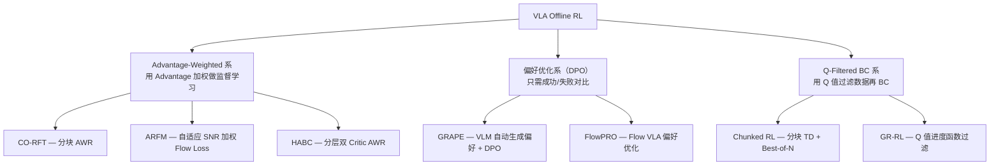
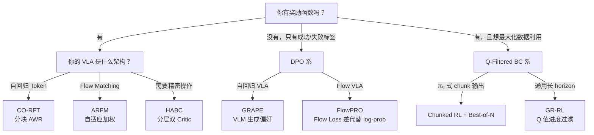

# VLA Offline RL 方法综述：零在线交互的策略优化全景

> **综述范围**：2024-2026 年所有用纯 Offline RL（零在线环境交互）训练/微调 VLA 模型的方法——从 Advantage 加权监督学习到偏好优化，从 Q-Filtered BC 到自适应 Flow Loss
> **关键词**：Offline RL、DPO、AWR、偏好优化、Q-Filtered BC、零交互
> **适用读者**：了解基本 RL 和 VLA 概念，想理解"完全不需要环境交互就能提升 VLA"的所有技术路线

---

## 相关阅读

在阅读本文前，建议先了解以下前置知识：

- [离线强化学习基础](/前置知识/000s_前置知识_离线强化学习基础) — Offline RL 核心概念
- [AWR 优势加权回归](/前置知识/000u_前置知识_AWR_优势加权回归) — 加权 BC 的理论
- [Q 函数与 Value 函数](/前置知识/000o_前置知识_Q函数与Value函数) — Q 值做数据过滤
- [KL 散度与策略约束](/前置知识/000j_前置知识_KL散度与策略约束) — DPO 的理论基础
- [Flow Matching 与连续归一化流](/前置知识/000g_前置知识_Flow_Matching与连续归一化流) — Flow VLA 框架

关联文章：

- [VLA On-Policy RL 方法综述](./S12_VLA_On_Policy_RL方法综述) — PPO/GRPO 路线
- [VLA Off-Policy RL 方法综述](./S13_VLA_Off_Policy_RL方法综述) — SAC/Replay Buffer 路线
- [GRAPE 精读](./020_GRAPE_偏好对齐VLA泛化) — DPO 泛化能力的详细分析
- [CO-RFT 精读](./021_CO_RFT_离线分块RL微调VLA) — 分块 AWR 的完整算法

---

## 贯穿全文的例子

> **场景**：你有一个 SFT 后成功率 60% 的 VLA，手上有 50-200 条离线轨迹（含成功和失败）。
>
> **硬约束**：完全不能做在线环境交互（没有仿真器，真实机器人不允许探索）。
> **目标**：纯靠这些离线数据把成功率提到 75%+。

---

## 一、为什么 Offline RL：零交互的独特价值

### 1.1 什么时候只能用 Offline

| 场景 | 为什么不能在线交互 | Offline RL 的解法 |
|------|------------------|-----------------|
| 真实机器人部署后 | 探索可能损坏设备/环境 | 用部署积累的经验离线优化 |
| 没有仿真环境 | 复杂任务无法精确建模 | 只用人类示教数据 |
| 安全敏感场景 | 医疗/化工等不允许试错 | 从已有成功/失败案例学习 |
| 算力有限 | 仿真渲染太贵 | 纯 GPU 训练，不需要仿真器 |

### 1.2 Offline RL 的三大路线

### 1.3 三条路线的核心区别

| 路线 | 需要什么信号 | 核心操作 | 性能上限 |
|------|------------|---------|---------|
| AWR 加权 | 奖励函数（算 Advantage） | $\exp(A/\beta) \cdot \text{BC loss}$ | 中高 |
| DPO 偏好 | 仅需成功/失败标签 | 偏好对比训练 | 中（但泛化最好） |
| Q-Filtered | 奖励函数（训 Q 网络） | 过滤→只模仿好数据 | 中高 |

---

## 二、Advantage-Weighted 系：好动作多学，差动作少学

### 2.1 核心思想

这类方法的统一逻辑：**用 Advantage 作为权重做监督学习。Advantage 高的动作被大力模仿，Advantage 低的动作被忽略。本质是"有选择的行为克隆"。**

和标准 BC 的对比：

| | 标准 BC | AWR |
|--|--------|-----|
| 对所有数据 | 均匀模仿 | 按质量加权模仿 |
| 失败轨迹 | 也学（学到坏习惯） | 权重 ≈ 0（自动忽略） |
| 最佳轨迹 | 权重和最差一样 | 权重指数级增大 |

### 2.2 CO-RFT：分块 AWR 微调 VLA

> **论文**：Chunked Offline RL Fine-Tuning for VLA (arXiv 2508.02219, 2025)
>
> **核心贡献**：只需 50 条 demo + 零在线交互，把 VLA 成功率从 43% 提到 67.5%

**AWR 核心公式**：

$$
L_{\text{AWR}}(\theta) = -\mathbb{E}_{(s,a)\sim\mathcal{D}}\left[\exp\left(\frac{\hat{A}(s,a)}{\beta}\right) \cdot \log\pi_\theta(a|s)\right]
$$

**这个公式在做什么**：对离线数据做加权的行为克隆——权重是 $\exp(\hat{A}/\beta)$。Advantage 高的动作权重指数级增大，Advantage 低/负的动作权重接近零。

::: details 📐 逐符号拆解 + 数值代入（点击展开）
**逐符号拆解**：

| 符号 | 含义 | 典型值 |
|------|------|--------|
| $\mathcal{D}$ | 离线数据集 | 50-200 条轨迹 |
| $\hat{A}(s,a)$ | chunk 级别 advantage | $R_{\text{chunk}} - V(s)$ |
| $\beta$ | 温度参数 | 0.1（很尖锐） |
| $\exp(\hat{A}/\beta)$ | 指数权重 | $A=1 \to e^{10} \approx 22000$；$A=-1 \to e^{-10} \approx 0.00005$ |
| $\log\pi_\theta(a\|s)$ | 交叉熵 loss | 标准 VLA 训练 loss |

**数值代入**（$\beta=0.1$，3 个 chunk）：

| Chunk | Advantage | 权重 $\exp(A/\beta)$ | 含义 |
|-------|-----------|---------------------|------|
| chunk 1（成功轨迹的关键步） | $+1.5$ | $e^{15} \approx 3.3\times10^6$ | 疯狂学 |
| chunk 2（失败轨迹的错误步） | $-0.5$ | $e^{-5} \approx 0.007$ | 几乎忽略 |
| chunk 3（中性步） | $+0.2$ | $e^{2} \approx 7.4$ | 适度学 |

**为什么是指数权重而非线性**：AWR 的理论推导表明，$\exp(A/\beta)$ 是"在 KL 约束下最大化期望 advantage"这个优化问题的最优解。$\beta$ 对应 KL 约束的拉格朗日乘子——$\beta$ 越小约束越紧，越只关注最好的数据。
:::

**CO-RFT 的独特设计——Chunk 级别**：

不在单步 token 级别算 advantage（太稀疏），而是把 $k=4$ 步打包为一个 chunk，在 chunk 级别计算和加权。好处：
- 1400 个 token 的信用分配 → 压缩到 ~50 个 chunk
- Chunk 内动作方向一致（同一个 advantage 值）
- 奖励信号密度提高 4×

**结果**：SFT 43% → CO-RFT **67.5%**（50 条 demo，零交互）。接近在线 RL 的 71%。

### 2.3 ARFM：自适应加权 Flow Matching Loss

> **论文**：Adaptive Offline RL Post-Training for Flow VLA (arXiv 2509.04063, 2025)
>
> **核心贡献**：解决"RL advantage 注入 Flow Loss 时梯度方差爆炸"的问题

**问题**：对 Flow VLA 做 AWR 时，advantage 的估计噪声乘到 flow loss 梯度上 → 训练极不稳定。

**ARFM 的自适应 SNR 缩放**：

$$
\mathcal{L}_{\text{ARFM}} = \mathbb{E}\left[\alpha(s,a) \cdot \hat{A}(s,a) \cdot \|v_\theta(t, x_t; s) - \text{target}\|^2\right]
$$

**这个公式在做什么**：还是 advantage 加权 flow loss，但额外乘一个自适应系数 $\alpha = \text{clip}(|\hat{A}|/\sigma_A, \alpha_{\min}, \alpha_{\max})$——advantage 估计"信噪比"高时放大 RL 信号，信噪比低时回退到纯 flow loss。

::: details 📐 逐符号拆解 + 数值代入（点击展开）
**逐符号拆解**：

| 符号 | 含义 | 作用 |
|------|------|------|
| $\alpha(s,a)$ | 自适应缩放因子 | SNR 调节器 |
| $|\hat{A}|/\sigma_A$ | 信噪比（advantage 绝对值 / batch 标准差） | 大=信号可靠，小=噪声主导 |
| $\hat{A}(s,a)$ | 离线 GAE 估计的 advantage | 正=好动作，负=差动作 |
| $\|v_\theta - \text{target}\|^2$ | 标准 Flow Matching loss | 学习正确的去噪速度 |

**数值代入**：batch 内 $\sigma_A=2.0$。

- 好动作 $\hat{A}=3.0$：$\alpha=|3.0|/2.0=1.5$ → 大力加权 RL 信号
- 中性动作 $\hat{A}=0.1$：$\alpha=0.1/2.0=0.05$ → 几乎回退到纯 flow loss
- 坏动作 $\hat{A}=-2.5$：advantage 为负但 $\alpha=|{-2.5}|/2.0=1.25$ → RL 信号也强，但方向是"远离这个动作"

**为什么是这个形式**：理论推导表明 $\alpha = \text{SNR}/(1+\text{SNR})$ 是 bias-variance 最优权衡。当 SNR→∞ 时 $\alpha→1$（完全信任 RL），当 SNR→0 时 $\alpha→0$（完全回退 flow loss）。
:::

**结果**：ARFM **76%** vs 在线 FlowRL 78% vs 朴素 RL 加权 58%。离线接近在线上限，且泛化更好（72% vs 65%）。

### 2.4 HABC：分层双 Critic AWR

> **论文**：Hierarchical Advantage Weighting for VLA RL (arXiv 2606.17043, 2025)
>
> **核心贡献**：把信用分配拆成两个正交维度——"能不能成功"和"快不快"

**两个 Critic 分别回答不同问题**：

| Critic | 学什么 | 训练信号 | 回答的问题 |
|--------|--------|---------|-----------|
| Viability $V_{\text{viab}}$ | 从这步出发能否完成任务 | binary outcome | "这步之后还有希望吗？" |
| Efficiency $V_{\text{eff}}$ | 从这步出发多快完成 | episode length | "这步之后还要多久？" |

**合并权重**：$w_t = (\alpha \cdot w_{\text{contact}} \cdot A_{\text{viab}} + \beta \cdot A_{\text{eff}})^+$

**关键洞察**：在接触密集任务中（插入、组装），$w_{\text{contact}}$ 在力传感器检测到接触时设为 2.5×（因为接触瞬间的微小动作差异决定成败），接近阶段设为 0.1×（大致方向对就行）。

**结果**：接触密集任务 HABC **59%** vs PPO 33% vs GRPO 40%。在 PPO/GRPO 完全失败的精密操作场景中，分层 AWR 显著有效。

---

## 三、偏好优化系（DPO）：不需要奖励函数

### 3.1 核心思想

偏好优化的极简逻辑：**给一对轨迹（好的 $\tau^+$、差的 $\tau^-$），让策略更倾向于生成好的那种动作。**

不需要奖励函数、不需要 Q 网络、不需要 Advantage 估计——只需要"哪个更好"的二元判断。

**和 AWR 的对比**：

| 维度 | AWR | DPO |
|------|-----|-----|
| 需要的信号 | 每步的奖励值 | 只需成功/失败标签 |
| 训练 Critic? | 需要（算 Advantage） | 不需要 |
| 数据格式 | $(s, a, r)$ 四元组 | $(τ^+, τ^-)$ 偏好对 |
| 理论基础 | 最大化期望 Advantage | Bradley-Terry 偏好模型 |
| 泛化性 | 中 | **高**（学到原则而非特定环境） |

### 3.2 GRAPE：VLM 自动生成偏好，泛化超越 PPO

> **论文**：GRAPE: Generalizing Robot Policy via Preference Alignment (ICLR 2025)
>
> **核心贡献**：GPT-4V 自动生成偏好数据 + DPO 在泛化上超过在线 PPO

**完整 Pipeline**：

1. **GPT-4V 分析任务** → 输出阶段分解（"接近→抓取→移动→放置"）
2. **GPT-4V 定义评分标准** → 每个阶段的 cost function（距离、角度等）
3. **自动打分** → 每条轨迹按阶段获得分数
4. **构造偏好对** → 同一任务的 top-25% vs bottom-25% 轨迹
5. **DPO 训练** → 标准 DPO loss 对 VLA 做离线优化

**为什么 DPO 泛化比 PPO 好**：

PPO 学的是"在训练环境中哪个动作得分高"——容易过拟合到特定物体位置、光照条件。DPO 学的是"成功轨迹和失败轨迹的**行为模式差异**"——这种"模式"比"特定动作"更能迁移到新场景。

**类比**：PPO 像"背答案"（在这道题中选 B），DPO 像"学方法"（看到关键词就用排除法）。后者在新题上更有用。

**结果**：
- 域内：**83.9%**（+7.4% over SFT）
- 未见任务：**67%**（+21.5% over SFT，**+14.5% over PPO**）
- DPO 在泛化上大幅超过在线 PPO！

### 3.3 FlowPRO：让 Flow VLA 也能用偏好优化

> **论文**：Reward-Free Reinforced Fine-Tuning of Flow-Matching VLAs (arXiv 2606.05468, 2025)
>
> **核心贡献**：解决"Flow VLA 没有 log-prob，标准 DPO 不能直接用"的问题

**核心难题**：DPO 的 loss 需要 $\log\pi_\theta(a|s) - \log\pi_{\text{ref}}(a|s)$，但 Flow VLA 的 log-probability 没有解析解。

**FlowPRO 的替代方案——用 Flow Loss 差代替 Log-Prob 差**：

$$
\Delta_{\text{flow}}(\tau) = \|v_\theta - \text{target}_\tau\|^2 - \|v_{\text{ref}} - \text{target}_\tau\|^2
$$

**这个公式在做什么**：flow loss 低 → 策略"更喜欢"这条轨迹（生成概率高）。所以 flow loss 之差可以代替 log-prob 之差——本质是利用了"loss ∝ -log-prob"这个近似关系。

::: details 📐 逐符号拆解 + 数值代入（点击展开）
**逐符号拆解**：

| 符号 | 含义 | 直觉 |
|------|------|------|
| $v_\theta$ | 当前策略的速度场 | 正在训练的 Flow VLA |
| $v_{\text{ref}}$ | 参考策略的速度场 | 冻结的 SFT 初始模型 |
| $\text{target}_\tau$ | 轨迹 $\tau$ 的 flow 目标 | $a - \epsilon$ |
| $\|\cdot\|^2$ | MSE loss | flow matching 的标准损失 |
| $\Delta < 0$ | 当前策略 loss 比参考低 | 当前策略"更认同"这条轨迹 |

**数值代入**：对成功轨迹 $\tau^+$：$\|v_\theta - \text{target}\|^2 = 0.08$，$\|v_{\text{ref}} - \text{target}\|^2 = 0.12$：

$$
\Delta(\tau^+) = 0.08 - 0.12 = -0.04 \quad (\text{当前策略更喜欢好轨迹} ✓)
$$

对失败轨迹 $\tau^-$：$\|v_\theta - \text{target}\|^2 = 0.15$，$\|v_{\text{ref}} - \text{target}\|^2 = 0.10$：

$$
\Delta(\tau^-) = 0.15 - 0.10 = +0.05 \quad (\text{当前策略更不喜欢坏轨迹} ✓)
$$

DPO 会奖励这个方向（让策略继续远离坏轨迹、接近好轨迹）。

**为什么是这个形式**：在 flow matching 中，$\|v - \text{target}\|^2$ 近似于 $-\log p(\text{data})$ 的上界（变分下界的负数）。所以 loss 差 ≈ log-prob 差，可以直接代入 DPO 的 Bradley-Terry 模型。
:::

**结果**：SFT 65% → FlowPRO **78%**。零交互、零奖励函数。接近在线 FlowRL（80%）。

---

## 四、Q-Filtered BC 系：用 Q 网络筛选好数据

### 4.1 核心思想

先离线训一个 Q 网络（用 TD 学习），然后用 Q 值来**判断数据中哪些 transition 是好的**，只让策略模仿好的部分。

**和 AWR 的区别**：AWR 用 Advantage 做**连续加权**（指数权重），Q-Filtered BC 用 Q 值做**二元过滤**（保留/丢弃）。后者更激进——完全不学坏数据。

### 4.2 Chunked RL：分块 TD + Best-of-N（π₀ 的离线微调）

> **论文**：Chunked Offline RL Fine-Tuning for VLA Models (arXiv 2508.02219, 2025, Google DeepMind)
>
> **核心贡献**：把 Q-Chunking 理论应用到 π₀ VLA 的离线微调

**核心流程**：

1. **Chunk 级别 TD 训练 Critic**：

$$
Q(s_t, a_{t:t+h}) \leftarrow r_{t:t+h} + \gamma^h \cdot Q_{\text{target}}(s_{t+h}, a_{t+h:t+2h})
$$

**这个公式在做什么**：π₀ 的动作是 16 步 chunk。Chunk 级别 TD 一步就把 16 步后的信号传到 chunk 起点（单步 TD 需要 16 步才能传到），信号传播速度快 16×。

::: details 📐 逐符号拆解 + 数值代入（点击展开）
**逐符号拆解**：

| 符号 | 含义 | 在 π₀ 中 |
|------|------|---------|
| $a_{t:t+h}$ | 一个完整的动作 chunk（$h=16$ 步） | π₀ 一次前向传播的输出 |
| $r_{t:t+h}$ | chunk 内 16 步的折扣奖励和 | $\sum_{i=0}^{15} \gamma^i r_{t+i}$ |
| $\gamma^h$ | chunk 级别折扣 | $0.99^{16} = 0.851$ |
| $Q_{\text{target}}$ | 目标 Q 网络（EMA 慢更新） | 稳定训练目标 |

**数值代入**：$h=16$，chunk 内奖励和 $r_{t:t+h} = 16 \times (-0.01) = -0.16$（纯时间惩罚），$Q_{\text{target}}(s_{t+16}, a') = 8.5$：

$$
Q(s_t, a_{t:t+16}) \leftarrow -0.16 + 0.851 \times 8.5 = -0.16 + 7.23 = 7.07
$$

单步 TD 算同样的值需要 16 步迭代才能传回来，Chunk TD 一步搞定。

**为什么是这个形式**：标准 Bellman 方程在 chunk 级别的自然推广。$h$ 步的"super-transition"直接跳过中间状态，像 $n$ 步 TD 但 $n$ 刚好等于 chunk 大小。
:::

2. **Best-of-N 策略改进**：不修改 VLA 参数，而是从 VLA 采样 $N=4\sim8$ 个 chunk，选 Q 值最高的执行。

**为什么不直接用 Q 梯度优化 VLA**：π₀ 是 Flow VLA（Q 梯度穿过 flow 会爆炸，见 [SAC-Flow](./079_SAC_Flow_用SAC直接训练Flow策略)）。Best-of-N 完全绕开了梯度问题——只需要 Q 网络做"评分"，不需要梯度穿过策略。

**结果**：Chunked TD >> 单步 TD（15-25% 改善），200 条离线轨迹即可。

### 4.3 GR-RL：Q 值天然就是进度函数

> **论文**：Going Dexterous and Precise for Long-Horizon Manipulation (arXiv 2512.01801, 2024)
>
> **核心贡献**：发现离线训练的 Q 函数可以直接当"任务进度指标"用

**核心洞察**：在 sparse reward 下（只有终点 +1），$Q(s,a)$ 的含义就是"从 $(s,a)$ 出发最终成功的概率"——$Q$ 高 = 接近成功，$Q$ 低 = 远离成功。

**过滤逻辑**：

$$
\Delta_t = Q(s_{t+1}, a_{t+1}) - Q(s_t, a_t)
$$

**这个公式在做什么**：计算相邻两步的 Q 值之差——如果 Q 值增加了（$\Delta_t > 0$），说明这一步让任务更接近成功（正向进度）；如果 Q 值没增加或减少，说明这步在原地踏步或倒退。

::: details 📐 逐符号拆解 + 数值代入（点击展开）
**逐符号拆解**：

| 符号 | 含义 | 直觉 |
|------|------|------|
| $Q(s_t, a_t)$ | 当前步的 Q 值 | "执行这个动作后，成功概率有多大" |
| $Q(s_{t+1}, a_{t+1})$ | 下一步的 Q 值 | "到了下一状态后，成功概率变成多大" |
| $\Delta_t > 0$ | Q 值增加 | 这一步在"进步"→保留 |
| $\Delta_t \le 0$ | Q 值没增或减少 | 这一步在"退步"或原地转→丢弃 |

**数值代入**：假设某轨迹中三步的 Q 值分别为 $[0.3, 0.5, 0.4]$：

- $\Delta_0 = 0.5 - 0.3 = +0.2 > 0$ → 保留（第 0 步有进步）
- $\Delta_1 = 0.4 - 0.5 = -0.1 \le 0$ → 丢弃（第 1 步在退步）

过滤后只用第 0 步的 $(s_0, a_0)$ 做 BC。

**为什么是这个形式**：比直接用 $Q(s_t, a_t)$ 的绝对值更鲁棒——Q 网络可能全局偏高或偏低（标定不准），但"差值"消除了标定误差，只关注"方向是否正确"。
:::

过滤规则：
- $\Delta_t > 0$：这一步让 Q 值增加了 → **正向进度** → 保留
- $\Delta_t \le 0$：这一步没有帮助或在倒退 → **丢弃**

用过滤后的 transitions 做 BC 训练策略。

**和 RECAP 的对比**：

| 维度 | RECAP | GR-RL |
|------|-------|-------|
| 进度信号 | 手工构造（$-(L-i-1)/L_{\max}$） | 学出来的 Q 值 |
| 需要设计? | 需要设计 reward shaping | 自动从数据中学 |
| 精度 | 受 episode length 分辨率限制 | Q 函数可学到状态-动作级的精细区分 |

**结果**：Q-Filtered BC 成功率是普通 BC 的 **2-3×**，且不需要任何 reward engineering。

---

## 五、大对比表

| 方法 | 算法类型 | 需要奖励函数? | VLA 架构 | 数据需求 | 典型结果 | 计算代价 |
|------|---------|------------|---------|---------|---------|---------|
| **CO-RFT** | AWR（分块） | ✅ | 自回归 | 50 条 demo | 67.5% | 低 |
| **ARFM** | 加权 Flow Loss | ✅ | Flow | 离线数据 | 76% | 低 |
| **HABC** | 双 Critic AWR | ✅（binary outcome） | 任意 | 在线收集+离线优化 | 59%（困难） | 中 |
| **GRAPE** | DPO | ❌（只要成功/失败标签） | 自回归 | 50+ 偏好对 | **83.9%** / 67% 泛化 | 低 |
| **FlowPRO** | Flow DPO | ❌ | Flow | 50+ 偏好对 | 78% | 低 |
| **Chunked RL** | Chunk TD + Best-of-N | ✅ | Flow (π₀) | 200 条轨迹 | chunk >> step | 中 |
| **GR-RL** | Q-Filtered BC | ✅（sparse） | 通用 | 混合质量数据 | 2-3× over BC | 中 |

---

## 六、该选哪个？

---

## 七、核心要点总结

1. **50 条 demo + 零交互就能有意义地提升 VLA**：CO-RFT 和 GRAPE 都证明了这一点
2. **DPO 系在泛化上独树一帜**：GRAPE 的未见任务性能超过在线 PPO 14.5pp——学到的是"原则"而非"记忆"
3. **Flow VLA 有专属方案**：ARFM（加权 flow loss）和 FlowPRO（flow loss 差做 DPO）解决了 Flow 的 log-prob 不可算问题
4. **Q-Filtered BC 是"最后一公里"的利器**：当数据质量参差不齐时，用 Q 值筛选 + 只学好数据，效果远超均匀 BC
5. **Offline RL 的上限受数据质量约束**：如果离线数据中完全没有成功轨迹，任何 offline 方法都无能为力——此时必须回到 off-policy/on-policy 路线

---

## 延伸阅读

- [CO-RFT 精读](./021_CO_RFT_离线分块RL微调VLA) — 分块 AWR 完整算法
- [ARFM 精读](./027_ARFM_自适应离线RL后训练Flow_VLA) — 自适应 SNR 缩放
- [HABC 精读](./042_HABC_分层优势加权行为克隆) — 分层 Advantage 信用分配
- [GRAPE 精读](./020_GRAPE_偏好对齐VLA泛化) — VLM 生成偏好 + DPO 泛化分析
- [FlowPRO 精读](./035_FlowPRO_无奖励偏好优化Flow_VLA) — Flow VLA 偏好优化
- [Chunked RL 精读](./078_ChunkedRL_分块离线RL微调VLA) — π₀ 的分块 TD
- [GR-RL 精读](./099_GR_RL_灵巧精确长horizon操作) — Q 值进度过滤
- [AWR 前置知识](/前置知识/000u_前置知识_AWR_优势加权回归) — AWR 理论基础
- [离线强化学习基础](/前置知识/000s_前置知识_离线强化学习基础) — Offline RL 核心概念
- [VLA Off-Policy RL 方法综述](./S13_VLA_Off_Policy_RL方法综述) — 对比：有 Replay Buffer 的路线
- [VLA On-Policy RL 方法综述](./S12_VLA_On_Policy_RL方法综述) — 对比：PPO/GRPO 路线
