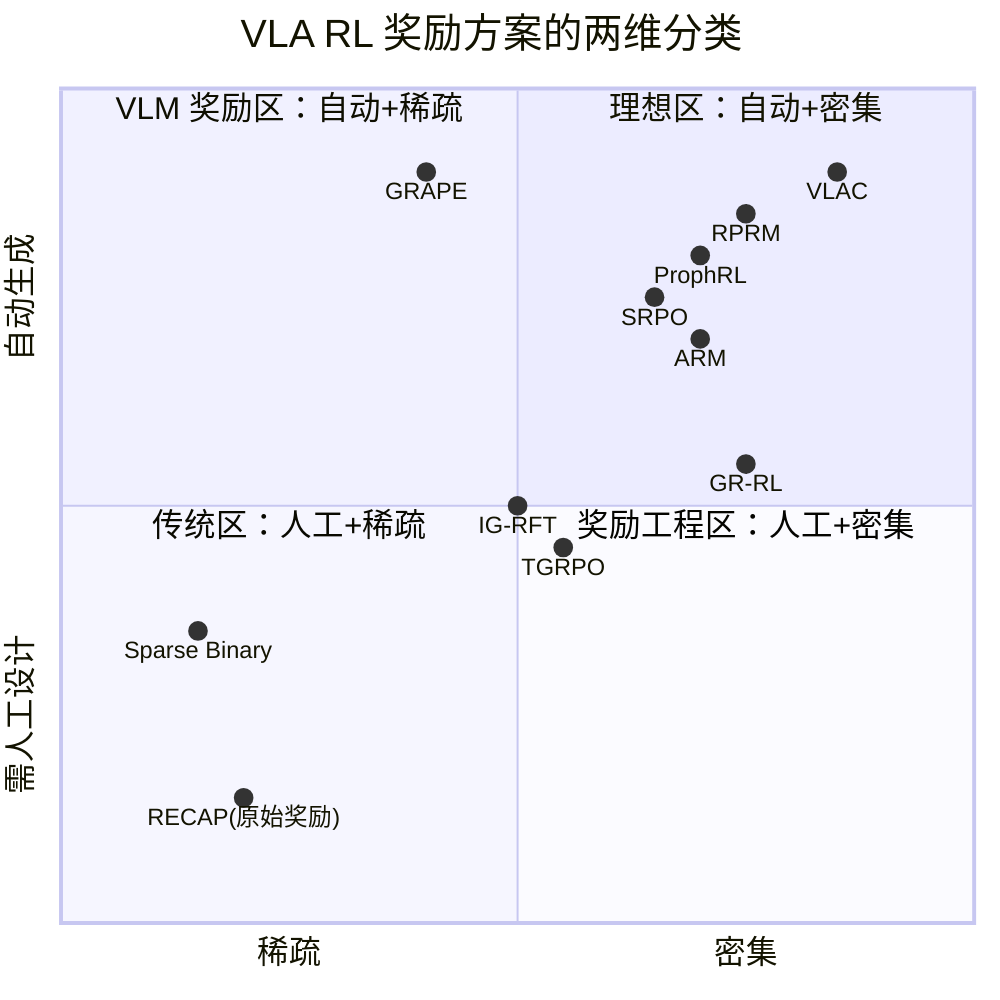

# VLA RL 奖励信号设计方法综述：从 Sparse Binary 到通用过程奖励模型

> **综述范围**：2024-2026 年所有用于 VLA 强化学习后训练的奖励信号构造方法——从最简单的成功/失败二值信号，到大规模视觉-语言过程奖励模型
> **关键词**：VLA、奖励设计、过程奖励模型（PRM）、价值函数、里程碑奖励、World Model 奖励、VLM 奖励生成
> **适用读者**：了解基本 RL 和 VLA 概念，想系统理解"VLA RL 训练时奖励从哪来、各种方案优劣如何"

---

## 相关阅读

在阅读本文前，建议先了解以下前置知识：

- [策略梯度与 PPO](/前置知识/000a_前置知识_策略梯度与PPO) — RL 训练的核心算法
- [Q 函数与 Value 函数](/前置知识/000o_前置知识_Q函数与Value函数) — 价值函数做奖励的基础
- [行为克隆与 RL 微调范式](/前置知识/000d_前置知识_行为克隆与RL微调范式) — SFT → RL 的标准流程
- [KL 散度与策略约束](/前置知识/000j_前置知识_KL散度与策略约束) — 理解奖励与约束的博弈
- [GRPO](/前置知识/000m_前置知识_GRPO_Group_Relative_Policy_Optimization) — 无 Critic 的 RL 方法如何利用奖励

关联文章：

- [VLA 模型的 RL 后训练综述](./S06_VLA模型的RL后训练综述) — RL 后训练全景图
- [VLA On-Policy RL 方法综述](./S12_VLA_On_Policy_RL方法综述) — 各方法如何使用奖励
- [VLA Off-Policy RL 方法综述](./S13_VLA_Off_Policy_RL方法综述) — Off-policy 场景的奖励需求
- [RECAP 精读](./016_RECAP_从真实部署经验中RL学习) — 奖励本身极简，靠优势条件化绕开奖励塑形的典型
- [TGRPO 精读](./019_TGRPO_轨迹级GRPO微调VLA) — 里程碑奖励的典型
- [IG-RFT 精读](./034_IG_RFT_交互引导长horizon_VLA_RL) — 交互点奖励的典型
- [ProphRL 精读](./022_ProphRL_预测式VLA后训练) — 预测式奖励的典型
- [SRPO 精读](./011_SRPO_自参考策略优化) — 隐空间进度奖励的典型
- [PRM-as-a-Judge 精读](./135_PRMasaJudge_密集过程评测机器人策略) — 同一类过程奖励模型换一个身份：不当训练时的奖励，改当评测时的密集裁判

---

## 贯穿全文的例子

> **场景**：一个 7B 参数的 VLA 模型在仿真环境中执行长 horizon 桌面操作任务——"把红色方块放进蓝色碗里"。
>
> - 一个完整 episode 约 200 步（每步 50ms）
> - SFT 后成功率约 65%，失败模式：夹爪接近但没夹住、路径偏移撞到碗边
> - RL 目标：用最少的奖励工程量把成功率提到 90%+
> - 核心问题：200 步中只有最后 1 步能判断"成功/失败"——中间 199 步没有任何信号
>
> 后面每种奖励方案，我们都会回到这个例子，看它怎么给这 200 步提供训练信号。

---

## 一、为什么奖励设计是 VLA RL 的第一大瓶颈

### 1.1 VLA 任务的奖励困境

传统 RL（如 Atari、MuJoCo）的奖励通常是环境内置的：游戏分数、速度、能量消耗。但 VLA 面对的机器人操作任务有三个独特困难：

| 困难 | 原因 | 后果 |
|------|------|------|
| 极度稀疏 | 大多数任务只有 episode 结束时的 success/fail | 200 步中 199 步梯度为零 |
| 难以人工设计 | "把东西放进碗里"的中间进度如何量化？ | 需要领域专家逐任务手写 |
| 多任务不通用 | A 任务的"距离目标越近越好"对 B 任务可能无意义 | 每换一个任务就要重新设计 |

**核心矛盾**：RL 需要密集、准确的信号来驱动学习，但机器人任务天然只提供稀疏、模糊的信号。

### 1.2 奖励信号的分类框架

从"信号从哪来"的角度，当前所有 VLA RL 奖励方案可以沿两个轴分类：



> **注意**：RECAP 的原始环境奖励其实非常朴素（每步 −1，成功 0，失败 −$C_{\text{fail}}$），落在图中"人工+稀疏"区域，和 Sparse Binary 类似。它真正的创新不在奖励设计本身，而在于**训练好价值函数之后怎么用**——用来计算优势并二值化成一个条件标签，绕开奖励塑形直接做条件生成训练。第十一节会专门讲清楚这一点，不要把它和"用价值函数做密集奖励"的 GR-RL 混为一谈。

### 1.3 本文的覆盖范围

本文将按"从简单到复杂"的顺序，逐一介绍 13 种奖励构造方案：

1. **Sparse Binary**（最简单基线）
2. **手工 Shaped Reward**（传统方式）
3. **Robotic Process Reward Model（RPRM）**——VLA-RL
4. **Milestone / 里程碑奖励**——TGRPO
5. **交互点奖励**——IG-RFT
6. **Prophet 预测式奖励**——ProphRL
7. **World Model 隐空间进度**——SRPO
8. **VLM/GPT-4V 自动生成 cost function**——GRAPE
9. **Q 值差分做密集信号**——GR-RL
10. **优势条件化（绕开奖励塑形，而非更好的奖励）**——RECAP
11. **通用过程奖励模型 VLAC**——视觉-语言-动作-Critic
12. **Advantage Reward Modeling（ARM）**——相对进度估计
13. **World Model + VLM 联合奖励**——WorldEnv / RAW-Dream / WorldGymnast

---

## 二、Sparse Binary：最简单的起点

### 2.1 定义

整个 episode 结束后，根据任务是否完成给一个 0/1 信号：

$$
r_t = \begin{cases} 1 & \text{if } t = T \text{ and task success} \\ 0 & \text{otherwise} \end{cases}
$$

**这个公式在做什么**：只在 episode 最后一步、且任务成功时给奖励 1，其余时刻奖励全为 0。

::: details 📐 逐符号拆解 + 数值代入（点击展开）
**逐符号拆解**：

| 符号 | 含义 | 具体是什么 |
|------|------|-----------|
| $r_t$ | 第 $t$ 步的即时奖励 | 策略在这一步收到的反馈信号 |
| $T$ | episode 总步数 | 在我们的例子中为 200 |
| task success | 任务成功判定 | 由环境 success predicate 决定（如"方块在碗里"） |

**数值代入**：200 步的 episode，只有第 200 步且方块在碗里时 $r_{200}=1$，前 199 步全是 $r_t=0$。

**为什么是这个形式**：这是最客观、最不需要人工设计的奖励——只依赖一个可自动判定的最终状态。
:::

### 2.2 优缺点

| 优点 | 缺点 |
|------|------|
| 零奖励工程成本 | 梯度极度稀疏，sample efficiency 极低 |
| 任务间通用（只要有 success predicate） | 策略不知道"差一点成功"和"完全没动"的区别 |
| 无 reward hacking 风险 | 长 horizon 任务几乎学不动 |

### 2.3 在例子中的表现

回到我们的"方块放碗"场景：策略跑了 200 步，最终方块没进碗（差 2mm 没对准）。这整个 episode 的总奖励 = 0，和"完全没动手"的 episode 拿到一样的信号。GRPO/PPO 无法区分"差一点"和"差十万八千里"，学习效率极低。

### 2.4 谁在用

- [VLA-RL](./006_VLA_RL_PPO直接训练自回归VLA) 的基线实验
- [RIPT-VLA](./007_RIPT_VLA_无Critic的VLA后训练) 的 GRPO 变体
- 几乎所有 VLA RL 论文都会用 sparse binary 作为消融实验中的最弱基线

**结论**：Sparse binary 是"能用但不好用"的兜底方案。一旦任务 horizon 超过 50 步或成功率低于 30%，就必须引入更密集的信号。

---

## 三、手工 Shaped Reward：传统方式

### 3.1 定义

人工设计一个中间进度函数 $\phi(s_t)$，每步给出奖励：

$$
r_t = \phi(s_{t+1}) - \phi(s_t) + r^{\text{sparse}}_t
$$

**这个公式在做什么**：奖励 = "状态进度的增量" + "最终的稀疏成功奖励"。进度提升就给正奖励，退步就给负奖励。

::: details 📐 逐符号拆解 + 数值代入（点击展开）
**逐符号拆解**：

| 符号 | 含义 | 具体是什么 |
|------|------|-----------|
| $\phi(s)$ | 人工设计的进度势函数 | 例如"夹爪到目标物的距离的负数"：$\phi(s)=-\|p_{\text{gripper}} - p_{\text{target}}\|$ |
| $\phi(s_{t+1}) - \phi(s_t)$ | 相邻两步的进度增量 | 正值表示靠近目标，负值表示远离 |
| $r^{\text{sparse}}_t$ | 最终的稀疏奖励 | 成功时 +10，失败时 0 |

**数值代入**：假设 $t=50$ 时夹爪在距方块 0.1m 处，$t=51$ 时在 0.08m 处：
- $\phi(s_{50}) = -0.1$，$\phi(s_{51}) = -0.08$
- $r_{50} = (-0.08) - (-0.1) + 0 = +0.02$

夹爪靠近了 2cm，奖励 +0.02。方向正确！

**为什么是这个形式**：势函数差分（potential-based shaping）是唯一不改变最优策略的奖励塑形形式（Ng et al., 1999）。
:::

### 3.2 优缺点

| 优点 | 缺点 |
|------|------|
| 每步都有梯度，学习快 | 需要人工为每个任务设计 $\phi$ |
| 不改变最优策略（势函数差分保证） | 多阶段任务的 $\phi$ 很难设计（先抓→再移→再放） |
| 实现简单 | reward hacking 风险：策略可能找到提高 $\phi$ 但不完成任务的捷径 |

### 3.3 在 VLA 场景的局限

VLA 的核心价值是**多任务通用**——一个模型做 50 个任务。如果每个任务都要手写一个 $\phi$，成本太高。而且很多任务的"进度"不是简单的欧几里得距离：

- "把盖子拧紧"——进度是什么？角度？力矩？
- "把绳子打个结"——如何量化"离打好结还有多远"？
- "整理桌面"——多个物体各自的目标位置，如何合成一个标量？

**结论**：手工 shaped reward 在单任务仿真中有用，但无法 scale 到多任务 VLA。后续所有方法的核心动机就是：**自动化奖励生成，替代人工设计**。

---

## 四、RPRM：Robotic Process Reward Model（VLA-RL）

### 4.1 核心思路

[VLA-RL](./006_VLA_RL_PPO直接训练自回归VLA) 的关键创新是训练一个**机器人过程奖励模型（Robotic Process Reward Model, RPRM）**——一个预训练的视觉-语言模型（VLM），被微调为能逐步判断"当前状态离任务完成还有多远"。

它和 LLM 领域的过程奖励模型（Process Reward Model, PRM）是同一思路的跨域迁移：LLM PRM 给推理链的每一步打分（"这步推理对不对"），RPRM 给机器人轨迹的每一帧打分（"这帧离成功近了还是远了"）。

### 4.2 RPRM 的训练方法

RPRM 不需要人工逐帧标注。VLA-RL 提出了一种自动生成伪标签的方法：

1. **轨迹分段**：用 VLM 对每条轨迹做语义分段，识别出"抓取"、"移动"、"放置"等子阶段的边界
2. **伪标签生成**：对于成功轨迹，假设越靠后的帧"进度越高"；对于失败轨迹，失败点之后的帧标为"退步"
3. **VLM 微调**：在伪标签上微调一个 InternVL 等 VLM，输入 (当前图像, 语言指令)，输出一个 $[0, 1]$ 的进度分数

### 4.3 RPRM 做奖励的方式

训练好的 RPRM 在 RL 训练循环中这样使用：

$$
r_t = \text{RPRM}(o_{t+1}, l) - \text{RPRM}(o_t, l)
$$

**这个公式在做什么**：奖励 = RPRM 对下一帧的进度打分 − 当前帧的打分。进度提升就给正奖励。

::: details 📐 逐符号拆解 + 数值代入（点击展开）
**逐符号拆解**：

| 符号 | 含义 | 具体是什么 |
|------|------|-----------|
| $\text{RPRM}(o, l)$ | 过程奖励模型的输出 | 输入观测图像 $o$ 和语言指令 $l$，输出 $[0,1]$ 进度分 |
| $o_t$ | 第 $t$ 步的观测图像 | 机器人摄像头拍到的 RGB 帧 |
| $l$ | 语言任务指令 | "put the red block into the blue bowl" |

**数值代入**：假设 $t=100$，夹爪刚夹住方块：
- $\text{RPRM}(o_{100}, l) = 0.45$（已抓住，但还没移到碗上方）
- $\text{RPRM}(o_{101}, l) = 0.48$（开始向碗移动）
- $r_{100} = 0.48 - 0.45 = +0.03$

又如 $t=150$，方块不小心掉了：
- $\text{RPRM}(o_{150}, l) = 0.60$，$\text{RPRM}(o_{151}, l) = 0.30$
- $r_{150} = 0.30 - 0.60 = -0.30$（大负奖励：退步了！）

**为什么是这个形式**：差分形式保证了和势函数塑形等价（Ng 1999），不改变最优策略。用 VLM 学到的语义理解替代了人工设计的距离函数。
:::

### 4.4 优缺点

| 维度 | RPRM |
|------|------|
| 信号密度 | ⭐⭐⭐⭐ 每步都有 |
| 人工设计量 | ⭐⭐⭐ 需要收集轨迹做 VLM 微调，但不需要手写规则 |
| 多任务通用性 | ⭐⭐⭐⭐ 一个 RPRM 可覆盖多个语言条件的任务 |
| 准确性 | ⭐⭐⭐ 依赖 VLM 的视觉理解能力，对精细操作可能不够 |
| 计算开销 | ⭐⭐ 每步都要过一次 VLM 推理 |

### 4.5 在例子中的表现

RPRM 能区分"夹住方块后向碗移动"（持续正奖励）和"夹住后乱晃"（奖励不变或负），这是 sparse binary 做不到的。但对于"差 2mm 没对准碗口"这种极精细的失败，RPRM 的视觉分辨率可能不够——它可能给出 0.90 和 0.92 的差异，信号太弱。

---

## 五、Milestone / 里程碑奖励（TGRPO）

### 5.1 核心思路

[TGRPO](./019_TGRPO_轨迹级GRPO微调VLA) 提出**里程碑奖励（Milestone Reward）**：不逐步打分，而是在轨迹的关键节点给予离散奖励。它将一个长 horizon 任务拆成若干子目标（milestones），每达到一个子目标就给 +1。

### 5.2 里程碑的定义方式

TGRPO 通过语言任务分解来定义 milestones：

- 任务："put the red block into the blue bowl"
- 里程碑 1：夹爪接触方块（+1）
- 里程碑 2：方块被夹起（+1）
- 里程碑 3：方块移到碗上方（+1）
- 里程碑 4：方块放入碗中（+1，同时是最终 success）

检测方式：用预训练 VLM 或简单的状态判定器检查每帧是否满足里程碑条件。

### 5.3 奖励公式

$$
r_t = \sum_{k=1}^{K} \mathbb{1}[\text{milestone}_k \text{ first achieved at step } t]
$$

**这个公式在做什么**：在某一步首次达到某个里程碑时，给 +1 奖励。一个里程碑只奖励一次。

::: details 📐 逐符号拆解 + 数值代入（点击展开）
**逐符号拆解**：

| 符号 | 含义 | 具体是什么 |
|------|------|-----------|
| $K$ | 里程碑总数 | 在我们的例子中 $K=4$ |
| $\mathbb{1}[\cdot]$ | 指示函数 | 条件成立 =1，否则 =0 |
| $\text{milestone}_k$ | 第 $k$ 个子目标 | 如"方块被夹起" |

**数值代入**：
- $t=80$：夹爪首次接触方块 → $r_{80}=1$
- $t=85$：方块被夹起 → $r_{85}=1$
- $t=130$：方块移到碗上方 → $r_{130}=1$
- $t=180$：方块放入碗 → $r_{180}=1$
- 其他步：$r_t=0$

总回报 $R=4$，比 sparse binary 的 $R=1$ 信息量大得多。

**为什么是这个形式**：里程碑奖励是"粗粒度的进度"——不如逐步打分密集，但比只看最终结果密集得多。核心假设是"任务可以被分解为有序子目标"。
:::

### 5.4 优缺点

| 维度 | Milestone 奖励 |
|------|---------------|
| 信号密度 | ⭐⭐⭐ 比 sparse 密集，但仍有大段 0 奖励区间 |
| 人工设计量 | ⭐⭐ 需要定义里程碑（但可用 LLM 自动分解） |
| 多任务通用性 | ⭐⭐⭐ 不同任务有不同里程碑，需重新定义 |
| 准确性 | ⭐⭐⭐⭐ 里程碑判定相对清晰，不容易被 hack |
| 计算开销 | ⭐⭐⭐⭐ 每步只需做简单条件判断 |

---

## 六、交互点奖励（IG-RFT）

### 6.1 核心思路

[IG-RFT](./034_IG_RFT_交互引导长horizon_VLA_RL) 提出了一种更自动化的"里程碑"定义方式：**交互点（Interaction Points）**。核心观察是：机器人操作任务的关键进展总是发生在"物体-物体"或"手-物体"的接触时刻。因此，不需要人工定义子目标，只需检测**物理交互事件**。

### 6.2 交互点的检测

在仿真环境中，交互点可以通过物理引擎直接获得：
- 夹爪与物体的首次接触力 > 阈值
- 物体与目标容器的首次接触
- 物体离开支撑面（被提起）

在真实环境中，可通过力/力矩传感器或视觉变化检测近似获得。

### 6.3 与 Milestone 的区别

| 维度 | Milestone（TGRPO） | Interaction Points（IG-RFT） |
|------|-------------------|---------------------------|
| 定义来源 | 语言任务分解 | 物理接触事件 |
| 是否需要任务知识 | 需要知道子目标顺序 | 不需要——纯粹基于物理 |
| 通用性 | 每任务需重新定义 | 接触检测逻辑任务间通用 |
| 精度 | 语义级别（可能漏检） | 物理级别（精确但可能太细） |

### 6.4 优缺点

| 维度 | 交互点奖励 |
|------|-----------|
| 信号密度 | ⭐⭐⭐ 关键时刻有信号，中间过渡仍为 0 |
| 人工设计量 | ⭐⭐⭐⭐ 只需定义"什么算交互"的通用阈值 |
| 多任务通用性 | ⭐⭐⭐⭐ 物理接触检测不依赖具体任务语义 |
| 准确性 | ⭐⭐⭐ 接触 ≠ 正确操作（碰到但没夹住也算交互） |
| 计算开销 | ⭐⭐⭐⭐⭐ 几乎零额外开销 |

---

## 七、Prophet 预测式奖励（ProphRL）

### 7.1 核心思路

[ProphRL](./022_ProphRL_预测式VLA后训练) 的创新点是让 VLA 模型自己预测"当前状态能否成功完成任务"，然后用**预测值的变化**作为奖励。思路是：如果策略执行的一步让"预测成功概率"从 0.6 上升到 0.7，说明这步是好的。

### 7.2 Prophet 网络

ProphRL 在 VLA 的基础上额外训练一个"Prophet Head"——一个小型预测网络，输入当前观测和语言指令，输出一个标量预测 $p_t \in [0,1]$：当前状态下最终成功的概率。

Prophet Head 的训练数据来自 SFT 阶段收集的轨迹：成功轨迹的每一帧标注为 1，失败轨迹的每一帧标注为 0。然后用交叉熵损失训练。

### 7.3 奖励公式

$$
r_t = p_{t+1} - p_t
$$

**这个公式在做什么**：奖励 = 下一帧的"预测成功概率" − 当前帧的"预测成功概率"。预测变乐观就是好，变悲观就是差。

::: details 📐 逐符号拆解 + 数值代入（点击展开）
**逐符号拆解**：

| 符号 | 含义 | 具体是什么 |
|------|------|-----------|
| $p_t$ | Prophet Head 在第 $t$ 步的预测成功概率 | 一个 $[0,1]$ 标量 |
| $p_{t+1} - p_t$ | 成功概率的增量 | 正值 = 靠近成功，负值 = 远离成功 |

**数值代入**：
- $t=100$：方块被夹住，$p_{100}=0.55$
- $t=101$：开始向碗移动，$p_{101}=0.60$
- $r_{100} = 0.60 - 0.55 = +0.05$

又如方块掉了：$p_{150}=0.70$，$p_{151}=0.20$
- $r_{150} = 0.20 - 0.70 = -0.50$

**为什么是这个形式**：差分形式再次保证是势函数塑形（不改变最优策略）。Prophet Head 的好处是**训练数据是免费的**——直接用 SFT 轨迹的 success/fail 标签。
:::

### 7.4 与 RPRM 的区别

| 维度 | RPRM（VLA-RL） | Prophet（ProphRL） |
|------|---------------|-------------------|
| 奖励模型的基底 | 独立的大型 VLM | VLA 自身的一个额外 head |
| 训练数据 | 需要专门收集+伪标签 | 直接用 SFT 轨迹的 0/1 标签 |
| 推理开销 | 每步额外过一次 VLM | 每步额外过一个小 MLP |
| 泛化能力 | 强（VLM 本身泛化好） | 弱（依赖 SFT 数据覆盖的状态） |

### 7.5 优缺点

| 维度 | Prophet 奖励 |
|------|-------------|
| 信号密度 | ⭐⭐⭐⭐ 每步都有 |
| 人工设计量 | ⭐⭐⭐⭐⭐ 零——只需要 SFT 数据的 success label |
| 多任务通用性 | ⭐⭐⭐⭐ Prophet Head 是 language-conditioned 的 |
| 准确性 | ⭐⭐⭐ 对 OOD 状态可能预测不准 |
| 计算开销 | ⭐⭐⭐⭐⭐ 极小（一个 MLP forward） |

---

## 八、World Model 隐空间进度（SRPO）

### 8.1 核心思路

[SRPO](./011_SRPO_自参考策略优化) 利用一个预训练的 World Model（如 DreamerV3 的 RSSM）的隐空间状态来衡量"进度"。核心假设是：World Model 的隐空间自然编码了任务进展信息——离目标状态的隐空间距离可以作为进度指标。

### 8.2 工作方式

1. 预训练一个 World Model，学到隐空间表示 $z_t = f(o_{\le t}, a_{<t})$
2. 收集少量成功轨迹，记录最终状态的隐空间表示 $z^{\text{goal}}$
3. 奖励 = 隐空间距离的减少：

$$
r_t = \|z_t - z^{\text{goal}}\| - \|z_{t+1} - z^{\text{goal}}\|
$$

**这个公式在做什么**：如果下一步的隐状态比当前步更接近目标隐状态，给正奖励。

::: details 📐 逐符号拆解 + 数值代入（点击展开）
**逐符号拆解**：

| 符号 | 含义 | 具体是什么 |
|------|------|-----------|
| $z_t$ | World Model 在 $t$ 步的隐空间表示 | 高维向量（如 512 维） |
| $z^{\text{goal}}$ | 目标状态的隐空间表示 | 从成功轨迹最后一帧编码得到 |
| $\|\cdot\|$ | 欧几里得距离（或余弦距离） | 隐空间中两个状态的"远近" |

**数值代入**（假设 2D 隐空间做简化）：
- $z_t = (3.0, 4.0)$，$z^{\text{goal}} = (0, 0)$，$\|z_t - z^{\text{goal}}\| = 5.0$
- $z_{t+1} = (2.5, 3.5)$，$\|z_{t+1} - z^{\text{goal}}\| = 4.30$
- $r_t = 5.0 - 4.30 = +0.70$

**为什么是这个形式**：隐空间距离减少 = 势函数差分。World Model 的隐空间比像素空间更有语义（已经把视觉噪声压掉了），距离更有意义。
:::

### 8.3 优缺点

| 维度 | World Model 隐空间进度 |
|------|---------------------|
| 信号密度 | ⭐⭐⭐⭐ 每步都有 |
| 人工设计量 | ⭐⭐⭐ 需要预训练 World Model + 少量目标状态示例 |
| 多任务通用性 | ⭐⭐⭐ 每个任务需要不同的 $z^{\text{goal}}$ |
| 准确性 | ⭐⭐⭐ 隐空间距离不一定完美反映任务进度 |
| 计算开销 | ⭐⭐⭐ 每步需要 World Model 编码 |

---

## 九、VLM 自动生成 Cost Function（GRAPE）

### 9.1 核心思路

[GRAPE](./020_GRAPE_偏好对齐VLA泛化) 走了一条完全不同的路：不训练奖励模型，而是让大型视觉-语言模型（如 GPT-4V）**直接生成奖励函数的代码**。具体做法是：把任务描述和环境 API 告诉 GPT-4V，让它写出一个 Python 函数，该函数输入当前状态输出奖励值。

### 9.2 工作流程


生成的奖励函数可能长这样：

```python
def reward_fn(state):
    gripper_pos = state['gripper_position']
    block_pos = state['red_block_position']
    bowl_pos = state['blue_bowl_position']
    
    # Phase 1: approach block
    dist_to_block = np.linalg.norm(gripper_pos - block_pos)
    # Phase 2: carry to bowl
    dist_to_bowl = np.linalg.norm(block_pos - bowl_pos)
    
    if state['gripper_holding_block']:
        return 1.0 - dist_to_bowl  # 拿着方块时，奖励靠近碗
    else:
        return 0.5 - dist_to_block  # 还没拿时，奖励靠近方块
```

### 9.3 优缺点

| 维度 | VLM 生成 Cost Function |
|------|---------------------|
| 信号密度 | ⭐⭐⭐⭐ 每步都有（生成的函数逐步计算） |
| 人工设计量 | ⭐⭐⭐⭐ 只需写任务描述 prompt |
| 多任务通用性 | ⭐⭐⭐⭐⭐ 每个新任务只需新 prompt |
| 准确性 | ⭐⭐ VLM 生成的函数可能有 bug 或不合理 |
| 计算开销 | ⭐⭐⭐⭐⭐ 生成一次后，reward_fn 执行极快 |
| 环境信息需求 | ❌ 需要 state API（位置、接触等特权信息） |

### 9.4 关键限制

GRAPE 需要环境提供**结构化状态信息**（物体位置、接触信号等），不能只从图像得到奖励。这在仿真中可行，但在真实机器人上通常没有这些 API。

---

## 十、GR-RL：Q 值差分做密集奖励/过滤信号

### 10.1 核心思路

[GR-RL](./099_GR_RL_灵巧精确长horizon操作) 的奖励设计极其朴素：只用 sparse reward（成功 +1，其余 0）做标准离线 RL，训练出一个 Q 函数 $Q(s,a)$。核心洞察是：**这个 Q 函数本身就是一个足够好的进度打分器**——不需要它在绝对数值上精确，只需要它能正确判断"这一步比上一步更接近成功还是更远离成功"。

### 10.2 用 Q 值差分构造密集信号

$$
\Delta_t = Q(s_{t+1}, a_{t+1}) - Q(s_t, a_t)
$$

**这个公式在做什么**：用相邻两步的 Q 值之差衡量"这一步动作是否让任务进度前进了"。

::: details 📐 逐符号拆解 + 数值代入（点击展开）
**逐符号拆解**：

| 符号 | 含义 | 具体是什么 |
|------|------|-----------|
| $Q(s_t, a_t)$ | 离线 RL 训练出的 Q 函数在当前 (状态,动作) 上的输出 | 一个标量，越大表示离成功越近 |
| $\Delta_t$ | 相邻两步的 Q 值增量 | 正值 = 进度前进，负值 = 这步走错了方向 |

**数值代入**：折叠衣服任务（200 步），$t=50$ 时 $Q(s_{50},a_{50})=0.12$，$Q(s_{51},a_{51})=0.15$：
- $\Delta_{50} = 0.15 - 0.12 = +0.03$（保留，进度前进）

$t=80$ 时 $Q(s_{80},a_{80})=0.35$，$Q(s_{81},a_{81})=0.31$：
- $\Delta_{80} = 0.31 - 0.35 = -0.04$（这步走错了方向）

**为什么是这个形式**：Q 函数的绝对数值在离线训练下可能有系统性偏差（整体高估或低估），但相邻两步的差分是相对量，偏差会被抵消——差分的正负号仍然可靠。这和势函数差分塑形（Ng 1999）是同一原理。
:::

GR-RL 用这个 $\Delta_t$ 做**数据过滤**（只保留 $\Delta_t>0$ 的 transition 再做 BC），而不是把它塞进标准 RL loop 当奖励——但这个信号本身的构造方式，和"用密集信号做 shaped reward"是同一思路，因此归入本节讨论。

### 10.3 与手工 Shaped Reward 的区别

GR-RL 解决了第三节手工 shaped reward 的核心痛点——不需要人工设计距离函数 $\phi(s)$，Q 函数是从数据中自动学出来的，且天然是非线性、$(s,a)$ 相关的，不像"steps remaining"那种线性假设。

### 10.4 优缺点

| 维度 | GR-RL 的 Q 值差分 |
|------|------------------|
| 信号密度 | ⭐⭐⭐⭐⭐ 每步每动作都有 |
| 人工设计量 | ⭐⭐⭐⭐ 只需 sparse success label 训练 Q |
| 多任务通用性 | ⭐⭐⭐ 每任务需要独立训练 Q（依赖该任务的数据） |
| 准确性 | ⭐⭐⭐⭐ 相对差分对 Q 函数的绝对误差鲁棒 |
| 计算开销 | ⭐⭐⭐ 需要先做一次离线 RL 训练 Q 网络 |
| 局限 | 依赖离线 RL 能训出合理的 Q；无迭代机制，错误过滤的样本无法挽回 |

---

## 十一、RECAP：优势条件化——不是奖励设计，而是绕开奖励塑形

### 11.1 一个常见的误解

看到 RECAP 用了价值函数，很容易把它归类成"用价值函数做密集奖励"——但这是**错误的**。RECAP 的原始环境奖励极其朴素：

$$
r_t = \begin{cases} 0 & \text{episode 在第 } t \text{ 步成功结束} \\ -C_{\text{fail}} & \text{episode 在第 } t \text{ 步失败结束} \\ -1 & \text{其他中间步} \end{cases}
$$

**这个公式在做什么**：每个中间步固定扣 1 分，成功不扣分，失败扣一个很大的常数——本质上只是"鼓励尽快完成、严惩失败"的稀疏计时器，完全没有任何关于"这一步做得好不好"的密集信息。

::: details 📐 逐符号拆解 + 数值代入（点击展开）
**逐符号拆解**：

| 符号 | 含义 | 具体是什么 |
|------|------|-----------|
| $r_t$ | 第 $t$ 步的即时奖励 | 只有三种取值，和"这一步动作质量"无关 |
| $C_{\text{fail}}$ | 失败惩罚常数 | 超参数，如 200 |

**数值代入**：40 步成功完成的轨迹，总回报 $= -1\times 39 + 0 = -39$；100 步走满仍失败，总回报 $= -1\times 99 - 200 = -299$。

**为什么是这个形式**：这就是一个略微加了工的 sparse binary（第二节内容），本身完全不提供逐步的"做得好不好"的信号。
:::

也就是说，**在"奖励设计"这个维度上，RECAP 和 Sparse Binary 几乎没有区别**。它真正的创新，在于**没有直接用这个稀疏奖励做策略梯度**，而是走了一条完全不同的路：训练价值函数 → 计算优势 → 二值化成条件标签 → 用监督学习训练 VLA。

### 11.2 RECAP 真正做的事：优势条件化（Advantage Conditioning）

价值函数 $V_\phi(s)$ 是在这个稀疏奖励上用 Monte Carlo 回归训练出来的（详见 [RECAP 精读](./016_RECAP_从真实部署经验中RL学习#二四价值函数critic训练这个打分器是怎么练出来的)）。训练好之后，用它算出优势：

$$
A(s_t,a_t) = \sum_{i=0}^{N-1} r_{t+i} + V_\phi(s_{t+N}) - V_\phi(s_t)
$$

**这个公式在做什么**：比较"实际执行 $N$ 步拿到的真实奖励，再加上价值函数对终点的估值"，和"价值函数对起点的估值"——差值为正说明这段轨迹比价值函数预期的更好，值得强化。

::: details 📐 逐符号拆解 + 数值代入（点击展开）
**逐符号拆解**：

| 符号 | 含义 | 具体是什么 |
|------|------|-----------|
| $\sum_{i=0}^{N-1} r_{t+i}$ | 实际拿到的 $N$ 步真实奖励之和 | 直接用第 11.1 节那个朴素稀疏奖励逐步累加，几乎全是 $-1$（中间步）加上末尾可能的 $0$ 或 $-C_{\text{fail}}$ |
| $V_\phi(s_{t+N})$ | 价值函数对第 $N$ 步之后状态的估值 | "如果从这里继续走下去，未来还能拿多少总回报" 的 Monte Carlo 回归估计 |
| $V_\phi(s_t)$ | 价值函数对起点状态的估值 | 同一个价值函数，评估当前起点"按平均水平应该能拿多少回报" |
| $A(s_t,a_t)$ | 优势 | 前两项之和（"真实走过的路 + 走到终点后的预期"）减去起点预期，衡量这段轨迹是否好于价值函数的平均预期 |

**数值代入**：假设 $N=5$，5 步都是中间步 $r=-1$，累加 $=-5$；$V_\phi(s_{t+5})=10$（终点状态前景不错），$V_\phi(s_t)=8$（起点原本预期一般）。则 $A = -5 + 10 - 8 = -3$。若 $\epsilon=0$，这段会被判定为"没有改进"（因为价值函数原本就预期起点能到 8，实际走完这一段反而变差）。

**为什么是这个形式**：这本质上是 $N$ 步版本的 TD（Temporal Difference，时序差分）优势估计——用"实际奖励 + 未来估值"代替"直接用未来估值"，比纯 Monte Carlo（等到 episode 结束再算）方差更小，比单步 TD 偏差更小，是二者之间的折中（更完整的 TD 与 MC 对比见 [Q 函数与 Value 函数前置知识](/前置知识/000f_前置知识_Q函数与Value函数)，此处不重复）。
:::

然后把优势二值化成一个"改进指示符"：

$$
I_t = \mathbb{1}\big(A(s_t,a_t) > \epsilon\big)
$$

**这个公式在做什么**：不是把 $A$ 或它的差分当作训练时逐步累加的奖励，而是把它简化成一个粗粒度的"好/不好"标签，作为**一段文本条件**拼进 VLA 的输入里，用标准监督学习（和预训练完全一样的 loss 形式）训练模型区分"看到好标签时该输出什么"。完整推导见 [RECAP 精读 2.2～2.5 节](./016_RECAP_从真实部署经验中RL学习#二二为什么价值函数二值标签而不是直接做策略梯度)，这里不重复。

::: details 📐 逐符号拆解 + 数值代入（点击展开）
**逐符号拆解**：

| 符号 | 含义 | 具体是什么 |
|------|------|-----------|
| $A(s_t,a_t)$ | 上一步算出的优势 | 衡量"实际走这 $N$ 步 + 终点估值"比"起点估值"好多少 |
| $\epsilon$ | 阈值超参数 | 通常设为 0 或一个略大于 0 的小常数，过滤掉噪声级别的微小优势 |
| $\mathbb{1}(\cdot)$ | 指示函数 | 条件为真取 1，为假取 0——把一个连续数值砸扁成二元标签 |
| $I_t$ | 改进指示符 | 拼进 prompt 里的一个 token（如"GOOD"/"BAD"），不参与任何数值计算 |

**数值代入**：若某段轨迹算出 $A = 0.35$，$\epsilon = 0$，则 $I_t = 1$（标记为"这段做得比价值函数预期的好，值得模仿并强化"）；若 $A = -0.2$，则 $I_t = 0$。

**为什么是这个形式**：二值化后彻底丢弃了优势的具体数值大小，只保留"方向"。这正是为了配合监督学习——训练时不需要优势的梯度信息，只需要一个离散条件标签，模型看到"GOOD"标签就应该模仿对应片段的动作分布，看到"BAD"标签就应该避免。这也是为什么 RECAP 不需要动作的 log-likelihood（策略梯度才需要它），从而天然兼容 Flow Matching 这种没有显式概率密度的生成头。
:::

**关键区别**：这不是"奖励信号"，而是**策略提取方式**——RECAP 完全不做策略梯度更新，也不把 $A$ 当作训练循环里逐步累加的 reward-to-go。VLA-RL、TGRPO、ProphRL 等方法是"改奖励，PPO/GRPO 照常做策略梯度"；RECAP 是"奖励照样朴素，但训练目标从策略梯度换成了条件监督学习"。

### 11.3 RECAP vs 本文其他方法的定位

| 维度 | RPRM / Prophet / SRPO 等 | RECAP |
|------|------------------------|-------|
| 环境奖励本身 | 朴素（sparse），但奖励模型给出密集信号 | 朴素（sparse），且没有额外的密集奖励模型 |
| 密集信号用在哪 | 直接替代/塑形环境奖励，喂进 PPO/GRPO 的 reward-to-go | 只用于计算优势并二值化，从未进入奖励通道 |
| 训练目标 | 策略梯度（PPO/GRPO） | 条件监督学习（和 SFT 同形式的 loss） |
| 是否需要 log-likelihood | 需要（策略梯度依赖） | 不需要（这正是它为 flow-matching VLA 设计的原因） |

**结论**：RECAP 不应该被归入"奖励密度"这个分类维度下讨论——它的贡献是在奖励极度朴素的前提下，找到了一条不依赖策略梯度、也不需要塑形奖励的路，本质上是"绕开奖励设计问题"而不是"更好的密集奖励方案"。

---

## 十二、通用过程奖励模型 VLAC

### 12.1 核心思路

VLAC（Vision-Language-Action-Critic）是目前最具野心的方案：训练一个**统一的视觉-语言-动作 Critic 模型**，它既能生成动作（Actor），又能评估进度（Critic），而且**跨任务、跨机器人泛化**——无需任何任务特定的奖励工程。

VLAC 由字节跳动/NVIDIA 团队基于 InternVL 构建，在大规模异构数据（人类视频 + 机器人轨迹 + 视觉-语言数据）上训练，学会了一种**配对进度理解（Pair-wise Progress Understanding）**能力：给定同一个轨迹中的两帧图像和一个语言目标，输出"从第一帧到第二帧，任务进展了多少"的 delta。

### 12.2 VLAC 的独特设计

1. **输入**：$(o_t, o_{t+k}, l)$ —— 两帧观测 + 语言指令
2. **输出**：progress delta $\Delta \in [-1, 1]$ + done 信号
3. **训练数据**：无需人工标注——成功轨迹中任意两帧的时序关系就是天然的进度标签
4. **零样本迁移**：训练好后，面对新任务只需给新的语言指令，不需要重新训练

### 12.3 与 RPRM 的区别

| 维度 | RPRM（VLA-RL） | VLAC |
|------|---------------|------|
| 训练数据 | 需要专门收集机器人轨迹 + 伪标签 | 人类视频 + 机器人数据混合训练 |
| 输入形式 | 单帧 → 绝对进度分 | 双帧对比 → 相对进度 delta |
| 零样本能力 | 弱（依赖训练时见过的任务） | 强（配对进度理解跨域迁移） |
| 同时做 Actor | ❌ 纯 Critic | ✅ 统一模型交替输出 reward/action |

### 12.4 在真实机器人上的效果

VLAC 在 4 个真实操作任务上，仅用 200 个 episodes 的在线交互，就把成功率从约 30% 提升到约 90%。这个 sample efficiency 远超使用 sparse binary reward 的方法。

---

## 十三、Advantage Reward Modeling（ARM）

### 13.1 核心思路

[ARM](./097_ARM_优势奖励建模长horizon操作) 解决的是一个更具体的问题：如何从质量参差的示教数据中提取进度信号？ARM 不要求示教数据完美——它接受"有些示教失败了一半"这种混合质量数据。

核心创新：不估计"绝对进度"（从 0% 到 100%），而是估计**相对优势**——"从当前帧开始，剩余轨迹比平均水平好还是差"。

### 13.2 训练方式

ARM 训练一个视觉比较网络：输入同一任务的两帧图像，输出"哪一帧更接近成功"。训练标签完全自动：同一条成功轨迹中，后面的帧比前面的帧更接近成功——这就是天然的排序监督。

### 13.3 应用场景

ARM 生成的进度分数主要用于：
1. **数据重加权**：给 offline RL 中质量差的轨迹降权
2. **密集奖励**：作为在线 RL 的 shaped reward
3. **数据筛选**：过滤掉明显退步的 sub-trajectory

### 13.4 优缺点

| 维度 | ARM |
|------|-----|
| 信号密度 | ⭐⭐⭐⭐ 每步都有相对进度分 |
| 人工设计量 | ⭐⭐⭐⭐⭐ 零——只需任务的成功/失败轨迹 |
| 多任务通用性 | ⭐⭐⭐ 需要每任务收集轨迹训练 |
| 准确性 | ⭐⭐⭐⭐ 相对比较比绝对打分更稳定 |
| 数据质量要求 | ⭐⭐⭐⭐⭐ 接受混合质量数据 |

---

## 十四、World Model + VLM 联合奖励（WorldEnv / RAW-Dream / WorldGymnast）

### 14.1 核心思路

这一族方法的共同范式是：**不在真实环境中采样，而是在 World Model 的想象中训练 VLA，由 VLM 对想象出的未来帧打分作为奖励**。


### 14.2 三种代表实现

| 方法 | World Model 类型 | VLM 奖励来源 | 特点 |
|------|-----------------|-------------|------|
| **WorldEnv** | 视频生成模型 | VLM Reflector 逐帧打分 | 物理一致性强，但生成慢 |
| **RAW-Dream** | 任务无关预训练 WM | off-the-shelf VLM（零样本） | 完全零样本，任务无关 |
| **WorldGymnast** | 动作条件视频 WM | VLM 判断 success | RL 在想象空间中跑完整 episode |

### 14.3 RAW-Dream 的独特价值

RAW-Dream 是目前最"零工程"的方案：
- World Model 在任务无关的行为数据上预训练——不需要目标任务的任何数据
- VLM 奖励是零样本的——只需要语言描述目标，不需要微调
- 结合起来：面对一个全新任务，只写一句语言指令，就能在想象中训练 VLA

### 14.4 优缺点

| 维度 | World Model + VLM 奖励 |
|------|---------------------|
| 信号密度 | ⭐⭐⭐⭐ 每步想象帧都有 VLM 打分 |
| 人工设计量 | ⭐⭐⭐⭐⭐ 零（零样本 VLM） |
| 多任务通用性 | ⭐⭐⭐⭐⭐ 完全任务无关 |
| 准确性 | ⭐⭐ WM 预测帧可能不真实 → 奖励不准 |
| 计算开销 | ⭐ 每步需要 WM 生成 + VLM 推理，极贵 |
| Sim-to-real | ⚠️ 想象中训好的策略迁移到真实环境可能有 gap |

---

## 十五、其他新兴方案

### 15.1 TT-VLA：测试时密集进度奖励

TT-VLA 在**推理时**用进度奖励信号实时调整策略——不是训练时用，而是部署时用。它构造了一个 step-by-step 的任务进度信号来在线微调 VLA 的少量参数。

### 15.2 ReCoVLA：VLM 引导的结构化奖励编译

ReCoVLA 是一种失败恢复框架：当 VLA 策略偏离正常轨迹时，用 VLM 判断失败模式，然后**编译**出一个针对恢复行为的结构化奖励函数，训练一个小型 residual 策略。

### 15.3 SARM2：多任务阶段感知奖励模型

SARM2（Multi-Task Stage-Aware Reward Model）结合了阶段估计器和 MoE 价值头，能在多个任务上给出密集的逐步奖励，同时保持跨任务的通用性。它的核心思想是：先识别当前处于任务的哪个阶段，再在该阶段内给出进度分。

### 15.4 RARM：参考锚定奖励模型

RARM（Reference-Anchored Reward Model）用一种更轻量的方式做对比：给定一个成功示教视频作为参考，用对比时序学习目标训练一个视觉比较器，然后对新轨迹的每一帧输出"离参考轨迹的对应帧有多相似"作为奖励。训练一次通用模型后，面对新任务只需给一条参考轨迹，不需要任何任务特定标注。

### 15.5 IRL-VLA：逆强化学习奖励世界模型

IRL-VLA 通过逆强化学习（IRL）从示教数据中恢复奖励函数，再将这个奖励函数嵌入一个轻量级 World Model 中，实现闭环 RL 训练而无需高保真模拟器。

---

## 十六、横向大对比

### 16.1 全方法对比表

| 方法 | 信号密度 | 人工设计量 | 多任务通用性 | 是否需要特权信息 | 是否需要额外模型 | 代表工作 |
|------|---------|-----------|------------|----------------|----------------|---------|
| Sparse Binary | 极低 | 零 | ⭐⭐⭐⭐⭐ | 只需 success predicate | 否 | 所有基线 |
| 手工 Shaped | 高 | 极高 | ⭐ | 需要状态 API | 否 | 传统 RL |
| RPRM | 高 | 中 | ⭐⭐⭐⭐ | 只需图像 | VLM | VLA-RL |
| Milestone | 中 | 中低 | ⭐⭐⭐ | 需状态判定器 | 可选 VLM | TGRPO |
| 交互点 | 中 | 低 | ⭐⭐⭐⭐ | 需物理引擎/力传感器 | 否 | IG-RFT |
| Prophet | 高 | 极低 | ⭐⭐⭐⭐ | 只需图像 | 小 MLP head | ProphRL |
| WM 隐空间 | 高 | 中 | ⭐⭐⭐ | 只需图像 | World Model | SRPO |
| VLM 生成代码 | 高 | 低 | ⭐⭐⭐⭐⭐ | 需要状态 API | VLM（一次性） | GRAPE |
| Q 值差分 | 极高 | 低 | ⭐⭐⭐ | 只需图像 | 离线 RL 训练的 Q 网络 | GR-RL |
| 优势条件化<br/>（非奖励塑形） | N/A（不进奖励通道） | 低 | ⭐⭐⭐⭐ | 只需图像 | Critic + 条件生成训练 | RECAP |
| VLAC | 极高 | 极低 | ⭐⭐⭐⭐⭐ | 只需图像 | 统一 VLAC 模型 | VLAC |
| ARM | 高 | 极低 | ⭐⭐⭐ | 只需图像 | 视觉比较网络 | ARM |
| WM+VLM | 高 | 极低 | ⭐⭐⭐⭐⭐ | 只需图像 | WM + VLM | RAW-Dream |

### 16.2 按场景推荐

| 场景 | 推荐方案 | 原因 |
|------|---------|------|
| 仿真 + 单任务 + 有状态 API | 手工 shaped 或 GRAPE | 快速迭代，最高精度 |
| 仿真 + 多任务 + 有标签数据 | RPRM 或 Prophet | 自动化 + 多任务通用 |
| 真实机器人 + 少量交互，需要密集奖励 | GR-RL（Q 值差分）或 VLAC | 每步都有信号 + 真实图像可用 |
| 真实机器人 + 想绕开策略梯度/奖励塑形 | RECAP（优势条件化） | 不需要 log-likelihood，训练目标是标准监督学习，适合 flow-matching VLA |
| 真实机器人 + 零先验新任务 | VLAC 或 RAW-Dream | 零样本迁移 |
| 离线数据优化 | ARM | 接受混合质量数据 |
| 测试时在线适配 | TT-VLA | 不需要训练新 Critic |

### 16.3 趋势分析

从 2024 到 2026 年，VLA RL 奖励设计的演化趋势清晰：

1. **从任务特定到任务无关**：早期每任务手写 → 现在一个通用模型覆盖所有任务
2. **从需要特权信息到纯视觉**：早期需要状态 API → 现在只需 RGB 图像
3. **从独立 Critic 到统一模型**：GR-RL 还需要单独的 Q 网络 → VLAC 将 Actor 和 Critic 统一
4. **从训练时用到推理时用**：TT-VLA 把奖励信号用在了部署阶段
5. **从真实交互到想象训练**：RAW-Dream 完全在 World Model 想象中用 VLM 打分
6. **从"改奖励"到"绕开奖励"**：RECAP 提示了另一条路——奖励可以继续朴素，只要策略提取方式换成条件生成，一样能达到密集信号的效果，而且不需要策略梯度

---

## 十七、开放问题

1. **Reward Hacking**：所有学习到的奖励模型都可能被策略"骗"——策略找到提高奖励分数但不完成任务的行为。目前没有通用解法。
2. **奖励模型的更新**：策略变强后会进入奖励模型训练时没见过的状态，奖励模型的打分可能不准。是否需要 reward model 和 policy 交替更新？
3. **多模态融合**：目前大多数方案只用 RGB 图像。力觉、触觉、本体感觉能否帮助更准确地判断进度？
4. **Scalability**：VLAC 和 RPRM 每步都要推理一次大型 VLM，在 real-time 控制循环中可能太慢。如何在精度和速度之间平衡？
5. **负样本利用**：失败轨迹是否应该对奖励模型的训练有贡献？ARM 和 RPRM 已经利用了失败数据，但利用方式是否最优仍不清楚。

---

## 延伸阅读

- [VLA 模型的 RL 后训练综述](./S06_VLA模型的RL后训练综述) — 理解奖励信号在整个 RL 训练流程中的角色
- [强化学习优势函数估计方法综述](./S11_强化学习优势函数估计方法综述) — 有了奖励后如何估计 Advantage
- [VLA On-Policy RL 方法综述](./S12_VLA_On_Policy_RL方法综述) — On-policy 方法如何消费奖励信号
- [VLA Off-Policy RL 方法综述](./S13_VLA_Off_Policy_RL方法综述) — Off-policy 方法对奖励密度的需求
- [VLA RL 防遗忘技术手段综述](./S16_VLA_RL防遗忘技术手段综述) — 奖励设计和防遗忘的交叉问题
