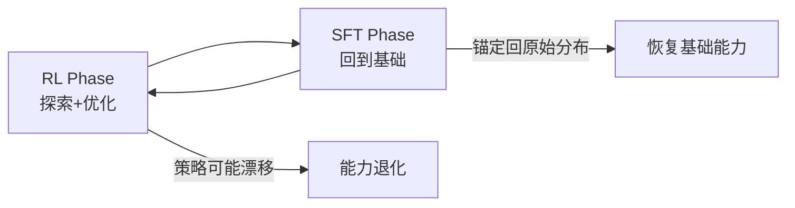
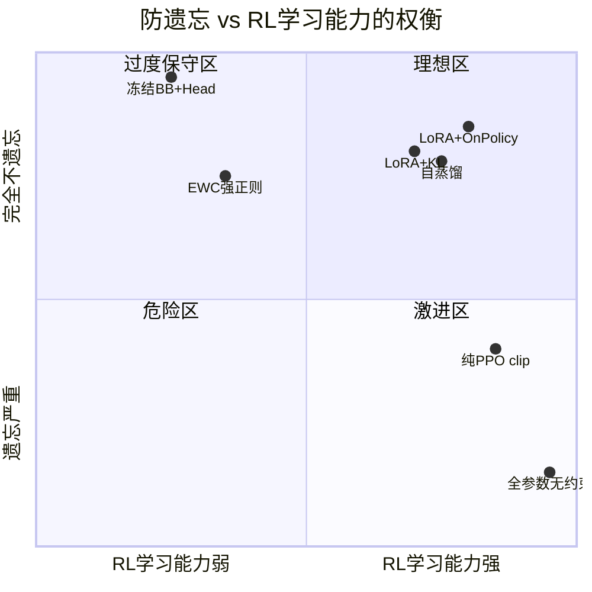
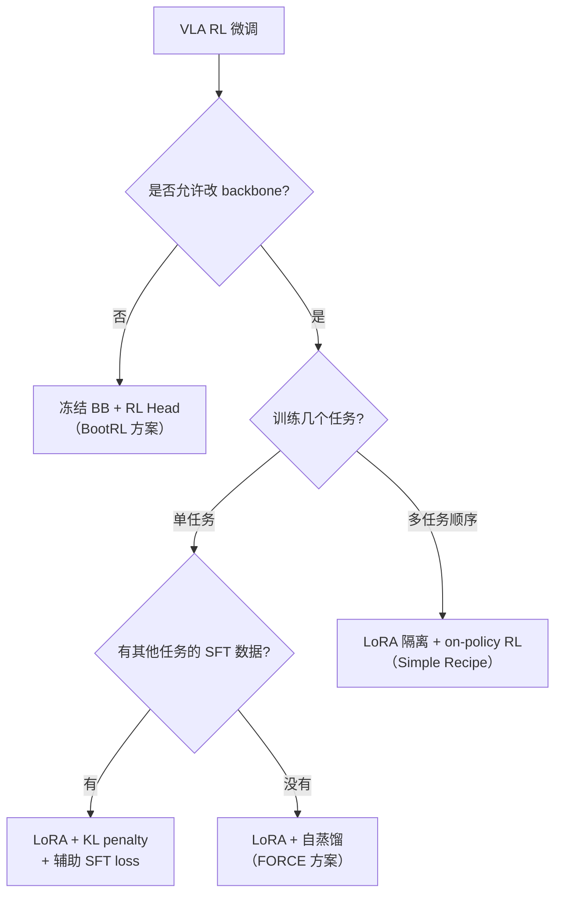

# VLA RL 防遗忘技术手段综述：RL 训练时如何不丢失预训练能力

> **综述范围**：2024-2026 年 VLA 模型在 RL 后训练/微调过程中防止灾难性遗忘的具体技术手段——从最简单的 KL penalty 到复杂的自蒸馏和参数隔离方案
> **关键词**：VLA、灾难性遗忘、KL penalty、自蒸馏、经验回放、LoRA 隔离、冻结 backbone、EWC
> **适用读者**：了解基本 RL 和 VLA 概念，想系统理解"RL 训练时如何防止模型忘记预训练学到的能力"
> **与 S07 的区别**：[S07 综述](./S07_持续终身VLA强化学习综述)讨论的是"顺序学习 50 个任务时如何不忘旧任务"——关注任务间遗忘；本文讨论的是"对一个任务做 RL 微调时如何不丢失预训练基础能力"——关注 RL 过程本身对模型的破坏

---

## 相关阅读

在阅读本文前，建议先了解以下前置知识：

- [KL 散度与策略约束](/前置知识/000j_前置知识_KL散度与策略约束) — KL penalty 的数学基础
- [策略梯度与 PPO](/前置知识/000a_前置知识_策略梯度与PPO) — PPO 的 clip 机制本身就有防遗忘效果
- [LoRA 低秩适配基础](/前置知识/000x_前置知识_LoRA低秩适配基础) — 参数隔离的核心工具
- [行为克隆与 RL 微调范式](/前置知识/000d_前置知识_行为克隆与RL微调范式) — SFT → RL 的标准流程
- [SAC (Soft Actor-Critic)](/前置知识/000k_前置知识_SAC_Soft_Actor_Critic) — Off-policy 训练中的遗忘问题

关联文章：

- [持续终身 VLA 强化学习综述](./S07_持续终身VLA强化学习综述) — 多任务顺序学习的遗忘
- [VLA On-Policy RL 方法综述](./S12_VLA_On_Policy_RL方法综述) — On-policy 天然低遗忘
- [FORCE 精读](./026_FORCE_高效VLA_RL微调) — 自蒸馏防退化
- [ROAD-VLA 精读](./041_ROAD_VLA_优势自蒸馏在线适配) — 在线自蒸馏
- [LifeLong-RFT 精读](./025_LifeLongRFT_持续学习VLA_RL微调) — LoRA 隔离 + 过程奖励
- [BootRL 精读](./013_BootRL_冻结VLA加RL_Head) — 冻结 backbone 方案
- [iRe-VLA 精读](./043_iReVLA_迭代RL_SFT交替训练VLA) — RL-SFT 交替训练

---

## 贯穿全文的例子

> **场景**：一个 7B 参数的 VLA 模型（如 OpenVLA），经过大规模预训练 + SFT 后，已经能执行 40 个桌面操作任务（平均成功率 75%）。
>
> 现在我们想用 RL 把"倒水"这个特定任务的成功率从 70% 提到 95%。
>
> **风险**：RL 训练 1000 步后，"倒水"成功率确实到了 95%，但另外 39 个任务的平均成功率从 75% 掉到了 50%。模型"忘了"怎么做其他事。
>
> 后面每种防遗忘技术，我们都会回到这个例子，看它如何在"提升目标任务"和"保持其他能力"之间平衡。

---

## 一、VLA RL 训练中遗忘的两种模式

### 1.1 模式一：跨任务遗忘（Task-Level Forgetting）

**表现**：对任务 A 做 RL 后，任务 B/C/D 的性能下降。

**原因**：RL 梯度只优化任务 A 的奖励，不包含任务 B/C/D 的信号。如果 A 和 B 共享的参数被改动太大，B 的行为模式就被破坏了。

**严重程度**：取决于任务间的参数共享程度。如果 RL 只改了 action head，而 B 主要依赖 vision encoder，可能不太严重。如果 RL 改了整个 backbone，几乎必然出问题。

### 1.2 模式二：能力退化（Capability Degradation）

**表现**：对任务 A 做 RL 后，连 A 本身的某些"基础行为"也退化了——比如模型不再能稳定地视觉定位物体、不再能理解新的语言指令变体。

**原因**：预训练学到的"通用能力"（视觉理解、语言理解、手眼协调的基本模式）存储在 backbone 的参数中。RL 微调如果幅度太大，会把这些通用表示扭曲。

**严重程度**：这比跨任务遗忘更危险——因为它不仅影响"其他任务"，还影响"目标任务在新状态下的表现"。模型可能在训练分布内表现好，但一旦遇到稍微不同的初始条件就崩溃。

### 1.3 为什么 VLA 比普通 RL 模型更容易遗忘

| 因素 | 原因 |
|------|------|
| 预训练知识量巨大 | 7B 模型存储了海量视觉-语言知识，RL 微调只看到很窄的任务分布 |
| RL 梯度高方差 | 策略梯度天然方差大，容易把参数推向极端方向 |
| 奖励信号单一 | RL 只优化 success，不优化"理解语言"或"视觉泛化" |
| 训练分布窄 | RL 数据只来自一个任务的在线采样，远不如预训练数据多样 |

---

## 二、技术手段一览

本文覆盖以下 8 类防遗忘技术，按"侵入性从低到高"排序：

| 类别 | 核心思路 | 代表工作 |
|------|---------|---------|
| 1. KL Penalty | 显式惩罚策略偏离初始 | 几乎所有 VLA RL 工作 |
| 2. PPO Clip | 隐式限制更新幅度 | VLA-RL, RIPT-VLA |
| 3. 冻结 Backbone + 小 Head | 只 RL 训练最后几层 | BootRL |
| 4. LoRA 隔离 | RL 只训 LoRA，主模型冻结 | LifeLong-RFT, Simple Recipe |
| 5. 自蒸馏 | 用历史最佳策略约束当前策略 | FORCE, ROAD-VLA |
| 6. RL-SFT 交替 | RL 和 SFT 交替训练 | iRe-VLA |
| 7. 经验回放混入 SFT 数据 | 训练 batch 混入旧任务示教 | VLA-OPD, Sim-Real CoTrain |
| 8. EWC / 弹性权重 | 重要参数加正则约束 | Simple Recipe（对照组） |

---

## 三、KL Penalty：最通用的隐式防线

### 3.1 核心机制

KL penalty（Kullback-Leibler 散度惩罚）是目前 VLA RL 中使用最广泛的防遗忘手段。思路极简：在 RL 的奖励里**减去**策略偏离 SFT 初始策略的程度。

$$
\tilde{r}_t = r_t - \beta \cdot D_{\mathrm{KL}}\left(\pi_\theta(\cdot|s_t) \,\|\, \pi_{\text{ref}}(\cdot|s_t)\right)
$$

**这个公式在做什么**：修正后的奖励 = 原始奖励 − $\beta$ × "当前策略和参考策略（SFT 初始模型）的分布差异"。策略越偏离参考，惩罚越大。

::: details 📐 逐符号拆解 + 数值代入（点击展开）
**逐符号拆解**：

| 符号 | 含义 | 具体是什么 |
|------|------|-----------|
| $r_t$ | 原始环境奖励 | 任务给的 shaped reward 或 sparse reward |
| $\beta$ | KL 惩罚系数 | 超参数，典型值 0.01-0.1 |
| $D_{\mathrm{KL}}$ | KL 散度 | 两个概率分布的"距离" |
| $\pi_\theta$ | 当前正在训练的策略 | 参数会随 RL 更新而变化 |
| $\pi_{\text{ref}}$ | 参考策略（冻结不训练） | 通常是 SFT 训练完成后保存的 checkpoint |

**数值代入**：假设在某步 $t$，环境奖励 $r_t=0.5$，当前策略与参考策略的 KL 散度为 2.0，$\beta=0.05$：
- $\tilde{r}_t = 0.5 - 0.05 \times 2.0 = 0.5 - 0.1 = 0.4$

如果策略偏移更大，KL=10.0：
- $\tilde{r}_t = 0.5 - 0.05 \times 10.0 = 0.5 - 0.5 = 0.0$

策略已经偏离太远，奖励被完全抵消——RL 没有动力继续往这个方向走。

**为什么是这个形式**：KL penalty 等价于对策略更新做了一个"信任域"约束（TRPO 的精神）。它不阻止模型变好，但阻止模型变得太"不像原来的自己"。$\beta$ 越大，策略越保守。
:::

### 3.2 自回归 VLA 中 KL 的计算

对于自回归 VLA（动作是 token 序列），KL 可以逐 token 计算：

$$
D_{\mathrm{KL}} = \sum_{i=1}^{N_a} \sum_{v} \pi_\theta(v|s, a_{<i}) \log \frac{\pi_\theta(v|s, a_{<i})}{\pi_{\text{ref}}(v|s, a_{<i})}
$$

**这个公式在做什么**：对动作序列的每个 token 位置，计算 token 级别的 KL 散度，再求和。

::: details 📐 逐符号拆解 + 数值代入（点击展开）
**逐符号拆解**：

| 符号 | 含义 | 具体是什么 |
|------|------|-----------|
| $N_a$ | 动作 token 数 | 例如 7 维动作 → 7 个 token |
| $v$ | 词表中的 token 值 | 256 个 bin 中的某个 |
| $a_{<i}$ | 前 $i-1$ 个已生成的 token | 自回归依赖 |

**数值代入**：假设第 1 个 token 位置，两个策略对 3 个可能 token 的分布为：
- $\pi_\theta$: [0.7, 0.2, 0.1]
- $\pi_{\text{ref}}$: [0.4, 0.3, 0.3]
- KL = $0.7\log(0.7/0.4) + 0.2\log(0.2/0.3) + 0.1\log(0.1/0.3)$
- KL = $0.7 \times 0.559 + 0.2 \times(-0.405) + 0.1 \times(-1.099) = 0.391 - 0.081 - 0.110 = 0.200$

7 个 token 位置各自贡献类似的值，总 KL ≈ 1.4。

**为什么是这个形式**：自回归模型的联合分布可以分解为逐 token 条件分布的乘积，因此 KL 也可以分解为逐 token KL 的求和（链式法则）。
:::

### 3.3 Flow Matching VLA 中 KL 的近似

对 Flow Matching VLA（如 π₀），没有解析的 log-likelihood，因此不能直接计算 KL。替代方案：

- **用 MSE 近似**：$D \approx \|a_\theta - a_{\text{ref}}\|^2$，其中 $a_\theta$ 和 $a_{\text{ref}}$ 分别是当前策略和参考策略对同一输入的输出动作
- **用 flow 的负 ELBO 近似**：需要额外的数学技巧
- **在动作空间做正则**：直接约束 $\|\theta - \theta_{\text{ref}}\|$（参数空间的 L2 距离）

### 3.4 $\beta$ 的选择和自适应

$\beta$ 太大：策略基本不变，RL 学不到东西。$\beta$ 太小：遗忘严重。实践中的做法：

1. **固定 $\beta$**：简单但需要调参，典型范围 0.01-0.1
2. **自适应 $\beta$**：设定一个目标 KL 值 $d_{\text{target}}$，如果实际 KL > $d_{\text{target}}$ 就增大 $\beta$，否则减小——类似 PPO 的 adaptive KL 方案
3. **Warmup 后减小**：训练初期 $\beta$ 大（保守），后期减小（允许更多探索）

### 3.5 谁在用

**几乎所有 VLA RL 论文都用了 KL penalty**——只是强度不同：
- VLA-RL：$\beta=0.01$
- RIPT-VLA / GRPO 系列：通过 clip 隐式实现（见下节）
- FlowRL：用 MSE 近似 KL
- RECAP：不用显式 KL（因为它用 advantage conditioning 而非策略梯度）

---

## 四、PPO Clip：隐式的信任域约束

### 4.1 核心机制

PPO 的 clip 机制本身就是一种防遗忘措施：它限制新旧策略的概率比 $r_t(\theta) = \pi_\theta(a|s) / \pi_{\text{old}}(a|s)$ 只能在 $[1-\epsilon, 1+\epsilon]$ 范围内变化。

$$
L^{\text{CLIP}} = \min\left(r_t \hat{A}_t, \; \text{clip}(r_t, 1-\epsilon, 1+\epsilon)\hat{A}_t\right)
$$

**这个公式在做什么**：限制每次更新的幅度——即使 advantage 很大，策略在某个动作上的概率也最多只能变化 $\pm\epsilon$（典型值 20%）。

::: details 📐 逐符号拆解 + 数值代入（点击展开）
**逐符号拆解**：

| 符号 | 含义 | 具体是什么 |
|------|------|-----------|
| $r_t(\theta)$ | 新旧策略概率比 | =1 表示没变，>1 表示概率增大了 |
| $\epsilon$ | clip 范围 | 典型值 0.2，即概率比限制在 [0.8, 1.2] |
| $\hat{A}_t$ | 优势估计 | 正值 = 好动作，负值 = 差动作 |

**数值代入**：假设某动作的 advantage $\hat{A}=+5$（非常好），策略想把概率比提到 $r=3.0$（概率翻了 3 倍）：
- 未裁剪项：$3.0 \times 5 = 15$
- 裁剪项：$\text{clip}(3.0, 0.8, 1.2) \times 5 = 1.2 \times 5 = 6$
- 取 $\min(15, 6) = 6$ → 实际梯度信号只有 6，远小于 15

效果：策略不能一步跳太远。

**为什么是这个形式**：clip 保证了策略的"平滑更新"。连续做很多个 epoch 的 PPO 更新，每次最多变 20%，整体就不会偏离太远。这种隐式约束比显式 KL penalty 更容易实现。
:::

### 4.2 PPO Clip vs KL Penalty 的关系

| 维度 | KL Penalty | PPO Clip |
|------|-----------|----------|
| 约束形式 | 软约束（可以违反，只是有代价） | 硬约束（超过范围直接截断梯度） |
| 需要参考模型 | 需要保存 $\pi_{\text{ref}}$ 的完整 checkpoint | 只需要上一轮的 $\pi_{\text{old}}$（每 epoch 更新） |
| 计算开销 | 需要两次 forward pass | 只需一次（$\log\pi_{\text{old}}$ 预计算存下来） |
| 防遗忘强度 | 锚定到 SFT 初始 → 强 | 只锚定到上一轮 → 弱（可能漂移） |

**关键区别**：KL penalty 的参考是固定的 SFT 模型（永远不变），所以它能真正防止"离 SFT 太远"。PPO clip 的参考是每轮更新的 $\pi_{\text{old}}$——如果连续 100 轮，每轮都往同一方向走 20%，累积偏移可以很大。因此，**PPO clip 不足以单独防遗忘**，通常还需要额外的 KL penalty 或其他机制配合。

### 4.3 RL's Razor：On-Policy 本身的天然防遗忘

[RL's Razor](./047_RLsRazor_在线RL为什么不遗忘) 提出了一个重要观察：**on-policy RL 天然比 SFT 更不容易遗忘**。原因是：

1. On-policy 数据来自当前策略的采样——策略不变的部分不会产生梯度
2. RL 只强化"好动作"，不强制改变"已经还行的动作"
3. 如果旧任务的行为在新任务环境中不会被采样到，就不会被改变

这解释了为什么 [Simple Recipe Works](./045_SimpleRecipe_VLA天然持续学习者) 发现"大模型 + LoRA + on-policy RL"几乎不需要额外防遗忘措施就能顺序学 30 个任务。

---

## 五、冻结 Backbone + 小 RL Head（BootRL）

### 5.1 核心机制

最极端的防遗忘方案：**完全冻结 VLA 的所有参数，只在顶部加一个小型 RL head**。VLA 的 backbone（vision encoder + LLM）只负责提取特征，RL 训练的梯度只流过最后的 action head。

[BootRL](./013_BootRL_冻结VLA加RL_Head) 的具体做法：
1. 冻结整个 VLA（7B 参数不变）
2. 在 VLA 最后一层的输出上接一个 2-3 层 MLP 作为 action head（约 10M 参数）
3. 用 SAC/PPO 只训练这个 MLP

### 5.2 优缺点

| 维度 | 评价 |
|------|------|
| 防遗忘效果 | ⭐⭐⭐⭐⭐ 完美——backbone 一个参数没动 |
| RL 提升幅度 | ⭐⭐ 很有限——只有 head 在学，表示不变 |
| 计算效率 | ⭐⭐⭐⭐⭐ 只反向传播到小 MLP |
| 端到端优化 | ❌ 无法改进视觉理解或语言理解 |

### 5.3 在例子中的表现

回到"倒水"任务：冻结 backbone 后，VLA 的视觉特征不会变——它已经能"看懂"杯子和水瓶的位置关系。RL head 学的只是"在这些特征上，如何更精确地控制倾斜角度"。

好处：其他 39 个任务完全不受影响（backbone 没变）。
坏处：如果"倒水"的失败原因是"VLA 没看清杯子边缘"——这种视觉理解层面的问题，冻结方案无法解决。

### 5.4 适用场景

- VLA 的预训练视觉特征已经够好，问题只是"最后的动作映射不够精确"
- 计算预算极小，无法承受训练 7B 模型
- 需要绝对保证不影响其他任务

---

## 六、LoRA 隔离：轻量参数适配

### 6.1 核心机制

LoRA（Low-Rank Adaptation）在冻结主模型的同时，插入少量可训练参数（约 0.5-2% 的主模型参数量）。RL 训练只更新 LoRA 参数，主模型冻结。

$$
W' = W + \frac{\alpha}{r} \cdot B A
$$

**这个公式在做什么**：新权重 = 冻结的原始权重 + 低秩增量。RL 只训练 $B$ 和 $A$ 两个小矩阵。

::: details 📐 逐符号拆解 + 数值代入（点击展开）
**逐符号拆解**：

| 符号 | 含义 | 具体是什么 |
|------|------|-----------|
| $W$ | 原始预训练权重 | 冻结不变，如 $4096 \times 4096$ |
| $B$ | LoRA 下投影矩阵 | $4096 \times r$，$r$ 通常 8-64 |
| $A$ | LoRA 上投影矩阵 | $r \times 4096$ |
| $\alpha$ | 缩放因子 | 控制 LoRA 影响力度 |
| $r$ | 秩 | 越大表达力越强，但参数越多 |

**数值代入**：$W$ 有 $4096^2 = 16.7M$ 参数。$r=16$ 时 $BA$ 只有 $4096 \times 16 + 16 \times 4096 = 131K$ 参数——不到原始参数的 1%。

**为什么是这个形式**：假设 RL 需要的参数变化是"低秩的"——不需要改变所有 16.7M 个参数，只需要在少数几个方向上调整。实验表明 $r=16-32$ 就足以学会大部分 RL 改进。
:::

### 6.2 LoRA 在防遗忘中的角色

| 场景 | 实现方式 | 效果 |
|------|---------|------|
| 单任务 RL 微调 | 所有任务共享一个 LoRA | 主模型不变 → 基础能力保留 |
| 多任务顺序学习 | 每任务独立 LoRA | 任务间参数完全隔离 → 零遗忘 |
| 多任务共享 LoRA | 顺序训练同一个 LoRA | 遗忘仍可能发生（在 LoRA 参数内） |

### 6.3 LifeLong-RFT 的方案

[LifeLong-RFT](./025_LifeLongRFT_持续学习VLA_RL微调) 的做法是：
- 为每个新任务分配独立的 LoRA adapter
- 部署时根据语言指令选择对应的 LoRA
- 优点：零遗忘（不同 LoRA 参数不干扰）
- 缺点：LoRA 数量随任务线性增长，部署时需要路由机制

### 6.4 Simple Recipe Works 的发现

[Simple Recipe](./045_SimpleRecipe_VLA天然持续学习者) 比较了全参数微调 vs LoRA 微调的遗忘差异：

| 微调方式 | 30 任务后平均遗忘 | 解释 |
|---------|-----------------|------|
| 全参数微调 | -8.2% | 所有参数都被当前任务的梯度覆盖 |
| LoRA（$r=16$） | -2.4% | 大部分参数冻结，只有少量方向被修改 |
| LoRA + on-policy RL | -1.0% | LoRA 约束 + on-policy 天然保守 双重保护 |

**关键结论**：LoRA 是防遗忘最 cost-effective 的技术——它本身就把可修改参数限制在极小的子空间内，天然阻止了大幅度的参数偏移。

---

## 七、自蒸馏（Self-Distillation）

### 7.1 核心机制

自蒸馏的思路是：在 RL 训练过程中，维护一个"教师"——通常是训练过程中表现最好的历史 checkpoint——然后让当前策略不要偏离教师太远。

和 KL penalty 的区别：KL penalty 的参考是**固定的 SFT 初始模型**，自蒸馏的教师是**动态更新的历史最佳模型**。

### 7.2 FORCE 的自蒸馏方案

[FORCE](./026_FORCE_高效VLA_RL微调) 维护一个 EMA（Exponential Moving Average）教师模型：

$$
\theta_{\text{teacher}} \leftarrow \tau \cdot \theta_{\text{teacher}} + (1-\tau) \cdot \theta
$$

**这个公式在做什么**：教师参数是训练参数的滑动平均——更新慢、更稳定。

::: details 📐 逐符号拆解 + 数值代入（点击展开）
**逐符号拆解**：

| 符号 | 含义 | 具体是什么 |
|------|------|-----------|
| $\theta_{\text{teacher}}$ | 教师模型参数 | 更新缓慢的"稳定版" |
| $\theta$ | 当前学生模型参数 | 被 RL 梯度更新的主模型 |
| $\tau$ | EMA 系数 | 典型值 0.995-0.999，越大教师更新越慢 |

**数值代入**：$\tau=0.999$，某个参数 $\theta_{\text{teacher}}=1.0$，训练后 $\theta=1.5$：
- 更新后 $\theta_{\text{teacher}} = 0.999 \times 1.0 + 0.001 \times 1.5 = 1.0015$

教师只跟随了 0.15% 的变化——非常保守。

**为什么是这个形式**：EMA 平滑掉了 RL 训练中的高频噪声（某一个 batch 可能梯度方向不对），保留了长期趋势。如果策略短暂崩溃后恢复，教师几乎不受影响。
:::

然后 FORCE 在 RL loss 中加入蒸馏项：

$$
\mathcal{L} = \mathcal{L}_{\text{RL}} + \lambda_{\text{distill}} \cdot D_{\mathrm{KL}}(\pi_{\text{teacher}} \| \pi_\theta)
$$

**这个公式在做什么**：总损失 = RL 损失（让策略变好）+ 蒸馏损失（让策略不要偏离教师太远）。两者互相博弈。

::: details 📐 逐符号拆解 + 数值代入（点击展开）
**逐符号拆解**：

| 符号 | 含义 | 具体是什么 |
|------|------|-----------|
| $\mathcal{L}_{\text{RL}}$ | RL 策略梯度损失 | PPO clip loss，推动策略变好 |
| $\lambda_{\text{distill}}$ | 蒸馏权重 | 典型值 0.1-1.0 |
| $D_{\mathrm{KL}}(\pi_{\text{teacher}} \| \pi_\theta)$ | 教师与学生的 KL 散度 | 学生偏离教师越远，惩罚越大 |

**数值代入**：假设 RL loss = -1.5，KL = 0.8，$\lambda=0.5$：
- 总损失 = $-1.5 + 0.5 \times 0.8 = -1.5 + 0.4 = -1.1$

蒸馏项减弱了 RL 的更新力度，起到"刹车"作用。

**为什么是这个形式**：教师是 EMA 模型——它代表训练过程中"经过平滑的稳定行为"。如果学生突然偏离教师（可能是因为一个噪声 batch 的坏梯度），蒸馏损失会把它拉回来。
:::

### 7.3 ROAD-VLA 的优势自蒸馏

[ROAD-VLA](./041_ROAD_VLA_优势自蒸馏在线适配) 更进一步：它不是简单地蒸馏教师的所有行为，而是**只蒸馏教师的好行为**。具体做法：

1. 用 Critic 判断教师策略输出的哪些动作是"好的"（advantage > 0）
2. 只对这些好动作做蒸馏
3. 差动作不做约束——允许学生自由探索更好的替代

这避免了"教师本身也有缺陷，盲目蒸馏会把缺陷也保留下来"的问题。

### 7.4 优缺点

| 维度 | 自蒸馏 |
|------|--------|
| 防遗忘效果 | ⭐⭐⭐⭐ 动态跟踪最佳状态 |
| 对 RL 学习的影响 | ⭐⭐⭐⭐ 选择性蒸馏不阻碍探索 |
| 计算开销 | ⭐⭐⭐ 需要维护教师模型（额外显存） |
| 实现复杂度 | ⭐⭐⭐ 中等（EMA 更新 + 蒸馏 loss） |

---

## 八、RL-SFT 交替训练（iRe-VLA）

### 8.1 核心机制

[iRe-VLA](./043_iReVLA_迭代RL_SFT交替训练VLA) 的思路是周期性地"拉回"策略：RL 训练一轮后，用 SFT 数据再训一轮，交替进行。



具体流程：
1. **RL Phase**：在目标任务上做 N 步 PPO/GRPO，策略变强但可能漂移
2. **SFT Phase**：在原始 SFT 数据（包含多任务示教）上做 M 步监督学习，把策略"拉回来"
3. 重复交替，直到收敛

### 8.2 关键设计选择

| 选择 | 选项 | 影响 |
|------|------|------|
| RL/SFT 步数比 | 通常 RL:SFT = 3:1 到 5:1 | 比值越大，RL 提升越多但遗忘风险越高 |
| SFT 数据来源 | 原始多任务示教 | 包含的任务越多，防遗忘越全面 |
| SFT 数据量 | 全量 vs 采样子集 | 全量慢但效果好，子集快但可能不够 |
| 是否混入 RL 成功轨迹 | 将 RL 中 success 的轨迹加入 SFT 数据 | 防止 SFT 阶段"抹去" RL 学到的好行为 |

### 8.3 VLA-OPD：On-Policy Distillation 的改进

VLA-OPD（On-Policy Distillation）是 iRe-VLA 的一个改进版本：不是简单交替，而是在 SFT phase 中只蒸馏 RL policy 的**成功行为**——即把 RL 训练中收集到的高奖励轨迹当作新的示教数据来做 SFT。

好处：SFT 阶段不会"忘记" RL 已经学到的改进——它同时保持旧能力 + 固化新能力。

### 8.4 Sim-Real Co-Training 的辅助 SFT Loss

另一种变体不是"交替"而是"同时"：在每个 RL batch 中，同时混入一个 SFT mini-batch：

$$
\mathcal{L} = \mathcal{L}_{\text{RL}} + \lambda_{\text{SFT}} \cdot \mathcal{L}_{\text{SFT}}^{\text{real-data}}
$$

**这个公式在做什么**：RL 损失教策略做当前任务，SFT 损失同时约束策略不要偏离真实世界示教数据的行为模式。

::: details 📐 逐符号拆解 + 数值代入（点击展开）
**逐符号拆解**：

| 符号 | 含义 | 具体是什么 |
|------|------|-----------|
| $\mathcal{L}_{\text{RL}}$ | RL 策略梯度损失 | PPO clip loss，推动策略变好 |
| $\mathcal{L}_{\text{SFT}}^{\text{real-data}}$ | 监督学习损失 | 在真实世界示教数据上的 NLL loss |
| $\lambda_{\text{SFT}}$ | SFT 损失权重 | 典型值 0.1-0.5 |

**数值代入**：假设 RL loss = -2.0（负值因为 PPO 最大化），SFT loss = 1.5，$\lambda=0.3$：
- 总损失 = $-2.0 + 0.3 \times 1.5 = -2.0 + 0.45 = -1.55$

SFT 项拉高了总损失（减少了"偏离示教数据"的动力），起到了锚定作用。

**为什么是这个形式**：比交替训练更简单（不需要切换阶段），且梯度方向自然平衡。$\lambda$ 越大，越保守。
:::

### 8.5 优缺点

| 维度 | RL-SFT 交替 / 混合训练 |
|------|---------------------|
| 防遗忘效果 | ⭐⭐⭐⭐ 定期用 SFT 数据"校准" |
| 对 RL 学习的影响 | ⭐⭐⭐ SFT 可能覆盖一些 RL 学到的新行为 |
| 数据需求 | ⭐⭐⭐ 需要保留原始多任务 SFT 数据 |
| 实现复杂度 | ⭐⭐⭐⭐ 简单（两种 loss 交替或加权） |

---

## 九、经验回放混入 SFT 数据

### 9.1 核心机制

这是 S07 综述中详细讨论的方案在"单任务 RL 微调"场景下的特化版本：在 RL 训练的每个 batch 中，混入少量**其他任务的 SFT 示教数据**，让模型同时看到目标任务的 RL 信号和其他任务的 BC 信号。

### 9.2 与 KL Penalty 的区别

| 维度 | KL Penalty | 经验回放混入 |
|------|-----------|-------------|
| 约束对象 | 策略的输出分布 | 策略在具体数据上的行为 |
| 约束范围 | 只在当前状态上约束 | 覆盖其他任务的多样状态 |
| 数据需求 | 只需参考模型的参数 | 需要保留其他任务的示教数据 |
| 信号来源 | 来自参考模型的 KL | 来自真实示教的 ground-truth 动作 |

### 9.3 实践配置

```python
# 伪代码：混合训练 batch
for step in range(total_steps):
    # RL 数据：从当前任务 rollout
    rl_batch = env.rollout(policy, batch_size=64)
    
    # Replay 数据：从其他任务的 SFT 数据随机采样
    sft_batch = replay_buffer.sample(batch_size=16)
    
    # RL loss（只对 rl_batch）
    loss_rl = ppo_loss(rl_batch)
    
    # SFT loss（只对 sft_batch）
    loss_sft = nll_loss(sft_batch)
    
    # 合并
    total_loss = loss_rl + 0.2 * loss_sft
    total_loss.backward()
```

### 9.4 Dark Experience Replay（存 logits）

一种增强版本：不只存 (observation, action) 对，还存**旧策略在那个状态下的完整动作分布 logits**。回放时不只做 BC（拟合硬标签），还做蒸馏（拟合软分布），保留更多信息。

[Dark Experience Replay](./052_DarkExperienceReplay_暗经验回放) 的蒸馏 loss：

$$
\mathcal{L}_{\text{DER}} = D_{\mathrm{KL}}(\text{stored\_logits} \| \pi_\theta(\cdot|o, l))
$$

**这个公式在做什么**：回放时不只拟合"旧策略选了哪个动作"，而是拟合旧策略在那个状态下的**完整动作概率分布**——让当前策略的输出分布尽量贴合存储的软标签。

::: details 📐 逐符号拆解 + 数值代入（点击展开）
**逐符号拆解**：

| 符号 | 含义 | 具体是什么 |
|------|------|-----------|
| $\mathcal{L}_{\text{DER}}$ | Dark Experience Replay 蒸馏损失 | 回放阶段计算的 KL 散度 loss |
| $\text{stored\_logits}$ | 存储的旧策略 logits | 收集数据时保存的旧策略在该观测下的完整动作分布（softmax 前的向量） |
| $\pi_\theta(\cdot\|o, l)$ | 当前策略的动作分布 | 当前网络在同一个观测 $o$、语言指令 $l$ 下输出的动作概率分布 |
| $D_{\mathrm{KL}}(\cdot \| \cdot)$ | KL 散度 | 衡量两个分布之间的差异，=0 表示完全一致 |

**数值代入**：假设动作空间离散化为 4 个 bin，旧策略存储的分布为 $[0.4, 0.3, 0.2, 0.1]$，当前策略输出 $[0.25, 0.25, 0.25, 0.25]$（退化为均匀分布）：

$$
D_{\mathrm{KL}} = 0.4\ln\frac{0.4}{0.25} + 0.3\ln\frac{0.3}{0.25} + 0.2\ln\frac{0.2}{0.25} + 0.1\ln\frac{0.1}{0.25}
$$

$$
= 0.4 \times 0.47 + 0.3 \times 0.18 + 0.2 \times (-0.22) + 0.1 \times (-0.92) = 0.188 + 0.054 - 0.044 - 0.092 = 0.106
$$

KL = 0.106，说明当前策略和旧策略差距适中。梯度会推动 $\pi_\theta$ 的输出从均匀分布往 $[0.4, 0.3, 0.2, 0.1]$ 方向靠拢。

**为什么是这个形式**：相比硬标签 BC（只看最大概率动作），软标签 KL 保留了旧策略对所有动作的偏好排序信息，防遗忘效果更强。
:::

好处：软标签比硬标签包含更多信息（"这个动作概率 30%，那个 25%"比"正确动作是 A"更丰富）。

### 9.5 存储预算问题

对于 VLA 的 RGB 图像输入，存储 replay buffer 的空间开销很大（一帧 256×256 RGB = 192KB）。实际做法：
- 只保存关键帧（成功 episode 的 start/milestone/end）
- 压缩存储（JPEG 或 latent vector）
- 按任务均匀分配配额（参见 [S07 第 4.2 节](./S07_持续终身VLA强化学习综述#42-如果遗忘使用固定预算的-task-balanced-memory)）

---

## 十、EWC：弹性权重固化

### 10.1 核心机制

EWC（Elastic Weight Consolidation，弹性权重固化）对每个参数计算一个"重要性分数"——如果某个参数对旧任务很重要（Fisher 信息量大），就在新任务训练时对它的变化施加更强的正则。

$$
\mathcal{L}_{\text{EWC}} = \mathcal{L}_{\text{RL}} + \frac{\lambda}{2} \sum_i F_i (\theta_i - \theta^*_i)^2
$$

**这个公式在做什么**：RL 损失 + 对每个参数的"弹性"约束。重要参数（$F_i$ 大）变化代价高，不重要参数（$F_i$ 小）可以自由变化。

::: details 📐 逐符号拆解 + 数值代入（点击展开）
**逐符号拆解**：

| 符号 | 含义 | 具体是什么 |
|------|------|-----------|
| $F_i$ | 参数 $i$ 的 Fisher 信息量 | 衡量这个参数对旧任务的重要性 |
| $\theta^*_i$ | 旧任务训练完后参数 $i$ 的值 | 参考点 |
| $\theta_i$ | 当前参数值 | 正在被 RL 更新 |
| $\lambda$ | EWC 正则强度 | 越大越保守 |

**数值代入**：参数 A 的 Fisher $F_A=100$（对旧任务很重要），参数 B 的 Fisher $F_B=0.1$（不重要）：
- 参数 A 偏移 0.01：penalty = $0.5 \times 100 \times 0.01^2 = 0.005$
- 参数 B 偏移 0.01：penalty = $0.5 \times 0.1 \times 0.01^2 = 0.000005$

参数 A 的偏移代价是 B 的 1000 倍——RL 梯度会自然避开修改 A。

**为什么是这个形式**：Fisher 信息矩阵是损失函数 Hessian 的近似——它告诉你"如果参数变化 $\Delta$，旧任务的损失会增加约 $\frac{1}{2}F\Delta^2$"。所以用 $F$ 做正则等价于说"别让旧任务损失增加太多"。
:::

### 10.2 EWC 在 VLA RL 中的问题

Simple Recipe Works 的实验表明，EWC 在大型预训练 VLA 上的效果并不理想：

1. **Fisher 计算成本高**：7B 参数模型的 Fisher 对角阵仍有 7B 个值，需要大量数据和 forward pass
2. **可塑性损失**：过多参数被"锁死"后，模型难以学习新行为
3. **不如 LoRA 简单**：LoRA 通过低秩约束隐式实现了类似效果，但更简单
4. **与 on-policy RL 冲突**：on-policy 方法本身梯度方向就比较保守，再加 EWC 可能过度约束

### 10.3 何时适用

EWC 在以下情况下仍有价值：
- 全参数微调（不能用 LoRA 的场景）
- 任务间确实有剧烈的梯度冲突
- 模型较小，Fisher 计算可承受

---

## 十一、ConSFT：保守监督微调

### 11.1 核心机制

ConSFT（Conservative Supervised Fine-Tuning）是一种不需要旧数据或额外架构的防遗忘优化目标。它的核心思想是：在 SFT/RL 微调时，不仅最小化目标任务的损失，同时**约束模型输出分布的变化幅度**。

具体做法：在标准的下一 token 损失基础上，加入一个正则项，要求模型在**非目标 token** 上的输出分布不要变化太大。

### 11.2 与 KL Penalty 的区别

- KL penalty：约束策略的**动作**分布不偏离参考
- ConSFT：约束模型的**内部表示/全词表分布**不偏离参考

ConSFT 保护的是更底层的"语言建模能力"，而不只是"某个任务上的动作选择"。

### 11.3 优缺点

| 维度 | ConSFT |
|------|--------|
| 防遗忘效果 | ⭐⭐⭐⭐ 保护基础语言/视觉能力 |
| 数据需求 | ⭐⭐⭐⭐⭐ 零——不需要旧任务数据 |
| 架构修改 | ⭐⭐⭐⭐⭐ 零——只改 loss |
| 对新任务学习的影响 | ⭐⭐⭐ 可能略微减慢收敛 |

---

## 十二、横向大对比

### 12.1 全方法对比表

| 方法 | 防遗忘强度 | 对 RL 学习能力的影响 | 额外计算开销 | 额外数据需求 | 实现复杂度 |
|------|-----------|-------------------|------------|------------|-----------|
| KL Penalty | ⭐⭐⭐ | 低（$\beta$ 适中时） | 一次额外 fwd pass | 参考模型 checkpoint | 低 |
| PPO Clip | ⭐⭐ | 极低 | 无 | 无 | 极低 |
| 冻结 BB + Head | ⭐⭐⭐⭐⭐ | 高（只改 head） | 无 | 无 | 低 |
| LoRA 隔离 | ⭐⭐⭐⭐ | 低 | 无 | 无 | 低 |
| 自蒸馏 | ⭐⭐⭐⭐ | 低 | EMA 模型显存 | 无 | 中 |
| RL-SFT 交替 | ⭐⭐⭐⭐ | 中（SFT 可能覆盖 RL） | SFT 训练时间 | 需要 SFT 数据 | 中 |
| 经验回放 | ⭐⭐⭐⭐ | 低 | 回放 buffer 存储 | 需要旧任务数据 | 中 |
| EWC | ⭐⭐⭐ | 中高（可塑性损失） | Fisher 计算 | Fisher 估计数据 | 高 |
| ConSFT | ⭐⭐⭐⭐ | 低 | 无 | 无 | 低 |

### 12.2 组合使用推荐

实践中通常**组合多种技术**而不是只用一种：

| 场景 | 推荐组合 | 理由 |
|------|---------|------|
| 单任务 RL 微调，预算充足 | LoRA + KL penalty + 少量经验回放 | 三重保护，覆盖参数/分布/数据三个层面 |
| 单任务 RL 微调，预算极小 | LoRA + PPO clip | 最轻量组合 |
| 多任务顺序学习 | LoRA 隔离 + on-policy RL | Simple Recipe 的配方 |
| 真实机器人部署后持续改进 | 自蒸馏 + 辅助 SFT loss | FORCE 方案 |
| 需要绝对安全（不能有任何退步） | 冻结 backbone + RL head | BootRL 方案 |

### 12.3 防遗忘能力与 RL 学习能力的 trade-off



---

## 十三、前沿进展与新兴方案

### 13.1 RIF-RFT：RL 微调天然减轻遗忘

[RIF-RFT](./051_RIF_RFT_强化微调自然缓解遗忘) 在多模态基础模型上发现：强化微调（RFT）比监督微调（SFT）天然更不容易遗忘。原因分析：

1. **选择性更新**：RFT 只强化高奖励行为，不改变策略中"已经够好"的部分
2. **分布内更新**：RFT 的梯度来自策略自己的采样，不会强制策略去拟合分布外的示教
3. **KL 约束内嵌**：PPO/GRPO 的 clip 机制本身就是一种约束

这意味着：**如果你在 RL 微调和 SFT 微调之间选择，RL 微调本身就是更好的防遗忘选择。**

### 13.2 Retaining by Doing：On-Policy Data 是关键

[Retaining by Doing](./050_RetainingByDoing_on_policy数据防遗忘) 通过消融实验证明：防遗忘的关键不是具体的 RL 算法（PPO vs GRPO vs RLOO），也不是显式的 KL penalty，而是**on-policy data 本身**。

核心论点：只要训练数据来自当前策略的在线采样（而不是固定的 offline 数据集），模型就倾向于做最小修改来完成新任务——因为 on-policy 数据中大部分行为已经"够好了"（来自预训练），只有少数需要改进。

### 13.3 ConSFT 用于 Flow Matching VLA

对 Flow Matching 类型的 VLA（如 π₀），标准的 KL penalty 不适用（没有解析 log-likelihood）。ConSFT 提出了一种不需要计算 KL 的替代方案：在 flow matching 的损失基础上，约束 velocity field 的变化幅度——如果新策略的 velocity 和旧策略差距太大，加惩罚。

### 13.4 多尺度防遗忘：从参数到表示到行为

当前最有效的方案通常在多个层面同时施加约束：

| 层面 | 约束方式 | 保护什么 |
|------|---------|---------|
| 参数层面 | LoRA / EWC / weight decay | 参数不偏移太远 |
| 表示层面 | ConSFT / feature distillation | 中间表示不崩溃 |
| 行为层面 | KL penalty / 蒸馏 | 输出分布不偏离太远 |
| 数据层面 | 经验回放 / SFT 混入 | 旧任务的行为模式被定期复习 |

---

## 十四、实践建议总结

### 14.1 决策树：如何选择防遗忘策略



### 14.2 关键数值经验

来自 2025-2026 年论文的经验数字：

| 经验 | 数值 | 来源 |
|------|------|------|
| KL penalty $\beta$ | 0.01-0.05 | VLA-RL, FlowRL |
| PPO clip $\epsilon$ | 0.1-0.2 | 标准值 |
| LoRA 秩 $r$ | 16-32 | LifeLong-RFT, Simple Recipe |
| EMA 系数 $\tau$ | 0.995-0.999 | FORCE |
| SFT 混入比例 | 10-30% of batch | Sim-Real CoTrain |
| 经验回放每任务量 | 50-200 条轨迹 | Forget Me Not |
| LoRA + on-policy 的遗忘率 | < 2.5% | Simple Recipe (30 tasks) |

### 14.3 常见错误

1. **只用 PPO clip 就以为防遗忘了**：PPO clip 只约束相邻两轮之间的变化，累积漂移可以很大。必须加 KL penalty 或 LoRA。
2. **EWC 正则设太大**：模型完全学不动新任务。EWC 在 VLA 上的效果通常不如 LoRA。
3. **SFT 混入比例太高**：RL 信号被淹没，策略基本不变。建议从 10% 开始调。
4. **忽略 Flow VLA 的特殊性**：Flow Matching 模型没有 log-likelihood，需要用 MSE 或 ConSFT 替代 KL。
5. **单纯依赖"大模型不怕遗忘"**：Simple Recipe 的结论依赖"大模型 + LoRA + on-policy RL"三个条件同时成立。去掉任何一个，遗忘可能严重。

---

## 十五、开放问题

1. **Off-Policy VLA RL 的防遗忘**：当前大部分结论基于 on-policy RL。Off-policy 方法（SAC + replay buffer）的遗忘模式可能完全不同——旧数据混在 buffer 中可能帮助也可能干扰。
2. **真实机器人的长期漂移**：仿真中跑 30 个任务和真实机器人跑 6 个月是不同的。真实环境中硬件磨损、光照变化、物体更换都会引入新的分布偏移。
3. **遗忘的度量标准**：目前大多用"旧任务成功率下降"来衡量。但有些"遗忘"可能是有益的——旧策略中的坏习惯被丢掉了。如何区分"有害遗忘"和"有益遗忘"？
4. **防遗忘与泛化的关系**：过度保守（不让参数变）可能同时损害泛化能力。最优的防遗忘策略应该允许"泛化性更新"但阻止"退化性更新"。
5. **Scalability**：目前最长的实验是 30 个任务。100+ 任务的真实规模下，哪种方案能 scale？LoRA 隔离的存储线性增长是否可接受？

---

## 延伸阅读

- [持续终身 VLA 强化学习综述](./S07_持续终身VLA强化学习综述) — 多任务顺序学习的完整方案
- [VLA On-Policy RL 方法综述](./S12_VLA_On_Policy_RL方法综述) — On-policy 方法的天然低遗忘
- [VLA RL 奖励信号设计方法综述](./S15_VLA_RL奖励信号设计方法综述) — 奖励设计和防遗忘的交叉问题
- [LoRA 系列方法全景综述](./S08_LoRA系列方法全景综述) — LoRA 隔离的技术细节
- [RL's Razor 精读](./047_RLsRazor_在线RL为什么不遗忘) — 为什么 on-policy RL 天然防遗忘
- [Simple Recipe Works 精读](./045_SimpleRecipe_VLA天然持续学习者) — 最强简单基线
