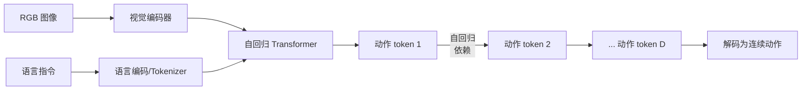
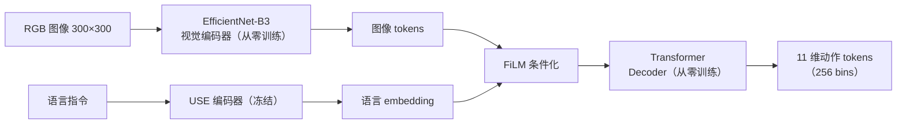
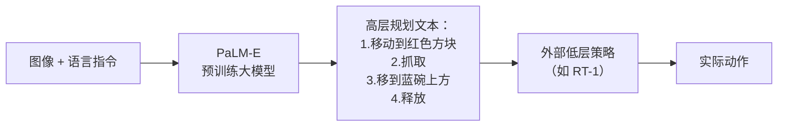
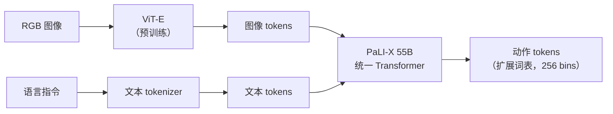
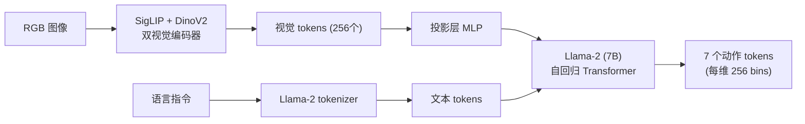
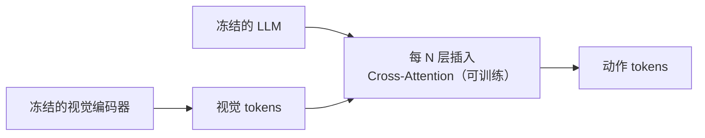
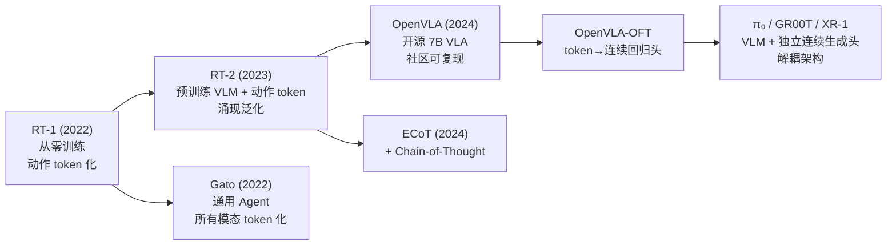

# 自回归 Token 化 VLA 综述：从 RT-1 到 OpenVLA 的离散动作路线

> **综述范围**：将机器人动作离散化为 token、直接复用 LLM 自回归范式的 VLA 模型
> **关键词**：VLA、自回归、动作 Token 化、RT-1、RT-2、OpenVLA、PaLM-E、Gato、ECoT、RoboFlamingo
> **适用读者**：有基本数学素养（线代、概率）的本科生，想理解"为什么以及如何把机器人动作变成 token"

---

## 相关阅读

在阅读本文前，建议先了解以下前置知识：

- [动作 Token 化与自回归策略](/前置知识/000l_前置知识_动作Token化与自回归策略) — 离散化的核心机制
- [交叉熵损失与 Softmax](/前置知识/003f_前置知识_交叉熵损失与Softmax) — Token 化 VLA 的训练目标
- [行为克隆与 RL 微调范式](/前置知识/000d_前置知识_行为克隆与RL微调范式) — 预训练→微调的基本思路
- [KV Cache 与自回归解码](/前置知识/002m_前置知识_KV_Cache与自回归解码) — Transformer 自回归推理
- [策略梯度与 PPO](/前置知识/000a_前置知识_策略梯度与PPO) — 后续 RL 微调的基础

关联文章：

- [视觉-语言-动作模型 VLA 综述](./S03_视觉语言动作模型VLA综述) — VLA 全景脉络
- [VLM + 连续生成头 VLA 综述](./S17_连续生成头VLA模型综述) — 第二类 VLA 路线
- [RT-2 精读](./018_RT2_视觉语言动作模型) — 本综述核心模型之一的详细解读
- [OpenVLA 精读](./015_OpenVLA_开源视觉语言动作模型) — 开源自回归 VLA 详细解读
- [VLA 的 RL 后训练综述](./S06_VLA模型的RL后训练综述) — 自回归 VLA 的 RL 改进方法

---

## 贯穿全文的例子：桌面机械臂抓取场景

> **场景**：一个 6 自由度桌面机械臂，末端带有平行夹爪。
> 用户说：**"把红色方块放到蓝色碗里"**，机器人看到当前画面后执行动作。
>
> - **视觉输入**：$256 \times 256$ RGB 图像
> - **语言指令**：`"put the red block into the blue bowl"`
> - **动作输出**：7 维向量 $a = [\Delta x, \Delta y, \Delta z, \Delta r_x, \Delta r_y, \Delta r_z, g]$
> - **Token 化方式**：每个维度均匀离散为 256 个 bin → 7 维动作 = 7 个 token
> - **控制频率**：5-10 Hz
>
> 整个任务约 30-50 步。每一步：看一张图 → 模型自回归生成 7 个 token → 解码为连续动作 → 执行。

---

## 1. 核心思想：动作就是语言

### 1.1 一句话概括

> 把机器人的连续动作离散化为有限个 token，然后完全复用大语言模型（LLM）的 next-token prediction 范式来"说出"动作。

这个想法的直觉非常简单：LLM 能通过预测下一个 token 来生成流畅的文本。如果我们把动作也变成 token，那 LLM 就能用同样的方式"生成"动作序列。语言和动作在模型眼中没有区别——都是一串离散符号。

### 1.2 为什么要把动作变成 token

传统机器人策略（如 MLP 策略网络）直接输出连续值。自回归 Token 化路线选择先离散再预测，核心动机有三：

1. **复用 VLM 预训练**：像 PaLI、Llama 这种经过万亿 token 训练的视觉语言模型，已经具备了强大的视觉理解和语言推理能力。如果动作也是 token，就可以直接在这些模型上 finetune，**零成本继承预训练知识**。不需要设计新架构、不需要额外的动作头。
2. **统一多模态**：图像 token、文本 token、动作 token 都在同一个 vocabulary 里，模型可以自然地处理"看图→理解语言→输出动作"的全流程，不需要在不同模态之间做手动拼接。
3. **训练简单**：标准的 cross-entropy loss + teacher forcing，和训练 ChatGPT 没有本质区别。工程上可以直接复用 LLM 的训练基础设施（DeepSpeed、FSDP 等）。

### 1.3 离散化的代价

Token 化不是免费的。把连续动作塞进有限个 bin 会丢失精度：

- 如果动作范围是 $[-1, 1]$、用 256 个 bin，每个 bin 宽度 = $2/256 = 0.0078$
- 这意味着任何动作最多有 $\pm 0.004$ 的量化误差
- 对于粗粒度任务（如"移到碗上方"）这完全够用
- 但对于精细操作（如"插入 USB 接口"需要 mm 级精度）就可能不够

这个 tradeoff 是理解本综述所有模型的关键：**token 化 = 简单统一但精度有上限**。

---

## 2. 动作 Token 化的技术细节

### 2.1 均匀离散化（Uniform Binning）

最简单也是最常用的方式。对每个动作维度独立操作：

1. 确定该维度的值域 $[a_{\min}, a_{\max}]$（从训练数据统计得到）
2. 等分为 $K$ 个 bin（通常 $K = 256$）
3. 编码：连续值 $a$ → bin index $i = \lfloor (a - a_{\min}) / (a_{\max} - a_{\min}) \times K \rfloor$
4. 解码：bin index $i$ → bin 中心值 $\hat{a} = a_{\min} + (i + 0.5) \times (a_{\max} - a_{\min}) / K$


**回到我们的例子**：假设 $\Delta x$ 维度的范围是 $[-0.05, 0.05]$（米），用 256 bin：

- bin 宽度 = $0.1 / 256 \approx 0.00039$ 米 ≈ 0.4 mm
- 如果真实目标是 $\Delta x = 0.0123$，编码为 bin $\lfloor (0.0123 + 0.05) / 0.1 \times 256 \rfloor = \lfloor 159.7 \rfloor = 159$
- 解码为 $-0.05 + (159 + 0.5) \times 0.1 / 256 = -0.05 + 0.06230 = 0.01230$ → 误差仅 0.00000 米

精度对于桌面抓取来说绑绑有余。

### 2.2 Token 序列的组织方式

一个 7 维动作被编码为 7 个 token。模型的输出序列格式通常是：

```
[图像 tokens] [文本 tokens] [动作 token 1] [动作 token 2] ... [动作 token 7]
```

自回归生成时：
1. 先编码图像和文本（作为 prefix/context）
2. 开始生成动作 token：先预测第 1 维（$\Delta x$），然后以此为条件预测第 2 维（$\Delta y$），依次类推
3. 7 个 token 全部生成后，解码为连续动作并执行

这种**维度间自回归**意味着动作的各维度不是独立预测的——后面的维度可以依赖前面的预测结果。比如 $\Delta z$（第 3 维）的预测可以参考已经生成的 $\Delta x, \Delta y$。

### 2.3 与 LLM 词汇表的整合

有两种策略：

| 策略 | 做法 | 代表模型 |
|------|------|---------|
| **扩展词表** | 在原 LLM 词表（如 32000 tokens）末尾加 256 个动作 token | RT-2, OpenVLA |
| **复用已有 token** | 不扩展词表，把 256 个 bin 映射到已有的 token id（如数字 "0"-"255"） | 部分早期实验 |

RT-2 和 OpenVLA 都采用扩展词表方案——在 VLM 原有的文本词汇表之外，新增 256 个特殊 token（编号 32000-32255）专门用于表示动作 bin。这样动作 token 和文本 token 有独立的 embedding，不会互相干扰。

---

## 3. 统一架构视角：一张图看所有模型

### 3.1 所有自回归 Token 化 VLA 共享的架构骨架

RT-1、RT-2、OpenVLA、RoboFlamingo 这些模型看起来差异很大（有的用小 CNN、有的用 55B 大模型），但拆开看，它们都是同一个骨架：



区别只在 **4 个插槽**：

| 插槽 | 它决定什么 | 可选方案 |
|------|-----------|---------|
| ① 视觉/语言 backbone | 有没有预训练、规模多大 | 从零训练小网络 / 预训练大 VLM |
| ② 训练方式 | 更新哪些参数 | 全量微调 / 冻结主干只训新增层 |
| ③ 词表整合 | 动作 token 怎么塞进 LLM 的 vocabulary | 扩展词表 / 所有模态共享一个词表 |
| ④ 有无中间推理层 | 是否在动作前先输出一段"想法" | 直接出动作 / 先规划再执行 |

### 3.2 各模型在 4 个插槽上的选择

| 模型 | ① Backbone | ② 训练方式 | ③ 词表整合 | ④ 中间推理层 |
|------|-----------|-----------|-----------|-------------|
| **RT-1** | 从零训练（EfficientNet + 小 Transformer） | 全量训练 | 独立小词表 | 无 |
| **PaLM-E** | 预训练 562B VLM | 全量微调 | 不直接出动作 token | 只有推理层，无执行 |
| **RT-2** | 预训练 55B VLM（PaLI-X） | 全量微调 | 扩展词表 | 无 |
| **Gato** | 从零联合训练 1.2B | 全量训练 | 所有模态共享一个词表 | 无 |
| **OpenVLA** | 预训练 7B VLM（Prismatic） | 全量微调 | 扩展词表 | 无 |
| **RoboFlamingo** | 预训练 VLM，**冻结** | 只训新增 cross-attn 层 | 扩展词表 | 无 |
| **ECoT** | 预训练 55B VLM（RT-2 基础） | 全量微调 | 扩展词表 | ✅ 先文本推理再出动作 |

一眼就能看出：这条路线的演进主要是插槽①从"从零训练小网络"变成"预训练大 VLM"，插槽②从"全量训练"衍生出"冻结+适配"的效率变体，插槽④是后期才加上的增强。下面按插槽的变化顺序讲每个模型。

### 3.3 RT-1（2022）—— 插槽①②③④全部是"最朴素"的选择

**机构**：Google Robotics  
**核心贡献**：第一个在大规模真实机器人数据上训练的 Transformer 策略，证明了 "更多数据 + 更大模型 = 更好泛化"在机器人领域同样成立。

#### 架构：骨架的最初版本

RT-1 是骨架的"朴素实现"——插槽①选择从零训练（没有 VLM 预训练），插槽②是全量训练（反正没有预训练权重要保护），插槽③④都是最简单的方案：



**关键设计**：

1. **Token Learner**：把 EfficientNet 输出的 64 个空间 token 压缩为 8 个，大幅减少 Transformer 计算量
2. **FiLM 条件化**：语言 embedding 通过 Feature-wise Linear Modulation 注入视觉特征——对每个通道做 $\gamma \cdot x + \beta$ 仿射变换，$\gamma, \beta$ 由语言决定
3. **动作空间**：11 维（7 维手臂 + 3 维底盘 + 1 维模式切换），每维 256 bins，总计 11 个 token 自回归输出
4. **训练数据**：13 个机器人在 17 个月内收集的 13 万条真实轨迹，覆盖 700+ 任务

**回到例子**：RT-1 处理"把红色方块放到蓝色碗里"时——图像经 EfficientNet 提取视觉特征，语言指令经 USE 编码为 512 维向量，通过 FiLM 层告诉视觉特征"关注红色方块和蓝色碗"，然后 Transformer 逐个输出 11 维动作的 token。

**局限**：
- 没有 VLM 预训练——所有语言理解能力必须从机器人数据中从头学习
- 不能理解训练集外的指令（如"把那个看起来像草莓的东西拿过来"）
- 泛化只局限于"同类物体不同实例"，不能跨语义

### 3.4 PaLM-E（2023）—— 插槽①换成预训练大模型，但插槽③还没接上执行

**机构**：Google  
**参数量**：562B（PaLM 540B + ViT-22B）  
**核心贡献**：第一次证明"超大规模多模态 LLM 可以直接理解和推理具身环境"

#### 核心思路

PaLM-E 是骨架上插槽①的第一次跃迁——从"从零训练小网络"换成"预训练 562B 大模型"。但它还没有走完整个骨架：插槽③（词表整合出动作 token）根本没做，模型只输出**文本形式的高层规划**，再交给外部的低层策略（如 RT-1）去转成真正的动作：



#### 技术创新

- **多模态 token 混合**：图像 token（来自 ViT）和文本 token 在同一序列中交替出现，PaLM 处理时不区分模态
- **具身推理能力**：可以回答"如果我把蓝色碗移走，红色方块会掉下去吗？"这种需要物理直觉的问题
- **跨任务泛化**：在 OK-VQA（视觉问答）、机器人规划、导航规划上同时表现好

**为什么重要**：PaLM-E 证明了大规模 VLM 可以做具身推理——这直接启发了 RT-2 的设计："如果 VLM 能理解机器人场景，那让它直接输出动作 token 不就行了？"

**局限**：
- 562B 参数无法在机器人上实时推理
- 不直接输出动作——需要额外的低层策略
- 训练成本极高，不可复现

### 3.5 RT-2（2023）—— 补上插槽③，PaLM-E 的"缺口"被填平

**机构**：Google DeepMind  
**核心贡献**：第一次把预训练 VLM 直接微调为能输出低级机器人动作的端到端模型。

#### 核心洞察

RT-2 的关键观察是：

> 既然 VLM（如 PaLI-X）已经能看图回答问题、做 OCR、理解空间关系，那让它直接"回答"动作 token 不就行了？动作不过是另一种"语言"。

对照骨架，RT-2 = PaLM-E 的插槽①（预训练大 VLM）+ 补上 RT-1 的插槽③（扩展词表输出动作 token）。两条此前独立的技术路线在这里合流：



**与 RT-1 的本质区别**：

| | RT-1 | RT-2 |
|---|------|------|
| 视觉编码器 | EfficientNet（从零训练） | ViT-E（在互联网数据上预训练） |
| 语言理解 | USE encoder（冻结，浅层） | PaLI-X 内部（深度融合） |
| 动作生成 | 小 Transformer decoder | VLM 本身的自回归输出 |
| 预训练知识 | 无 | 继承 PaLI-X 的视觉-语言理解 |
| 能理解新概念？ | ❌ 只认训练集见过的 | ✅ "把那个看起来像草莓的东西拿过来" |

#### 训练细节

1. **Stage 1**：PaLI-X 在互联网图文对上预训练（原有的，不动）
2. **Stage 2**：在机器人数据上共同微调——同时做视觉问答 + 动作预测
   - 输入格式：`<image> Q: What action to take? A: 1 128 91 241 5 101 128`（7 个数字=7 个动作 token）
   - Loss：标准的 cross-entropy，和文本生成一样
3. **Co-fine-tuning**：机器人数据和原始 VQA 数据混合训练，防止灾难性遗忘

#### 涌现能力

RT-2 最令人兴奋的发现是**涌现泛化**（emergent generalization）：

- 训练集中从未出现"把垃圾丢到垃圾桶"这个任务
- 但因为 PaLI-X 从互联网文本中"知道"垃圾应该放进垃圾桶
- RT-2 在测试时能执行这个从未演示过的任务

这证明了 VLM 的预训练知识可以**转移到机器人控制**——模型不仅仅是"模仿见过的动作"，而是理解语义后做出新决策。

**回到例子**：处理"把红色方块放到蓝色碗里"时，RT-2 的推理过程和 VQA 没有区别——模型"看"到图像，"读"到指令，然后"说出"（自回归生成）7 个动作 token。如果换成"把那个 strawberry-shaped 的东西放到 vessel 里"（训练集没见过这个措辞），RT-2 仍然能正确执行，因为它从互联网数据中理解了 strawberry 和 vessel 的含义。

**局限**：
- 55B 参数推理极慢（~1-3 Hz），无法做高频控制
- 不开源，无法复现
- 单步动作、无 action chunking → 轨迹不够平滑

### 3.6 Gato（2022）—— 插槽③走到极端：所有模态共享一个词表

**机构**：DeepMind  
**核心贡献**：第一个证明"同一个 Transformer 可以同时玩游戏、看图说话、控制机器人"的模型

#### 核心思路

Gato 和 RT-1 同期，插槽①同样是从零训练；但插槽③走了另一个极端方向——不是"给动作单独扩展一段词表"，而是**把文本、图像、动作、本体感受全部塞进同一个词表**，模型看不出自己在处理哪种模态：


| 模态 | Token 化方式 |
|------|-------------|
| 文本 | SentencePiece（标准 NLP） |
| 图像 | ResNet patch → 离散化为 1024 bins |
| 连续动作 | 均匀离散为 1024 bins |
| 离散动作（游戏按键） | 直接作为 token |
| 本体感受（关节角度） | 均匀离散为 1024 bins |

所有模态的 token 共享一个 vocabulary（32000 个 token），不同模态的序列拼接在一起训练。

#### 架构与规模

- 1.2B 参数 Transformer（对比 RT-2 的 55B，小得多）
- 训练任务：604 种（Atari 游戏、DM Control、真实机器人堆叠积木、图像描述、对话等）
- 输入序列格式：`[观测 tokens | 动作 tokens | 观测 tokens | 动作 tokens | ...]`

#### 关键发现

1. **一个模型真的能"什么都做"**：Gato 在 450+ 任务上达到专家策略 50% 以上的水平
2. **但什么都不精通**：在每个单独任务上都不如任务专用模型
3. **规模缩放有效**：更大的模型在所有任务上同时变好

**为什么重要**：Gato 提出了"通用主义 Agent"的愿景，虽然实际性能有限，但证明了跨模态、跨任务的统一 token 化方案是可行的。

**与 RT-2 的区别**：
- RT-2 是"大模型 + 少量机器人数据微调" → 利用预训练知识泛化
- Gato 是"中等模型 + 所有任务从头联合训练" → 靠 multi-task learning 泛化
- 事后看，RT-2 路线胜出——预训练知识比 multi-task 更有效

### 3.7 OpenVLA（2024）—— 插槽①②③不变，只是换了更小更开放的组件

**机构**：Stanford + UC Berkeley  
**核心贡献**：第一个开源的、可复现的 7B VLA 模型，让整个社区都能在此基础上研究

#### 为什么 OpenVLA 很重要

OpenVLA 在架构插槽上和 RT-2 **完全相同**（预训练 VLM + 全量微调 + 扩展词表），没有引入新的插槽选择。它的贡献是把每个插槽里的"具体组件"换成更小、更开放的版本：RT-2 证明了路线可行，但不开源、55B 太大、数据不公开。OpenVLA 解决了这三个问题：

| | RT-2 | OpenVLA |
|---|------|---------|
| 开源 | ❌ | ✅ |
| 参数量 | 55B | 7B |
| VLM 骨干 | PaLI-X | Prismatic VLM (Llama 2 + SigLIP + DinoV2) |
| 训练数据 | 内部数据 | Open X-Embodiment（公开数据集） |
| 可微调 | ❌ | ✅（社区大量 LoRA 微调工作） |

#### 架构




**关键设计**：

1. **双视觉编码器**：SigLIP 擅长语义理解（"这是红色方块"），DinoV2 擅长空间细节（"方块在碗的左边 3cm"）。两者互补。
2. **Prismatic VLM 预训练**：先在 LLaVA-1.5 的数据上做视觉-语言对齐，让模型具备看图说话能力
3. **Open X-Embodiment 数据**：970K 条真实机器人轨迹，来自 22 种不同机器人，覆盖多种任务
4. **动作 token 化**：和 RT-2 相同——7 维动作各自离散为 256 bins，追加到词表末尾

#### 训练流程

```
Stage 1: Prismatic VLM 预训练（视觉-语言对齐）
    ↓
Stage 2: 在 Open X-Embodiment 上做 SFT
    - 输入：图像 + 语言指令
    - 输出：7 个动作 token
    - Loss：Cross-entropy（和普通 LLM 训练一样）
    - 优化器：AdamW, lr=2e-5, cosine schedule
    - 训练：8×A100, 约 14 天
```

#### 性能与局限

**优势**：
- 开源 + 7B 足够在单卡 A100 上推理
- 在 BridgeData V2 上成功率 ~70-80%（零样本迁移到新物体）
- 支持 LoRA 微调（社区大量后续工作基于 OpenVLA）

**局限**（这些正是第二类 VLA 要解决的问题）：
- 256 bin 离散化在精细任务上精度不够
- 单步动作、无 action chunking → 轨迹抖动
- 推理速度 ~5-6 Hz（7B 模型自回归 7 步），勉强够用但不充裕
- 没有动作多样性建模——对于多模态任务（如"可以从左边绕也可以从右边绕"）只能预测 mode collapse 后的平均

### 3.8 RoboFlamingo（2023）—— 只改插槽②：冻结主干，只训新增层

**机构**：PKU + Microsoft  
**核心贡献**：证明 Flamingo 风格的"cross-attention 插入"方案在机器人场景也能工作

#### 架构

RoboFlamingo 和 OpenVLA 的插槽①③相同（预训练 VLM、扩展词表），唯独插槽②不同——不做全量微调，而是**冻结 VLM 主干**，只在层间插入新的 cross-attention 模块来训练：



- **冻结**：视觉编码器和 LLM 主干都不更新
- **只训练**：新插入的 cross-attention 层
- **优势**：训练参数少，不会遗忘预训练知识
- **劣势**：表达能力受限于新加层的容量，性能上限比全量微调（OpenVLA）低，但训练效率更高

### 3.9 ECoT（2024）—— 加上插槽④：中间推理层

**机构**：Google  
**核心贡献**：首次在 VLA 中引入链式思维推理（Chain-of-Thought），让模型在输出动作前先"想一想"

#### 动机

RT-2/OpenVLA 的骨架里插槽④是空的——看图直接出动作，没有中间推理步骤。但人类在执行操作时会先规划——"红色方块在左边，碗在右边，我要先伸手到左边..."

ECoT 是第一个真正用上插槽④的模型：让模型先生成一段文字描述（plan），再生成动作 token，两者共享同一个自回归序列：


#### 输出格式

```
输入：[图像] + "put the red block into the blue bowl"
输出（自回归生成）：
  "Plan: The red block is on the left side of the table. 
   The blue bowl is on the right. I need to move the gripper 
   to the left to reach the block. Action: reach left."
  [动作 token 1] [动作 token 2] ... [动作 token 7]
```

模型先输出一段自由文本（reasoning），然后输出动作 token。两者在同一个自回归序列中。

#### 训练方式

1. 用 GPT-4V 对训练数据的每一帧标注"推理文本"——描述当前场景、下一步该做什么
2. 把这些标注作为训练目标的一部分——模型需要同时学会"说出推理过程"和"输出正确动作"
3. 推理时，先等模型把 reasoning 文本生成完，再收集动作 token

#### 效果

- 在长 horizon 任务上成功率显著提升（+15-20%）
- 推理过程可解释——你能看到模型在"想什么"
- 但推理速度更慢——先生成几十个文本 token 再出动作，延迟增加

---

## 4. 训练目标与损失函数

所有自回归 Token 化 VLA 使用相同的核心训练目标——**交叉熵损失（Cross-Entropy Loss）**，和训练 ChatGPT 一模一样。

### 4.1 形式化定义

给定一条轨迹 $\tau = \{(o_1, l, a_1), (o_2, l, a_2), ..., (o_T, l, a_T)\}$，其中 $o_t$ 是观测图像，$l$ 是语言指令，$a_t$ 是动作。

每个动作 $a_t = [a_t^1, a_t^2, ..., a_t^D]$（$D=7$）被 token 化为 $[k_t^1, k_t^2, ..., k_t^D]$，其中 $k_t^d \in \{0, 1, ..., 255\}$。

训练目标：

$$
\mathcal{L} = -\sum_{t=1}^{T} \sum_{d=1}^{D} \log p_\theta(k_t^d \mid o_t, l, k_t^{1:d-1})
$$

**这个公式在做什么**：对轨迹中每个时间步的每个动作维度，让模型在正确 bin 上的预测概率尽量高。

::: details 📐 公式详解（点击展开）

| 子表达式 | 它是谁 | 它在干嘛 |
|---------|--------|---------|
| $o_t, l$ | **考题材料** | 第 $t$ 步的观测图像和语言指令，作为模型预测的条件输入 |
| $k_t^{1:d-1}$ | **已经写下的答案** | 当前时间步中，前 $d-1$ 维动作已经生成的 token，维度间自回归依赖靠它 |
| $k_t^d$ | **本题的标准答案** | 第 $t$ 步第 $d$ 维动作对应的 ground truth bin 编号，如 159（对应 $\Delta x=0.0123$） |
| $p_\theta(k_t^d \mid o_t, l, k_t^{1:d-1})$ | **模型给标准答案打的分** | 模型看着考题材料和已写答案，输出的 softmax 分布中，落在正确 bin 上的那个概率值 |
| $\log(\cdot)$ | **打分转换器** | 把概率转成对数——概率越接近 1，$\log$ 值越接近 0（几乎不惩罚）；概率越接近 0，$\log$ 值越负（重罚） |
| $-\sum_{t=1}^T\sum_{d=1}^D(\cdot)$ | **总扣分** | 把轨迹里每一步、每一维的打分取负号加起来——每道题都要答对，扣分才会少 |

**用人话读**：“这条轨迹的每一步、每一维动作都是一道选择题，标准答案是某个 bin。把模型在标准答案上给出的概率取对数再加个负号，所有题目的负对数加起来就是总 loss——每道题都答得越自信、越正确，loss 就越低。”

**为什么是这个形式**：这就是标准自回归语言模型的训练目标——最大化"下一个 token 在给定所有已知信息下的条件概率"。对 LLM 来说 token 是词，对 VLA 来说 token 是动作 bin，数学形式完全一样，因此可以直接复用 LLM 的训练流程（cross-entropy + teacher forcing）。
:::

### 4.2 与连续策略损失的对比

| | 自回归 token 化 VLA | 传统连续策略（如 MLP + MSE） |
|---|---|---|
| 损失函数 | Cross-Entropy | MSE $\|a - \hat{a}\|^2$ |
| 输出分布 | categorical（256 类分类问题） | Gaussian 或 deterministic |
| 多模态支持 | ✅ 天然支持（概率分散在多个 bin 上） | ❌ MSE 回归到均值 |
| 动作精度 | 受限于 bin 数 | 无上限（连续值） |

**多模态支持是 token 化的一个重要优势**：如果一个任务可以"从左边绕"也可以"从右边绕"，token 化 VLA 的 softmax 分布可以在两个对应的 bin 上各有高概率（双峰分布），然后采样时自然选择其中一个模式。而 MSE 回归会把两个模式平均成"直直撞过去"——这就是经典的 mode averaging 问题。

---

## 5. 推理流程与延迟分析

### 5.1 自回归推理流程

```python
# 简化的推理伪代码
def predict_action(image, instruction, model):
    # 1. 编码图像和文本
    prefix_tokens = encode(image, instruction)  # ~200-300 tokens
    
    # 2. 自回归生成 7 个动作 token
    action_tokens = []
    for dim in range(7):
        logits = model(prefix_tokens + action_tokens)  # 一次 forward pass
        next_token = sample(softmax(logits[-1]))        # 采样或 argmax
        action_tokens.append(next_token)
    
    # 3. 解码为连续动作
    action = decode_bins(action_tokens)  # [159, 128, ...] → [0.012, 0.0, ...]
    return action
```


### 5.2 延迟瓶颈

| 阶段 | 耗时（7B 模型，A100） | 说明 |
|------|---------------------|------|
| 图像编码 | ~5ms | ViT forward pass |
| Prefix 处理 | ~30ms | 处理 ~300 个 prefix token |
| 动作 token 生成 | ~7×20ms = 140ms | 每个 token 一次 decode forward |
| 总计 | ~175ms | 约 5.7 Hz |

**瓶颈在自回归生成**：7 个动作 token 需要 7 次 sequential forward pass。即使用 KV Cache（只计算最后一个 token 的注意力），每步仍需要 ~20ms（7B 模型）。

**对比**：如果用连续头（如扩散头），整个动作 chunk（如 16 步）可以一次 forward pass 生成——但需要多步去噪。两者的延迟大致在同一量级（100-200ms），但连续头输出的信息量更大（16 步 vs 1 步）。

### 5.3 加速策略

1. **量化推理**：INT8/INT4 量化可以把每步 decode 时间压缩到 ~10ms
2. **投机解码（Speculative Decoding）**：用小模型 draft，大模型 verify，在动作 token 之间相关性高时有效
3. **并行 token 预测**：如果放弃维度间的自回归依赖，7 个 token 可以并行输出——但通常会降低精度

---

## 6. 自回归 Token 化 VLA 的核心局限

### 6.1 精度天花板

离散化精度由 bin 数决定。即使增加到 1024 bins，分辨率也只是 $2/1024 \approx 0.002$。对于需要亚毫米精度的任务（如 PCB 插件、缝纫），这不够。

而且增加 bin 数有代价：
- 词表变大 → embedding 层参数增多
- 分类问题变难 → 需要更多数据才能让每个 bin 有足够样本
- 实际上 256-1024 bins 是 sweet spot，再多收益递减

### 6.2 无 Action Chunking

标准自回归 VLA 每次只预测**当前一步的动作**。下一步重新看一张图、重新生成。这导致：

- **轨迹不平滑**：相邻步之间没有一致性约束，动作可能来回抖动
- **无法表达时间相关性**：连续几步的加速→减速过程无法被显式建模
- **效率低**：每步都要做一次完整的 VLM 推理

Action chunking（一次预测未来 $H$ 步动作）是第二类 VLA（如 π₀、GR00T）的核心优势之一。

### 6.3 单模态输出

虽然 softmax 理论上能表示多模态分布，但**维度之间的分解**限制了这一能力。7 个维度独立做 256 分类，无法表示 7 维联合空间中的复杂多模态结构。

举例：如果"从左绕"对应 $(\Delta x=+0.03, \Delta y=-0.02)$，"从右绕"对应 $(\Delta x=-0.03, \Delta y=+0.02)$，维度独立的自回归可能生成 $(\Delta x=+0.03, \Delta y=+0.02)$（左 x + 右 y 的错误组合）。

扩散模型和 Flow Matching 模型在联合动作空间中建模分布，天然避免了这个问题。

### 6.4 扩展到高维动作空间困难

- 7 维动作 = 7 个 token → 可接受
- 人形机器人 52 维动作 = 52 个 token → 自回归 52 步太慢
- 双臂 + 躯干 100+ 维 → 完全不可行

这是为什么 GR00T（人形机器人 VLA）、π₀（双臂灵巧操作）都选择了连续生成头而非 token 化。

---

## 7. 从 Token 化到连续头的演进

### 7.1 OpenVLA-OFT：Token 化的"补丁"

OpenVLA-OFT（Open Fine-Tuning）是在 OpenVLA 基础上的改进，核心变化：

- **去掉离散 token 化**，改为在 LLM 最后一层输出的隐状态上接一个 MLP 回归头，直接输出连续动作
- 保留 OpenVLA 的 VLM 骨干（Prismatic VLM），只替换输出层
- Fine-tuning 时只训练最后的回归头 + LoRA 微调 LLM

这个改动消除了离散化误差，但仍然是**单步动作**（无 chunking）。它可以看作是从"纯 Token 化"到"VLM + 连续头"的过渡形态。

### 7.2 演进脉络总结



**清晰的演进逻辑**：
1. RT-1 证明 Transformer 能做机器人策略
2. RT-2 证明 VLM 预训练可以转移到机器人
3. OpenVLA 让社区都能用上
4. 社区发现 token 化的精度/chunking 局限
5. 自然演进到"保留 VLM 理解能力，换一个更好的动作输出方式" → 第二类 VLA

---


## 8. 总结与横向对比

### 8.1 各模型一览表

| 模型 | 年份 | 参数 | VLM 骨干 | 动作维度 | Bins | 开源 | 核心创新 |
|------|------|------|---------|---------|------|------|---------|
| RT-1 | 2022 | ~35M | 无（从零训） | 11 | 256 | ❌ | 第一个大规模 Transformer 机器人策略 |
| Gato | 2022 | 1.2B | 无（联合训） | 不定 | 1024 | ❌ | 通用 Agent，所有模态统一 token 化 |
| PaLM-E | 2023 | 562B | PaLM | 不直接出动作 | - | ❌ | 具身推理，高层规划 |
| RT-2 | 2023 | 55B | PaLI-X | 7 | 256 | ❌ | 第一个 VLA，VLM 直接输出动作 token |
| RoboFlamingo | 2023 | ~3B新参 | Flamingo | 7 | 256 | ✅ | 冻结 VLM + cross-attention 适配 |
| OpenVLA | 2024 | 7B | Prismatic | 7 | 256 | ✅ | 开源可复现，社区标杆 |
| ECoT | 2024 | 55B | RT-2 base | 7 | 256 | ❌ | VLA + Chain-of-Thought 推理 |

### 8.2 何时选择自回归 Token 化 VLA

✅ **适合的场景**：
- 任务精度要求不极端（cm 级即可，如抓取、放置、推送）
- 动作维度不高（≤10 维）
- 希望复用 LLM 的训练/部署生态（DeepSpeed、vLLM 等）
- 需要语义泛化（理解新指令、新物体）
- 预算有限，想用开源 VLM + 简单 finetune

❌ **不适合的场景**：
- 需要亚毫米精度（精密装配）
- 高维动作空间（人形机器人 50+ 维）
- 需要平滑连贯的长轨迹（轨迹质量敏感）
- 高频控制（>20 Hz）
- 多模态动作分布很重要（同一场景有多种等价解法）

### 8.3 这条路线的历史定位

自回归 Token 化是 VLA 的**起点**，不是终点。它最大的贡献是证明了：

1. **VLM 预训练对机器人有用**——从互联网知识可以迁移到机器人控制
2. **统一架构是可行的**——不需要为视觉、语言、动作设计三套独立系统
3. **规模缩放有效**——更大的 VLM = 更好的机器人策略

这三个结论奠定了整个 VLA 领域的基础。后续的连续生成头路线（π₀、GR00T）本质上是在保留这三个结论的同时，解决 token 化特有的精度/chunking/高维问题。

---

## 延伸阅读

- [VLM + 连续生成头 VLA 综述](./S17_连续生成头VLA模型综述) — 第二类 VLA 的详细讲解
- [3D 空间感知 VLA 综述](./S18_3D空间感知VLA模型综述) — 第三类 VLA 的详细讲解
- [动作 Token 化与自回归策略](/前置知识/000l_前置知识_动作Token化与自回归策略) — Token 化的数学细节
- [VLA 的 RL 后训练综述](./S06_VLA模型的RL后训练综述) — 如何用 RL 提升自回归 VLA 的性能
- [RT-2 精读](./018_RT2_视觉语言动作模型) — RT-2 的逐段解读
- [OpenVLA 精读](./015_OpenVLA_开源视觉语言动作模型) — OpenVLA 的详细分析
