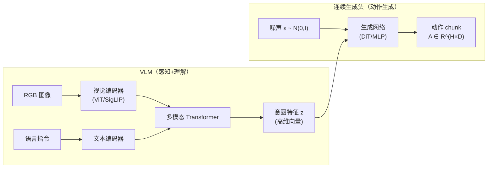
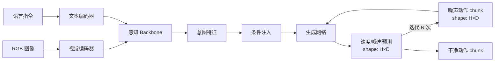
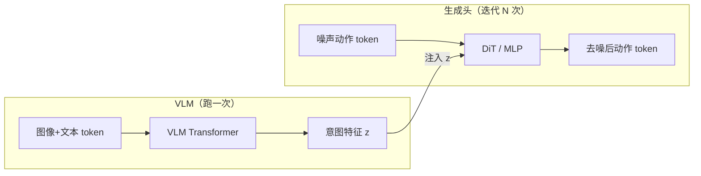
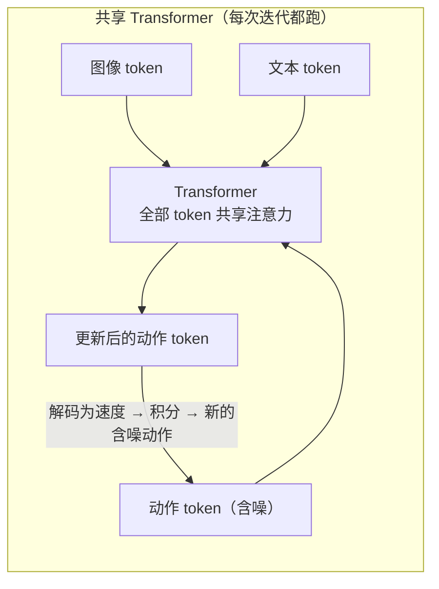
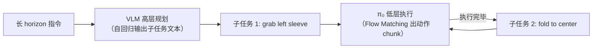

# VLM + 连续生成头 VLA 综述：从 Octo 到 π₀ 的解耦架构路线

> **综述范围**：使用预训练 VLM（Vision-Language Model，视觉语言模型——在海量图文数据上预训练、能理解图像内容并回应自然语言的模型，如 CLIP、PaliGemma）做感知理解、独立连续生成头（扩散/Flow Matching）输出动作的 VLA（Vision-Language-Action，视觉-语言-动作模型——把视觉观测和语言指令映射为机器人动作的统一模型）模型
> **关键词**：VLA、解耦架构、扩散头、Flow Matching、Action Chunking、Octo、π₀、GR00T、RDT-1B、CogACT
> **适用读者**：有基本数学素养的本科生，想理解"为什么主流 VLA 都在用连续生成头，以及它们具体怎么做"

---

## 相关阅读

在阅读本文前，建议先了解以下前置知识：

- [Diffusion Policy](/前置知识/000c_前置知识_Diffusion_Policy) — 扩散模型生成机器人动作的基础
- [Flow Matching 与连续归一化流](/前置知识/000g_前置知识_Flow_Matching与连续归一化流) — π₀ 的动作生成框架
- [DiT: Diffusion Transformer 架构](/前置知识/002x_前置知识_DiT_Diffusion_Transformer架构) — GR00T/RDT 使用的骨干
- [Cross-Attention 与交替注意力机制](/前置知识/001e_前置知识_Cross_Attention与交替注意力机制) — 条件注入方式
- [动作 Token 化与自回归策略](/前置知识/000l_前置知识_动作Token化与自回归策略) — 对比理解

关联文章：

- [自回归 Token 化 VLA 综述](./S16_自回归Token化VLA模型综述) — 第一类 VLA 路线
- [3D 空间感知 VLA 综述](./S18_3D空间感知VLA模型综述) — 第三类 VLA 路线
- [π₀ 精读](./014_Pi0_通用机器人基础模型) — 本综述核心模型的详细解读
- [GR00T N1 精读](./019_GR00T_N1_人形机器人基础模型) — NVIDIA 人形 VLA 详解
- [Octo 精读](./012_Octo_开源通用机器人策略) — 扩散读出头 VLA 的先驱
- [扩散模型在决策与控制中的应用综述](./S05_扩散模型在决策与控制中的应用综述) — 更广泛的扩散策略综述

---

## 贯穿全文的例子：双臂机器人叠衣服

> **场景**：一个双臂机器人（如 ALOHA），每臂 7 自由度 + 1 夹爪 = 16 维动作空间。
> 任务：**"把桌上的 T 恤叠好"**——需要约 200 步连续操作，涉及精细的布料操控。
>
> - **视觉输入**：2 张 $256 \times 256$ RGB 图像（正面 + 腕部相机）
> - **语言指令**：`"fold the T-shirt on the table"`
> - **动作输出**：16 维连续向量 × 未来 16 步 = 动作 chunk $\mathbf{A} \in \mathbb{R}^{16 \times 16}$
> - **控制频率**：50 Hz（通过 action chunking + 插值实现）
>
> 这个任务需要：(1) 高精度——布料操控误差容忍度 <5mm；(2) 长轨迹——200+ 步；(3) 平滑连贯——不能抖动把布料扯坏；(4) 高维——16 维联合动作空间。
>
> **自回归 Token 化 VLA 完全无法胜任这个任务**：16 维 × 256 bins = 16 个 token 要自回归生成太慢；无 action chunking 导致轨迹不平滑；离散化精度不够。这就是为什么需要连续生成头。

---

## 1. 核心思想：VLM 负责"想"，生成头负责"做"

### 1.1 一句话概括

> 把 VLA 拆成两个模块——VLM 理解视觉和语言（产出"意图特征"），一个独立的连续生成头（扩散/Flow Matching）把意图特征解码为高精度、多步、连续动作序列。

### 1.2 为什么要解耦

自回归 Token 化 VLA（如 RT-2、OpenVLA）把一切塞进同一个自回归框架。这很优雅但有硬伤：

| 问题 | 原因 | 解耦后如何解决 |
|------|------|--------------|
| 精度受限 | 256 bin 离散化 | 连续头直接输出浮点数，精度无上限 |
| 无 action chunking | 自回归一步一步出 | 生成头一次输出未来 H 步 |
| 高维困难 | 52 维 = 52 个 token 串行太慢 | 生成头并行输出所有维度和时间步 |
| 轨迹不平滑 | 步与步之间独立生成 | chunk 内天然连贯 |
| 多模态 mode collapse | 维度分解破坏联合分布 | 扩散/Flow 在联合空间建模 |

### 1.3 核心区别：串行 vs 并行（极其重要）

**这是理解两类 VLA 区别的最关键一点**：自回归 Token 化是**串行**的，连续生成头是**全并行**的。

#### 自回归 VLA（如 OpenVLA）为什么必须串行

自回归模型使用 **causal mask**——每个 token 只能看到它前面的 token，看不到后面的。这意味着：

```
生成 7 维动作的过程（串行）：
  第1步：模型看到 [图像, 文本]           → 预测 dim1 的 bin
  第2步：模型看到 [图像, 文本, dim1]     → 预测 dim2 的 bin
  第3步：模型看到 [图像, 文本, dim1, dim2] → 预测 dim3 的 bin
  ...
  第7步：模型看到 [..., dim1~dim6]       → 预测 dim7 的 bin
```

每一步必须等前一步完成才能开始——因为下一个 token 的输入**依赖**上一个 token 的输出。7 维 = 7 次 sequential forward pass。52 维 = 52 次。无法并行。

#### 连续生成头（如 π₀、GR00T）为什么能并行

连续头用的是 **bidirectional attention**（双向注意力）——所有动作 token 互相可见，不存在"先后"依赖：

```
生成 50 步 × 16 维动作的过程（并行）：
  一次 forward pass：
    [图像token, 文本token, 动作token_1, 动作token_2, ..., 动作token_50]
    全部同时计算 self-attention
    → 同时输出 50 个速度预测（每个 16 维）
```

50 个动作 token **同时进、同时出**，和 BERT 处理一整句话一样。一次 forward pass 就并行输出整个 $50 \times 16$ 的速度场。

#### 为什么不用 causal mask 也行？

自回归之所以用 causal mask，是因为训练时用 teacher forcing——预测下一个 token 时不能偷看答案。但 Flow Matching / 扩散的训练方式完全不同：

- 输入是**含噪动作**（已知的，不是要预测的）
- 输出是**噪声/速度的估计**
- 不存在"下一个 token 依赖上一个预测"的因果关系

所有时间步的噪声是同时加的，所有位置的速度也是同时预测的。每个动作 token 需要看到其他所有动作 token 来理解"整条轨迹的全局结构"——这恰恰要求双向注意力，而不是 causal。

#### 延迟对比

| | OpenVLA（7维，自回归） | OpenVLA 假设52维 | π₀（50步×16维） | GR00T（16步×52维） |
|---|---|---|---|---|
| 动作 token 数 | 7 | 52 | 50 | 16 |
| 每次 forward pass | 只出 1 个 token | 只出 1 个 token | 出所有 50 个 token | 出所有 16 个 token |
| 生成全部 token 需要 | 7 次 forward | 52 次 forward | 1 次 forward | 1 次 forward |
| 但需要迭代去噪/积分 | 不需要 | 不需要 | 5-10 次 | 10 次 |
| **总 forward 次数** | **7** | **52** | **5-10** | **10** |
| 每次 forward 的代价 | 大（整个 7B LLM） | 大（整个 7B LLM） | 大（整个 3B Transformer） | 小（只有 DiT 部分） |

**关键洞察**：π₀/GR00T 的迭代次数（5-10 次）和动作维度/时间步数**无关**——不管是 7 维还是 52 维、16 步还是 50 步，迭代次数都是固定的（由你设定的积分精度决定）。而自回归的 forward 次数和维度**线性增长**。

### 1.3 解耦架构的通用模板



**关键点**：VLM 和生成头可以**独立 scale**。VLM 可以用 3B、7B、13B；生成头可以用几百 M 的轻量网络。两者的优化目标也不同——VLM 用语言建模 loss 预训练，生成头用扩散/Flow loss 在机器人数据上训练。

---

## 2. 连续生成头的三种范式

### 2.1 扩散头（DDPM/DDIM）

**原理**：训练一个去噪网络 $\epsilon_\theta$，从纯噪声出发，逐步去噪还原出干净的动作 chunk。

**推理过程**：
1. 从标准正态分布采样噪声 $\mathbf{A}_T \sim \mathcal{N}(0, \mathbf{I})$，形状 $H \times D$
2. 迭代去噪 $T$ 步（通常 $T=10-100$）：$\mathbf{A}_{t-1} = f(\mathbf{A}_t, t, z)$
3. 最终得到干净动作 chunk $\mathbf{A}_0$

**训练目标**：

$$
\mathcal{L}_{\text{diffusion}} = \mathbb{E}_{t, \epsilon, \mathbf{A}_0} \left[ \| \epsilon - \epsilon_\theta(\mathbf{A}_t, t, z) \|^2 \right]
$$

**这个公式在做什么**：我往动作上加了一坨已知的噪声，然后让网络猜"我加的是什么噪声"——猜得越准（MSE 越小），将来去噪还原动作时就越精确。

::: details 📐 公式详解（点击展开）

| 子表达式 | 它是谁 | 它在干嘛 |
|---------|--------|---------|
| $\mathbf{A}_0$ | **干净原料**——真实动作 chunk | 训练数据里一段真实轨迹（如 16 步 × 7 维） |
| $\epsilon$ | **出题人**——真实噪声 | 从标准正态分布 $\mathcal{N}(0,\mathbf I)$ 随机抽一坨噪声，和 $\mathbf{A}_0$ 按比例混合，把它"弄脏" |
| $t$ | **弄脏的程度** | 从 $\{1,...,T\}$ 均匀随机抽取的噪声等级。$t$ 小 = 只混入一点噪声；$t$ 大 = 几乎全是噪声，原始动作的痕迹快没了 |
| $\mathbf{A}_t$ | **脏版本** | 由 $\mathbf{A}_0$ 和 $\epsilon$ 按 $t$ 决定的比例混合而成——$t$ 越大，$\epsilon$ 占比越高 |
| $z$ | **场景提示** | VLM 给的意图特征，告诉答题人"当前看到的场景和要完成的任务是什么" |
| $\epsilon_\theta(\mathbf{A}_t, t, z)$ | **答题人**——去噪网络（参数为 $\theta$） | 看着脏版本 $\mathbf{A}_t$、知道脏的程度 $t$、还知道场景 $z$，猜"被混入的噪声长什么样" |
| $\|\epsilon - \epsilon_\theta(\cdot)\|^2$ | **评分规则** | 真实噪声和网络猜测之间逐元素误差的平方和。猜得完全一样 → loss = 0 |
| $\mathbb{E}_{t,\epsilon,\mathbf{A}_0}[\cdot]$ | **公平考试** | 随机换不同的轨迹 $\mathbf{A}_0$、不同的噪声 $\epsilon$、不同的脏程度 $t$，在所有情况上取平均——确保网络在任意脏程度下都学会去噪，训练时用 mini-batch 采样近似这个平均 |

**用人话读**："随便挑一条真实轨迹，往上按某个随机比例混入随机噪声，把它弄脏。让网络看着脏版本、知道脏了多少、知道场景是什么，猜出混入的噪声长什么样。猜错的平方距离就是 loss。"

**为什么"预测噪声"而不是"直接预测干净动作"**：噪声永远服从标准正态分布——不管原始动作长什么样，混入的噪声分布都是固定的 $\mathcal{N}(0,\mathbf I)$。这让网络的预测目标分布固定不变，训练更稳定。如果直接预测 $\mathbf{A}_0$，目标分布随训练数据变化很大，更难收敛。
:::

**代表模型**：Octo、RDT-1B


### 2.2 Flow Matching 头

**原理**：训练一个速度场 $v_\theta$，定义从噪声到动作的一条直线路径（或近似直线），推理时做一次 ODE 积分。

**推理过程**：
1. 从噪声采样 $\mathbf{A}_1 \sim \mathcal{N}(0, \mathbf{I})$
2. 用训练好的速度场做 ODE 积分：$\frac{d\mathbf{A}_t}{dt} = v_\theta(\mathbf{A}_t, t, z)$，从 $t=1$ 积分到 $t=0$
3. 积分终点 $\mathbf{A}_0$ 就是生成的动作 chunk

**训练目标**：

$$
\mathcal{L}_{\text{flow}} = \mathbb{E}_{t, \mathbf{A}_0, \mathbf{A}_1} \left[ \| v_\theta(\mathbf{A}_t, t, z) - (\mathbf{A}_0 - \mathbf{A}_1) \|^2 \right]
$$

**这个公式在做什么**：我在噪声和动作之间画一条直线，然后让网络学会"站在路上任何一点，指出正确的前进方向"。

::: details 📐 公式详解（点击展开）

| 子表达式 | 它是谁 | 它在干嘛 |
|---------|--------|---------|
| $\mathbf{A}_0$ | **终点**——真实动作 chunk | 训练数据里的真实轨迹 |
| $\mathbf{A}_1$ | **起点**——噪声 | 从标准正态分布 $\mathcal{N}(0,\mathbf I)$ 随机抽取 |
| $t$ | **路上走到哪了** | $t\in[0,1]$：$t=0$ 在终点（真实动作），$t=1$ 在起点（噪声），$t=0.4$ 就是走了 40% 的路程 |
| $\mathbf{A}_t=(1-t)\mathbf{A}_0+t\mathbf{A}_1$ | **路上的当前位置** | 起点和终点的线性插值，$t$ 越大越靠近噪声 |
| $z$ | **场景提示** | VLM 给的意图特征，告诉旅行者"你正朝着什么样的动作走" |
| $\mathbf{A}_0-\mathbf{A}_1$ | **GPS 导航的正确方向** | 从起点直接指向终点的直线方向，是这条路唯一正确的走法 |
| $v_\theta(\mathbf{A}_t, t, z)$ | **旅行者的猜测**（网络参数 $\theta$） | 站在当前位置 $\mathbf{A}_t$，知道走了多远（$t$）、知道目的地长什么样（$z$），猜"我该往哪个方向走" |
| $\|v_\theta(\cdot)-(\mathbf{A}_0-\mathbf{A}_1)\|^2$ | **方向偏差评分** | 猜测方向和正确方向之间的误差平方，猜得越准 loss 越低 |
| $\mathbb{E}_{t,\mathbf{A}_0,\mathbf{A}_1}[\cdot]$ | **公平考试** | 随机换起点、终点、路上位置，取平均——训练时用 mini-batch 采样近似 |

**用人话读**："在噪声和真实动作之间画一条直线路径。随机在路上某一点停下来，问网络'从这里该往哪走？'。网络回答的方向和正确方向（直线方向）之间的偏差就是 loss。"

**为什么路径要设计成直线**：扩散模型的路径是弯曲的（由复杂的噪声调度决定），积分时要跟着弯路走，需要很多小步。直线是两点间最短路径，大步走也不容易偏离——所以 Flow Matching 只需 5-10 步积分就能从噪声走到动作，比扩散的 10-100 步快得多。
:::

**代表模型**：π₀、π₀.5、XR-1

### 2.3 潜空间自回归头

**原理**：不在原始动作空间做生成，而是先用 VQ-VAE 把动作 chunk 压缩到低维离散潜空间，再在潜空间做自回归。

**流程**：
1. 训练阶段：VQ-VAE encoder 把动作 chunk $\mathbf{A} \in \mathbb{R}^{H \times D}$ 压缩为 $K$ 个 latent tokens
2. 推理阶段：VLM 自回归生成 $K$ 个 latent tokens，VQ-VAE decoder 解码回连续动作

**与直接 Token 化的区别**：
- 直接 Token 化：每个维度独立离散 → 维度间无关联
- 潜空间 Token 化：VQ-VAE 学到的 codebook 编码了**动作 chunk 的整体模式**，一个 latent token 可以代表"一段平滑的右移轨迹"

**代表模型**：CogACT、QueST

---

## 3. 统一架构视角：一张图看所有模型

### 3.1 所有连续头 VLA 共享的架构骨架

这些模型虽然名字不同、论文各写各的，但架构高度同构。一张统一的架构图就能覆盖所有模型：



每个模型都是这个骨架，区别仅在**5 个插槽**里填了什么：

| 插槽 | 它决定什么 | 可选方案 |
|------|-----------|---------|
| ① 感知 Backbone | 视觉+语言理解的质量 | 预训练 VLM / 从头训练 Transformer |
| ② 生成网络 | 动作生成的质量和速度 | MLP / DiT / 共享 Transformer |
| ③ 生成范式 | 从噪声到动作走什么路径 | 扩散(DDPM) / Flow Matching / 潜空间自回归 |
| ④ 条件注入方式 | 意图特征怎么告诉生成网络 | Cross-Attention / AdaLayerNorm / 共享注意力 |
| ⑤ VLM 与生成头的耦合程度 | 动作 token 能不能直接看到图像 token | 完全分离 / 共享 Transformer |

### 3.2 各模型在 5 个插槽上的选择

| 模型 | ① 感知 Backbone | ② 生成网络 | ③ 生成范式 | ④ 条件注入 | ⑤ 耦合程度 |
|------|----------------|-----------|-----------|-----------|-----------|
| **Octo** | 从头训练 Transformer | 轻量 MLP | 扩散 (DDPM) | Readout token → Cross-Attn | 完全分离 |
| **RDT-1B** | 从头训练 DiT | 大 DiT (1B) | 扩散 (DDPM) | Cross-Attention | 完全分离 |
| **GR00T N1** | 预训练 VLM | 独立 DiT | 扩散 (DDPM) | AdaLayerNorm | 完全分离 |
| **π₀** | 预训练 VLM | 共享 Transformer | Flow Matching | 共享注意力 | **深度耦合** |
| **XR-1** | 预训练 VLM | 共享 Transformer | Flow Matching | 共享注意力 | 深度耦合 |
| **CogACT** | 预训练 VLM | VQ-VAE Decoder | 潜空间自回归 | VLM 内部自回归 | N/A |

### 3.3 插槽 ⑤ 是最关键的架构分歧

所有其他插槽都是"选哪个组件"的问题，但插槽 ⑤ 是根本性的**架构范式**差异：

#### 方案 A：完全分离（Octo、GR00T、RDT-1B）



- VLM 只跑**一次**，输出一个压缩的意图特征 $z$
- 生成头拿着这个 $z$ 独立迭代多次去噪
- 动作 token **看不到**原始图像 token——只能通过 $z$ 间接获得视觉信息

**优势**：模块化好（VLM 可以随意替换）、迭代时只跑小网络（快）  
**劣势**：信息经过 $z$ 压缩有损——空间精度打折扣

#### 方案 B：深度耦合（π₀、XR-1）



- 动作 token 和图像/文本 token **在同一个注意力矩阵**里——动作 token 可以直接注意到"红色方块在像素 (120, 85) 处"这种细粒度信息
- 但每次迭代都要跑**整个** Transformer（包括图像 token 的计算）
- π₀ 用 Action Expert（独立参数层）避免动作训练污染 VLM 预训练参数

**优势**：动作能直接看到原始视觉细节 → 空间精度更高  
**劣势**：每次迭代代价大（整个 3B Transformer）、VLM 和生成头无法独立升级

### 3.4 插槽 ① 的分歧：有没有 VLM 预训练

| | 有 VLM 预训练（π₀, GR00T, XR-1） | 无 VLM 预训练（Octo, RDT-1B） |
|---|---|---|
| 语义泛化 | ✅ 能理解训练集外的新指令 | ❌ 只认训练时见过的 |
| 数据需求 | 少——VLM 已有视觉理解能力 | 多——一切从机器人数据学起 |
| 训练复杂度 | 高——要防止遗忘 VLM 知识 | 低——直接端到端训练 |

### 3.5 插槽 ③ 的分歧：扩散 vs Flow Matching

| | 扩散 (DDPM/DDIM) | Flow Matching |
|---|---|---|
| 噪声→动作的路径 | 弯曲（由噪声调度 $\bar\alpha_t$ 决定） | 直线（线性插值） |
| 所需迭代步数 | 10-100 步 | 5-10 步 |
| 推理速度 | 较慢 | 较快 |
| 训练稳定性 | 成熟稳定 | 需要更仔细的超参 |
| 代表模型 | Octo, GR00T, RDT-1B | π₀, XR-1 |

### 3.6 特殊设计：CogACT 的潜空间路线

CogACT 不属于上面两个方案的任何一个——它走了第三条路：

1. 训练一个 VQ-VAE：把动作 chunk $\mathbf{A} \in \mathbb{R}^{H \times D}$ 压缩为 $K$ 个离散 latent token
2. VLM 在潜空间做自回归：和预测文本 token 一样预测这 $K$ 个 latent token
3. VQ-VAE decoder 解码回连续动作

**本质**：用 VQ-VAE 把"高维连续动作 chunk"压缩成"少量离散 token"，然后复用自回归框架。相当于在 Token 化和连续头之间找了个折中——既保留 VLM 的自回归统一性，又通过 VQ-VAE 学到了 chunk 级别的整体模式（而非逐维独立离散化）。

### 3.7 π₀.5：在统一架构之上加高层规划

π₀.5 不是一个新架构，而是在 π₀ 之上加了一个**高层调度器**：



- **高层**：VLM 自回归生成子任务文本序列（"先抓左袖 → 折到中间 → 抓右袖 → ..."）
- **低层**：π₀ 执行每个子任务

解决的问题：π₀ 一次输出 ~1 秒动作，但"叠衣服"需要 200+ 步全局规划。高层让模型能做长程决策。

---

## 4. 关键技术深度剖析

### 4.1 Action Chunking：一次预测多步

Action chunking 是连续头 VLA 的核心优势之一。具体来说：

**定义**：不是每个时间步独立预测一个动作，而是一次性预测未来 $H$ 步的动作序列 $\mathbf{A} = [a_1, a_2, ..., a_H] \in \mathbb{R}^{H \times D}$。


**为什么 chunk 比单步好**：

1. **时间一致性**：chunk 内的动作是一起生成的，天然连贯平滑——不会出现"这步向左、下步突然向右"的抖动
2. **效率**：一次推理输出 $H$ 步，VLM 只需被调用 $T/H$ 次而非 $T$ 次
3. **多模态建模**：chunk 级别的多模态分布（"这段轨迹整体走左边"或"整体走右边"）比单步级别更有意义

**执行方式**：有两种常见策略

| 策略 | 做法 | 优点 | 缺点 |
|------|------|------|------|
| 全执行 | 执行完整个 chunk 后再预测下一个 | 效率最高 | 环境变化时反应慢 |
| 滑动窗口 | 只执行前 $k$ 步，然后重新预测 | 反应快 | 计算冗余 |
| 时序集成 | 多个重叠 chunk 加权平均 | 最平滑 | 实现复杂 |

**时序集成**的具体做法：假设 chunk 长度 $H=16$，每 $k=4$ 步重新预测。那么在时刻 $t$，我们同时有 4 个 chunk 覆盖这个时刻：
- 4 步前预测的 chunk 的第 4 个动作
- 8 步前预测的 chunk 的第 8 个动作
- 12 步前预测的 chunk 的第 12 个动作
- 16 步前预测的 chunk 的第 16 个动作

最终执行的动作 = 这 4 个预测的加权平均（通常越新的权重越大）。

### 4.2 条件注入机制：VLM 特征如何传递给生成头

VLM 输出的"意图特征"需要告诉生成头"该生成什么动作"。常见的注入方式：

| 方式 | 做法 | 代表模型 |
|------|------|---------|
| Cross-Attention | 生成头每层对 VLM 特征做 cross-attention | Octo、RDT-1B |
| AdaLayerNorm | VLM 特征通过 $\gamma, \beta$ 调制生成头的 LayerNorm | GR00T |
| 共享 Transformer | 动作 token 和 VLM token 在同一个 Transformer 中做 self-attention | π₀ |
| Token 拼接 | VLM 输出作为前缀 token 拼接在动作 token 前面 | 部分工作 |

**π₀ 的"共享 Transformer"方案最激进**：动作 token 和视觉/语言 token 在同一个注意力矩阵中交互。这意味着动作生成可以直接"看到"原始的视觉细节（如物体的精确位置），而不是只能看到 VLM 压缩后的高层语义特征。代价是训练时需要更谨慎——Action Expert 的独立参数层保证了 VLM 预训练权重不被破坏。

### 4.3 多具身体支持（Multi-Embodiment）

一个 VLA 模型能控制多种不同机器人（Franka 7 维、ALOHA 16 维、人形 52 维），这是连续头 VLA 的另一个重要能力。

**挑战**：不同机器人的动作空间维度不同、语义不同、动力学不同。同样叫"joint_1"，Franka 是肩部旋转，人形可能是髋关节。

**解决方案（以 GR00T N1.7 为例）**：

1. **Embodiment ID**：每种机器人有一个 ID，对应一个 embedding 向量
2. **CategorySpecificLinear**：action encoder/decoder 对每种机器人维护独立的权重矩阵
3. **Padding + Mask**：短动作（7 维）padding 到最大维度（52 维），训练时 mask 掉 padding 部分

```python
# 简化版 CategorySpecificLinear
class CategorySpecificLinear(nn.Module):
    def __init__(self, num_embodiments, in_dim, out_dim):
        self.weights = nn.Parameter(torch.randn(num_embodiments, out_dim, in_dim))
    
    def forward(self, x, embodiment_id):
        # 根据 embodiment_id 选择对应的权重矩阵
        W = self.weights[embodiment_id]  # (out_dim, in_dim)
        return torch.bmm(x.unsqueeze(1), W.transpose(-1, -2)).squeeze(1)
```

这段代码的核心：不是所有机器人共享一组线性变换权重，而是给每种机器人**独立的一组权重**。前向传播时根据当前控制的是哪种机器人，选择对应的矩阵做投影。这样"Franka 的 joint_1"和"人形的 joint_1"会被不同的矩阵映射到不同的语义空间。

---

## 5. 训练策略

### 5.1 两阶段训练

大多数连续头 VLA 采用两阶段训练：

**Stage 1：VLM 预训练（冻结或部分微调）**
- 在互联网图文数据上训练 VLM 的视觉-语言对齐能力
- 目标：让 VLM 能看懂机器人场景、理解自然语言指令
- 代表：PaliGemma（π₀）、Eagle（GR00T）、Qwen2-VL（XR-1）

**Stage 2：联合训练动作生成**
- 在机器人数据上训练：VLM（微调或冻结） + 生成头
- 损失函数：扩散 MSE / Flow Matching velocity loss
- 关键：要防止 VLM 预训练知识被遗忘（使用 Action Expert 独立参数 / 低学习率 / LoRA）

### 5.2 防止 VLM 遗忘的策略

在 Stage 2 训练时，如果对 VLM 全量微调，可能导致预训练的语义理解能力退化。常见对策：

| 策略 | 做法 | 代表 |
|------|------|------|
| Action Expert 独立参数 | 动作相关计算用独立参数层，VLM 参数学习率极低 | π₀ |
| LoRA 微调 | VLM 主干冻结，只训 LoRA adapter | OpenVLA-OFT |
| Co-training | 机器人数据和 VQA 数据混合训练 | RT-2 |
| 分层学习率 | VLM backbone lr = 1e-6，action head lr = 1e-4 | GR00T |

---


## 6. 推理延迟与部署

### 6.1 各模型推理延迟对比

| 模型 | VLM 推理 | 生成头推理 | 总延迟 | 有效频率 |
|------|---------|-----------|--------|---------|
| Octo | ~20ms | 10步DDIM ~100ms | ~120ms | ~8 Hz（单步）或 ~0.5 Hz × 16步 chunk |
| π₀ | ~30ms | 10步Euler ~80ms | ~110ms | 50 Hz（chunk内插值） |
| GR00T N1 | ~40ms | 10步DDIM ~120ms | ~160ms | 30 Hz（chunk内插值） |
| RDT-1B | ~30ms | 10步DDIM ~100ms | ~130ms | ~8 Hz |
| XR-1 | ~50ms | 10步Euler ~90ms | ~140ms | 50 Hz |

**关键洞察**：虽然生成头需要多步去噪/积分（看起来比自回归 VLA 的单次 forward 慢），但连续头一次输出**整个 chunk**（16-50 步），分摊下来每步的有效计算量反而更少。

### 6.2 加速策略

1. **减少积分步数**：π₀ 从 10 步 → 5 步性能几乎不降，速度翻倍
2. **一致性蒸馏**：训练一个一步生成的 student 模型（如 [Consistency Model](/前置知识/000h_前置知识_Consistency_Model与一步生成)）
3. **模型量化**：VLM 部分做 INT8/INT4，生成头保持 FP16（精度敏感）
4. **TensorRT 编译**：静态图编译，减少 Python 开销

---

## 7. 各模型横向对比

### 7.1 总览表

| 模型 | 年份 | VLM | 生成头 | 参数 | 动作维度 | Chunk | 多具身 | 开源 |
|------|------|-----|--------|------|---------|-------|--------|------|
| Octo | 2024 | 无（从头训） | DDPM MLP | 800M | 7-14 | ✅ 4-16 | ✅ | ✅ |
| π₀ | 2024 | PaliGemma 3B | Flow (共享Transformer) | ~3.3B | 7-32 | ✅ 50 | ✅ | ❌ |
| π₀.5 | 2025 | PaliGemma 3B | Flow + 高层规划 | ~3.3B | 7-32 | ✅ 50 | ✅ | ❌ |
| GR00T N1 | 2025 | Eagle VLM | DDPM DiT | ~2B+ | 52 | ✅ 16 | ✅ | 部分 |
| RDT-1B | 2024 | 无（从头训） | DDPM DiT | 1B | 7-32 | ✅ 16 | ✅ | ✅ |
| CogACT | 2024 | CogVLM | 潜空间自回归+Decoder | ~7B | 7 | ✅ | ❌ | ✅ |
| InternVLA | 2024 | InternVL | Flow/扩散 | 2-26B | 7-16 | ✅ | ❌ | ✅ |
| XR-1 | 2025 | Qwen2-VL 7B | Flow | ~7B+ | 7-32 | ✅ 50 | ✅ | ❌ |
| OpenVLA-OFT | 2024 | Prismatic 7B | MLP回归（连续单步） | 7B | 7 | ❌ | ❌ | ✅ |

### 7.2 设计选择的 trade-off

**Q：要不要用预训练 VLM？**
- 用 VLM（π₀, GR00T, XR-1）：语义泛化强（能理解新指令），但需要防止遗忘
- 不用 VLM（Octo, RDT-1B）：训练简单，但需要海量机器人数据才能学到视觉理解

**Q：扩散 vs Flow Matching？**
- 扩散（Octo, GR00T, RDT-1B）：成熟稳定，但推理步数多（通常需要 10-50 步）
- Flow Matching（π₀, XR-1）：路径更直（线性插值），5-10 步就够，推理更快

**Q：共享 Transformer vs 独立头？**
- 共享（π₀）：动作能直接注意到原始视觉细节，精度更高；但设计复杂
- 独立头（Octo, GR00T）：模块化清晰，VLM 和头可以独立升级；但信息传递有瓶颈

---

## 8. 与自回归 Token 化 VLA 的对比总结

| 维度 | 自回归 Token 化 | 连续生成头 |
|------|----------------|-----------|
| 动作精度 | 受限于 bin 数（~0.4mm/bin） | 浮点精度（理论无限） |
| Action chunking | ❌ 单步 | ✅ 16-50 步 |
| 高维动作 | 难（50维=50个token） | 容易（并行输出） |
| 多模态分布 | 有限（维度独立分解） | 强（联合空间建模） |
| 轨迹平滑度 | 差（步间独立） | 好（chunk内连贯） |
| 训练简单度 | ✅ 标准 cross-entropy | 中等（扩散/Flow 训练） |
| 推理生态 | ✅ 复用 vLLM/TGI | 需要自定义 |
| 语义泛化 | ✅（天然复用 VLM） | ✅（如果用预训练 VLM） |
| RL 后训练兼容性 | ✅（有明确 log prob） | 较难（需要 DPPO/FlowRL 等特殊算法） |

**一句话总结**：自回归 Token 化是"把一切塞进 LLM 框架"的简洁方案，适合快速验证和语义泛化研究；连续生成头是"为动作生成专门设计最优方案"的精细路线，适合追求极限性能的生产级部署。

---

## 9. 未来方向

1. **一步生成**：通过一致性蒸馏把多步去噪/积分压缩为一步，彻底解决延迟问题
2. **VLM 和生成头的更深融合**：π₀ 的共享 Transformer 是开始，未来可能进一步打破两者的边界
3. **与 RL 结合**：FlowRL、DPPO 等算法让 Flow/扩散策略可以做在线 RL 微调
4. **自适应 chunk 长度**：根据任务复杂度动态调整——简单任务长 chunk，精细任务短 chunk
5. **Scaling to 100B+**：目前最大的连续头 VLA 约 7B+，预计未来会出现更大规模模型

---

## 延伸阅读

- [自回归 Token 化 VLA 综述](./S16_自回归Token化VLA模型综述) — 第一类 VLA 路线
- [3D 空间感知 VLA 综述](./S18_3D空间感知VLA模型综述) — 第三类 VLA 路线
- [π₀ 精读](./014_Pi0_通用机器人基础模型) — Flow Matching VLA 详解
- [GR00T N1 精读](./019_GR00T_N1_人形机器人基础模型) — 人形 VLA 详解
- [Diffusion Policy](/前置知识/000c_前置知识_Diffusion_Policy) — 扩散策略基础
- [Flow Matching 与连续归一化流](/前置知识/000g_前置知识_Flow_Matching与连续归一化流) — Flow 基础
- [VLA 的 RL 后训练综述](./S06_VLA模型的RL后训练综述) — 如何对连续头 VLA 做 RL
- [FlowRL 精读](./018_FlowRL_Flow_VLA的在线RL微调) — Flow 策略的 RL 微调
