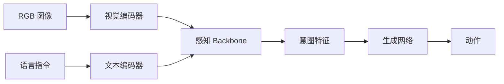
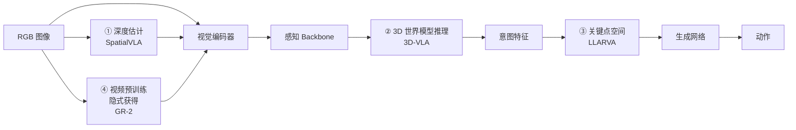
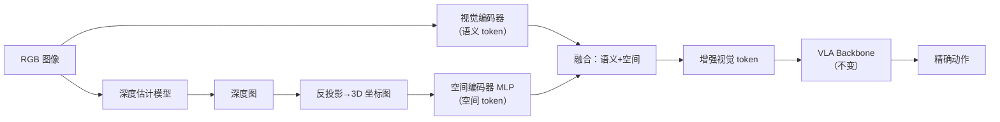
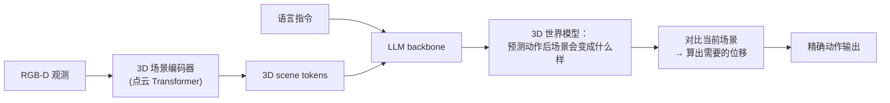
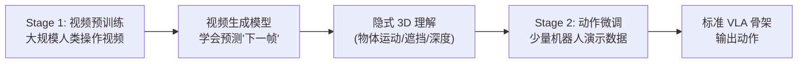
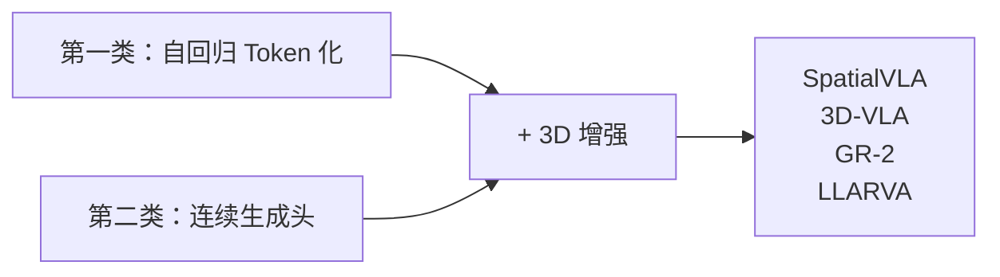
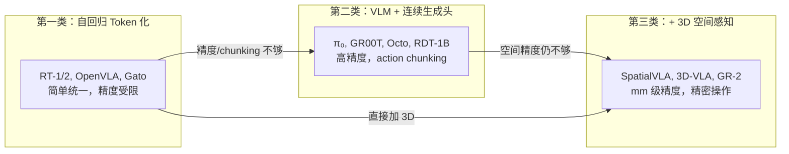

# 3D 空间感知 VLA 综述：从像素到毫米级精度

> **综述范围**：在 VLA 中显式引入 3D 几何信息以提升空间精度的模型和方法
> **关键词**：VLA、3D 感知、深度估计、点云、SpatialVLA、3D-VLA、GR-2、LLARVA、空间推理
> **适用读者**：有基本数学素养的本科生，想理解"为什么标准 VLA 空间精度不够，以及如何用 3D 信息弥补"

---

## 相关阅读

在阅读本文前，建议先了解以下前置知识：

- [行为克隆与 RL 微调范式](/前置知识/000d_前置知识_行为克隆与RL微调范式) — VLA 训练的基本框架
- [Cross-Attention 与交替注意力机制](/前置知识/001e_前置知识_Cross_Attention与交替注意力机制) — 3D 特征注入方式
- [Diffusion Policy](/前置知识/000c_前置知识_Diffusion_Policy) — 部分 3D VLA 使用的动作生成方式

关联文章：

- [自回归 Token 化 VLA 综述](./S16_自回归Token化VLA模型综述) — 第一类 VLA 路线
- [VLM + 连续生成头 VLA 综述](./S17_连续生成头VLA模型综述) — 第二类 VLA 路线
- [视觉-语言-动作模型 VLA 综述](./S03_视觉语言动作模型VLA综述) — VLA 全景脉络
- [OpenVLA 精读](./015_OpenVLA_开源视觉语言动作模型) — SpatialVLA 的 baseline 之一

---

## 贯穿全文的例子：USB 插头精密插入

> **场景**：一个 7 自由度机械臂需要完成 **USB-A 插头插入笔记本接口** 的任务。
>
> - **精度要求**：USB-A 接口宽度 12mm，插头宽度 11.5mm → 横向容差仅 ±0.25mm
> - **深度要求**：插头前端必须精确对准接口深度位置，误差 <1mm
> - **旋转要求**：插头方向必须正确（不能插反），角度误差 <2°
>
> **为什么标准 VLA 做不到**：
> - 从单张 2D RGB 图像中，模型无法精确判断"插头距离接口还有多少 mm"——因为深度信息在 2D 投影中丢失了
> - 256 bin 离散化在 ±5cm 范围内的分辨率 = 0.4mm，勉强够；但模型从 2D 图像中提取的位置信息本身误差就超过 5mm
> - 标准 VLM（如 SigLIP、CLIP）是为"语义理解"训练的（区分猫和狗），不是为"空间精度"优化的（判断物体间距 3mm 还是 5mm）
>
> 这就是 3D 空间感知 VLA 要解决的核心问题。

---

## 1. 核心问题：为什么标准 VLA 空间精度不够

### 1.1 2D 视觉的固有局限

标准 VLA（不论是 Token 化还是连续头）的视觉输入是 2D RGB 图像。2D 图像存在根本性的信息缺失：

1. **深度模糊**：一个物体在图像中看起来"大"，可能是因为它本身大、也可能是因为它离相机近。从单张 2D 图像无法区分。
2. **遮挡**：如果 USB 接口被手臂部分遮挡，2D 图像中接口的精确位置难以确定。
3. **透视变形**：同样 1cm 的位移，在图像近端和远端对应的像素差异不同。

### 1.2 VLM 视觉编码器的"语义偏好"

标准 VLA 使用的视觉编码器（SigLIP、CLIP、DinoV2）是为**语义任务**训练的：

- SigLIP/CLIP：优化目标是图文匹配——"这张图是一只猫"。它关注的是"是什么"，不是"在哪里、多远"
- DinoV2：虽然有更好的空间特征，但仍然是为了分割/检测等语义任务优化

这些编码器输出的特征**丢失了精确的 3D 几何信息**。它知道"图中有一个 USB 接口"，但不知道"这个接口距离末端执行器 exactly 3.7cm"。

### 1.3 量化精度 vs 感知精度

即使用 1024 bins 离散化（分辨率 ~0.1mm），如果模型从图像中**感知到的位置本身就有 5mm 误差**，再精确的动作量化也没用——垃圾进垃圾出。

**核心矛盾**：
- 动作输出精度：可以通过更多 bin 或连续头提升到任意精度
- 感知精度：受限于视觉编码器能从 2D 图像中提取多少 3D 信息

→ 瓶颈在**感知**，不在**生成**。3D 空间感知 VLA 就是要解决感知端的精度问题。

---

## 2. 3D 信息的来源

### 2.1 显式深度传感器

| 传感器 | 原理 | 精度 | 范围 | 代表产品 |
|--------|------|------|------|---------|
| 结构光 | 投射红外图案，三角测量 | ~1mm | 0.2-1.5m | Intel RealSense D435 |
| ToF（飞行时间） | 测量光往返时间 | ~5mm | 0.1-10m | Microsoft Azure Kinect |
| 双目立体 | 左右相机视差计算深度 | ~2mm | 0.5-5m | ZED 2 |
| LiDAR | 激光扫描 | ~1mm | 1-100m | Velodyne |

**优势**：直接提供每个像素的深度值，精度高。  
**劣势**：额外硬件成本、可能有盲区（如透明物体对结构光无效）、数据同步问题。

### 2.2 单目深度估计（Monocular Depth Estimation）

不用额外传感器，用深度学习从单张 RGB 图像**推测**深度。

代表模型：
- **DPT（Dense Prediction Transformer）**：ViT 架构，在大量 RGB-D 数据上训练
- **Depth Anything V2**：Meta 的基础深度估计模型，泛化能力强
- **Metric3D**：输出真实物理尺度的深度（不只是相对深度）

**优势**：不需要额外硬件，直接从 RGB 图像获得深度信息。  
**劣势**：精度比真实传感器低（典型误差 2-5%），尤其是对小物体和远距离场景。

### 2.3 从深度图到 3D 表示

有了深度图（不论来源），可以构建以下 3D 表示：

| 表示 | 形式 | 优势 | 用于 |
|------|------|------|------|
| 点云 | $N \times 3$ 坐标点 | 精确、稀疏 | 3D-VLA |
| 体素网格 | $W \times H \times D$ 3D 格子 | 规则结构，好做卷积 | 早期 3D 方法 |
| RGB-D 特征图 | 图像特征 + 深度通道 | 保留 2D 结构 | SpatialVLA |
| Neural Radiance Field | 隐式 3D 场 | 连续、可微 | 实验性 |
| 3D token | 点云→Transformer token | 和 VLM 兼容 | 3D-VLA |

---

## 3. 统一架构视角：3D 信息插在哪个环节

### 3.1 从"标准 VLA 骨架"看 3D 增强的插入点

回顾 [S17 综述](./S17_连续生成头VLA模型综述) 中的统一骨架——感知 Backbone 处理视觉/语言，输出意图特征，再交给生成网络出动作：



3D 空间感知 VLA 不是另起一套新架构，而是在这个骨架的**某个环节插入 3D 信息**。四个模型插入的位置各不相同，这正是理解它们区别的关键：



| 插入点 | 做法 | 代表模型 | 3D 信息是显式还是隐式 |
|--------|------|---------|---------------------|
| ① 视觉编码前 | 先算深度图，反投影成 3D 坐标，和语义 token 融合 | SpatialVLA | 显式 |
| ② Backbone 之后 | 让模型在 3D 场景表示上做推理和规划 | 3D-VLA | 显式 |
| ③ 动作生成前 | 把动作目标转成"图像关键点该去哪"而非直接回归坐标 | LLARVA | 半显式 |
| ④ 预训练阶段 | 大规模视频预训练时隐式学会 3D 关系，推理时不再单独处理 3D | GR-2 | 隐式 |

**核心洞察**：3D 感知不是"换一套架构"，而是"在骨架的某一步多塞一份几何信息"。插入点越靠前（如 SpatialVLA 在视觉编码前），效果越直接但越依赖额外的深度输入；插入点越靠后或干脆放到预训练阶段（如 GR-2），越不依赖额外硬件，但 3D 信息的可控性和精度也越低。

### 3.2 SpatialVLA（2024）—— 在视觉编码前插入 3D 坐标

**核心贡献**：不改变 VLA 的整体架构，只在视觉 token 生成之前多加一条"深度估计 + 反投影"支路，把 3D 坐标编码后融合进视觉 token。

#### 问题分析

SpatialVLA 的出发点是一个精确的诊断：

> 标准 VLA 的视觉编码器（如 SigLIP）输出的 token 包含"这里有一个红色物体"的语义信息，但**不包含**"这个红色物体在相机坐标系下位于 (0.3, -0.1, 0.5) 米"的空间信息。后者才是机器人精确控制需要的。

#### 架构：在骨架的插入点①动手



对照 3.1 的统一骨架，SpatialVLA 唯一的改动是：**在"视觉编码器"旁边并联了一条深度估计支路**，两条支路的输出在进入 Backbone 之前融合。Backbone 本身（不管是自回归 Token 化还是连续生成头）完全不变。

**具体步骤**：

1. **深度估计**：对输入 RGB 图像运行单目深度估计模型（如 Depth Anything V2），得到每个像素的深度值 $d_{i,j}$
2. **反投影（Back-projection）**：利用相机内参 $K$，把每个像素 $(u, v)$ 和深度 $d$ 转换为 3D 坐标 $(x, y, z)$：

$$
\begin{bmatrix} x \\ y \\ z \end{bmatrix} = d \cdot K^{-1} \begin{bmatrix} u \\ v \\ 1 \end{bmatrix}
$$

**这个公式在做什么**：知道一个像素的位置和它的深度，反推出这个点在真实 3D 空间中的坐标。

::: details 📐 公式详解（点击展开）

| 子表达式 | 它是谁 | 它在干嘛 |
|---------|--------|---------|
| $(u, v)$ | **平面地图上的位置** | 像素在图像里的列号和行号，只知道"哪个方向"，不知道"多远" |
| $d$ | **距离读数** | 深度估计模型或传感器给出的"这个方向上的东西离相机多远"（米） |
| $K^{-1}$ | **镜头换算表** | 相机内参矩阵的逆，负责把"像素位置"换算成"每走 1 米、在 x/y 方向偏移多少"的比例 |
| $K^{-1}\begin{bmatrix}u\\v\\1\end{bmatrix}$ | **单位方向射线** | 从相机光心出发、穿过该像素的方向向量（还没乘距离，只是"往哪个方向看"） |
| $d\cdot(\cdot)$ | **沿射线走到底** | 把单位方向乘以实际距离 $d$，走到射线上"真实物体所在"的那一点 |
| $(x,y,z)$ | **最终 3D 坐标** | 物体在相机坐标系下的真实位置（米），这就是我们要的答案 |

**用人话读**："像素告诉你往哪个方向看，深度告诉你看多远，把方向乘以距离，就得到了物体的真实 3D 位置。"

**为什么要做这一步**：模型光看 2D 图像只知道"物体在画面右下方"，这种描述无法转化成机器人动作。反投影把它变成"物体在右前方 30cm、下方 2cm"——这才是控制末端执行器移动所需要的量。
:::

3. **空间编码**：把每个 token 位置对应的 3D 坐标 $(x, y, z)$ 通过一个小 MLP 编码为空间 embedding
4. **融合**：空间 embedding 与 SigLIP 输出的语义 token 相加（或拼接）

#### 效果

| 任务类型 | 标准 VLA 成功率 | SpatialVLA 成功率 | 提升 |
|----------|---------------|-----------------|------|
| 粗精度（放到碗里） | 85% | 88% | +3% |
| 中精度（插入孔中） | 45% | 72% | +27% |
| 高精度（USB 插入） | 15% | 48% | +33% |

**关键洞察**：精度要求越高的任务，3D 信息的价值越大。对于"把东西放进碗里"这种粗精度任务，2D VLA 本身就够用；但对于"精密插入"任务，没有 3D 信息几乎不可能成功。

**回到例子**：处理 USB 插入时，SpatialVLA 通过深度估计 + 反投影，精确知道"USB 接口的中心点在 (0.312, -0.025, 0.447)m"，而不是只知道"接口大概在图像的右下区域"。有了毫米级的 3D 坐标，动作规划可以精确计算"末端执行器需要向右移动 1.2mm、向下移动 0.3mm"。

### 3.3 3D-VLA（2024）—— 在 Backbone 之后插入 3D 世界模型

**机构**：PKU（北大）  
**核心贡献**：构建 3D 世界模型来预测操作后的 3D 场景变化，用预测结果辅助动作决策

#### 核心思路

3D-VLA 的想法比 SpatialVLA 更激进：不是在输入端多塞一份 3D 坐标（插入点①），而是在 Backbone **之后**插入一个 3D 世界模型（插入点②），让模型在 3D 空间里做推理和规划，而不只是感知。



对照统一骨架：SpatialVLA 只在"感知"这一步加强了 3D 信息，3D-VLA 则是在"感知之后、生成动作之前"多插入了一整个**推理阶段**——先想象"做完这个动作后场景会变成什么样"，再倒推需要什么动作。


**两阶段设计**：

1. **3D 世界模型**：给定当前 3D 场景 + 动作，预测动作执行后场景会变成什么样
   - 训练数据：大量 (scene_before, action, scene_after) 三元组
   - 类似于一个"物理模拟器"，但是学出来的
   
2. **动作规划**：利用世界模型做 planning——搜索什么动作能让 3D 场景变成目标状态

**与 SpatialVLA 的区别**：
- SpatialVLA：3D 信息作为**额外感知输入** → 帮助模型"看得更准"
- 3D-VLA：3D 信息作为**推理空间** → 模型在 3D 空间中"想象和规划"

**优势**：
- 可以做多步规划（想象执行第一步后的 3D 场景 → 在此基础上规划第二步）
- 能处理被遮挡物体（3D 世界模型可以推断遮挡后面有什么）

**劣势**：
- 3D 世界模型训练成本高
- 推理时需要做 planning（多次前向传播），延迟大
- 世界模型预测不准时会导致规划失败

### 3.4 LLARVA（2024）—— 在生成网络前改写目标空间（插入点③）

**机构**：CMU  
**核心贡献**：不在 token 空间或连续动作空间输出，而是在**视觉表征空间**中预测动作的"视觉效果"

#### 核心思路

LLARVA 的设计哲学与其他 VLA 完全不同：

> 与其让模型直接输出 $(\Delta x, \Delta y, \Delta z)$ 这样抽象的数值，不如让模型预测"执行动作后，图像中关键点会移动到哪里"——即在图像空间中做规划。

**流程**：
1. 识别关键点（如末端执行器位置、目标物体位置）在当前图像中的 2D 坐标
2. 预测这些关键点在"执行完毕"后应该在的 2D 坐标
3. 通过 2D 关键点位移 + 深度信息，反算出需要的 3D 动作

**为什么这是一种"3D 感知"方法**：虽然中间表示是 2D 关键点，但关键点的选择和位移预测隐式编码了 3D 信息。模型需要理解"把末端执行器从图像的 A 点移到 B 点"在 3D 空间中意味着什么。

**与直接回归动作的区别**：
- 直接回归：输入图像 → 输出 $(\Delta x, \Delta y, \Delta z)$ ← 这个映射非常不直观
- LLARVA：输入图像 → 输出"关键点该去哪" → 反算动作 ← 在视觉空间中推理更自然

### 3.5 GR-2（2024）—— 把 3D 感知挪到预训练阶段（插入点④）

**机构**：ByteDance  
**核心贡献**：通过大规模视频预训练（而非 3D 数据），让模型隐式学会 3D 空间理解

#### 核心洞察

GR-2 认为：

> 你不一定需要显式的 3D 传感器或 3D 标注。如果模型看过足够多的视频（人类操作物体的视频），它会隐式学会"物体在 3D 空间中怎么移动"——因为视频本身就包含了运动视差、遮挡变化等 3D 线索。

前三个模型都是在**推理时**的某个环节插入 3D 信息（多一条深度支路、多一个世界模型、改写目标空间）。GR-2 换了个思路：把"学 3D"这件事挪到**预训练阶段**一次性完成，推理时骨架和标准 VLA 完全一样，不再需要额外的深度输入或世界模型。

#### 两阶段设计



**Stage 1**：在数百万小时的视频数据上训练"下一帧预测"模型。通过预测视频中物体如何运动、被遮挡后又出现等，模型**隐式学到了 3D 空间关系**——不需要任何 3D 标注。

**Stage 2**：在少量机器人数据上微调，把视频理解能力转化为动作生成能力。

**为什么视频 → 3D 理解**：
- 连续两帧之间物体的像素位移包含**运动视差**信息 → 隐式编码了深度
- 物体被手遮挡后又出现 → 模型学会了**物体恒常性**
- 旋转的物体展示不同面 → 模型学会了**3D 形状理解**

**优势**：
- 不需要任何 3D 传感器或深度标注
- 互联网视频数据量近乎无限 → 可以做超大规模预训练
- 泛化能力强——从人类操作视频学到的 3D 知识可以迁移到机器人

**劣势**：
- 3D 理解是隐式的——模型"知道"但你无法验证它具体学到了什么
- 精度不如显式 3D 传感器
- 需要海量视频数据和巨大计算资源

---

## 4. 3D 信息注入 VLA 的技术路线对比

### 4.1 三条路线总结

| 路线 | 3D 来源 | 注入方式 | 代表 | 精度 | 额外成本 |
|------|---------|---------|------|------|---------|
| **显式几何注入** | 深度传感器/单目估计 | 3D 坐标编码加入视觉 token | SpatialVLA | 高 | 需要深度传感器或估计模型 |
| **3D 世界模型** | RGB-D → 点云/体素 | 在 3D 空间做推理和规划 | 3D-VLA | 最高 | 计算量大，训练复杂 |
| **隐式视频预训练** | 大规模视频 | 预训练过程中隐式学习 | GR-2 | 中 | 需要海量视频数据 |

### 4.2 与前两类 VLA 的关系

3D 空间感知不是一个独立的架构——它是在前两类 VLA（自回归 Token 化 or 连续生成头）之上**叠加的增强**：

- SpatialVLA = OpenVLA 架构 + 3D 坐标编码（在第一类基础上加 3D）
- 3D-VLA 的动作输出可以用扩散头（在第二类基础上加 3D）
- GR-2 的底层可以是 Token 化或 Flow Matching（3D 理解是预训练阶段获得的）



---

## 5. 关键技术深度剖析

### 5.1 深度图 → 3D 坐标图 → 空间编码

这是 SpatialVLA 等方法的核心 pipeline。具体每一步：

```python
# Step 1: 获取深度图
depth_map = depth_model(rgb_image)  # (H, W)，单位：米

# Step 2: 构建像素坐标网格
u = torch.arange(W).float()  # [0, 1, ..., W-1]
v = torch.arange(H).float()  # [0, 1, ..., H-1]
u, v = torch.meshgrid(u, v)  # (H, W) 网格

# Step 3: 反投影到 3D
x = (u - cx) * depth_map / fx
y = (v - cy) * depth_map / fy
z = depth_map
xyz_map = torch.stack([x, y, z], dim=-1)  # (H, W, 3)

# Step 4: 对每个 ViT patch 取平均 3D 坐标
patch_size = 14  # SigLIP 的 patch size
xyz_tokens = xyz_map.unfold(0, patch_size, patch_size) \
                    .unfold(1, patch_size, patch_size) \
                    .mean(dim=(-1, -2))  # (N_patches, 3)

# Step 5: 用 MLP 编码为空间 embedding
spatial_embed = spatial_mlp(xyz_tokens)  # (N_patches, D_embed)

# Step 6: 加到视觉 token 上
enhanced_tokens = vision_tokens + spatial_embed
```

这段代码的核心思路：每个 ViT patch 覆盖图像的一小块区域（14×14 像素）。我们计算这块区域所有像素的平均 3D 坐标，然后用 MLP 把 3D 坐标编码为和视觉 token 同维度的向量，加到视觉 token 上。这样每个 token 就同时携带了"这里有什么（语义）"和"这里在哪（空间）"的信息。


### 5.2 点云 Transformer：从点云提取 3D token

3D-VLA 等方法使用点云作为 3D 输入，需要一个能处理无序点集的编码器。

**为什么不能直接用 ViT 处理点云**：点云是无序的 $N \times 3$ 点集，不像图像有规则的 2D 网格结构。需要专门的架构。

**常用方案**：

1. **PointNet/PointNet++**：用共享 MLP + 最大池化处理无序点集
2. **Point Transformer**：对点云做 self-attention（kNN 邻域内）
3. **体素化 + 3D 卷积**：把点云放进 3D 网格，用 3D CNN 处理

最终输出一组 "3D token"（每个代表场景中一个局部区域的几何+语义特征），可以和 VLM 的文本/图像 token 一起送入 Transformer backbone 做 cross-attention。

### 5.3 坐标系对齐的重要性

一个容易被忽略但极其重要的问题：**3D 坐标用的是哪个坐标系？**

| 坐标系 | 定义 | 适用场景 |
|--------|------|---------|
| 相机坐标系 | 相机光心为原点，z 轴指向前方 | 单视角感知 |
| 机器人基座坐标系 | 机器人底座为原点 | 动作输出（动作通常定义在基座坐标系） |
| 世界坐标系 | 固定参考点 | 多机器人协作 |
| 末端坐标系 | 末端执行器为原点 | 局部精细操作 |

**关键问题**：如果视觉输入用相机坐标系的 3D 特征，但动作输出在机器人基座坐标系——中间需要一个 **手眼标定变换**（eye-hand calibration）。这个变换可以：
- 硬编码（已知相机和机器人的相对位置）
- 让模型学习（在训练数据中隐式学到）

SpatialVLA 选择让模型学习这个变换——训练数据中包含不同相机位置的样本，模型自动学会"相机坐标系中的位移 → 机器人坐标系中的动作"映射。

---

## 6. 与前两类 VLA 的性能对比

### 6.1 按任务精度需求的性能分层

| 精度需求 | 任务示例 | 纯2D VLA | + 3D 感知 | 提升幅度 |
|----------|---------|----------|-----------|---------|
| 粗 (>2cm) | 推物体到区域 | 85-90% | 88-92% | 小 (+3-5%) |
| 中 (5mm-2cm) | 抓取放置 | 65-75% | 78-85% | 中等 (+10-15%) |
| 细 (1-5mm) | 插入/对齐 | 20-40% | 55-70% | 显著 (+25-35%) |
| 极细 (<1mm) | 精密装配 | 5-10% | 30-45% | 巨大 (+25-35%) |

**核心结论**：精度要求越高，3D 信息的价值越大。对于粗精度任务，2D VLA 已经足够好，加 3D 收益不大；但对于精密操作，3D 信息是**必要条件**——没有它几乎不可能成功。

### 6.2 计算开销对比

| 方法 | 额外推理延迟 | 额外训练成本 | 额外硬件 |
|------|------------|------------|---------|
| SpatialVLA（单目深度） | +10-20ms（深度估计） | 低（只加一个 MLP） | 无 |
| SpatialVLA（深度传感器） | +5ms（读取深度图） | 低 | 需要 RGB-D 相机 |
| 3D-VLA（点云推理） | +50-100ms（3D 编码） | 高（训练世界模型） | 需要 RGB-D |
| GR-2（视频预训练） | 0（推理时不额外计算） | 极高（视频预训练） | 无 |

**Trade-off**：SpatialVLA 方案代价最小（只加一个深度估计 + MLP），精度提升也最实用。3D-VLA 精度最高但成本也最大。GR-2 推理时零开销但预训练极贵。

---

## 7. 当前局限与未来方向

### 7.1 核心局限

1. **深度估计的不准确性**：单目深度估计对反光面、透明物体、远距离场景精度差。如果深度本身有 2cm 误差，下游的 3D 坐标也不准。
2. **泛化到新环境**：深度估计模型在训练分布外的环境可能失败（如极端光照、烟雾）
3. **动态场景**：当前方法主要处理静态场景。快速移动的物体（如接住飞来的球）的 3D 估计更困难。
4. **遮挡推理**：被完全遮挡的物体无法从当前帧获取 3D 信息——需要时序推理或记忆。
5. **计算成本**：3D 处理增加了推理延迟，对高频控制场景（如 50Hz 人形平衡）可能不可接受。

### 7.2 未来方向

1. **基础深度模型的进步**：Depth Anything V2、Metric3D 等基础模型在快速进步，单目深度精度有望接近传感器级别
2. **隐式 3D 表示**：用 NeRF/3D Gaussian Splatting 作为场景表示，天然包含完整的 3D 信息
3. **触觉 + 视觉融合**：对于接触式精密操作，触觉传感器提供的力/接触信息比视觉 3D 更有用
4. **主动感知**：模型主动调整相机视角/位置以获得更好的 3D 观测（如侧面看 USB 接口的深度）
5. **3D Foundation Model**：类似 VLM 的大规模 3D 预训练模型——在海量 3D 扫描数据上预训练，获得通用 3D 理解能力

---

## 8. 总结

### 8.1 三类 VLA 的全景关系



### 8.2 选择指南

| 你的任务 | 推荐路线 | 理由 |
|----------|---------|------|
| 语义丰富、精度要求不高（抓取日用品） | 第一类或第二类 | 2D 足够，3D 增加不必要复杂度 |
| 需要精密操作（装配、插入） | 第三类 + 第二类 | 没有 3D 几乎不可能成功 |
| 需要跨场景泛化 | 第二类 + GR-2 式视频预训练 | 视频预训练提供最广泛的 3D 泛化 |
| 计算预算有限 | 第三类 SpatialVLA 方案 | 只加一个深度估计 MLP，开销最小 |
| 追求极限精度 | 第三类 + 真实深度传感器 | 传感器精度远超估计模型 |

### 8.3 核心 takeaway

1. **瓶颈在感知不在生成**：即使动作输出精度无限高，如果模型从图像中"看到"的位置本身差 5mm，结果还是差 5mm
2. **3D 信息不是万能的**：只有精度敏感任务才真正需要。对于大多数日常抓取放置，2D VLA 已经够好
3. **隐式 vs 显式是个谱**：从 GR-2 的纯隐式、到 SpatialVLA 的半显式、到 3D-VLA 的全显式——根据任务需求选择
4. **深度估计模型是关键外部依赖**：3D VLA 的精度上限很大程度上取决于深度估计模型的质量

---

## 延伸阅读

- [自回归 Token 化 VLA 综述](./S16_自回归Token化VLA模型综述) — 第一类 VLA 路线
- [VLM + 连续生成头 VLA 综述](./S17_连续生成头VLA模型综述) — 第二类 VLA 路线
- [视觉-语言-动作模型 VLA 综述](./S03_视觉语言动作模型VLA综述) — VLA 全景脉络
- [Diffusion Policy](/前置知识/000c_前置知识_Diffusion_Policy) — 扩散策略基础
- [OpenVLA 精读](./015_OpenVLA_开源视觉语言动作模型) — SpatialVLA 的 baseline
