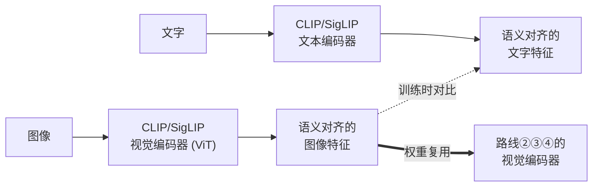
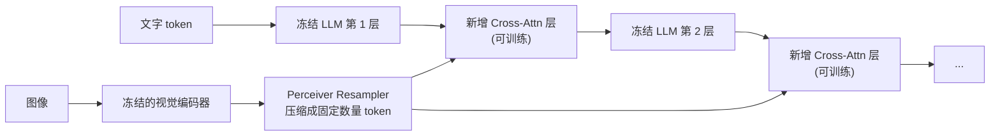
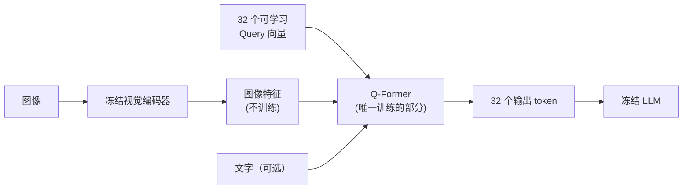
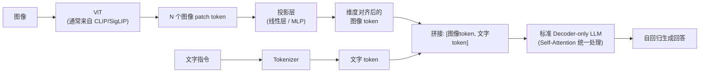
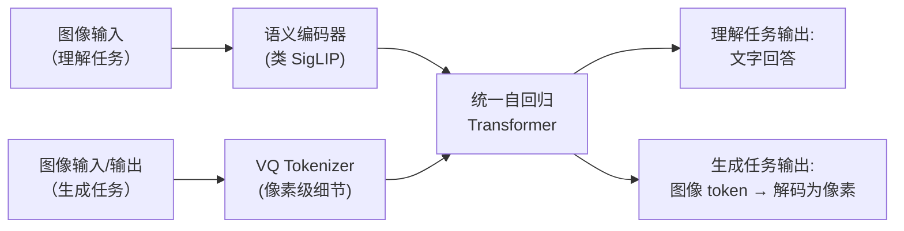
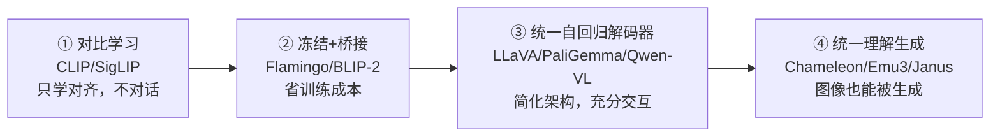

# VLM 视觉语言模型架构综述：从 CLIP 到统一理解生成的四条路线

> **综述范围**：视觉-语言模型（Vision-Language Model, VLM）本身的架构演进——不涉及具体下游任务，聚焦"图像和文字这两种模态，在模型内部到底是怎么被放到一起处理的"
> **关键词**：VLM、CLIP、SigLIP、Flamingo、BLIP-2、LLaVA、PaliGemma、Qwen-VL、Chameleon、Emu3、Janus、对比学习、Q-Former、视觉指令微调
> **适用读者**：有基本数学素养（线代、概率）的本科生，想系统理解"多模态大模型到底有几种造法，各自的取舍是什么"

---

## 相关阅读

在阅读本文前，建议先了解以下前置知识：

- [Vision Transformer：图像怎么变成一串 Token](/前置知识/003g_前置知识_Vision_Transformer图像分块与位置编码) — 几乎所有 VLM 的"眼睛"部件
- [对比学习与 InfoNCE：CLIP 如何用图文对齐学会理解世界](/前置知识/003h_前置知识_对比学习与InfoNCE_CLIP) — CLIP/SigLIP 的训练目标详解
- [Cross-Attention 与交替注意力机制](/前置知识/001e_前置知识_Cross_Attention与交替注意力机制) — Flamingo 路线的核心机制
- [Perceiver Resampler：跨模态 Token 压缩](/前置知识/002o_前置知识_Perceiver_Resampler跨模态Token压缩) — BLIP-2 的 Q-Former 是它的一个变体
- [向量量化与离散表示学习](/前置知识/001q_前置知识_向量量化与离散表示学习) — 统一理解生成模型把图像变成离散 token 的基础
- [交叉熵损失与 Softmax](/前置知识/003f_前置知识_交叉熵损失与Softmax) — 自回归 VLM 的训练目标
- [KV-Cache 与自回归解码](/前置知识/002m_前置知识_KV_Cache与自回归解码) — 理解 VLM 推理效率的基础

关联综述：

- [视觉-语言-动作模型 VLA 综述](./S03_视觉语言动作模型VLA综述) — VLM 作为机器人策略的"大脑"如何被复用
- [自回归 Token 化 VLA 综述](./S16_自回归Token化VLA模型综述) — 下游应用之一，直接复用本文第 3 类范式的 VLM 骨干
- [VLM + 连续生成头 VLA 综述](./S17_连续生成头VLA模型综述) — 下游应用之一，用本文第 3 类范式的 VLM 做"理解"部分

---

## 贯穿全文的例子

为了让四条技术路线的区别落到实处，本文始终使用同一个场景：

> **场景**：用户上传一张厨房照片——台面上有一把**红色水壶**、一个**白色马克杯**。用户先问："图里有什么？"（图像理解任务），模型需要正确描述"一把红色水壶和一个白色马克杯放在台面上"；接着用户又说："把水壶换成蓝色的"（图像编辑/生成任务），模型需要生成一张水壶变成蓝色、其他内容不变的新图。
>
> 这个例子横跨了 VLM 的两大能力——**理解**（看图回答问题）和**生成**（根据指令产出新图像）。本文的四条技术路线，正好对应"要不要具备生成能力"以及"理解能力怎么实现"这两个维度上的不同选择。

---

## 1. 什么是 VLM，以及它要解决的核心问题

### 1.1 一句话定义

> **视觉-语言模型（VLM）**：能同时处理图像和文字输入（有些还能输出图像），并在两种模态之间建立语义关联的神经网络模型。

VLM 不是一个单一架构，而是一个**问题**——"怎么让一个原本只处理文字的语言模型，也能'看懂'图像"。这个问题从 2021 年的 CLIP 到今天，产生了四条差异巨大的解法。理解这四条路线的核心区别，是理解本文最重要的目标。

### 1.2 核心矛盾：图像和文字是两种完全不同的数据

文字天生是离散符号序列——一句话可以被切成词/字，每个词是词表里的一个确定条目。图像是连续的像素网格，没有天然的"词表"。VLM 要解决的根本问题是：**用什么方式让这两种数据在模型内部"对话"**？

围绕这个问题，四条路线给出了四种截然不同的答案：

| 路线 | 核心答案 | 代表模型 |
|------|---------|---------|
| ① 双编码器对比学习 | 不融合，只对齐——图像和文字各自编码，在共享空间里比相似度 | CLIP、SigLIP |
| ② 冻结骨干 + 桥接模块 | 保留两个预训练好的独立模型（视觉、语言），中间加一个轻量"翻译层" | Flamingo、BLIP-2 |
| ③ 统一自回归解码器 | 把图像也变成 token，塞进语言模型的输入序列，一个 Transformer 端到端处理 | LLaVA、PaliGemma、Qwen-VL |
| ④ 统一理解生成 | 图像不仅是输入，也是输出——用同一个自回归框架同时生成文字 token 和图像 token | Chameleon、Emu3、Janus |

这四条路线不是简单的"一代比一代强"的迭代关系——①主要解决"表示对齐"问题（不能单独拿来对话），②③④才是能被叫做"多模态对话助手"的完整系统，其中③是当前工业界的主流选择（也是几乎所有 VLA 机器人模型复用的骨干），④是最新的研究前沿。

---

## 2. 路线一：双编码器对比学习（CLIP / SigLIP）

> 📖 本节只讲这条路线的核心思路和定位。完整的模型演化脉络（CLIP → ALIGN → OpenCLIP → MetaCLIP → EVA-CLIP → SigLIP → SigLIP 2）、每个模型的具体区别、如何选型，见专门的深度综述：[双编码器对比学习 VLM 综述](./S20_双编码器对比学习VLM综述)。

### 2.1 这一路线解决什么问题

CLIP、SigLIP 严格来说不是"对话式"VLM——它们不能回答"图里有什么"这种开放式问题。它们要解决的是更基础的问题：**怎么让图像特征和文字特征落在同一个语义空间里**，使得"一张狗的图片"的特征向量和"dog"这个词的特征向量在向量空间中彼此靠近。

这个问题的解法已经在前置知识里详细讲过：[用对比学习和 InfoNCE 损失训练两个独立的编码器](/前置知识/003h_前置知识_对比学习与InfoNCE_CLIP)，逼迫匹配的图文对相似度高、不匹配的相似度低。

### 2.2 在四条路线里的位置：地基，而非终点

回到本文的例子：CLIP/SigLIP 本身不能回答"图里有什么"，也不能生成新图像——它们能做的只是"给定一张图和一句话，打一个匹配分数"，或者"给定一批候选文字，找出和图片最匹配的那句"（zero-shot 分类的原理）。

**但它们是后面三条路线共同依赖的地基**——路线②③④的"视觉编码器"部分，几乎都直接复用 CLIP 或 SigLIP 预训练好的 [ViT](/前置知识/003g_前置知识_Vision_Transformer图像分块与位置编码) 权重。原因很直接：经过对比学习训练的 ViT，输出的特征已经和语言语义对齐，比一个只做过分类训练（比如在 ImageNet 上）的 ViT 更适合接入语言模型。

---

## 3. 路线二：冻结骨干 + 桥接模块（Flamingo / BLIP-2）

### 3.1 这一路线要解决的问题

2022 年前后，业界已经有了非常强大的纯语言模型（如 GPT-3、Chinchilla）和纯视觉模型（如 CLIP 的视觉编码器），从零训练一个新的多模态模型代价极高——要在数十亿图文对上重新训练整个语言理解能力，等于把已经学好的知识全部推倒重来。

**核心问题变成**：能不能**冻结**这两个已经训练好的大模型，只训练一个轻量的"翻译模块"，让视觉特征能被语言模型理解？

### 3.2 Flamingo：用 Cross-Attention 把视觉特征"插入"语言模型

Flamingo（DeepMind，2022）的方案是：语言模型（一个预训练好的、**权重冻结**的 LLM）本身的每一层之间，插入新的 [Cross-Attention](/前置知识/001e_前置知识_Cross_Attention与交替注意力机制) 层——只有这些新插入的层参与训练。

视觉特征在送入 Cross-Attention 之前，先经过一个 [Perceiver Resampler](/前置知识/002o_前置知识_Perceiver_Resampler跨模态Token压缩) 压缩成固定数量（比如 64 个）的 token——不管原始图像/视频有多长，压缩后的视觉 token 数量恒定，这样新插入的 Cross-Attention 层的计算量是可控的。

**这一设计的动机**：LLM 的语言能力（语法、常识、推理）已经在海量文本上学得很好，全量微调容易在小规模多模态数据上把这些能力"冲掉"（灾难性遗忘）。冻结 LLM、只训新增的 Cross-Attention，代价是极小的新增参数量（相对 LLM 总参数量），换来的是语言能力被完整保留。

### 3.3 BLIP-2：用 Q-Former 做"可学习的信息提取器"

BLIP-2（Salesforce，2023）的思路更进一步：不仅冻结 LLM，也**冻结**视觉编码器，中间插入一个专门设计的小型 Transformer——**Q-Former**（Querying Transformer）。

Q-Former 本质上是 [Perceiver Resampler](/前置知识/002o_前置知识_Perceiver_Resampler跨模态Token压缩) 思路的一个具体实现：一组固定数量（32 个）的可学习 query 向量，通过 Cross-Attention 去"查询"冻结视觉编码器输出的图像特征，同时这些 query 也能和文字做交互——这样 Q-Former 的输出既携带了视觉信息，也和文字任务的目标对齐。

BLIP-2 分两阶段训练 Q-Former：第一阶段只用视觉-语言对比/匹配任务训练 Q-Former 学会"提取和语言相关的视觉特征"（不涉及 LLM）；第二阶段把 Q-Former 的输出接到冻结 LLM 前面，训练 Q-Former 学会"生成 LLM 能理解的 token 表示"。两阶段都只更新 Q-Former 这一个轻量模块（几千万参数），视觉编码器和 LLM 全程冻结。

### 3.4 路线二的取舍

| 维度 | Flamingo（Cross-Attention 插入） | BLIP-2（Q-Former） |
|------|------------------------------|---------------------|
| 视觉编码器是否冻结 | ✅ 冻结 | ✅ 冻结 |
| LLM 是否冻结 | ✅ 冻结（只训新层） | ✅ 冻结 |
| 新增可训练参数位置 | LLM 每层之间插入的 Cross-Attn | 独立的小型 Transformer（Q-Former） |
| 视觉 token 如何进入 LLM | 每层都重新做一次 Cross-Attention | 一次性转换成固定数量 token，直接拼进输入序列 |
| 训练成本 | 中（需要训练很多层新增模块） | 低（Q-Former 参数量很小） |
| 上限 | 较高（每层都能重新关注视觉信息） | 受 Q-Former 提取能力瓶颈限制 |

路线二最大的优势是**训练成本低、不破坏原有能力**；最大的局限是**语言模型对视觉信息的"看"永远隔了一层**——无论 Cross-Attention 插入多少层，视觉 token 和文字 token 之间的交互方式都是预先设计好的，不像路线三那样让两种模态的 token 完全平等地进入同一个 Self-Attention 里自由交互。

---

## 4. 路线三：统一自回归解码器（LLaVA / PaliGemma / Qwen-VL）——当前主流

### 4.1 核心思路：图像 token 化后，直接拼进输入序列

路线三是目前工业界和开源社区的绝对主流，思路极其简洁：

> 把图像编码成一串 token（用路线一里预训练好的 ViT），再用一个**轻量的投影层**（通常只是一两层 MLP）把这些视觉 token 的维度对齐到语言模型的词嵌入维度，然后**直接拼接**到文字 token 前面，作为语言模型输入序列的一部分——之后完全交给标准的、单一的 Decoder-only Transformer 处理，不区分视觉 token 和文字 token。

**这一步在做什么**：让图像 token 和文字 token 在数学形式上变得**完全等价**——都是同一个隐藏维度 $d$ 的向量，排在同一个序列里，被同一组 $W_Q, W_K, W_V$ 参数处理。语言模型完全"不知道"哪些 token 来自图像、哪些来自文字，它只是在处理一个更长的、混合了两种"词汇"的序列。

### 4.2 为什么这条路线成为主流

和路线二相比，路线三有三个关键优势：

1. **架构最简单**：不需要设计任何新的注意力机制或专用模块，投影层甚至可以只是一个线性层。工程实现和调试成本最低。
2. **信息交互最充分**：图像 token 和文字 token 在同一个 Self-Attention 矩阵里自由交互，任何一层的任何 token 都能直接"看到"任何其他 token——不像路线二那样受限于预先设计好的 Cross-Attention 插入点。
3. **完全复用 LLM 生态**：因为输入输出形式和纯文本 LLM 完全一致（只是多了一段特殊的图像 token），训练、推理、部署的所有基础设施（vLLM、FlashAttention、量化工具链）可以直接复用。

### 4.3 LLaVA：最早证明"简单投影层就够用"的工作

LLaVA（Visual Instruction Tuning，2023）验证了一个出乎意料的结论：连接视觉和语言，**不需要复杂的 Q-Former 或 Cross-Attention，一个简单的线性层（后续版本改为两层 MLP）就足够**。

LLaVA 的训练分两阶段：

**阶段 1：特征对齐预训练**——冻结 ViT 和 LLM，只训练中间的投影层，用大量"图像-简短描述"数据，让投影层学会把 ViT 输出的 patch 特征映射到 LLM 能理解的嵌入空间附近。

**阶段 2：端到端指令微调**——解冻 LLM（ViT 通常仍冻结），用 GPT-4 生成的高质量"图像-问答对话"数据（视觉指令微调数据，Visual Instruction Tuning data）联合训练投影层和 LLM，让模型学会像 ChatGPT 一样进行自然的多轮视觉对话，而不只是"看图说话"式的简单描述。

**关键洞察**：LLaVA 证明了"桥接模块"本身不需要多复杂——真正起作用的是**投影层之后，让整个语言模型（连同投影层）在高质量的视觉对话数据上做端到端微调**。这也是为什么这条路线被称为"统一"——一旦投影完成，就没有"专门的视觉模块"和"专门的语言模块"的区分了，一切交给同一个 Transformer。

### 4.4 PaliGemma：把图像当成"看得见的前缀"

PaliGemma（Google，2024）用 SigLIP 视觉编码器 + Gemma 语言模型，同样走线性投影 + 拼接的路线，但训练目标的表述方式更直接：把整个任务写成 **prefix-LM** 的形式——

$$
\text{输入前缀（prefix）} = [\text{图像 token},\ \text{任务描述文字}]，\quad \text{输出后缀（suffix）} = \text{答案文字}
$$

**这个公式在做什么**：把"图像 + 任务描述"打包成模型看到的固定输入（前缀），模型要做的只是接着这个前缀往后续写出答案（后缀）——和续写一句话没有本质区别。

::: details 📐 公式详解（点击展开）

| 子表达式 | 它是谁 | 它在干嘛 |
|---------|--------|---------|
| $\text{图像 token}$ | **看到的东西** | 图像经 ViT 编码、投影后得到的一串 token，扮演"这张图里有什么"的角色 |
| $\text{任务描述文字}$ | **任务指令** | 一句简短的文字提示，如 `"caption en"`（用英文描述）或 `"detect cat"`（检测猫），告诉模型此刻要做什么任务 |
| $[\text{图像 token},\ \text{任务描述文字}]$ | **前缀（prefix）** | 图像 token 和任务描述文字拼接成的固定输入序列，模型在训练和推理时始终能完整看到它 |
| $\text{答案文字}$ | **后缀（suffix）** | 模型需要自回归生成的部分，比如具体的图片描述或检测框坐标文字 |

**用人话读**："给模型看一张图加一句任务说明，模型接着往下把答案写出来。"

**为什么这样设计**：不同视觉任务（分类、检测、分割、问答）原本需要不同的输出头和损失函数；改成"前缀决定任务、模型统一续写"后，架构完全不用为任务差异做任何改动，只需换一句任务描述文字。
:::

图像 token 被当作"前缀"的一部分，和任务描述文字（比如 `"caption en"` 表示"用英文描述图片"）拼在一起，模型只需要在这个前缀的基础上自回归续写出后缀（答案）。**这一设计的意义**：不同视觉任务（分类、检测、分割、问答）都被统一表述成"给定前缀，生成后缀"的格式，任务的差异完全由前缀里的文字提示决定，模型架构本身不需要为不同任务做任何改动。

### 4.5 Qwen-VL 系列：原生动态分辨率与视频原生支持

路线三发展到 Qwen2-VL / Qwen3-VL 这一代，在"图像 token 化"这一步引入了两个重要改进（具体实现细节见 [Qwen3-VL 骨干：视觉编码、MRoPE 与 KV-Cache 生成](/系列/xr0_deep_dive/03_Qwen3VL骨干_视觉编码与MRoPE)）：

**改进一：原生动态分辨率（Naive Dynamic Resolution）**——不再把所有输入图像强行 resize 到固定尺寸，而是让每张图按自己的原始长宽比切出数量不等的 patch，避免形变和细节损失。

**改进二：多模态位置编码（MRoPE）**——纯文本的一维 [RoPE](/前置知识/002k_前置知识_RoPE旋转位置编码) 位置编号无法表达图像 patch 的二维空间结构（行、列）。MRoPE 把位置编号从一个整数扩展成 $(t, h, w)$ 三元组，让同一套 Attention 机制能自然处理"文本的线性顺序"和"图像的二维网格"混合输入。

这两个改进都发生在"怎么把图像变成 token 序列"这一步，属于路线三框架内部的精细化——核心思想（图像 token 化后拼接进统一自回归序列）没有变。

### 4.6 路线三的统一设计模板

和 [S17 综述](./S17_连续生成头VLA模型综述) 分析 VLA 架构的方式类似，路线三下的所有模型都可以用同一个骨架描述，区别只在几个"插槽"里填了什么：

| 插槽 | 它决定什么 | 可选方案 | 代表模型 |
|------|-----------|---------|---------|
| ① 视觉编码器 | 图像特征质量 | CLIP ViT / SigLIP ViT / 从头训练 | LLaVA(CLIP)、PaliGemma(SigLIP) |
| ② 投影层 | 视觉→语言的维度对齐方式 | 线性层 / 2层MLP / Q-Former风格 | LLaVA-1.5(MLP)、原始LLaVA(线性) |
| ③ 分辨率处理 | 图像切分与缩放策略 | 固定分辨率 / 原生动态分辨率 | LLaVA(固定)、Qwen2-VL(动态) |
| ④ 位置编码 | 图像 token 的空间信息 | 1D 位置 / 2D 插值 / MRoPE | LLaVA(简单拼接)、Qwen-VL(MRoPE) |
| ⑤ 语言模型骨干 | 推理和生成能力上限 | Vicuna / Gemma / Qwen | 各随所依赖的开源 LLM |
| ⑥ 训练策略 | LLM 是否冻结、微调程度 | 全量微调 / LoRA / 分阶段解冻 | LLaVA(两阶段)、PaliGemma(端到端) |

---

## 5. 路线四：统一理解与生成（Chameleon / Emu3 / Janus）

### 5.1 这一路线要解决的问题

路线一到三的模型都只能**理解**图像——回答"图里有什么"，但没有一个能**生成**图像——完成"把水壶换成蓝色的"这个任务。生成图像传统上依赖完全不同的技术（扩散模型），需要一整套独立的架构和训练流程。

路线四要解决的问题是：**能不能用同一个模型、同一套自回归框架，既理解图像也生成图像**？

### 5.2 核心思路：把图像也变成"可以被预测的 token"

路线三只把图像 token 化用作**输入**——图像进、文字出，是单向的。路线四把这个思路推向极致：图像不仅可以被 token 化后输入，也可以被 token 化后作为**输出**——用[向量量化（VQ）](/前置知识/001q_前置知识_向量量化与离散表示学习)把图像压缩成一串离散 token，语言模型学会像预测下一个文字 token 一样，预测下一个"图像 token"，生成完的图像 token 序列再通过 VQ 的解码器还原成真实图像。

$$
\text{统一序列} = [\text{文字 token}_1, \dots, \text{图像 token}_1, \dots, \text{图像 token}_M, \dots, \text{文字 token}_N]
$$

**这个公式在做什么**：把文字和图像的离散 token 首尾接成一条序列，交给同一个自回归模型统一预测——序列里每个位置究竟是文字还是图像，模型不需要特殊对待，都用"预测下一个 token"处理。

::: details 📐 公式详解（点击展开）

| 子表达式 | 它是谁 | 它在干嘛 |
|---------|--------|---------|
| $\text{文字 token}_1, \dots$ | **普通词表条目** | 和纯文本 LLM 里的 token 完全一样，来自语言词表 |
| $\text{图像 token}_1, \dots, \text{图像 token}_M$ | **图像 codebook 条目** | 图像经 VQ 编码器压缩成 $M$ 个离散索引，每个索引对应"图像 codebook"里的一个条目，本质上和文字 token 是同一种数据结构（词表里的一个整数 ID） |
| $[\cdot, \cdot, \dots]$ | **拼接后的统一序列** | 不同模态的 token 按出现顺序首尾相连，模型看到的只是一条更长的整数序列，没有"图像段/文字段"的架构标记 |
| next-token prediction | **统一的预测方式** | 不管当前位置该出文字还是图像，都用同一个 Softmax 在同一个（文字+图像）联合词表上做分类 |

**用人话读**："把图像也编码成一串词表 ID，和文字 token 拼成一条序列，让模型像写句子一样一个个 token 往下预测，图像 token 和文字 token 待遇完全相同。"

**为什么这样设计**：如果给图像和文字分别设计不同的预测头/损失函数，模型就需要在架构上区分模态，训练和推理都要维护两套逻辑；统一成同一词表、同一 next-token prediction 后，图像生成和文字生成可以共享同一个 Transformer 和同一套训练目标（[交叉熵损失](/前置知识/003f_前置知识_交叉熵损失与Softmax)），架构上不再需要区分"理解"和"生成"两条通路。
:::

整个序列不区分"这是图像段还是文字段"——都用 next-token prediction 的方式统一训练和生成，训练目标就是标准的[交叉熵损失](/前置知识/003f_前置知识_交叉熵损失与Softmax)，只是词表里既有文字 token 也有"图像 codebook"里的离散 token。

### 5.3 Chameleon：早期融合（Early Fusion），一套词表统管一切

Chameleon（Meta，2024）走的是最彻底的统一路线：图像和文字**从最开始就共享同一个 Transformer、同一个训练目标**。图像先被一个预训练好的 VQ 模型编码成离散 token，这些 token 直接扩展进语言模型的词表——一个 token 既可能是英文单词，也可能是"图像 codebook 里的第 1024 号条目"。整个模型不区分模态，从零开始联合训练。

**这一设计的优势**：图像和文字的交互没有任何架构上的"缝隙"——它们本来就在同一个 embedding 空间、同一个 Attention 矩阵、同一个训练目标下被优化，理论上能学到最紧密的跨模态关联。**代价**：训练极不稳定（图像 token 的统计特性和文字 token 差异很大，混在一起训练容易梯度爆炸），Chameleon 论文为此设计了专门的归一化和初始化策略来稳定训练。

### 5.4 Emu3：证明"只需要 next-token prediction"就能同时搞定生成和理解

Emu3（智源研究院，2024）进一步验证了 Chameleon 的思路——**不需要扩散模型，纯粹的 next-token prediction 就能生成高质量图像和视频**。Emu3 把图像/视频都编码成离散 token（视频在时间维度上也做类似处理），用单一的自回归 Transformer 同时处理生成任务（文字→图像）和理解任务（图像→文字），进一步证明了路线四的通用性——同一个模型架构，靠输入输出的 token 顺序不同，就能切换"看图说话"和"依据文字画图"两种模式。

### 5.5 Janus：发现"理解"和"生成"其实需要不同的视觉编码方式

Janus（DeepSeek，2024）指出了 Chameleon/Emu3 这类"单一视觉编码器同时服务理解和生成"方案的一个问题：**理解任务需要的视觉特征和生成任务需要的视觉特征，其实不是一回事**。

- **理解任务**：需要高层语义特征（"这是一只狗"），越抽象越好，细粒度的像素级重建误差不重要
- **生成任务**：需要能精确重建像素的低层特征（VQ codebook 需要保留足够细节才能还原出清晰图像），过度抽象的语义特征反而生成不出细节

Janus 的解决方案是**解耦视觉编码路径**：理解任务用一个类似 SigLIP 的语义编码器提取特征；生成任务用一个专门的 VQ tokenizer 提取像素级细节特征。两条路径的输出**都进入同一个统一的 Transformer** 做 next-token prediction，只是编码方式不同——推理时根据当前是理解任务还是生成任务，自动选择对应的编码路径。

**这一设计的意义**：既保留了路线四"用同一个 Transformer 统一处理"的核心优势（架构简洁、任务切换灵活），又解决了"一个编码器难以同时兼顾语义抽象和像素细节"这一矛盾——用两条编码路径分别专注各自的目标，在下游用同一套自回归框架融合。

### 5.6 回到本文例子：路线四如何完成"把水壶换成蓝色"

在路线四的框架下，"把红色水壶换成蓝色的"这个编辑请求会被处理成：

1. 原图先被编码成一串图像 token（理解路径，如果模型需要先"看懂"原图内容）
2. 编辑指令文字被 tokenize
3. 模型以"[原图 token][编辑指令文字 token]"为前缀，自回归地生成一串新的图像 token（生成路径）
4. 新的图像 token 序列通过 VQ 解码器还原成一张新图像

整个过程中，"理解原图"和"生成新图"用的是同一个 Transformer 的同一次自回归解码——这是路线三（只能理解，不能生成）完全做不到的能力。

### 5.7 路线四的现状与局限

| 维度 | 现状 |
|------|------|
| 图像生成质量 | 已能媲美部分专用扩散模型，但顶尖细节质量仍有差距 |
| 训练稳定性 | 早期融合（Chameleon）训练不稳定，需要专门的稳定化技巧 |
| 推理速度 | 自回归逐 token 生成图像比扩散模型的并行去噪慢（图像 token 数量通常远超文字 token） |
| 理解能力 | 因为要兼顾生成，某些设计（如 Chameleon 早期融合）在纯理解任务上略逊于专门优化理解的路线三模型 |
| 发展阶段 | 快速演进中，Janus 的"编码路径解耦"思路已被多个后续工作采纳 |

---

## 6. 四条路线的横向总结

### 6.1 核心特性对比表

| 特性 | ① 双编码器对比 | ② 冻结+桥接 | ③ 统一自回归解码器 | ④ 统一理解生成 |
|------|--------------|------------|-------------------|----------------|
| 能否开放式对话 | ❌ | ✅ | ✅ | ✅ |
| 能否生成图像 | ❌ | ❌（多数） | ❌ | ✅ |
| 视觉/语言是否共享同一 Transformer | ❌（两个独立编码器） | ❌（两个骨干+桥接层） | ✅ | ✅ |
| 训练成本 | 低（无 LLM） | 低（骨干冻结） | 高（LLM 需微调/联调） | 很高（图像 token 序列很长） |
| 代表模型 | CLIP、SigLIP | Flamingo、BLIP-2 | LLaVA、PaliGemma、Qwen-VL | Chameleon、Emu3、Janus |
| 典型定位 | 表示学习地基 | 早期工程折中方案 | 当前工业界主流 | 研究前沿 |

### 6.2 一条清晰的演化脉络

这条脉络背后有一个清晰的驱动力：**随着算力和数据的增长，工程师逐渐倾向于用"更少的架构假设、更多的端到端训练"来代替"精心设计的模块化桥接"**。路线二依赖精心设计的 Cross-Attention/Q-Former 结构；路线三发现简单的线性投影配合端到端训练效果反而更好；路线四进一步把"生成"也纳入同一个统一框架。这和深度学习历史上"手工特征 → 端到端学习"的演化规律一致。

### 6.3 该选哪条路线？

| 场景 | 推荐路线 | 原因 |
|------|---------|------|
| 只需要图文检索、zero-shot 分类 | ① CLIP/SigLIP | 不需要生成能力，双编码器最简单高效 |
| 计算资源极其有限，不能微调大 LLM | ② Flamingo/BLIP-2 风格 | 冻结骨干，训练成本最低 |
| 通用多模态对话助手、VLA 机器人骨干 | ③ LLaVA/PaliGemma/Qwen-VL 风格 | 当前效果最好、生态最成熟、工程最简单 |
| 需要图像编辑、图文混合生成 | ④ Chameleon/Emu3/Janus 风格 | 唯一原生支持图像生成的路线 |

---

## 7. VLM 与 VLA：本文和机器人应用的关系

本文聚焦 VLM 本身，但理解这些架构对理解机器人领域的 VLA（Vision-Language-Action）模型至关重要——几乎所有主流 VLA 都直接复用路线三的某个具体 VLM 作为"大脑"：

| VLA 模型 | 复用的 VLM 骨干 | 属于本文路线 |
|---------|----------------|-------------|
| OpenVLA | Prismatic VLM（基于 CLIP+DINOv2 视觉编码器） | ③ |
| π₀ | PaliGemma | ③ |
| GR00T N1 | Eagle VLM | ③ |
| XR-1 | Qwen2-VL | ③ |
| RoboFlamingo | Flamingo | ② |

详见 [自回归 Token 化 VLA 综述](./S16_自回归Token化VLA模型综述) 和 [VLM + 连续生成头 VLA 综述](./S17_连续生成头VLA模型综述)——这两篇综述聚焦"VLM 之后接什么模块来输出机器人动作"，而本文聚焦"VLM 内部本身是怎么构造的"。两者结合才是完整的 VLA 架构图景：VLM 负责"看懂场景、理解指令"（本文范围），生成头/动作头负责"把理解转化为动作"（另两篇综述范围）。

---

## 8. 未来方向

1. **理解与生成的进一步融合**：Janus 的编码路径解耦思路证明"统一框架 + 专用编码"是可行的折中，未来可能出现更精细的模态专用化设计
2. **原生视频与长上下文**：Qwen3-VL 已支持 256K token 的交错图文视频上下文，未来 VLM 需要处理更长时间跨度的视觉信息（小时级视频理解）
3. **推理效率**：路线四的自回归图像生成比扩散模型慢，如何结合两者的优势（自回归的统一性 + 扩散的并行生成速度）是活跃方向
4. **具身与空间理解**：当前 VLM 主要在网络图文数据上训练，对 3D 空间关系、物理常识的理解仍有限——这正是 VLA 领域需要额外设计（见 [3D 空间感知 VLA 综述](./S18_3D空间感知VLA模型综述)）来弥补的原因
5. **更小、更快的 VLM**：边缘部署（手机、机器人本体）需要在保持理解能力的前提下大幅压缩模型规模

---

## 延伸阅读

- [双编码器对比学习 VLM 综述](./S20_双编码器对比学习VLM综述) — 路线①的完整深度展开（CLIP 家族全系模型）
- [Vision Transformer：图像怎么变成一串 Token](/前置知识/003g_前置知识_Vision_Transformer图像分块与位置编码)
- [对比学习与 InfoNCE：CLIP 如何用图文对齐学会理解世界](/前置知识/003h_前置知识_对比学习与InfoNCE_CLIP)
- [Perceiver Resampler：跨模态 Token 压缩](/前置知识/002o_前置知识_Perceiver_Resampler跨模态Token压缩)
- [向量量化与离散表示学习](/前置知识/001q_前置知识_向量量化与离散表示学习)
- [Qwen3-VL 骨干：视觉编码、MRoPE 与 KV-Cache 生成](/系列/xr0_deep_dive/03_Qwen3VL骨干_视觉编码与MRoPE)
- [自回归 Token 化 VLA 综述](./S16_自回归Token化VLA模型综述)
- [VLM + 连续生成头 VLA 综述](./S17_连续生成头VLA模型综述)
- [视觉-语言-动作模型 VLA 综述](./S03_视觉语言动作模型VLA综述)
