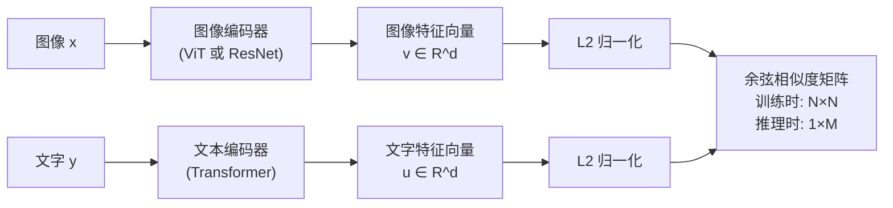

# 双编码器对比学习 VLM 综述：从 CLIP 到 SigLIP 2 的图文对齐路线

> **综述范围**：用双编码器 + 对比学习训练出的视觉-语言表示模型——不涉及生成式对话或图像生成，只聚焦"怎么把图像和文字对齐进同一个语义空间"
> **关键词**：CLIP、ALIGN、OpenCLIP、MetaCLIP、EVA-CLIP、SigLIP、SigLIP 2、InfoNCE、Sigmoid Loss、零样本分类
> **适用读者**：读过 [VLM 架构综述](./S19_VLM视觉语言模型架构综述) 第 2 节，想深入了解"路线①"内部各个具体模型的区别

本文是 [VLM 视觉语言模型架构综述](./S19_VLM视觉语言模型架构综述) 中"路线① 双编码器对比学习"的详细展开。

---

## 相关阅读

在阅读本文前，建议先了解以下前置知识：

- [Vision Transformer：图像怎么变成一串 Token](/前置知识/003g_前置知识_Vision_Transformer图像分块与位置编码) — 本文所有模型的图像编码器基座
- [对比学习与 InfoNCE：CLIP 如何用图文对齐学会理解世界](/前置知识/003h_前置知识_对比学习与InfoNCE_CLIP) — 本文训练目标的完整数学推导，本文不再重复推公式，只讲模型之间的区别
- [知识蒸馏基础](/前置知识/000v_前置知识_知识蒸馏基础) — EVA-CLIP 的 MIM 预训练用到蒸馏思路

关联文章：

- [VLM 视觉语言模型架构综述](./S19_VLM视觉语言模型架构综述) — 四条 VLM 路线的全景总览，本文是其中一条路线的深入版
- [Perceiver Resampler：跨模态 Token 压缩](/前置知识/002o_前置知识_Perceiver_Resampler跨模态Token压缩) — 路线②（Flamingo/BLIP-2）如何复用本文训练好的视觉编码器

---

## 贯穿全文的例子

> **场景**：你负责搭建一个"图库搜索"系统——用户输入一句话（"夕阳下的沙滩"），系统要从 1000 万张无标签图片里，找出最匹配的几张。
>
> 这个任务的关键约束是：**图片没有任何人工标注的类别标签**，只有一批各不相同的候选图片。你需要一个模型，能分别把"一句话"和"一张图片"编码成向量，让语义相近的图文在向量空间里彼此靠近——这样搜索时只需要算一次"文字向量 vs 所有图片向量"的相似度，排序取 top-k，不需要对每张图片重新推理一次。
>
> 本文要讲的所有模型，都是为了训练出这样一对"图像编码器 + 文本编码器"，区别只在于：用什么损失函数训练、喂了多少数据、编码器架构做了什么改进。

---

## 1. 通用架构图：双塔结构

本文覆盖的所有模型，不管训练细节差多少，**架构骨架完全相同**——都是经典的"双塔"（Two-Tower / Dual-Encoder）结构：

**训练阶段**和**推理阶段**用的是同一对编码器，但相似度矩阵的用法完全不同——这是初学者最容易搞混的地方：

| | 训练阶段 | 推理阶段（如本文开头的图库搜索例子） |
|---|---|---|
| 输入 | 一个 batch 里的 $N$ 对图文（配对关系已知） | 1 个查询（文字或图像）+ 候选库里的 $M$ 项（配对关系未知，就是要找的答案） |
| 相似度矩阵形状 | $N \times N$ | $1 \times M$（或反过来） |
| 用途 | 计算 [InfoNCE / Sigmoid loss](/前置知识/003h_前置知识_对比学习与InfoNCE_CLIP)，反向传播更新参数 | 直接取相似度最高的几项作为搜索结果，不需要梯度 |
| 两个编码器是否需要同时在场 | ✅ 必须同时前向传播才能算 loss | ❌ 通常只需要预先算好图像库的全部向量，查询时只跑一次文本编码器 |

这个"训练时算 loss、推理时算相似度排序"的用法区分，本文后续所有模型都遵循同一套骨架——区别都集中在**图 1 里的几个具体环节该怎么设计**。

### 1.1 拆解出的 4 个设计插槽

和 [S17 综述](./S17_连续生成头VLA模型综述) 分析 VLA 架构的方式一致，双编码器对比学习模型的差异可以归纳成 4 个插槽：

| 插槽 | 它决定什么 | 本文要讲的关键分歧 |
|------|-----------|-------------------|
| ① 训练损失函数 | 怎么把"配对/不配对"关系转化为可优化的目标 | InfoNCE（需要全局归一化）vs Sigmoid Loss（逐对独立） |
| ② 训练数据规模与质量 | 编码器最终学到多"广"的视觉/语言概念 | 4 亿对（CLIP）→ 数十亿对（MetaCLIP/ALIGN），数据筛选策略的差异 |
| ③ 图像编码器架构与规模 | 视觉特征的表达能力上限 | ResNet → ViT-B → ViT-g → 180 亿参数（EVA-CLIP-18B） |
| ④ 是否引入额外自监督/多任务信号 | 除了图文对比，还学了什么 | SigLIP 2 引入的自蒸馏、掩码预测、字幕生成等辅助任务 |

下面按这四个插槽逐一展开各个模型。

---

## 2. 插槽①：训练损失函数的分歧——InfoNCE vs Sigmoid Loss

这一部分的完整公式推导已经在前置知识里讲过（[InfoNCE 推导](/前置知识/003h_前置知识_对比学习与InfoNCE_CLIP#3-infonce让配对在一个-batch-里竞争) 和 [Sigmoid Loss 推导](/前置知识/003h_前置知识_对比学习与InfoNCE_CLIP#4-siglip用-sigmoid-替代-softmax)），这里只总结两者对**模型设计**产生的实际影响：

| | InfoNCE（CLIP 系列） | Sigmoid Loss（SigLIP 系列） |
|---|---|---|
| 需要跨设备同步全部负样本吗 | ✅ 需要（softmax 分母是全局归一化项） | ❌ 不需要（每对独立算 loss） |
| batch size 对效果的影响 | 强依赖大 batch（需要足够多负样本） | 对 batch size 更不敏感 |
| 分布式训练工程复杂度 | 高（需要 all-gather 特征向量） | 低（每张卡本地算 loss 即可） |
| 典型训练 batch size | CLIP: 32,768；OpenCLIP: 32k-90k | SigLIP: 从数千到数万皆可，4 张 TPU 芯片就能训出 84.5% zero-shot 的 SigLiT 变体 |

这直接决定了两条子路线的工程取舍：InfoNCE 路线（CLIP、ALIGN、OpenCLIP、MetaCLIP、EVA-CLIP）为了拿到足够多的"负样本"提供对比信号，几乎全部依赖超大 batch + 大规模分布式训练；Sigmoid Loss 路线（SigLIP、SigLIP 2）从设计之初就是为了绕开这个工程负担，用更少的硬件资源也能训出有竞争力的模型。

---

## 3. 插槽②③：逐模型详解

### 3.1 CLIP（OpenAI，2021）—— 开创者

**核心贡献**：第一次证明"用互联网规模的、完全没有人工标注、只是网页上天然存在的图文配对数据"，配合简单的双编码器对比学习，就能训出一个零样本分类能力媲美有监督模型的视觉编码器。

**具体配置**：
- 训练数据：4 亿对图文（WIT，WebImageText，OpenAI 自建，未公开）
- 图像编码器：ResNet 或 ViT（提供了多个规模的版本，从 ViT-B/32 到 ViT-L/14）
- 训练目标：[InfoNCE 双向损失](/前置知识/003h_前置知识_对比学习与InfoNCE_CLIP#34-双向损失图像找文本-文本找图像)
- batch size：32,768

**历史意义**：CLIP 之后，"用网页图文对做对比学习"成为整个领域的标准范式——本文接下来讲的所有模型，都是在这个范式内部做改进，没有一个推翻了 CLIP 的基本思路。

### 3.2 ALIGN（Google，2021）—— 用更大规模的噪声数据验证同一思路

**核心贡献**：和 CLIP 几乎同时发表，ALIGN 走的是"数据规模碾压数据质量"的路线——用 **18 亿**对图文数据（比 CLIP 多 4 倍以上），且完全不做人工过滤或后处理清洗（CLIP 的 WIT 数据集经过了一定程度的筛选）。

**关键发现**：即使数据噪声很大（图片和 alt-text 描述经常不完全准确），只要数据规模足够大，对比学习依然能学到强健的表示——**规模可以弥补噪声**，这个结论后续被 MetaCLIP、ALIGN 系列反复验证。

**架构选择**：ALIGN 用 EfficientNet 做图像编码器（而不是 ViT）+ BERT 做文本编码器，训练目标同样是 InfoNCE。这说明"双塔对比学习"这个框架本身不依赖某个具体的编码器架构——ViT 不是必需品，只是后来因为效果更好、扩展性更强而成为主流选择。

### 3.3 OpenCLIP：开源社区的复现与规模化探索

**核心贡献**：OpenCLIP（LAION 社区）不是一个"新方法"，而是用完全公开的数据集（LAION-400M、LAION-2B）复现并系统性地扩展了 CLIP 的训练配方，产出了一系列公开权重的模型。

**一个重要的科学发现**：OpenCLIP 的论文《Reproducible Scaling Laws for Contrastive Language-Image Learning》指出——**即使模型架构和训练配方完全相同，OpenAI 的私有数据训出的 CLIP 和 OpenCLIP 用 LAION 训出的模型，Scaling 曲线（模型越大/数据越多，效果提升的斜率）也不一样**。这说明**训练数据的分布本身**是决定 Scaling 行为的关键变量，不能只看模型架构和数据量。

### 3.4 MetaCLIP（Meta，2023）—— 揭开 CLIP 数据筛选的黑箱

**核心贡献**：OpenAI 从未公开 CLIP 训练数据的具体筛选算法。MetaCLIP 论文《Demystifying CLIP Data》尝试逆向推导出这个筛选策略，并证明**数据筛选算法本身**（而非更多的原始数据）才是 CLIP 效果好的关键。

**具体做法**：MetaCLIP 设计了一套基于"元数据平衡"的筛选算法——从 CommonCrawl 抓取的海量原始网页图文对中，按照与 WordNet/维基百科概念的匹配度进行筛选和重新平衡，避免数据集被少数高频概念（比如某些电商产品图）主导。

**结果**：用这套筛选算法处理的 4 亿对数据，效果就超过了 CLIP 原始的私有数据（70.8% vs 68.3% zero-shot ImageNet 准确率，ViT-B 规模）；扩展到 10 亿对时进一步提升到 72.4%。MetaCLIP 2（2025）进一步把这套筛选配方扩展到全球多语言网页数据，不再局限于英语内容。

**这一模型证明的道理**：在"双塔对比学习"这个框架里，**数据筛选策略是一个独立于模型架构、损失函数之外的关键变量**——即使不改任何模型代码，只改数据筛选算法，效果差异就可能超过换一个更大的模型。

### 3.5 EVA-CLIP（BAAI，2023-2024）—— 极限规模化 + 更好的初始化

**核心贡献**：EVA-CLIP 系列专注于把双编码器对比学习**推向极限参数规模**（最大版本 EVA-CLIP-18B，180 亿参数图像编码器），同时探索更高效的训练技巧，让大模型不需要成比例增加训练数据就能获得性能提升。

**关键技术：用 MIM 预训练做初始化**——EVA-CLIP 的图像编码器不是从随机初始化开始对比学习训练，而是先用掩码图像建模（Masked Image Modeling, MIM，类似 BERT 的"猜被遮住的部分"思路，但用于图像）在大规模无标注图像上做自监督预训练，把这个预训练好的 ViT 权重当作对比学习阶段的初始化起点。

**效果**：EVA-CLIP-18B 只用 60 亿训练样本（远少于按比例该增加的数据量），就在 27 个图像分类基准上取得 80.7% 的平均零样本准确率，训练数据规模始终维持在 LAION-2B + COYO-700M 约 20 亿对图文对不变——说明**更好的初始化 + 更大的模型**，可以在不增加数据量的情况下持续获得性能提升，这和"参数规模、数据规模必须同步增长"的朴素 Scaling Law 直觉不完全一致。

### 3.6 SigLIP（Google DeepMind，2023）—— 用 Sigmoid Loss 摆脱大 batch 依赖

**核心贡献**：已在插槽①详细对比，这里补充架构层面的具体设计——SigLIP 用标准 [ViT](/前置知识/003g_前置知识_Vision_Transformer图像分块与位置编码) 做图像编码器（常见配置 SigLIP-So400m，"So" 代表 shape-optimized，即针对给定计算预算优化过网络形状），文本编码器同样是标准 Transformer，两者通过 [Sigmoid Loss](/前置知识/003h_前置知识_对比学习与InfoNCE_CLIP#41-infonce的隐藏成本需要看到全局) 联合训练。

**一个重要变体：SigLiT（Sigmoid Loss + Locked-image Tuning）**——冻结一个已经预训练好的图像编码器（"锁定"，Locked），只训练文本编码器去适配已有的视觉表示。这个变体只用 **4 块 TPU 芯片、训练 2 天**，就达到了 84.5% 的零样本 ImageNet 准确率——证明当图像编码器已经足够强（比如复用 EVA-CLIP 或其他大模型的视觉塔），训练对齐用的文本侧其实代价很低。

**在下游 VLM 中的地位**：SigLIP 因为训练效率高、效果稳定，已经成为现代路线③统一自回归 VLM（如 PaliGemma、Qwen-VL 部分变体）**最常用**的视觉编码器来源——具体如何被复用见 [VLM 架构综述第 2 节](./S19_VLM视觉语言模型架构综述#2-路线一双编码器对比学习clip-siglip)。

### 3.7 SigLIP 2（Google DeepMind，2025）—— 从"纯对比"到"多任务联合训练"

**核心贡献**：SigLIP 2 指出一个局限——纯粹的图文对比学习（无论 InfoNCE 还是 Sigmoid Loss）训出的特征，**擅长全局语义匹配（"这是一只狗"），但不擅长稀疏/局部任务**（比如精确定位"狗的耳朵在图像哪个像素区域"，或者做深度估计这类需要逐像素输出的稠密预测任务）。

**解决方案：在 Sigmoid 对比损失基础上叠加三个额外的训练信号**：

| 额外信号 | 做什么 | 解决什么局限 |
|---------|--------|-------------|
| 基于解码器的字幕生成（Captioning） | 加一个小型文本解码器，让模型学习"看图生成完整描述"而不只是"匹配一句话" | 提升 OCR 能力和更精细的语言生成能力 |
| 自蒸馏（Self-Distillation） | 让模型的一个"教师"版本（对同一张图的不同增强视图）指导"学生"版本的特征输出保持一致 | 提升稠密预测（分割、深度估计）任务的特征质量，类似 [知识蒸馏](/前置知识/000v_前置知识_知识蒸馏基础) 的思路但应用在同一模型的不同视图上 |
| 掩码预测（Masked Prediction） | 随机遮住图像的一部分 patch，让模型预测被遮住区域的特征 | 强化局部空间理解能力，弥补纯对比学习"整图打分"忽略局部细节的问题 |

**这一模型证明的道理**：随着双编码器对比学习模型被越来越多下游任务复用（不只是分类/检索，还有分割、深度估计等稠密预测任务），**单一的图文对比目标已经不够**——SigLIP 2 的做法代表了这一子领域的新趋势：在保留高效对比训练主干的基础上，叠加多个互补的自监督/多模态训练信号，一次预训练兼顾更多下游能力。

---

## 4. 横向对比总览

### 4.1 完整对比表

| 模型 | 年份 | 机构 | 损失函数 | 图像编码器规模 | 训练数据规模 | 关键创新 | 是否开源 |
|------|------|------|---------|--------------|------------|---------|---------|
| CLIP | 2021 | OpenAI | InfoNCE | ResNet/ViT-L (~400M) | 4 亿对（私有 WIT） | 开创双塔对比学习范式 | 权重开源，数据未开源 |
| ALIGN | 2021 | Google | InfoNCE | EfficientNet | 18 亿对（未过滤噪声数据） | 证明规模可弥补数据噪声 | ❌ |
| OpenCLIP | 2022 | LAION 社区 | InfoNCE | ViT-B 到 ViT-G | LAION-400M/2B（公开） | 完全公开的复现与 Scaling Law 研究 | ✅ |
| MetaCLIP | 2023 | Meta | InfoNCE | ViT-B 到 ViT-bigG | 4亿-10亿对（CommonCrawl 精筛） | 逆向还原并公开数据筛选算法 | ✅ |
| EVA-CLIP | 2023-24 | BAAI | InfoNCE | 最大 180 亿参数 | ~20 亿对（LAION-2B+COYO） | MIM 预训练初始化，极限参数规模 | ✅ |
| SigLIP | 2023 | Google DeepMind | Sigmoid Loss | ViT (So400m 常见) | 数亿到数十亿对 | 摆脱大 batch 依赖，训练效率高 | ✅ |
| SigLIP 2 | 2025 | Google DeepMind | Sigmoid Loss + 多任务 | ViT | 多语言扩展数据 | 叠加字幕生成/自蒸馏/掩码预测 | ✅ |

### 4.2 该选哪个作为下游 VLM 的视觉编码器？

| 场景 | 推荐 | 原因 |
|------|------|------|
| 通用图文对话 VLM（如构建自己的 LLaVA 风格模型） | SigLIP / SigLIP 2 | 训练效率高、下游 VLM 生态验证最多（PaliGemma 等） |
| 需要稠密预测（分割、深度、定位） | SigLIP 2 | 专门引入了掩码预测和自蒸馏信号 |
| 追求极限图像分类/检索精度、算力充足 | EVA-CLIP 大规模版本 | 参数规模最大，基准分数最高 |
| 需要完全透明、可复现的训练数据管线 | OpenCLIP 或 MetaCLIP | 数据和筛选算法完全公开 |
| 多语言场景 | SigLIP 2 / MetaCLIP 2 | 都专门扩展了多语言训练数据 |

---

## 5. 这条路线的根本局限

回到本文开头的图库搜索例子——双编码器对比学习模型能高效地做"检索、排序、零样本分类"，但**不能**回答"图里的狗和猫在打架吗？"这种需要综合推理的开放式问题，也不能生成新的图像。原因在于架构本身：

- **图像和文字全程分离编码，只在最后一步用点积交互**——这个交互方式的信息带宽太窄（只有一个标量相似度分数），不足以支撑"理解并回答复杂问题"这样需要精细跨模态推理的任务
- **训练目标是判别式的（配对/不配对二选一），不是生成式的**——模型从未学过"根据图像生成一段连贯文字"，自然也不具备对话能力

这正是为什么本文覆盖的所有模型，最终的归宿几乎都是**被当作"视觉编码器组件"，接入路线②③④更复杂的下游 VLM 架构**——具体如何接入、接入之后能解锁什么新能力，见 [VLM 视觉语言模型架构综述](./S19_VLM视觉语言模型架构综述) 的路线②③④部分。

---

## 6. 未来方向

1. **训练信号的持续多样化**：SigLIP 2 已经证明"纯对比 + 辅助任务"的组合优于纯对比，未来可能出现更多互补的自监督信号被纳入同一个预训练配方
2. **多语言与文化多样性**：MetaCLIP 2、SigLIP 2 都开始扩展多语言数据，如何避免"高资源语言主导训练信号"仍是开放问题
3. **和生成式路线的边界继续模糊**：Janus（见 [VLM 架构综述第 5 节](./S19_VLM视觉语言模型架构综述#5-路线四统一理解与生成chameleon-emu3-janus)）已经在探索"理解用对比式编码器、生成用 VQ 编码器"的混合方案，双编码器对比学习可能继续作为"理解分支"存在于更大的统一系统里
4. **效率与规模的进一步优化**：Sigmoid Loss 已经证明训练效率可以大幅提升，未来在保持效果的前提下进一步降低训练算力门槛，是让更多团队能自行训练定制化视觉编码器的关键

---

## 延伸阅读

- [VLM 视觉语言模型架构综述](./S19_VLM视觉语言模型架构综述) — 四条 VLM 路线全景，本文的上级综述
- [Vision Transformer：图像怎么变成一串 Token](/前置知识/003g_前置知识_Vision_Transformer图像分块与位置编码)
- [对比学习与 InfoNCE：CLIP 如何用图文对齐学会理解世界](/前置知识/003h_前置知识_对比学习与InfoNCE_CLIP)
- [知识蒸馏基础](/前置知识/000v_前置知识_知识蒸馏基础)
- [自回归 Token 化 VLA 综述](./S16_自回归Token化VLA模型综述) — 下游应用之一，OpenVLA 的视觉编码器部分复用了 CLIP 系
- [VLM + 连续生成头 VLA 综述](./S17_连续生成头VLA模型综述) — π₀ 复用 PaliGemma（内含 SigLIP）作为骨干
