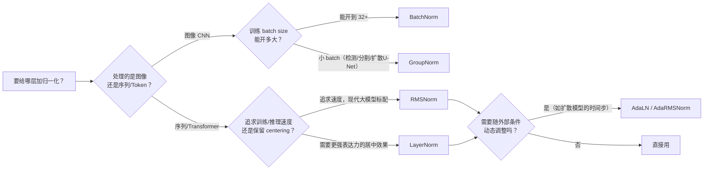

# 深度学习归一化方法全景综述：从 BatchNorm 到 RMSNorm，再到"不要归一化"

> **综述范围**：深度学习中所有主流归一化（Normalization）方法——BatchNorm、LayerNorm、InstanceNorm、GroupNorm、RMSNorm、条件化归一化（AdaLN）、QK-Norm，以及 2025 年提出的"去归一化"方法 DyT。目标是让读者看完本文后，遇到任何一种归一化，都能立刻说出它"在哪些数值之间算均值方差"、"为什么这么设计"、"什么场景该用它"。
> **关键词**：Batch Normalization、Layer Normalization、Instance Normalization、Group Normalization、RMSNorm、AdaLN、QK-Norm、Dynamic Tanh、Internal Covariate Shift
> **适用读者**：有基本数学素养（会算均值、方差）的本科生，看到一堆"XxxNorm"就分不清楚的入门者

---

## 相关阅读

在开始之前，建议先了解（或随时回来查阅）以下内容：

- [方差与标准差：衡量随机性的大小](/前置知识/002c2_前置知识_方差与标准差) — 本文所有归一化方法的数学地基，如果对"方差""标准差"还不熟悉，请先读这篇
- [数值精度 FP32/FP16/BF16/TF32](/前置知识/003d_前置知识_数值精度FP32_FP16_BF16_TF32) — 归一化的数值稳定性和混合精度训练密切相关
- [Cross-Attention 与交替注意力机制](/前置知识/001e_前置知识_Cross_Attention与交替注意力机制) — 理解 Transformer 结构，方便理解 LayerNorm 为什么和 Attention 天生一对

关联文章（本文会在合适的地方链接过去，不重复讲）：

- [AdaLayerNorm：条件化归一化](/前置知识/001f_前置知识_AdaLayerNorm条件化归一化) — 本文第九节的详细展开，讲清楚"让归一化的 scale/shift 随时间步等条件动态变化"这件事
- [扩散模型在决策与控制中的应用综述](./S05_扩散模型在决策与控制中的应用综述) — 第四节提到 GroupNorm 在 Diffusion Policy U-Net 中的实际使用位置
- [SAC-Flow：用 SAC 直接训练 Flow 策略](./079_SAC_Flow_用SAC直接训练Flow策略) — 提到 Pre-Norm 残差结构为什么对深层网络的梯度更友好

---

## 贯穿全文的例子：一个动作解码器的中间特征图

为了让"归一化到底在哪些数字之间算均值方差"这件事彻底具体化，本文全程使用同一个数值例子。

> **场景**：假设我们在训练一个机器人动作解码器（想象成 Diffusion Policy 或者某个 VLA 模型的动作头），网络中间某一层的输出是一个形状为 $[N, C, L]$ 的特征图：
> - $N=2$：这个 batch 里有 2 条轨迹样本（样本 0、样本 1）
> - $C=4$：每条样本的特征被组织成 4 个"通道"（可以想象成网络学到的 4 个不同的特征子空间，不一定对应到具体物理量）
> - $L=2$：每个通道沿着"时间/动作块步数"方向展开成 2 个数值
>
> 具体数值如下（这组数字会在后面反复被拿出来算不同的归一化）：
>
> | | $c=0$ | $c=1$ | $c=2$ | $c=3$ |
> |---|---|---|---|---|
> | 样本 $n=0$ | $[1, 3]$ | $[5, 7]$ | $[2, 4]$ | $[6, 0]$ |
> | 样本 $n=1$ | $[9, 11]$ | $[4, 2]$ | $[8, 6]$ | $[0, 2]$ |
>
> 每个格子里是 $L=2$ 个数（比如样本 0、通道 0 的两个时刻的值分别是 1 和 3）。这个形状和 [S05 综述](./S05_扩散模型在决策与控制中的应用综述) 里提到的 Diffusion Policy 的 U-Net 中间特征图完全对应——那里正是用 GroupNorm 处理这种 $[N, C, L]$ 形状的张量。

后面每引入一种新的归一化方法，我们都会回到这张表格，看它具体在哪些格子之间"抱团"去算均值和方差。

---

## 一、为什么需要归一化：一个关于"内部协变量偏移"的历史故事

### 1.1 深层网络训练的痛点

训练一个深层神经网络时，每一层的参数都在随着梯度下降不断更新。这带来一个连锁反应：**第 $k$ 层的输入分布，取决于第 $k-1$ 层的参数**——而第 $k-1$ 层的参数每一步都在变。也就是说，第 $k$ 层每一步看到的"输入分布"都在漂移。

2015 年 BatchNorm 论文提出了一个术语来描述这个现象：**内部协变量偏移（Internal Covariate Shift, ICS）**——网络内部某一层的输入分布，因为前面层参数的更新而不断变化的现象。论文的原始论证是：如果每一层都要不断"适应"一个漂移的输入分布，训练就会变慢，且需要更小心地调学习率。

**这个解释后来受到了挑战**（2018 年的一篇论文重新做了实验，发现 BatchNorm 起作用的真正原因，更多是让损失函数（loss landscape）变得更平滑、梯度更可预测，而不是真的解决了"协变量偏移"）。但不管哪种解释，**实证结果毫无争议**：给网络加上合适的归一化层，训练明显变快、变稳，能用更大的学习率，对初始化的敏感度也降低。

### 1.2 归一化解决问题的方式：把数值"拉回"一个可控范围

不管是哪一种具体方法，归一化解决问题的思路都完全一致：**把某一层的输出，强制拉到均值 0、方差 1 附近，再用可学习的参数重新缩放和偏移**。这样无论前面的网络怎么变，这一层送给下一层的数值范围始终是可控的、可预测的。

区别在哪里？**唯一的区别是："均值和方差是在哪些数字上面算出来的"**。这正是本文接下来要讲的核心——同样的公式骨架，不同的"分组方式"，就得到了 BatchNorm、LayerNorm、InstanceNorm、GroupNorm 等一系列看似不同、实则同源的方法。

---

## 二、统一框架：所有归一化方法的公共骨架

### 2.1 公共公式

不管是 BatchNorm、LayerNorm 还是别的什么 Norm，都是同一个公式：

$$
y = \gamma \cdot \frac{x - \mu}{\sqrt{\sigma^2 + \epsilon}} + \beta
$$

**这个公式在做什么**：把输入 $x$ 减去某个"参照组"的均值、除以这个参照组的标准差，把数值拉到 0 附近、宽度差不多是 1；再用可学习的 $\gamma, \beta$ 决定"拉回之后到底要放多大、往哪偏"。

::: details 📐 公式详解（点击展开）

| 子表达式 | 它是谁 | 它在干嘛 |
|---------|--------|---------|
| $x$ | **待归一化的原始数值** | 网络某一层的一个激活值（一个具体数字） |
| $\mu$ | **参照组的均值** | 和 $x$ "同组"的一批数值的平均——具体是哪些数值，是不同归一化方法的**唯一区别** |
| $\sigma^2$ | **参照组的方差** | 同一批数值的波动程度，衡量"离 $\mu$ 有多远" |
| $\epsilon$ | **数值安全垫** | 一个很小的正数（通常 $10^{-5}$），防止 $\sigma^2=0$ 时除零报错 |
| $\gamma, \beta$ | **可学习的缩放/偏移参数** | 归一化把数值"拉平"之后，网络自己决定要不要、以及怎么"拉回来"——如果 $\gamma=\sigma, \beta=\mu$，相当于什么都没变 |

**用人话读**："找一批和当前数值'同组'的数，算出这批数的平均值和波动幅度，把当前数值按这个尺度拉回到 0 附近、宽度为 1，再让网络自己学一个新的缩放和偏移。"

**为什么要保留 $\gamma, \beta$（而不是直接输出标准化后的结果）**：如果没有 $\gamma, \beta$，所有归一化后的输出都被死死限制在均值 0、方差 1 的范围内，网络会**丧失表达能力**——比如某一层如果需要输出一个偏向正值、幅度很大的信号（这在某些场景下是必要的），没有 $\gamma, \beta$ 就做不到。$\gamma, \beta$ 让网络"先标准化、再按需要重新拉伸"，兼顾了训练稳定性和表达能力。
:::

### 2.2 唯一的自由度：怎么分组

$x$ 在实际网络里通常不是一个孤立的数字，而是一个形状为 $[N, C, L]$（或者图像里的 $[N, C, H, W]$）的张量——$N$ 是 batch 内第几个样本，$C$ 是第几个通道，$L$（或 $H,W$）是空间/时间位置。**归一化方法之间唯一的区别，就是"$\mu, \sigma^2$ 是在张量的哪些维度上求平均"。**

回到开篇的例子（$N=2, C=4, L=2$），下图展示了四种主流方法各自把哪些格子"归到一组"去算统计量——同一种颜色的格子，共享同一组均值和方差：

> 图中每个小方块代表一个 (样本 $n$，通道 $c$) 位置（内部还有 $L=2$ 个数值，颜色相同表示这些位置的所有数值被合并到同一组算统计量）。**BatchNorm** 按通道分组、跨样本合并；**LayerNorm** 按样本分组、跨通道合并；**InstanceNorm** 每个 (样本, 通道) 单独一组；**GroupNorm** 是 LayerNorm 和 InstanceNorm 的折中——每个样本内部，通道被分成几个小组。

把这张图记在脑子里，后面每一节讲具体方法时，都是在回答同一个问题："这种方法选的是图里哪一种分组方式？为什么选这种？"

---

## 三、BatchNorm：按通道分组，跨样本、跨空间位置合并

### 3.1 核心思路

**Batch Normalization（批归一化，BN）**，Ioffe & Szegedy 2015 年提出，是历史上第一个被广泛采用的归一化方法。它的分组方式是：**固定一个通道 $c$，把这个 batch 里所有样本、所有空间/时间位置上该通道的数值，全部合并成一组去算均值方差**。

$$
\mu_c = \frac{1}{N \cdot L}\sum_{n=1}^{N}\sum_{l=1}^{L} x_{n,c,l}, \qquad \sigma_c^2 = \frac{1}{N \cdot L}\sum_{n=1}^{N}\sum_{l=1}^{L} (x_{n,c,l} - \mu_c)^2
$$

**这个公式在做什么**：对每个通道 $c$ **单独**算一组均值方差——这组统计量是把整个 batch 里所有样本、这个通道下所有位置的数值全部混在一起算出来的。不同通道各算各的，互不影响。

::: details 📐 公式详解（点击展开）

| 子表达式 | 它是谁 | 它在干嘛 |
|---------|--------|---------|
| $x_{n,c,l}$ | **一个具体的激活值** | 第 $n$ 个样本、第 $c$ 个通道、第 $l$ 个位置上的数值 |
| $\sum_{n=1}^{N}\sum_{l=1}^{L}$ | **跨样本、跨位置的双重求和** | 把"通道 $c$"这个标签下的所有数值（不管是哪个样本、哪个位置）全部加起来 |
| $\frac{1}{N \cdot L}$ | **总数归一化** | 一共有 $N \times L$ 个数被平均，除以这个数得到均值 |
| $\mu_c, \sigma_c^2$ | **通道 $c$ 专属的统计量** | 每个通道有自己的一组均值方差，通道之间互不共享 |

**用人话读**："给每个通道单独算一组均值和方差——这组统计量是把这个 batch 里所有样本、所有位置上、这个通道的数值全部混在一起算出来的。"

**为什么按通道分组**：BatchNorm 最早是为卷积网络设计的。卷积网络的每个通道对应一个学到的"特征检测器"（比如某个通道专门检测边缘、另一个检测纹理）——同一通道在不同样本、不同空间位置上检测的是"同一类特征"，数值分布天然相似，放在一起统计是合理的。
:::

### 3.2 用开篇例子算一遍

回到开篇的例子（$N=2, C=4, L=2$），BatchNorm 对每个通道 $c$ 单独统计（把 $n=0,1$ 和 $l=0,1$ 全部混在一起，每组 4 个数）：

| 通道 | 4 个数值 | $\mu_c$ | $\sigma_c^2$ |
|------|---------|---------|--------------|
| $c=0$ | $1, 3, 9, 11$ | $6.0$ | $17.0$ |
| $c=1$ | $5, 7, 4, 2$ | $4.5$ | $3.25$ |
| $c=2$ | $2, 4, 8, 6$ | $5.0$ | $5.0$ |
| $c=3$ | $6, 0, 0, 2$ | $2.0$ | $6.0$ |

比如样本 0、通道 0、位置 0 的原始值是 $x=1$，归一化后（暂不考虑 $\gamma,\beta$）：

$$
\hat{x} = \frac{1 - 6.0}{\sqrt{17.0 + 10^{-5}}} \approx \frac{-5.0}{4.123} \approx -1.213
$$

**这个公式在做什么**：把原始值代入 3.1 节的通用公式，验证一遍具体数字怎么算出来。

::: details 📐 公式详解（点击展开）

| 子表达式 | 它是谁 | 它在干嘛 |
|---------|--------|---------|
| $1$ | 原始值 $x_{0,0,0}$ | 样本 0、通道 0、位置 0 的原始激活值 |
| $6.0$ | $\mu_0$ | 通道 0 的均值（表格算出） |
| $\sqrt{17.0+10^{-5}}$ | $\sqrt{\sigma_0^2+\epsilon}$ | 通道 0 的标准差（加安全垫） |

**用人话读**："这个值比通道 0 的平均水平低了 5，除以这个通道的标准差 4.123，相当于低了 1.213 个标准差。"

**为什么结果是负的**：原始值 1 比通道 0 的均值 6.0 小，所以归一化后是负数。
:::

注意关键一点：**这个值的归一化结果，依赖 batch 里另一个样本（样本 1）的数值**——如果样本 1 换成别的数，$\mu_0, \sigma_0^2$ 会变，样本 0 的归一化结果也会跟着变。这正是 BatchNorm 后面会出问题的根源。

### 3.3 训练和推理行为不一致：running statistics

这里有一个容易被忽略但极其重要的细节：BatchNorm 在**训练**和**推理**时的行为是不同的。

- **训练时**：$\mu_c, \sigma_c^2$ 就是当前这个 mini-batch 算出来的统计量（如上面的例子）。同时，BatchNorm 会用指数滑动平均（EMA）维护一份"全局"统计量 $\mu_c^{\text{running}}, \sigma_c^{2,\text{running}}$，每个 batch 结束后更新一次。
- **推理时**：不再用当前输入算统计量（推理时可能只有 1 个样本，$N=1$ 根本没法算出有意义的方差），而是直接用训练过程中累积下来的 $\mu_c^{\text{running}}, \sigma_c^{2,\text{running}}$。

这意味着 BatchNorm 层内部实际存有 **4 组参数**：可学习的 $\gamma_c, \beta_c$（训练学出来的），以及不可学习但会被更新的 $\mu_c^{\text{running}}, \sigma_c^{2,\text{running}}$（推理时用）。这也解释了为什么 PyTorch 的 `model.eval()` / `model.train()` 切换对 BatchNorm 层的行为影响这么大——如果忘记切换到 `eval()` 模式，推理时会错误地使用当前输入重新计算统计量，而不是用训练好的 running 统计量。

### 3.4 BatchNorm 的致命缺陷：小 batch 会崩

BatchNorm 的统计量是在整个 batch 内算出来的——**这意味着 batch size 越小，这组统计量的估计误差就越大**。

Group Normalization 论文（Wu & He, 2018）用 ResNet-50 在 ImageNet 上做了一组实验，固定其余设置只改变每张 GPU 上的 batch size，测出的验证集错误率如下：

> 图中虚线是 GroupNorm（本文第五节详细讲）的误差，几乎不随 batch size 变化。实线是 BatchNorm 的误差：batch size 从 32 降到 2，错误率从 23.6% 飙升到 34.7%——**小 batch 下 BatchNorm 的统计量已经不能反映真实的数据分布了**，因为均值方差只是从极少几个样本里估出来的，噪声很大。

这个缺陷在什么场景下特别致命？**当单张 GPU 的显存放不下大 batch 时**——比如高分辨率图像检测、视频处理，或者显存有限的场景。这类任务的 batch size 经常被压到 2、4 甚至 1，BatchNorm 在这种场景下几乎不可用。这正是 GroupNorm（第五节）和 InstanceNorm（第四节）被提出的直接动机。

### 3.5 为什么 Transformer（NLP/序列任务）几乎不用 BatchNorm

除了小 batch 问题，BatchNorm 还有一个更根本的缺陷：**它假设"跨样本、同通道"的数值分布是相似的**——这个假设在图像上大体成立（不同图片的同一个卷积通道，检测的是同一类视觉特征），但在**序列数据**（文本、语音、机器人动作序列）上经常不成立：

- 序列长度不同：一个 batch 里，句子/动作序列的真实长度可能不同，需要 padding，BatchNorm 会把 padding 出来的无意义位置也混进统计量里
- 序列内部位置的语义差异大：第 1 个 token 和第 50 个 token，即使在同一个"通道"（特征维度）上，数值分布可能天差地别——按通道统计并不合理

这正是下一节 LayerNorm 要解决的问题——**换一种分组方式，让归一化不依赖 batch，也不假设序列内位置同质**。

---

## 四、LayerNorm：按样本分组，跨通道合并——Transformer 的标配

### 4.1 核心思路

**Layer Normalization（层归一化，LN）**，Ba, Kiros & Hinton 2016 年提出，分组方式和 BatchNorm 正好"转了 90 度"：**固定一个样本 $n$，把这个样本自己所有通道（或者说所有特征维度）的数值合并成一组去算均值方差，和 batch 里其他样本完全无关**。

$$
\mu_n = \frac{1}{C \cdot L}\sum_{c=1}^{C}\sum_{l=1}^{L} x_{n,c,l}, \qquad \sigma_n^2 = \frac{1}{C \cdot L}\sum_{c=1}^{C}\sum_{l=1}^{L} (x_{n,c,l} - \mu_n)^2
$$

**这个公式在做什么**：对每个样本 $n$ **单独**算一组统计量——这组统计量只用这一个样本自己的所有特征值，完全不看 batch 里别的样本。

::: details 📐 公式详解（点击展开）

| 子表达式 | 它是谁 | 它在干嘛 |
|---------|--------|---------|
| $x_{n,c,l}$ | **一个具体的激活值** | 和 3.1 节完全一样的原始数值 |
| $\sum_{c=1}^{C}\sum_{l=1}^{L}$ | **跨通道、跨位置的双重求和** | 把"样本 $n$"这个标签下的所有特征值全部加起来，不管是第几个通道 |
| $\mu_n, \sigma_n^2$ | **样本 $n$ 专属的统计量** | 每个样本有自己的一组均值方差，样本之间互不共享 |

**用人话读**："每个样本自己算一组均值和方差——把这个样本身上所有的特征值（不管哪个通道）混在一起统计，和 batch 里别的样本完全没关系。"

**为什么按样本分组**：Transformer 处理的是"一个 token 的特征向量"——比如一句话里第 5 个词的 embedding，是一个 $D$ 维向量，这 $D$ 个维度共同描述"这个词在当前语境下的语义"。这 $D$ 个数值天然属于"同一个观测对象"，放在一起归一化是合理的；而不同 token（不同样本/位置）之间的语义可以完全不同，不应该被强行拉到同一个统计量下。
:::

### 4.2 用开篇例子算一遍

同样的数据（$N=2, C=4, L=2$），LayerNorm 对每个样本 $n$ 单独统计（把 $c=0,1,2,3$ 和 $l=0,1$ 全部混在一起，每组 8 个数）：

| 样本 | 8 个数值 | $\mu_n$ | $\sigma_n^2$ |
|------|---------|---------|--------------|
| $n=0$ | $1,3,5,7,2,4,6,0$ | $3.5$ | $5.25$ |
| $n=1$ | $9,11,4,2,8,6,0,2$ | $5.25$ | $13.1875$ |

样本 0、通道 0、位置 0 的原始值仍是 $x=1$，归一化后：

$$
\hat{x} = \frac{1 - 3.5}{\sqrt{5.25 + 10^{-5}}} \approx \frac{-2.5}{2.291} \approx -1.091
$$

**这个公式在做什么**：同一个原始值 $x=1$，换成 LayerNorm 的分组（按样本而不是按通道）重新算一遍，对比结果有什么不同。

::: details 📐 公式详解（点击展开）

| 子表达式 | 它是谁 | 它在干嘛 |
|---------|--------|---------|
| $1$ | 原始值 $x_{0,0,0}$ | 和 3.2 节完全同一个数 |
| $3.5$ | $\mu_0$ | 样本 0 的均值（这次是跨通道算出的，不是跨样本） |
| $\sqrt{5.25+10^{-5}}$ | $\sqrt{\sigma_0^2+\epsilon}$ | 样本 0 的标准差 |

**用人话读**："同一个数字 1，比它所在样本 0 的整体均值 3.5 低了 2.5，除以样本 0 自己的标准差 2.291，相当于低了 1.091 个标准差。"

**为什么和 BatchNorm 的结果不同**：分母分子用的"参照组"完全不同——BatchNorm 拿的是"跨样本、同通道"的 4 个数，LayerNorm 拿的是"同样本、跨通道"的 8 个数，两组统计量本身就不一样。
:::

对比 3.2 节 BatchNorm 算出的 $-1.213$——**同一个数值 $x=1$，因为分组方式不同，归一化后的结果不同**。这不是谁对谁错，而是两种方法回答的是不同的问题："这个数比它所在通道的整体水平高还是低"（BatchNorm），还是"这个数比它所在样本自身的整体水平高还是低"（LayerNorm）。

### 4.3 LayerNorm 的关键优势：不依赖 batch，也不需要 running statistics

因为统计量只从"当前这一个样本自己"算出来，LayerNorm 天然带来两个好处：

1. **训练和推理行为完全一致**：不需要像 BatchNorm 那样维护 running mean/var，`model.eval()` 对 LayerNorm 层不产生任何统计量上的差异（虽然 dropout 等其他层还是会变）
2. **不受 batch size 影响**：哪怕 batch size = 1（比如推理时逐个样本处理），LayerNorm 依然能正常工作——因为它压根不看 batch 维度

这正是为什么几乎所有现代 Transformer（BERT、GPT、LLaMA 的早期版本、ViT）都用 LayerNorm 而不是 BatchNorm：Transformer 处理的序列长度经常变化、推理时 batch size 经常是 1（比如聊天场景逐句处理），LayerNorm 天然适配这种场景。

### 4.4 Pre-Norm vs Post-Norm：LayerNorm 放在残差连接的哪一侧

Transformer 的每个子层（Attention 或 FFN）外面都包着一个残差连接。LayerNorm 具体加在残差连接的什么位置，产生了两种变体：

$$
\text{Post-Norm}: \quad y = \text{LN}(x + f(x))
\qquad\qquad
\text{Pre-Norm}: \quad y = x + f(\text{LN}(x))
$$

**这个公式在做什么**：Post-Norm 是原始 Transformer（2017 年）的做法——先算完残差加法，再归一化。Pre-Norm 是后来（GPT-2 起）几乎所有大模型采用的做法——先归一化，再送进子层，最后跟原始的 $x$（没被归一化过的）相加。

::: details 📐 公式详解（点击展开）

| 子表达式 | 它是谁 | 它在干嘛 |
|---------|--------|---------|
| $x$ | **这一层的输入** | 从上一层传下来的隐藏状态 |
| $f(\cdot)$ | **子层的计算**（Attention 或 FFN） | 对输入做特征变换 |
| $x + f(x)$ | **残差连接** | 让梯度有一条"直通车"能跳过 $f$ 直接传到更早的层 |
| $\text{LN}(\cdot)$ | **归一化操作** | 把数值范围拉回可控区间 |

**用人话读**：Post-Norm 是"先算完整个子层再统一归一化"，Pre-Norm 是"先归一化再进子层，但归一化前的原始值直接走高速公路加回来"。

**为什么 Pre-Norm 在深层网络里更稳**：Post-Norm 的残差路径上也套了一层 LayerNorm——这意味着**梯度回传时，即使是"跳过 $f$ 直接走残差"的那条路径，也要穿过 LayerNorm 的反向传播**，深层堆叠后梯度容易衰减。Pre-Norm 的残差路径是"干净"的 $x$，没有被任何归一化层"拦截"，梯度可以几乎无损地从最后一层直接传回第一层——这也是 [SAC-Flow 精读](./079_SAC_Flow_用SAC直接训练Flow策略) 中提到"Pre-norm residual blocks 天然梯度友好"的具体原因。代价是 Pre-Norm 在训练早期，深层网络的输出方差会随层数增长而变大，需要额外的初始化技巧配合（如缩放初始化）。
:::

---

## 五、InstanceNorm 与 GroupNorm：两个针对图像任务的折中方案

### 5.1 InstanceNorm：每个 (样本, 通道) 各自为战

**Instance Normalization（实例归一化，IN）** 最初是为图像风格迁移任务设计的（2016 年），分组方式比 LayerNorm 更极端：**固定样本 $n$ 和通道 $c$，只用这一个 (n,c) 组合下、跨空间位置的数值去算统计量**——对照本文第二张分组图，这是最"细"的分组，几乎每个格子都是自己一组。

$$
\mu_{n,c} = \frac{1}{L}\sum_{l=1}^{L} x_{n,c,l}, \qquad \sigma_{n,c}^2 = \frac{1}{L}\sum_{l=1}^{L}(x_{n,c,l}-\mu_{n,c})^2
$$

**这个公式在做什么**：既不跨样本（像 BatchNorm），也不跨通道（像 LayerNorm），只在"同一个样本的同一个通道内部、不同空间位置"之间求统计量。

::: details 📐 公式详解（点击展开）

| 子表达式 | 它是谁 | 它在干嘛 |
|---------|--------|---------|
| $\mu_{n,c}, \sigma_{n,c}^2$ | **每个 (样本, 通道) 对专属的统计量** | 有 $N \times C$ 组统计量，是本节四种方法里分组最细的 |
| $\sum_{l=1}^{L}$ | **只在空间/时间维度求和** | 不涉及别的样本、别的通道 |

**用人话读**："每张图的每个通道，各自拿自己内部所有像素点算一组均值方差，和其他通道、其他图片都无关。"

**为什么风格迁移需要这么细的分组**：风格迁移的核心诉求是"去除每张图片自身的整体亮度/对比度差异，只保留内容的相对结构"。InstanceNorm 恰好做的就是这件事——把每张图每个通道自己的"整体风格统计量"（均值代表整体亮度，方差代表对比度）**抹掉**，这样网络更容易学到跟风格无关的内容特征。这个设计目标和 BatchNorm/LayerNorm（想稳定训练）完全不同，InstanceNorm 本质上是"故意丢掉某种统计信息"而不是"重新校准数值范围"。
:::

用开篇例子验证一下，比如 $(n=0, c=3)$ 这一组只有 $L=2$ 个数 $[6, 0]$：均值 $\mu=3.0$，方差 $\sigma^2=9.0$（比其他组的方差都大，因为只有两个数、差异是 6，波动被放大了）。

**InstanceNorm 的局限**：分组太细，每组的样本数太少（这里只有 $L=2$ 个数），统计量的估计噪声很大，直接拿来做"稳定训练"这个原始目标（BatchNorm 想解决的问题）效果不好——这也是为什么 InstanceNorm 几乎只用在风格迁移这一类特定任务，没有像 LayerNorm 一样被广泛采用。

### 5.2 GroupNorm：LayerNorm 和 InstanceNorm 之间的旋钮

**Group Normalization（群组归一化，GN）**，Wu & He 2018 年提出，是本文目前讲过的所有方法的一个"泛化"：把 $C$ 个通道分成 $G$ 组，每组内 $C/G$ 个通道，**在同一个样本内、同一组内的通道之间**合并统计量。

$$
\mu_{n,g} = \frac{1}{(C/G)\cdot L}\sum_{c \in g}\sum_{l=1}^{L} x_{n,c,l}, \qquad \sigma_{n,g}^2 = \frac{1}{(C/G)\cdot L}\sum_{c \in g}\sum_{l=1}^{L}(x_{n,c,l}-\mu_{n,g})^2
$$

**这个公式在做什么**：和 LayerNorm（4.1 节）几乎一样，唯一的区别是"跨通道求和"这一项不再是**所有**通道，而是**当前分组 $g$ 内**的那几个通道。

::: details 📐 公式详解（点击展开）

| 子表达式 | 它是谁 | 它在干嘛 |
|---------|--------|---------|
| $g$ | **通道分组编号** | $C$ 个通道被平均分成 $G$ 组，每组 $C/G$ 个通道 |
| $c \in g$ | **属于第 $g$ 组的通道下标集合** | 求和只在这个子集内进行，不是全部 $C$ 个通道 |
| $\mu_{n,g}, \sigma_{n,g}^2$ | **样本 $n$、分组 $g$ 专属的统计量** | 每个样本有 $G$ 组统计量（$G=1$ 时退化成 LayerNorm，$G=C$ 时退化成 InstanceNorm） |

**用人话读**："把每个样本的通道分成 $G$ 个小组，同一小组内部（跨通道、跨空间位置）合并算一组均值方差——组数越多，越像 InstanceNorm；组数为 1，就是 LayerNorm。"

**为什么要在 LayerNorm 和 InstanceNorm 之间找一个中间点**：图像卷积网络里，相邻的通道往往是"相关"的特征检测器组（比如一组通道共同检测某类边缘方向），把它们分成小组统计，既避免了 LayerNorm 把语义完全不同的通道强行混在一起（比如检测颜色的通道和检测纹理的通道），又避免了 InstanceNorm 每组只有极少数值导致统计量太不稳定。
:::

回到 5.1 节的数值：GroupNorm 取 $G=2$（把 4 个通道分成 $\{c=0,1\}$ 和 $\{c=2,3\}$ 两组），用开篇例子算样本 0：

| 分组 | 涉及的数值（$c\in g, l=0,1$） | $\mu_{0,g}$ | $\sigma_{0,g}^2$ |
|------|---------------------|------|------|
| $g=0$（通道 0,1） | $1,3,5,7$ | $4.0$ | $5.0$ |
| $g=1$（通道 2,3） | $2,4,6,0$ | $3.0$ | $5.0$ |

对比同样数据下 InstanceNorm 每组只有 2 个数、LayerNorm 一组混进全部 8 个数，GroupNorm 每组 4 个数——统计量的稳定性介于两者之间，这正是它作为"旋钮"的直观体现。

**GroupNorm 最重要的性质**：因为统计量的计算完全在样本内部（不跨 batch），它和 LayerNorm 一样**不受 batch size 影响**——这正是 GroupNorm 论文（Wu & He, 2018）里那张 batch size 曲线图（第三节图）里 GroupNorm 曲线几乎是一条水平线的原因：GN 的公式压根没有出现"跨样本求和"这一项，batch size 从 32 缩到 2，对 GroupNorm 的统计量计算过程没有任何影响。

**实际应用**：GroupNorm 是 [Diffusion Policy 的 U-Net 去噪网络](./S05_扩散模型在决策与控制中的应用综述) 中的标准配置——机器人策略学习经常受限于显存（动作块长、观测多相机），batch size 往往不能开很大，GroupNorm 天然规避了 BatchNorm 的小 batch 问题。

---

## 六、RMSNorm：LayerNorm 的简化版，现代大模型的事实标准

### 6.1 核心思路：干脆不减均值

**RMSNorm（Root Mean Square Layer Normalization，均方根层归一化）**，Zhang & Sennrich 2019 年提出，从 LayerNorm 出发做了一个大胆简化：**只做缩放（除以均方根），完全不做"减均值"这一步**。

$$
\text{RMSNorm}(x) = \frac{x}{\text{RMS}(x)}\cdot\gamma, \qquad \text{RMS}(x)=\sqrt{\frac{1}{d}\sum_{i=1}^{d}x_i^2 + \epsilon}
$$

**这个公式在做什么**：不算均值、不做"去中心化"，只算这个向量各分量平方的均值再开根号（这就是"均方根"），用它当分母去缩放，然后乘一个可学习的 $\gamma$。

::: details 📐 公式详解（点击展开）

| 子表达式 | 它是谁 | 它在干嘛 |
|---------|--------|---------|
| $x \in \mathbb{R}^d$ | **待归一化的特征向量** | 比如一个 token 的 $d$ 维隐藏状态 |
| $\text{RMS}(x) = \sqrt{\frac{1}{d}\sum x_i^2 + \epsilon}$ | **均方根** | 衡量"这个向量整体的数值大小"，不关心正负偏移，只关心幅度 |
| $\frac{x}{\text{RMS}(x)}$ | **按幅度缩放** | 把向量的"长度"（在均方根意义下）统一拉到 1 附近，方向不变 |
| $\gamma \in \mathbb{R}^d$ | **可学习的逐维度缩放** | 缩放完之后，每个维度自己决定要不要重新放大/缩小 |

**用人话读**："不管这个向量的均值是多少（不去中心化），只把它的整体幅度（均方根）统一缩放到差不多的大小，然后让网络自己学一个缩放系数。"

**为什么可以不减均值**：RMSNorm 论文的核心实验发现是——**LayerNorm 里"减均值、重新居中"这一步对效果几乎没有贡献，真正起作用的是"用方差量级去归一化"这一步**。换句话说，LayerNorm 里"re-centering"（去中心化）是可以省略的，"re-scaling"（重新缩放）才是关键。省掉减均值这一步，少算一次均值、少一次减法广播，直接带来计算量下降。
:::

### 6.2 用开篇例子对比 RMSNorm 和 LayerNorm

把样本 0 的 8 个数值 $[1,3,5,7,2,4,6,0]$ 当作一个 $d=8$ 维的特征向量（对应某个 token 的隐藏状态）：

**LayerNorm**：均值 $\mu=3.5$，标准差 $\sigma=2.291$，归一化后 $[-1.091,-0.218,0.655,1.528,-0.655,0.218,1.091,-1.528]$

**RMSNorm**：均方根 $\text{RMS}=\sqrt{\frac{1^2+3^2+5^2+7^2+2^2+4^2+6^2+0^2}{8}}=\sqrt{17.5}\approx 4.183$，归一化后 $[0.239,0.717,1.195,1.673,0.478,0.956,1.434,0]$

两者最直观的区别：**LayerNorm 的结果里有正有负、且原本最小的值（0）被映射成了最负的数（-1.528）；RMSNorm 保持了所有原始值的相对大小关系和符号（原本全部非负的输入，归一化后也全部非负），只是统一压缩了幅度**。这正是"去中心化"这一步的直接效果——RMSNorm 去掉它之后，输出更多保留了原始向量的"形状"信息。

### 6.3 为什么现代大模型（LLaMA、Qwen、Gemma 等）几乎全部换成 RMSNorm

RMSNorm 论文报告，在多种任务和网络结构上，RMSNorm 的效果和 LayerNorm 基本相当，但**训练/推理耗时降低 7%~64%**（不同模型架构上降幅不同）——这个提速纯粹来自"少算一次均值、少一次减法"这个计算量的减少。在大模型动辄千亿参数、训练成本以百万美元计的背景下，哪怕单层归一化只省几个百分点的时间，累积到千层的深度网络、万亿 token 的训练数据上，节省的绝对时间和算力成本都非常可观。这正是为什么从 GPT-3 之后，LLaMA、Qwen、Gemma、Mistral 等几乎所有主流开源大模型都把 LayerNorm 换成了 RMSNorm——**效果基本不掉、速度稳定提升，没有理由不换**。

### 6.4 QK-Norm：给 Attention 的 Query 和 Key 单独加一次 RMSNorm

除了替代 Transformer 主干里的 LayerNorm，RMSNorm 还有一个近几年流行的额外用法：在 Self-Attention 内部，对 Query 和 Key 在做点积之前，**各自**先过一次 RMSNorm（对每个注意力头自己的 `head_dim` 维度归一化）。

这不是标准 Attention 的必需步骤，而是一种专门解决训练稳定性的技巧：Attention 的分数由 $QK^\top$ 计算，如果 $Q, K$ 的数值范围随着训练不断漂移（比如某些维度的数值越训练越大），softmax 前的 logits 范围也会跟着漂移，容易导致梯度不稳定、甚至训练发散。提前把 $Q, K$ 各自归一化到统一的尺度，能让 Attention 的数值行为更可预测。这个技巧在 Qwen 系列模型中被广泛采用（`q_norm`, `k_norm`），也是本文引言里提到的"同样的归一化骨架，被插到网络里不同位置解决不同问题"的又一个例子。

---

## 七、条件化归一化：AdaLN——让归一化的 scale/shift 随条件变化

前面六节讲的所有方法，$\gamma, \beta$（或 RMSNorm 里的 $\gamma$）都是**训练完成后固定下来**的参数——不管输入是什么、任务处于什么阶段，都用同一组数值。

但在扩散模型（Diffusion）、Flow Matching 这类生成模型里，网络在训练和推理时需要处理"不同去噪时间步"的输入，而**不同时间步需要的网络行为是不同的**（比如刚开始去噪时需要大幅修正，快结束时只需要微调）。如果 $\gamma, \beta$ 是固定的，网络没有办法区分"现在是哪个阶段"。

解决方案是：**用外部条件（比如时间步 embedding）动态生成 $\gamma, \beta$，而不是让它们是训练完就固定的参数**。这正是 **AdaLN（Adaptive Layer Normalization，条件化归一化）** 的核心思路——本文不重复讲这部分的完整推导和代码实现，[AdaLayerNorm：条件化归一化](/前置知识/001f_前置知识_AdaLayerNorm条件化归一化) 已经用一个具体扩散模型的例子讲透了：$[\text{scale}, \text{shift}] = \text{Linear}(\text{SiLU}(\text{condition}))$，然后 $\text{LN}(x)\cdot(1+\text{scale})+\text{shift}$，以及为什么这比"把条件直接拼接到输入"效果更强（每一层都被条件直接调制，信息不会随层数衰减）。

这里只强调一点本文视角下的关键洞察：**AdaLN 不是一种新的"分组方式"，它复用的仍然是 LayerNorm（甚至可以换成 RMSNorm，即 AdaRMSNorm）的分组方式——真正变化的只是 $\gamma, \beta$ 从"固定参数"变成"条件的函数"**。这也是为什么第六节提到的所有分组方式，理论上都可以配上"条件化"这个额外维度（比如"条件化 GroupNorm"也是存在的，只是不如 AdaLN 常见）。

---

## 八、2025 年的新方向：不要归一化——Dynamic Tanh (DyT)

### 8.1 一个反直觉的观察

CVPR 2025 的一篇论文（Zhu et al., *Transformers without Normalization*）提出了一个大胆的想法：**LayerNorm 到底是不是真的需要"算均值方差"这个操作？**

论文的关键观察是：把训练好的 Transformer 里 LayerNorm 层的"输入-输出"关系画成散点图，会发现它长得很像一个 **S 形曲线**——对大多数输入，LayerNorm 的行为几乎就是把输入压缩到一个有界范围内，形状酷似 $\tanh$ 函数。

### 8.2 DyT 的公式：直接用 tanh 替代整套统计量计算

$$
\text{DyT}(x) = \gamma \cdot \tanh(\alpha x) + \beta
$$

**这个公式在做什么**：完全抛弃"算均值、算方差、除标准差"这整套统计操作，直接用一个可学习的标量 $\alpha$ 缩放输入，再套一个 $\tanh$ 把数值压缩到 $(-1,1)$ 区间，最后同样接一个逐维度的缩放偏移 $\gamma, \beta$。

::: details 📐 公式详解（点击展开）

| 子表达式 | 它是谁 | 它在干嘛 |
|---------|--------|---------|
| $\alpha$ | **可学习的标量缩放系数** | 一个全局共享的数字，控制"$\tanh$ 的陡峭程度"——替代了原来"除以标准差"起到的缩放作用 |
| $\tanh(\alpha x)$ | **有界压缩函数** | 不管输入多大，输出永远落在 $(-1,1)$ 之间，起到"拉回可控范围"的效果，但不需要统计任何均值方差 |
| $\gamma, \beta$ | **逐维度缩放/偏移** | 和前面所有归一化方法一样，压缩完之后再重新拉伸，恢复表达能力 |

**用人话读**："别再算均值方差了，直接用一个可学习的系数 $\alpha$ 控制'压缩有多狠'，用 $\tanh$ 把数值硬压进 $(-1,1)$，再让网络自己决定怎么缩放偏移。"

**为什么这样可以work**：$\tanh$ 天生就是一个"软饱和"函数——输入很大时输出趋近 $\pm1$（起到限幅作用，防止数值爆炸），输入接近 0 时近似线性（不破坏小信号的梯度）。这恰好复刻了 LayerNorm"把数值范围拉回可控区间"的效果，但**完全不需要在一个batch或一个样本内做任何跨维度的统计计算**——每个数值的变换只依赖它自己和一个全局标量 $\alpha$，计算是纯逐元素的，比任何需要先算均值方差再做归一化的方法都更"轻"。
:::

> 图中三条曲线是不同 $\alpha$ 取值下 $\tanh(\alpha x)$ 的形状：$\alpha$ 越大，曲线越陡峭，输入较小的变化就能把输出推向 $\pm1$（相当于归一化力度更强）；$\alpha$ 越小，曲线越平缓，接近直接把输入原样传递（归一化力度更弱）。DyT 把 $\alpha$ 设成一个**可学习的**参数，让网络自己在训练中找到合适的"压缩力度"，不需要人工指定。

### 8.3 这一节的定位：不是替代方案，是一个新方向

DyT 论文报告在多种架构（图像分类、文本生成、图像生成的 DiT 等）上，替换掉 LayerNorm/RMSNorm 后，效果能匹配甚至略超原方法，且几乎不需要重新调超参数。这提示了一个重要方向：**"统计归一化"（算均值方差）也许不是深层网络训练稳定的唯一路径**，某些结构上更简单的有界函数，只要设计得当，同样能起到类似效果。截至本文写作时（2025-2026），DyT 还是一个较新的方向，尚未像 RMSNorm 取代 LayerNorm 那样被大规模验证和采纳，但它代表了归一化研究的一个新趋势——值得持续关注。

---

## 九、全景对比与选型指南

### 9.1 六种主流方法的完整对比

| 方法 | 分组方式（在哪些数值间共享统计量） | 依赖 batch？ | 减均值？ | 典型场景 |
|------|------------------------------------|:---:|:---:|---------|
| **BatchNorm** | 按通道，跨样本+跨空间/时间位置 | ✅ 依赖，小 batch 会崩 | ✅ | CNN 图像分类（大 batch 场景） |
| **LayerNorm** | 按样本，跨通道+跨空间/时间位置 | ❌ 不依赖 | ✅ | Transformer（NLP、早期 ViT） |
| **InstanceNorm** | 按 (样本,通道)，只跨空间/时间位置 | ❌ 不依赖 | ✅ | 图像风格迁移 |
| **GroupNorm** | 按 (样本,通道组)，跨组内通道+空间/时间 | ❌ 不依赖 | ✅ | 小 batch 的 CNN（检测、分割、Diffusion U-Net） |
| **RMSNorm** | 同 LayerNorm 的分组，但去掉减均值 | ❌ 不依赖 | ❌ | 现代大模型 Transformer（LLaMA/Qwen/Gemma） |
| **DyT** | 不分组，逐元素 $\tanh$ 压缩 | ❌ 不依赖 | ❌ | 2025 年新方向，尚在验证 |

### 9.2 一张决策流程图

### 9.3 给读者的实践建议

1. **写新模型，处理图像/CNN，batch size 能开得比较大**：直接用 BatchNorm，最经典、最经过验证。
2. **写新模型，处理图像/CNN，但显存有限、batch size 只能开到个位数**（检测、分割、扩散模型的 U-Net）：用 GroupNorm，代码几乎和 BatchNorm 一样简单，效果不受 batch size 影响。
3. **写新模型，处理序列/Transformer**：直接用 RMSNorm——现代大模型的事实标准，效果和 LayerNorm 相当但更快，没有理由用 LayerNorm 除非有特殊的历史兼容需求。
4. **模型需要处理"随时间/阶段变化的条件"**（扩散模型的时间步、多任务的任务 ID 等）：在上述基础上换成对应的 AdaLN/AdaRMSNorm 版本，具体实现参考 [AdaLayerNorm 前置知识](/前置知识/001f_前置知识_AdaLayerNorm条件化归一化)。
5. **Attention 层内部如果训练不稳定**（loss 出现尖峰、logits 数值异常大）：考虑加 QK-Norm，对 Query、Key 各自做一次 RMSNorm。
6. **风格迁移之类需要"抹掉整体亮度/对比度"的任务**：用 InstanceNorm。
7. **对 DyT 感兴趣、想尝试"完全不算统计量"的路线**：可以在小规模实验中替换试试，但目前(2026年初)还不是生产级的默认选择,主流仍是 RMSNorm。

---

## 十、总结

归一化方法看似五花八门，但本质上只是同一个公式（第二节的 $y=\gamma\cdot\frac{x-\mu}{\sqrt{\sigma^2+\epsilon}}+\beta$）在不同维度上"选哪些数字一起算统计量"的排列组合：

- **BatchNorm** 选了"跨样本、按通道"，代价是依赖 batch size
- **LayerNorm** 选了"跨通道、按样本"，摆脱了 batch 依赖，成为 Transformer 标配
- **InstanceNorm** 和 **GroupNorm** 是这两者在图像任务上的更细粒度折中
- **RMSNorm** 发现"减均值"这一步可以省略，用更少的计算量做几乎一样的事，成为现代大模型的新标准
- **AdaLN** 把"固定的 $\gamma,\beta$"换成"随条件变化的 $\gamma,\beta$"，是给生成模型注入时间步等信息的关键组件
- **DyT** 则更进一步，质疑"统计归一化"本身是否必要，用一个可学习的 $\tanh$ 压缩函数完全替代

理解了这条演化脉络，再遇到任何一个新的"XxxNorm"，读者应该能立刻问出正确的问题：**它在哪些数值之间共享统计量？为什么选这个分组？它解决的是哪种具体场景下的哪种具体问题？**

## 延伸阅读

- [AdaLayerNorm：条件化归一化](/前置知识/001f_前置知识_AdaLayerNorm条件化归一化) — 条件化归一化的完整推导与代码
- [扩散模型在决策与控制中的应用综述](./S05_扩散模型在决策与控制中的应用综述) — GroupNorm 在 Diffusion Policy 中的实际使用
- [数值精度 FP32/FP16/BF16/TF32](/前置知识/003d_前置知识_数值精度FP32_FP16_BF16_TF32) — 归一化层在混合精度训练中通常保留 FP32 计算的原因
- [方差与标准差](/前置知识/002c2_前置知识_方差与标准差) — 本文所有公式共用的数学地基
