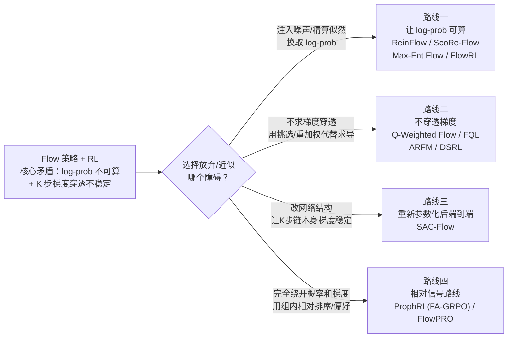
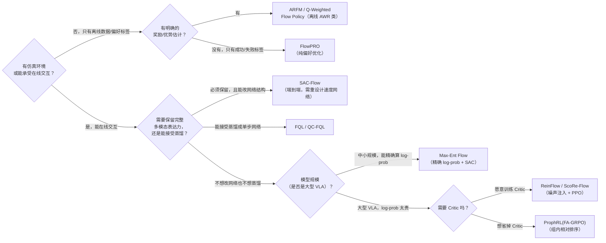

# Flow Matching 策略的强化学习方法全景综述：五条路线的技术图谱

> **综述范围**：所有针对 Flow Matching 策略（连续归一化流，π₀、XR-1 等主流 VLA 的动作头）设计的强化学习训练/微调方法
> **关键词**：Flow Matching、PPO、SAC、log-likelihood、梯度穿透、蒸馏、偏好优化、VLA
> **适用读者**：了解 [Flow Matching 基本原理](/前置知识/000g_前置知识_Flow_Matching与连续归一化流) 和基本 RL 概念（PPO/SAC），想系统理解"给 Flow 策略做 RL 到底难在哪、大家分别怎么绕开这个难点、实践中该怎么选"

---

## 相关阅读

在开始之前，建议先了解：

**前置知识（必读）：**
- [Flow Matching 与连续归一化流](/前置知识/000g_前置知识_Flow_Matching与连续归一化流) — 本文全部讨论的对象是什么、ODE 推理过程
- [为什么扩散策略难以 RL 微调](/前置知识/000f_前置知识_为什么扩散策略难以RL微调) — 本文核心矛盾的通用背景（Flow 和 Diffusion 共享同一个数学困难）
- [策略梯度与 PPO](/前置知识/000a_前置知识_策略梯度与PPO) — PPO 为什么需要 log-prob
- [SAC (Soft Actor-Critic)](/前置知识/000k_前置知识_SAC_Soft_Actor_Critic) — SAC 为什么需要 log-prob 和端到端梯度

**本文覆盖的具体方法（前置知识 + 论文精读）：**
- [ReinFlow](/前置知识/001u_前置知识_ReinFlow_Flow策略的噪声注入RL微调)、[ScoRe-Flow 精读](./080_ScoRe_Flow_Score引导的Flow策略RL微调)、[Max-Ent Flow 精读](./081_MaxEnt_Flow_最大熵RL与Flow_Matching策略)、[FlowRL 精读](./018_FlowRL_Flow_VLA的在线RL微调)、[FPO 精读](./113_FPO_Flow策略梯度_不改采样过程的PPO微调) — 路线一：让 log-prob 可算
- [Q-Weighted Flow Policy](/前置知识/001v_前置知识_Q加权Flow策略_不穿透去噪链的RL训练)、[FQL](/前置知识/001p_前置知识_FQL_Flow_Q_Learning)、[Q-Chunking 精读](./071_QChunking_RL与动作分块)、[ARFM 精读](./027_ARFM_自适应离线RL后训练Flow_VLA)、[DSRL](/前置知识/002t_前置知识_DSRL_扩散策略的噪声空间强化学习) — 路线二：不穿透梯度
- [SAC-Flow 精读](./079_SAC_Flow_用SAC直接训练Flow策略) — 路线三：重新参数化网络后直接端到端
- [FlowPRO 精读](./035_FlowPRO_无奖励偏好优化Flow_VLA)、[ProphRL 精读](./022_ProphRL_预测式VLA后训练) — 路线四：绕开概率与梯度，用相对信号

**关联综述：**
- [扩散模型在决策与控制中的应用综述](./S05_扩散模型在决策与控制中的应用综述) — Diffusion（DDPM/DDIM）路线的 RL 微调全景，和本文是姐妹篇——同一个数学困难在两种生成范式下的不同解法
- [VLA On-Policy RL 方法综述](./S12_VLA_On_Policy_RL方法综述)、[VLA Off-Policy RL 方法综述](./S13_VLA_Off_Policy_RL方法综述)、[VLA Offline RL 方法综述](./S14_VLA_Offline_RL方法综述) — 按 RL 数据来源（在线/离线）分类的综述，和本文按"如何处理 Flow 的数学困难"分类是两个正交的切片，可以互相参照
- [连续生成头 VLA 模型综述](./S17_连续生成头VLA模型综述) — Flow Matching 作为 VLA 动作头的架构背景

---

## 贯穿全文的例子

> **场景**：一个用 [Flow Matching](/前置知识/000g_前置知识_Flow_Matching与连续归一化流) 生成动作的机器人策略——可以想象成 π₀ 的动作头：给定观测 $s$（图像 + 语言指令的特征），从高斯噪声 $A_0\sim\mathcal N(0,I)$ 出发，经过 $K$ 步 Euler 积分（典型 $K=5\sim10$）得到最终动作块 $A_K\in\mathbb R^{112}$（16 步 × 7 维关节速度）。SFT 后策略成功率 70%，目标是用强化学习信号（成功/失败、任务进度、人类偏好等）把它提升到 85%+。
>
> 后面每引入一条新路线，都会回到这个例子，看它具体怎么绕开"Flow 策略不好做 RL"这个障碍。

---

## 一、核心矛盾：两个数学障碍，一个共同来源

几乎所有主流强化学习算法都需要下面两件事之一：

| RL 算法家族 | 需要什么 | 典型代表 |
|---|---|---|
| 策略梯度 / PPO 类 | 精确或近似的 $\log\pi_\theta(a\mid s)$（用于 importance ratio 和熵正则） | PPO、SAC、GRPO |
| 端到端确定性策略梯度类 | $\nabla_\theta Q(s,\pi_\theta(s))$ 能够反向传播回参数 $\theta$ | DDPG、TD3、标准 SAC 的 Actor 更新 |

Flow Matching 生成动作不是一次前向就能完成的，而是从噪声 $A_0$ 出发，经过 $K$ 步 ODE 积分，每一步都调用同一个网络 $v_\theta$：

$$
A_0 \;\xrightarrow{v_\theta}\; A_1 \;\xrightarrow{v_\theta}\; \cdots \;\xrightarrow{v_\theta}\; A_K
$$

**这个公式在做什么**：表示动作生成是一条 $K$ 步的链，不是一次前向——最终动作 $A_K$ 依赖于 $A_0$ 经过 $K$ 次同一个网络调用后的结果。

::: details 📐 公式详解（点击展开）

| 子表达式 | 它是谁 | 它在干嘛 |
|---------|--------|---------|
| $A_0\sim\mathcal N(0,I)$ | 生成的起点 | 一个随机高斯噪声样本 |
| $\xrightarrow{v_\theta}$（共 $K$ 次） | 同一个速度场网络的重复调用 | 每次把当前状态朝"更干净"的方向推进一小步 |
| $A_K$ | 生成的终点 | 真正被机器人执行的动作 |

**用人话读**："动作不是网络一次吐出来的，是从噪声出发被同一个网络反复调用 $K$ 次、逐步'走'出来的。"

**为什么是这个形式**：这正是 [Flow Matching 前置知识](/前置知识/000g_前置知识_Flow_Matching与连续归一化流) 里 ODE 数值求解的标准写法——把连续时间的微分方程离散化成 $K$ 步 Euler 更新，是 ODE 求解最直接的近似方式。
:::

这个"多步、确定性"的生成过程，恰好同时破坏了上面两件事：

**障碍一：$\log\pi_\theta(a\mid s)$ 不可低成本计算。** Flow 的 ODE 积分是确定性映射 $A_0\mapsto A_K$，它的边际密度需要用 change-of-variables 公式对速度场的散度沿路径积分：

$$
\log \pi_\theta(A_K\mid s) = \log p_0(A_0) - \int_0^1 \mathrm{tr}\left(\frac{\partial v_\theta}{\partial A_t}\right)\mathrm dt
$$

**这个公式在做什么**：终点动作的概率密度 = 起点噪声的密度，减去沿整条路径"体积膨胀/收缩"的累积效应——这是唯一能精确算出 Flow 策略 log-prob 的数学工具。

::: details 📐 公式详解（点击展开）

| 子表达式 | 它是谁 | 它在干嘛 |
|---------|--------|---------|
| $\log p_0(A_0)$ | 起点（标准高斯噪声）的对数密度 | 已知的解析值，容易算 |
| $\mathrm{tr}(\partial v_\theta/\partial A_t)$ | 速度场的散度（Jacobian 的迹） | 衡量这一点附近的轨迹在"膨胀"还是"收缩" |
| $\int_0^1(\cdot)\,\mathrm dt$ | 沿整条 ODE 路径积分 | 把每个时刻的膨胀/收缩效应累加起来 |

**用人话读**："终点的密度，等于起点的密度，减去整条路径上体积膨胀/收缩的累积量。"

**为什么这么贵**：散度（Jacobian 的迹）精确计算需要对动作的每一维分别反传，加上沿时间积分，总计算量是 $O(d\times K)$ 次前向传播——对 $d=112$、$K=10$ 的 VLA 场景就是 1120 次，完全不现实。

**障碍二：梯度穿过 $K$ 步积分等价于穿过 $K$ 层 RNN 的 BPTT。** 如果想让 $\nabla_\theta Q(s,A_K)$ 反传回 $\theta$，链式法则要求连乘 $K$ 个雅可比矩阵：

$$
\frac{\partial A_K}{\partial\theta} = \frac{\partial A_K}{\partial A_{K-1}}\cdot\frac{\partial A_{K-1}}{\partial A_{K-2}}\cdots\frac{\partial A_1}{\partial\theta}
$$

**这个公式在做什么**：衡量"调整一下网络参数，最终生成的动作会怎么变"，这个敏感度必须沿着 $K$ 步积分链逐级传递、连乘。

::: details 📐 公式详解（点击展开）

| 子表达式 | 它是谁 | 它在干嘛 |
|---------|--------|---------|
| $\partial A_{k}/\partial A_{k-1}$（共 $K$ 项） | 第 $k$ 步积分对上一步状态的局部雅可比 | 每一步都来自同一个网络 $v_\theta$，敏感度略大于或略小于 1 |
| 连乘 $K$ 项 | 链式法则要求的"信息传递路径" | 和 $K$ 层 RNN 反向传播（BPTT）在数学结构上完全等价 |

**用人话读**："最终动作对参数的敏感度，等于沿着积分路径每一步敏感度逐级传递、连乘的结果。"

**为什么会爆炸/消失**：每步局部雅可比的特征值哪怕只偏离 1 一点点（如 1.3 或 0.9），连乘 $K=10$ 步后就会指数级放大到 $1.3^{10}\approx13.8$ 倍或压缩到 $0.9^{10}\approx0.35$ 倍——这不是训练调参能解决的偶然现象，是矩阵连乘的数学必然。
:::

下图直观展示了这种指数级效应：局部敏感度只要偏离 1（无论放大还是缩小），经过区区十几步积分就会被放大/压缩到完全失控的量级。

> 图中横轴是积分步数 $K$，纵轴是雅可比连乘后的量级。局部敏感度 1.3（红线）10 步后放大约 14 倍；0.7（绿线）10 步后压缩到不足原来的 3%。真实网络里这个"敏感度"是随输入变化的矩阵谱范数，训练早期很容易偏离 1 较多，这正是直接对 Flow 策略做端到端 RL 训练不稳定的根本原因。

**一句话总结全文的分类逻辑**：所有方法都在回答同一个问题——"障碍一和障碍二，我选择放弃/近似哪一个，用什么代价去换？"下面五条路线，正是五种不同的取舍。

---

## 二、路线一：给 ODE 注入随机性，换取可计算的 log-prob

### 2.1 这条路线的统一思路

这条路线不改变"要用策略梯度类算法（PPO/SAC）"这个前提，而是想办法让 $\log\pi_\theta(a\mid s)$ 变得可以算——具体做法又分两个子路线：**注入噪声把 ODE 变成 SDE**（每步转移变成显式高斯，log-prob 按步累加），或者**直接精确/近似计算原始 ODE 的密度**（不改变生成过程本身）。

### 2.2 子路线 1：噪声注入，把确定性 ODE 变成随机链

最直接的想法：在 ODE 每一步加一个可学习的噪声，转移就变成了高斯分布，log-prob 自然可以按步累加：

$$
A_{k+1} = A_k + v_\theta(A_k,t_k,s)\cdot\Delta t + \sigma_\phi(t_k,A_k,s)\cdot\epsilon_k,\qquad \epsilon_k\sim\mathcal N(0,I)
$$

**这个公式在做什么**：这是 [ReinFlow](/前置知识/001u_前置知识_ReinFlow_Flow策略的噪声注入RL微调) 的核心改动——原来的 drift（速度场）完全不变，只是额外叠加一个可学习强度的随机扰动。加了噪声之后两件事同时解决：策略有了探索能力，且每步转移是高斯分布，$\log\pi_\theta$ 可以精确累加。

::: details 📐 公式详解（点击展开）

| 子表达式 | 它是谁 | 它在干嘛 |
|---------|--------|---------|
| $v_\theta(A_k,t_k,s)\cdot\Delta t$ | 预训练 flow 的确定性 drift | 决定"主要往哪走"，不被改动 |
| $\sigma_\phi(t_k,A_k,s)$ | 新增的、可学习的噪声强度网络 | 决定"每步抖动多大"，训练时和 drift 一起被 PPO 优化 |
| $\epsilon_k$ | 标准高斯随机变量 | "这一步往哪个随机方向偏" |

**用人话读**："原来的 flow 是沿轨道确定性前进的火车，ReinFlow 给它加了'方向盘随机抖动'——主方向不变，但允许探索。"

**为什么是这个形式**：这是让确定性 ODE 变成随机 SDE 最小改动的方案——不动 drift，只加一个独立的噪声项，最省成本地换取"有随机性"和"log-prob 可算"这两个性质。
:::

**ReinFlow 的局限**：噪声是各向同性的，只能改变"探索多广"（variance），不能改变"往哪个方向探索"（drift 方向不受 RL 信号影响）——如果预训练 flow 本身指向的方向就不够好，光靠抖动很难找到更好的路径。

[**ScoRe-Flow**](./080_ScoRe_Flow_Score引导的Flow策略RL微调) 在此基础上补上了这一环——额外加入一个 **score drift 修正项**，让 drift 方向本身也能被 RL 信号调整：

$$
\mathrm dA_t = \underbrace{v_\theta\,\mathrm dt}_{\text{ReinFlow 保留}} + \underbrace{\alpha(t)\cdot s_t(A_t)\,\mathrm dt}_{\text{ScoRe-Flow 新增：score drift}} + \sigma_\phi\,\mathrm dW
$$

**这个公式在做什么**：在 ReinFlow 的"drift + 噪声"基础上，额外加入一项由 score function 引导的修正力——让"往哪个方向走"本身也能被 RL 信号调整，而不只是"走多随机"。

::: details 📐 公式详解（点击展开）

| 子表达式 | 它是谁 | 它在干嘛 |
|---------|--------|---------|
| $v_\theta\,\mathrm dt$ | 预训练 flow 的原始 drift | 保持不变，提供"基本走向" |
| $\alpha(t)\cdot s_t(A_t)\,\mathrm dt$ | 新增的 score drift 修正 | 把轨迹推向"当前分布下概率更高"的区域，強度由 $\alpha(t)$ 独立控制 |
| $\sigma_\phi\,\mathrm dW$ | 噪声项（继承自 ReinFlow） | 控制探索的随机幅度，強度由 $\sigma_\phi$ 独立控制 |

**用人话读**："在原来的行进方向上，额外叠加一个'往高概率区域偏'的修正力，且这个修正力和随机探索的幅度是两个独立可调的旋钮。"

**为什么要和噪声解耦**：如果把 drift 修正强度和噪声强度绑定成同一个参数（如 Score-SDE 消融那样），调节"往哪偏"就会同时改变"探索多广"，两者无法分别优化；解耦后可以独立寻找各自的最优值。
:::

score 项 $s_t(A_t)=\nabla_A\log\rho_t(A)$（详见 [Score Function 前置知识](/前置知识/001t_前置知识_Score_Function密度梯度与Score_Matching)）指向"高概率区域"，相当于给火车换了一条更好的铁轨，而不只是在原铁轨上抖动。关键设计是让"往哪偏"（$\alpha(t)$ 控制的 score 强度）和"探索多广"（$\sigma_\phi$ 控制的噪声）**彼此独立**——之前的 Score-SDE 消融把两者绑定为 $\sigma=\sqrt{2\alpha}$，灵活性差；ScoRe-Flow 解耦后两者可以分别调节，性能明显更好。

### 2.3 子路线 2：不加噪声，直接算原始 ODE 的（近似）密度

另一种思路完全不改变 flow 的生成过程本身，而是想办法把第一节那个"障碍一"的公式算出来。

[**Max-Ent Flow (ISFM)**](./081_MaxEnt_Flow_最大熵RL与Flow_Matching策略) 走的是最"硬核"的路子——用 Hutchinson trace estimator 把散度积分的计算量从 $O(d)$ 降到 $O(1)$（一次 vector-Jacobian product 就能估计 trace），从而让精确的 change-of-variables 公式变得可计算，把 SAC 的最大熵框架真正嵌入 Flow 策略。同时提出 ISFM（Importance-Sampling Flow Matching）作为在线更新目标——不再拟合"数据分布"，而是用重要性权重让速度场学习"往 Q 值高的方向偏"。

[**FlowRL**](./018_FlowRL_Flow_VLA的在线RL微调) 面对的是更极端的规模约束（7B 参数的 π₀ 上做 RL），连 Hutchinson trace 估计都嫌贵，于是提出两种更粗糙但更快的近似：

| 近似方法 | 核心思路 | 计算成本 | 精度 |
|---|---|---|---|
| SLE（Score-based） | 用 $t\to1$ 附近的速度场近似 score function，再积分得到 log-prob | 5 次前传 | 偏差约 10-15% |
| NIVB（变分下界） | 构造"多噪声种子平均"的 ELBO 下界 | 80 次前传（$K$=8 采样 × 10 步 ODE） | 偏差约 5-8%，比精确计算快 14 倍 |

两者都比精确计算（1120 次前传）快得多，NIVB 精度更高、更适合最终训练；SLE 更快、适合快速实验。FlowRL 用近似出来的 log-prob 直接套用标准 PPO，只是更保守地调小了 clip 范围（$\epsilon=0.1$）并加了额外 KL 惩罚——因为近似本身有噪声，需要更谨慎的更新步长。

### 2.4 子路线 3：完全不改采样过程，用训练损失本身当 ELBO 代理

前两个子路线都需要对 flow 的生成过程本身做某种改动（加噪声）或做额外的密度计算（trace 估计）。[**FPO（Flow Policy Optimization）**](./113_FPO_Flow策略梯度_不改采样过程的PPO微调) 提供了第三种做法——完全不碰采样过程，把它当一个纯黑箱，只在计算 PPO ratio 这一步动手脚：利用"flow/diffusion 的加权去噪损失本身就等于负 ELBO 加一个和 $\theta$ 无关的常数"这条数学事实，直接用新旧策略在同一个动作上的去噪损失差值来近似似然比：

$$
\hat r^{\text{FPO}}(\theta) = \exp\left(\hat{\mathcal L}^w_{\theta_{\text{old}}}(a_t;o_t) - \hat{\mathcal L}^w_\theta(a_t;o_t)\right)
$$

**这个公式在做什么**：用"新旧策略对同一个动作的去噪损失差值"直接近似 PPO 需要的似然比，不需要重新走一遍采样过程,也不需要额外训练任何新网络。

::: details 📐 公式详解（点击展开）

| 子表达式 | 它是谁 | 它在干嘛 |
|---------|--------|---------|
| $\hat{\mathcal L}^w_{\theta_{\text{old}}}(a_t;o_t)$ | 旧策略对这个动作的去噪损失 | 用旧参数、给定同一批 $(\tau,\epsilon)$ 样本算出的 MSE |
| $\hat{\mathcal L}^w_\theta(a_t;o_t)$ | 新策略对这个动作的去噪损失 | 用当前参数、同一批样本算出的 MSE |
| $\hat r^{\text{FPO}}(\theta)$ | 近似的似然比 | 新策略损失更低（更容易生成这个动作）时，比值 $>1$ |

**用人话读**："看新参数比旧参数，让这个已经发生的动作变得多容易生成，用这个'变容易的程度'直接当作似然比来用。"

**为什么可以这样做**：Kingma & Gao（2023）证明了 flow/diffusion 常见的加权去噪损失恰好等于负 ELBO 加一个不依赖 $\theta$ 的常数，新旧策略共享同一个常数，代入 ratio 公式后常数被精确抵消——所以直接用训练时天天在算的去噪损失差值，就等价于用 ELBO 比值，完全不需要额外计算 KL 或密度积分。这个估计器本身因 Jensen 不等式存在系统性上偏，但论文证明梯度**方向**依然是无偏的（[FPO 精读第三节](./113_FPO_Flow策略梯度_不改采样过程的PPO微调) 有完整推导）。
:::

这个"不碰采样过程"的特性带来一个和路线一其他方法都不同的实际优势——**训练和推理时用的采样器可以完全不同**（可以是任意阶 ODE 求解器、任意步数），因为 FPO 从未把某个特定的随机转移核写进策略的数学定义里；而 ReinFlow/ScoRe-Flow 的每步高斯转移、Max-Ent Flow 的精确 CoV 积分，都要求训练时的采样过程严格匹配它们各自的数学假设。

### 2.5 子路线一小结

| 方法 | log-prob 来源 | 是否改变生成路径 | RL 算法 | 计算代价 |
|---|---|---|---|---|
| [ReinFlow](/前置知识/001u_前置知识_ReinFlow_Flow策略的噪声注入RL微调) | 噪声注入后每步高斯累加 | 加噪声，drift 不变 | PPO | 几乎不增加 |
| [ScoRe-Flow](./080_ScoRe_Flow_Score引导的Flow策略RL微调) | 同上 + score 修正 drift | 加噪声 + score drift | PPO | 略增加（多算一次 score） |
| [Max-Ent Flow](./081_MaxEnt_Flow_最大熵RL与Flow_Matching策略) | Instantaneous CoV + Hutchinson trace（精确） | 不改变 | SAC | 每步多一次 VJP |
| [FlowRL](./018_FlowRL_Flow_VLA的在线RL微调)（SLE） | Score 近似 | 不改变 | PPO | 5 次前传 |
| [FlowRL](./018_FlowRL_Flow_VLA的在线RL微调)（NIVB） | 变分下界 | 不改变 | PPO | 80 次前传 |
| [FPO](./113_FPO_Flow策略梯度_不改采样过程的PPO微调) | 去噪损失差值近似 ELBO 比值 | **完全不改变，采样器可任意** | PPO | $N_{\text{mc}}$ 次前传（论文用 8 次） |

**这条路线的共同代价**：不管精确还是近似，都需要**在线交互**（rollout 收集新数据）；生成路径改变的方法（加噪声）需要担心探索方向是否足够有效；不改变路径的方法（Max-Ent Flow、FlowRL、FPO）需要承担 log-prob/ELBO 计算的额外成本，其中 FPO 是这几种"不改变路径"方案里计算最轻量的一种。

---

## 三、路线二：不穿透梯度，用"挑选"或"重加权"代替"求导"

### 3.1 这条路线的统一思路

路线一解决的是障碍一（log-prob）。这条路线换一个角度——干脆放弃"让梯度端到端穿过 $K$ 步积分"这个需求，用**监督式的重加权训练**或**挑选最优候选**来代替显式的梯度上升。这类方法通常不需要在线交互，更适合离线或近离线场景。

### 3.2 子路线 1：Q 值加权 Flow-Matching Loss（不穿透，靠权重"选择性模仿"）

[**Q-Weighted Flow Policy**](/前置知识/001v_前置知识_Q加权Flow策略_不穿透去噪链的RL训练) 的核心操作极简：Critic 用标准 SAC/TD 训练（这部分和策略是不是 flow 完全无关），Actor 更新时**完全不让 Q 梯度穿过 flow 的 K 步链**，而是从 replay buffer 里采样已有动作，按 Q 值给每个动作加权，做加权 flow-matching 回归：

$$
\mathcal L_{\text{actor}}(\theta) = -\mathbb E_{(s,a)\sim\mathcal D}\Big[w(s,a)\cdot\big\|v_\theta(x_t,t,s)-(a-x_0)\big\|^2\Big],\qquad w(s,a)=\exp\!\left(\frac{A(s,a)}{\beta}\right)
$$

**这个公式在做什么**：不再问"怎么调参数能让 Q 值变大"，而是问"buffer 里哪些动作 Q 值高，就让网络更努力去模仿这些动作"——这正是 [AWR（优势加权回归）](/前置知识/000u_前置知识_AWR_优势加权回归) 思想在 flow-matching 上的直接应用。

::: details 📐 公式详解（点击展开）

| 子表达式 | 它是谁 | 它在干嘛 |
|---------|--------|---------|
| $\|v_\theta(x_t,t,s)-(a-x_0)\|^2$ | 普通的 flow-matching 回归 loss | 网络学习"从噪声走到这个具体动作 $a$" |
| $w(s,a)=\exp(A/\beta)$ | 由优势 $A=Q-V$ 决定的权重 | Q 值越高的动作，权重越大——网络被推向更努力学它 |
| $\beta$ | 温度参数 | 控制权重集中程度——越小越像"只学最好的那个"，越大越像"平等对待所有动作" |

**用人话读**："让 flow 网络更努力学会生成 Q 值高的动作，少花力气去拟合 Q 值低的动作，权重来自 [AWR](/前置知识/000u_前置知识_AWR_优势加权回归) 的指数加权公式。"

**为什么这样能绕开梯度穿透**：Actor 的梯度只流经 flow 网络**一次前向**（普通监督回归），不涉及任何多步 rollout，训练稳定性和普通行为克隆完全一样。代价是策略只能"挑选/模仿" buffer 中已存在的好动作，无法探索 buffer 外的空间——这是它和路线三（SAC-Flow 端到端）之间的核心 trade-off。
:::

温度参数 $\beta$ 直接决定了这个权重函数的形状——下图展示了不同 $\beta$ 下权重随优势值变化的曲线：

> 图中横轴是优势 $A(s,a)$，纵轴是对应权重 $w=\exp(A/\beta)$。$\beta$ 越小（红线），权重越集中在优势最高的少数样本上（趋近"只学最好的那个"）；$\beta$ 越大（蓝线），权重分布越平缓（趋近"平等对待所有样本"）。这条曲线在路线二的多个方法（Q-Weighted Flow Policy、ARFM、CO-RFT 的 AWR 部分）中反复出现，是理解"优势加权"这类方法的核心直觉图像。

这个思路在 VLA 离线微调场景下有具体的落地形式——[**ARFM**](./027_ARFM_自适应离线RL后训练Flow_VLA) 就是同一套"advantage 加权 flow loss"思路，额外加了一个**自适应缩放因子** $\alpha(s,a)=\text{clip}(|A|/\sigma_A,\alpha_{\min},\alpha_{\max})$，根据 advantage 估计的信噪比动态调节 RL 信号强度——信号可靠时放大、不可靠时收缩到接近纯 flow loss，本质上是给 AWR 类方法加了一层"不确定性感知"的保险。

### 3.3 子路线 2：蒸馏——把"表达力"和"速度"拆给两个网络分别负责

[**FQL（Flow Q-Learning）**](/前置知识/001p_前置知识_FQL_Flow_Q_Learning) 走的是另一条完全不同的绕路方式：训练**两个网络分工**——

- 教师网络 $f_\xi$：标准多步 flow，纯行为克隆，只负责"表达数据里的多模态分布"，**从不参与 RL 梯度**
- 学生网络 $\mu_\psi(s,z)$：一次前向直接输出动作，通过**蒸馏**学会"抄"教师对同一个噪声起点给出的答案，同时被 Q loss 推向更高价值的方向

$$
\mathcal L_{\text{actor}}(\xi,\psi) = \underbrace{\mathcal L_{\text{BC-flow}}(\xi)}_{\text{教师学表达力}} + \alpha\cdot\underbrace{\big\|\mu_\psi(s,z_0)-\text{FlowIntegrate}(f_\xi,s,z_0)\big\|^2}_{\text{学生抄教师答案}} - \underbrace{Q_\theta(s,\mu_\psi(s,z_0))}_{\text{学生追求高价值}}
$$

**这个公式在做什么**：三个目标各管一段——教师练表达力，学生抄教师、再在抄的基础上偏向更高分——梯度分别只流向各自负责的参数，训练时不需要展开任何多步反传（蒸馏目标是用 `no_grad` 跑出来的具体数值，不是可导的计算图）。

::: details 📐 公式详解（点击展开）

| 子表达式 | 它是谁 | 它在干嘛 |
|---------|--------|---------|
| $\mathcal L_{\text{BC-flow}}(\xi)$ | 教师网络的标准 flow-matching 训练 | 独立训练，完全不涉及 Q，专注保留多模态表达力 |
| $\text{FlowIntegrate}(f_\xi,s,z_0)$ | 教师对某个具体噪声起点跑完 $N$ 步积分得到的终点（`no_grad`） | 给学生出的"标准答案"——教师已经算好，学生只需要记住 |
| $\mu_\psi(s,z_0)$ | 学生的一次前向输出 | 真正会被部署执行的策略 |
| $Q_\theta(s,\mu_\psi(\cdot))$ | Critic 对学生输出的打分 | 在"贴近教师"的约束范围内，进一步偏向高价值动作 |

**用人话读**："教师老老实实做多步行为克隆，学生一次前向去'抄'教师对同一个噪声给出的答案，同时被 Critic 推向更高分的方向——快和准这两个需求，被拆成两个网络分别满足。"

**为什么能绕开梯度穿透**：蒸馏目标 `FlowIntegrate` 是用 `no_grad` 算出来的**具体数值**，不是计算图的一部分——学生网络的反传只经过它自己的一次前向，永远不需要展开教师的 $K$ 步积分。代价是需要多训练一个网络（教师），且学生的表达力终究是对教师的**近似**（蒸馏总有误差）。
:::

在动作分块（action chunking）场景下，[**Q-Chunking 精读**](./071_QChunking_RL与动作分块) 第 4.3 节的 **QC-FQL** 把 FQL 原封不动地套用到"$h$ 步动作块"这个更大的动作单元上——约束机制从隐式 KL（另一种实现是 best-of-$N$ 采样再挑选，见下方"挑选式"讨论）换成了显式的 2-Wasserstein 距离，用蒸馏 MSE 作为其上界的代理。

### 3.4 子路线 3：生成候选再挑选（Best-of-N）—— 一种更通用的"不穿透"技巧

Q-Chunking 里的 **QC** 变体展示了另一种彻底不训练显式策略网络的方式：从 flow 教师 $f_\xi$ 中采样 $N$ 个候选动作块，用 Critic 逐一打分，直接挑分数最高的作为最终动作。这个"采样+挑选"过程本身等价于一个隐式策略，其相对原分布的 KL 散度有一个只依赖 $N$ 的闭式上界：

$$
D_{\mathrm{KL}}(q\,\|\,f_\xi(\cdot|s)) \le \log N - \frac{N-1}{N}
$$

**这个公式在做什么**：不需要显式计算 KL 散度，只要知道候选数量 $N$，就能得到"挑选出的隐式策略偏离原始分布多远"的一个确定上界。

::: details 📐 公式详解（点击展开）

| 子表达式 | 它是谁 | 它在干嘛 |
|---------|--------|---------|
| $q(\cdot\mid s)$ | 挑选后的隐式策略分布 | "反复采样 $N$ 个再挑最优"这个过程本身诱导出的动作分布 |
| $f_\xi(\cdot\mid s)$ | 原始教师网络的分布 | "如果不挑选，直接采样会得到什么" |
| $\log N-\frac{N-1}{N}$ | KL 上界公式 | 只依赖 $N$ 一个数字，不需要算任何积分 |

**用人话读**："挑选操作让最终策略偏离原分布多远，只取决于候选数量 $N$，且这个偏离程度有一个不需要计算 KL 就能拿到的确定上限。"

**为什么是这个形式**：$N=1$ 时没有任何选择性（直接用采样结果），代入得 0，和"没有偏离"的直觉一致；$N\to\infty$ 时"只留最优"的选择性趋于极端，代入得趋于无穷，和"偏离可以任意大"的直觉一致——这两个边界检验说明该上界形式是合理的。
:::

下图展示了这个上界随候选数量 $N$ 增长的规律——$N$ 越大，"只挑最好的"这个操作本身让最终策略偏离原始行为分布越远：

> 图中横轴是候选采样数量 $N$，纵轴是隐式挑选策略相对原始分布的 KL 上界。$N=1$ 时没有选择性、KL=0；$N$ 越大，"只留最优"的操作让策略系统性地偏离数据分布越多。这个上界的好处是不需要显式计算 KL——只要确定了 $N$，约束松紧就自动确定了。

这个"生成候选+打分挑选"的思路，和路线一之外的许多 Off-Policy Flow RL 方法（如经典的 [IDQL](./005_IDQL_隐式扩散Q学习)，虽然是 Diffusion 而非 Flow，但机制完全相通）共享同一个核心逻辑——**不需要梯度穿过生成过程，只需要生成端和评估端各自独立，用"挑选"这个离散操作连接两者**。

### 3.5 子路线 4：完全冻结原策略，只在噪声空间做 RL

[**DSRL**](/前置知识/002t_前置知识_DSRL_扩散策略的噪声空间强化学习) 提供了这条路线里最极端的一种"不穿透"方式——它甚至不训练 flow 网络本身的任何参数，而是把整条预训练 flow 策略当作一个**完全冻结**的黑箱解码器 $f_\theta$，只训练一个独立的小型 SAC actor $\pi_\psi$ 去决定"喂给这个解码器的初始噪声 $x_0$ 该是什么"：

$$
\pi_\psi(x_0\mid s) \;\xrightarrow{\text{冻结的 }f_\theta}\; a=f_\theta(x_0,s) \;\xrightarrow{\text{环境}}\; r,s'
$$

**这个公式在做什么**：把整条预训练 Flow 策略当作一个固定不变的"动作解码器"，RL 只学习"该喂给这个解码器什么样的初始噪声"，不学习解码器本身怎么解码。

::: details 📐 公式详解（点击展开）

| 子表达式 | 它是谁 | 它在干嘛 |
|---------|--------|---------|
| $\pi_\psi(x_0\mid s)$ | 新训练的、极小的 SAC actor | 真正被优化的对象，输出的是"该给解码器什么噪声" |
| $f_\theta$ | 冻结的预训练 Flow 策略 | 全程参数不变，只是被拿来"用一下" |
| $a=f_\theta(x_0,s)$ | 解码后的真实机器人动作 | 送进环境执行的东西 |

**用人话读**："预训练策略已经学会了'从一个随机起点能走出一条大致靠谱的路'，RL 学的是给它选一个更好的起点，而不是重新教它怎么走路。"

**为什么这样设计**：需要被 SAC 优化、需要探索的网络体量极小（相比完整 VLA backbone），训练成本大幅降低；同时预训练策略完全不被改动，不存在"RL 微调破坏原有好行为"的风险。
:::

因为 $\pi_\psi$ 的"动作"是低维噪声向量（不是高维机器人动作），而且它本身是标准的一次采样 tanh-Gaussian 策略，梯度不需要穿过任何 flow 的多步积分——训练成本极低，也完全不会破坏预训练策略原本学到的能力。代价是探索能力被限制在"能被冻结解码器映射成有意义动作"的噪声子空间内。

### 3.6 路线二小结

| 方法 | 核心机制 | 是否训练独立策略网络 | 是否需要在线交互 | 探索能力 |
|---|---|---|---|---|
| [Q-Weighted Flow Policy](/前置知识/001v_前置知识_Q加权Flow策略_不穿透去噪链的RL训练) | Advantage 加权 flow-matching loss | 是（就是 flow 本身） | 需要（填充 buffer） | 受限于 buffer 中已有动作 |
| [ARFM](./027_ARFM_自适应离线RL后训练Flow_VLA) | 同上 + 自适应信噪比缩放 | 是 | 否（纯离线） | 受限于离线数据 |
| [FQL](/前置知识/001p_前置知识_FQL_Flow_Q_Learning) | 教师-学生蒸馏 + Q loss | 是（学生网络） | 可离线或在线 | 继承自教师的表达力 |
| QC / QC-FQL（[精读](./071_QChunking_RL与动作分块)） | Best-of-N 挑选 或 FQL 蒸馏，作用在动作块上 | QC 否 / QC-FQL 是 | offline-to-online | 中等 |
| [DSRL](/前置知识/002t_前置知识_DSRL_扩散策略的噪声空间强化学习) | 冻结原策略，只学初始噪声选择 | 是（极小的噪声选择 actor） | 需要 | 受限于噪声-动作映射的覆盖范围 |

**这条路线的共同代价**：都以"无法超越 buffer/教师能表达的范围"为代价换取训练稳定性——这是和路线三（端到端）、路线一（在线 PPO/SAC）的核心权衡点。

---

## 四、路线三：改网络结构，让 K 步链本身梯度稳定

### 4.1 硬啃梯度穿透这块骨头

路线一和路线二都在"绕开"障碍二（梯度穿透），[**SAC-Flow**](./079_SAC_Flow_用SAC直接训练Flow策略) 选择正面解决它——既然问题的根源是 $K$ 步 Euler 积分在代数结构上等价于一个残差 RNN 的 $K$ 步前向传播，那就借用现代序列模型解决 RNN 梯度病态的成熟方案（GRU 门控 / Transformer 残差结构），重新设计速度场网络 $v_\theta$ 本身：

$$
A_{k+1} = A_k + \Delta t\cdot\big(g_k\odot(\hat v_\theta(t_k,A_k,s)-A_k)\big),\qquad g_k=\sigma(z_\theta(t_k,A_k,s))\in(0,1)^d
$$

**这个公式在做什么**：这是 **Flow-G**（GRU 风格）变体——每步更新不再是直接加上完整的速度贡献，而是像 GRU 的更新门一样，用一个学习出来的门控 $g_k$ 决定"这一步该跳多远"，$(1-g_k)$ 那部分自动提供一条不经过非线性变换的梯度直通道，天然抑制指数级放大/消失。

::: details 📐 公式详解（点击展开）

| 子表达式 | 它是谁 | 它在干嘛 |
|---------|--------|---------|
| $\hat v_\theta(t_k,A_k,s)$ | 候选新位置（类似 GRU 的候选隐状态） | 网络原本想跳到的地方 |
| $g_k\in(0,1)^d$ | 门控信号，每个维度独立 | 决定"这一维该不该大幅更新" |
| $g_k\odot(\hat v_\theta - A_k)$ | 门控后的实际更新量 | $g_k\approx0$ 时几乎不更新（梯度走"直通道"），$g_k\approx1$ 时正常更新 |

**用人话读**："给 flow 的每步更新装一个刹车，网络自己学会什么时候踩油门、什么时候踩刹车，避免连续 K 步都全力更新导致梯度连乘失控。"

**为什么能解决梯度问题**：这正是 GRU/LSTM 抑制 RNN 梯度爆炸/消失的同一机制——门控提供的跳跃连接让梯度可以"抄近道"，不必强行穿过 $K$ 次非线性变换的连乘。论文实测：无门控时梯度范数在 8 步内可炸到 $10^6$+，加了门控（或用 Transformer 残差结构的 Flow-T 变体）后梯度范数变化幅度不到 0.3。
:::

有了稳定的网络结构后，SAC-Flow 用第二章介绍过的"噪声增广"技巧（每步加固定小方差噪声，构造出可算的路径密度）获得 SAC 需要的熵项，剩下的训练流程和标准 SAC 完全一样——**这是目前唯一能直接用 SAC 端到端训练多步 Flow 策略、同时保留完整多模态表达力的方法**，不需要蒸馏成单步网络（对比 FQL），也不需要绕开 Q 梯度（对比 Q-Weighted Flow Policy）。

### 4.2 代价

改网络结构意味着不能直接复用已经预训练好的、用标准 MLP/DiT 参数化的 flow（如现成的 π₀ checkpoint）——需要重新设计并预训练速度场网络本身，这是它和路线一、路线二（都不改动网络结构，可以直接复用预训练模型）相比的主要额外成本。

---

## 五、路线四：完全绕开概率与梯度，用相对信号

### 5.1 这条路线的统一思路

前三条路线的共同前提是"我们需要 log-prob 或者需要梯度穿透 Q 值"。这条路线换一个角度问：**能不能压根不需要这两样东西？** 答案来自两类不依赖精确概率密度的信号——**组内相对排序**（GRPO 式）和**成对偏好**（DPO 式）。

### 5.2 GRPO 式：只需要组内排序，不需要精确概率

[**ProphRL**](./022_ProphRL_预测式VLA后训练) 提出的 **FA-GRPO（Flow-Action GRPO）** 把 [GRPO](/前置知识/000m_前置知识_GRPO_Group_Relative_Policy_Optimization) 适配到 Flow 动作空间：对同一个观测 $o$，用不同的 flow noise 采样出 $G$ 组候选动作，每组各自跑（或由 Prophet 视频预测模型模拟）执行结果得到 reward，组内归一化得到 advantage，再用 advantage 加权更新 flow-matching loss：

$$
\mathcal L_{\text{FA-GRPO}} = -\mathbb E\Big[A^{(i)}\cdot\nabla_\theta\log p_\theta(a^{(i)}\mid o)\Big]
$$

**这个公式在做什么**：对同一观测下采样出的一组候选动作，按"组内相对表现"（advantage）加权它们各自的梯度方向——比组内平均好的候选被强化，比组内平均差的被抑制。

::: details 📐 公式详解（点击展开）

| 子表达式 | 它是谁 | 它在干嘛 |
|---------|--------|---------|
| $a^{(i)}$ | 第 $i$ 个候选动作 | 同一观测 $o$ 下、用不同 flow noise 采样出的一组候选之一 |
| $A^{(i)}$ | 该候选的组内相对优势 | 由这组候选各自的 reward 做组内归一化算出，不需要绝对 Q 值 |
| $\nabla_\theta\log p_\theta(a^{(i)}\mid o)$ | 让这个候选更/更不可能出现的梯度方向 | 和标准策略梯度定理里的同一个量 |

**用人话读**："对同一个观测采样一组候选动作，谁比组内平均表现好就被强化，谁比平均差就被抑制——完全不需要单独训练一个 Critic 网络。"

**为什么不需要精确的绝对概率**：advantage 是靠组内相对排序算出来的，这比路线一里"精确算出每个动作的绝对概率密度"要求宽松得多，也是 GRPO 相比 PPO 能省去 Critic 的核心原因。
:::

**关键点**：GRPO 类方法天生不需要 Critic（省去训练一个额外价值网络），也**不需要精确的绝对 log-prob**——advantage 是靠组内相对排序算出来的（哪个候选比这一组的平均表现好/差），这比路线一里"精确算出每个动作的绝对概率密度"的要求宽松得多。ProphRL 还额外提出 **FlowScale**——按 denoising step 重新加权梯度（早期 step 决定大方向，权重应更高），进一步提升了训练效率（200 步收敛，比标准 GRPO 快 5 倍）。

### 5.3 DPO 式：只需要成对胜负标签，不需要奖励函数

[**FlowPRO**](./035_FlowPRO_无奖励偏好优化Flow_VLA) 走得更极端——完全不需要奖励函数，也不需要环境交互，只需要一批"成功轨迹 vs 失败轨迹"的成对偏好数据。它绕开了标准 DPO 需要的 log-prob 比值，转而在**flow loss 空间**里定义偏好：

$$
\mathcal L_{\text{RPRO}} = -\log\sigma\Big(\beta\big[\Delta_{\text{flow}}(a^-,s)-\Delta_{\text{flow}}(a^+,s)\big]\Big),\quad \Delta_{\text{flow}}(a,s)=\|v_\theta-(a-x_0)\|^2-\|v_{\text{ref}}-(a-x_0)\|^2
$$

**这个公式在做什么**：不比较"好动作和坏动作的绝对概率哪个高"，而是比较"相对参考模型，当前模型对好动作和坏动作的 flow loss 各自变化了多少"——只要好动作的 loss 降得比坏动作多，就是正确的更新方向。

::: details 📐 公式详解（点击展开）

| 子表达式 | 它是谁 | 它在干嘛 |
|---------|--------|---------|
| $\Delta_{\text{flow}}(a,s)$ | 当前模型相对参考模型，在动作 $a$ 上的 flow loss 变化量 | 负值表示"当前模型比参考模型更容易生成这个动作了" |
| $\Delta_{\text{flow}}(a^-,s)-\Delta_{\text{flow}}(a^+,s)$ | 坏动作变化量减去好动作变化量 | 如果这个差是正的，说明模型确实在往"偏好好动作"的方向调整 |
| $\sigma(\beta[\cdot])$ | 用 sigmoid 把这个差值转成一个 (0,1) 的概率式目标 | 和标准 DPO 的 loss 结构完全一样，只是输入换成了 loss 差而不是 log-prob 差 |

**用人话读**："看当前模型相对参考模型，生成好动作变容易了多少、生成坏动作变难了多少——两者的差距越大，说明训练方向越对。"

**为什么能绕开 log-prob**：这个式子完全只涉及 flow-matching loss 的相对变化（一个普通的 MSE 差值），不涉及"某个具体动作的绝对概率密度是多少"这个需要昂贵积分才能算出的量。
:::

**核心直觉**：如果当前模型相对参考模型，对"好动作"的 flow loss 变得更低（生成它更容易了），同时对"坏动作"的 flow loss 变得更高（生成它更难了），就说明更新方向是对的。这完全不涉及"某个具体动作的绝对概率是多少"，只关心**loss 的相对变化**——这正是它能完全绕开 log-prob 计算的原因。

### 5.4 路线四小结

| 方法 | 依赖的信号 | 需要环境/奖励？ | 需要 Critic？ | 需要 log-prob？ |
|---|---|---|---|---|
| [ProphRL (FA-GRPO)](./022_ProphRL_预测式VLA后训练) | 组内相对排序 | 否（Prophet 模拟代替） | 否 | 需要相对概率比 |
| [FlowPRO (RPRO)](./035_FlowPRO_无奖励偏好优化Flow_VLA) | 成功/失败成对偏好 | 完全不需要 | 否 | 完全不需要 |

**这条路线的共同代价**：牺牲了"直接优化绝对回报"的精细控制力，换来极低的工程和数据门槛——特别适合没有仿真环境、没有明确奖励函数、但能获得成功/失败标签的真实机器人场景。

---

## 六、全景对比与选型指南

### 6.1 全部方法一张表

| 方法 | 路线 | 处理的障碍 | RL 算法/框架 | 在线/离线 | 是否改网络结构 | 是否需要蒸馏 |
|---|---|---|---|---|---|---|
| [ReinFlow](/前置知识/001u_前置知识_ReinFlow_Flow策略的噪声注入RL微调) | 一 | log-prob | PPO | 在线 | 否 | 否 |
| [ScoRe-Flow](./080_ScoRe_Flow_Score引导的Flow策略RL微调) | 一 | log-prob | PPO | 在线 | 否 | 否 |
| [Max-Ent Flow](./081_MaxEnt_Flow_最大熵RL与Flow_Matching策略) | 一 | log-prob（精确） | SAC | 在线 | 否 | 否 |
| [FlowRL](./018_FlowRL_Flow_VLA的在线RL微调) | 一 | log-prob（近似） | PPO | 在线 | 否 | 否 |
| [FPO](./113_FPO_Flow策略梯度_不改采样过程的PPO微调) | 一 | log-prob（ELBO 代理，不改采样过程） | PPO | 在线 | 否 | 否 |
| [Q-Weighted Flow Policy](/前置知识/001v_前置知识_Q加权Flow策略_不穿透去噪链的RL训练) | 二 | 梯度穿透 | SAC（Actor 不端到端） | 在线/近离线 | 否 | 否 |
| [ARFM](./027_ARFM_自适应离线RL后训练Flow_VLA) | 二 | 梯度穿透 | AWR 变体 | 纯离线 | 否 | 否 |
| [FQL](/前置知识/001p_前置知识_FQL_Flow_Q_Learning) | 二 | 梯度穿透 | 蒸馏 + Q loss | 离线/在线 | 否 | 是 |
| QC-FQL（[精读](./071_QChunking_RL与动作分块)） | 二 | 梯度穿透 | FQL + 动作分块 | offline-to-online | 否 | 是 |
| [DSRL](/前置知识/002t_前置知识_DSRL_扩散策略的噪声空间强化学习) | 二 | 梯度穿透（冻结原策略） | SAC（在噪声空间） | 在线 | 否（冻结） | 否 |
| [SAC-Flow](./079_SAC_Flow_用SAC直接训练Flow策略) | 三 | 梯度穿透（正面解决） | SAC（端到端） | 在线 | **是**（GRU/Transformer） | 否 |
| [ProphRL (FA-GRPO)](./022_ProphRL_预测式VLA后训练) | 四 | 完全绕开 | GRPO | 在线（或模拟） | 否 | 否 |
| [FlowPRO (RPRO)](./035_FlowPRO_无奖励偏好优化Flow_VLA) | 四 | 完全绕开 | DPO 变体 | 纯离线 | 否 | 否 |

### 6.2 选型决策树

### 6.3 五条路线的核心 Trade-off 一览

| 路线 | 换来了什么 | 付出了什么代价 |
|---|---|---|
| 一：让 log-prob 可算 | 可以直接套用成熟的 PPO/SAC 理论框架 | 必须在线交互；近似方法有偏差；精确方法计算贵 |
| 二：不穿透梯度 | 训练极其稳定，可离线 | 只能"挑选/模仿"已有好动作，无法探索数据外空间 |
| 三：重新参数化后端到端 | 保留完整表达力 + 端到端最优性 | 必须改网络结构，不能直接复用现成预训练 checkpoint |
| 四：相对信号 | 工程门槛最低，甚至不需要奖励函数 | 牺牲精细的绝对回报优化能力 |

---

## 七、全文总结

Flow Matching 策略做强化学习的所有困难，最终都可以归结到同一个源头——**"多步、确定性"的生成过程**同时破坏了策略梯度类方法需要的 log-prob 和端到端方法需要的可穿透梯度。本文梳理的五条路线，本质上是围绕这一对孪生障碍给出的五种不同答案：

1. **正面拿下 log-prob**（路线一）：给 ODE 加噪声或直接算密度，代价是要在线交互
2. **绕开梯度穿透**（路线二）：用挑选/重加权/蒸馏代替端到端求导，代价是表达力受限于已有数据/教师
3. **正面拿下梯度穿透**（路线三）：改网络结构让多步链本身梯度稳定，代价是不能直接用现成预训练权重
4. **两者都不要**（路线四）：用组内相对排序或成对偏好代替，代价是精细控制力下降

回到贯穿全文的例子——如果你有一个预训练好的 π₀（不想改网络结构），有仿真环境能在线交互，且希望保留完整表达力：可以考虑 ReinFlow/ScoRe-Flow（成本低、成熟）或 Max-Ent Flow（更精确但更贵）。如果没有仿真环境、只有一批离线示教和成功/失败标签：ARFM 或 FlowPRO 是更现实的选择。如果追求端到端最优、且能承担重新设计并预训练速度网络的成本：SAC-Flow 是目前唯一的端到端方案。

**和 Diffusion 路线的关系**：值得注意的是，[扩散模型的 RL 微调](./S05_扩散模型在决策与控制中的应用综述)（DPPO、IDQL 等）面对的是完全同构的问题——DDPM 的多步去噪链在数学结构上和 Flow 的多步 ODE 积分完全类似。事实上路线一的"噪声注入换 log-prob"思路，正是 DPPO 处理 Diffusion 策略时用 ELBO 近似的姐妹思路；路线二的"不穿透梯度"思路，也正是 IDQL 处理 Diffusion 策略时"生成候选+Q值挑选"的同源做法。理解了本文的分类框架，再去看 Diffusion 路线的对应方法，会发现两条生成范式下的解决方案几乎是一一对应的——这也印证了本文开篇的论点：**决定一个方法属于哪条路线的，不是它用的是 Diffusion 还是 Flow，而是它选择放弃/近似了哪一个数学障碍。**

---

## 延伸阅读

- [扩散模型在决策与控制中的应用综述](./S05_扩散模型在决策与控制中的应用综述) — 姐妹综述：DDPM/DDIM 路线下同构问题的解法全景
- [Flow Matching 与连续归一化流](/前置知识/000g_前置知识_Flow_Matching与连续归一化流) — 本文所有讨论的生成范式基础
- [为什么扩散策略难以 RL 微调](/前置知识/000f_前置知识_为什么扩散策略难以RL微调) — 本文核心矛盾更详细的数学展开
- [VLA On-Policy RL 方法综述](./S12_VLA_On_Policy_RL方法综述) / [VLA Off-Policy RL 方法综述](./S13_VLA_Off_Policy_RL方法综述) / [VLA Offline RL 方法综述](./S14_VLA_Offline_RL方法综述) — 按数据来源分类的正交视角
- [连续生成头 VLA 模型综述](./S17_连续生成头VLA模型综述) — Flow Matching 作为 VLA 架构组件的背景
- [Q-Chunking 精读](./071_QChunking_RL与动作分块) — Best-of-N 挑选机制、QC-FQL 的完整推导
- 原始论文：Zhang et al., "SAC Flow", arXiv:2509.25756；Deng et al., "ReinFlow"；Park et al., "Flow Q-Learning", arXiv:2502.02538；Zhang et al., "Online RL Fine-tuning for Flow-based VLA Models (FlowRL)", arXiv:2510.25889
