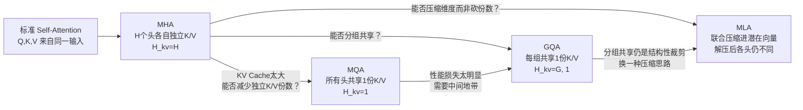
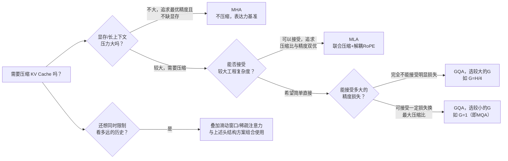

# Attention 变体全景综述：从 Self-Attention 到 MHA、MQA、GQA、MLA

> **综述范围**：Transformer 中注意力机制的头结构演化——自注意力（Self-Attention）的基本形式 → 多头注意力（MHA） → 多查询注意力（MQA） → 分组查询注意力（GQA） → 多头潜在注意力（MLA），并简要提及稀疏注意力、滑动窗口注意力这类"改变注意力计算范围"的正交路线。目标是让读者理解每一种变体在解决上一代的什么具体问题，并能根据自己的部署场景（模型规模、上下文长度、显存预算）判断该选哪条路线。
> **关键词**：Self-Attention、Multi-Head Attention、Multi-Query Attention、Grouped-Query Attention、Multi-head Latent Attention、KV Cache、低秩压缩、推理效率
> **适用读者**：有基本线性代数和概率基础的本科生，想搞清楚"为什么大模型的注意力机制会演化出这么多变体、各自解决了什么问题"的入门者

---

## 相关阅读

在开始之前，建议先了解（或随时回来查阅）以下内容：

- [KV-Cache 与自回归解码](/前置知识/002m_前置知识_KV_Cache与自回归解码) — 本文全程讨论的核心矛盾都围绕 KV Cache 展开，这篇讲清楚它的产生原理和显存公式
- [Causal Attention 因果注意力掩码](/前置知识/001g_前置知识_Causal_Attention因果注意力掩码) — 自回归生成的基础机制
- [MQA：多查询注意力](/前置知识/005a_前置知识_MQA_多查询注意力) — 本文第三节的完整机制推导和数值走查
- [分组查询注意力 GQA](/前置知识/002l_前置知识_分组查询注意力GQA) — 本文第四节的完整机制推导和数值走查
- [MLA：多头潜在注意力](/前置知识/005b_前置知识_MLA_多头潜在注意力) — 本文第五节的完整机制推导，含解耦 RoPE
- [DeepSeek-V2 MLA 精读](/论文综述/104_DeepSeekV2_MLA多头潜在注意力) — MLA 的原始论文精读，含核实过的实测数字
- [RoPE 旋转位置编码](/前置知识/002k_前置知识_RoPE旋转位置编码) — 理解 MLA 解耦 RoPE 设计需要的基础

---

## 贯穿全文的例子：7B 模型处理长文本时的 KV Cache 显存对比

本文全程使用同一个具体场景衡量不同注意力变体的差异：

> **场景**：部署一个 7B 参数规模的自回归语言模型（32 层，32 个注意力头，每头维度 128，隐藏维度 4096），处理一段 2048 token 的长文本，用 bfloat16（每个数字占 2 字节）存储 KV Cache。

这个场景会在每一节引入新变体时被反复代入，用同一套数字直观展示"注意力头结构"这一个设计选择如何直接决定了推理时的显存开销。

---

## 一、核心矛盾：KV Cache 的大小和模型表达力互相拖累

### 1.1 问题的起点

自回归生成时，模型生成第 $t$ 个 token 需要用它的 Query 向量查询前面所有 $t-1$ 个 token 的 Key、Value。为了避免每步都重新计算历史 token 的 K、V，实践中会把已经算好的 K、V 缓存下来——这就是 KV Cache，具体产生机制见 [KV-Cache 与自回归解码](/前置知识/002m_前置知识_KV_Cache与自回归解码)。

KV Cache 的显存占用公式是：

$$
\text{KV Cache 显存} = 2 \times L \times S \times H_{\text{kv}} \times d_h \times \text{bytes}
$$

**这个公式在做什么**：五个因子相乘，算出整个模型处理一条序列时，KV Cache 总共要占用多少字节的显存。

::: details 📐 公式详解（点击展开）

| 子表达式 | 它是谁 | 它在干嘛 |
|---------|--------|---------|
| $2$ | **两份账本** | Key 和 Value 各存一份 |
| $L$ | **层数** | 每层独立缓存，缺一不可 |
| $S$ | **序列长度** | 已处理的 token 数，缓存随它线性增长 |
| $H_{\text{kv}}$ | **KV 头数** | 决定每个 token 要存几份独立的 Key/Value——本文所有变体的核心分歧点 |
| $d_h$ | **每头维度** | 每份 Key/Value 向量本身的大小 |

**用人话读**："KV Cache 大小 = 2（K和V）× 层数 × 序列长度 × KV头数 × 每头维度 × 每个数占的字节数。"

**为什么是这个形式**：这是纯粹的存储量清点，唯一有设计空间的自由度是 $H_{\text{kv}}$——标准做法里它恒等于 Query 头数 $H$，本文接下来的每一种变体，都是在想办法压缩这个 $H_{\text{kv}}$（或者绕开它），同时尽量不损失模型表达力。
:::

代入贯穿全文的例子（$L=32, S=2048, d_h=128$，bf16），标准配置下 $H_{\text{kv}}=H=32$：

$$
2 \times 32 \times 2048 \times 32 \times 128 \times 2 = 1024 \text{ MB}
$$

**这个公式在做什么**：把本文贯穿全文场景（7B 模型标准配置）代入上面的显存公式，算出标准 MHA 下单条序列的 KV Cache 具体占用多少显存。

::: details 📐 公式详解（点击展开）

| 子表达式 | 它是谁 | 它在干嘛 |
|---------|--------|---------|
| $32$（层数） | **$L=32$** | 本文场景设定的层数 |
| $2048$ | **$S=2048$** | 本文场景设定的序列长度 |
| $32$（头数） | **$H_{\text{kv}}=32$** | 标准配置下等于 Query 头数，是后续所有变体要压缩的目标 |
| $128$ | **$d_h=128$** | 本文场景设定的每头维度 |
| $2$（末位） | **bf16 字节数** | 每个数占 2 字节 |
| $1024\text{ MB}$ | **基准显存占用** | 后续 MQA/GQA/MLA 的压缩效果都会和这个数字对比 |

**用人话读**："把本文设定的具体配置数字代入公式，标准做法下一条 2048 长度的序列要占 1024 MB 显存，这是后续所有对比的基准线。"

**为什么是这个形式**：纯数值代入，目的是把抽象公式变成一个直观的"1 GB"基准数字，方便后面每一种变体直接对比压缩比例。
:::

单条 2048 长度的序列就要占用 1 GB 显存——如果要支持长上下文（如 32K token）或大批量并发推理，这个数字会线性膨胀到几十甚至上百 GB。这正是"KV Cache 是长上下文、大批量推理场景下显存第一大瓶颈"这个判断的具体数字依据。

### 1.2 核心矛盾的技术性表述

所有后续变体面对的都是同一个矛盾：**$H_{\text{kv}}$ 越小，缓存越省，但模型能表达的信息也越少**。这个矛盾具体拆解成一个可以画成决策树的技术问题：

> **要不要保留"每个 Query 头都有自己独立的 Key/Value"这个性质？如果不保留，是通过减少独立 K/V 的"份数"来省，还是通过压缩每份 K/V 的"维度"来省？**

这个问题把本文要讲的四条路线自然地分开：

- **MHA**：保留，$H_{\text{kv}} = H$，不做任何压缩，是所有变体的基准
- **MQA**：不保留，直接把份数砍到 1（$H_{\text{kv}}=1$，所有头共享唯一一份）
- **GQA**：不保留，把份数砍到中间的 $G$ 组（$1 < G < H$，MHA 和 MQA 之间的插值）
- **MLA**：保留"每个头看到的 K/V 各不相同"这个性质，但通过压缩维度（而不是砍份数）来省缓存

下图是这四条路线在整个技术图谱中的位置：

---

## 二、基准线：Self-Attention 与 MHA

### 2.1 Self-Attention 的基本形式

自注意力（Self-Attention）让序列中每个位置都能直接和其他所有位置计算关联度：

$$
\text{Attention}(Q,K,V) = \text{softmax}\left(\frac{QK^T}{\sqrt{d_k}}\right)V
$$

**这个公式在做什么**：每个位置的 Query 和所有位置的 Key 做点积算相关度，归一化成权重后，按权重加权汇总所有位置的 Value。

::: details 📐 公式详解（点击展开）

| 子表达式 | 它是谁 | 它在干嘛 |
|---------|--------|---------|
| $Q, K, V$ | **提问、索引、内容三件套** | 分别代表"想查什么"、"能被怎么查到"、"查到后拿什么" |
| $QK^T$ | **两两关联度打分表** | 每个位置和每个位置之间的相似度矩阵 |
| $\sqrt{d_k}$ | **缩放因子** | 防止点积数值过大导致 softmax 梯度消失 |
| $\text{softmax}(\cdot)$ | **归一化打分** | 转成每行加起来等于 1 的权重分布 |
| $(\cdot)V$ | **按权重取内容** | 加权汇总所有位置的 Value |

**用人话读**："每个位置都问一遍序列里所有位置'你和我有多相关'，再按相关程度加权拼出自己的新表示。"

**为什么是这个形式**：这是所有本文变体共同的计算内核——从 MHA 到 MLA，改变的只是"Q、K、V 各自有几套独立的版本"，Attention 本身的计算公式从未改变。完整拆解和数值代入见 [KV-Cache 前置知识第一节](/前置知识/002m_前置知识_KV_Cache与自回归解码#一前置概念先搞清楚-attention-的-qkv-是什么)。
:::

### 2.2 MHA：多套 Q/K/V 并行工作

多头注意力（Multi-Head Attention, MHA）把单一的 Q/K/V 切分成 $H$ 组独立的头，每组各自做一次 Attention 再拼接：

$$
Q = XW_Q, \quad K = XW_K, \quad V = XW_V \qquad \text{（各自切分成 } H \text{ 个头）}
$$

**这个公式在做什么**：用三个不同的线性投影层，把同一份输入变成三种不同用途的表示，再切分成 $H$ 个头并行计算多组不同的注意力。

::: details 📐 公式详解（点击展开）

| 子表达式 | 它是谁 | 它在干嘛 |
|---------|--------|---------|
| $X$ | **共同原料** | 上一层输出的隐藏向量，是 Q/K/V 三路投影共同的输入 |
| $W_Q, W_K, W_V$ | **三把不同的钥匙** | 把同一个 $X$ 加工成三种不同用途的表示 |
| 切分成 $H$ 个头 | **多组独立视角** | 每个头可以学习关注序列中不同类型的模式（语法、指代、语义等） |

**用人话读**："同一份输入过三个不同的线性层得到 Q/K/V，再各自切成 $H$ 份，让 $H$ 个头各自独立地做一次注意力计算，最后把结果拼起来。"

**为什么是这个形式**：多头设计让模型能同时捕捉多种不同的关注模式，是 Transformer 表达力的重要来源；但代价是 $H$ 个头各自需要独立的 Key、Value，KV Cache 的大小直接和 $H$ 成正比——这正是本文要讲的所有后续变体想要削减的地方。完整推导见 [GQA 前置知识第一节](/前置知识/002l_前置知识_分组查询注意力GQA#一先回顾标准多头注意力mha的开销在哪)。
:::

MHA 是本文的**基准线**：表达力最强，但 KV Cache 也最大（本文例子中的 1024 MB）。

### 2.3 为什么多头设计天然导致缓存和头数成正比

值得在这里把因果关系讲透，因为这是本文后续所有变体的出发点。标准 MHA 里，$W_K, W_V$ 这两个投影矩阵的输出维度是 $H \times d_h$——也就是说，模型为每一个头都单独学习了一套专属的 Key、Value 表示。这不是偶然的设计，而是多头注意力发挥表达力的直接机制：不同的头可以在训练中"分工"，比如一个头专注于捕捉主谓关系，另一个头专注于捕捉指代关系，第三个头专注于捕捉长距离的语义关联——这种分工要求每个头能看到**为它量身定制**的 Key、Value 内容，如果所有头共享同一份，分工就无从谈起。

但这个"量身定制"的代价是：推理时需要缓存的数据量，随头数 $H$ 线性增长。这就是本文第一节公式里 $H_{\text{kv}}$ 这一项的来源——它不是一个可以随意设置的旁枝末节参数，而是直接决定了"模型分工精细程度"和"推理时显存开销"这两件事的拉锯点。理解了这一点，后面无论是 MQA 的"完全不分工"，还是 GQA 的"部分分工"，还是 MLA 的"用压缩的方式保留分工"，都可以被理解成对这同一个拉锯点采取的不同立场。

---

## 三、路线一：MQA——把独立 K/V 份数砍到 1

### 3.1 核心机制回顾

多查询注意力（Multi-Query Attention, MQA）让所有 $H$ 个 Query 头共享唯一一份 Key、Value：

$$
\mathbf{q}_t = W_Q \mathbf{h}_t \in \mathbb{R}^{H \cdot d_h}, \qquad \mathbf{k}_t = W_K \mathbf{h}_t \in \mathbb{R}^{d_h}, \qquad \mathbf{v}_t = W_V \mathbf{h}_t \in \mathbb{R}^{d_h}
$$

**这个公式在做什么**：Query 投影维度不变（仍覆盖 $H$ 个头），但 Key、Value 投影只输出一个头大小的向量，所有 Query 头之后都查询这唯一一份。

::: details 📐 公式详解（点击展开）

| 子表达式 | 它是谁 | 它在干嘛 |
|---------|--------|---------|
| $\mathbf{q}_t$ | **32份不同的提问** | Query 头数不变，多样性完整保留 |
| $\mathbf{k}_t, \mathbf{v}_t$ | **唯一的一份情报** | 不切分成多头，所有 Query 头之后共享它 |

**用人话读**："Query 还是老老实实算出多份不同的提问，但 Key、Value 只算一份，所有头共用。"

**为什么是这个形式**：赌的是"信息多样性主要来自提问角度（Query），而不是被检索内容的份数（K/V）"——完整机制、数值走查、代码实现见 [MQA 前置知识](/前置知识/005a_前置知识_MQA_多查询注意力)。
:::

### 3.2 收益与代价（本文例子的具体数字）

代入贯穿全文的例子，$H_{\text{kv}}=1$：

$$
2 \times 32 \times 2048 \times 1 \times 128 \times 2 = 32 \text{ MB}
$$

**这个公式在做什么**：把 $H_{\text{kv}}$ 从基准配置的 32 改成 MQA 的 1，其余因子不变，重新计算同一条序列的 KV Cache 大小。

::: details 📐 公式详解（点击展开）

| 子表达式 | 它是谁 | 它在干嘛 |
|---------|--------|---------|
| $1$（头数位置） | **MQA 下的 $H_{\text{kv}}$** | 本文场景里唯一变化的因子，从基准的 32 降到 1 |
| 其余因子 | **保持不变** | 层数、序列长度、每头维度、字节数都和基准计算一致 |
| $32\text{ MB}$ | **压缩后的结果** | 相比基准 1024 MB 缩小到 1/32 |

**用人话读**："只把 KV 头数从 32 改成 1，其他都不变，重新算一遍，显存占用变成基准的 1/32。"

**为什么是这个形式**：$H_{\text{kv}}$ 在显存公式里是纯线性因子，这也是本文后续对比 GQA 不同分组数时能直接按比例换算压缩倍数的原因。
:::

相对 MHA 的 1024 MB，**缩小 32 倍**——这个倍数正好等于头数 $H$。

代价是实测性能明显下降。DeepSeek-V2 论文（arXiv:2405.04434）Appendix D.1 训练了三个参数量对齐到 7B、结构完全相同的模型，只有注意力机制不同：

| 基准（指标） | MHA | GQA | MQA |
|-------------|-----|-----|-----|
| BBH（EM，3-shot） | 37.0 | 35.6 | 33.2 |
| MMLU（Acc，5-shot） | 45.2 | 41.2 | 37.9 |
| C-Eval（Acc，5-shot） | 42.9 | 37.7 | 30.0 |
| CMMLU（Acc，5-shot） | 43.5 | 38.4 | 34.6 |

四项全部呈现 MHA > GQA > MQA 的规律，MQA 相对 MHA 在 MMLU 上掉 7.3 点，C-Eval 上掉近 13 点——"砍到极限"的代价是实打实的。

### 3.3 损失的机制：素材库被锁死

结合第二节 2.3 小节讲的"分工"直觉，可以更精确地描述 MQA 损失表达力的机制。MQA 保留了 Query 的完整多样性——$H$ 个头依然可以各自学习不同的"提问角度"，这部分能力没有损失。但 Key、Value 只有一份，意味着不同头能拿来回答这些提问的**素材库**被压缩成了同一份：本来某个头可以专门学一份擅长捕捉语法结构的 Key/Value，另一个头专门学一份擅长捕捉长距离语义的 Key/Value，现在这两个头被迫从同一份素材里各自挑选，素材本身的信息容量成了瓶颈。

这也解释了为什么表格里"越难的任务、损失越明显"——C-Eval、CMMLU 这类需要精细知识检索、多步推理的任务，恰恰最依赖"不同头能各自专精不同类型信息"这种分工能力，而 MQA 削弱的正是这个能力；相对而言，一些更依赖表层模式匹配的简单任务，损失可能没有这么明显。

---

## 四、路线二：GQA——在 MHA 和 MQA 之间插值

### 4.1 核心机制回顾

分组查询注意力（Grouped-Query Attention, GQA）把 $H$ 个 Query 头分成 $G$ 组（$1 < G < H$），组内共享一份 K/V：

$$
n_{\text{rep}} = \frac{H}{G}, \qquad K^{\text{rep}} = \text{repeat\_interleave}(K, n_{\text{rep}})
$$

**这个公式在做什么**：算出每组 KV 头要被多少个 Query 头共享，再把只有 $G$ 组的 K/V 临时展开成 $H$ 组参与计算——但真正存进缓存的依然只有 $G$ 组。

::: details 📐 公式详解（点击展开）

| 子表达式 | 它是谁 | 它在干嘛 |
|---------|--------|---------|
| $n_{\text{rep}}=H/G$ | **组内共享人数** | 每组 KV 头平均分给多少个 Query 头用 |
| $\text{repeat\_interleave}$ | **临时展开器** | 计算时对齐用，存储时依然精简 |

**用人话读**："Query 头分成 $G$ 组，组内共享一份 K/V；计算时临时把 K/V 复制展开对齐，但缓存里始终只存 $G$ 组。"

**为什么是这个形式**：$G$ 是一个可调节的旋钮，$G=H$ 退化为 MHA，$G=1$ 退化为 MQA——完整数值走查、代码实现见 [GQA 前置知识](/前置知识/002l_前置知识_分组查询注意力GQA)。
:::

### 4.2 GQA 是连续可调的插值方案

| $G$ 的取值 | KV Cache（本文例子） | 相对 MHA 倍数 |
|-----------|----------------------|---------------|
| $G=32$（即 MHA） | 1024 MB | 1× |
| $G=8$ | 256 MB | 1/4 |
| $G=4$ | 128 MB | 1/8 |
| $G=1$（即 MQA） | 32 MB | 1/32 |

GQA 的价值在于它是一个**连续可调的旋钮**：不需要在"MHA 的完整表达力"和"MQA 的极致压缩"之间二选一，而是可以根据具体场景的显存预算，选一个中间的 $G$，用可控的性能代价换取可控的缓存压缩比例——这也是为什么 GQA 是目前工业界大模型最常用的默认选择（如 Llama 3、Qwen 系列的多数版本）。

---

## 五、路线三：MLA——不砍份数，压缩维度

### 5.1 GQA/MQA 路线的共同局限

MQA 和 GQA 的手段本质相同：都是让若干个 Query 头**强制共享**完全相同的 K/V 内容，这是一种没有商量余地的结构性裁剪——被合并到一组的 Query 头之间完全没有缓和空间。DeepSeek-V2 论文提出 MLA 的动机正是这个局限：GQA/MQA 确实需要更小的 KV Cache，但性能"达不到 MHA 的水平"（论文原文），团队想要"两者都要"（the best of both worlds）。

### 5.2 核心机制：联合压缩而不是砍头数

多头潜在注意力（Multi-head Latent Attention, MLA）把每个 token 的 K、V 联合压缩进一个低维潜在向量，缓存这个小向量，需要时再解压：

$$
\mathbf{c}_t^{KV} = W^{DKV} \mathbf{h}_t \qquad (\text{压缩}), \qquad \mathbf{k}_t^C = W^{UK} \mathbf{c}_t^{KV}, \quad \mathbf{v}_t^C = W^{UV} \mathbf{c}_t^{KV} \qquad (\text{解压})
$$

**这个公式在做什么**：先把高维隐藏向量压缩成一个远小的潜在向量并缓存它，需要做注意力计算时，再用两个专门的投影矩阵分别还原出完整的 Key 和 Value——还原后每个头依然各不相同。

::: details 📐 公式详解（点击展开）

| 子表达式 | 它是谁 | 它在干嘛 |
|---------|--------|---------|
| $W^{DKV}$ | **压缩滤镜（下投影）** | 把 $d$ 维打包压缩成远小的 $d_c$ 维 |
| $\mathbf{c}_t^{KV}$ | **缩略图** | 唯一需要缓存的东西 |
| $W^{UK}, W^{UV}$ | **两个独立的还原滤镜** | 各自把缩略图还原成覆盖全部 $H$ 个头的完整 K/V |

**用人话读**："把 token 的隐藏向量压缩成一个小小的潜在向量存起来，需要用时再用两个不同的滤镜分别还原出完整的 Key 和 Value——还原出来的每个头依然是各不相同的。"

**为什么是这个形式**：这是低秩投影的思路——K、V 这类特征存在冗余，可以用远低于原始维度的子空间近似表达，且压缩/解压矩阵是可学习的，训练过程会自动保留对任务最有用的信息方向，不像 MQA/GQA 那样一刀切丢弃。完整机制、和 RoPE 的冲突及解耦方案见 [MLA 前置知识](/前置知识/005b_前置知识_MLA_多头潜在注意力)。
:::

**这是 MLA 和 MQA/GQA 的本质区别**：MQA/GQA 是从源头上就只生产一份或几份 K/V；MLA 让所有头依然各自拿到不同的 K/V，只是这份"各不相同"是从共享的低维潜在向量里解压出来的。

### 5.3 收益：缓存压缩比 + 性能反超

DeepSeek-V2 的具体配置（$d_c=4d_h=512$，加上解耦 RoPE 部分 $d_h^R=64$）使得 MLA 每 token 缓存元素数等效于 GQA 只有 **2.25 组**——但论文 Appendix D.2 的同规模对照实验显示，MLA 的表达力不仅没有像 MQA/GQA 那样下降，反而**持平甚至超过了完整 32 组（即 MHA）**：

| 规模 | 注意力机制 | KV Cache（元素数/token） | BBH | MMLU | C-Eval | CMMLU |
|------|-----------|---------------------------|-----|------|--------|-------|
| Small MoE | MHA | 110.6K | 37.9 | 48.7 | 51.6 | 52.3 |
| Small MoE | MLA | 15.6K（14%） | 39.0 | 50.0 | 50.9 | 53.4 |
| Large MoE | MHA | 860.2K | 46.6 | 57.5 | 57.9 | 60.7 |
| Large MoE | MLA | 34.6K（4%） | 50.7 | 59.0 | 59.2 | 62.5 |

数据来源：DeepSeek-AI, *DeepSeek-V2*, arXiv:2405.04434, Appendix D.2, Table 9。完整数字核实和论文精读见 [DeepSeek-V2 MLA 精读](/论文综述/104_DeepSeekV2_MLA多头潜在注意力)。

在完整规模的系统级对比中（DeepSeek-V2 236B/21B vs 前代 DeepSeek 67B 稠密模型），论文汇报 KV Cache 降低 **93.3%**，单节点 8×H800 最大生成吞吐提升到 **5.76 倍**——需要说明的是这两个数字混合了 MLA、DeepSeekMoE 稀疏激活、KV Cache 量化、FP8 权重部署等多重因素的共同作用，并非 MLA 单一机制的严格消融结果，具体拆分见精读文章第四节。

### 5.4 代价：和 RoPE 的兼容性问题

MLA 不是没有代价。RoPE（旋转位置编码）的旋转矩阵和位置相关，无法被离线吸收进 MLA 依赖的关键推理优化（$W^{UK}$ 吸收进 $W_Q$），直接套用会破坏这个优化。DeepSeek-V2 用"解耦 RoPE"解决——单独开一条小通道专门携带位置信息，主体压缩通道完全不碰 RoPE。这个方案增加了实现复杂度，是 MLA 相比 MQA/GQA 工程上更"重"的地方，具体机制见 [MLA 前置知识第四节](/前置知识/005b_前置知识_MLA_多头潜在注意力#四rope-遇到的麻烦为什么不能直接套用)。

---

## 六、正交路线：改变注意力的"计算范围"而非"头结构"

本文第三到第五节讲的 MQA/GQA/MLA，共同思路都是压缩**每个 token 要缓存多少数据**，但没有改变"每个 token 要和多少个历史 token 做注意力计算"这件事——它们依然是对全部历史 token 做完整的注意力。还有一条完全正交的路线，是从"缩小计算范围"这个角度入手：

**滑动窗口注意力（Sliding Window Attention）**：每个 token 只和最近的固定窗口（比如最近 4096 个 token）内的历史做注意力，超出窗口的更早历史被直接丢弃或者用别的机制处理。这样 KV Cache 大小不再随序列总长度无限增长，而是被窗口大小封顶——代价是模型原则上无法直接检索窗口以外的信息，需要依赖网络更深层逐步传递远距离信息（类似卷积网络里堆叠层数扩大感受野的思路）。

**稀疏注意力（Sparse Attention）**：不强制用连续窗口，而是让每个 token 按某种预设或学习出的模式，只和一个稀疏子集的历史 token 做注意力（比如固定间隔采样、加一些全局锚点 token 等），试图在"看不到全部历史"和"计算量可控"之间找折中。

这条路线和 MQA/GQA/MLA 不是互斥的——完全可以叠加使用（比如用滑动窗口限制计算范围，同时用 GQA 压缩每个窗口内的头结构），两者分别解决"看多远"和"每个位置存多少"这两个不同维度的问题，具体的稀疏/滑窗注意力机制设计和消融实验数据本文不展开，值得后续单独成篇讨论。

### 6.1 为什么这条路线值得单独归类

回到第一节的技术性表述——本文第三到第五节的所有变体，回答的都是"要不要保留每个 Query 头独立的 K/V、如果不保留怎么压缩"这一个问题，这个问题的答案改变的始终是**每个 token 要存多少数据**。而滑动窗口/稀疏注意力回答的是一个完全不同的问题：**每个 token 到底需要和多少个其他 token 发生关联**。

用一个具体的类比说明两者的区别：如果把 KV Cache 想象成一个图书馆的藏书目录——

- MQA/GQA/MLA 讨论的是"每一本书的索引卡片要写多详细、要不要几本书共用一张卡片"
- 滑动窗口/稀疏注意力讨论的是"读者查阅资料时，要不要允许他去查阅图书馆里的每一本书，还是只让他查最近上架的一批书"

这两个问题互不冲突，图书馆完全可以同时决定"索引卡片精简一些"和"只对外借阅最近的书"。

### 6.2 滑动窗口注意力的具体机制

滑动窗口注意力的具体做法是给每个 token 设一个固定大小的窗口 $W$（比如 4096），要求它只能和位置在 $[t-W, t]$ 范围内的历史 token 计算注意力，超出这个范围的更早历史直接被排除在计算之外。这样一来，KV Cache 的大小有了一个硬上限——不管序列总长度增长到多少，缓存最多只保留最近 $W$ 个 token 的 K/V，超出窗口的部分可以直接从缓存里丢弃。

这个设计的代价很直观：如果任务需要模型"记住"发生在窗口以外很久之前的信息（比如一篇长文档开头提到的设定，后面结尾处需要精确引用），单纯的滑动窗口做不到直接检索——它依赖网络堆叠多层之后，信息能通过层与层之间的传递逐渐扩散到更远的距离（类似卷积网络里堆叠卷积层扩大感受野的原理），但这种间接传递不如注意力"直接看到"来得精确。因此不少实际系统会把滑动窗口和"全局 token"结合——除了窗口内的局部 token，额外保留少量固定的"全局锚点"（比如序列最开头的几个 token，或者专门插入的特殊标记），让模型即使在窗口注意力的限制下，也始终能直接看到这些关键的全局信息。

### 6.3 稀疏注意力的具体机制

稀疏注意力比滑动窗口更进一步，不局限于"连续窗口"这一种稀疏模式，而是允许任意预先设定或者训练学出的稀疏关联模式。常见的具体方案包括：固定间隔采样（每隔若干个位置采样一个历史 token，而不是连续采样）、局部窗口加全局锚点的组合（和上一节的思路类似）、以及让模型自己学习该关注哪些位置的可学习稀疏模式。这类方法的共同目标是把原本 $O(L^2)$ 的注意力计算量降低到 $O(L \log L)$ 甚至 $O(L)$，同时尽量保留"模型能看到足够多样的历史信息"这个性质。

需要说明的是，滑动窗口/稀疏注意力这条路线的具体消融实验、不同稀疏模式之间的效果对比，以及它们各自在实际大模型（如部分开源模型采用的局部+全局混合注意力层交替设计）中的具体配置细节，超出了本文的讨论范围——本文的目的只是帮助读者建立一个清晰的定位：这是一条和头结构压缩完全正交的路线，理解了这一点，遇到具体的稀疏注意力论文时就能准确判断它解决的是哪个维度的问题，值得后续单独写一篇前置知识或综述展开。

---

## 七、全景对比

### 7.1 KV Cache 大小可视化对比

下图展示了本文贯穿全文例子（7B 模型，$L=32, H=32, d_h=128, S=2048$，bf16）下，各注意力变体的 KV Cache 大小对比：

> 图中 MHA（1024 MB）是基准，GQA 随分组数 $G$ 从 8 降到 4 时缓存线性减半，MQA（32 MB）是 GQA 在 $G=1$ 时的极限情况，MLA（约 72 MB，对应 DeepSeek-V2 论文配置 $d_c+d_h^R=576$ 元素/token）虽然缓存大小介于 GQA 不同分组数之间，但如前文实测数据所示，其表达力不降反升——这正是"压缩维度"而非"砍份数"这条思路的价值所在。

### 7.2 全景对比表

| 维度 | MHA | MQA | GQA | MLA |
|------|-----|-----|-----|-----|
| 压缩手段 | 无压缩（基准） | 砍 KV 头数到 1 | 砍 KV 头数到 $G$ 组 | 联合压缩进低维潜在向量 |
| 每个头看到的 K/V | 各自独立 | 所有头共享同一份 | 组内头共享同一份 | 解压后各头依然不同 |
| KV Cache（本文例子） | 1024 MB | 32 MB（1/32） | 128~256 MB（依 $G$） | 约 72 MB（等效 GQA 2.25 组） |
| 实测表达力（DeepSeek-V2 数据） | 基准 | 明显下降（MMLU -7.3点） | 介于 MHA 和 MQA 之间 | 持平或反超 MHA |
| 和 RoPE 的兼容性 | 直接兼容 | 直接兼容 | 直接兼容 | 需解耦 RoPE 额外处理 |
| 工程实现复杂度 | 低 | 低 | 低（业界最广泛采用） | 较高 |
| 代表模型 | 早期 Transformer、GPT-2/3 | PaLM（部分配置） | Llama 2/3、Qwen 系列多数版本 | DeepSeek-V2/V3、DeepSeek-R1 |

### 7.3 决策流程图

### 7.4 给读者的实践建议

1. **不缺显存、追求最优精度、模型规模不大**：直接用 MHA，没必要引入额外复杂度。
2. **需要适度压缩缓存、工程简单优先**：GQA 是目前工业界最主流的默认选择，选一个 $G$（常见 $H/4$ 到 $H/8$）就能在几乎不损失下游效果的前提下把缓存压小 4-8 倍。
3. **需要极致压缩缓存、能接受一定精度损失**：MQA 提供最大压缩比（等效 $G=1$），但如第三节数据所示，在困难基准上损失比 GQA 明显得多，适合对精度不那么敏感、极度追求推理速度的场景。
4. **超大规模模型、有工程能力investment、想要"既要又要"**：MLA 是目前公开报道中唯一同时做到"缓存压缩比接近甚至超过 MQA/GQA 极限配置"又"表达力反超 MHA"的方案，但需要额外实现解耦 RoPE，工程复杂度是四条路线里最高的，适合有足够工程资源投入的大规模训练场景（如 DeepSeek-V2/V3 这个量级）。
5. **同时还面临"上下文长度本身就很长"的问题**：可以把本文的头结构压缩方案，和第六节提到的滑动窗口/稀疏注意力叠加使用——两者解决的是正交的两个维度（存多少 vs 看多远），组合使用能获得叠加的收益。
6. **正在做架构选型、需要向团队解释取舍**：可以用本文第一节的技术性问题作为汇报框架——先确认"要不要保留每个头独立的 K/V"，如果要压缩，再确认"通过减少份数还是压缩维度"，最后确认"是否需要叠加限制计算范围的方案"。这个三层问题能覆盖本文讨论的全部技术空间，也是判断一个新论文提出的注意力变体到底属于哪条路线的实用工具。

### 7.5 一个容易被忽视的判断维度：训练稳定性

除了 KV Cache 大小和下游任务精度这两个最容易量化对比的维度，本文在第三节提到过 MQA 还存在训练不稳定的问题——这一点在实践中同样值得纳入选型考量，但常常被单纯看基准分数的对比表格忽略。共享投影层（$W_K, W_V$ 只有一份要同时满足所有头的需求）在训练早期，梯度信号可能会在不同头的"诉求"之间反复拉扯，导致损失曲线震荡或者收敛变慢，这在小规模实验里体现为需要更精细的学习率调参或者更长的训练步数才能达到和 MHA/GQA 相当的最终效果。GQA 由于分组数 $G$ 可以调节到不那么极端的程度（比如 $G=8$ 而不是 $G=1$），这个训练稳定性问题通常不会像 MQA 那样明显。MLA 由于依然保留了"每个头独立"的性质（只是共享压缩后的潜在向量），也不存在这种极端的共享投影层压力。这个维度提醒我们：选型时不能只看论文汇报的最终基准分数，还要考虑达到这个分数所需的训练成本和调参难度。

---

## 八、总结

Attention 头结构的演化史，本质上是围绕"KV Cache 的大小和模型表达力互相拖累"这一个核心矛盾展开的权衡：

- **MHA** 是没有任何压缩的基准，表达力最强，但 KV Cache 随头数线性增长，是所有后续变体想要优化的起点
- **MQA** 选择了最激进的压缩——把所有 Query 头强制共享唯一一份 K/V，换来最大压缩比（本文例子中 32 倍），代价是实测表达力明显下降
- **GQA** 在 MHA 和 MQA 之间提供了一个连续可调的插值旋钮，用分组共享的方式让工程师能根据自己的场景在压缩比和精度之间找一个合适的中间点，是目前工业界最广泛采用的默认方案
- **MLA** 换了一条完全不同的思路——不砍独立 K/V 的份数，而是把每份的维度联合压缩进一个低维潜在向量，需要时再解压。这个思路带来的收益是实测表达力不降反升，但代价是需要额外处理和 RoPE 的兼容性问题（解耦 RoPE），工程实现复杂度更高
- **滑动窗口/稀疏注意力** 是一条正交的路线，从"缩小计算范围"而非"压缩每份缓存"入手，可以和前述任何头结构方案组合使用

理解了这条主线，遇到任何新的注意力变体时，读者应该能立刻问出正确的问题：**它压缩的是独立 K/V 的份数，还是每份的维度？压缩之后每个 Query 头看到的内容是否还保持差异？它和位置编码（如 RoPE）是否存在兼容性问题？**

## 延伸阅读

- [MQA：多查询注意力](/前置知识/005a_前置知识_MQA_多查询注意力) — 完整机制推导、数值走查、代码实现
- [分组查询注意力 GQA](/前置知识/002l_前置知识_分组查询注意力GQA) — 完整机制推导、数值走查、代码实现
- [MLA：多头潜在注意力](/前置知识/005b_前置知识_MLA_多头潜在注意力) — 完整机制推导、解耦 RoPE 详解
- [DeepSeek-V2 MLA 精读](/论文综述/104_DeepSeekV2_MLA多头潜在注意力) — 论文原始实验数据核实与精读
- [KV-Cache 与自回归解码](/前置知识/002m_前置知识_KV_Cache与自回归解码) — KV Cache 产生原理与显存公式完整推导
- [RoPE 旋转位置编码](/前置知识/002k_前置知识_RoPE旋转位置编码) — 理解解耦 RoPE 需要的基础机制
- [序列建模架构全景综述](/论文综述/S27_序列建模架构全景综述) — 更宏观视角下 Transformer 与其他序列建模架构（Mamba/RWKV）的对比
