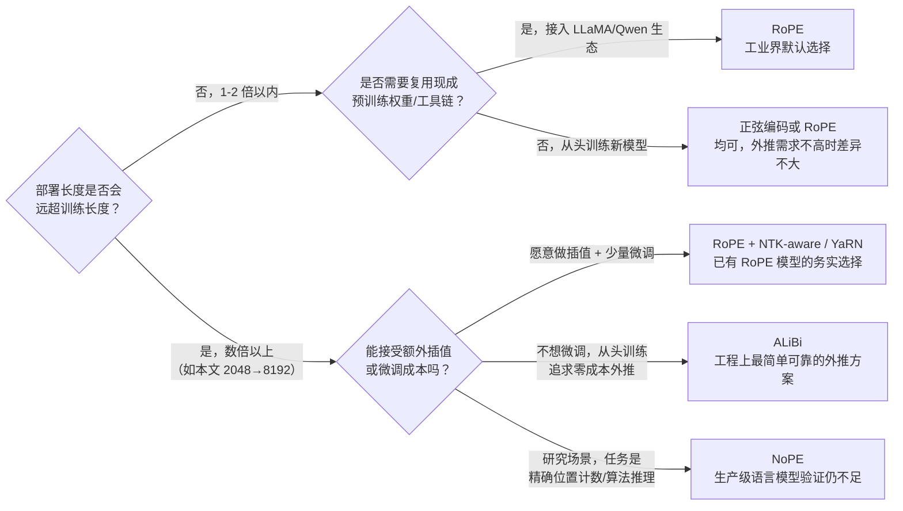

# 位置编码方法全景综述：从绝对位置到 RoPE、ALiBi、NoPE

> **综述范围**：Transformer 里所有主流的位置编码（Positional Encoding, PE）方案——可学习位置嵌入、正弦位置编码、RoPE（旋转位置编码）、ALiBi（线性偏置注意力）、NoPE（完全不编码）。目标不是逐个复述每种方法的公式推导（这些已经在对应的前置知识和精读文章里讲透了），而是把它们放进同一个技术图谱里，回答一个具体问题：**同一个模型，训练时只见过几千 token，部署时要处理几倍长的文档，该选哪种位置编码？**
> **关键词**：Positional Encoding、Absolute Position、Relative Position、RoPE、ALiBi、NoPE、Length Extrapolation、Out-of-Distribution Generalization
> **适用读者**：已经读过（或准备读）RoPE、ALiBi 单篇讲解的读者，想要一张"全局地图"把这些方法串起来

---

## 相关阅读

在阅读本文前，建议先了解：

- [标量条件编码：位置编码、时间步嵌入与随机傅里叶特征](/前置知识/001s_前置知识_标量条件编码_位置编码与时间步嵌入) — 可学习位置嵌入和正弦位置编码的完整公式推导，本文第二节直接引用其结论，不重复推导
- [RoPE：旋转位置编码的完整机制](/前置知识/002k_前置知识_RoPE旋转位置编码) — RoPE 旋转矩阵、多频率设计、相对距离性质的完整推导，本文第四节直接引用其结论
- [ALiBi：线性偏置注意力机制](/前置知识/005c_前置知识_ALiBi线性偏置位置编码) — ALiBi 线性惩罚项、斜率分配方案的完整推导，本文第五节直接引用其结论
- [长度外推与位置编码分布外泛化](/前置知识/005d_前置知识_长度外推与位置编码分布外泛化) — 长度外推问题的系统性框架和四类方案对比，本文的核心对比表在此基础上扩展
- [ALiBi 论文深度精读](/论文综述/105_ALiBi_线性偏置位置编码长度外推) — ALiBi 原论文的逐段精读，含正弦/RoPE/T5 bias 的实测对比数据
- [Cross-Attention 与交替注意力机制](/前置知识/001e_前置知识_Cross_Attention与交替注意力机制) — Attention 机制本身的计算流程，理解"位置信息注入到哪一步"的前提

---

## 贯穿全文的例子

> **场景**：一家公司训练了一个通用文档处理模型，受显存和训练成本限制，训练时把所有文档切成不超过 **2048** 个 token 的片段。上线后，客户上传的合同、技术手册、会议记录经常长达 **8192** 个 token（是训练长度的 4 倍）。模型必须在没有针对这个长度重新训练的前提下，尽量稳定地处理这些"没见过这么长"的输入。
>
> 这个场景和 [ALiBi 前置知识](/前置知识/005c_前置知识_ALiBi线性偏置位置编码)、[长度外推前置知识](/前置知识/005d_前置知识_长度外推与位置编码分布外泛化) 里用的场景是同一个叙事——本文接下来每引入一种位置编码方案，都会回到"训练 2048、部署 8192"这组具体数字，看这种方案在这个具体场景下会发生什么。

---

## 一、核心矛盾：Attention 天生看不见顺序，但"怎么让它看见"决定了外推死活

### 1.1 问题的起点

[RoPE 前置知识第一节](/前置知识/002k_前置知识_RoPE旋转位置编码#一为什么self-attention需要额外的位置信息) 已经证明过：Self-Attention 是关于输入 token 集合的一个置换等变（permutation-equivariant，即打乱输入顺序，计算结果只是被同样打乱，数值本身不变）函数——把序列 $[x_1,x_2,x_3]$ 换成 $[x_3,x_1,x_2]$，Attention 矩阵的每个元素只是被重新排列，模型完全"感觉不到"顺序变了。但语言和文档显然是有顺序的，所以必须有一种机制把"位置"这个信息显式注入进来。

这件事本身不难——历史上出现过至少五种不同的注入方式。真正难的问题是本文标题里暗含的那句话：**训练时模型只在某个长度范围内见过"位置"这个信号，部署时经常要处理更长的序列，这个信号一旦超出训练范围，模型的反应是可预测的还是随机的？**

### 1.2 统一框架：所有方法只是在回答"位置项加在哪、经不经过训练"

不管具体设计多么不同，所有位置编码方案都可以纳入同一个框架来看——把标准 Attention 打分展开写成"内容相关度"加"位置项"两部分：

$$
\text{Attn}(i, j) = \underbrace{\frac{q_i \cdot k_j}{\sqrt{d}}}_{\text{纯内容相关度}} \; + \; \underbrace{b(i, j)}_{\text{位置项}}
$$

**这个公式在做什么**：把任意一种位置编码方案都拆成"和位置无关的内容匹配"加上"专门负责表达位置关系的附加项"，不同方案的区别只在于这个附加项 $b(i,j)$ 是什么、以及它在计算流程的哪一步被"混入" $q_i, k_j$ 或最终分数里。

::: details 📐 公式详解（点击展开）

| 子表达式 | 它是谁 | 它在干嘛 |
|---------|--------|---------|
| $q_i, k_j$ | **纯内容向量** | token 内容经过线性变换得到的 Query/Key，理想情况下和位置无关 |
| $q_i \cdot k_j / \sqrt{d}$ | **内容匹配分数** | 标准 Attention 打分，衡量"这两个 token 内容上有多相关"，与哪个方案无关 |
| $b(i,j)$ | **位置项（本文的分类主角）** | 一个只依赖位置 $i,j$（或它们的差 $i-j$）的量，不同方案对它的定义、注入方式完全不同 |
| $\text{Attn}(i,j)$ | **最终的 Attention 分数** | 内容匹配 + 位置项之和，过 softmax 前的原始打分 |

**用人话读**："任何位置编码方案，本质上都是往'内容相关度'这个基础分数上，想办法掺一份'位置关系'的信息进去——差别只在于这份信息掺在哪一步、要不要经过训练。"

**为什么用这个框架划分方案**：因为 [长度外推前置知识第 1.3 节](/前置知识/005d_前置知识_长度外推与位置编码分布外泛化#13-一个关键的区分标准谁在处理分布外的位置信息) 已经证明，一个方案能不能外推，根本上取决于"处理 $b(i,j)$ 的环节里，是否包含只在训练范围内被调教过的可训练参数"。把所有方案摆到同一个 $b(i,j)$ 框架下，就能把"谁能外推、谁不能"这件事变成一道非常具体的问题：**这个 $b(i,j)$ 是在输入端被叠加、在每层被旋转进 $q,k$、还是被直接加到最终分数上？它经过了几层训练过的网络参数？**
:::

按照 $b(i,j)$ 的**注入方式**，本文把主流方案分成四条路线：

| 路线 | $b(i,j)$ 注入在哪一步 | 是否经过可训练参数 | 代表方法 |
|------|----------------------|-------------------|---------|
| 路线一：输入端叠加 | 加到 token embedding 上，再一起送进后续所有层 | 混入之后经过大量训练过的网络层 | 可学习位置嵌入、正弦位置编码 |
| 路线二：旋转 Q/K | 每一层都重新对 $q_i, k_j$ 做旋转变换再计算点积 | 旋转操作本身不训练，但后续利用旋转结果的网络层是训练出来的 | RoPE |
| 路线三：直接加到分数上 | 完全在 $q_i\cdot k_j$ 算完之后叠加，不影响 $q,k$ 本身 | 可以完全不训练（ALiBi），也可以训练一个共享偏置表（T5 bias） | T5 相对位置偏置、ALiBi |
| 路线四：不引入 $b(i,j)$ | 压根不存在这一项 | 不适用 | NoPE |

下面这张图把四条路线和它们的代表方法、以及路线之间"为解决上一条路线的问题而演进"的关系画在一起：

> 图中每条路线内部大致按时间先后排列，路线之间的箭头标注了"下一条路线主要解决了上一条路线暴露出的什么问题"。**注意这不是单纯的时间线**——路线三里的 ALiBi（2022）和路线二的 RoPE（2021）几乎同期，两者是解决同一个问题的两种不同技术选择，不是严格的先后替代关系；路线四的 NoPE 也不是要"取代"前三条路线，而是在特定任务（算法推理）上提供了另一种可能性，详见第六节。

---

## 二、路线一：输入端叠加——可学习位置嵌入与正弦位置编码

### 2.1 核心机制回顾（不重复推导，只总结结论）

路线一的两种方法都是在 token embedding 阶段，给每个位置生成一个向量，直接**加**到内容向量上，之后混合向量才送进 Transformer 的各层。两者的区别在于这个向量怎么来：

- **可学习位置嵌入（Learned Absolute Positional Embedding）**：本质是一张查表——给每个整数位置（0 到某个上限）训练一个专属向量，[标量条件编码前置知识第五节](/前置知识/001s_前置知识_标量条件编码_位置编码与时间步嵌入#五另外两条不同的路可学习位置嵌入与rope简要对比) 已经指出，这张表**只覆盖训练时见过的位置范围**。BERT、GPT-2 用的都是这类编码。
- **正弦位置编码（Sinusoidal Positional Encoding）**：用一组不同频率的正弦/余弦波组合生成编码向量，公式和推导细节见 [标量条件编码前置知识第二节](/前置知识/001s_前置知识_标量条件编码_位置编码与时间步嵌入#二概念阶段之一正弦位置编码transformer的原始方案)。这个公式本身对任意位置都有定义，理论上没有"表格用完"的问题。

### 2.2 回到例子：为什么这两种方法在"2048 训练、8192 部署"场景下都不行

**可学习位置嵌入**：假设嵌入表只训练到位置 2047。部署时第 2048 个 token 出现，模型压根没有对应的向量可用——工程上通常只能报错、硬截断输入到 2048、或者拿一个从未训练过的随机向量顶替，这几种处理方式都会让模型在这个位置的表现严重失真。这是路线一里最脆弱的方案，几乎不具备任何长度外推能力。

**正弦位置编码**：公式对位置 8191 一样能算出合法的编码向量，不存在"表格用完"的问题。但 [ALiBi 前置知识第 1.2 节](/前置知识/005c_前置知识_ALiBi线性偏置位置编码#12-具体验证alibi论文的实测数据) 引用的实测数据显示：训练长度 512 的模型，评估长度到训练长度的 7 倍（3512）时困惑度从 20.05 恶化到 178.97，几乎失效。换算到本文"2048 训练、8192 部署"（4 倍）的场景，可以预期困惑度同样会大幅恶化——问题不在编码公式本身，而在于**混合了位置信息的向量之后要经过若干层训练过的网络参数**，这些参数从未在训练中见过"位置 5000 的编码向量该被怎样处理"这类样本。

### 2.3 路线一的根本局限

路线一的两种方法有一个共同的结构性问题：**位置信息和内容信息在输入端就永久地混在一起**，之后 Attention 打分 $q_i \cdot k_j$ 里，位置的贡献和内容的贡献纠缠在一个数值里，模型必须自己学会从这个混合信号里"拆分"出相对位置关系——而这种拆分能力，天然只在训练时见过的位置范围内被验证过。这正是路线二（RoPE）要解决的问题。

---

## 三、承接段：相对位置编码的思路

路线一暴露的问题，本质是"依赖绝对位置"这件事本身——很多语言现象只依赖两个词之间的相对距离，不依赖它们各自在整篇文档里排第几号。比如"the cat sat"这个短语，不管出现在第 3 个词还是第 300 个词，"cat"和"sat"之间的语义关系应该是一样的；绝对位置编码没有天然机制保证这一点。

从这个观察出发，后续所有方案都转向了**相对位置编码**这条思路：不再纠结"这个 token 在整篇文档里的绝对坐标是多少"，而是直接让 Attention 分数只依赖"两个 token 之间隔了多远"。具体怎么实现这个思路，历史上出现过两种截然不同的技术路径——一种是让相对距离参与到 $q,k$ 向量本身的构造中（RoPE 走的这条路），另一种是完全绕开 $q,k$，让相对距离直接决定最终分数上加多少偏置（T5 相对位置偏置、ALiBi 走的这条路）。下面两节分别展开。

---

## 四、路线二：旋转 Q/K——RoPE

### 4.1 核心机制回顾（不重复推导，只总结结论）

[RoPE 前置知识](/前置知识/002k_前置知识_RoPE旋转位置编码) 完整推导过这套机制，这里只总结三个对本文分类框架最关键的结论：

1. **RoPE 不生成额外的位置向量**，而是把位置信息直接"旋转"进 Query/Key 向量本身——把向量两两分组，每组按位置编号乘一个旋转角度不同的旋转矩阵（[前置知识第二节](/前置知识/002k_前置知识_RoPE旋转位置编码#二rope的核心思想用旋转矩阵编码位置)）。
2. **旋转后两个向量的点积，只依赖它们的相对距离** $n-m$，绝对位置在计算过程中被数学上精确抵消（[前置知识第 2.3 节](/前置知识/002k_前置知识_RoPE旋转位置编码#23-关键性质验证attention分数只依赖相对距离)）——这是路线二相比路线一的核心优势，也是"相对位置编码"这个名字的来源。
3. **不同维度组用不同旋转速度**（[前置知识第三节](/前置知识/002k_前置知识_RoPE旋转位置编码#三从二维扩展到高维多个频率的旋转)），高频组分辨近距离细节，低频组覆盖远距离的粗粒度关系——这个"多组参数各自负责不同距离尺度"的设计思路，和 ALiBi 用"多个头负责不同惧远近程度"的思路是相通的，两者算是不同技术路径下的殊途同归。

对应本文第一节的统一框架，RoPE 的位置项 $b(i,j)$ 不是一个独立加上去的数，而是**嵌入在 $q_i,k_j$ 被旋转之后重新计算出来的点积结果里**——旋转操作本身是固定公式、不训练，但 Attention 后续所有依赖这个点积结果的网络层，仍然是围绕训练时序列见过的相对距离分布训练出来的。

### 4.2 回到例子：RoPE 在"2048 训练、8192 部署"场景下的表现

[长度外推前置知识第 2.3 节](/前置知识/005d_前置知识_长度外推与位置编码分布外泛化#23-rope比前两种好但仍然有限) 的实测数据显示：训练长度 512 的 RoPE 模型，能在评估长度增加约 200 个 token（相当于 $1.4\times$ 训练长度）范围内维持或改善困惑度，超过这个范围后同样开始明显恶化。换算到本文场景——训练 2048、部署 8192 是 4 倍关系，已经远超 RoPE 原生能稳定支撑的范围。

原因在 [长度外推前置知识](/前置知识/005d_前置知识_长度外推与位置编码分布外泛化#23-rope比前两种好但仍然有限) 里讲得很清楚：RoPE 用来编码"远距离、粗粒度"关系的低频旋转分量，在训练序列长度有限时**转过的角度范围也是有限的**——训练长度 2048 时，这些低频分量从未转到过对应"距离超过 2048"才会出现的角度值。部署时序列变到 8192，这些低频分量需要转到训练时从未见过的角度，后续网络对这种没见过的旋转结果如何反应，同样是未知的。

**工程上的补救方案**：既然问题是"部署时的位置落在了训练时旋转角度覆盖范围之外"，一个直接的思路是把部署时的位置编号"压缩"回训练时见过的范围——这正是 [位置插值（Position Interpolation）、NTK-aware 插值、YaRN](/前置知识/005d_前置知识_长度外推与位置编码分布外泛化#231-rope的外推改进位置插值ntk-aware与yarn) 这类方法在做的事。回到本文的例子：把训练长度 2048、部署长度 8192 的场景代入位置插值的思路——8192 相当于 2048 的 4 倍，最简单的位置插值会把每个位置编号除以 4 再喂给 RoPE 公式（位置 8000 就变成位置 2000），让所有旋转角度重新落回训练时见过的范围，代价是相邻 token 之间的旋转角度差被拉稀了 4 倍，因此这类方法通常需要搭配少量微调才能恢复效果——YaRN 论文报告约减少一个数量级的 token 消耗，就能把上下文长度扩展到远超原生训练长度的量级（详见 [长度外推前置知识](/前置知识/005d_前置知识_长度外推与位置编码分布外泛化#231-rope的外推改进位置插值ntk-aware与yarn)）。

### 4.3 路线二相比路线一的进步与仍未解决的问题

RoPE 把"依赖绝对位置"换成"依赖相对距离"，确实让外推表现比路线一好了一截（外推窗口从几十个 token 提升到约 1.4 倍训练长度），但没有从根本上解决问题——因为**后续网络层仍然只见过训练时序列内出现过的相对距离取值范围**，超出这个范围之后，行为依然是没有训练过的。原生 RoPE 想要支撑数倍以上的长度外推，仍然需要额外的插值或微调手段介入，不是"设计上天生免疫"。这正是路线三（ALiBi）要挑战的下一个问题：**能不能设计一种位置项，让它压根不需要经过任何训练过的参数处理，天然对任意距离表现一致？**

---

## 五、路线三：直接偏置 Attention 分数——从 T5 bias 到 ALiBi

### 5.1 T5 相对位置偏置：路线三的第一次尝试，但代价高昂

在 ALiBi 之前，T5 已经尝试过路线三的思路——完全不给 $q,k$ 加任何位置信息，而是给每一对相隔固定距离的 Query-Key，学习一个**共享的可训练偏置值**：距离为 0 的所有 token 对共享一个学到的偏置，距离为 1 的共享另一个，直到某个上限距离之后所有更远的距离共享同一个偏置。[ALiBi 精读第 2.4 节](/论文综述/105_ALiBi_线性偏置位置编码长度外推#24-t5相对位置偏置外推能力最强但训练速度慢一倍以上) 的实测数据显示，这个方案外推能力确实优于正弦编码和 RoPE（$L=512$ 训练时改善窗口能延伸到多出约 600 个 token），但训练速度慢一倍以上，长序列下甚至会内存溢出——**外推能力和训练效率必须同时具备，只解决一个没有实际价值**，这正是 ALiBi 论文提出 ALiBi 的直接动机。

### 5.2 ALiBi：把"可训练偏置表"换成"固定数学公式"

[ALiBi 前置知识第二节](/前置知识/005c_前置知识_ALiBi线性偏置位置编码#二alibi的核心设计把位置信息挪到attention分数上用直线惩罚代替编码) 的核心设计，可以理解为对 T5 bias 的一次关键简化：把"每个距离对应一个可训练的偏置值"，换成"每个距离对应一个固定公式算出来的惩罚值"——距离越远，惩罚越重，惩罚力度是一条不含任何训练参数的直线：

$$
\text{softmax}\big(\mathbf{q}_i \mathbf{K}^\top + m \cdot [-(i-1), \ldots, -2, -1, 0]\big)
$$

**这个公式在做什么**：在标准 Attention 打分之后，直接叠加一个和相对距离成正比的负惩罚——这一项不经过任何训练参数，完整推导见 [ALiBi 前置知识第二节](/前置知识/005c_前置知识_ALiBi线性偏置位置编码#二alibi的核心设计把位置信息挪到attention分数上用直线惩罚代替编码)。

::: details 📐 公式详解（点击展开）

| 子表达式 | 它是谁 | 它在干嘛 |
|---------|--------|---------|
| $\mathbf{q}_i\mathbf{K}^\top$ | **纯内容相关度** | 和标准 Attention 完全一样，不含位置信息 |
| $m$ | **头专属惩罚斜率** | 训练前按几何序列固定好的常数，训练过程中永不更新——对应本文统一框架里"不经过任何训练参数"这一档 |
| $[-(i-1),\ldots,0]$ | **距离标尺** | 每个 Key 到当前 Query 的相对距离 |

**用人话读**："给每一对 Query-Key 的相关度打分，按它们隔多远扣掉一个固定比例的分数，隔得越远扣得越多，扣分规则是一条永远不变的直线。"

**为什么是这个形式**：完整的设计动机（为什么用几何序列分配斜率、为什么线性而不是其他函数形式）见 [ALiBi 前置知识第 2.1 节](/前置知识/005c_前置知识_ALiBi线性偏置位置编码#21-设计思路的转变) 和 [第三节](/前置知识/005c_前置知识_ALiBi线性偏置位置编码#三斜率-m-怎么定几何序列分配不是均匀分配)，这里只强调一点：这个公式对任意距离都有定义，且不需要经过任何被训练调教过的权重矩阵，这正是它能同时兼顾"外推能力"和"训练效率"的根本原因。
:::

### 5.3 回到例子：ALiBi 在"2048 训练、8192 部署"场景下的表现

[ALiBi 前置知识第 4.2 节](/前置知识/005c_前置知识_ALiBi线性偏置位置编码#42-具体的外推效果数字已用-web-搜索核实原论文数据) 引用的实测数据：训练长度 512 的模型外推到 7 倍训练长度（3512）时，困惑度不仅没有恶化，反而从 19.73 降到 18.40，持续改善。[ALiBi 精读第 4.1 节](/论文综述/105_ALiBi_线性偏置位置编码长度外推#41-wikitext-103外推能力的核心验证) 的完整表格显示这种改善一直延续到超过训练长度 23 倍才开始转差。

本文场景（训练 2048、部署 8192，4 倍关系）落在 ALiBi 已充分验证的稳健区间内——不需要任何插值或微调，直接用训练好的模型处理 8192 长度的输入，可以预期困惑度保持稳定甚至略有改善。这正是本文开头提出的问题在 ALiBi 这里的答案：**不需要额外工程手段，"训短部署长"这件事本身就是 ALiBi 设计目标的一部分**。

需要注意 [ALiBi 前置知识第 4.3 节](/前置知识/005c_前置知识_ALiBi线性偏置位置编码#43-alibi的代价不是没有缺点) 提到的代价：ALiBi 有较强的"就近偏好"（recency bias），且 [精读第五节的诊断实验](/论文综述/105_ALiBi_线性偏置位置编码长度外推#五附录分析为什么alibi外推有效) 说明这种"外推时持续改善"主要来自"长序列减少了早期 token 的预测困难"，而不是模型真的学会了利用比训练时更长的历史依赖——ALiBi 保证的是"外推时不崩溃、维持稳定水准"，不是"凭空理解超长距离结构"。

### 5.4 下图：ALiBi 各头的惩罚曲线与外推效果曲线（复用已有图片）

> 每条直线对应一个头，斜率从 $1/2$ 到 $1/256$ 按几何级数递减——陡峭的头只关注邻近 token，平缓的头视野覆盖几乎整段输入。完整解读见 [ALiBi 前置知识第 3.2 节](/前置知识/005c_前置知识_ALiBi线性偏置位置编码#32-具体公式几何序列)。

> 红色曲线（正弦编码）超过训练长度后困惑度爆炸，蓝色曲线（ALiBi）持续下降——这张图直接回答了"为什么工程上愿意训短序列、部署长序列"这个问题。完整数据见 [ALiBi 前置知识第 4.2 节](/前置知识/005c_前置知识_ALiBi线性偏置位置编码#42-具体的外推效果数字已用-web-搜索核实原论文数据) 和 [精读第 4.1 节](/论文综述/105_ALiBi_线性偏置位置编码长度外推#41-wikitext-103外推能力的核心验证)。

---

## 六、路线四：完全不引入位置信息——NoPE

### 6.1 核心思路回顾（不重复推导，只总结结论）

路线一到路线三的共同前提是"必须显式设计一个 $b(i,j)$"。NoPE（No Positional Encoding）质疑了这个前提本身——完全不加位置向量，也不修改 Attention 分数，输入端和 Attention 计算的每一步都和位置无关。[长度外推前置知识第 2.5 节](/前置知识/005d_前置知识_长度外推与位置编码分布外泛化#25-nope完全不加位置编码反而外推更好) 讲过这为什么行得通：一个纯粹的 Decoder-only 架构本身的因果注意力（causal attention，每个位置只能看到自己和之前的位置）就隐含了一定顺序信息——第 $i$ 个位置能看到的 Key 数量正好是 $i$ 个，这个"能看到的数量"本身和位置有关，模型理论上可以从这个隐含线索里间接推断相对位置关系。

Kazemnejad et al. (NeurIPS 2023) 的核心结论是：**在算法推理类合成任务上，NoPE 的长度泛化能力超过了 ALiBi、RoPE、可学习绝对位置编码在内的所有测试过的显式方案**，且不需要任何额外计算开销。直觉解释：显式位置编码都是研究者手工设计的"先验假设"（ALiBi 假设"越近越重要"），这个先验在大多数语言建模场景下有效，但未必是每个任务的最优假设；NoPE 把这个自由度完全留给模型自己在训练中学习。

### 6.2 回到例子：NoPE 目前不适合直接套用到本文场景

NoPE 的结论主要建立在算法推理类合成任务（复制、排序、加法等需要精确位置计数的任务）上，[长度外推前置知识第 2.5 节](/前置知识/005d_前置知识_长度外推与位置编码分布外泛化#25-nope完全不加位置编码反而外推更好) 特别提醒：这个结论在自然语言建模、真实文档处理这类场景上是否依然成立，还缺乏和 ALiBi 同等规模的验证；且 NoPE 同样存在外推上限，不是"无限外推"的银弹。对本文"训练 2048、部署 8192 处理真实合同/技术手册"这个场景，NoPE 目前更适合作为研究方向关注，而不是工程上的默认选择。

---

## 七、全景对比表

下表把四条路线、五个具体方法在关键维度上并排比较（整合自 [ALiBi 前置知识](/前置知识/005c_前置知识_ALiBi线性偏置位置编码#六总结对比) 和 [长度外推前置知识](/前置知识/005d_前置知识_长度外推与位置编码分布外泛化#四总结对比表与选型建议) 的对比表，重新组织为综述级别的全景视角）：

| 方法 | 路线 | 是否需要额外训练参数 | 长度外推能力（相对训练长度） | 计算/显存开销 | 代表模型 |
|------|------|---------------------|----------------------------|--------------|---------|
| 可学习位置嵌入 | 路线一 | 需要（查表） | 几乎不能外推，超出训练长度即失效 | 无 | 早期 BERT、GPT-2 |
| 正弦位置编码 | 路线一 | 不需要（固定公式），但后续网络层需要训练 | 约 1.02-1.1 倍（几十个 token 内） | 几乎没有 | 原始 Transformer |
| RoPE（原生） | 路线二 | 不需要（固定公式），后续网络层同样只见过训练范围内的相对距离 | 约 1.2-2 倍；配合 NTK-aware/YaRN 插值微调可扩展到数十倍 | 需要额外 cos/sin 计算 | LLaMA、Qwen、GR00T |
| T5 相对位置偏置 | 路线三 | 需要（共享偏置表） | 约 1.2-2.6 倍（$L$=512 训练时改善窗口约 600 token） | 训练速度慢一倍以上，长序列易 OOM | T5 |
| ALiBi | 路线三 | 不需要，且惩罚计算完全不经过任何训练参数 | 约 6-8 倍（论文实测到 7 倍训练长度仍持续改善） | 几乎没有（0-0.7% 额外显存） | BLOOM、MPT |
| NoPE | 路线四 | 不需要（完全不引入位置信息） | 在算法推理任务上优于以上所有显式方案，但同样存在外推上限；语言建模场景验证不足 | 无 | 研究性方案 |

再看两张曲线对比图，把"相对距离"和"对 Attention 的实际影响"这两个维度画在一起：

> 蓝色实线（ALiBi）严格单调递减，没有振荡；红色曲线（RoPE 理论包络）呈振荡衰减；紫色点线（可学习绝对编码）和绿色虚线（NoPE）都不具备这种"距离决定强弱"的显式结构。完整解读见 [长度外推前置知识第三节](/前置知识/005d_前置知识_长度外推与位置编码分布外泛化#三四类方案的可视化对比)。

> ALiBi（蓝色）的惩罚力度在任何距离下都可以精确预测；RoPE（红色虚线）的实际点积结果在包络线内振荡——这种振荡结构一定程度上解释了为什么 RoPE 的外推行为不如 ALiBi 稳定：模型很难学会"振荡衰减"这种更复杂的模式在训练范围之外该如何延续。完整解读见 [长度外推前置知识第三节](/前置知识/005d_前置知识_长度外推与位置编码分布外泛化#三四类方案的可视化对比)。

---

## 八、选型决策流程图

结合本文场景反复强调的三个决策因素——**是否需要长度外推、是否有现成生态支持、能否接受额外插值/微调成本**——画出下面的决策流程：

对应到本文贯穿全文的例子——训练 2048、部署 8192，属于"数倍以上"分支：如果这是一个全新训练的模型且能接受"就近偏好"这个设计取舍，ALiBi 是最直接的答案；如果已经有一个用 RoPE 训练好的模型（这是当前生态里更常见的情况，因为 [LLaMA、Qwen 等几乎所有现代大模型都用 RoPE](/前置知识/002k_前置知识_RoPE旋转位置编码#五rope的优势总结)），NTK-aware/YaRN 插值加少量微调是不重新从头训练的务实选择。

---

## 九、总结：五个方法，一条主线

回顾全文，位置编码技术图谱的演进可以归纳成一条主线：**位置信息离"最终 Attention 分数"越近、离"需要训练的参数"越远，外推能力就越强**。

- 路线一（输入端叠加）把位置信息焊死在最开始的 embedding 里，之后要经过全部网络层——外推最差。
- 路线二（RoPE）把位置信息挪到每一层的 $q,k$ 旋转操作里，虽然旋转本身不训练，但后续利用旋转结果的网络层仍然只见过训练范围内的相对距离——外推中等。
- 路线三（ALiBi）把位置信息挪到最后一步、直接加在 Attention 分数上，且惩罚公式完全不经过任何训练参数——外推最强，代价是引入了"就近偏好"这个人工先验。
- 路线四（NoPE）干脆不设计这个先验，完全交给模型自己学——在特定任务上表现优异，但生产级验证还不充分。

这条主线也解释了为什么 ALiBi、RoPE 会在实际系统中共存而不是互相取代：RoPE 提供了更成熟的生态和更精细的相对位置建模能力，适合"外推需求不激进"的大多数场景；ALiBi 提供了近乎零成本的长度外推保证，适合"训短部署长"这个具体工程矛盾特别突出的场景。理解这条主线之后，遇到任何新提出的位置编码方案，都可以先问一句"它的位置项加在哪一步、经过几层训练参数"，就能大致判断出它在这张图谱里的位置。

## 延伸阅读

- [标量条件编码：位置编码、时间步嵌入与随机傅里叶特征](/前置知识/001s_前置知识_标量条件编码_位置编码与时间步嵌入) — 可学习位置嵌入和正弦编码的完整机制
- [RoPE：旋转位置编码的完整机制](/前置知识/002k_前置知识_RoPE旋转位置编码) — RoPE 的旋转矩阵设计与相对位置性质
- [ALiBi：线性偏置注意力机制](/前置知识/005c_前置知识_ALiBi线性偏置位置编码) — ALiBi 的完整机制推导
- [长度外推与位置编码分布外泛化](/前置知识/005d_前置知识_长度外推与位置编码分布外泛化) — 长度外推问题的系统性框架
- [ALiBi 论文深度精读](/论文综述/105_ALiBi_线性偏置位置编码长度外推) — ALiBi 原论文逐段精读
- [Cross-Attention 与交替注意力机制](/前置知识/001e_前置知识_Cross_Attention与交替注意力机制)
- Vaswani et al., "Attention Is All You Need", 2017
- Su et al., "RoFormer: Enhanced Transformer with Rotary Position Embedding", 2021
- Press, Smith & Lewis, "Train Short, Test Long: Attention with Linear Biases Enables Input Length Extrapolation", ICLR 2022
- Kazemnejad et al., "The Impact of Positional Encoding on Length Generalization in Transformers", NeurIPS 2023
- Peng et al., "YaRN: Efficient Context Window Extension of Large Language Models", ICLR 2024
