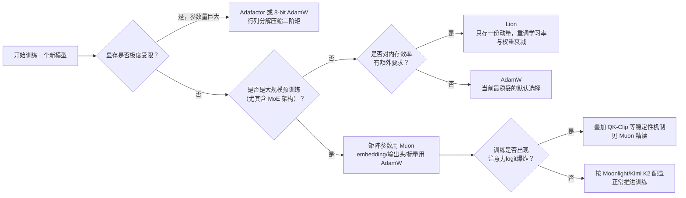

# 深度学习优化器全景综述：从 SGD 到 Adam 到 Muon 的完整演化图谱

> **一句话**：深度学习优化器的演化史，本质上是一部"逐步暴露问题、逐步针对性修补"的历史——每一代新优化器都是在回答上一代留下的一个具体缺陷，而不是凭空发明。本综述按时间线组织，讲清楚每一步"卡在哪里、怎么解决"，并给出一张贯穿全文的损失面下降轨迹图，直观展示不同优化器的行为差异。

**前置阅读**：
- [Adam 与 AdamW：自适应学习率优化器](/前置知识/005e_前置知识_Adam与AdamW自适应学习率优化器) —— 本综述第三、四节的详细数学推导
- [Muon：正交化动量优化器](/前置知识/005f_前置知识_Muon正交化动量优化器) —— 本综述第六节的详细数学推导
- [数值优化基础：梯度下降与牛顿法](/前置知识/003c_前置知识_数值优化基础_梯度下降与牛顿法) —— 理解"优化"这个数学问题本身的通用框架

**关联精读**：
- [Muon：正交化动量优化器精读](/论文综述/106_Muon_正交化动量优化器) —— Muon 从个人博客到万亿参数 Kimi K2 的完整技术演进故事

---

## 一、贯穿全文的例子：一个病态曲率的损失面

本综述用同一个具体场景贯穿始终：想象你在训练一个简单的两层网络做回归，其中某个权重矩阵里有两个方向的敏感度天差地别——沿 $x$ 方向，损失函数变化平缓（曲率小，就像走在一片开阔的草原上）；沿 $y$ 方向，损失函数变化剧烈（曲率大，就像走在一条狭窄的峡谷里）。数学上，把这个局部行为简化成一个二维椭圆碗：

$$
f(x, y) = \frac{1}{2}(x^2 + 20y^2)
$$

**这个公式在做什么**：构造一个"病态曲率"的简化损失面——两个方向都是抛物线形状，但 $y$ 方向的系数（曲率）是 $x$ 方向的 20 倍，用来模拟真实网络里"有些方向敏感、有些方向迟钝"的情形。

::: details 📐 公式详解（点击展开）

| 子表达式 | 它是谁 | 它在干嘛 |
|---------|--------|---------|
| $\frac{1}{2}x^2$ | **平缓方向** | $x$ 方向的曲率系数是 1，走多远损失涨得都不多，像走在开阔草原上 |
| $\frac{1}{2}(20y^2)$ | **陡峭方向** | $y$ 方向的曲率系数是 20，稍微偏离一点损失就急剧上升，像走在狭窄峡谷里 |
| $f(x,y)$ 整体 | **一个简化的椭圆碗** | 两个方向敏感度差 20 倍的最小化目标，用来放大展示不同优化器面对"病态曲率"时的行为差异 |

**用人话读**："这是一个碗形的山谷，一个方向坡度平缓，另一个方向坡度陡峭 20 倍，最低点在原点。"

**为什么用这个具体形式**：系数选 1 和 20 只是为了让病态程度足够明显、便于画图观察轨迹差异；曲率比例越大，SGD 的震荡问题就越显著，越能凸显后续优化器改进的动机。
:::

这个函数的最小值在原点 $(0,0)$，但 $y$ 方向的曲率是 $x$ 方向的 20 倍——这正是深度学习损失面的典型特征（不同参数方向对损失的敏感度差异巨大），也是本综述里每一种优化器要解决的核心矛盾的具体化身：**当不同方向的曲率差异巨大时，一个"统一步长"的更新规则该怎么走，才能又快又稳？**

下面这张图会在后文反复被引用，请先建立直觉印象：

> 左图：三种优化器从同一起点 $(-4, 1)$ 出发，在这个椭圆碗上留下的轨迹。SGD（红）在陡峭的 $y$ 方向反复越过谷底又弹回来，形成明显的锯齿状震荡，同时在平缓的 $x$ 方向进展缓慢；Momentum（橙）显著抑制了震荡；Adam（蓝）几乎径直冲向最优点。右图：三者的 loss 随迭代步数下降曲线（对数坐标），可以看到 SGD 收敛速度明显落后。这张图浓缩了本综述前四节要讲的核心故事。

## 二、核心矛盾：统一学习率无法兼顾所有方向

在深入具体方法之前，先把整个优化器演化史的驱动力讲清楚。所有基于梯度的优化方法，最基础的更新规则都是：

$$
\theta_{t+1} = \theta_t - \eta \cdot (\text{某种从梯度历史算出来的方向})
$$

**这个公式在做什么**：沿着某个"方向"移动参数，移动的距离由学习率 $\eta$ 控制——不同优化器的全部区别，都体现在括号里这个"方向"具体怎么算。

::: details 📐 公式详解（点击展开）

| 子表达式 | 它是谁 | 它在干嘛 |
|---------|--------|---------|
| $\theta_t$ | **当前参数** | 网络里某个权重此刻的取值 |
| $\eta$ | **学习率** | 控制这一步挪动的距离尺度 |
| "方向"这个占位符 | **各优化器的核心创新点** | SGD 用原始梯度；Momentum 用梯度的滑动平均；Adam 再叠加一层"用历史波动幅度做缩放"；Muon 再换成"整个矩阵做正交化" |

**用人话读**："每一步都往某个方向挪一点，挪多远由学习率决定——不同优化器的差异，全部体现在'往哪个方向挪'这件事上怎么算。"

**为什么要拆成这个通用框架**：这样才能看清楚后文每一种方法到底改了什么——不是从头发明一个全新的更新规则，而是不断替换/叠加"方向"这一项的计算方式。
:::

如果"方向"就是原始梯度 $g_t$（也就是最朴素的随机梯度下降，Stochastic Gradient Descent, SGD），在贯穿例子的椭圆碗上会发生什么？$y$ 方向梯度 $\partial f/\partial y=20y$ 远大于 $x$ 方向梯度 $\partial f/\partial x=x$。用同一个学习率 $\eta$，如果 $\eta$ 调得让 $y$ 方向不发生震荡（步子够小），$x$ 方向就会挪得极慢；如果 $\eta$ 调得让 $x$ 方向进展合理，$y$ 方向就会因为步子相对于曲率太大而反复越过谷底、来回弹跳。这就是本综述反复提到的核心矛盾：**统一学习率无法同时兼顾曲率差异巨大的不同方向**。后面每一种方法，都是从不同角度攻克这个矛盾。

## 三、第一步修补：Momentum 用"惯性"平滑震荡

Momentum（动量法）的思路是：不要只听这一步梯度的话，维护一个梯度的指数滑动平均（Exponential Moving Average, EMA——按固定比例混合历史平均值和新数据的统计量），用这个平滑后的方向去更新：

$$
v_t = \beta v_{t-1} + (1-\beta) g_t, \qquad \theta_{t+1} = \theta_t - \eta v_t
$$

**这个公式在做什么**：把这一步的梯度和过去积累的运动趋势按比例融合，用融合后的平滑方向代替原始梯度去更新参数——本质上是给参数的移动加了"惯性"，减少来回抖动。

::: details 📐 公式详解（点击展开）

| 子表达式 | 它是谁 | 它在干嘛 |
|---------|--------|---------|
| $v_{t-1}$ | **过去的运动趋势** | 到目前为止梯度的历史加权平均 |
| $g_t$ | **这一步的新观测** | 当前 mini-batch 算出的原始梯度，可能带噪声或震荡 |
| $\beta$（常取 0.9） | **惯性系数** | 越大越倾向于"忽略这一步的抖动，延续过去的方向" |

**用人话读**："别听这一步梯度说什么，听'过去一段时间梯度平均下来指向哪'——单次的噪声会被历史平均掉。"

**为什么是这个形式**：在贯穿例子的椭圆碗上，$y$ 方向的梯度会因为反复越过谷底而正负交替出现——正负交替的信号被 EMA 平均之后会互相抵消、幅度被压低，而 $x$ 方向梯度符号始终不变、EMA 不会抵消它，反而因为持续累积而略微加速。这正是 Momentum 图中橙色轨迹震荡明显减少的数学原因。
:::

Momentum 解决了"震荡"问题，但没有解决"不同方向该用不同有效步长"这个更根本的矛�512盾——它只是让统一的步长在震荡方向上不那么容易越界，并没有真正做到"给平缓方向更大步长、给陡峭方向更小步长"的按方向自适应。这正是下一步 Adam 要解决的问题。

## 四、第二步修补：Adam 给每个参数配自适应的步长

[Adam（自适应矩估计，Adaptive Moment Estimation）](/前置知识/005e_前置知识_Adam与AdamW自适应学习率优化器) 在 Momentum 的基础上，再维护一个梯度平方的滑动平均（记录每个参数梯度历史上的"波动幅度"），用这个波动幅度反过来缩放学习率：

$$
\theta_{t+1} = \theta_t - \eta \cdot \frac{\hat m_t}{\sqrt{\hat v_t}+\epsilon}
$$

**这个公式在做什么**：往"平滑后的历史梯度方向"走一步，但这一步的实际大小要除以"这个参数历史梯度典型幅度"——历史上波动越大的参数，实际学习率被压得越小。完整的一阶矩、二阶矩、偏差校正推导见 [Adam 前置知识](/前置知识/005e_前置知识_Adam与AdamW自适应学习率优化器) 第 3 节，此处不再重复。

::: details 📐 公式详解（点击展开）

| 子表达式 | 它是谁 | 它在干嘛 |
|---------|--------|---------|
| $\hat m_t$ | **校正后的平滑方向**（与 Momentum 的 $v_t$ 角色相同） | 决定"往哪走" |
| $\sqrt{\hat v_t}$ | **该参数的个人专属尺子** | 历史梯度幅度的均方根，谁的历史梯度经常很大，这把尺子就长 |
| $\eta/(\sqrt{\hat v_t}+\epsilon)$ | **每个参数各自的实际有效学习率** | 全局学习率被逐参数重新缩放 |

**用人话读**："每个参数各用各自的历史波动幅度去缩放学习率——波动大的参数步子小，波动小的参数步子相对大，不再所有参数共用一把尺子。"

**为什么能解决核心矛盾**：回到贯穿例子，$y$ 方向梯度幅度天生比 $x$ 方向大（曲率大），$\sqrt{\hat v_t}$ 会自动给 $y$ 方向算出更大的"个人尺子"，除下去后 $y$ 方向的实际步长被自动压小；$x$ 方向反之。这正是 Adam 蓝色轨迹几乎径直冲向最优点、不再有明显震荡的原因——不同方向第一次真正获得了不同的有效学习率。
:::

Adam 几乎解决了核心矛盾，但留下了一个新问题：如果直接把 L2 正则化（权重衰减）实现成"往梯度里加一项 $\lambda\theta$"，这一项也会被 $\sqrt{\hat v_t}$ 缩放——不同参数受到的正则化强度会被历史梯度统计量意外扭曲，破坏了权重衰减本该"均匀地把所有参数往 0 拉"的设计意图。[AdamW](/前置知识/005e_前置知识_Adam与AdamW自适应学习率优化器) 的解决方案是把权重衰减从梯度计算中剥离出来，直接作用在参数值本身：

$$
\theta_{t+1} = \theta_t - \eta\cdot\frac{\hat m_t}{\sqrt{\hat v_t}+\epsilon} - \eta\lambda\theta_t
$$

**这个公式在做什么**：把参数更新拆成两条独立的力——一条是根据损失梯度算出的自适应更新，另一条是不经过任何自适应缩放、直接按固定比例把参数往 0 拉的解耦权重衰减。

::: details 📐 公式详解（点击展开）

| 子表达式 | 它是谁 | 它在干嘛 |
|---------|--------|---------|
| $\eta\cdot\hat m_t/(\sqrt{\hat v_t}+\epsilon)$ | **Adam 的自适应更新** | 只根据损失梯度信息决定往哪走、走多远 |
| $\eta\lambda\theta_t$ | **解耦的权重衰减** | 只根据参数当前值本身，均匀施加收缩，不受该参数梯度历史影响 |

**用人话读**："先按 Adam 的方式根据梯度更新一次，再单独、均匀地把所有参数的值往 0 缩一点——两者互不干扰。"

**为什么是这个形式**：这样才能恢复"权重衰减等价于 L2 正则化"这个在 SGD 下原本成立、但在 Adam 下被自适应缩放破坏的性质。如今几乎所有 Transformer 类模型（GPT、LLaMA、机器人 VLA 模型等）都默认用 AdamW 而非原始 Adam。
:::

## 五、支线简述：Lion——用符号函数换取内存效率

在继续讲 Muon 之前，值得简要提及 Lion（进化出的符号动量，EvoLved Sign Momentum）——这是 Google 研究团队用**程序搜索**（把优化算法的设计本身当作一个可搜索的程序空间，用自动化搜索找到效果好的候选算法，而不是人工设计）自动发现的优化器，2023 年发表于《Symbolic Discovery of Optimization Algorithms》。

Lion 与 Adam 最大的区别是它**完全不维护二阶矩**，只保留一个动量项，把更新方向压缩成符号函数（sign function，只取 $+1/-1/0$，丢弃幅度信息）：

$$
u_t = \beta_1 m_{t-1} + (1-\beta_1)g_t, \qquad m_t = \beta_2 m_{t-1}+(1-\beta_2)g_t, \qquad \theta_t = \theta_{t-1}-\eta\left(\text{sign}(u_t)+\lambda\theta_{t-1}\right)
$$

**这个公式在做什么**：维护两个不同衰减速度的动量（$u_t$ 用较快的 $\beta_1$ 混合出"用来决定更新方向"的信号，$m_t$ 用较慢的 $\beta_2$ 维护"长期记忆"作为下一步 $u_t$ 计算的基础），最终更新只取这个方向的符号，所有参数不论梯度幅度大小，每一步移动的绝对距离完全相同。

::: details 📐 公式详解（点击展开）

| 子表达式 | 它是谁 | 它在干嘛 |
|---------|--------|---------|
| $u_t$ | **本步用来决定方向的插值动量** | 用较快的 $\beta_1$（默认 0.9）混合当前梯度和历史记忆，专门用来算这一步该往哪走 |
| $m_t$ | **长期记忆动量**（Lion 唯一需要额外存储的状态） | 用较慢的 $\beta_2$（默认 0.99）维护更长时间窗口的历史，作为下一步 $u_t$ 的基础——这也是 Lion 比 Adam 省内存的关键：只存一份 $m_t$，不像 Adam 要存 $m_t$ 和 $v_t$ 两份 |
| $\text{sign}(u_t)$ | **只保留方向、丢弃幅度的更新** | 不管 $u_t$ 算出来是 0.001 还是 100，符号函数后都变成同样大小的 $\pm1$——所有参数每步移动的绝对距离完全一致 |
| $\lambda\theta_{t-1}$ | **解耦权重衰减**（与 AdamW 思路相同） | 同样独立于梯度信息之外，均匀施加 |

**用人话读**："不像 Adam 那样精细地记录每个参数梯度的历史幅度，Lion 只关心这一步该往正方向走还是负方向走，走多远由统一的学习率决定，省下了存储梯度平方历史的那一份内存。"

**为什么是这个形式**：符号函数带来的更新幅度天生比 Adam 更大且更均匀，这也是为什么 Lion 论文建议用比 AdamW 小 3-10 倍的学习率、大 3-10 倍的权重衰减——两个超参数需要联动调整才能得到可比的实际更新强度。Lion 由程序搜索自动发现，作者报告它在 ImageNet 图像分类、扩散模型、部分语言建模任务上性能持平或优于 AdamW，同时省下了二阶矩的存储开销，并已被用于 Google 部分生产系统（如搜索广告点击率预测模型）。
:::

Lion 的意义不在于它是当前最强的优化器，而在于它展示了"完全抛弃二阶矩统计量"这条路线在内存受限场景下是可行的——这为后文 Muon 和 Adafactor "重新思考需不需要存储完整二阶矩"提供了先例。

## 六、第三条路线：Muon——不逐元素处理，而是处理整个矩阵

前面所有方法（SGD、Momentum、Adam、AdamW、Lion）都把参数矩阵当作"一堆互相独立的标量"处理，逐元素维护统计量。[Muon（正交化动量优化器）](/前置知识/005f_前置知识_Muon正交化动量优化器) 换了一个完全不同的视角：神经网络里很多参数本质上是**矩阵**，矩阵的更新如果只看逐元素统计量，会丢失矩阵作为"整体线性变换"的方向结构信息——梯度更新矩阵往往近似低秩（能量集中在少数几个方向），逐元素处理会让这种"厚此薄彼"被继承下来。

Muon 的做法是对动量累积后的梯度矩阵做**正交化**（用 Newton-Schulz 迭代——一种只用矩阵乘法、反复把奇异值推向 1 的迭代算法，近似完成这件事，避免精确 SVD 的高昂开销），让更新在所有方向上获得同等力度：

$$
M_t = \mu M_{t-1}+G_t,\qquad O_t=\text{Newton-Schulz}(M_t),\qquad W_t=W_{t-1}-\eta_t(O_t+\lambda W_{t-1})
$$

**这个公式在做什么**：先像 Momentum 一样平滑累积梯度矩阵，再对累积结果做一次"把所有方向的更新力度拉平"的正交化后处理，最后叠加权重衰减更新参数。完整的 Newton-Schulz 迭代公式和详细数值示例见 [Muon 前置知识](/前置知识/005f_前置知识_Muon正交化动量优化器) 第 3 节。

::: details 📐 公式详解（点击展开）

| 子表达式 | 它是谁 | 它在干嘛 |
|---------|--------|---------|
| $M_t$ | **动量累积的梯度矩阵**（与 Momentum 角色相同） | 平滑单步噪声 |
| $\text{Newton-Schulz}(M_t)$ | **正交化近似**（Muon 唯一的本质创新） | 把 $M_t$ 的奇异值分布拉平成处处相等（约等于 1），保留方向信息、丢弃不均匀的幅度信息 |
| $\lambda W_{t-1}$ | **权重衰减**（与 AdamW 思路相同，Moonshot AI 扩展工作补上的一环） | 防止权重和层输出数值无限增长 |

**用人话读**："把动量矩阵通过几次矩阵乘法拉平成'各方向力度均等'的矩阵，再用这个拉平后的方向去更新权重——不再是逐个元素各算各的，而是把整个矩阵当作一个有结构的整体来处理。"

**为什么是另一条独立路线**：这条路线解决的核心矛盾和前面 Momentum/Adam 解决的不是同一个层面的问题——Momentum/Adam 解决的是"同一个参数在时间维度上梯度震荡/幅度不均"，Muon 解决的是"同一个矩阵参数在空间维度上（不同奇异值方向）更新力度不均"，两者互补而非替代关系，这也是为什么实践中 Muon 仍需要搭配 AdamW 处理非矩阵参数（embedding、输出头、标量/向量参数）。完整的 Newton-Schulz 迭代原理、以及 Muon 从 NanoGPT speedrun 到 Kimi K2 万亿参数模型的完整验证历程，详见 [Muon 精读](/论文综述/106_Muon_正交化动量优化器)。
:::

Moonshot AI 的 scaling law 实验显示，在算力最优训练设定下，Muon 只需要约 52% 的训练 FLOPs 就能达到与 AdamW 相同的验证损失（约等价于常说的"2 倍效率"）；Keller Jordan 最初的 NanoGPT speedrunning 实验里，Muon 把训练速度记录提升了 35%。这些具体数字和更大规模（万亿参数 Kimi K2）的验证细节，完整记录在 [Muon 精读文章](/论文综述/106_Muon_正交化动量优化器) 中。

## 七、简要提及：Adafactor——为大模型省显存的另一条思路

Adafactor（2018 年提出）解决的是与 Muon 不同但同样重要的问题：**Adam 需要为每个参数额外存储两份与参数同形状的统计量（$m$ 和 $v$）**，对于数十亿参数的大模型，这笔额外的优化器状态内存开销可能和模型权重本身相当，甚至更大。

Adafactor 的核心思路是：对于矩阵形状的参数 $[n, m]$，不再存储一个完整的 $n\times m$ 二阶矩矩阵，而是只存储**每一行的和**（长度 $n$ 的向量）和**每一列的和**（长度 $m$ 的向量），用这两个向量的外积**近似重构**出完整的二阶矩矩阵。这把存储开销从 $O(nm)$ 降到 $O(n+m)$——对于一个 $4096\times4096$ 的矩阵，意味着从存 1600 万个数降到只存 8192 个数，节省超过 99.9% 的二阶矩存储。这种"用行列统计量近似完整矩阵统计量"的思路，与 Muon"直接处理矩阵整体结构"的思路形成有趣的对照：两者都意识到"逐元素独立处理矩阵参数是一种浪费"，但 Adafactor 选择在存储侧做近似压缩，Muon 选择在更新方向侧做结构化处理，两者要解决的核心痛点不同（前者是内存瓶颈，后者是更新方向的方向性偏差），因此常常可以配合甚至叠加使用（例如很多超大模型的实践里，非 Muon 处理的参数会用 Adafactor 而不是完整 AdamW 来省内存）。

## 八、全景对比表

| 优化器 | 是否存一阶矩 | 是否存二阶矩（完整） | 相对内存开销 | 收敛速度（相对 AdamW） | 核心适用场景 | 代表性使用者 |
|--------|:---:|:---:|:---:|:---:|------|------|
| SGD | 否 | 否 | 最低（0 份额外状态） | 慢，病态曲率下震荡明显 | 简单/教学场景，小模型 | 早期图像分类基线 |
| SGD+Momentum | 是 | 否 | 低（1 份） | 中，减少震荡但仍统一步长 | 早期 CNN 训练 | ResNet 等经典 CV 模型 |
| Adam | 是 | 是 | 高（2 份） | 快，逐参数自适应 | 早期 Transformer、大多数任务的默认起点 | 早期 BERT/GPT 实验 |
| AdamW | 是 | 是 | 高（2 份） | 快，且泛化性优于 Adam | 现代 LLM/VLA 标准配置 | GPT 系列、LLaMA 系列、大多数机器人 VLA 模型 |
| Lion | 是（1 份，比 Adam 省一半） | 否 | 中低（1 份） | 与 AdamW 相当或更优，需重调学习率/权重衰减比例 | 内存受限、大 batch 场景 | Google 搜索广告 CTR 模型、部分视觉/扩散模型训练 |
| Muon（矩阵参数） | 是（1 份，仅矩阵参数） | 否 | 中（矩阵参数 1 份，非矩阵参数仍需 AdamW） | 快，约省 48% 训练 FLOPs 达到同等效果 | 大模型预训练，尤其 MoE 架构 | Kimi K2、Moonlight、nanoGPT speedrun 记录 |
| Adafactor | 可选 | 否（行列分解近似） | 最低（$O(n+m)$ 而非 $O(nm)$） | 与 Adam 相近，长期训练下略逊 | 超大模型、显存极度受限场景 | T5 等早期大规模 Transformer 训练 |

## 九、决策流程图：该怎么选

## 十、总结

深度学习优化器的演化不是一条随意分叉的技术树，而是围绕一个核心矛盾（不同参数/不同方向对损失的敏感度差异巨大，统一步长无法兼顾）持续深挖的历史：Momentum 先用时间维度的平滑抑制震荡；Adam 进一步给每个参数配上基于历史波动幅度的自适应步长；AdamW 修补了自适应步长意外破坏权重衰减等价性的副作用；Lion 探索了完全抛弃二阶矩、只用符号函数的内存高效路线；Muon 换了一个空间维度的视角，把矩阵参数当作一个有结构的整体而非独立标量集合来处理；Adafactor 则从存储压缩的角度回应了大模型时代"优化器状态本身就是一笔巨大内存开销"这个新问题。理解这条演化脉络，比记住每个优化器的名字更重要——当你遇到一个新场景（显存受限？矩阵参数占主导？MoE 架构？）时，应该能沿着"这个场景的核心瓶颈是什么"去推理该用哪一种，而不是死记硬背一张对照表。

## 延伸阅读

- [Adam 与 AdamW：自适应学习率优化器（前置知识）](/前置知识/005e_前置知识_Adam与AdamW自适应学习率优化器)
- [Muon：正交化动量优化器（前置知识）](/前置知识/005f_前置知识_Muon正交化动量优化器)
- [Muon：正交化动量优化器精读](/论文综述/106_Muon_正交化动量优化器) —— Muon 完整技术演进故事，含 Kimi K2 的 MuonClip 稳定性设计
- [数值优化基础：梯度下降与牛顿法](/前置知识/003c_前置知识_数值优化基础_梯度下降与牛顿法)
- Kingma & Ba (2015), *Adam: A Method for Stochastic Optimization*
- Loshchilov & Hutter (2019), *Decoupled Weight Decay Regularization*
- Chen et al. (2023), *Symbolic Discovery of Optimization Algorithms* (Lion)
- Shazeer & Stern (2018), *Adafactor: Adaptive Learning Rates with Sublinear Memory Cost*
- Keller Jordan (2024), *Muon: An optimizer for hidden layers in neural networks*
- Liu et al. (2025), *Muon is Scalable for LLM Training*
- Kimi Team (2025), *Kimi K2: Open Agentic Intelligence*
