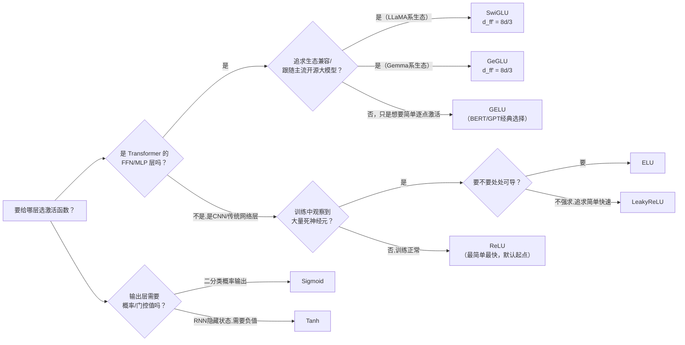

# 激活函数全景综述：从 Sigmoid、ReLU 到 GELU、SiLU 与 GLU 门控家族

> **综述范围**：深度学习里最主流的激活函数演进——Sigmoid/Tanh 的历史局限、ReLU 如何解决梯度消失但引入死神经元、LeakyReLU/ELU 如何缓解死神经元、GELU 用概率化的平滑阈值替代硬截断、SiLU/Swish 的自门控特性、以及 GLU 门控家族（SwiGLU/GeGLU）如何把"激活函数"升级成"门控结构"。目标是让读者看完本文后，遇到任何一个新模型宣称用了某种激活函数，都能立刻说出它解决了前一代的什么问题、代价是什么、什么场景该用它。
> **关键词**：Sigmoid、Tanh、ReLU、Dead Neuron、LeakyReLU、ELU、GELU、SiLU、Swish、GLU、SwiGLU、GeGLU
> **适用读者**：有基本数学素养（知道什么是函数、导数、指数）的本科生，看到一堆"XxLU"分不清楚区别的入门者

---

## 相关阅读

在开始之前，建议先了解（或随时回来查阅）以下内容：

- [GLU 门控线性单元与 SwiGLU、GeGLU](/前置知识/005g_前置知识_GLU门控线性单元与SwiGLU_GeGLU) — 本文第六节门控家族部分的完整公式推导与数值例子，本文只讲结论和定位
- [FFN 前馈网络：Transformer 为什么需要一个"逐 token 加工站"](/前置知识/005m_前置知识_FFN前馈网络与Transformer的两阶段设计) — 本文讨论的绝大多数激活函数都是在 FFN 内部使用的，这篇讲清楚 FFN 本身的设计动机和结构
- [交叉熵损失与 Softmax](/前置知识/003f_前置知识_交叉熵损失与Softmax) — 理解神经网络训练时梯度反向传播的基础背景
- [GLU Variants Improve Transformer：论文精读](./107_GLU_Variants_Improve_Transformer门控线性单元变体) — 本文第六节结论的原始实验数据来源

关联文章（本文会在合适的地方链接过去，不重复讲）：

- [Mamba：线性时间序列建模与选择性状态空间](./108_Mamba_线性时间序列建模与选择性状态空间) — SiLU 在 Mamba 门控 MLP 里的实际应用
- [openpi 系列：Gemma 语言模型骨干](/系列/openpi_deep_dive/10_Gemma语言模型骨干) — GeGLU 在真实 VLA 模型中的代码实现
- [Xiaomi Robotics 1：十万小时数据 Scaling VLA](./094_XiaomiRobotics1_十万小时数据Scaling_VLA) — SwiGLU MLP 在 DiT 动作头中的应用

---

## 贯穿全文的例子：一个二分类神经元的"要不要激活"决策

为了让每种激活函数的行为差异彻底具体化，本文全程使用同一个场景：一个神经元接收上一层传来的加权和 $z$（可以是任意实数，正代表"证据支持激活"，负代表"证据反对激活"，数值大小代表证据强弱），激活函数的任务就是把这个原始信号 $z$ 转换成要往下一层传递的输出值 $f(z)$。

我们会反复用几个具体的 $z$ 值——$z=-3$（强烈反对）、$z=-0.5$（轻微反对）、$z=0$（中立）、$z=0.5$（轻微支持）、$z=3$（强烈支持）——喂给每一种激活函数，观察输出和梯度的变化，直观建立"这个激活函数在特定区域会怎么表现"的直觉。

---

## 一、核心矛盾：非线性需要，但每种实现方式都有代价

神经网络如果没有非线性激活函数，无论堆多少层，整体上都等价于一次线性变换（矩阵乘法的复合还是矩阵乘法）——这是所有激活函数存在的根本原因：**必须在层与层之间插入非线性，才能让网络具备拟合复杂函数的能力**。

但"插入非线性"这个目标可以用很多种具体函数实现，而每一种实现方式都会在下面几个维度上做取舍：

1. **梯度是否会在极端区域消失**：如果 $|z|$ 很大时导数趋近于 0，反向传播时梯度会被这一层"掐断"，深层网络训练不动。
2. **是否存在"死区"**：某些函数在某个输入区间的输出和导数**恒为 0**，一旦神经元的加权和长期落在这个区间，它就永久停止学习。
3. **导数是否连续**：不连续的导数在某些优化算法下会带来微小的数值不稳定。
4. **计算开销**：涉及指数、误差函数等运算的激活函数比简单的分段线性函数更慢。

接下来六节按历史演进顺序，逐一介绍每一种函数如何解决前一种的问题、又带来了什么新代价。

---

## 二、Sigmoid 与 Tanh：早期的标准选择及其梯度饱和问题

### 2.1 Sigmoid：把任意实数压成 (0,1) 的概率

Sigmoid 函数 $\sigma(z) = \frac{1}{1+e^{-z}}$ 是神经网络早期（1980~2000 年代）最常用的激活函数，直觉很简单：把任意实数压缩到 $(0,1)$ 区间，天然可以解释成"这个神经元被激活的概率"。用贯穿全文的例子代入：

| $z$ | $-3$ | $-0.5$ | $0$ | $0.5$ | $3$ |
|---|---|---|---|---|---|
| $\sigma(z)$ | $0.047$ | $0.378$ | $0.500$ | $0.622$ | $0.953$ |
| $\sigma'(z)$ | $0.045$ | $0.235$ | $0.250$ | $0.235$ | $0.045$ |

**问题在于导数这一行**：当 $|z|$ 较大时（比如 $z=-3$ 或 $z=3$），导数已经跌到 $0.045$——网络越深，每一层反向传播的梯度都要乘上这样一个小于 1 的数，多层连乘之后梯度会指数级缩小到几乎为 0，这就是**梯度消失**（Vanishing Gradient）问题：底层的参数几乎收不到任何有效的更新信号,深层网络训练极其缓慢甚至完全训练不动。

### 2.2 Tanh：中心对称版本，但没解决根本问题

Tanh 函数 $\tanh(z) = \frac{e^z-e^{-z}}{e^z+e^{-z}}$ 把输出范围换成了 $(-1,1)$（关于原点对称，均值为 0），这在一定程度上缓解了 Sigmoid 输出"永远为正"导致下一层输入分布有偏的问题。但 Tanh 的导数 $1-\tanh^2(z)$ 在 $|z|$ 增大时同样趋近 0——**梯度饱和的根本问题没有解决**，只是把问题从"输出恒正"这一个维度上做了修正。

### 2.3 局限总结

Sigmoid 和 Tanh 的共同问题是：这两个函数都是"S 形"曲线，两端都会**饱和**（趋于水平）。饱和区域导数几乎为 0，这对训练一个超过几层的深度网络是致命的——这正是 2010 年代深度学习兴起之前，训练深层网络长期被认为极其困难的一个核心原因。ReLU 的出现正是为了解决这个"两端饱和"问题。

---

## 三、ReLU：解决梯度消失，但引入死神经元问题

### 3.1 核心思路：正区间完全线性，不设上限

ReLU（Rectified Linear Unit，修正线性单元）的定义极其简单：

$$
\text{ReLU}(z) = \max(0, z)
$$

**这个公式在做什么**：正数原样通过，负数直接清零——没有任何"压缩"或"饱和"，正区间是完全的恒等映射。

::: details 📐 公式详解（点击展开）

| 子表达式 | 它是谁 | 它在干嘛 |
|---------|--------|---------|
| $z$ | **神经元的原始加权和** | 上一层传来的信号，可以是任意实数 |
| $\max(0, z)$ | **硬阈值筛选器** | 只要 $z>0$ 就原样输出 $z$，只要 $z\le0$ 就输出 $0$，中间没有任何过渡 |

**用人话读**："正的信号原样传递，负的信号直接清零，没有中间地带。"

**为什么是这个形式**：正区间导数恒为 $1$——反向传播时梯度经过 ReLU 不会被压缩（不像 Sigmoid/Tanh 那样越乘越小），这从根本上缓解了梯度消失问题，同时计算只需要一次比较，几乎没有额外开销。
:::

用贯穿全文的例子代入：

| $z$ | $-3$ | $-0.5$ | $0$ | $0.5$ | $3$ |
|---|---|---|---|---|---|
| $\text{ReLU}(z)$ | $0$ | $0$ | $0$ | $0.5$ | $3$ |
| $\text{ReLU}'(z)$ | $0$ | $0$ | 未定义（通常取 0） | $1$ | $1$ |

对比 2.1 节 Sigmoid 在 $z=3$ 处导数只有 $0.045$，ReLU 在同一点导数是 $1$——**正区间的梯度完全不会衰减**，这是 ReLU 能训练远比 Sigmoid/Tanh 深得多的网络的直接原因，也是 2012 年前后深度学习能够真正训练"深"网络的关键推手之一（AlexNet 是首批大规模使用 ReLU 的成功案例）。

### 3.2 代价：死神经元问题（Dead Neuron Problem）

ReLU 的负区间导数**恒为 0**——这意味着：一旦某个神经元的加权和 $z$ 因为某次梯度更新变成负数，且后续训练中这个神经元收到的输入持续让 $z$ 保持负数，这个神经元的梯度就永远是 0，**参数再也不会被更新，这个神经元永久"死亡"**，不再对网络的输出做任何贡献。

这个问题在实践中确实会发生：如果学习率设得过大，一次更新可能把大量神经元的偏置推向很负的方向，导致网络中一大片神经元同时死亡，模型的有效容量大幅下降却难以察觉（因为死掉的神经元不会报错，只是悄悄不再学习）。这正是下一节 LeakyReLU/ELU 要解决的问题。

---

## 四、LeakyReLU 与 ELU：缓解死神经元问题

### 4.1 LeakyReLU：负区间留一条"漏水的缝"

LeakyReLU（Leaky ReLU，带泄漏的 ReLU）的思路极其直接：负区间不再是硬性清零，而是乘一个很小的固定斜率 $\alpha$（通常取 $0.01$ 或 $0.1$）：

$$
\text{LeakyReLU}(z) = \max(\alpha z,\, z), \quad \alpha \in (0,1)
$$

**这个公式在做什么**：正区间和 ReLU 完全一样（原样通过），负区间不再清零，而是留一条很小的斜率——即使 $z$ 是负数，梯度也不会恰好等于 0，神经元依然有机会通过这条"漏水的缝"重新被激活。

::: details 📐 公式详解（点击展开）

| 子表达式 | 它是谁 | 它在干嘛 |
|---------|--------|---------|
| $z$ | **原始加权和** | 和 ReLU 一样的输入 |
| $\alpha z$（$z<0$ 时） | **负区间的微弱信号** | 不再是 0，而是原始负值乘上一个很小的固定系数，比如 $z=-3,\alpha=0.1$ 时输出 $-0.3$ |
| $\max(\alpha z, z)$ | **分段选择器** | $z>0$ 时 $z$ 本身更大，取 $z$；$z<0$ 时 $\alpha z$（比 $z$ 更接近 0）更大，取 $\alpha z$ |

**用人话读**："正的照常通过，负的不再一刀切清零，而是打一个很小的折扣（比如打一折）继续往下传。"

**为什么留一条"缝"就能解决死神经元问题**：只要 $\alpha \ne 0$，负区间的导数就恒为 $\alpha$（一个非零常数），不管 $z$ 落在负区间的哪个位置，梯度都不会消失为 0——神经元永远有非零梯度可以被更新，理论上不会再"永久死亡"。代价是要多引入一个超参数 $\alpha$（虽然通常固定不调）。
:::

用贯穿全文的例子（取 $\alpha=0.1$）：

| $z$ | $-3$ | $-0.5$ | $0$ | $0.5$ | $3$ |
|---|---|---|---|---|---|
| $\text{LeakyReLU}(z)$ | $-0.3$ | $-0.05$ | $0$ | $0.5$ | $3$ |
| $\text{LeakyReLU}'(z)$ | $0.1$ | $0.1$ | 未定义（左 0.1，右 1） | $1$ | $1$ |

### 4.2 ELU：负区间换成指数曲线，且导数连续

ELU（Exponential Linear Unit，指数线性单元）的负区间不再是直线，而是一条**趋近于 $-\alpha$ 的指数曲线**（$\alpha$ 通常取 1）：

$$
\text{ELU}(z) = \begin{cases} z & z > 0 \\ \alpha(e^z-1) & z \le 0 \end{cases}
$$

**这个公式在做什么**：正区间和 ReLU/LeakyReLU 一样保持恒等；负区间不再是直线，而是一条随着 $z$ 越负、越平缓地趋近于 $-\alpha$ 的曲线——既避免了死神经元（导数不恒为 0），又让输出有一个明确的下界 $-\alpha$（不会像 LeakyReLU 那样负得无穷远）。

::: details 📐 公式详解（点击展开）

| 子表达式 | 它是谁 | 它在干嘛 |
|---------|--------|---------|
| $z>0$ 时的 $z$ | **恒等通道** | 和 ReLU 完全一样 |
| $\alpha(e^z-1)$（$z\le0$ 时） | **指数缓冲区** | $z$ 越负，$e^z$ 越接近 0，整体越接近 $-\alpha$；$z=0$ 时刚好等于 $0$，与正区间在 0 点平滑衔接 |
| $\alpha$ | **负饱和下界** | 输出永远不会比 $-\alpha$ 更负，起到"软限幅"的作用 |

**用人话读**："正的照常通过；负的不再是直线，而是一条越往负方向走越平缓、最终趋近某个固定负数的曲线，且在 0 点这条曲线和正区间的直线是平滑衔接的，没有折角。"

**为什么要设计成指数曲线而不是直线**：ELU 在 $z=0$ 处左右两边的导数都恰好是 $1$（可以验证 $\frac{d}{dz}\alpha(e^z-1)\big|_{z=0}=\alpha e^0=\alpha=1$，当 $\alpha=1$），也就是说 **ELU 处处可导，不像 ReLU/LeakyReLU 在 $z=0$ 处存在一个不可导的折角**。同时负区间有下界，让神经元的输出均值更容易被推向 0 附近，这在原论文的实验里被认为对训练的稳定性有帮助。
:::

用贯穿全文的例子（取 $\alpha=1$）：

| $z$ | $-3$ | $-0.5$ | $0$ | $0.5$ | $3$ |
|---|---|---|---|---|---|
| $\text{ELU}(z)$ | $-0.950$ | $-0.393$ | $0$ | $0.5$ | $3$ |
| $\text{ELU}'(z)$ | $0.050$ | $0.607$ | $1$ | $1$ | $1$ |

### 4.3 三者的直观对比

下图把 ReLU、LeakyReLU、ELU 的函数曲线和导数曲线画在一起，直观展示"负区间的处理方式"这一个维度上三者的区别：

> 左上图展示 Sigmoid 和 Tanh 在 $|z|$ 增大时都趋于水平（梯度饱和）；右上和左下两张图分别是 ReLU 家族的函数曲线和导数曲线——可以清楚看到 ReLU 在负区间的导数是一条恒为 0 的水平线（对应死神经元问题），LeakyReLU 的导数是一条很低但非零的水平线，ELU 的导数则是一条从 0 平滑上升到 1 的曲线（$\alpha e^z$）；右下图是本文第五、六节要讲的 GELU/SiLU/Mish 三种平滑激活函数的对比。

**LeakyReLU vs ELU 该怎么选**：LeakyReLU 计算更简单（没有指数运算），ELU 处处可导且有明确的负饱和下界，实践中两者的效果差异通常不大，属于"两个都能用、看工程习惯"的选择——这也是为什么它们始终没有像下一节要讲的 GELU/SiLU 那样成为 Transformer 时代的主流选择：LeakyReLU/ELU 主要解决的是"死神经元"这个 CNN 时代更突出的问题，而 Transformer 的 FFN 层面临的是另一套设计考量（详见第五、六节）。

### 4.4 死神经元问题为什么在 CNN 里比在 Transformer 里更容易被观察到

一个值得展开的背景问题：为什么 LeakyReLU/ELU 主要活跃在 CNN 时代，Transformer 时代反而很少有人纠结这个问题？原因和两类网络的训练动态差异有关。CNN（尤其是早期没有残差连接、没有归一化层的深层 CNN）里，一旦某一层的输出因为不恰当的初始化或过大的学习率大幅偏移，后续层的输入分布会剧烈波动，一部分卷积核对应的神经元很容易被"冲"到负半轴的深处并长期停留在那里——因为没有跳过连接，这部分梯度信号一旦为零就再也没有其他路径能重新激活它们。

Transformer 的标准结构（无论是原始 Post-Norm 还是后来的 Pre-Norm）几乎处处配备了残差连接和归一化层（可参考 [归一化方法全景综述](./S21_深度学习归一化方法全景综述) 了解 LayerNorm/RMSNorm 的具体作用），这意味着即使 FFN 内部某个神经元短暂地把大量输入映射到 ReLU 的死区，梯度依然可以通过残差路径绕过这一层继续向更早的层传播，模型整体的学习不会被这一处死神经元完全卡死。再加上 Transformer 的 FFN 层普遍已经换成了 GELU/SiLU 这类不存在硬死区的平滑函数，死神经元问题在 Transformer 语境下的实际影响远小于早期 CNN——这也是为什么本文接下来两节讨论 GELU/SiLU 时，重点不再是"如何避免死神经元"，而是"平滑过渡本身带来的其他好处"。

---

## 五、GELU：用高斯分布的累积概率做平滑版 ReLU

### 5.1 核心直觉：把"要不要通过"变成一个概率问题

ReLU 的筛选逻辑是硬性的：$z>0$ 就 100% 通过，$z\le0$ 就 100% 清零，中间没有过渡。GELU（Gaussian Error Linear Unit，高斯误差线性单元）提出一个不同的直觉：**"这个信号该不该被保留"不应该是一个硬性的 0/1 判断，而应该是一个随 $z$ 大小连续变化的概率**——$z$ 越大，保留的概率越接近 1；$z$ 越负，保留的概率越接近 0；中间平滑过渡。

具体做法是用标准正态分布的累积分布函数（Cumulative Distribution Function, CDF，记作 $\Phi(z)$——描述"一个标准正态分布随机变量小于等于 $z$ 的概率"，是一条从 0 平滑增长到 1 的 S 形曲线）作为这个"保留概率"：

$$
\text{GELU}(z) = z \cdot \Phi(z)
$$

**这个公式在做什么**：把原始信号 $z$ 乘上"$z$ 在标准正态分布下的累积概率"——相当于用一个概率化的软阈值替代 ReLU 的硬阈值，输出等于"原始值 × 这个值有多大概率应该被认为是正的"。

::: details 📐 公式详解（点击展开）

| 子表达式 | 它是谁 | 它在干嘛 |
|---------|--------|---------|
| $z$ | **原始信号** | 和前面几节完全一样的输入 |
| $\Phi(z)$ | **概率化保留系数** | 一个从 $0$ 平滑增长到 $1$ 的 S 形函数，$z$ 越大越接近 $1$（几乎全部保留），$z$ 越负越接近 $0$（几乎全部清零） |
| $z\cdot\Phi(z)$ | **软阈值输出** | 用保留系数直接缩放原始信号，而不是像 ReLU 那样简单地"是"或"否" |

**用人话读**："不再用一刀切的方式决定信号通过多少，而是算一个 0 到 1 之间的软保留比例——这个比例本身是随 $z$ 大小平滑变化的，再用这个比例去缩放原始信号。"

**为什么用正态分布的累积概率而不是别的 S 形函数**：GELU 论文的动机是把随机正则化技术（如 Dropout——训练时随机把一部分神经元输出置零）和确定性的激活函数联系起来：可以把 GELU 理解成"假设一个神经元的输入会被一个随机噪声轻微扰动，$\Phi(z)$ 就是这个被扰动后的值仍然为正的期望概率"。这给"为什么用概率化阈值"这个设计选择提供了一个统计上的动机，而不是纯粹凑一个 S 形曲线。
:::

用贯穿全文的例子：

| $z$ | $-3$ | $-0.5$ | $0$ | $0.5$ | $3$ |
|---|---|---|---|---|---|
| $\Phi(z)$ | $0.001$ | $0.309$ | $0.500$ | $0.691$ | $0.999$ |
| $\text{GELU}(z)$ | $-0.004$ | $-0.154$ | $0$ | $0.345$ | $2.996$ |

**注意 $z=-0.5$ 这一行**：GELU 的输出是 $-0.154$，是一个**负数**——这是 GELU 和 ReLU 的一个关键区别：ReLU 在 $z<0$ 时输出恒为 0，GELU 在 $z$ 为负但幅度不大时会输出一个小的负值。这个特性（负区间存在一小段非零输出）正是 GELU"平滑软阈值"直觉的直接体现，也是它后续被用作 GLU 门控函数（GeGLU）时能产生"符号翻转"效果的数学根源（详见 [GLU 前置知识第五节](/前置知识/005g_前置知识_GLU门控线性单元与SwiGLU_GeGLU#五-具体数值例子d8手算三种门控的输出) 的手算例子）。

### 5.2 为什么 Transformer 时代偏爱 GELU 而不是 ReLU/ELU

GELU 从 2018 年前后开始被 BERT、GPT-2、GPT-3、RoBERTa 等一系列基于 Transformer 的语言模型采用为标准 FFN 激活函数，取代了原始 Transformer 论文里的 ReLU。原因主要有两点：处处平滑可导（没有 ReLU 在 0 点的折角，也没有 LeakyReLU/ELU 那种分段定义带来的实现复杂度），以及实证效果在大规模语言模型上略优于 ReLU——虽然论文本身没有给出决定性的理论解释，但这个经验发现被大量后续工作反复验证并采纳,成为了 Transformer 时代事实上的默认选择之一。

---

## 六、SiLU/Swish：自门控的平滑激活

### 6.1 核心公式：自己乘自己的 Sigmoid

SiLU（Sigmoid Linear Unit，也叫 Swish，$\beta=1$ 时两者完全等价）的定义比 GELU 更简单：

$$
\text{SiLU}(z) = z \cdot \sigma(z)
$$

**这个公式在做什么**：和 GELU 的 $z\cdot\Phi(z)$ 结构完全类似,只是"保留系数"从"高斯累积概率 $\Phi(z)$"换成了"Sigmoid $\sigma(z)$"——同样是"原始信号 × 一个随 $z$ 平滑变化的比例",只是这个比例函数选用了更常见、计算更简单的 Sigmoid。

::: details 📐 公式详解（点击展开）

| 子表达式 | 它是谁 | 它在干嘛 |
|---------|--------|---------|
| $z$ | **原始信号本身** | 同时扮演"待缩放的内容"和"决定缩放比例的依据"两个角色 |
| $\sigma(z)$ | **自门控系数** | 用 Sigmoid 把 $z$ 自己映射成一个 $(0,1)$ 之间的比例，$z$ 越大这个比例越接近 1 |
| $z\cdot\sigma(z)$ | **自我调制后的输出** | 用 $z$ 自己算出来的比例去缩放 $z$ 自己——这就是"自门控（self-gated）"这个名字的来源：不需要额外的输入来决定门控强度，门控信号完全来自输入自身 |

**用人话读**："这个信号自己给自己打一个 0 到 1 之间的折扣，折扣力度由信号本身的大小决定——信号越大，打的折扣越接近'不打折'。"

**为什么叫'自门控'**：对比 [GLU 前置知识第二节](/前置知识/005g_前置知识_GLU门控线性单元与SwiGLU_GeGLU#二-glu把线性层的输出劈成两半一半当开关) 讲的 GLU 门控结构——GLU 用**两路独立的线性变换**，一路当内容一路当门控；而 SiLU 用**同一个** $z$ 同时充当内容和门控的依据，不需要额外的参数或额外的输入分支，这是"自门控"和"GLU 式门控"的核心区别：前者是单变量的激活函数，后者是需要两个独立输入分支的模块结构。
:::

用贯穿全文的例子：

| $z$ | $-3$ | $-0.5$ | $0$ | $0.5$ | $3$ |
|---|---|---|---|---|---|
| $\sigma(z)$ | $0.047$ | $0.378$ | $0.5$ | $0.622$ | $0.953$ |
| $\text{SiLU}(z)$ | $-0.142$ | $-0.189$ | $0$ | $0.311$ | $2.858$ |

**SiLU 有一个 GELU 没有的特性**：它存在一个明确的全局最小值——大约在 $z\approx-1.278$ 处取到约 $-0.278$，这一点之后随着 $z$ 继续变负，函数值又缓慢回升趋近于 0（这个细节可以在下图的曲线上看到）。这意味着 SiLU **不是单调函数**——存在一段区间里 $z$ 变小、输出反而变大，这是它和 GELU（近似单调）、ReLU（严格单调）都不同的地方。

### 6.2 图示：GELU、SiLU、Mish 三种平滑激活函数对比

上一节 4.3 节的对比图右下角子图，已经画出了 GELU、SiLU、Mish 三条曲线（Mish 是另一个类似设计思路的平滑激活函数，$\text{Mish}(z)=z\cdot\tanh(\text{softplus}(z))$，本文不展开，仅作为同类设计的参考对比）。可以看到三条曲线在正区间几乎重合（都近似恒等映射），差异主要体现在负区间——SiLU 的"下凹"最明显，GELU 稍浅，Mish 介于两者之间。

### 6.3 SiLU 的典型应用场景

SiLU 因为其平滑性和自门控特性，被 EfficientNet（一个追求参数效率的图像分类网络）广泛采用为标准激活函数；在 Transformer/大模型领域，SiLU 更多是作为 [GLU 门控家族](/前置知识/005g_前置知识_GLU门控线性单元与SwiGLU_GeGLU) 里"门控分支的激活函数"出现（即 SwiGLU），而不是作为逐点激活函数单独使用。此外，[Mamba 精读](./108_Mamba_线性时间序列建模与选择性状态空间#四二-具体设计选择silu-激活与可选归一化) 中提到 Mamba 的门控 MLP 部分选用 SiLU 激活，使得该模块自然退化为流行的 SwiGLU 变体形式。

---

## 七、GLU 门控家族：从逐点激活到门控结构的跃迁

前面五节介绍的所有函数（Sigmoid、Tanh、ReLU、LeakyReLU、ELU、GELU、SiLU）有一个共同特点：**它们都是逐点（pointwise）函数**——输入一个数字 $z$，输出一个数字 $f(z)$，不涉及任何"跨维度"的信息交互。

GLU（Gated Linear Unit，门控线性单元）家族提出了一个本质不同的设计：**用一路独立的线性变换的输出，去控制另一路独立线性变换输出的强度**，公式骨架是：

$$
\text{GLU 家族}(x) = (xW_1) \otimes g(xW_2)
$$

**这个公式在做什么**：用一路独立线性变换的输出（经过门控函数 $g$）去控制另一路独立线性变换输出的放行强度，$g$ 换成 Sigmoid、SiLU、GELU 分别对应 GLU、SwiGLU、GeGLU。

::: details 📐 公式详解（点击展开）

| 子表达式 | 它是谁 | 它在干嘛 |
|---------|--------|---------|
| $xW_1$ | **内容分支** | 独立线性投影，产出真正要传递的信息 |
| $g(xW_2)$ | **门控分支** | 另一路独立线性投影经过门控函数 $g$，产出逐维度的放行比例 |
| $\otimes$ | **逐元素相乘** | 内容和门控按位置对应相乘，实现"用一路信号控制另一路强度"的交叉调制 |

**用人话读**："同一份输入算两条独立的线性变换，一条当内容，一条经过门控函数变成放行比例，两者逐位置相乘。"

**为什么是这个形式**：这个骨架和背后的完整推导（门控为何比堆叠线性层更有效、中间维度如何缩放）已经在 [GLU 前置知识文章](/前置知识/005g_前置知识_GLU门控线性单元与SwiGLU_GeGLU) 详细讲过，此处只列出最终形式方便和前几节的逐点函数对比，不重复展开。
:::

其中 $g$ 可以是 Sigmoid（原始 GLU）、SiLU（SwiGLU）、GELU（GeGLU）等。这个公式的完整拆解、门控机制为什么比堆叠更多线性层更有效、以及用于 FFN 时如何调整中间维度以保持参数量（$8d/3$ 经验公式的完整推导）已经在 [GLU 前置知识文章](/前置知识/005g_前置知识_GLU门控线性单元与SwiGLU_GeGLU) 中详细讲解，本文不再重复公式详解，只强调这个设计相对本文前几节的逐点函数带来的**本质区别**：

- **逐点函数**（第二到第六节）：一个数值的命运完全由它自己决定，$f(z)$ 只依赖 $z$ 本身。
- **GLU 门控家族**：一个维度要不要被放行，由**另一路独立的线性变换**决定，引入了维度间的交叉调制,这是一种逐点函数原理上做不到的"双线性交互"。

[GLU Variants Improve Transformer 论文精读](./107_GLU_Variants_Improve_Transformer门控线性单元变体) 里报告的实验数据显示：换用门控结构（哪怕是没有任何额外非线性的 Bilinear）就能稳定超越纯逐点激活函数（ReLU/GELU/Swish）；而在门控函数具体选哪个这件事上，GEGLU 和 SwiGLU 效果几乎打平，差异落在实验噪声范围内。如今 SwiGLU 是 LLaMA、Mistral、DeepSeek、Qwen 等绝大多数开源大模型 FFN 层的标配，GeGLU 则是 Gemma 系列的选择——[openpi 系列的 Gemma 骨干解析](/系列/openpi_deep_dive/10_Gemma语言模型骨干) 详细拆解了 GeGLU 在真实代码中的实现。

### 7.1 为什么本文前六节的"激活函数选型"问题，在 Transformer FFN 里变成了"门控函数选型"问题

这里有一个容易被忽略但值得说清楚的转变：本文第二到第六节讨论的都是"选哪个逐点函数当激活函数"这个问题——ReLU、LeakyReLU、ELU、GELU、SiLU 彼此是**互斥**的选择，一个网络层只能用其中一个。但进入 GLU 门控家族之后，"选激活函数"这件事被拆分成了两个独立的决策：

1. **要不要用门控结构**（即要不要从两矩阵 FFN 换成三矩阵 FFN）——第七节开篇已经论证，这一步几乎总是有益的，代价只是中间维度要按 $2/3$ 缩放。
2. **门控分支具体用哪个函数**（Sigmoid/ReLU/GELU/SiLU）——这一步的选择空间，恰好就是本文第二到第六节讨论过的所有函数！ReGLU 用的是第三节的 ReLU，GeGLU 用的是第五节的 GELU，SwiGLU 用的是第六节的 SiLU。

也就是说，**GLU 门控家族不是本文演进脉络之外的一个全新分支，而是把前面五节讨论的每一个逐点函数，都重新装进了"门控分支"这个新位置**，再叠加一个原本没有的"内容分支"。理解了这一层关系，就能明白为什么 GEGLU 和 SwiGLU 的实验效果差距很小（第五、六节已经论证过 GELU 和 SiLU 本身的行为高度相似），也能理解为什么理论上还存在"ReLU 门控"（ReGLU）、"Sigmoid 门控"（原始 GLU）这些变体——只是它们的门控函数在负区间是硬截断（ReLU）或者不会翻转符号（Sigmoid），行为上和 GELU/SiLU 门控存在第五、六节讨论过的那些区别。

### 7.2 一个常见的误解：GLU 门控家族不是"替代"前面几节的激活函数，而是"包裹"它们

初次接触 GLU 家族的读者常有一个误解：认为 SwiGLU"取代"了 SiLU，GeGLU"取代"了 GELU——好像这些逐点函数从此不再需要单独使用。更准确的理解是：**GLU 家族是一种更大的模块结构，逐点函数只是嵌入在这个结构里的一个组件**。在不需要三矩阵门控开销的场景（比如轻量级 CNN、对推理速度极度敏感的边缘设备模型），单独使用 GELU 或 SiLU 依然是合理甚至更优的选择——[SiLU 的典型应用场景](#六三-silu-的典型应用场景) 一节提到的 EfficientNet，就是一个只用 SiLU 逐点激活、完全不涉及门控结构的例子。是否要多付出一个矩阵的参数量和计算量去换取门控带来的效果提升，本质上是一个"效果 vs 效率"的工程权衡，不存在"门控永远优于逐点"这样绝对的结论。

---

## 八、全景对比表

| 激活函数 | 公式 | 导数是否连续 | 死神经元问题 | 计算开销 | 代表模型/场景 |
|---------|------|:---:|:---:|:---:|------|
| **Sigmoid** | $\sigma(z)=\frac{1}{1+e^{-z}}$ | 连续 | 无（但两端梯度饱和） | 一次指数 | 早期神经网络、二分类输出层 |
| **Tanh** | $\tanh(z)$ | 连续 | 无（但两端梯度饱和） | 一次指数 | 早期 RNN 隐藏层 |
| **ReLU** | $\max(0,z)$ | **不连续**（0 点折角） | **有**，负区间导数恒为 0 | 一次比较，极快 | AlexNet、ResNet、CNN 时代主流 |
| **LeakyReLU** | $\max(\alpha z,z)$ | 不连续（0 点折角） | 缓解（负区间导数恒为 $\alpha\ne0$） | 一次比较+一次乘法 | 部分 GAN 判别器、CNN 变体 |
| **ELU** | 分段（正区间 $z$，负区间 $\alpha(e^z-1)$） | **连续**（0 点平滑衔接） | 缓解（负区间导数趋于 0 但非恒为 0） | 负区间需一次指数 | 部分 CNN 实验，实践中不如后续方法普及 |
| **GELU** | $z\cdot\Phi(z)$ | 连续，处处可导 | 无死区（负区间也有非零梯度） | 需计算高斯累积分布函数 | BERT、GPT-2/3、RoBERTa、T5（原版） |
| **SiLU/Swish** | $z\cdot\sigma(z)$ | 连续，处处可导 | 无死区 | 一次指数 | EfficientNet、Mamba 门控 MLP |
| **SwiGLU**（门控家族） | $(xW_1)\otimes\text{SiLU}(xW_2)$ | 连续 | 无死区 | 三个矩阵+一次指数，但中间维度已缩小对齐参数量 | LLaMA、Mistral、DeepSeek、Qwen |
| **GeGLU**（门控家族） | $(xW_1)\otimes\text{GELU}(xW_2)$ | 连续 | 无死区 | 三个矩阵+高斯累积分布计算 | Gemma、T5 v1.1 |

---

## 九、决策流程图：新模型该选哪个激活函数

> 这张图的核心判断逻辑：**Transformer 的 FFN 层**如今几乎不再考虑 ReLU/Sigmoid 系列，主流选择在 SwiGLU/GeGLU 与纯 GELU 之间，取决于是否要跟随某个具体的开源大模型生态；**传统 CNN/MLP 层**如果观察到死神经元问题，才需要在 LeakyReLU/ELU 之间选择，否则 ReLU 依然是又快又稳的默认起点；Sigmoid/Tanh 如今主要出现在需要输出概率或有界值的场景（分类输出层、LSTM 门控），而不是作为深层网络中间层的主力激活函数。

---

## 十、总结

激活函数的演进史，本质上是一条不断解决"上一代方法在什么场景下会失效"的链条：

1. **Sigmoid/Tanh** 提供了最初的非线性，但两端梯度饱和让深层网络训练极其困难
2. **ReLU** 用"正区间恒等、负区间清零"的极简设计彻底解决了正区间的梯度消失问题，但负区间的硬清零引入了死神经元问题
3. **LeakyReLU/ELU** 在负区间保留一条非零梯度的"缝"，缓解（但不能完全消除）死神经元问题
4. **GELU/SiLU** 放弃 ReLU 的硬阈值，改用平滑的概率化/自门控软阈值，负区间也保留了微弱的非零输出和梯度，天然规避了死神经元问题，成为 Transformer 时代的主流逐点激活函数
5. **GLU 门控家族（SwiGLU/GeGLU）** 更进一步，把"激活函数"从逐点函数升级成"用一路信号控制另一路信号强度"的门控结构，实验证明这种结构性改进比单纯换一个更平滑的逐点函数带来的收益更大，如今是几乎所有主流大模型 FFN 层的标准配置

理解了这条演进脉络，遇到任何一个新提出的"XxxLU"，读者应该能立刻问出正确的问题：**它解决的是梯度消失、死神经元，还是想引入门控交互？它的代价是什么（计算开销、需要额外参数）？它适合逐点使用还是需要搭配 GLU 式的双分支结构？**

值得注意的是，这条演进链条并不是"后者绝对优于前者"的简单替代关系，而更像是"针对不同场景积累起来的一套工具箱"：ReLU 依然是资源受限场景、追求极致推理速度时的合理默认选择；ELU/LeakyReLU 在没有残差连接、需要额外防范死神经元的传统 CNN 里仍有价值；GELU/SiLU 是 Transformer 逐点激活的事实标准；GLU 门控家族则是在能承受多一个矩阵的参数量和计算开销时，进一步榨取效果提升的选择。选哪一个，最终取决于所在层的具体网络结构（是否有残差连接）、所在场景对推理速度的敏感程度，以及是否有足够的参数预算换取门控结构带来的效果收益——这正是第九节决策流程图试图系统化呈现的判断逻辑。

## 延伸阅读

- [GLU 门控线性单元与 SwiGLU、GeGLU（前置知识）](/前置知识/005g_前置知识_GLU门控线性单元与SwiGLU_GeGLU) — 门控家族公式的完整推导、8 维向量手算例子、PyTorch 实现
- [GLU Variants Improve Transformer：论文精读](./107_GLU_Variants_Improve_Transformer门控线性单元变体) — SwiGLU/GeGLU 的原始实验数据来源
- [Mamba：线性时间序列建模与选择性状态空间](./108_Mamba_线性时间序列建模与选择性状态空间) — SiLU 在门控 MLP 中退化为 SwiGLU 的具体讨论
- [openpi 系列：Gemma 语言模型骨干](/系列/openpi_deep_dive/10_Gemma语言模型骨干) — GeGLU 在真实 VLA 模型代码中的实现细节
- [深度学习归一化方法全景综述](./S21_深度学习归一化方法全景综述) — 另一个"从简单到精细"的深度学习基础组件演进脉络，方法论上与本文相似
