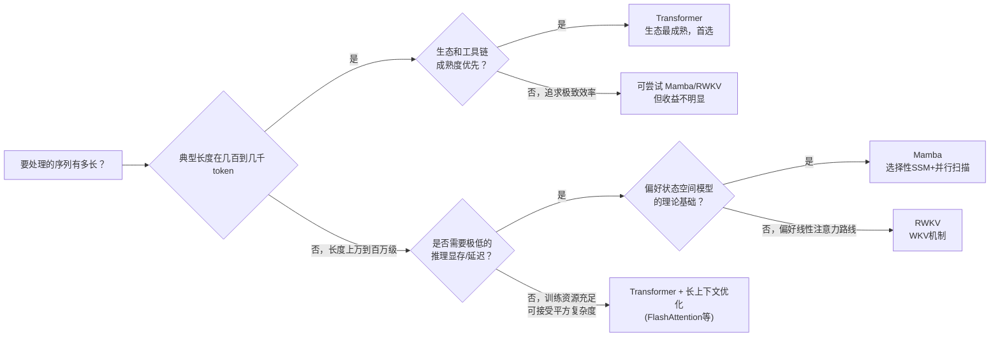

# 序列建模架构全景综述：从 RNN 到 Transformer，再到 SSM/Mamba 与 RWKV

> **综述范围**：深度学习中处理序列数据（文本、语音、时间序列、机器人动作序列）的主流架构演进——循环神经网络 RNN/LSTM → Transformer 的自注意力机制 → 结构化状态空间模型 S4 → 选择性状态空间模型 Mamba → RWKV。目标是让读者理解每一代架构在解决上一代的什么具体缺陷，并能根据自己的场景（序列长度、是否需要并行训练、推理延迟预算）判断该选哪条路线。
> **关键词**：Recurrent Neural Network、Long Short-Term Memory、Self-Attention、State Space Model、Selective State Space、Mamba、RWKV、计算复杂度、KV Cache
> **适用读者**：有基本数学素养（线性代数、基础概率）的本科生，想搞清楚"为什么会有这么多种处理序列的架构、它们到底在解决什么问题"的入门者

---

## 相关阅读

在开始之前，建议先了解（或随时回来查阅）以下内容：

- [状态空间模型 SSM 与选择性扫描：从控制论到 Mamba](/前置知识/005h_前置知识_状态空间模型SSM与选择性扫描) — 本文第四、五节 SSM/Mamba 部分的完整数学推导（递推、卷积等价性、HiPPO 初始化、选择性机制、并行扫描），本文不重复这些推导
- [Mamba 论文精读：线性时间序列建模与选择性状态空间](/论文综述/108_Mamba_线性时间序列建模与选择性状态空间) — 本文第五节 Mamba 部分的论文原始实验数据来源
- [Causal Attention 因果注意力掩码](/前置知识/001g_前置知识_Causal_Attention因果注意力掩码) — 理解 Transformer 自回归生成时的注意力掩码机制

---

## 贯穿全文的例子：处理一篇 10 万 token 的长文档

本文全程使用同一个具体场景，衡量不同架构在真实工作负载下的差异：

> **场景**：你需要用一个语言模型处理一篇 10 万 token 的长文档（大约相当于一本 15 万字中文小说，或几百页的技术手册），任务可能是摘要、问答或者检索增强生成。关键问题是：**模型在推理时的延迟和显存占用，会随着这篇文档从 1000 token 增长到 10 万 token，发生什么变化？**

不同架构对这个问题的回答天差地别——这正是本文要讲清楚的核心矛盾。每引入一种新架构，都会回来看它给这个"10 万 token 长文档"场景带来了什么改变。

---

## 一、核心矛盾：如何在"记住多少"和"算得多快"之间取舍

在深入具体架构之前，先把整条演化史背后的驱动力讲清楚。所有序列模型都要回答同一个问题：**如何把一段可能任意长的历史信息，压缩进一个可以高效计算的表示里？**

这个问题天然存在一个矛盾：

- 如果模型显式保留**全部**历史信息不压缩（比如把每个历史 token 都单独存下来，需要时直接去查），信息不丢失，但存储和计算这些信息的开销会随序列长度增长——历史越长，开销越大。
- 如果模型把历史压缩进一个**固定大小**的状态（比如一个固定维度的向量），计算开销不随序列长度增长，但压缩必然丢失信息——历史太长时，早期的关键信息可能被"挤出"这个固定容量的状态。

这条矛盾线索贯穿了整个序列建模的架构史：**RNN 选择了固定状态压缩（但压缩方式本身有缺陷）→ Transformer 选择了完全不压缩（但付出了平方级的计算代价）→ SSM/Mamba 重新回到固定状态压缩这条路，但用更精巧的数学结构和"内容感知"能力去弥补压缩带来的损失 → RWKV 试图同时保留 RNN 的推理效率和 Transformer 的训练并行性**。理解了这条主线，后面每一节具体架构的设计选择就都有了落脚点。

下图展示了这条矛盾在"10 万 token 长文档"场景下最直观的体现——自注意力的计算开销随序列长度呈平方增长，而循环类架构（RNN、SSM、Mamba）呈线性增长：

> 图中以序列长度 2048 为基准（归一化到相对开销 1），绿色的线性曲线代表 RNN/SSM/Mamba 类架构，红色的二次曲线代表 Transformer 的自注意力。在序列长度较短时两条曲线几乎重合，但当长度增长到本文场景设定的 10 万 token 时，二次曲线的相对开销已经达到线性曲线的近 49 倍——这个具体倍数是用同样的归一化基准直接计算得到的（$(100000/2048)^2 \approx 2384$，$100000/2048 \approx 48.8$，两者比值约 49），不是文学化的夸张说法。这张图会在后面每一节具体讨论各架构的推理特性时被反复引用。

---

## 二、RNN/LSTM：第一代固定状态压缩方案

### 2.1 核心思路与致命缺陷

循环神经网络（Recurrent Neural Network, RNN）是最早的序列建模方案——每一步用一个非线性函数把"当前输入"和"上一步的隐藏状态"结合起来，产生新的隐藏状态：

$$
h_t = \tanh(W x_t + U h_{t-1})
$$

**这个公式在做什么**：把当前输入和上一步的隐藏状态各自做一次线性变换、加起来，再套一个非线性函数，得到新的隐藏状态——这是 RNN 压缩历史信息的核心操作。

::: details 📐 公式详解（点击展开）

| 子表达式 | 它是谁 | 它在干嘛 |
|---------|--------|---------|
| $W x_t$ | **当前输入的贡献** | 把当前输入映射到隐藏状态空间 |
| $U h_{t-1}$ | **历史记忆的贡献** | 把上一步的隐藏状态再变换一次 |
| $\tanh(\cdot)$ | **非线性挤压器** | 把汇总信号压缩到 $(-1,1)$，同时引入非线性 |
| $h_t$ | **新隐藏状态** | 唯一的、固定维度的历史压缩表示，供下一步使用 |

**用人话读**："把这一步的输入和上一步攒下来的记忆各自过一遍线性变换、加起来，再挤一下非线性，就是新的记忆。"

**为什么是这个形式**：非线性是 RNN 表达能力的来源，但也是训练无法并行、梯度容易消失/爆炸的根源——完整推导见 [SSM 前置知识 1.2 节](/前置知识/005h_前置知识_状态空间模型SSM与选择性扫描#12-和-rnn-的相似性以及关键区别)，这里不重复。
:::

核心结论是：RNN 用一个固定维度的隐藏状态 $h_t$ 压缩全部历史，计算量随序列长度**线性**增长（$O(L)$），这正是它最初的设计目标。但 RNN 有两个致命缺陷：

**缺陷一：训练时无法并行**。计算 $h_t$ 必须先有 $h_{t-1}$，$h_{t-1}$ 必须先有 $h_{t-2}$……这是一条严格的顺序依赖链。训练一个 RNN 需要用反向传播沿时间展开（Back-Propagation Through Time, BPTT——把递推过程按时间步展开成一条长链，再沿着这条链反向传播梯度），这个过程无法像矩阵乘法一样在 GPU 上大规模并行，训练速度随序列长度线性拖慢，且拖慢的常数因子远大于并行架构。

**缺陷二：梯度消失/爆炸**。BPTT 反向传播时，梯度要连续乘过 $L$ 个雅可比矩阵（序列有多长就要连乘多少次）。如果每一步的"放大系数"略小于 1，连乘 $L$ 次后梯度会指数级衰减到几乎为零（梯度消失）——模型学不到相距很远的两个 token 之间的依赖关系；如果放大系数略大于 1，梯度会指数级爆炸，训练直接发散。序列越长，这个问题越严重，这直接限制了原始 RNN 能有效建模的序列长度（实践中通常只有几十步）。

### 2.2 LSTM：用门控机制缓解梯度问题

长短期记忆网络（Long Short-Term Memory, LSTM，Hochreiter & Schmidhuber 1997）是对原始 RNN 最重要的改进，核心思路是引入**门控**（gate）机制，显式控制信息该保留、该遗忘、还是该写入：

$$
f_t = \sigma(W_f x_t + U_f h_{t-1}), \quad c_t = f_t \odot c_{t-1} + (1-f_t) \odot \tilde c_t
$$

**这个公式在做什么**：用一个"遗忘门" $f_t$ 决定旧记忆 $c_{t-1}$ 该保留多少比例、新信息 $\tilde c_t$ 该写入多少比例——这是一个逐维度的加权平均，而不是像原始 RNN 那样把新旧信息硬塞进同一个非线性函数里。

::: details 📐 公式详解（点击展开）

| 子表达式 | 它是谁 | 它在干嘛 |
|---------|--------|---------|
| $\sigma(\cdot)$ | **开关软化器** | Sigmoid 函数，把任意实数压缩到 $(0,1)$，代表"开关的开合程度" |
| $f_t$ | **遗忘门** | 数值介于 0 和 1 之间，逐维度决定"旧记忆 $c_{t-1}$ 这一维该保留多少" |
| $f_t \odot c_{t-1}$ | **保留下来的旧记忆** | 逐元素相乘（$\odot$ 表示逐元素乘法），$f_t$ 越接近 1，旧记忆保留得越完整 |
| $(1-f_t)\odot \tilde c_t$ | **写入的新信息** | $\tilde c_t$ 是候选的新信息（由当前输入算出），$1-f_t$ 决定写入比例 |
| $c_t$ | **新的细胞状态** | 旧记忆和新信息的逐维度加权平均，作为这一步之后的记忆载体 |

**用人话读**："对记忆的每一个维度单独算一个 0 到 1 之间的'保留比例'，比例高的维度几乎原样保留旧记忆，比例低的维度大量替换成新信息——不同维度可以有完全不同的取舍。"

**为什么这样能缓解梯度消失**：注意 $c_t$ 对 $c_{t-1}$ 的梯度主要通过 $f_t \odot c_{t-1}$ 这一项传递，如果 $f_t$ 接近 1，梯度几乎无损地从 $c_t$ 传回 $c_{t-1}$（乘法系数接近 1，不会指数级衰减）。这和原始 RNN 里梯度必须穿过 $\tanh$ 的导数（永远小于 1）逐步衰减完全不同——LSTM 提供了一条"梯度高速公路"，只要遗忘门学会在需要长期记忆的地方保持打开，梯度就能相对无损地传播更远的距离。这不是彻底解决了梯度消失（$f_t$ 仍然是多个 sigmoid 相乘，长期来看仍会衰减），而是**大幅缓解**了这个问题，让 LSTM 能建模的有效序列长度比原始 RNN 长得多（几百步量级）。
:::

值得注意的是：[SSM 前置知识 3.3 节](/前置知识/005h_前置知识_状态空间模型SSM与选择性扫描#33-为什么这能实现选择性记忆遗忘和-lstm-门控的联系) 已经证明，Mamba 的选择性机制在简化情形下和 LSTM 的门控更新在数学上完全等价——这不是巧合，而是揭示了一个更深的规律：**"用一个 0 到 1 之间的门控值决定新旧信息如何混合"这个思路，是所有循环类模型解决长程依赖问题的共同答案**，LSTM 在 1997 年就已经发现了这个答案的一种具体实现，Mamba 在 2023 年用状态空间模型的数学语言重新发现了它。

### 2.3 LSTM 依然没解决的问题

即便有门控机制，LSTM 依然没有解决 RNN 最根本的**训练无法并行**问题——递推关系 $c_t = f_t \odot c_{t-1} + \ldots$ 依然要求先算完 $c_{t-1}$ 才能算 $c_t$，BPTT 依然是严格顺序的。这正是 Transformer 要解决的问题。

---

## 三、Transformer：用自注意力换取完全并行的训练

### 3.1 自注意力的核心思路

Transformer（Vaswani et al., 2017）彻底放弃了"用固定状态压缩历史"这个思路，转而让每个位置**直接**和序列中所有其他位置计算关联度：

$$
\text{Attn}(Q,K,V) = \text{softmax}\left(\frac{QK^\top}{\sqrt{d_k}}\right)V
$$

**这个公式在做什么**：让每个位置和序列中所有其他位置直接计算一次关联度打分，再按这个打分加权汇总所有位置的信息——完全不经过任何"压缩历史"的固定状态。

::: details 📐 公式详解（点击展开）

| 子表达式 | 它是谁 | 它在干嘛 |
|---------|--------|---------|
| $QK^\top$ | **两两关联度打分表** | 一个 $L\times L$ 的矩阵，每个元素是某个位置的 Query 和另一个位置的 Key 的相似度 |
| $\sqrt{d_k}$ | **缩放因子** | 防止点积数值过大导致 softmax 梯度消失 |
| $\text{softmax}(\cdot)$ | **归一化打分** | 把每一行的打分转成加起来等于 1 的权重分布 |
| $\cdot V$ | **按权重汇总信息** | 用归一化后的权重对所有位置的 Value 做加权平均 |

**用人话读**："每个位置都去问一遍序列里所有其他位置'你和我有多相关'，再按相关程度把大家的信息加权拼一起。"

**为什么是这个形式**：$L\times L$ 的打分表大小随序列长度平方增长，这正是自注意力 $O(L^2)$ 复杂度的直接来源；完整拆解见 [Causal Attention 前置知识](/前置知识/001g_前置知识_Causal_Attention因果注意力掩码) 第二节，这里只强调对本文主线最关键的一点：**自注意力显式地让每个 token 看到所有其他 token，不对历史做任何压缩**。这带来两个直接后果：

**好处：训练可以完全并行**。整条序列的 $Q, K, V$ 可以一次性用矩阵乘法算出来，$QK^\top$ 也是一次矩阵乘法——没有任何顺序依赖，GPU 可以把整个序列的计算同时铺开，这正是 Transformer 能训练到千亿参数规模的根本原因。

**代价：计算量和显存都随序列长度平方增长**。$QK^\top$ 是一个 $L \times L$ 的矩阵——序列长度翻倍，这个矩阵的元素数量变成 4 倍，计算量和显存占用都是 $O(L^2)$。回到本文的例子：处理 10 万 token 的文档，注意力矩阵有 100 亿个元素，这是显存和计算的双重灾难。

### 3.2 自回归推理时的另一个代价：KV Cache

除了训练时的平方复杂度，Transformer 在自回归生成（一次生成一个 token）时还有一个额外的推理效率问题：为了避免每生成一个新 token 就要重新计算所有历史 token 的 Key 和 Value，实践中会把已经算过的 $K, V$ 缓存下来，这个缓存叫 KV 缓存（Key-Value Cache）。KV 缓存的大小随**已生成的序列长度线性增长**，这意味着：

- 生成越长的文本，占用的显存越多——对 10 万 token 的长文档场景，KV 缓存本身就可能占用数十 GB 显存，直接限制了能同时处理的批大小（batch size）
- 每生成一个新 token，都要让这个新 token 和缓存里所有历史 K、V 做一次注意力计算——生成时间随已生成长度线性增长，不是恒定的

这正是 [Mamba 论文精读第三节](/论文综述/108_Mamba_线性时间序列建模与选择性状态空间#三-硬件感知并行扫描算法论文原文怎么讲这件事) 提到"Mamba 推理吞吐量是同规模 Transformer 的 5 倍"的直接原因——Mamba 作为真正的循环模型，推理时只需要维护一个固定大小的隐藏状态，不需要 KV 缓存，可以用远大得多的批大小做推理。

### 3.3 Transformer 留下的问题：能否兼得两者之长

Transformer 用"完全不压缩历史"换来了训练并行性，但付出了平方复杂度和线性增长的 KV 缓存这两个代价。这自然引出下一个问题：**有没有办法回到"固定状态压缩历史"的思路（获得线性复杂度和恒定的推理开销），同时又不像原始 RNN 那样丧失训练并行性？**

结构化状态空间模型（SSM）给出的第一个答案是：**如果压缩历史的方式是线性的，那么这个线性递推可以被数学上等价地改写成一个卷积，而卷积是可以并行计算的**。这正是下一节要讲的内容。

---

## 四、State Space Model（S4）：回到线性递推，用卷积换回并行性

### 4.1 核心思路：SSM 是"没有非线性激活的线性 RNN"

结构化状态空间模型（Structured State Space Model, S4，Gu et al., 2022）的递推形式和 RNN 长得几乎一样：

$$
h_t = \bar A h_{t-1} + \bar B x_t, \qquad y_t = C h_t
$$

**这个公式在做什么**：和 RNN 一样用一个固定维度的状态 $h_t$ 压缩历史，但去掉了所有非线性——新状态完全是旧状态和当前输入的线性组合。

::: details 📐 公式详解（点击展开）

| 子表达式 | 它是谁 | 它在干嘛 |
|---------|--------|---------|
| $\bar A h_{t-1}$ | **旧状态的线性延续** | 没有非线性挤压，纯矩阵乘法把旧状态变换到新状态 |
| $\bar B x_t$ | **当前输入的线性注入** | 同样是纯线性变换，直接加进状态里 |
| $C h_t$ | **输出投影** | 把内部状态线性映射成实际输出，不引入非线性 |

**用人话读**："新状态还是旧状态加当前输入，但这次全程只用矩阵乘法和加法，不套任何非线性函数。"

**为什么是这个形式**：去掉非线性正是这个递推能被等价改写成固定卷积核、从而训练可并行的根本原因，完整推导见 [SSM 前置知识 1.2-1.3 节](/前置知识/005h_前置知识_状态空间模型SSM与选择性扫描#13-为什么线性递推可以写成卷积训练并行化的关键)。
:::

这个递推可以被反复代入展开，等价地改写成一个**固定卷积核**对整条序列做卷积——训练时可以用这个卷积形式一次性并行算完整条序列的输出，完全不需要像 RNN 那样一步步顺序展开。

**这是 S4 相对 RNN 最重要的一步进展**：用"放弃非线性表达能力"这个代价，换回了"训练可以并行"这个 Transformer 才有的好处，同时保留了 RNN"计算量随序列长度线性增长、推理时用固定大小状态"的效率优势。

### 4.2 长程记忆问题与 HiPPO 初始化

单纯去掉非线性还不够——[SSM 前置知识 2.1 节](/前置知识/005h_前置知识_状态空间模型SSM与选择性扫描#21-普通-ssm-的长序列记忆衰减问题) 指出，如果状态转移矩阵 $A$ 是随机初始化的，卷积核里的权重会随"隔了多少步"指数衰减到 0，模型依然记不住太久以前的信息。S4 的关键贡献是用一种叫 HiPPO 的数学方法专门设计 $A$ 矩阵的初始值，让状态能够近似最优地压缩整段历史，而不是简单地遗忘——这让 S4 在需要记住超长程依赖的任务（如 Long Range Arena 基准测试）上表现出色，一度超过了自注意力。

### 4.3 S4 留下的问题：无法内容感知

S4 的 $\bar A, \bar B, C$ 一旦训练完成，对所有时刻、所有输入内容都完全固定不变——这个性质叫**线性时不变**（Linear Time-Invariant, LTI）。LTI 带来了"可以写成固定卷积核"这个效率优势，但也意味着模型无法"看一眼当前输入是什么"来决定要不要记住它。这在连续型信号（音频、图像）上问题不大，但在语言这种需要精确记住少数关键 token、忽略中间大量无关内容的离散数据上是个明显的短板——这正是 Mamba 要解决的问题。

---

## 五、Mamba：选择性机制补上内容感知，用并行扫描补回效率

### 5.1 核心改动：让参数依赖输入本身

Mamba（Gu & Dao, 2023）的核心改动是：让 S4 里固定不变的 $\Delta, B, C$ 变成**每一步根据当前输入重新计算**的值。[SSM 前置知识 3.2 节](/前置知识/005h_前置知识_状态空间模型SSM与选择性扫描#32-选择性机制把-deltabc-变成输入的函数) 已经完整推导了这个机制的数学形式，本文只强调它解决的核心矛盾：**选择性让模型重新获得了"内容感知"能力（该记住的记住、该忘记的忘记），但代价是参数不再是时不变的，1.3 节讲的"固定卷积核"推导不再成立——Mamba 只能用递推方式计算，理论上又变回了和 RNN 一样只能顺序处理**。

Mamba 论文用"硬件感知并行扫描算法"（并行扫描、核融合、重计算三个经典系统工程技巧的组合，详见 [SSM 前置知识第四节](/前置知识/005h_前置知识_状态空间模型SSM与选择性扫描#四-代价与解法选择性破坏了卷积用并行扫描补回来) 和 [Mamba 论文精读第三节](/论文综述/108_Mamba_线性时间序列建模与选择性状态空间#三-硬件感知并行扫描算法论文原文怎么讲这件事)）把因选择性丢失的并行效率在工程上找回来，实测速度接近甚至超过基于卷积/注意力的实现。

### 5.2 真实效果：论文报告的具体数字

[Mamba 论文精读](/论文综述/108_Mamba_线性时间序列建模与选择性状态空间) 第五节详细核实了论文报告的实验数字，这里摘录对本文主线最关键的几条：

- **推理吞吐量**：5 倍于同等规模 Transformer——因为 Mamba 不需要 KV 缓存，可以用更大批大小推理
- **语言建模效果**：Mamba-3B 在常识推理任务上的平均得分匹配甚至超过参数量两倍的 Transformer（如 Pythia-3B 高 4 个百分点，甚至超过 Pythia-7B）
- **长序列表现**：归纳头（Induction Heads）合成任务上，训练序列长度只有 256，但能完美泛化到 100 万 token（训练长度的 4000 倍），而基于注意力的方法在超过训练长度 2 倍时就开始失效
- **DNA 建模**：固定模型规模，序列长度从 1024 增长到 100 万，Mamba 的困惑度持续下降；作为对照的另一个次平方复杂度架构 HyenaDNA 反而随序列变长表现变差——这验证了"选择性"机制能主动过滤无关历史信息，而非选择性的固定卷积核只能被动地聚合所有历史（包括噪声）

回到本文"处理 10 万 token 长文档"的例子：用 Mamba 处理这样的文档，推理时的显存占用大致恒定（只需维护一个固定大小的隐藏状态），延迟随文档长度线性增长；用标准 Transformer 处理同样的文档，KV 缓存会随文档长度线性增长，而生成阶段的注意力计算本身随已处理长度也是线性增长（但训练阶段的完整自注意力是平方增长），且需要显式存储全部历史的 K、V 向量——在显存受限的部署场景下，Mamba 的这个特性是决定性优势。

---

## 六、RWKV：另一条路径，直接融合 RNN 推理效率与 Transformer 训练并行性

### 6.1 RWKV 的设计目标

RWKV（Receptance Weighted Key Value，Peng et al., 2023）走的是和 SSM/Mamba 平行的另一条路径。它的名字来自架构内部四个关键的可学习组件（R 接收门、W 位置权重衰减、K 键、V 值），核心设计目标非常直白：**构造一种模型，既能像 Transformer 一样并行训练，又能像 RNN 一样以恒定的时间和显存开销逐步做推理**。

RWKV 的核心机制是一种线性注意力（Linear Attention）的变体，被称为 WKV 机制。直觉上，标准自注意力对每个位置都要和其他所有位置计算一次关联度打分再加权求和；RWKV 的 WKV 机制则设计成可以等价地写成两种形式——一种是类似卷积/注意力的并行形式（训练时用，能一次性处理整个序列），另一种是逐步递推的形式（推理时用，每步只需要常数时间和显存，不需要缓存任何历史 K、V）。这个"训练时并行、推理时递推"的设计思路，和 [SSM 前置知识 1.3 节](/前置知识/005h_前置知识_状态空间模型SSM与选择性扫描#13-为什么线性递推可以写成卷积训练并行化的关键) 讲的"S4 的卷积-递推双重等价性"在直觉上是同一类思路，但 RWKV 是从线性注意力的角度独立发展出来的，而不是从状态空间模型的控制论传统出发。

RWKV 的模块内部包含 Time-Mixing（时间混合，负责跨位置的信息聚合，类似注意力/SSM 的角色）和 Channel-Mixing（通道混合，负责逐位置的特征变换，类似 MLP 的角色）两个子模块交替堆叠——这个"负责序列交互的模块 + 负责特征变换的模块"分工结构，和 Mamba 把二者融合进单一模块的做法形成了有趣的设计对比。

### 6.2 RWKV 在整条脉络中的位置

RWKV 在多个语言建模基准上取得了和同等规模 Transformer 相当的效果，同时保持了 RNN 式的常数推理开销。截至本文写作时，RWKV 已经迭代到多个版本（RWKV-4 到 RWKV-7），每一代都在细化 WKV 机制的具体参数化方式。本文不深入 RWKV 内部 WKV 机制的完整数学推导（这是它和 SSM/Mamba 在具体实现上的主要区别，值得后续单独写一篇前置知识展开），这里只需要读者建立一个定位：**RWKV 和 Mamba 是解决同一个核心矛盾（如何兼得线性推理复杂度和并行训练效率）的两条不同技术路径**——Mamba 从状态空间模型的控制论传统出发，加入选择性机制；RWKV 从线性注意力的角度出发，设计了 WKV 机制。两者在实践中的效果处于同一量级，具体选择更多取决于工程生态的成熟度和现有代码库的支持情况。

---

## 七、全景对比

### 7.1 五种架构的横向对比

| 维度 | RNN | LSTM | Transformer | S4 | Mamba | RWKV |
|------|-----|------|--------------|-----|-------|------|
| 训练并行性 | ❌ 严格顺序 | ❌ 严格顺序 | ✅ 完全并行 | ✅ 卷积形式并行 | ✅ 并行扫描近似并行 | ✅ 并行形式训练 |
| 推理计算复杂度 | $O(L)$ | $O(L)$ | $O(L^2)$（含 KV 缓存的自回归生成为 $O(L)$/步，累计 $O(L^2)$） | $O(L)$ | $O(L)$ | $O(L)$ |
| 推理显存 | 恒定（固定状态） | 恒定（固定状态） | 随长度线性增长（KV 缓存） | 恒定 | 恒定 | 恒定 |
| 内容感知（选择性） | 有（非线性隐式） | 有（显式门控） | 有（注意力权重本身就是内容相关的） | ❌ 无（LTI，参数固定） | ✅ 有（$\Delta,B,C$ 随输入变化） | ✅ 有（W/R 门控机制） |
| 长程依赖能力 | 弱（梯度消失/爆炸） | 中（门控缓解but仍随深度衰减） | 强（直接全局连接） | 强（HiPPO 专门设计） | 强（选择性+HiPPO 结构） | 强（W 衰减机制设计） |
| 代表模型/年代 | 1990s 经典 RNN | 1997 LSTM | 2017 GPT/BERT 系列 | 2022 S4 | 2023 Mamba | 2023 RWKV |

### 7.2 全景决策流程图

### 7.3 给读者的实践建议

1. **序列长度在几百到几千 token（多数 NLP 任务、常规对话）**：直接用 Transformer。生态最成熟——预训练权重、微调工具、推理优化（FlashAttention、量化、vLLM 等）全部围绕 Transformer 建设，选择它几乎没有额外风险。
2. **需要处理数万到百万级 token 的长序列**（长文档理解、DNA/基因组分析、长音频/视频流处理）：认真考虑 Mamba 或 RWKV。$O(L)$ 复杂度和恒定推理显存在这个长度区间是决定性优势，[Mamba 论文精读](/论文综述/108_Mamba_线性时间序列建模与选择性状态空间) 报告的实验显示它在这类场景下的效果不逊于 Transformer。
3. **部署场景对推理延迟/显存极度敏感**（边缘设备、高并发在线服务）：Mamba 的"无 KV 缓存、恒定时间每步"特性直接决定了它能用更大批大小做推理，5 倍吞吐提升在这类场景价值最大。
4. **需要模型具备强大的长程检索能力**（如"在 10 万 token 前提到的某个细节，后面要精确引用"）：这类需要精确检索的任务，注意力"显式看到所有历史"的机制仍有理论优势——完全依赖固定状态压缩的循环类模型（包括 Mamba）在这类任务上可能有信息丢失的风险，需要结合具体任务的检索精度要求做权衡，必要时可以考虑 Mamba/Transformer 混合架构（如业界已有的 Jamba、Zamba 等混合方案）。
5. **刚接触这个领域、想先建立直觉**：从 LSTM 的门控机制入手理解"如何用固定状态压缩历史"，再学 Transformer 理解"完全不压缩的代价与收益"，最后学 [SSM 前置知识](/前置知识/005h_前置知识_状态空间模型SSM与选择性扫描) 和 [Mamba 精读](/论文综述/108_Mamba_线性时间序列建模与选择性状态空间) 理解"如何在固定状态压缩的框架下重新获得内容感知能力"——这个顺序对应了本文的组织逻辑，也是这个领域技术演进的真实历史顺序。

---

## 八、总结

序列建模架构的演化史，本质上是围绕"如何压缩历史信息"这一个核心矛盾反复权衡的过程：

- **RNN** 选择了最激进的压缩（固定维度状态），但压缩方式（非线性递推）导致训练无法并行、梯度容易消失/爆炸
- **LSTM** 用门控机制改善了压缩质量（显式控制记住/遗忘），缓解但没有根除梯度问题，也没有解决训练并行性
- **Transformer** 走向另一个极端——完全不压缩历史，用显式的全局连接换取完全并行的训练，但代价是计算量随长度平方增长、推理时 KV 缓存随长度线性增长
- **S4** 重新回到固定状态压缩这条路，但发现"如果压缩是线性的，递推可以等价改写成卷积"，用这个数学性质同时获得了线性复杂度和并行训练能力,代价是牺牲了非线性表达力,且因为参数固定不变(LTI)而无法内容感知
- **Mamba** 通过让参数依赖输入（选择性机制），把内容感知能力重新加回 S4，代价是失去了固定卷积核，用硬件感知并行扫描算法在工程上把并行效率找回来
- **RWKV** 从线性注意力的角度独立走出一条类似的路径，用 WKV 机制同时实现训练并行和恒定推理开销

理解了这条主线，再遇到任何一个新的序列建模架构，读者应该能立刻问出正确的问题：**它是怎么压缩历史的？压缩过程是否具备内容感知能力？训练能否并行？推理开销随序列长度如何增长？**

## 延伸阅读

- [状态空间模型 SSM 与选择性扫描：从控制论到 Mamba](/前置知识/005h_前置知识_状态空间模型SSM与选择性扫描) — SSM 与 Mamba 完整数学推导
- [Mamba 论文精读：线性时间序列建模与选择性状态空间](/论文综述/108_Mamba_线性时间序列建模与选择性状态空间) — 论文原始实验数据与消融分析
- [Causal Attention 因果注意力掩码](/前置知识/001g_前置知识_Causal_Attention因果注意力掩码) — Transformer 自回归生成的注意力机制细节
- [深度学习归一化方法全景综述](/论文综述/S21_深度学习归一化方法全景综述) — 序列模型内部归一化层（LayerNorm/RMSNorm）的设计选择
