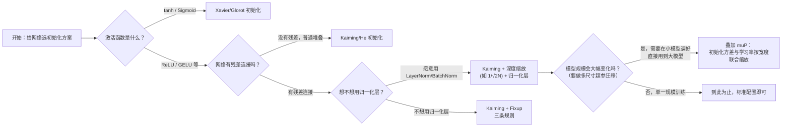

# 权重初始化方法全景综述：从"随便赋个随机数"到"联合设计初始化与学习率"

> **综述范围**：神经网络权重初始化的完整技术图谱——全零/纯随机初始化的失败模式、Xavier/Glorot 初始化、Kaiming/He 初始化、Fixup Initialization、深度缩放初始化（depth-scaled initialization）、muP（Maximal Update Parametrization，最大更新参数化）。目标是让读者看完后能回答："我的网络该用哪种初始化？为什么？如果模型要从 1 亿参数扩大到 100 亿参数，初始化要不要跟着变？"
> **关键词**：权重初始化、方差传播、Xavier、Kaiming、残差网络、Fixup、深度缩放、muP、超参迁移
> **适用读者**：有基本数学素养（会算均值、方差）的本科生，已经知道"要给权重设一个初始值"但不知道这个值该怎么选的入门者

---

## 相关阅读

本文是"单层初始化"到"现代大模型初始化"的完整技术脉络串联，建议按以下顺序阅读：

- [Xavier/Glorot 与 Kaiming/He 权重初始化](/前置知识/005i_前置知识_Xavier与Kaiming权重初始化) — 本文第二节的完整数学推导都在这篇前置知识里，本文只总结结论、不重复推导，请先读这篇
- [Fixup Initialization：无需归一化层的残差网络初始化](/论文综述/109_Fixup_Initialization无需归一化层的残差网络初始化) — 本文第三节的完整推导（残差累积、$\Theta(\eta/L)$ 设计目标、$L^{-1/(2m-2)}$ 缩放系数）都在这篇精读里
- [深度学习归一化方法全景综述](/论文综述/S21_深度学习归一化方法全景综述) — 归一化和权重初始化是解决"数值尺度失控"这同一类问题的两条不同路线，本文第七节会正式对比
- [方差与标准差](/前置知识/002c2_前置知识_方差与标准差) — 本文所有讨论的数学地基
- [深度学习优化器全景综述](/论文综述/S25_深度学习优化器全景综述) — muP 的学习率联合缩放规则建立在 SGD、Adam 优化器的更新公式之上，本文第六节会引用

---

## 贯穿全文的例子：训练一个 24 层的类 GPT-2 语言模型

为了让"选哪种初始化"这件事从头到尾都有具体的数字可以代入，本文全程使用同一个场景：

> **场景**：你要从零训练一个 24 层的 Decoder-only Transformer 语言模型（结构类似小型 GPT-2，Generative Pre-trained Transformer，一种用"预测下一个词"任务预训练的自回归语言模型），隐藏维度 $d_{\text{model}}=1024$。网络的每一层（Transformer block）内部包含两个"残差子层"——一个自注意力（Self-Attention）模块和一个前馈网络（Feed-Forward Network, FFN，通常是两层全连接）模块，每个子层的计算方式都是 $\mathbf{x}_{l+1} = \mathbf{x}_l + F_l(\mathbf{x}_l)$（残差连接）。24 层网络总共有 $N=24$ 个 block、$2N=48$ 个残差子层。
>
> 我们会在下面每一节都回到这个场景，具体回答：这个网络里的每一个 `nn.Linear` 权重矩阵，应该初始化成什么样？如果之后要把这个模型从 24 层、1024 维扩大到 48 层、4096 维，初始化要不要跟着变？

---

## 一、核心矛盾：初始化决定的是"训练开始前，数值系统是否已经崩溃"

网络训练开始前，所有权重需要一个初始值。这个初始值的**选择方式**决定了两件性质完全不同的事：

1. **对称性是否被打破**——如果所有权重都初始化成同一个值（最极端的情况是全零），同一层里所有神经元收到完全相同的梯度信号，永远学不出差异化的特征，网络退化成只有一个神经元在工作。
2. **数值尺度是否稳定**——即使打破了对称性（权重随机、独立采样），如果采样分布的方差选得不合适，激活值和梯度会随着网络深度**指数级**放大或衰减，网络在第一次前向传播时就已经数值溢出（`inf`/`nan`）或完全归零。

第一个问题的解法很直接：**权重必须独立随机采样**，不能是常数（哪怕是非零常数）。第二个问题才是本文真正的主题——**这个随机分布的方差该选多大**，以及这个答案会随着"网络有没有残差连接""用什么激活函数""网络多深""网络多宽"而系统性地变化。这正是本文要串起来的完整脉络：Xavier/Kaiming 解决"单层"的方差怎么选，Fixup 解决"残差累积"怎么补偿，深度缩放解决"现代 Transformer 该怎么按层数缩放"，muP 解决"模型宽度变化时初始化和学习率该怎么联合调整"。四条路线针对的是同一个根本问题的四个不同侧面，不是互相竞争的替代方案。

---

## 二、路线一：单层方差匹配——Xavier 与 Kaiming

### 2.1 核心结论（完整推导见前置知识）

[Xavier/Glorot 与 Kaiming/He 权重初始化](/前置知识/005i_前置知识_Xavier与Kaiming权重初始化) 已经完整推导过这两个方法，这里只总结结论，不重复推导过程：

- 对于一个全连接层 $y=Wx$，如果 $W$ 的每个元素独立同分布、均值为 0、方差为 $\text{Var}(W)$，输入维度是 $n_{\text{in}}$，那么方差传播满足 $\text{Var}(y) = n_{\text{in}}\cdot\text{Var}(W)\cdot\text{Var}(x)$——这是一个乘法关系，经过 $L$ 层后会被放大成 $(n_{\text{in}}\cdot\text{Var}(W))^L$ 倍，指数级敏感。
- **Xavier/Glorot 初始化**假设激活函数近似线性（如 $\tanh$ 在 0 附近），推导出 $\text{Var}(W) = \frac{2}{n_{\text{in}}+n_{\text{out}}}$（同时兼顾前向、反向传播的方差稳定），常见简化版本是 $\frac{1}{n_{\text{in}}}$。
- **Kaiming/He 初始化**专门针对 ReLU（Rectified Linear Unit，修正线性单元，$\text{ReLU}(x)=\max(0,x)$，现代网络最常用的激活函数）——因为 ReLU 会把负半部分砍掉，让方差正好减半，所以把 Xavier 的方差公式再乘以 2 补偿：$\text{Var}(W) = \frac{2}{n_{\text{in}}}$。

### 2.2 代入例子：Transformer 里的 Linear 层该用哪个

回到贯穿全文的 24 层 Transformer 例子——它的前馈网络（FFN）内部用的激活函数通常是 GELU（Gaussian Error Linear Unit，高斯误差线性单元，ReLU 的一种平滑近似变体，形状和 ReLU 高度相似：负半轴大部分被压低到接近 0，正半轴基本保留），行为上更接近 ReLU 而非 $\tanh$。因此 Transformer 的 FFN 层权重理论上应该用 **Kaiming 初始化**而不是 Xavier——虽然实践中很多 Transformer 实现（包括原始 GPT-2）出于简化，直接用固定标准差（如 0.02）的高斯分布初始化所有 Linear 层，效果上和严格的 Kaiming 公式差异不大（因为 $d_{\text{model}}=1024$ 时 $\sqrt{2/1024}\approx 0.044$，和 0.02 属于同一数量级），但严格来说这是"经验简化"，不是"理论最优"。

### 2.3 用曲线图直观感受方差随深度的变化

下图模拟一个 20 层、宽度 $n=512$ 的全连接网络，对比四种权重方差设置下激活值方差随深度的变化轨迹：


> 图中横轴是层数，纵轴是激活值方差（对数坐标）。红色（方差过大，$\text{Var}(W)=10/n$）和橙色（方差过小，$\text{Var}(W)=0.2/n$）曲线迅速偏离 1，20 层后分别达到约 $10^{20}$ 和 $10^{-14}$ 量级——这在实际训练中会直接导致数值溢出或梯度完全消失。蓝色（Xavier 配 $\tanh$）和绿色（Kaiming 配 ReLU）两条曲线全程稳定在 1 附近，几乎是水平线。紫色虚线是"把 Xavier 错误用在 ReLU 网络上"的情形——每层方差按 $\times 0.5$ 的速度衰减，20 层后已经降到约 $10^{-6}$。**这张图验证的核心结论**：方差稳定不是自动发生的，初始化公式必须和激活函数精确匹配。

Xavier 和 Kaiming 共同的局限是：**它们的推导框架只考虑"单独一层"**，隐含假设是前一层已经把输入方差稳定在合理范围。这个假设在纯前馈网络（层与层之间是简单堆叠）里成立，但在残差网络（$y=x+F(x)$）里会被打破——这正是下一节 Fixup 要解决的问题。

---

## 三、路线二：残差累积补偿——Fixup

### 3.1 问题：残差连接让方差"累积"而非"传播"

[Fixup Initialization 精读](/论文综述/109_Fixup_Initialization无需归一化层的残差网络初始化) 完整证明了一个反直觉的结论：**即使残差分支 $F_l$ 内部每一层都用 Kaiming 初始化得无比"标准"，只要 $F_l$ 的输出方差不精确为 0，主干信号 $\mathbf{x}_l = \mathbf{x}_0+\sum_{i<l}F_i(\mathbf{x}_i)$ 的总方差就会随深度**单调递增**——这是加法结构的数学必然，不是初始化没调好导致的意外。如果每个残差块贡献的方差近似等于输入方差，方差会以 $2^L$ 的速度指数增长；用贯穿全文的例子代入，24 层、48 个残差子层的网络，如果不加干预，方差理论上会涨到 $2^{48}\approx 2.8\times10^{14}$ 倍——早已超出浮点数值的合理范围。

这就是为什么标准 Transformer 几乎从不省略归一化层：**归一化在每一次前向传播时都强行把方差拉回 1，抵消残差结构导致的累积**。Fixup 论文要回答的问题是——如果不想用归一化层，能不能只靠初始化就避免这种累积？

### 3.2 核心洞察与解法（完整推导见精读）

Fixup 的关键转变是把设计目标从"让激活值方差保持稳定"换成"**让每一步梯度下降更新对网络输出的影响幅度保持在 $\Theta(\eta)$ 这个量级，不随深度 $L$ 增长**"。论文证明：因为残差网络里 $L$ 个分支的更新方向是高度相关的（会累加而不是抵消），要让总的更新幅度稳定在 $\Theta(\eta)$，就必须让**每一个分支单独**只贡献 $\Theta(\eta/L)$ 的更新——这个目标最终转化成三条可执行规则：

1. 把每个残差分支内部的最后一层权重初始化为 **0**（分支训练开始时精确不贡献任何输出）；
2. 分支内其余各层先用 Kaiming 初始化，再额外乘上缩放系数 $L^{-\frac{1}{2m-2}}$（$L$ 是残差分支总数，$m$ 是分支内部层数）；
3. 补充可学习的标量偏置（初始化 0）和乘数（初始化 1），补偿归一化层原本承担的调节功能。

论文用这套方案训练了**一万层**残差网络，全程不用任何归一化层，训练稳定性和用 BatchNorm 相当。

### 3.3 代入例子：24 层 Transformer 如果不想用 LayerNorm

如果贯穿全文的 24 层 Transformer 想去掉所有 LayerNorm（Layer Normalization，层归一化，详见 [归一化方法全景综述](/论文综述/S21_深度学习归一化方法全景综述)），按 Fixup 规则，每个残差子层（自注意力或 FFN）的输出投影层权重要初始化为 0，其余层乘上 $48^{-\frac{1}{2m-2}}$（$L=48$ 个残差子层）。Fixup 论文在 Transformer 机器翻译任务上验证了这套方案能达到和 LayerNorm 完全相同的 BLEU（一种翻译质量评分指标）分数，证明这不只是 CNN（Convolutional Neural Network，卷积神经网络）专属的技巧。

Fixup 和下一节要讲的"深度缩放初始化"共享同一个核心直觉——**残差分支的输出幅度应该随网络深度增大而主动缩小**——但两者的推导严谨程度和应用场景略有不同：Fixup 是为了完全去掉归一化层而设计的精确理论方案；深度缩放初始化更多是现代 Transformer 在**保留**归一化层的前提下，作为"锦上添花"的稳定性补充。

---

## 四、路线三：深度缩放初始化——现代 Transformer 的标配技巧

### 4.1 为什么保留了归一化层，还需要深度缩放

第三节说明了归一化层能在每次前向传播时把方差拉回正常范围，但**归一化层校正的是"这一层输出的分布"，不能改变"残差主干里已经累积了多少信号"**——主干信号 $\mathbf{x}_0+\sum F_i(\mathbf{x}_i)$ 依然在逐层变大，只是每个 $F_i$ 内部（在归一化层之后）的数值是健康的。这意味着深层 Transformer 里，**越靠后的残差子层，看到的主干信号幅度越大**，如果每个子层的输出投影层都用同样大小的初始化，靠后的子层相对于已经累积的主干信号而言，贡献的扰动比例会不成比例地大，容易在训练早期造成不稳定（尤其是大学习率、大模型场景下的损失尖峰）。

**深度缩放初始化（depth-scaled initialization）**的思路是：**主动把每个残差子层输出投影层的初始化幅度按总层数缩小**，让每个子层在训练一开始贡献的"新信息量"和它在整个残差累积中所占的相对比例大致匹配，而不是让所有子层都贡献同样大小的原始扰动。

### 4.2 GPT-2 的具体做法

GPT-2（OpenAI 2019 年发布的语言模型）在其原始实现中采用了一个具体的深度缩放规则：把每个残差子层输出投影层（自注意力的输出投影、FFN 的下投影层）的权重，在标准初始化基础上再乘以一个和总残差子层数相关的缩放因子。这个做法在 GPT-2 论文中被描述为"考虑残差路径上的累积效应，按残差层数对权重做特别缩放"，后续的开源复现实现（如 Andrej Karpathy 的 nanoGPT）把这个规则具体化为：

$$
W_{\text{proj}} \leftarrow W_{\text{proj}}^{\text{std}} \cdot \frac{1}{\sqrt{2N}}
$$

**这个公式在做什么**：给残差分支的"最后一步"（把内部计算结果重新投影回主干维度的那一层）额外打一个折扣，折扣力度随网络总层数 $N$ 增大而增大——网络越深，每个残差子层往主干上"加"的东西就要越"轻"。

::: details 📐 公式详解（点击展开）

| 子表达式 | 它是谁 | 它在干嘛 |
|---------|--------|---------|
| $W_{\text{proj}}^{\text{std}}$ | **标准初始化给出的权重** | 先用 Kaiming/Xavier 或固定标准差高斯分布正常初始化一遍 |
| $N$ | **Transformer block 的总数（层数）** | 网络越深，这个数越大，最终的缩放系数就越小 |
| $2N$ | **残差子层总数** | 每个 block 贡献 2 个残差子层（自注意力 + FFN），所以是层数的 2 倍 |
| $\frac{1}{\sqrt{2N}}$ | **深度缩放因子** | 只作用在每个残差子层"往主干投影"的最后一层权重上，不影响子层内部其他层 |

**用人话读**："网络的自注意力模块和前馈网络模块，各自往主干信号上添加修正量时，添加的力度要除以'总残差子层数的平方根'——层数越多，每一层往主干上写入的东西就要写得越轻，避免大家的贡献叠加起来把主干信号越撑越大。"

**为什么是平方根而不是直接除以 $N$**：这和 Fixup 第 4.1 节推导的 $L^{-\frac{1}{2m-2}}$ 思路是同一族解法——如果每个分支的输出方差是独立随机的,$L$ 个独立方差为 $\sigma^2$ 的分支加起来,总方差是 $L\sigma^2$（不是 $L^2\sigma^2$），要让总方差不随 $L$ 增长，需要单个分支的方差是 $\sigma^2 \propto 1/L$，对应权重标准差是 $1/\sqrt{L}$——这正是"平方根"出现的数学原因（方差的加法性质，而不是标准差的加法性质）。
:::

用贯穿全文的例子代入：24 层、$2N=48$ 个残差子层的网络，深度缩放因子是 $\frac{1}{\sqrt{48}}\approx 0.144$——每个残差子层的输出投影层权重，要在标准初始化的基础上再缩小到约 14.4%。这个技巧不需要像 Fixup 那样把归一化层完全去掉,是"顺手做的低成本改进"，几乎所有现代大规模 Transformer（GPT 系列、LLaMA 等）都采用类似思路。

---

## 五、路线四：muP——把初始化和学习率联合设计，实现零样本超参迁移

### 5.1 一个新的问题：模型变大之后，超参数还是原来那套吗

前四节讨论的都是"深度"这一个维度——网络有多少层。但现代大模型训练还有另一个关键维度：**宽度**（隐藏层维度 $d_{\text{model}}$，注意力头数等）。一个经验事实困扰了大模型训练者很多年：**在标准初始化和学习率设置下，把模型宽度从 1024 扩大到 4096，之前调好的最优学习率会失效**——模型越宽，最优学习率往往要越小，且这个关系并不简单，需要为每个新的模型规模重新做一次昂贵的超参数搜索（对于百亿、千亿参数模型，一次完整的学习率搜索本身就是数百万美元级别的计算开销）。

**muP（Maximal Update Parametrization，最大更新参数化）**——由 Yang 等人在 Tensor Programs 系列论文（2021-2022 年）中提出——要解决的正是这个问题：**能不能设计一套初始化和学习率的联合缩放规则，让"小模型上调好的最优超参数"直接原样适用于"大模型"，不需要重新搜索？**这个能力被称为**零样本超参迁移（zero-shot hyperparameter transfer，muTransfer）**——"零样本"指完全不需要在目标大模型上做任何超参数试验。

### 5.2 核心思路：让每一层的激活值、梯度、参数更新幅度都不随宽度改变

muP 的推导逻辑和 Fixup 的"控制每一步更新对输出的影响"高度相似，只是把"控制的维度"从"深度"换成了"宽度"。核心设计原则是：**网络里的每一个操作（矩阵乘法、注意力、参数更新），其输出的数值尺度都不应该随隐藏维度 $d_{\text{model}}$ 的变化而改变**——如果每一层都满足这个不变性，整个网络在不同宽度下的训练动态就会高度一致，最优超参数自然也保持稳定。

具体的缩放规则可以总结为：

$$
\sigma_W^2 = \frac{\sigma_{\text{base}}^2}{m_d}, \qquad \eta_{\text{Adam}} = \frac{\eta_{\text{base}}}{m_d}, \qquad m_d = \frac{d_{\text{model}}}{d_{\text{model,base}}}
$$

**这个公式在做什么**：给出隐藏层权重的初始化方差和 Adam（一种自适应学习率的优化器，详见 [优化器全景综述](/论文综述/S25_深度学习优化器全景综述)）学习率该如何随"宽度倍数" $m_d$ 联合缩小，从而保证网络在任意宽度下的激活值和参数更新幅度都保持一致。

::: details 📐 公式详解（点击展开）

| 子表达式 | 它是谁 | 它在干嘛 |
|---------|--------|---------|
| $d_{\text{model,base}}$ | **调超参数用的小型代理模型的宽度** | 比如先在宽度 256 的小模型上做一次完整的超参数搜索 |
| $d_{\text{model}}$ | **实际要训练的目标模型宽度** | 比如最终要训练的宽度是 4096 的大模型 |
| $m_d = d_{\text{model}}/d_{\text{model,base}}$ | **宽度倍数** | 目标模型比代理模型"宽"了多少倍——所有缩放规则都以这个比例为准，不是绝对宽度 |
| $\sigma_{\text{base}}^2, \eta_{\text{base}}$ | **在小代理模型上搜索到的最优初始化方差和学习率** | 这是唯一需要花计算资源去调的超参数,只需要在小模型上调一次 |
| $\sigma_W^2=\sigma_{\text{base}}^2/m_d$ | **目标大模型的初始化方差** | 宽度越大,单层权重方差要按比例缩小——这和 Xavier/Kaiming 里"输入维度越大、权重方差越小"的直觉一致,只是这里显式引入了"倍数"这个相对视角 |
| $\eta_{\text{Adam}}=\eta_{\text{base}}/m_d$ | **目标大模型的学习率** | 模型越宽,学习率也要按比例缩小,这正是前面提到的"模型越宽最优学习率越小"这个经验现象的理论来源 |

**用人话读**："先在一个小号模型上，花较小的代价把初始化和学习率调到最优；把这套配置里的方差和学习率，都按照'大模型比小模型宽多少倍'这个比例缩小，直接套到大模型上，不需要在大模型上重新搜索。"

**为什么初始化和学习率必须联合缩放，只调一个不够**：muP 的推导框架（呼应第三节 Fixup 的思路）把训练过程拆成"前向传播的激活值尺度""反向传播的梯度尺度""参数更新对输出的影响幅度"三个环节分别控制——初始化只能控制前两个环节在**训练开始那一刻**的尺度，参数更新之后激活值会不会继续保持稳定，取决于学习率有没有配合着一起缩放。只调初始化、不调学习率（或者反过来），网络在训练几步之后依然会出现"尺度随宽度漂移"的问题，超参数迁移也就不成立。
:::

### 5.3 muP 已被验证的效果

muP 不是纯理论构想——EleutherAI 与 Cerebras 联合发布的实践指南（2024 年）用 GPT-2 结构的模型做了实测：在标准参数化（Standard Parameterization, SP）下，不同宽度模型的最优学习率明显不同；换成 muP 参数化后，四种不同宽度、每种三个随机种子的模型，最优学习率保持稳定在同一个值附近，标准参数化则做不到。原始 muP 论文（Yang 等，2022）报告了一个更具体的结果：用一个 4000 万参数的小型代理模型做 200 组超参数随机搜索，把搜到的最优配置直接迁移到 67 亿参数的 GPT-3 规模模型上，取得了和直接花费大得多的算力单独调参的 130 亿参数模型相当的效果——相当于用很小的额外开销省下了差不多一半的大模型调参算力。

这个验证过程用到的方法叫**坐标检查（coordinate check）**：训练几种不同宽度的模型各跑 10 步，记录每一步每种层类型的平均激活值幅度。如果用标准参数化（SP），激活值幅度会随宽度成比例增长——这正是超参数不稳定的根源，因为激活值幅度一变，"多大的学习率算合适"这个判断标准也跟着变了。换成 muP 之后，激活值幅度曲线在不同宽度下几乎完全重合，这张"重合的曲线图"就是 muP 实现生效的直接证据。这个验证方法的价值在于——它把"超参数能不能迁移"这个抽象问题，转化成了"画个图看激活值幅度是否随宽度变化"这个具体、可操作的工程检查步骤，任何团队在自己的代码里接入 muP 之后，都应该先跑一次坐标检查再去做大规模超参数搜索，避免实现细节出错导致迁移失败却没有察觉。

### 5.4 一个容易被忽略的细节：注意力分数也要按宽度缩放

muP 的完整规则里还有一处经常被忽略但很关键的细节：**自注意力机制里 Query 和 Key 点积之后的缩放系数，标准做法是除以 $\sqrt{d_{\text{head}}}$（$d_{\text{head}}$ 是每个注意力头的维度），但严格的 muP 规则要求除以 $d_{\text{head}}$（不带平方根）**。原因是标准的 $1/\sqrt{d_{\text{head}}}$ 缩放只在训练**刚开始**（$Q,K$ 相互独立、未经训练）时能保持注意力分数的方差稳定；但训练进行一段时间后，$Q$ 和 $K$ 会在梯度下降的驱动下逐渐"对齐"（产生相关性），这时候 $1/\sqrt{d_{\text{head}}}$ 的缩放就不够了，注意力分数的方差会继续随宽度增长。EleutherAI 与 Cerebras 的联合实测（用"坐标检查"——记录训练若干步后各层激活值的平均幅度是否随宽度变化——的方法）验证了：只有换成 $1/d_{\text{head}}$ 缩放，注意力分数的尺度才能在训练**全程**（不只是初始化那一刻）保持和宽度无关。这个细节体现了 muP 一个更普遍的设计原则——**所有的尺度控制都必须验证"训练若干步之后依然成立"，不能只验证初始化那一瞬间**，这也是 muP 相比 Xavier/Kaiming（只关心初始化那一刻的方差）更严格的地方。

### 5.5 muP 和前三条路线的关系：互补而非替代

muP 解决的是"**宽度**"变化带来的尺度漂移，Xavier/Kaiming 解决的是"**单层**"该选多大方差，Fixup 和深度缩放解决的是"**深度**"累积带来的尺度漂移。三者在实践中是可以叠加使用的——一个现代大模型的完整初始化方案，往往是"Kaiming/固定标准差高斯分布作为单层基础方差 + 深度缩放系数补偿残差累积 + muP 的宽度缩放系数补偿模型规模变化"三层叠加的结果，而不是"用了 muP 就不需要 Kaiming"这种替代关系。

---

## 六、工程实践：这些公式在代码里长什么样

前面五节讲的都是"该选多大方差"的数学推导，这一节把结论落到具体的 PyTorch（一个主流深度学习框架）代码上——读者应该能在看完这几段代码后，直接照着改自己的模型初始化逻辑。

**Xavier 和 Kaiming 是 PyTorch 内置的一行函数调用**，因为它们只依赖权重矩阵自身的形状（`fan_in`、`fan_out` 由 `nn.init` 自动从张量形状推断），不需要额外传入网络深度这类全局信息：

```python
import torch.nn as nn

linear_tanh = nn.Linear(1024, 1024)
nn.init.xavier_normal_(linear_tanh.weight)      # 配 tanh/Sigmoid

linear_relu = nn.Linear(1024, 1024)
nn.init.kaiming_normal_(linear_relu.weight, nonlinearity='relu')  # 配 ReLU/GELU
```

**Fixup 和深度缩放初始化需要额外知道"网络总层数"**，因此不能只调用一个通用初始化函数，必须在构建模型时手动传入层数信息，再对特定的权重（残差分支的最后一层/输出投影层）做二次缩放。以贯穿全文的 24 层 Transformer 为例，深度缩放（GPT-2 风格）的实现思路是：先用标准方式初始化输出投影层，再乘上和总残差子层数相关的系数：

```python
import math

N = 24          # Transformer block 总数
num_residual_sublayers = 2 * N   # 每个 block 贡献 2 个残差子层（注意力 + FFN）
depth_scale = 1.0 / math.sqrt(num_residual_sublayers)

for block in model.blocks:
    nn.init.kaiming_normal_(block.attn.out_proj.weight, nonlinearity='relu')
    block.attn.out_proj.weight.data.mul_(depth_scale)   # 4.2 节的 1/√(2N) 缩放
    nn.init.kaiming_normal_(block.ffn.down_proj.weight, nonlinearity='relu')
    block.ffn.down_proj.weight.data.mul_(depth_scale)
```

这段代码里只对`out_proj`（注意力输出投影）和`down_proj`（FFN 把隐藏维度投影回主干维度的那一层）做了缩放——这两层正是"往残差主干上写入修正量"的最后一步，对应第四节推导里"需要额外打折扣"的那一层；其余层（比如注意力内部的 Q/K/V 投影、FFN 的上投影层）保持标准 Kaiming 初始化不变，因为它们的输出还要经过本模块内部的其他计算，不会直接叠加到主干信号上。Fixup 的规则 1（把分支最后一层权重直接设为 0）实现起来更简单，只需要把上面`mul_(depth_scale)`换成`.zero_()`。

**muP 的初始化和学习率需要联合设置**，实现上通常需要给不同的参数组分别指定学习率倍数（PyTorch 的优化器支持按参数组设置不同学习率）：

```python
m_d = 4096 / 256   # 目标模型宽度 4096，代理模型宽度 256，宽度倍数 m_d=16

for module in model.modules():
    if isinstance(module, nn.Linear) and module is not model.output_head:
        std = sigma_base / math.sqrt(m_d)      # 5.2 节：方差按 1/m_d 缩放，标准差按 1/√m_d
        nn.init.normal_(module.weight, std=std)

optimizer = torch.optim.AdamW([
    {'params': hidden_params, 'lr': eta_base / m_d},   # 隐藏层学习率按 1/m_d 缩放
    {'params': embedding_params, 'lr': eta_base},        # embedding 层不参与宽度缩放
])
```

这里`sigma_base`和`eta_base`是在小号代理模型（宽度 256）上搜索到的最优值，套用到宽度 4096 的目标模型时，只需要按`m_d`做除法，不需要重新搜索——这正是 muTransfer（muP 的零样本超参迁移能力）在代码层面的具体体现。

---

## 七、全景对比表

| 方法 | 针对的激活函数/结构 | 权重方差目标公式 | 是否需要配合归一化层 | 核心思想 |
|------|-------------------|-----------------|-------------------|---------|
| Xavier/Glorot | $\tanh$、Sigmoid（近似线性区） | $\dfrac{2}{n_{\text{in}}+n_{\text{out}}}$（简化 $\dfrac{1}{n_{\text{in}}}$） | 无残差网络中不强制需要 | 让单层前向+反向方差都保持稳定 |
| Kaiming/He | ReLU、LeakyReLU、GELU | $\dfrac{2}{n_{\text{in}}}$（`fan_in`） | 无残差网络中不强制需要 | 补偿 ReLU 砍掉一半方差的效应 |
| Fixup | 残差网络（ResNet、Transformer），任意 positively-homogeneous 激活 | 分支最后一层置 0，其余层乘 $L^{-\frac{1}{2m-2}}$ | **不需要**（专为替代归一化设计） | 控制每个残差分支的 SGD 更新幅度为 $\Theta(\eta/L)$ |
| 深度缩放初始化（如 GPT-2） | 残差 Transformer | 输出投影层乘 $\dfrac{1}{\sqrt{2N}}$ | 通常**仍搭配** LayerNorm | 补偿残差累积，是归一化之外的"锦上添花" |
| muP | 任意架构，重点是宽度可变的大模型 | $\sigma_W^2=\sigma_{\text{base}}^2/m_d$，学习率同步按 $1/m_d$（Adam）缩放 | 与归一化层选择无关，独立正交 | 让激活值/梯度/更新幅度不随宽度改变，实现超参数零样本迁移 |

---

## 八、决策流程图



> 这条流程图的判断顺序对应本文四节的递进关系：先看激活函数（Xavier vs Kaiming），再看有没有残差累积问题（Fixup vs 深度缩放，取决于要不要归一化层），最后看有没有"模型规模会变化"这个额外维度（叠加 muP）。四个判断互相独立，可以按需组合。

---

## 九、总结

权重初始化看似只是训练开始前"随手赋一个随机数"的小细节，但本文串起来的四条路线证明了它其实是一个有完整数学结构的问题，且这个结构会随着网络架构演进不断暴露出新的侧面：

1. **单层视角（Xavier/Kaiming）**：权重方差必须匹配激活函数的性质（线性 vs ReLU 砍一半），否则方差会随深度指数级偏离，这是所有后续讨论的地基。
2. **残差累积视角（Fixup）**：残差连接的加法结构会让方差随深度单调增长，这是 Xavier/Kaiming 单层框架完全没有考虑的新问题,Fixup 证明了这个问题可以只靠初始化（不用归一化层）精确解决。
3. **深度缩放视角（GPT-2 等）**：在保留归一化层的前提下,现代 Transformer 依然会对残差子层输出做深度相关的缩放,作为归一化的低成本补充。
4. **宽度视角（muP）**：当模型规模本身成为一个需要跨越的维度时（从小模型调参迁移到大模型）,初始化必须和学习率联合设计,才能保证训练动态在不同宽度下保持一致。

理解这四条路线的关键不是记住四个公式,而是理解它们分别在回答"深度不变""残差不爆炸""层数变化""宽度变化"这四个不同但相关的稳定性问题——**它们是同一个"数值尺度不能失控"这个大问题在不同架构维度上的具体化,不是互相竞争的备选项,而是可以叠加组合的工具箱**。

### 9.1 常见误区自查表

写代码时容易踩的几个坑，用一张表总结：

| 误区 | 后果 | 正确做法 |
|------|------|---------|
| 给 ReLU 网络用 Xavier（而不是 Kaiming） | 每层方差衰减到一半，几十层后梯度基本消失（本文图 2.3 紫色虚线就是这个情形） | ReLU/GELU 系激活函数一律用 Kaiming |
| 残差网络直接套用 Kaiming，不做任何深度补偿 | 方差随深度指数累积，深层网络训练初期极易出现损失突然变成 `nan` | 配合归一化层，或叠加 Fixup/深度缩放系数 |
| Fixup 把整个残差分支（而不是只有最后一层）权重清零 | 反向传播时梯度链条被清零的层截断为 0，分支永远学不到东西 | 只清零分支内部**最后一层**，前面各层保持正常初始化 |
| 模型扩大后，学习率照抄小模型的值，不做 muP 缩放 | 大模型训练不稳定或收敛变慢，被迫重新做昂贵的学习率搜索 | 用 muP 规则把初始化方差和学习率都按宽度倍数 $m_d$ 同步缩放 |
| 只调整了 muP 的初始化方差，没有同步调整学习率 | 初始化那一刻数值正常，但训练几步之后尺度又开始随宽度漂移 | 初始化和学习率必须联合缩放，缺一不可（5.2 节已说明原因） |

### 9.2 一句话记忆法

如果只能记住一句话："**先按激活函数选 Xavier 还是 Kaiming，再看有没有残差连接决定要不要加深度补偿，最后看模型规模会不会变化决定要不要上 muP——四层判断层层叠加，不是互相替代。**"

## 延伸阅读

- [Xavier/Glorot 与 Kaiming/He 权重初始化](/前置知识/005i_前置知识_Xavier与Kaiming权重初始化) — 本文第二节依赖的完整数学推导
- [Fixup Initialization：无需归一化层的残差网络初始化](/论文综述/109_Fixup_Initialization无需归一化层的残差网络初始化) — 本文第三节依赖的完整精读
- [深度学习归一化方法全景综述](/论文综述/S21_深度学习归一化方法全景综述) — 和初始化互补的另一条数值稳定路线，本文第七节决策流程图中"要不要归一化层"的分支详见此文
- [深度学习优化器全景综述](/论文综述/S25_深度学习优化器全景综述) — muP 的学习率联合缩放规则建立在 Adam/SGD 优化器机制之上
- [方差与标准差](/前置知识/002c2_前置知识_方差与标准差) — 本文所有数学讨论的基础
