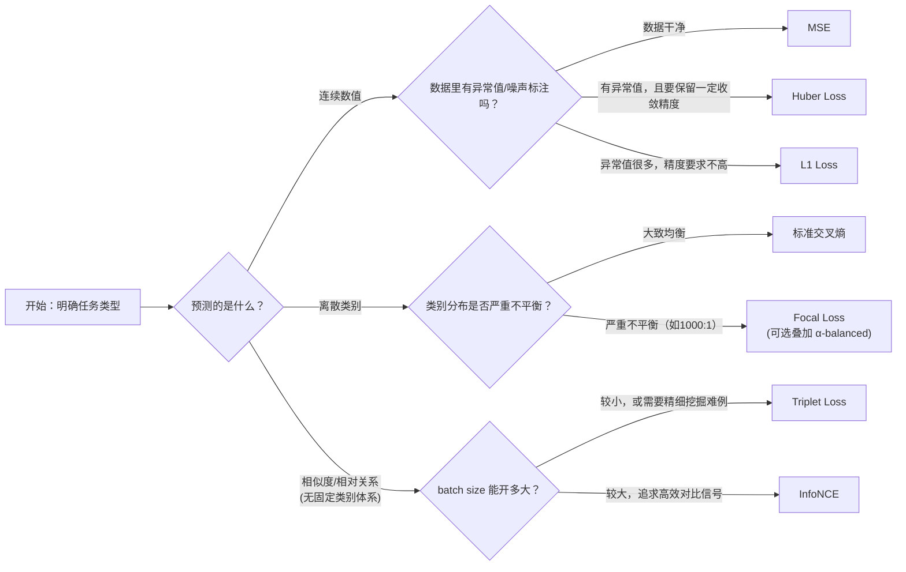

# 深度学习损失函数全景综述：从"预测一个数"到"判断一个类"到"学一个相似度"

> **综述范围**：深度学习里最常用的三大类损失函数——回归类损失（MSE、L1、Huber）、分类类损失（交叉熵、Focal Loss）、度量学习/对比类损失（Triplet Loss、InfoNCE）。目标是让读者看完后能回答："我的任务该用哪个损失函数？如果数据里有异常值怎么办？如果类别数量严重不平衡怎么办？如果我根本没有类别标签、只有'哪些样本应该相似'这种信息怎么办？"
> **关键词**：均方误差、平均绝对误差、Huber Loss、交叉熵、Softmax、Focal Loss、类别不平衡、对比学习、InfoNCE、Triplet Loss
> **适用读者**：有基本数学素养（会算均值、方差、导数）的本科生，知道"训练神经网络需要一个损失函数"，但不清楚不同任务该选哪种、以及它们背后的设计逻辑

---

## 相关阅读

本文串联了项目里已有的多篇前置知识和精读，建议按需跳转阅读：

- [交叉熵损失与 Softmax](/前置知识/003f_前置知识_交叉熵损失与Softmax) — 本文第三节分类损失的完整数学根基，本文只总结结论、不重复推导
- [Focal Loss 与类别不平衡](/前置知识/005j_前置知识_Focal_Loss与类别不平衡) — 本文第四节的完整公式推导、$\gamma$ 参数分析都在这篇前置知识里
- [Focal Loss for Dense Object Detection 论文精读](/论文综述/110_Focal_Loss_密集目标检测的焦点损失) — Focal Loss 提出时的具体应用场景（RetinaNet 目标检测）和实验数据
- [对比学习与 InfoNCE：CLIP 如何用图文对齐学会理解世界](/前置知识/003h_前置知识_对比学习与InfoNCE_CLIP) — 本文第五节度量学习部分引用的完整推导
- [时域 Loss 与频域 Loss（动作序列的双重监督）](/前置知识/002u_前置知识_时域Loss与频域Loss) — MSE 在时序/动作生成场景下的一个具体扩展应用
- [重参数化技巧](/前置知识/002e_前置知识_重参数化技巧) — 理解损失函数里"期望"如何用采样近似时会用到

---

## 贯穿全文的例子

为了让"该选哪个损失函数"这件事从头到尾都有具体场景可以代入，本文全程交替使用两个场景：

> **场景 A（回归）：一个机械臂预测末端执行器下一步的位移**。真实位移是 $+2.0\text{cm}$，模型在训练过程中给出了一系列预测值，有时候预测得很准（如 $+1.9\text{cm}$），有时候因为传感器噪声或演示数据里的偶发误标注，会出现离谱的错误预测（如 $+15\text{cm}$，实际上是一次遥操作数据采集时的手抖）。我们会用这个场景来说明 MSE、L1、Huber 在面对"正常误差"和"离群误差"时的不同表现。
>
> **场景 B（分类 + 不平衡 + 度量）：一个目标检测器要判断图像中一万个候选框里哪些是目标**。这一万个候选框中，9900 个是背景，只有 100 个真正包含目标——这是第四节 Focal Loss 部分会反复使用的具体数字。同一个场景稍加改造还能引出度量学习：假设我们不满足于"是不是目标"，还想知道"这个目标和数据库里哪个已知物体最相似"——这就是第五节对比损失要解决的问题。

---

## 一、核心矛盾：损失函数在为"梯度下降该往哪走"打分

### 1.1 损失函数的本质角色

神经网络训练的核心循环是：模型给出预测 → 损失函数把"预测"和"真实标签"的差距换算成一个标量数字 → 反向传播根据这个数字算出每个参数该往哪个方向调整。**损失函数的设计，本质上是在设计"什么样的错误该被重罚，什么样的错误可以从轻"这件事的具体规则**。这个规则一旦选定，训练全程的梯度方向都会被它左右——同样的模型、同样的数据，换一个损失函数，最终学到的行为可能截然不同。

### 1.2 三大类问题决定了三大类损失函数

深度学习任务可以按"要预测什么"分成三大类，每一类都对应着"错误该怎么衡量"的不同直觉：

1. **回归类**：预测一个连续数值（位移、价格、深度值）。错误的衡量方式很直接——预测值和真实值的差距有多大。但这个"差距"该怎么换算成惩罚，是本文第二节要讨论的核心问题：差距的平方？差距的绝对值？还是两者的某种混合？
2. **分类类**：预测一个离散类别（这是不是目标、这张图是猫还是狗）。这里的核心矛盾不是"差多少"，而是"模型对正确答案的信心有多低"——这引出交叉熵损失（第三节），以及当类别数量严重失衡时交叉熵会失效的问题——这引出 Focal Loss（第四节）。
3. **度量学习/对比类**：不预测具体数值或类别，而是学习"什么东西该被认为相似、什么该被认为不同"。这类任务往往连标签都没有——只有"这两个样本应该靠近"或"应该远离"这种相对关系（第五节）。

这三类问题不是互相竞争的方案，而是**针对不同任务本质需求的正交工具箱**——一个视觉-语言-动作模型可能同时用到全部三类：用回归损失训练动作输出头，用分类损失训练动作 token 的自回归预测，用对比损失训练视觉编码器。理解每一类损失函数解决的具体问题，比死记它们的公式更重要。

---

## 二、回归类损失：MSE、L1、Huber——如何衡量"数值差多少"

### 2.1 均方误差（MSE）：最直觉的选择，但有一个隐藏的弱点

均方误差（Mean Squared Error, MSE，用预测值和真实值之差的平方来衡量误差的回归损失函数）的定义非常直接：

$$
\mathcal{L}_{\text{MSE}} = (y_{\text{pred}} - y_{\text{true}})^2
$$

**这个公式在做什么**：把预测误差取平方作为惩罚——误差越大，惩罚以平方的速度增长，是回归任务最默认的选择。

::: details 📐 公式详解（点击展开）

| 子表达式 | 它是谁 | 它在干嘛 |
|---------|--------|---------|
| $y_{\text{pred}} - y_{\text{true}}$ | **预测误差 $e$** | 模型预测值和真实值的差，可正可负 |
| $(\cdot)^2$ | **平方放大器** | 把误差取平方——小误差（$|e|<1$）被压得更小，大误差（$|e|>1$）被放得更大，且总为正 |
| $\mathcal{L}_{\text{MSE}}$ | **单个样本的扣分** | 一个非负实数，误差为 0 时扣分为 0 |

**用人话读**："预测值和真实值差多少，把这个差值平方一下就是扣分——差得越多，扣分增长得越快。"

**为什么用平方而不是绝对值**：平方函数处处可导（在 $e=0$ 处导数也是连续的，等于 0），梯度 $\frac{\partial\mathcal{L}}{\partial e}=2e$ 是关于误差的线性函数——误差越大梯度越大，模型会"更用力"地纠正大误差，这是一个很自然的优化行为。绝对值函数在 $e=0$ 处不可导，且梯度是常数，不具备这个"误差越大惩罚越猛、梯度越大"的性质。
:::

**MSE 的弱点**：正是"平方放大"这个性质，让 MSE 对**异常值（outlier）**极度敏感。回到贯穿全文的场景 A——如果训练数据里混入了一次遥操作误操作（真实应该是 $+2\text{cm}$，但因为手抖记录成了 $+15\text{cm}$），这一个异常样本贡献的 MSE 损失是 $(15-2)^2=169$，而一个正常样本（比如预测 $1.9\text{cm}$，真实 $2.0\text{cm}$）贡献的损失只有 $(1.9-2.0)^2=0.01$——**一个异常样本的损失是一万多个正常样本的量级**，梯度下降会被这一个离群点主导，把模型"带偏"去过度拟合这一个错误标注,而不是学习绝大多数正常样本体现的真实规律。

### 2.2 L1 损失（平均绝对误差）：牺牲一点收敛速度，换来鲁棒性

L1 损失（也叫平均绝对误差，Mean Absolute Error, MAE）换了一种衡量误差的方式——不取平方,直接取绝对值：

$$
\mathcal{L}_{\text{L1}} = |y_{\text{pred}} - y_{\text{true}}|
$$

**这个公式在做什么**：惩罚力度和误差大小成正比（线性关系），不管误差是 1 还是 100，"每多错 1 个单位"带来的惩罚增量都是一样的——不会像 MSE 那样对大误差额外加码。

::: details 📐 公式详解（点击展开）

| 子表达式 | 它是谁 | 它在干嘛 |
|---------|--------|---------|
| $y_{\text{pred}} - y_{\text{true}}=e$ | **预测误差** | 和 MSE 里定义完全一样 |
| $|\cdot|$ | **绝对值** | 只关心误差的大小，不关心方向，且不做平方放大 |
| $\mathcal{L}_{\text{L1}}$ | **单个样本的扣分** | 和误差大小成正比的扣分 |

**用人话读**："预测值和真实值差多少，扣分就是这个差值本身（取正值）——差 1 扣 1 分，差 100 扣 100 分，是一条直线关系，不会突然加码。"

**为什么线性关系更鲁棒**：还是用场景 A 的异常值代入——L1 下,异常样本的损失是 $|15-2|=13$，正常样本的损失是 $|1.9-2.0|=0.1$，异常样本的损失只是正常样本的 130 倍（而 MSE 下是一万多倍）。异常值依然会贡献更大的损失（这无法避免，误差确实更大），但不会像 MSE 那样被平方"额外放大"，梯度下降不会被少数异常样本主导。
:::

**L1 的弱点**：梯度 $\frac{\partial\mathcal{L}}{\partial e}=\text{sign}(e)$（误差为正梯度是 $+1$，误差为负梯度是 $-1$）是一个**常数**，不随误差大小变化——这意味着当模型已经预测得很接近真实值时（比如误差只有 0.01），梯度依然和误差很大时（比如误差是 5）一样大。这会导致训练后期，模型在真实值附近来回震荡、难以精确收敛，因为每一步更新的"步子"不会随着接近目标而自动变小。另外，L1 在 $e=0$ 处不可导（左右导数分别是 $-1$ 和 $+1$），虽然实践中通常不构成大问题（用次梯度处理即可）。

### 2.3 Huber Loss：MSE 和 L1 的插值，各取所长

Huber Loss 的设计动机直接来自上面两节暴露的矛盾：**MSE 在误差小时表现好（梯度随误差平滑缩小，能精确收敛），但在误差大时容易被异常值带偏；L1 在误差大时很鲁棒（梯度恒定不会被放大），但在误差小时收敛不精确**。Huber Loss 的解法是**分段**——设定一个阈值 $\delta$，误差小于 $\delta$ 时表现像 MSE，误差大于 $\delta$ 时表现像 L1：

$$
\mathcal{L}_{\text{Huber}}(e) = \begin{cases} \frac{1}{2}e^2 & |e|\leq\delta \\ \delta\left(|e|-\frac{1}{2}\delta\right) & |e|>\delta \end{cases}
$$

**这个公式在做什么**：在误差不大的正常范围内，表现和 MSE 一样（精确收敛）；一旦误差超过阈值 $\delta$（说明可能是异常值），立刻切换成和 L1 一样的线性增长（不再被平方放大）——本质上是给 MSE 装了一个"防止异常值失控"的保险丝。

::: details 📐 公式详解（点击展开）

| 子表达式 | 它是谁 | 它在干嘛 |
|---------|--------|---------|
| $\delta$ | **切换阈值** | 一个需要手动设置的超参数,决定"多大的误差才算异常值"，常用默认值是 1 |
| $|e|\leq\delta$ 分支：$\frac{1}{2}e^2$ | **正常区间的行为** | 和 MSE 几乎一样（多了一个 $\frac{1}{2}$ 系数,是为了让两段在 $e=\delta$ 处梯度能对齐），误差小时给出精确的梯度信号 |
| $|e|>\delta$ 分支：$\delta(|e|-\frac{1}{2}\delta)$ | **异常区间的行为** | 变成关于 $|e|$ 的线性函数（斜率为 $\delta$），不再随误差平方增长 |
| $-\frac{1}{2}\delta$ 修正项 | **连续性补丁** | 保证误差刚好等于 $\delta$ 时，两个分支算出的损失值完全相等，函数图像没有跳变 |

**用人话读**："误差不算太大的时候，按 MSE 的方式惩罚（越接近真实值惩罚下降得越平滑，方便精确收敛）；一旦误差大到超过某个阈值（很可能是个异常值），就换成像 L1 一样的线性惩罚，不再让惊人的误差数值通过平方被进一步放大。"

**为什么阈值以下用 $\frac12 e^2$ 而不是 $e^2$**：这是为了让 Huber Loss 在 $e=\delta$ 处**梯度连续**——MSE 分支的梯度是 $e$（乘了 $\frac12$ 之后求导抵消了那个 2），恰好在 $e=\delta$ 处等于线性分支的梯度 $\delta$。如果不加这个 $\frac12$，两段函数在切换点的梯度会突然跳变，虽然函数值本身连续，但对基于梯度的优化器来说这种跳变依然是不理想的。这个系数选择体现了 Huber Loss 设计上的严谨——不仅要求函数值平滑过渡，还要求梯度也平滑过渡。
:::

用贯穿全文的场景 A 代入,取 $\delta=1$：正常样本误差 $e=0.1$（$|e|\leq\delta$），损失是 $\frac12\times0.1^2=0.005$，和 MSE 的 $0.01$ 接近但更小（多了 $\frac12$ 系数）；异常样本误差 $e=13$（$|e|>\delta$），损失是 $1\times(13-0.5)=12.5$——注意这比 MSE 算出来的 $169$ 小了一个数量级，也比 L1 算出来的 $13$ 略小（因为修正项 $-\frac12\delta$ 的存在）,充分体现了"像 L1 一样克制、不被平方放大"的鲁棒性。

### 2.4 三者的曲线对比

下图直接展示三种损失函数（左）以及它们的梯度（右）随预测误差 $e$ 变化的完整曲线：

> 左图：MSE（红色）是一条抛物线,误差越大损失增长越快（呈平方关系）；L1（蓝色）是一条 V 形直线,误差和损失始终保持线性关系；Huber（绿色，$\delta=1$）在 $[-1,1]$ 区间内贴合 MSE 呈现平滑曲线，超出这个范围后转为和 L1 平行的直线——正是"小误差走 MSE、大误差走 L1"设计意图的直接体现。右图是三者梯度的对比：MSE 梯度（红色）是一条经过原点的直线，误差越大梯度越大、没有上限（这就是对异常值敏感、可能梯度爆炸的根源）；L1 梯度（蓝色）恒为 $\pm1$，不管误差多大都不变；Huber 梯度（绿色）在 $[-1,1]$ 内和 MSE 一样线性增长，超出后被"削平"钳制在 $\pm\delta$，梯度有界，这正是 Huber 兼顾"小误差精确收敛"和"大误差不失控"两种性质的可视化证据。

### 2.5 三者对比表与应用场景

| 损失函数 | 公式 | 对异常值的敏感度 | 误差小时的收敛精度 | 典型应用场景 |
|---|---|---|---|---|
| MSE | $e^2$ | 高（平方放大，异常值梯度爆炸） | 高（梯度随误差平滑趋近 0） | 数据干净、误差分布近似高斯的常规回归任务；扩散/Flow Matching 生成模型的去噪目标 |
| L1 | $|e|$ | 低（线性增长，梯度恒定） | 低（梯度不随误差减小，后期易震荡） | 数据存在噪声标注、深度估计、图像重建（保留边缘细节，不过度平滑） |
| Huber | 分段：小误差 $\frac12e^2$，大误差线性 | 中（超过阈值后行为等同 L1） | 中高（阈值内和 MSE 一样精确） | 机器人示教数据里偶发误标注、强化学习里的 Value Function 回归（如 DQN 的 Huber Loss）、需要兼顾精度和鲁棒性的通用回归场景 |

一个更细的实践经验：$\delta$ 的选择本质上是"你认为多大的误差才算异常值"这个判断的量化。$\delta$ 太小,Huber 几乎退化成 L1（丧失精确收敛能力）；$\delta$ 太大,几乎退化成 MSE（丧失鲁棒性）。常见做法是根据数据误差分布的标准差来设定 $\delta$（比如取 1 个标准差),或者干脆用默认值 1 然后观察训练效果做微调。

---

## 三、分类类损失：交叉熵——衡量"信心有多低"

### 3.1 从"差多少"切换到"信心够不够"

回归损失衡量的是"预测的数值和真实数值差多少"，但分类任务预测的是一个离散类别（比如场景 B 里的"这个候选框是不是目标"），这里根本不存在"数值差多少"的概念——类别之间没有连续的距离关系（"猫"和"狗"之间不存在"差 0.3 个单位"这种说法）。分类任务需要一套完全不同的衡量方式：**不看"差多少"，看"模型对正确答案有多大信心"**。

这正是[交叉熵损失（Cross Entropy Loss）](/前置知识/003f_前置知识_交叉熵损失与Softmax)要解决的问题，完整推导（Softmax 如何把原始分数转成概率、交叉熵公式的推导、梯度形式为什么简洁）已经在这篇前置知识里讲透，本文不重复。这里只总结最终形式和核心结论，方便和后面的 Focal Loss 做对比：

$$
\mathcal{L}_{\text{CE}} = -\log p_y
$$

**这个公式在做什么**：只看模型分给"正确答案"的概率，概率越低惩罚越重——这是分类任务里"信心不够就该罚"这个直觉的最简形式。

::: details 📐 公式详解（点击展开）

| 子表达式 | 它是谁 | 它在干嘛 |
|---------|--------|---------|
| $p_y$ | **对正确答案的信心** | 经过 [Softmax](/前置知识/003f_前置知识_交叉熵损失与Softmax#1-softmax把原始分数变成概率) 转换后，模型给"真实类别"分配的概率，取值在 $(0,1)$ |
| $-\log(\cdot)$ | **信心换算成惩罚的转换器** | 概率越接近 1，$-\log$ 的值越接近 0（几乎不罚）；概率越接近 0，$-\log$ 趋向无穷大（重罚） |
| $\mathcal{L}_{\text{CE}}$ | **单个样本的扣分** | 一个非负实数，模型对正确答案越有信心扣分越少 |

**用人话读**："模型给正确答案打的概率越低，扣分就越重，且这种加重不是线性的——信心从 0.9 降到 0.1，扣分的涨幅远比信心从 0.5 降到 0.1 更陡。"

**为什么是这个形式**：这是[最大似然估计](/前置知识/002f_前置知识_最大似然估计)的直接推论——完整推导（Softmax 怎么来的、为什么用对数、梯度形式为什么简洁）见 [交叉熵损失与 Softmax 前置知识](/前置知识/003f_前置知识_交叉熵损失与Softmax)，本文不重复。
:::

### 3.2 交叉熵的局限：面对类别不平衡时会"被多数票淹没"

交叉熵在类别分布大致均衡的场景下工作得很好，但在场景 B 这种极端不平衡（9900 背景 : 100 目标）的场景下会暴露一个问题：**大量"一眼就能分对"的容易样本，虽然每个贡献的损失都很小，但加起来的总量会超过少量困难样本贡献的损失**，导致梯度下降的方向被"进一步巩固已经学会的判断"主导，而不是"想办法学好还没搞懂的困难样本"。这个问题的完整数学分析（包括具体数值代入）见 [Focal Loss 前置知识第一节](/前置知识/005j_前置知识_Focal_Loss与类别不平衡#1-问题的根源标准交叉熵被多数票淹没)。这正是下一节要解决的问题。

---

## 四、Focal Loss：给交叉熵装上"难度感应器"

### 4.1 核心思路：难度补偿而非数量补偿

传统解决类别不平衡的思路是给少数类样本的损失乘一个更大的权重（数量补偿）——这在场景 B 里意味着"给目标类样本的损失都乘以某个 $\alpha>0.5$ 的系数"。但这种补偿粗糙——它只看样本属于哪个类别，不看这个样本本身"好不好分"。

[Focal Loss](/前置知识/005j_前置知识_Focal_Loss与类别不平衡) 换了个角度：不管样本属于哪个类别，只看模型对这个样本的置信度 $p_t$（模型对**真实类别**的预测概率）——置信度高（说明是容易样本），损失被自动压得几乎归零；置信度低（困难样本），损失基本不受影响。完整公式和推导：

$$
\text{FL}(p_t) = -(1-p_t)^\gamma\log(p_t)
$$

**这个公式在做什么**：在标准交叉熵前面乘上一个"难度感应器" $(1-p_t)^\gamma$——置信度 $p_t$ 高（容易样本）时这个因子趋近 0，把损失压得几乎归零；置信度低（困难样本）时因子趋近 1，损失基本不受影响。

::: details 📐 公式详解（点击展开）

| 子表达式 | 它是谁 | 它在干嘛 |
|---------|--------|---------|
| $p_t$ | **模型对真实类别的置信度** | 和交叉熵里的 $p_y$ 是同一个量，只是 Focal Loss 论文里习惯记作 $p_t$ |
| $(1-p_t)^\gamma$ | **难度感应器（调制因子）** | $p_t\to1$（容易样本）时该项 $\to0$；$p_t\to0$（困难样本）时该项 $\to1$——自动区分"好分的"和"难分的" |
| $\gamma$ | **感应器的灵敏度旋钮** | $\gamma=0$ 时因子恒为 1，退化为标准交叉熵；$\gamma$ 越大，对容易样本的压制越狠 |
| $-\log(p_t)$ | **标准交叉熵部分** | 和第三节的 $\mathcal{L}_{\text{CE}}$ 完全一样 |

**用人话读**："先按标准交叉熵算一遍惩罚，再乘上一个'难度折扣'——模型已经很有信心的样本，折扣几乎打到 0；模型还没搞懂的样本，几乎不打折。"

**为什么是这个形式**：完整的设计动机、$\gamma$ 取值分析、数值代入例子（包括场景 B 里"9900 背景 : 100 目标"这个具体场景下 Focal Loss 如何让困难样本的损失贡献超过容易样本），全部在 [Focal Loss 前置知识第 2-4 节](/前置知识/005j_前置知识_Focal_Loss与类别不平衡#2-focal-loss-的解法给损失加一个随置信度衰减的调制因子) 详细展开，本文不重复推导。
:::

Focal Loss 最初由 Lin 等人在 [RetinaNet 论文](/论文综述/110_Focal_Loss_密集目标检测的焦点损失) 中提出,用于解决密集目标检测里背景候选框远超目标候选框的问题——那篇精读里还讲了论文实际使用的 $\alpha$-balanced 变体（难度补偿叠加数量补偿）、和 Faster R-CNN / SSD 等检测器的完整实验对比数据（RetinaNet 最终在 COCO test-dev 上取得 39.1-40.8 AP，首次让一阶段检测器超越两阶段检测器精度）。

### 4.2 交叉熵 vs Focal Loss 曲线对比

下图直接展示了标准交叉熵与不同 $\gamma$ 取值下 Focal Loss 相对模型置信度 $p_t$ 的曲线形状：

> 左图横轴是模型对真实类别的置信度 $p_t$，纵轴是损失值。灰色曲线是标准交叉熵（$\gamma=0$）——即使 $p_t$ 已经很接近 1（模型很有信心），损失依然保留不可忽略的数值，这正是"容易样本累积起来压垫训练"问题的来源。随着 $\gamma$ 增大（蓝→绿→橙→红），曲线在 $p_t$ 较大区域被迅速压平贴近 0；而在 $p_t$ 较小的困难样本区域，几条曲线几乎重合——直观印证了 Focal Loss "只压低容易样本、几乎不动困难样本"这个关键性质。右图单独展示调制因子 $(1-p_t)^\gamma$ 本身的形状：$\gamma$ 越大，因子在 $p_t\to1$ 处衰减得越陡峭。

### 4.3 交叉熵 vs Focal Loss 对比表

| | 标准交叉熵 | Focal Loss |
|---|---|---|
| 补偿方式 | 无（或需要外部数量补偿 $\alpha$） | 难度补偿：$(1-p_t)^\gamma$ 自动降权容易样本 |
| 是否需要知道类别比例 | $\alpha$-balanced 变体需要 | 不需要，只依赖每个样本自己的 $p_t$ |
| 对易分类样本的处理 | 损失依然占有不可忽略的量级 | 自动压到接近 0 |
| 对难分类样本的处理 | 和标准情况一样 | 基本保持不变（几乎不打折） |
| 引入的超参数 | 无（或 $\alpha$） | $\gamma$（可选叠加 $\alpha$） |
| 典型场景 | 类别大致均衡的常规分类 | 密集目标检测、极端不平衡分类、异常检测 |

---

## 五、度量学习/对比损失：不预测类别，学习"相似度"

### 5.1 一个新的问题设定：没有类别标签,只有"谁该和谁近"

前两节讨论的回归和分类,都假设每个样本有一个明确的目标（数值或类别标签）。但还有一类任务：**根本没有固定的类别体系，只有"这两个样本应该相似"或"这两个样本应该不同"这种相对关系**。典型例子是人脸识别（同一个人的两张照片该相似，不同人的照片该不同,但"人"的数量是开放的、不是一个固定分类体系）、图文检索（一张图和它的描述文字该相似）。这类任务的损失函数设计思路，从"预测正确答案"变成了"调整特征空间里样本之间的距离"。

### 5.2 Triplet Loss：三元组的相对距离约束

Triplet Loss（三元组损失）是最早也最直观的度量学习损失之一。它的做法是构造三元组 $(a, p, n)$：一个锚点样本 $a$（anchor）、一个正样本 $p$（positive，和 $a$ 应该相似，比如同一个人的另一张照片）、一个负样本 $n$（negative，和 $a$ 应该不同）。训练目标是让 $a$ 和 $p$ 之间的距离，比 $a$ 和 $n$ 之间的距离小至少一个安全边界 $m$（margin）：

$$
\mathcal{L}_{\text{triplet}} = \max\left(0,\ d(a,p) - d(a,n) + m\right)
$$

**这个公式在做什么**：要求"锚点到正样本的距离"比"锚点到负样本的距离"至少小一个安全边界 $m$，一旦满足就不再继续拉扯（截断为 0），避免无意义的过度优化。

::: details 📐 公式详解（点击展开）

| 子表达式 | 它是谁 | 它在干嘛 |
|---------|--------|---------|
| $d(a,p)$ | **正样本距离** | 锚点 $a$ 和正样本 $p$ 在特征空间里的距离，希望它小 |
| $d(a,n)$ | **负样本距离** | 锚点 $a$ 和负样本 $n$ 在特征空间里的距离，希望它大 |
| $d(a,p)-d(a,n)+m$ | **还差多远达标** | 正样本距离减负样本距离，再加上安全边界 $m$——这个值越负，说明正样本已经比负样本近了足够多 |
| $\max(0,\cdot)$ | **及格线判官** | 只要"还差多远达标"这一项不大于 0（已经达标），直接把损失截断为 0，不再产生梯度去继续拉远 |

**用人话读**："如果锚点到正样本的距离，没有比到负样本的距离小出至少 $m$，就产生一个正的损失去纠正；如果已经小出足够多了，就不再管这个三元组。"

**为什么要截断为 0 而不是持续优化到距离最小**：三元组之间是有限资源的训练信号，一旦某个三元组已经满足"足够近/足够远"的要求，继续优化它只会浪费梯度、甚至把特征空间挤压到不必要的极端，不如把资源留给还没达标的三元组。
:::

Triplet Loss 的实践难点主要在于**三元组的采样策略**——如果随机采样，大部分三元组很快就能满足 margin 要求（损失为 0，没有梯度），训练效率很低；需要专门设计"难三元组挖掘"（hard triplet mining）策略，主动挑选那些正负样本距离差还不够大的三元组参与训练,这套思路和 Focal Loss "聚焦困难样本"的精神是相通的,但实现机制不同——Triplet Loss 靠采样挑选难例,Focal Loss 靠损失函数自动降权容易样本,不需要显式采样。

### 5.3 InfoNCE：把"三元组"扩展成"batch 内全体竞争"

Triplet Loss 每次只比较一个正样本和一个负样本，效率较低、且负样本的选择对结果影响很大。[InfoNCE](/前置知识/003h_前置知识_对比学习与InfoNCE_CLIP) 换了个思路——**把整个 batch 里的其他样本都当作负样本**,变成一个"batch 内全体竞争"的问题：对每个锚点样本,让它和真正配对的样本的相似度,在和 batch 内全部候选（包括一个正样本和多个负样本）的比较中排到最高。这本质上是把度量学习问题转化成了一个"$N$ 选 1"的分类问题,再套用 [Softmax + 交叉熵](/前置知识/003f_前置知识_交叉熵损失与Softmax) 来求解——这也是为什么 InfoNCE 常被称为"对比学习版本的交叉熵"。完整的公式推导、温度系数的作用、以及 CLIP（对比语言-图像预训练模型）如何用这套机制训练出"天生懂语言"的视觉编码器，见 [对比学习与 InfoNCE 前置知识](/前置知识/003h_前置知识_对比学习与InfoNCE_CLIP)，本文不重复展开。

### 5.4 三种度量学习损失的关系

| | Triplet Loss | InfoNCE |
|---|---|---|
| 每次比较的负样本数量 | 1 个（三元组） | batch 内全部（$N-1$ 个） |
| 是否需要显式采样策略 | 需要（难三元组挖掘） | 不需要（batch 内全部参与） |
| 数学形式 | 距离差 + margin 的 hinge 形式 | Softmax + 交叉熵形式 |
| 训练效率 | 较低（大量简单三元组损失为 0） | 较高（负样本数量随 batch size 自然增长） |
| 典型应用 | 早期人脸识别（如 FaceNet） | 现代 CLIP/SigLIP 等大规模图文对齐预训练 |

需要强调的是,虽然本节只是简要提及 Triplet Loss（因为它不是本综述的重点,也没有独立的前置知识文章覆盖),但它历史上是度量学习损失函数的重要起点,InfoNCE 可以看作是"用 batch 内竞争取代显式三元组采样"这个思路上的自然演进——两者解决的都是同一个根本问题："如何在没有固定类别标签的情况下,让模型学会判断样本之间的相似关系"。

---

## 六、全景对比表

把前面三大类损失函数放进同一张表里横向对比：

| 损失函数 | 所属类别 | 核心公式 | 对异常值/不平衡的敏感度 | 典型应用场景 |
|---|---|---|---|---|
| MSE | 回归 | $e^2$ | 对异常值高度敏感 | 数据干净的常规回归、扩散模型去噪目标 |
| L1 | 回归 | $|e|$ | 对异常值鲁棒，但收敛不精确 | 含噪标注数据、图像重建保边缘 |
| Huber | 回归 | 分段（小误差 MSE / 大误差 L1） | 中等，超过阈值后鲁棒 | 机器人示教数据、RL 的 Value Function 回归 |
| 交叉熵 | 分类 | $-\log p_y$ | 对类别不平衡敏感（被多数类淹没） | 类别大致均衡的分类、语言模型 next-token 预测 |
| Focal Loss | 分类 | $-(1-p_t)^\gamma\log p_t$ | 专门设计用于抵抗类别不平衡 | 密集目标检测、极端不平衡分类 |
| Triplet Loss | 度量学习 | $\max(0, d(a,p)-d(a,n)+m)$ | 依赖采样策略，简单三元组贡献低效梯度 | 早期人脸识别、度量学习入门场景 |
| InfoNCE | 度量学习 | Softmax + 交叉熵形式 | 负样本数量随 batch size 自然扩展 | CLIP/SigLIP 等大规模对比学习预训练 |

---

## 七、决策流程图：我该选哪个损失函数？

> 这条流程图的判断顺序对应本文三节的递进关系：先看预测目标是数值、类别还是相对关系（决定选哪一大类），再在每一类内部看具体的数据特性（异常值、类别平衡、batch size）来决定选哪个具体损失函数。三条分支互相独立，实际项目中经常需要同时用到多个分支（比如一个 VLA 模型的动作头用 MSE/Huber，动作 token 分类头用交叉熵或 Focal Loss，视觉编码器预训练用 InfoNCE）。

---

## 八、总结

损失函数看似只是"训练脚本里的一行代码"，但本文串起来的三大类损失函数证明了它背后有清晰的设计逻辑，且这个逻辑随着任务的具体特性不断演化出新的分支：

1. **回归类损失回答"差多少该罚多少"**：MSE 用平方放大误差,收敛精确但怕异常值；L1 用绝对值线性计罚,鲁棒但收敛不精确；Huber 用分段函数取两者之长——这是"参数化插值"解决"精度 vs 鲁棒性"矛盾的典范。
2. **分类类损失回答"信心不够该罚多少"**：交叉熵用负对数把"信心低"换算成"惩罚高"，是分类任务的标准配置；但当类别分布极端失衡时，交叉熵会被大量容易样本的小额损失累积淹没，Focal Loss 用动态调制因子解决了这个问题,而且不需要预先知道类别比例。
3. **度量学习损失回答"没有标签时怎么学相似度"**：Triplet Loss 靠三元组的相对距离约束起步，InfoNCE 把"一次比一个负样本"扩展成"一次和整个 batch 竞争"，本质上是借用了交叉熵的数学工具解决了一个完全不同的问题（没有固定类别体系的相似度学习）。

理解这三条路线的关键不是记住每个公式的具体形式，而是理解它们分别在回答"数值误差怎么罚""分类信心怎么罚""相似度怎么学"这三个不同但同源的问题——**它们都是"如何把'预测和期望之间的差距'转换成一个可以指导梯度下降的标量"这个大问题在不同任务形态下的具体化**，选择哪个损失函数,归根结底是在回答"我的数据和任务，最像上面哪一种场景"。

### 8.1 常见误区自查表

| 误区 | 后果 | 正确做法 |
|------|------|---------|
| 数据里有异常值还坚持用 MSE | 训练被少数异常样本主导，模型行为偏离大多数正常样本 | 换成 Huber 或 L1，视异常值比例决定阈值 $\delta$ |
| 类别严重不平衡还用标准交叉熵 | 梯度被大量容易样本主导，模型学不好少数类/困难样本 | 换成 Focal Loss，默认 $\gamma=2$ 起步调参 |
| 用 Triplet Loss 但随机采样三元组 | 大部分三元组损失为 0，训练效率低 | 实现难三元组挖掘，或直接换用 InfoNCE 利用 batch 内全体竞争 |
| 把回归任务的多模态分布硬套 MSE | 多个合理答案被 MSE 拉平到均值，可能是最差答案 | 参考 [交叉熵前置知识第 5 节](/前置知识/003f_前置知识_交叉熵损失与Softmax#5-交叉熵-vs-mse为什么分类比回归好) 关于多模态问题的讨论，考虑离散化 + 分类损失 |

### 8.2 一句话记忆法

如果只能记住一句话："**先看预测的是数值、类别还是相似度决定大类；数值类看有没有异常值选 MSE/L1/Huber；类别类看是否严重不平衡选交叉熵还是 Focal Loss；相似度类看要不要 batch 内全体竞争选 Triplet 还是 InfoNCE。**"

## 延伸阅读

- [交叉熵损失与 Softmax](/前置知识/003f_前置知识_交叉熵损失与Softmax) — 本文第三节依赖的完整数学推导
- [Focal Loss 与类别不平衡](/前置知识/005j_前置知识_Focal_Loss与类别不平衡) — 本文第四节依赖的完整公式推导和数值例子
- [Focal Loss for Dense Object Detection 论文精读](/论文综述/110_Focal_Loss_密集目标检测的焦点损失) — Focal Loss 提出时的具体应用场景和实验数据
- [对比学习与 InfoNCE：CLIP 如何用图文对齐学会理解世界](/前置知识/003h_前置知识_对比学习与InfoNCE_CLIP) — 本文第五节依赖的完整推导
- [时域 Loss 与频域 Loss（动作序列的双重监督）](/前置知识/002u_前置知识_时域Loss与频域Loss) — MSE 在动作序列生成场景下的一个具体扩展应用
