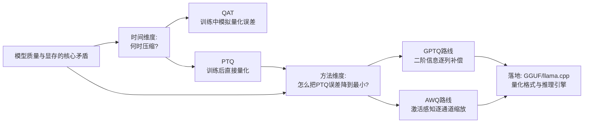

# 神经网络量化技术全景综述：从 PTQ/QAT 分野到 GPTQ、AWQ，再到 GGUF 部署生态

> **综述范围**：模型权重量化的完整技术图谱——训练后量化（PTQ）与量化感知训练（QAT）的路线分野、大模型时代两个最具影响力的 PTQ 方法 GPTQ 与 AWQ 的核心思路差异、以及 llama.cpp/GGUF 生态里常见的量化格式命名规则。目标是让读者看完本文，能够回答"给定一台具体的硬件和精度容忍度，我该选哪种量化方案"这个实际问题。
> **关键词**：Post-Training Quantization、Quantization-Aware Training、GPTQ、AWQ、GGUF、llama.cpp、Hessian、Activation-aware Scaling
> **适用读者**：读过基础量化数学（scale/zero-point）、想系统理解"这么多量化方法到底该怎么选"的读者

**标签**: `#模型量化` `#PTQ` `#QAT` `#GPTQ` `#AWQ` `#GGUF` `#大模型推理`

## 相关阅读

在开始之前，建议先了解（或随时回来查阅）以下内容：

- [模型权重量化基础：INT8、PTQ/QAT、GPTQ 与 AWQ](/前置知识/005k_前置知识_模型权重量化INT8_GPTQ_AWQ基础) — **本文的直接前置知识**。量化的基本数学（$q=\text{round}(x/s)+z$）、PTQ/QAT 的定义、GPTQ 和 AWQ 的核心直觉，本文全部假设已经读过，不再重复推导
- [GPTQ 论文精读](./111_GPTQ_生成式预训练模型的精确后训练量化) — GPTQ 完整的数学推导（OBQ、任意顺序量化、懒惰批量更新、Cholesky 分解）和真实实验数字，本文只总结核心思路和结论
- [向量量化与离散表示学习](/前置知识/001q_前置知识_向量量化与离散表示学习) — **另一个完全不同的"量化"概念**：那篇讲的是表示学习中把连续向量映射成离散码本符号（VQ-VAE/VQ-GAN），和本文"压缩数值精度"这件事没有关系，只是中文名字撞车
- [数值精度：FP32、FP16、BF16、TF32](/前置知识/003d_前置知识_数值精度FP32_FP16_BF16_TF32) — 量化的起点，本文假设读者知道浮点数怎么存
- [QLoRA：量化低秩适配](./056_QLoRA_量化低秩适配) — 量化技术在微调场景（而非纯推理部署）中的一个重要应用，把基础模型量化到 4-bit 后再训练 LoRA 适配器

---

## 贯穿全文的例子：一个 7B 模型的部署困境

> **场景**：你有一个训练好的 70 亿参数（7B）语言模型，权重以 FP16 存储。你手上的硬件从"一张 24GB 的 RTX 4090 游戏显卡"到"一台 8GB 显存的笔记本"都有可能。你需要决定：这个模型该用什么精度部署？要不要量化？量化到多少 bit？用哪种方法量化？

这个例子会贯穿全文。每一节引入新方法时，都会回到"这个 7B 模型在这种方法下要占多少显存、精度损失多大、需要花多少时间准备"这几个具体数字上。

---

## 一、核心矛盾：显存墙 vs 精度损失

大模型推理面临一个直接的数字约束：**模型能不能塞进一张显卡，几乎完全取决于权重占用的显存**。7B 模型用 FP16（每参数 2 字节）存储，权重本身就要占约 13 GiB——这已经超过很多消费级显卡（8GB、12GB、16GB）的全部显存，还没算上推理时的中间激活值和 [KV Cache](/前置知识/002m_前置知识_KV_Cache与自回归解码)。往上放大到千亿参数的模型，FP16 存储动辄需要几百 GB，必须多卡分布式部署才跑得起来——这就是"显存墙"。

量化是绕开显存墙最直接的办法：把每个权重从 16 bit 压到 8 bit、4 bit 甚至更低，显存占用近似线性下降。但压缩数值精度天然会丢信息，模型的输出质量（用困惑度 perplexity 或下游任务准确率衡量）可能下降。**整个量化技术领域要解决的核心矛盾，就是这一句话**：

> **在多大程度上压缩权重的数值位宽，同时把模型质量的下降控制在可接受范围内？**

这个矛盾的解法可以从两个完全不同的维度切入,这就是本文的分类框架：

1. **什么时候压缩**：训练完了才压缩（PTQ），还是训练过程中就让模型"提前适应"压缩带来的误差（QAT）？这是时间维度的分野。
2. **在 PTQ 内部,怎么把误差降到最小**：不同的 PTQ 方法在"不重新训练"这个约束下，用不同的数学工具来判断"该怎么把每个数值移动到最近的量化网格点，同时让整体误差最小"。GPTQ 和 AWQ 走的是两条完全不同的技术路线——一个用二阶（Hessian）信息做逐列误差补偿，一个用激活值分布找出"重要权重通道"并保护它们。理解这两条路线的差异，是本文的核心内容。

除了理论方法，工业界还发展出了具体的**部署格式**（如 GGUF），把量化方法和实际的文件存储、推理引擎绑定在一起——这是本文第五节要覆盖的落地层面。

需要强调的是，这几层维度不是互相独立的选择题，而是**层层递进的决策链**：先确定要不要现在就压缩位宽（PTQ 还是 QAT，几乎总是 PTQ），再确定用哪种数学方法把 PTQ 的误差降到最小（GPTQ 还是 AWQ，取决于你更看重压缩极限还是鲁棒性），最后确定用什么文件格式和推理引擎把量化结果真正跑起来（GGUF/llama.cpp 还是原生 GPU 推理框架）。本文接下来按这个顺序展开，每一层都会用同一个 7B 模型的具体数字说话。



---

## 二、量化基础回顾（不重复推导）

本文假设读者已经读过 [模型权重量化前置知识](/前置知识/005k_前置知识_模型权重量化INT8_GPTQ_AWQ基础)，这里只做最简要的回顾，不重复公式推导：

- **量化的本质**：用一个缩放系数 $s$（scale）和一个零点 $z$（zero-point），把连续的浮点数值线性映射到有限的整数网格上：$q=\text{round}(x/s)+z$。误差主要来自 $\text{round}(\cdot)$ 这一步的舍入。
- **RTN（Round-To-Nearest）**：最朴素的量化方式，每个权重独立就近取整，互不协调。在 INT8 下格子够密，几乎不掉精度；在 INT4/INT3 下格子稀疏，误差被放大，容易让模型明显退化甚至完全失效。
- **7B 模型的显存数字**（本文反复引用的基线）：

| 精度 | 每参数字节数 | 7B 模型显存占用 |
|------|------------|----------------|
| FP32 | 4 字节 | ≈ 26.1 GiB |
| FP16 / BF16 | 2 字节 | ≈ 13.0 GiB |
| INT8 | 1 字节 | ≈ 6.5 GiB |
| INT4 | 0.5 字节 | ≈ 3.3 GiB |


> 每降一档位宽，显存占用近似减半。从 FP32 到 INT4，同一个 7B 模型的显存需求从 26 GiB 压到 3.3 GiB，压缩比接近 8 倍——这就是为什么"量化"是大模型能塞进消费级显卡的关键技术。上面这组数字会贯穿本文剩下的每一节。

如果你对"为什么位宽越低误差越容易被放大""RTN 具体是怎么崩的"这些细节还不熟悉，[前置知识第二、四节](/前置知识/005k_前置知识_模型权重量化INT8_GPTQ_AWQ基础#二量化的基本数学从连续浮点到有限整数) 有手算例子和完整推导，本文不再重复。

### 2.1 权重量化（Weight-Only）与激活量化：本文覆盖的是哪一条线

在正式进入 PTQ/QAT 和 GPTQ/AWQ 之前，需要先厘清一个容易混淆的维度：**量化的对象到底是权重，还是权重加激活值一起量化**。业界通常用 "WxAy" 这样的记号表示——W 后面的数字是权重的位宽，A 后面的数字是激活值的位宽。常见的两条路线：

- **W8A8（权重和激活都量化到 INT8）**：权重和激活值在矩阵乘法之前都变成整数，矩阵乘法本身也能用整数运算完成（现代 GPU/加速器的整数矩阵乘法单元通常比浮点单元更快）。这条路线不仅节省显存，还能真正加速矩阵乘法本身的计算，代表方法有 LLM.int8()、SmoothQuant。但激活值的分布往往比权重更不稳定（某些通道会出现远超其他通道的"离群值"，outlier），量化激活值比量化权重更容易出问题，需要额外的技巧（如 SmoothQuant 把离群值的幅度"匀"给权重）来处理。
- **W4A16 / Weight-Only（只量化权重，激活值保持 FP16）**：本文重点讨论的 GPTQ 和 AWQ 都属于这一条路线——只压缩权重，激活值在实际计算时仍然是浮点数。这条路线的收益主要在**显存占用**和**内存带宽**上（推理时逐 token 生成，主要瓶颈是"读权重"而不是"算乘法"，参见 [GPTQ 精读 4.5 节](./111_GPTQ_生成式预训练模型的精确后训练量化#45-实际部署收益更少的-gpu更低的延迟) 对内存带宽瓶颈的讨论），但**不会加速矩阵乘法本身**——因为乘法的一侧（激活值）仍然是 FP16，硬件通常需要把权重先反量化回浮点再和激活值做乘法，这也是 [GPTQ 论文自己承认的局限之一](./111_GPTQ_生成式预训练模型的精确后训练量化#46-gptq-的局限性论文自己承认的)。

本文后续讨论的 GPTQ、AWQ、以及 GGUF 生态中最常见的量化格式，**几乎全部是 Weight-Only 路线**——这是因为大模型推理（尤其 batch size 较小的场景）通常受限于内存带宽而不是算力，Weight-Only 量化用最小的实现代价换取最大的实际收益，是当前工业界部署 LLM 最主流的选择。

---

## 三、时间维度的分野：PTQ vs QAT

### 3.1 两条路线的定义回顾

**PTQ**（Post-Training Quantization，训练后量化）——模型已经用浮点精度完整训练好之后，直接对权重做量化，不需要重新训练。**QAT**（Quantization-Aware Training，量化感知训练）——在训练或微调过程中就模拟量化误差，让模型主动学着去适应它。两者的具体流程图和直通估计（Straight-Through Estimator）的实现细节，[前置知识第三节](/前置知识/005k_前置知识_模型权重量化INT8_GPTQ_AWQ基础#三ptq-vs-qat什么时候做量化) 已经讲过，这里聚焦在"大模型时代该怎么选"这个决策问题上。

### 3.2 为什么大模型时代几乎全是 PTQ

QAT 的核心代价是：需要完整的训练或微调流程，需要访问较大规模的数据，需要反向传播。对一个几百万到几千万参数的小模型，这个代价可以接受——事实上 QAT 在图像分类、移动端小模型部署等场景一直是主流。但对一个 70 亿甚至上千亿参数的大语言模型，**重新做一遍 QAT 训练的算力成本，量级上和重新预训练一次相当**——这在实践中几乎是不可接受的。

这就是为什么 GPTQ、AWQ 这两个 2022-2023 年最具影响力的大模型量化方法，都严格限定在 PTQ 范畴内：**它们的目标是在完全不碰梯度、不碰训练数据（只用几十到几百条校准样本）的前提下，把量化误差降到接近 QAT 的水平**。这也正是它们相对朴素 RTN 的价值所在——RTN 同样是 PTQ，但 GPTQ/AWQ 用更聪明的数学方法，让 PTQ 在低比特下的表现逼近甚至部分场景下追平 QAT。

### 3.3 PTQ vs QAT 对比表

| 维度 | PTQ | QAT |
|------|-----|-----|
| 是否需要重新训练 | 不需要 | 需要（至少微调级别） |
| 所需时间 | 分钟到小时级 | 小时到天级 |
| 所需数据 | 几十到几百条校准样本 | 较大规模训练/微调数据 |
| 是否需要反向传播 | 不需要（GPTQ/AWQ 均不需要） | 需要 |
| 同等位宽下的精度损失 | 位宽越低损失越明显（朴素 RTN） | 更小，模型主动适应 |
| 典型代表 | RTN、GPTQ、AWQ | 早期的 Fake-Quant 训练、DoReFa-Net |
| 大模型时代主流选择 | ✅ 几乎唯一选择 | 极少用于超大模型 |

**在 7B 模型的例子上**：如果走 PTQ 路线（比如用 GPTQ），把权重量化到 INT4 大约只需要几十分钟到几小时的 GPU 时间，几百条校准样本；如果坚持走 QAT，则需要接近一次完整微调的算力和数据规模——对大多数团队而言，这个成本差距足以直接决定选择 PTQ。

### 3.4 一个例外：QAT 仍然活跃的场景

需要澄清的是,"大模型时代 QAT 少用"不代表 QAT 已经过时。在模型规模不那么大（几百万到几亿参数）、或者对推理延迟和精度要求都极端苛刻的场景（比如手机端的语音识别模型、端侧图像分类模型），QAT 依然是主流选择——这些场景本身的训练成本就不高，QAT 带来的精度收益完全值得投入。此外，即便在大模型场景，也出现了"轻量级 QAT"的折中方案——不从头训练，而是在 PTQ 之后用少量数据做短暂的"量化感知微调"（如 QLoRA 结合量化和 LoRA 微调的思路，参见 [QLoRA 精读](./056_QLoRA_量化低秩适配)），用远低于完整 QAT 的成本，换取比纯 PTQ 更好的精度。这类方法本质上是 PTQ 和 QAT 之间的连续谱，而不是二选一的对立。

---

## 四、方法维度：GPTQ 与 AWQ 的核心思路对比

### 4.1 GPTQ：用二阶信息做逐列误差补偿（简要回顾）

GPTQ（Generative Pre-trained Transformer Quantization）的核心思路已经在 [前置知识第四节](/前置知识/005k_前置知识_模型权重量化INT8_GPTQ_AWQ基础#四gptq-的核心直觉用二阶信息做误差补偿) 和 [GPTQ 精读](./111_GPTQ_生成式预训练模型的精确后训练量化) 中完整展开，这里只总结三句话：

1. **逐列量化**：把权重矩阵按列（对应输入特征维度）逐一量化,而不是所有权重独立各自取整。
2. **用 Hessian（loss 对权重的二阶导数）信息判断补偿方向**：某一列被量化产生的误差,可以通过精确计算还未量化的其他列该调整多少,来主动抵消——这个"该调整多少"的计算,依赖 Hessian 逆矩阵告诉我们"loss 曲面在哪个方向最平坦、能容忍多大调整"。
3. **三个工程改进让它能跑在千亿参数模型上**：任意顺序量化（让 Hessian 逆矩阵更新对所有行共享，复杂度从 $O(d_{\text{row}}d_{\text{col}}^3)$ 降到 $O(\max\{d_{\text{row}}d_{\text{col}}^2, d_{\text{col}}^3\})$）、懒惰批量更新（128 列为一批，提速一个数量级）、Cholesky 分解（避免数值误差累积导致量化崩溃）。

GPTQ 实测：**OPT-175B 只需约 4 GPU 小时即可量化到 3-4 bit**，4-bit 下相对 FP16 基线的困惑度损失几乎可忽略（OPT-175B 从 8.34 到 8.37），3-bit 下 RTN 直接崩溃（困惑度飙到 7300）而 GPTQ 依然保持 8.68。这些数字的完整来源和推导见 [GPTQ 精读第四节](./111_GPTQ_生成式预训练模型的精确后训练量化#四实验结果真实数字说话)。

### 4.2 AWQ：不是所有权重都一样重要

**AWQ**（Activation-aware Weight Quantization，激活感知权重量化，出自 Lin et al., "AWQ: Activation-aware Weight Quantization for LLM Compression and Acceleration", arXiv:2306.00978, MLSys 2024 最佳论文）走的是完全不同的路线。

**核心发现**：AWQ 论文观察到，一个模型里绝大多数权重对最终输出的影响可以被压缩，但有一小部分权重（论文实测约 0.1%~1%）异常重要——只要把这一小部分"重要权重"的量化误差控制住，整个模型的量化质量就能大幅提升。论文在 OPT-6.7B 上的实测：把这 1% 重要权重保持 FP16、其余量化到 INT3，困惑度从纯 RTN 的 23.54 骤降到 11.39，几乎追平当时最强的重构式方法 GPTQ。

**怎么判断哪些权重重要**：这是 AWQ 最反直觉的发现——**不能看权重本身的数值大小**。论文实测：按权重自身的 $L_2$ 范数挑选"重要权重",效果和随机挑选几乎一样(在 OPT-13B 上困惑度只从 46.04 降到 44.87,基本没用)。真正有效的判断依据是：**这个权重对应的输入激活值的幅度**。按激活值幅度挑出 1% 的"重要通道"，同样条件下困惑度从 46.04 降到 9.85——差距悬殊。直觉是：输入特征里幅度特别大的通道，通常承载着更关键的信息，和它相乘的权重列自然更值得保护。这正是"activation-aware"（激活感知）这个名字的来源。

**怎么保护重要权重而不牺牲硬件效率**：直接把 1% 重要权重保留 FP16、其余量化到低比特，确实有效，但这种混合精度格式在硬件上很难高效实现（GPU 矩阵乘法内核通常要求整个矩阵是统一数据类型）。AWQ 的解决方案是**逐通道缩放（per-channel scaling）**：对重要的输入通道（对应权重矩阵的列）乘以一个缩放系数 $s>1$，量化前先把这些权重的数值放大，再对应地把激活值除以同样的 $s$ 缩小回去，数学上抵消掉这次缩放的影响：

$$
Q(w\cdot s)\cdot\frac{x}{s} \approx w\cdot x
$$

**这个公式在做什么**：证明"把权重乘大再量化、激活值除回来"这个操作，在数学上和"不做任何缩放直接算"的结果基本等价——但量化误差却因为权重被放大而显著降低。

::: details 📐 公式详解（点击展开）

| 子表达式 | 它是谁 | 它在干嘛 |
|---------|--------|---------|
| $w\cdot s$ | **被放大后的权重** | 原始权重 $w$ 乘上一个 $s>1$ 的缩放系数，数值被整体拉大 |
| $Q(w\cdot s)$ | **放大后再量化的结果** | 对拉大的数值做量化（round 到网格），因为数值本身变大了，同样的绝对误差占它的比例变小 |
| $x/s$ | **对应缩小的激活值** | 为了让"权重×激活"这个乘积结果不变，激活值要按同样的比例反向缩小 |
| $Q(w\cdot s)\cdot(x/s)$ | **缩放后的完整计算结果** | 用放大后量化的权重，乘以缩小后的激活值，得到最终这一项的输出 |
| $\approx w\cdot x$ | **和原始结果基本相等** | 如果不缩放直接算 $w\cdot x$，理论上应该完全相等；实际因为量化引入的 round 误差，两者只是近似相等，但误差比不缩放时小得多 |

**用人话读**："把重要的权重先乘大一点再去量化，对应的激活值除回来抵消这次放大——这样算出来的结果和原来几乎一样，但重要权重的量化损失变小了。"

**为什么是这个形式**：量化误差的绝对大小和 scale（网格疏密）大致固定，但**相对误差**取决于数值本身大小——把数值放大后再量化，同样的绝对误差占比变小。除以同样的系数把激活值缩小，从数学上抵消掉权重被放大的影响，整体乘积基本不变，这样就在"不改变数据类型、不引入混合精度"的前提下，专门降低了重要权重的相对误差。AWQ 论文实测在 OPT-6.7B 上把 1% 重要通道乘以 $s=2$，困惑度从纯 RTN 的 23.54 降到 11.92,接近保留 FP16(11.39)的效果。
:::

具体到底该放大多少（$s$ 取多大）、该保护多大比例的通道，AWQ 用一个简单的网格搜索（在 $[0,1]$ 区间搜索一个超参数 $\alpha$，$s=s_{\mathbf{X}}^\alpha$，$s_{\mathbf{X}}$ 是激活值幅度）自动确定，不需要反向传播。

### 4.3 GPTQ 与 AWQ 的直觉差异

| 维度 | GPTQ | AWQ |
|------|------|-----|
| 核心思路 | 逐列量化,用 Hessian 二阶信息让未量化列主动补偿已量化列的误差 | 找出对激活值影响大的"重要权重通道",用逐通道缩放降低它们的量化误差 |
| 依据什么判断"该怎么处理" | 权重矩阵本身的二阶曲率信息（Hessian） | 输入激活值的幅度分布 |
| 是否需要反向传播/梯度 | 不需要 | 不需要 |
| 是否依赖重构/回归过程 | 需要（逐层最小化输出重构误差） | 不需要——AWQ 论文特别强调这一点是它相对 GPTQ 的关键优势 |
| 对硬件的友好程度 | 需要专门的反量化内核 | 缩放操作可吸收进权重本身，推理时几乎无额外开销 |
| 对校准数据的依赖程度 | 相对更依赖（需要精确统计二阶信息），容易过拟合校准集分布 | 更鲁棒——AWQ 论文实测只需 16 条校准序列即可达到 GPTQ 需要 192 条才能达到的效果；换一个校准集分布（PubMed↔Enron）困惑度只多 0.5-0.6，GPTQ 则多 2.3-4.9 |

### 4.4 真实数字对比：LLaMA-7B 上的 RTN vs GPTQ vs AWQ

AWQ 论文（Table 4）在 LLaMA 和 LLaMA-2 全系列模型上做了系统对比，这里摘取 LLaMA-7B 在 WikiText2 上的困惑度（分组大小 128）：


> FP16 基线困惑度约 5.68。INT4 下三种方法差距不大（RTN 5.73、GPTQ 5.69、AWQ 5.60），因为格子还够密；但降到 INT3，差距开始拉开——RTN 6.66、GPTQ 6.43、AWQ 6.24，AWQ 全程保持最优。这和本文 4.1、4.2 节的机制解释完全对应：位宽越低，"聪明地分配量化误差"这件事的收益就越明显。

AWQ 论文进一步指出（Table 6），**两种方法并不互斥**：在极端低比特（INT2）场景下，单独用 GPTQ 在 OPT-6.7B 上困惑度是 16.65，单独结合 AWQ 的缩放预处理再跑 GPTQ（"AWQ+GPTQ"）能降到 15.71——AWQ 的逐通道缩放可以作为其他量化方法的预处理步骤叠加使用。此外，AWQ 论文报告了实际部署收益：结合作者实现的专用推理框架，在 RTX 4090 上相对 Huggingface FP16 实现取得约 3.2-3.3 倍的平均推理加速，并首次让 Llama-2-70B 能在单张 NVIDIA Jetson Orin（64GB 内存的边缘设备）上完成部署。在显存只有 8GB 的笔记本级 RTX 4070 上，AWQ 论文报告可以流畅运行 13B 规模的模型（约 33 tokens/秒），而同等条件下 FP16 实现连 7B 模型都放不下——这正好对应本文贯穿全文的"8GB 笔记本部署 7B 模型"场景：不量化完全跑不动，量化到 INT4 之后不仅能跑，还有余量支持更大的模型。

### 4.5 AWQ 对校准数据的鲁棒性：为什么这件事很重要

AWQ 论文的第二个关键实验（Figure 6）值得展开：作者用 Pile 数据集里两个主题完全不同的子集——PubMed 医学摘要和 Enron 企业邮件——分别作为校准集和评测集做交叉测试。如果用 PubMed 校准、PubMed 评测（分布一致），两种方法表现都很好；但如果用 PubMed 校准、Enron 评测（分布不一致，模拟真实部署中校准数据和实际使用场景不完全匹配的情况），**AWQ 的困惑度只增加 0.5-0.6，GPTQ 却要增加 2.3-4.9**。原因可以追溯到两种方法的机制差异：GPTQ 的逐列误差补偿是一个针对校准数据做的"重构优化"过程,天然更容易把这批校准数据的特定统计特性也学进去（也就是过拟合校准集）；AWQ 只统计激活值的平均幅度分布，这是一个更"粗粒度"的统计量，天然对校准集的具体内容不那么敏感。这也是为什么 AWQ 论文特别强调自己"不依赖任何反向传播或重构过程"——这不仅是效率优势，也是泛化能力的优势。对于本文的 7B 部署场景，如果你的校准数据和实际使用场景（比如目标是特定领域的问答，但只能拿到通用文本做校准）不完全匹配，这条鲁棒性差异会是选择 AWQ 而不是 GPTQ 的重要理由。

---

## 五、GGUF 与 llama.cpp 生态：量化方法如何落地成文件格式

GPTQ 和 AWQ 是**量化算法**——回答"怎么把权重数值变成更少的 bit"这个问题。但要把量化后的模型真正跑起来，还需要一个**文件格式**和**推理引擎**。**GGUF**（GPT-Generated Unified Format）正是 llama.cpp 项目定义的模型文件格式，用来存储量化（或未量化）后的模型权重、结构信息和元数据，专门为 CPU/边缘设备/消费级 GPU 上的高效推理设计。

GGUF 生态里的量化命名遵循一套约定，形如 `Q4_K_M`：

- **数字部分**（`Q4`/`Q5`/`Q6`/`Q8`）：表示每个权重大致的位宽（bits per weight），`Q4` 约 4 bit，`Q8` 约 8 bit。
- **算法版本标记**（`_0`/`_1` 或 `K`）：早期的"legacy quants"用 `_0`/`_1` 结尾（如 `Q4_0`）；后来引入的"**K-quants**"（K 是实现者名字的缩写，不是 K-means 的意思）在名字中包含字母 `K`（如 `Q4_K`），用更精细的分块策略（把权重矩阵切成固定大小的小块，每块单独存一套 scale 参数）取得更好的压缩率/精度平衡。
- **尺寸修饰符**（`S`/`M`/`L`）：GGUF 采用混合精度存储——大部分权重按 `Q` 标注的位宽量化，但少数关键层（如注意力的 value 投影、部分归一化权重）会用稍高的位宽存储。`S`（Small）/`M`（Medium）/`L`（Large）表示这部分关键层用了多高的精度，`M` 通常是精度和体积的平衡点。

一份公开的实测对比（7B 规模模型，WikiText2 困惑度，相对 FP16 基线的对比）大致趋势如下：

| GGUF 格式 | 约 bits/权重 | 相对 FP16 基线的困惑度变化 | 7B 模型文件体积 |
|-----------|-------------|--------------------------|----------------|
| Q8_0 | 8 | +0.03%（几乎无损） | 约 7.0 GB |
| Q6_K | 6 | +0.13% | 约 5.5 GB |
| Q5_K_M | 5 | +0.39% | 约 4.8 GB |
| Q4_K_M | 4 | +1.68%（社区公认"甜点区"） | 约 4.1 GB |
| Q3_K_M | 3 | +6.07% | 约 3.3 GB |
| Q2_K | 2 | +15.3%（明显退化） | 约 2.9 GB |

`Q4_K_M` 之所以是社区公认的默认选择，是因为它在体积压缩到约三分之一（相对 FP16 的 13GB）的同时，困惑度损失还在 2% 以内，绝大多数下游任务几乎感觉不到差异；而 `Q2_K` 尽管体积更小，15% 左右的困惑度损失已经会在实际对话质量上表现出明显下降，只在显存/存储极端受限（比如要塞进几 GB 内存的嵌入式设备）时才值得考虑。GGUF 的 K-quants 在设计思路上和本文前面讲的 GPTQ/AWQ 并不冲突——它更多是"用分块统计量+混合精度存储把量化做得更精细"，而 GPTQ/AWQ 解决的是"用什么数学方法确定每个权重该量化成什么值"，两者可以结合（llama.cpp 也支持导入经过 GPTQ/AWQ 预处理的权重再转换为 GGUF）。

对于本文贯穿全文的 7B 模型例子：如果选择部署到 llama.cpp/GGUF 生态，`Q4_K_M` 大约对应 4.5GB 左右的文件体积（相比 FP16 的 13GB，压缩比约 65%），是消费级 CPU/GPU 混合推理场景最常见的选择。

### 5.1 GGUF 和 GPTQ/AWQ 生成的模型文件是什么关系

初学者常见的困惑是：GPTQ、AWQ 是"量化算法"，GGUF 是"文件格式"，那么下载一个模型的时候看到的 `.gguf` 文件和"这个模型是用 GPTQ 量化的"这句话是什么关系？答案是：**GGUF 文件里存储的量化数值,可以来自不同的量化算法**——llama.cpp 生态最初主要用自己实现的 RTN 加分块统计（也就是 K-quants）来生成 GGUF 文件，但后续也支持导入已经用 GPTQ 或 AWQ 处理过的权重，转换打包成 GGUF 格式。换句话说，`Q4_K_M` 描述的是"最终存储时用了什么样的分块策略和位宽"，而不是"用了哪种量化算法确定每个数值该是多少"——这两件事是可以独立组合的正交维度。

在实际的模型分发平台（如 Hugging Face）上，你经常会同时看到同一个基础模型的多个版本：一个 `-GPTQ` 后缀的仓库（面向 GPU 服务器场景，配合专用的反量化矩阵乘法内核）、一个 `-AWQ` 后缀的仓库（同样面向 GPU，但用 AWQ 的缩放预处理）、以及一个 `-GGUF` 后缀的仓库（面向 CPU/边缘设备，内部可能是 K-quants 也可能是导入了 GPTQ/AWQ 预处理结果）。选择哪个版本，本质上是第六节决策流程图要回答的问题——取决于你的目标硬件和推理引擎。

一个容易踩的坑是：**GPTQ/AWQ 生成的权重文件和 GGUF 文件不能直接混用**——GPTQ/AWQ 的权重通常配合 vLLM、TGI（Text Generation Inference）、AutoGPTQ/AutoAWQ 这类面向 GPU 服务器的推理框架，依赖 CUDA 内核做高效的反量化和矩阵乘法；而 GGUF 文件配合 llama.cpp 及其衍生项目（如 Ollama、LM Studio），主要针对 CPU 和消费级 GPU 混合推理场景做了大量内存布局和 SIMD 指令级优化。如果你的目标硬件是数据中心 GPU（A100/H100 等），通常优先考虑 GPTQ/AWQ 权重配合专用推理框架；如果目标是个人电脑、笔记本，甚至没有独立显卡的设备，GGUF 几乎是唯一实用的选择。

---

## 六、总结对比表：如何选择量化方案

### 6.1 各方法横向对比

| 方法 | 典型位宽 | 是否需要校准数据 | 是否需要反向传播 | 相对精度损失（同等位宽） | 典型准备耗时（7B 规模量级） | 适用场景 |
|------|---------|-----------------|-----------------|------------------------|------------------------------|---------|
| RTN | INT8/INT4/INT3 | 不需要 | 不需要 | INT8 几乎无损，INT4 以下明显下降，INT3 可能完全崩溃 | 秒级 | 快速验证、INT8 场景 |
| QAT | 任意 | 需要完整训练数据 | 需要 | 最小，模型主动适应 | 数天到数周（接近重训） | 模型规模小、可承受重训成本、精度要求极高 |
| GPTQ | INT4/INT3/INT2 | 需要（几百条校准样本） | 不需要（用二阶信息但非训练梯度） | INT4 几乎无损，INT3 明显优于 RTN | 几分钟到几小时 | 追求极致压缩比（INT3/INT2）、有 GPU 算力做校准 |
| AWQ | INT4/INT3 | 需要（十几到几十条校准样本即可） | 不需要 | 与 GPTQ 相近或略优，对校准集分布更鲁棒 | 几十分钟量级，通常快于 GPTQ | 边缘部署、校准数据有限、需要跨域泛化 |
| GGUF (K-quants) | Q2~Q8（约 2~8 bit） | 视具体量化方法而定 | 不需要 | Q4_K_M 约 1~2% 损失，Q2_K 约 15% 损失 | 依赖底层量化方法的耗时 | CPU/消费级 GPU 混合推理，llama.cpp 生态部署 |

### 6.2 决策流程图：给定硬件和精度容忍度该选什么

```mermaid
flowchart LR
    A["7B模型待部署"] --> B{"显存/内存<br/>是否充足(>13GB)?"}
    B -->|是| C["FP16/BF16<br/>无需量化"]
    B -->|否| D{"能否承受<br/>QAT训练成本?"}
    D -->|能(模型较小/精度要求极高)| E["QAT<br/>训练中模拟量化误差"]
    D -->|不能(大模型/预算有限)| F{"显存是否<br/>够INT8(~6.5GB)?"}
    F -->|够| G["RTN INT8<br/>几乎无损,最简单"]
    F -->|不够,需INT4以下| H{"是否需要<br/>极致压缩比(INT3/INT2)?"}
    H -->|是,且有GPU做校准| I["GPTQ<br/>二阶信息逐列补偿"]
    H -->|否,更看重部署速度<br/>与校准数据鲁棒性| J["AWQ<br/>激活感知逐通道缩放"]
    I --> K{"目标平台是<br/>llama.cpp/CPU/边缘?"}
    J --> K
    K -->|是| L["转换为GGUF<br/>如Q4_K_M"]
    K -->|否,GPU服务器推理| M["直接用GPTQ/AWQ<br/>权重+专用推理内核"]
```

---

## 七、总结

回到贯穿全文的 7B 模型例子：一个 FP16 存储需要 13 GiB 显存的模型，如果只有一张 24GB 显卡（跑得动但比较紧张），直接用 FP16 部署即可；如果只有 8GB 显存，就必须压到 INT4 左右（约 3.3 GiB），这时候该用 GPTQ 还是 AWQ，取决于你更看重"极致压缩比"（选 GPTQ，尤其是 INT3/INT2 场景）还是"部署速度快、对校准数据不敏感"（选 AWQ）；如果目标平台是 CPU 或者 llama.cpp 生态的边缘设备，最终还需要把量化后的权重转换成 GGUF 格式，从 `Q4_K_M` 这类命名里就能读出"大致 4-bit、K-quants 分块策略、中等尺寸修饰符"的含义。

| 概念 | 一句话核心 |
|------|-----------|
| PTQ vs QAT | 训练后直接量化 vs 训练中模拟量化误差；大模型时代几乎全走 PTQ，因为 QAT 成本接近重新预训练 |
| RTN | 最朴素的 PTQ，每个权重独立就近取整，位宽越低越容易崩 |
| GPTQ | 用 Hessian 二阶信息逐列量化 + 误差补偿，让 PTQ 在 INT3/INT4 下逼近 QAT 精度，代价是需要较多校准数据、依赖重构过程 |
| AWQ | 发现少数对激活值影响大的"重要权重通道"，用逐通道缩放专门保护它们，无需反向传播，对校准数据分布更鲁棒 |
| GGUF/K-quants | llama.cpp 生态的模型文件格式，`Q4_K_M` 类命名编码了位宽、分块算法版本、混合精度修饰符三层信息 |
| 决策核心 | 显存/内存预算决定位宽下限；能否承受训练成本决定 PTQ/QAT；追求压缩比选 GPTQ，追求鲁棒性和部署速度选 AWQ；目标平台是边缘/CPU 则落地到 GGUF |

## 延伸阅读

- [模型权重量化基础：INT8、PTQ/QAT、GPTQ 与 AWQ](/前置知识/005k_前置知识_模型权重量化INT8_GPTQ_AWQ基础) — 本文所有数学基础的来源
- [GPTQ 论文精读](./111_GPTQ_生成式预训练模型的精确后训练量化) — GPTQ 完整数学推导与实验数字
- [向量量化与离散表示学习](/前置知识/001q_前置知识_向量量化与离散表示学习) — 另一种完全不同的"量化"：表示学习中的离散化
- [数值精度：FP32、FP16、BF16、TF32](/前置知识/003d_前置知识_数值精度FP32_FP16_BF16_TF32) — 量化的数值起点
- [QLoRA：量化低秩适配](./056_QLoRA_量化低秩适配) — 量化技术在微调（而非纯推理）场景中的应用
- [数值优化基础：梯度下降与牛顿法](/前置知识/003c_前置知识_数值优化基础_梯度下降与牛顿法) — Hessian 矩阵在二阶优化中的通用角色
- Frantar et al., "GPTQ: Accurate Post-Training Quantization for Generative Pre-trained Transformers", arXiv:2210.17323, 2022
- Lin et al., "AWQ: Activation-aware Weight Quantization for LLM Compression and Acceleration", arXiv:2306.00978, MLSys 2024（Best Paper Award）
- llama.cpp / GGUF 官方文档与命名约定：https://github.com/ggml-org/llama.cpp
