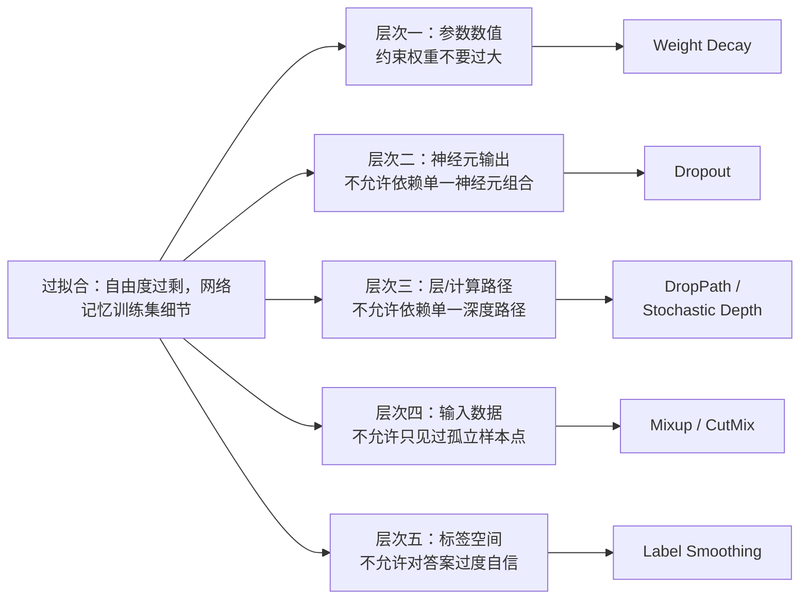
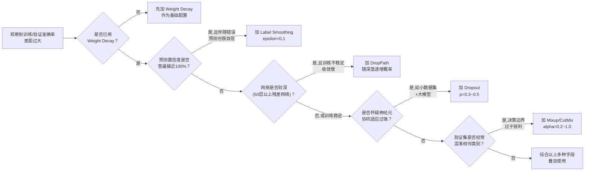

# 深度学习正则化方法全景综述：参数、神经元、层、数据、标签——五个层次的过拟合对抗战

> **综述范围**：深度学习中主流正则化方法的完整技术图谱——权重衰减（Weight Decay）、Dropout、DropPath/Stochastic Depth、Label Smoothing（标签平滑）、Mixup、CutMix。目标是让读者看完本文后，能够回答："我的模型出现了某种具体的过拟合表现，该往哪个层次下手、选哪种方法？"
> **关键词**：过拟合、Weight Decay、Dropout、DropPath、Stochastic Depth、Label Smoothing、Mixup、CutMix、正则化
> **适用读者**：有基本数学素养（会算均值、方差、期望）的本科生，知道"过拟合是坏事"但对具体该用哪种正则化方法感到困惑的入门者

---

## 相关阅读

建议先了解（或随时回来查阅）以下内容：

- [Dropout 与 DropPath：神经元级和层级的随机丢弃正则化](/前置知识/005l_前置知识_Dropout与DropPath随机深度) — 本文第三、四节的完整推导都在这篇前置知识里，本文只总结结论、不重复推导
- [Beta 分布与有界随机变量](/前置知识/002p_前置知识_Beta分布与有界随机变量) — Mixup 插值系数的采样机制，本文第六节会引用
- [mixup：超越经验风险最小化 深度精读](./112_Mixup_数据增强的超越经验风险最小化) — 本文第六节的完整实验数据、公式推导都在这篇精读里
- [方差与标准差](/前置知识/002c2_前置知识_方差与标准差) — 本文所有讨论的数学地基
- [深度学习归一化方法全景综述](/论文综述/S21_深度学习归一化方法全景综述) — 归一化和正则化解决的是不同的问题（数值尺度稳定 vs 过拟合），但两者常常在同一个网络里协同出现，容易被初学者混淆，本文第八节会正式区分

---

## 贯穿全文的例子：一个在小数据集上训练的图像分类器

为了让"选哪种正则化方法"这件事从头到尾都能落到具体场景，本文全程使用同一个例子：

> **场景**：你要训练一个 ResNet 风格的卷积网络，在一个只有 5000 张图片、10 个类别的小规模数据集上做分类（可以想象成一个专业领域的细分类任务，比如识别 10 种不同型号的工业零件，数据收集成本很高，没法像 ImageNet 那样轻易拿到百万张图片）。
>
> 训练几十个 epoch 之后，你观察到一个熟悉的信号：**训练集准确率已经到了 99%，验证集准确率却卡在 78% 左右，且还在缓慢下降**。这是过拟合的标准症状——网络的参数量和它需要拟合的"真实规律"相比过于充裕，多出来的自由度被用来记忆训练集里的具体细节（某几张图片的背景纹理、拍摄角度、光照条件等和"零件类别"本身无关的偶然特征），而不是学习真正能泛化到新样本的规律。
>
> 本文接下来会反复回到这个场景，具体分析：面对这个过拟合信号，可以从哪几个不同的层次下手，每个层次对应哪种方法，效果和代价分别是什么。

---

## 一、核心矛盾：过拟合的本质是"自由度过剩"，但可以在五个不同层次上收紧

### 1.1 为什么会过拟合：一个关于自由度的故事

一个神经网络的参数总量，决定了它能表达的函数空间有多"大"。当这个函数空间远大于"真正描述数据规律"所需要的复杂度时，网络在训练时会面临无穷多种"同样能把训练损失降到很低"的参数组合——其中只有一部分组合对应真正泛化的规律，剩下的组合是在利用训练集里偶然出现的、和任务本质无关的相关性（背景纹理、样本顺序、标注者的书写习惯等）。

在贯穿全文的例子里，5000 张图片、10 个类别，如果网络参数量是几百万甚至上千万，网络理论上完全有能力把这 5000 张图片的答案"死记硬背"下来（每张图片单独存一份"应该输出什么"的映射），根本不需要学会"零件的哪些视觉特征真正决定了它的类别"。这正是训练准确率 99%、验证准确率 78% 这个鸿沟的来源。

### 1.2 五个可以下手的层次

**正则化方法的本质，是想办法主动"收紧"网络的自由度**，逼着它无法轻松走"记忆训练集"这条捷径，只能去寻找更简单、更普适的规律。但"收紧自由度"可以在完全不同的层次上进行，这正是本文用来组织全部方法的分类维度——按照"约束施加在网络的哪一部分"，可以划分成五个层次，从最底层的数值参数，到最表层的标签：

这五个层次不是互相竞争的替代方案，而是**从不同角度同时收紧自由度**——它们几乎总是可以叠加使用（比如同时用 Weight Decay + Dropout + Mixup），因为每种方法约束的是网络的不同部位，互相之间没有冲突。理解这五个层次的划分标准，是判断"我的模型该加哪种正则化"这个问题的关键：**先搞清楚过拟合的具体表现，再判断它更适合被哪个层次的约束解决**。

---

## 二、层次一：约束参数数值——Weight Decay

### 2.1 核心思路

权重衰减（Weight Decay）是最古老、最基础的正则化手段，思路是直接在损失函数里加一个惩罚项，约束网络的权重 $\theta$ 不要在数值上变得过大：

$$
\mathcal{L}_{\text{total}} = \mathcal{L}_{\text{task}} + \frac{\lambda}{2}\|\theta\|_2^2
$$

**这个公式在做什么**：在任务损失后面加一项权重平方和的惩罚，逼着梯度下降在追求预测准确的同时，也把权重数值往小的方向拉。

::: details 📐 公式详解（点击展开）

| 子表达式 | 它是谁 | 它在干嘛 |
|---------|--------|---------|
| $\mathcal{L}_{\text{task}}$ | **任务本身的损失** | 比如分类任务的交叉熵 |
| $\theta$ | **网络的全部可训练权重** | 所有层的权重拉平拼成一个向量 |
| $\|\theta\|_2^2$ | **权重的平方和** | 数值越大说明权重整体越"用力"，越可能在押注训练集里的偶然细节 |
| $\lambda$ | **惩罚力度超参数** | 越大，权重被压得越小；$\lambda=0$ 退化为无正则的普通训练 |

**用人话读**："除了要预测准，还要求权重数值别太大，两个目标一起用梯度下降满足。"

**为什么是这个形式**：完整推导（包括为什么在不同优化器下要小心 Weight Decay 和 L2 正则化并不完全等价）见 [Dropout 与 DropPath 前置知识文章第四节](/前置知识/005l_前置知识_Dropout与DropPath随机深度#4-补充weight-decay-作为另一种正则化思路)，这里只给出结论性总结。
:::

这个公式的完整讲解（包括为什么惩罚"权重的平方和"而不是别的形式，以及权重衰减和 L2 正则化在 SGD、Adam 等不同优化器下并不完全等价这个常见误区）在 [Dropout 与 DropPath 前置知识文章第四节](/前置知识/005l_前置知识_Dropout与DropPath随机深度#4-补充weight-decay-作为另一种正则化思路) 里已经讲过，这里不重复推导。核心直觉是：**权重数值过大，往往意味着网络在"用力"依赖某个特定输入维度的细节去拟合训练集**，惩罚大权重相当于强迫网络在"效果差不多"的多组参数里,优先选择数值更平滑、更保守的那一组。

### 2.2 在贯穿全文例子中的应用

回到 5000 张图片的例子：如果观察到网络某些卷积核的权重数值明显比其他核大出一个量级，往往意味着这个核在"押注"某个偶然的训练集相关性（比如刚好训练集里某个类别的零件都在同一批光照条件下拍摄，卷积核学会了直接识别这种光照特征当作类别的捷径）。适度增大 Weight Decay 的系数 $\lambda$，能压制这种孤注一掷的权重增长，逼着网络更均匀地依赖多个特征维度的组合。

**Weight Decay 的局限**：它是一种"温和的、全局的"约束——对网络里所有参数一视同仁地施加惩罚，无法针对性地阻止"某几个神经元过度协作"或"网络过度依赖某条特定深度路径"这类更结构化的过拟合模式。这正是层次二、三存在的原因。

---

## 三、层次二：约束神经元输出——Dropout

### 3.1 核心思路（完整推导见前置知识）

[Dropout 与 DropPath 前置知识文章](/前置知识/005l_前置知识_Dropout与DropPath随机深度) 已经完整讲过 Dropout 的公式、训练/推理行为差异（含具体数值验证）和隐式集成的直觉，这里只总结结论：

- **训练时**：每个神经元的输出独立以概率 $p$ 被清零，剩下的乘以 $\frac{1}{1-p}$ 放大补偿。
- **推理时**：使用完整网络，不做任何丢弃。
- **核心直觉**：破坏神经元之间的协同适应（co-adaptation），逼着每个神经元独立地对预测有贡献，不能依赖某个特定搭档的存在；同时近似达到"隐式集成大量共享权重的子网络"的效果。

### 3.2 在贯穿全文例子中的应用

如果观察到过拟合表现是"网络对训练集里某几张图片的预测置信度接近 100%，但只要输入稍微变化（比如换一个角度拍摄同一个零件）预测就剧烈波动"，这通常说明网络学到的是**若干神经元紧密协作、共同识别某个高度具体的模式**（比如"这个角度+这个光照+这个背景"的组合），而不是任何单一神经元就能独立识别出的、更普适的零件形状特征。在全连接层或卷积层之间插入 Dropout（$p=0.3\sim0.5$），能有效削弱这种协同适应。

**局限**：Dropout 只在"神经元"这个最细的粒度上做丢弃，对于**极深的网络**（几十甚至上百层），丢弃单个神经元不足以打破网络对"必须经过所有层才能算对"这种深度依赖——这正是层次三 DropPath 要解决的问题。

---

## 四、层次三：约束计算路径——DropPath / Stochastic Depth

### 4.1 核心思路（完整推导见前置知识）

同样在 [Dropout 与 DropPath 前置知识文章](/前置知识/005l_前置知识_Dropout与DropPath随机深度) 中完整讲过：DropPath（也叫 Stochastic Depth）把丢弃粒度从"单个神经元"提升到"整个残差块"：

$$
y = x + b \cdot F(x), \qquad b \sim \text{Bernoulli}(1-p_\ell)
$$

**这个公式在做什么**：给整个残差块的主干计算 $F(x)$ 装一个开关，训练时随机决定这个块本次是"正常执行"还是"完全跳过、只留恒等映射"。

::: details 📐 公式详解（点击展开）

| 子表达式 | 它是谁 | 它在干嘛 |
|---------|--------|---------|
| $x$ | **残差块的输入** | 无论块是否被跳过，都会原样传给下一层 |
| $F(x)$ | **残差块的主干计算** | 整个块内部的卷积/注意力等变换 |
| $b\sim\text{Bernoulli}(1-p_\ell)$ | **整块的开关** | 一次抛硬币决定整个块是否生效，不是逐神经元抛硬币 |
| $y=x+b\cdot F(x)$ | **最终输出** | $b=0$ 时退化为恒等映射 $y=x$，$b=1$ 时是正常的残差连接 |

**用人话读**："给每个残差块装一个整体开关，训练时随机跳过某些块（只留一条恒等映射的路），推理时所有块都正常打开。"

**为什么是这个形式**：完整推导（包括推理时如何补偿缩放、以及丢弃概率为什么通常随深度线性递增）见 [Dropout 与 DropPath 前置知识文章第三节](/前置知识/005l_前置知识_Dropout与DropPath随机深度#3-droppath-stochastic-depth层粒度的随机丢弃)，这里只给出结论性总结。
:::

- **训练时**：每个残差块整体以概率 $p_\ell$ 被跳过（只保留恒等映射 $y=x$），且这个概率通常随层数线性递增（深层更容易被跳过）。
- **推理时**：所有残差块正常执行，主干分支输出按 $(1-p_\ell)$ 补偿缩放。
- **核心直觉**：训练时让网络"变浅"（加速训练、缓解深层网络的梯度问题），推理时"变深"（获得大量不同深度子网络的集成效果）；解决的是深度冗余带来的过拟合，和 Dropout 解决的"神经元协同适应"是不同层面的问题。

### 4.2 在贯穿全文例子中的应用

DropPath 只对**有残差连接、且层数较深**的网络有意义。如果贯穿全文的 ResNet 分类器有 50 层以上，且过拟合表现里夹杂着"训练不稳定、收敛慢"这类症状（不只是准确率差距，还有优化过程本身的困难），DropPath 比单纯加大 Dropout 概率更对症——它同时缓解了深层网络的梯度传播问题和深度依赖导致的过拟合。对于层数不多（比如 10 层以内）的网络，DropPath 的收益通常不明显，此时 Dropout 加 Weight Decay 已经足够。

---

## 五、层次四：约束标签空间——Label Smoothing

前三个层次都在"网络内部"做文章（参数、神经元、层），第四层次转向"监督信号"本身——不改网络，改标签。

### 5.1 核心问题：One-Hot 标签的隐藏缺陷

标准分类任务用 one-hot 编码作为监督信号：如果贯穿全文例子里某张图片的真实类别是第 3 种零件（共 10 类），标签向量就是 $y=[0,0,1,0,0,0,0,0,0,0]$——正确类别是 1，其余全是 0。配合交叉熵损失训练，这意味着网络被要求让正确类别对应的 softmax 输出**无限逼近 1**、其余类别的输出**无限逼近 0**。

问题在于：要让 softmax 输出真正逼近 1，网络必须让正确类别对应的 logit（softmax 之前的原始分数）远远大于其他所有类别的 logit——**逼近 1 但永远不能真正等于 1**（因为 softmax 是指数函数，只有 logit 趋于无穷才能让输出严格等于 1）。这个"无限追逐一个不可能达到的目标"的过程，会驱使网络把正确类别的 logit 越训练越大，其余类别的 logit 越训练越小,两者之间的差距不断扩大——这正是过度自信、以及过拟合的另一种表现形式：网络不仅记住了"这张图是哪个类"，还在"拉大这个答案和其他答案的分数差距"这件事上无止境地内卷，即使这种内卷对提升真实泛化能力毫无帮助。

### 5.2 核心方法：把 One-Hot 标签"软化"

Label Smoothing（标签平滑）的做法是不再用纯粹的 0/1 标签，而是把一小部分概率质量从正确类别"匀"给所有类别（包括正确类别自己），构造一个软化后的标签：

$$
y_k^{\text{LS}} = \begin{cases} 1-\epsilon+\dfrac{\epsilon}{K} & k = \text{正确类别} \\[4pt] \dfrac{\epsilon}{K} & k \neq \text{正确类别} \end{cases}
$$

**这个公式在做什么**：把原本"正确类别=1、其余全部=0"的硬标签，改造成"正确类别接近 1 但不等于 1、其余类别接近 0 但不等于 0"的软标签，给网络设定一个**可以真正达到**的训练目标，而不是一个只能无限逼近、永远达不到的目标。

::: details 📐 公式详解（点击展开）

| 子表达式 | 它是谁 | 它在干嘛 |
|---------|--------|---------|
| $K$ | **总类别数** | 贯穿全文例子里 $K=10$（10 种零件） |
| $\epsilon$ | **平滑系数** | 一个很小的超参数（常见取值 0.1），控制"匀出去多少概率质量" |
| $\epsilon/K$ | **匀给每个类别的基础份额** | 不管是不是正确类别，每个类别都先分到这一小份 |
| $1-\epsilon+\epsilon/K$ | **正确类别的最终目标值** | 比如 $\epsilon=0.1, K=10$ 时是 $1-0.1+0.01=0.91$——网络只需要让 softmax 输出到 0.91 就算命中训练目标,不需要无限逼近 1 |
| $\epsilon/K$（非正确类别） | **错误类别的最终目标值** | 同样是 $\epsilon=0.1,K=10$ 时，每个错误类别的目标是 0.01，而不是硬标签下的 0 |

**用人话读**："别再要求网络把正确答案的置信度催到接近 100%,允许它留一点'不确定性'的余地,同时也别把错误答案的置信度死死压到 0,留一丁点空间。"

**为什么是这个形式**：$\epsilon/K$ 是把 $\epsilon$ 这份"让出来的置信度"平均分给所有 $K$ 个类别（包括正确类别自己也拿一份），这是最简单、最无信息偏向的分配方式——没有理由认为某个错误类别应该比另一个错误类别拿到更多的置信度份额（除非引入更复杂的、基于类别相似度的平滑策略，这是 Label Smoothing 的一种扩展，本文不展开）。这个设计出自 Szegedy 等人 2016 年的 Inception 论文（"Rethinking the Inception Architecture for Computer Vision"），最初是为了缓解 Inception 网络训练中观察到的过度自信问题。
:::

### 5.3 为什么"设定一个可达到的目标"能缓解过拟合

Label Smoothing 起作用的机制和前三个层次都不同——它不是靠"随机丢弃"或"惩罚数值"来限制网络的自由度,而是**改变了优化问题本身的目标点**。硬标签下，网络的"最优解"在理论上要求某个类别的 logit 趋于正无穷，这个目标永远无法达成,网络只能无限地朝这个方向"卷"——训练越久，正确类别和错误类别之间的 logit 差距越被推向极端，这种极端化的 logit 分布对训练集里的具体样本可能拟合得很好，但对没见过的新样本泛化性变差（logit 差距被推得越极端，网络对输入细微变化的敏感度往往也越高）。

软化后的标签给了网络一个**有限的、可达成的**目标——一旦 logit 差距达到能让 softmax 输出 0.91（而不是 0.999999）这个水平，继续增大 logit 差距不会再降低损失（甚至会因为损失函数结构而被轻微惩罚），网络没有动力继续把 logit 推向极端。这相当于给"网络对自己预测的置信度"设了一个软性上限,间接抑制了过拟合最容易表现出来的"过度自信"这一症状,并且作为副产物，用 Label Smoothing 训练出的网络通常有更好的**模型校准**（calibration）——即模型给出的置信度数值更接近它实际的正确率，这在需要"知道自己什么时候可能出错"的场景（比如医疗诊断辅助系统）里很有价值。

### 5.4 在贯穿全文例子中的应用

如果贯穿全文的分类器观察到的过拟合表现是"训练集上几乎所有预测的置信度都接近 100%（softmax 最大值经常是 0.999 以上），但验证集上错误预测往往也伴随着很高的置信度（模型'自信地'预测错误）"，这是 Label Smoothing 最对症的场景——它专门针对"置信度校准失真"这一类问题,而 Dropout、Weight Decay 主要针对的是"决策边界/参数数值本身不合理"这类问题，两者可以同时使用,互不冲突（$\epsilon=0.1$ 是最常见的默认起点）。

---

## 六、层次五：约束输入数据分布——Mixup / CutMix

前四个层次分别在"参数、神经元、层、标签"上做文章,层次五转向另一端——**输入数据本身**。

### 6.1 核心思路（完整推导见精读）

[mixup 深度精读](./112_Mixup_数据增强的超越经验风险最小化) 已经完整推导了 Mixup 的公式和实验数据，这里只总结结论。Mixup 的核心操作是把两个训练样本按随机比例 $\lambda$ 线性混合，输入和标签用完全相同的比例插值：

$$
\tilde x = \lambda x_i + (1-\lambda) x_j, \qquad \tilde y = \lambda y_i + (1-\lambda) y_j, \qquad \lambda \sim \text{Beta}(\alpha,\alpha)
$$

**这个公式在做什么**：把两张训练图片按随机比例 $\lambda$ 线性混合成一张新图，同时用完全相同的比例混合标签，构造出"两个类别之间"的虚拟训练样本。

::: details 📐 公式详解（点击展开）

| 子表达式 | 它是谁 | 它在干嘛 |
|---------|--------|---------|
| $x_i,x_j$ / $y_i,y_j$ | **两个原始样本及其标签** | 从训练集随机抽取的一对样本 |
| $\lambda\sim\text{Beta}(\alpha,\alpha)$ | **随机混合比例** | 每次构造虚拟样本都重新采样，$\alpha$ 控制分布形状 |
| $\tilde x=\lambda x_i+(1-\lambda)x_j$ | **虚拟输入** | 两张图片的像素级线性插值 |
| $\tilde y=\lambda y_i+(1-\lambda)y_j$ | **虚拟软标签** | 用和输入相同的 $\lambda$ 插值标签，让监督信号和输入的"混合程度"保持一致 |

**用人话读**："随机抽两张图片按同一比例混合像素和标签，让网络在类别之间的区域也能学到平滑过渡的预测行为。"

**为什么是这个形式**：完整推导（包括 $\alpha$ 取值的实验规律和真实实验数字）见 [mixup 深度精读第二节](./112_Mixup_数据增强的超越经验风险最小化#二核心方法mixup)，这里只给出结论性总结。
:::

$\lambda$ 从 [Beta 分布](/前置知识/002p_前置知识_Beta分布与有界随机变量) 里采样，$\alpha$ 控制混合比例的"温和/极端"程度：

> **图解**：$\alpha$ 越小（红色 $\alpha=0.2$），$\lambda$ 越集中在 0 或 1 附近——虚拟样本大多"主要像"某一个原始样本；$\alpha=1$（绿色）时 $\lambda$ 均匀分布在 $[0,1]$；$\alpha$ 越大（蓝色 $\alpha=8.0$）$\lambda$ 越集中在 0.5 附近——几乎每次都是对半混合。这三种设定对应的正则化强度依次增强，但过强的混合（大 $\alpha$）在数据集足够简单时可能导致欠拟合，具体的实验数字和权衡见 [mixup 精读第四节](./112_Mixup_数据增强的超越经验风险最小化#四实验结果真实的数字)。

**核心直觉**：ERM（经验风险最小化）训练只在孤立的训练点上监督网络，训练点之间的区域完全"无人监管"。Mixup 用大量"两个类别之间"的虚拟样本，直接给这些原本无监督的区域也打上标签，逼着网络在训练点之间保持平滑、线性的预测行为——决策边界更平滑,直接降低了过拟合程度,同时因为输入梯度范数更小，对抗鲁棒性也随之提升（[精读第四节](./112_Mixup_数据增强的超越经验风险最小化#四实验结果真实的数字) 给出了 ImageNet、CIFAR、抗标签噪声、抗对抗攻击四组实验的具体数字）。

### 6.2 CutMix：另一种混合方式

CutMix 走的是"裁剪拼贴"而不是"像素叠加"的路线——从一张图片里裁出一个矩形区域，粘贴替换另一张图片的对应区域，标签按区域面积比例插值。两者的详细对比（包括在 ImageNet 分类、弱监督定位、目标检测等任务上的具体数字差异）已经在 [精读第五节](./112_Mixup_数据增强的超越经验风险最小化#五和-cutmix-的对比另一条混合路线) 完整展开，核心结论是：**Mixup 的像素叠加会产生视觉上不自然的"鬼影"伪影，损害需要精确空间定位信息的任务（如目标检测）；CutMix 保留了局部区域的清晰纹理，在这类任务上表现更好，但两者在纯分类精度上互有胜负**，需要结合具体下游任务选择。

### 6.3 在贯穿全文例子中的应用

如果贯穿全文的分类器过拟合表现是"网络在训练集里几乎从不出错，验证集上却经常把相似的类别搞混"，这通常说明网络学到的决策边界过于"锐利"——把训练集里刚好落在某一侧的样本硬性分开，没有在类别之间留出平滑过渡的余地。这正是 Mixup/CutMix 最对症的场景：它们直接在输入数据层面构造类别之间的过渡样本，强迫决策边界变得更平滑。相比 Weight Decay、Dropout（作用在参数/神经元层面），Mixup/CutMix 是**唯一直接操作输入数据分布**的正则化手段,和其他四个层次没有重叠,可以自由叠加（[Mixup 精读 4.3 节](./112_Mixup_数据增强的超越经验风险最小化#43-抗标签噪声memorization-的直接证据) 的实验证明了 Mixup + Dropout 组合效果优于单独使用任何一种）。

---

## 七、全景对比表

| 方法 | 作用对象 | 核心机制 | 训练/推理行为差异 | 典型应用场景 | 详细文章 |
|------|---------|---------|-------------------|-------------|---------|
| Weight Decay | 参数数值 | 损失函数加 $\frac{\lambda}{2}\|\theta\|_2^2$ 惩罚项，约束权重不要过大 | 无差异（惩罚项始终存在，但推理时不参与前向计算） | 几乎所有训练场景的默认基础配置 | [005l 第四节](/前置知识/005l_前置知识_Dropout与DropPath随机深度#4-补充weight-decay-作为另一种正则化思路) |
| Dropout | 神经元输出 | 训练时按概率 $p$ 随机清零并放大 $\frac{1}{1-p}$ 补偿 | 训练随机丢弃+放大，推理用完整网络 | 全连接层、注意力模块之间；小数据集、大模型场景 | [005l 第二节](/前置知识/005l_前置知识_Dropout与DropPath随机深度#2-dropout神经元粒度的随机丢弃) |
| DropPath / Stochastic Depth | 层 / 残差块 | 训练时整体跳过某个残差块（只保留恒等映射），推理时补偿缩放 | 训练随机跳过，推理用完整深度 | 深层残差网络、Vision Transformer 等极深架构 | [005l 第三节](/前置知识/005l_前置知识_Dropout与DropPath随机深度#3-droppath-stochastic-depth层粒度的随机丢弃) |
| Label Smoothing | 标签空间 | 把 one-hot 硬标签软化，正确类别目标从 1 降到 $1-\epsilon+\epsilon/K$ | 无差异（标签在训练和推理时定义一致，推理时本身不用标签） | 大规模分类任务，尤其关注模型校准（confidence calibration）的场景 | 本文第五节 |
| Mixup | 输入数据 + 标签 | 两个样本按 $\lambda\sim\text{Beta}(\alpha,\alpha)$ 线性插值混合像素与标签 | 无差异（混合只发生在训练时的数据构造阶段，推理时输入正常图片） | 图像分类，尤其模型容量相对数据量偏大、训练时间较长的场景 | [112 精读](./112_Mixup_数据增强的超越经验风险最小化) |
| CutMix | 输入数据 + 标签 | 裁剪拼贴两张图片的矩形区域，标签按面积比例插值 | 同 Mixup | 需要保留空间定位信息的图像分类、检测预训练场景 | [112 精读第五节](./112_Mixup_数据增强的超越经验风险最小化#五和-cutmix-的对比另一条混合路线) |

---

## 八、正则化 vs 归一化：一个常见的混淆点

初学者常把 Dropout、BatchNorm 这类方法笼统地归为"防止过拟合的技巧"，但两者解决的是本质不同的问题，值得专门澄清：

**归一化**（如 BatchNorm、LayerNorm，详见 [深度学习归一化方法全景综述](/论文综述/S21_深度学习归一化方法全景综述)）解决的是**数值尺度稳定性**问题——防止深层网络里激活值和梯度随深度指数级放大或衰减，让训练本身能够顺利进行，某些归一化方法（如 BatchNorm 用当前 mini-batch 的统计量而非整个数据集）**附带**产生了一定的正则化副作用（因为同一个样本在不同 batch 里看到的统计量有随机波动），但这是归一化的"副产品"，不是它存在的主要目的。

**正则化**（本文讨论的五个层次）解决的是**过拟合**问题——网络在训练误差已经很低的前提下，如何缩小训练误差和真实泛化误差之间的差距。正则化方法通常不影响"网络是否能训练起来"这个更基础的问题（一个没有任何正则化的网络也能正常训练，只是更容易过拟合），而归一化方法解决的往往是"能不能训练起来、训练是否稳定"这个更前置的问题。

两者可以（且通常应该）同时使用——BatchNorm/LayerNorm 保证训练稳定，Weight Decay/Dropout/Mixup 等控制过拟合，是两条独立的技术路线,不是二选一的关系。

---

## 九、决策指南：根据过拟合的具体表现选择正则化手段

不同的过拟合表现，指向不同层次的根因，对应不同的优先修复手段。下面这张决策流程图把本文提到的五种方法组织成一个可操作的排查顺序：

几个补充说明帮助更好地使用这张决策图：

- **多种方法几乎总是同时生效**：这张图给出的是"优先排查顺序"，不是"只能选一个"。回到贯穿全文的例子（5000 张图片、10 类零件），一个成熟的训练配置往往同时包含 Weight Decay（默认几乎总开）+ Dropout（应对小数据集）+ Mixup（应对决策边界锐利），三者叠加、互不冲突。
- **Label Smoothing 和 Mixup 的组合需要小心**：两者都在"软化标签"这件事上有重叠（Mixup 的混合标签本身也是一种"非 one-hot"的软标签），同时使用两者的 $\epsilon$ 和 $\alpha$ 都调得很大时，可能导致标签软化过度、训练信号过弱，实践中常见的做法是二者只留一个，或都用较温和的参数。
- **数据量是最重要的先决条件**：如果训练数据量本身极度稀缺（比如全部数据不到几百张），任何正则化手段的边际收益都有限——正则化只能让网络"更充分利用现有数据里的信号"，不能凭空制造训练数据没有提供的信息；这种情况下应该优先考虑迁移学习（用大规模预训练模型微调）而不是在正则化上做过度调参。

---

## 十、总结

深度学习里的正则化方法，看似五花八门，实际上可以清晰地归入五个层次——**参数数值（Weight Decay）、神经元输出（Dropout）、计算路径（DropPath）、标签空间（Label Smoothing）、输入数据（Mixup/CutMix）**。它们的共同目标都是收紧网络"记忆训练集捷径"的自由度，但下手的位置完全不同，因此几乎总能叠加使用而互不冲突。

面对一个具体的过拟合问题，不必凭感觉随机尝试正则化方法——先诊断"过拟合具体表现在哪"（置信度失真？协同适应过强？决策边界锐利？深层网络训练不稳定？），再对照本文第九节的决策图选择对症的层次，往往比盲目堆砌所有方法更高效，也更容易理解每个改动带来的效果变化。

---

## 延伸阅读

- [Dropout 与 DropPath：神经元级和层级的随机丢弃正则化](/前置知识/005l_前置知识_Dropout与DropPath随机深度) — 层次二、三的完整数学推导
- [mixup：超越经验风险最小化 深度精读](./112_Mixup_数据增强的超越经验风险最小化) — 层次五的完整公式推导、真实实验数据、与 CutMix 的详细对比
- [Beta 分布与有界随机变量](/前置知识/002p_前置知识_Beta分布与有界随机变量) — Mixup 插值系数的数学基础
- [深度学习归一化方法全景综述](/论文综述/S21_深度学习归一化方法全景综述) — 与本文并行的另一条技术路线，解决数值尺度稳定性而非过拟合问题
- [深度学习优化器全景综述](/论文综述/S25_深度学习优化器全景综述) — Weight Decay 在 SGD 与 Adam/AdamW 等不同优化器下的实现差异
