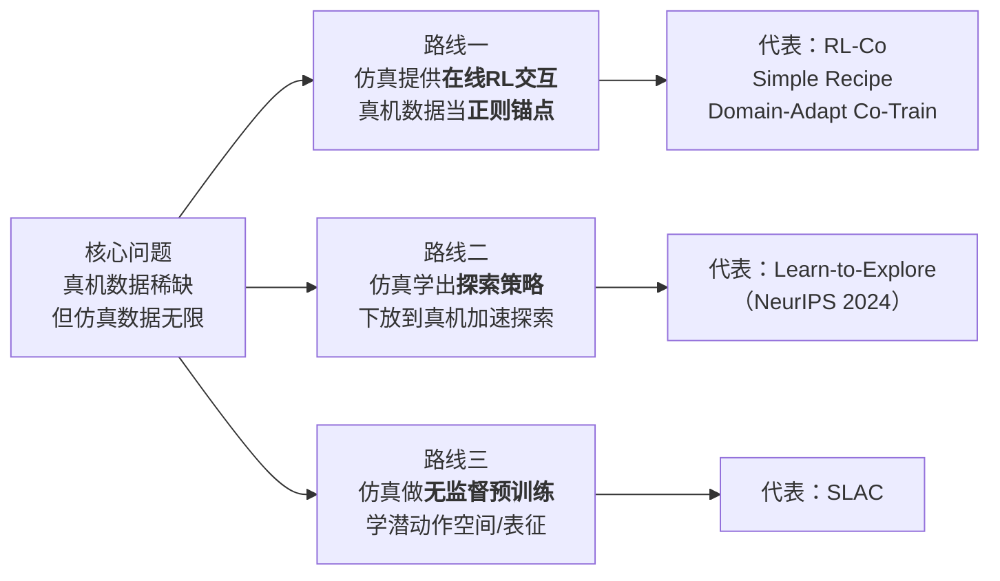
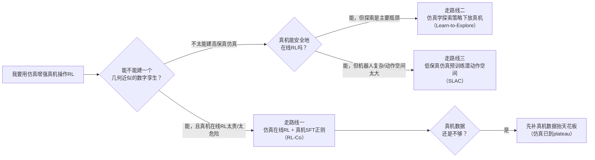

# 仿真增强真机的 Sim-Real 联合强化学习综述：让仿真为真机 RL "打工"

> **综述范围**：不是"先在仿真里训完再迁移过去"（那是传统 Sim-to-Real），而是**仿真和真机共同参与、仿真持续为真机 RL 提供增强作用**的一类方法——sim-and-real co-training / sim-real RL co-training 及其近亲。
> **关键词**：Sim-Real Co-Training、Real-Regularized RL、仿真在线交互、探索策略下放、潜动作预训练、数字孪生
> **适用读者**：了解 RL 基本概念（有 [策略梯度与 PPO](/前置知识/000a_前置知识_策略梯度与PPO) 基础）、关心 VLA / 机械臂操作、想搞清楚"手上只有几十条真机数据时该怎么用仿真"的人。

---

## 相关阅读

- [Sim-to-Real 迁移综述](/论文综述/S04_Sim_to_Real迁移综述) —— 传统"训完再迁移"范式的方法论全景（域随机化、系统辨识、域适应、自适应策略）。本文是它的**对照面**：从"迁移"走向"联合"。
- [VLA 模型的 RL 后训练综述](/论文综述/S06_VLA模型的RL后训练综述) —— 本文路线一里"仿真在线 RL"那一步用的就是这些算法。
- [VLA On-Policy RL 方法综述](/论文综述/S12_VLA_On_Policy_RL方法综述) —— PPO / GRPO 等具体在线 RL 算法。
- [VLA RL 防遗忘技术手段综述](/论文综述/S16_VLA_RL防遗忘技术手段综述) —— 本文路线一的"真机数据锚定"本质上是一种防遗忘手段，两篇强相关。
- [Sim-and-Real 混训实证分析综述](/论文综述/S33_Sim_and_Real混训实证分析综述) —— 本文把"仿真当静态示范做 SFT 混训"当作要超越的强基线；那篇专门把这个基线拆开做实证深挖（纯 BC 混训到底行不行、仿真数据是补药还是毒药）。两篇互补。
- [策略梯度与 PPO](/前置知识/000a_前置知识_策略梯度与PPO) —— RL 微调的算法底座。
- [逆动力学模型与潜动作学习](/前置知识/007b_前置知识_逆动力学模型与潜动作学习) —— 本文路线三"潜动作空间预训练"的概念基础。

---

## 贯穿全文的例子：桌面上开抽屉

为了让三条路线的差别看得见摸得着，全文用同一个具体任务：

> **场景**：一台 Franka Panda 机械臂，摄像头拍 RGB 图，任务是"把桌面上那个抽屉拉开"。抽屉初始位置和朝向每次随机（在 15° 以内扰动）。我们只有 **20 条真机遥操作示范**，但可以在仿真里（ManiSkill 建一个几何近似的数字孪生）随便跑。

这个例子不是随便挑的——它正是本文路线一代表作 RL-Co 论文里的真实任务之一。开抽屉是**接触丰富**（要精准抓把手、施力方向对）、真机数据又极少的典型场景，恰好是"仿真该怎么帮真机"这个问题最尖锐的地方。

---

## 一、核心矛盾：仿真数据便宜到无限，可它不是真机数据

先把这个领域要解决的**根本矛盾**说清楚——全文的分类逻辑都从这里长出来。

训练一个能在真机上干活的操作策略，你面对的是一道天生失衡的题：

- **真机数据**：贵、慢、少。一条遥操作示范要人工采几十秒到几分钟，采 20 条就够累了；真机在线试错还有安全和磨损问题。但它是**唯一真正代表部署环境**的数据。
- **仿真数据**：便宜、快、可无限生成。一张 GPU 上几千个并行环境同时跑，还能自动拿到奖励信号做在线 RL。但它和真机之间隔着一道 [Reality Gap](/论文综述/S04_Sim_to_Real迁移综述#1.-引言-reality-gap-是什么)——视觉不像、接触物理不准、驱动器行为有偏差。

传统 [Sim-to-Real](/论文综述/S04_Sim_to_Real迁移综述) 的答卷是："在仿真里把策略训到极致，再想办法跨过 gap 迁移过去"——迁移是**一次性**的，真机在迁移之后基本不再说话。这条路在动力学稳定的任务（四足行走）上很成功，但在接触丰富、视觉主导的操作任务上经常翻车：仿真里 99% 成功率的策略，一到真机就崩到个位数。

本文关心的是**另一种答卷**：不追求"仿真训完就不管了"，而是让**仿真和真机同时在场**——仿真负责它擅长的（海量交互、在线探索、拿奖励），真机负责它不可替代的（代表真实分布、当"标准答案"）。两者在同一次训练里互相配合。这一大类方法统称 **sim-and-real co-training**（仿真-真实联合训练）。

那么问题来了：既然要让仿真"增强"真机，**仿真具体扮演什么角色、真机又扮演什么角色**？答案不唯一，这正是本文的分类维度。按"仿真提供的增强物是什么"，现有工作分成三条清晰的路线：

> 这张图是全文地图：三条路线的**分岔点**是"仿真产出什么给真机用"——路线一给交互和奖励，路线二给一组会探索的策略，路线三给一个动作空间/表征。往下每一节展开一条。判断一篇工作属于哪条路线，只需问一句："去掉仿真，真机 RL 会失去什么？"

一个必须先厘清的边界：**co-training ≠ 把仿真数据当静态示范喂进去**。很多早期做法把仿真当成"多一批模仿学习数据"，用监督学习（SFT）混着真机数据一起训（下文称 **SFT co-training**，它到底行不行、仿真数据是补药还是毒药，[Sim-and-Real 混训实证分析综述](/论文综述/S33_Sim_and_Real混训实证分析综述) 有专门的大规模实证拆解）。这是一个强基线，但它没有用上仿真最值钱的能力——**闭环在线交互**。本文三条路线里，路线一的前沿工作正是要把这一步从"静态监督"升级成"在线 RL"，这也是它相对 SFT co-training 的核心改进。

---

## 二、路线一：仿真在线 RL + 真机数据锚定

这是最贴合"同时在仿真和真机做 RL、让仿真起增强作用"这个直觉的一条线，也是 2025-2026 最活跃的方向。我们先讲清楚它要解决的问题，再看代表作怎么解，最后把这条线内部几篇工作的递进关系摆出来。

### 2.1 这条路线在解决什么

先看两个各自的失败模式，就知道为什么要把它们缝在一起：

- **只用真机数据做 SFT**：数据太少（20 条），策略一遇到没见过的物体或初始位姿就崩。模仿学习还有个先天病——**复合误差（compounding error）**：策略每一步都有小偏差，偏差会随时间累积，最终把状态推到示范里从没出现过的区域，然后彻底失控。
- **只在仿真里做 RL**：交互无限、奖励好拿，策略在仿真里能练到很高成功率——但它学到的是"在仿真那套视觉和物理下怎么做对"，直接放到真机上因为 Reality Gap 而大幅掉点。

路线一的思路是：**让仿真在线 RL 负责"把能力练强"，让真机数据负责"把策略拽回真实世界"**。仿真提供闭环交互和奖励，策略在里面尽情探索、突破模仿学习的能力上限；与此同时，真机数据作为一个"锚"，在每次更新时都把策略往真实分布上拉一把，防止它在仿真里越练越偏。

### 2.2 代表作：RL-Co 的两阶段设计

**《Beyond Imitation: Reinforcement Learning-Based Sim-Real Co-Training for VLA Models》**（RL-Co，arXiv 2602.12628，清华 / 上海 AI Lab，2026）是这条线最完整的一篇。它把上面的思路落成一个通用的两阶段流程，对我们开抽屉的例子来说是这样跑的：

**阶段一：SFT 混合热启动。** 先把真机的 20 条示范和仿真里生成的 1000 条示范混在一起，做监督微调，给策略一个初始化。这一步有两个目的：一是把真机的任务知识注入策略；二是让策略在**仿真环境里**先有一个非平凡的成功率——否则阶段二的 RL 从零成功率起步，探索几乎无法启动。仿真示范怎么来的？用真机示范作"种子"，在 ManiSkill 里用 MimicGen 这类数据生成工具复制放大成 1000 条，这样仿真数据在行为上是"接地气"的。

混合训练的目标就是两个数据集上监督损失的加权和：

$$
\mathcal{L}_{\text{SFT}}(\theta)=\alpha\,\mathcal{L}_{\text{SFT}}(\theta;\mathcal{D}_{\text{sim}})+(1-\alpha)\,\mathcal{L}_{\text{SFT}}(\theta;\mathcal{D}_{\text{real}})
$$

**这个公式在做什么**：把"跟着仿真示范学"和"跟着真机示范学"两件事按一个比例 $\alpha$ 掺在一起，让策略同时具备仿真里的基本功和真机里的任务知识。

::: details 📐 公式详解（点击展开）

| 子表达式 | 它是谁 | 它在干嘛 |
|---------|--------|---------|
| $\mathcal{L}_{\text{SFT}}(\theta;\mathcal{D}_{\text{sim}})$ | **仿真教练** | 让策略模仿 1000 条仿真示范，学到"这个任务大致怎么做" |
| $\mathcal{L}_{\text{SFT}}(\theta;\mathcal{D}_{\text{real}})$ | **真机教练** | 让策略模仿 20 条真机示范，学到"真实世界长什么样、怎么动" |
| $\alpha$ | **配比旋钮** | 仿真占多少（0~1）。$\alpha$ 大偏向仿真，$\alpha$ 小偏向真机 |
| $\alpha(\cdot)+(1-\alpha)(\cdot)$ | **加权融合** | 两个教练的意见按比例合成一个总目标 |

**用人话读**："按 $\alpha$ 的比例，一边听仿真教练的、一边听真机教练的，合起来学。"

**为什么是这个形式**：这等价于"每次采训练样本时，以概率 $\alpha$ 从仿真数据抽、以概率 $1-\alpha$ 从真机数据抽"——实现极简，只改采样比例。$\alpha$ 的最优值和任务相关：抓取放置这种真机数据已经够用的任务，$\alpha$ 调小甚至纯真机更好；开抽屉这种接触丰富、真机数据不足的任务，需要中间偏大的 $\alpha$ 让仿真多出力。
:::

**阶段二：仿真在线 RL + 真机 SFT 正则。** 热启动之后，把策略扔进仿真做在线 [RL](/论文综述/S06_VLA模型的RL后训练综述)——正常地探索、拿奖励、更新。关键的一笔是：在 RL 损失之外，**每次更新都额外加一项真机数据上的监督损失**，把策略锚在真实分布上：

$$
\mathcal{L}_{\text{total}}=\mathcal{L}_{\text{RL}}+\beta\,\mathcal{L}_{\text{SFT}}(\theta;\mathcal{D}_{\text{real}})
$$

**这个公式在做什么**：一边让策略在仿真里靠奖励把能力往上顶（$\mathcal{L}_{\text{RL}}$），一边用真机示范这根"橡皮筋"把它往真实世界拽（$\beta\,\mathcal{L}_{\text{SFT}}$），两股力平衡，既变强又不跑偏。

::: details 📐 公式详解（点击展开）

| 子表达式 | 它是谁 | 它在干嘛 |
|---------|--------|---------|
| $\mathcal{L}_{\text{RL}}$ | **进攻手** | 仿真里的强化学习损失，驱动策略探索、最大化任务奖励，突破模仿的上限 |
| $\mathcal{L}_{\text{SFT}}(\theta;\mathcal{D}_{\text{real}})$ | **锚 / 橡皮筋** | 真机示范上的监督损失，每次更新都把策略拉回真实分布 |
| $\beta$ | **橡皮筋松紧** | 锚的权重。$\beta$ 太小锚不住（在仿真里学偏），太大则 RL 迈不开步 |
| $\mathcal{L}_{\text{RL}}+\beta(\cdot)$ | **拔河** | 进攻手往"仿真里更强"拉，锚往"真实分布"拉，合力决定策略走向 |

**用人话读**："在仿真里放开手脚做 RL，但用真机示范当锚，每步都拽一下，别让它在仿真世界里练歪了。"

**为什么加这一项而不是纯 RL**：这是全文最重要的一个实验结论——如果去掉这项（$\beta=0$），策略在**仿真里的成功率还在继续涨**，但**真机成功率从 81% 崩到 40%**。也就是说纯仿真在线 RL 会让策略"专精仿真、遗忘真实"，是一种典型的 [灾难性遗忘](/论文综述/S16_VLA_RL防遗忘技术手段综述)。这项真机 SFT 正则和 S16 里讲的 [经验回放混入 SFT 数据](/论文综述/S16_VLA_RL防遗忘技术手段综述#九-经验回放混入-sft-数据) 是同一种思想——用少量"标准答案"数据在 RL 过程中持续校准。
:::

这里要澄清一个容易误解的点：**真机 SFT 正则不是用来"让策略学会真机任务"的，而是用来"防止遗忘"的**。RL-Co 的消融显示，真机 RL 因为需要大量交互，用 20 条真机数据从零学任务效率极低；真机数据在这里的正确用法是当锚点（保住已有的真实分布知识），任务能力的提升主要来自仿真在线 RL。这也解释了为什么阶段一的 SFT 热启动不能省——它才是把真机任务知识高效注入的地方。

### 2.3 效果：仿真到底增强了多少

RL-Co 在四个真机桌面任务、两种 VLA 架构（自回归的 OpenVLA、Flow Matching 的 π0.5）上给出的真机成功率，是这条路线增强作用的直接证据：

| 训练范式 | OpenVLA 真机平均成功率 | π0.5 真机平均成功率 |
|---------|----------------------|--------------------|
| 只用真机 SFT | 16.5% | 26.7% |
| SFT co-training（仿真当静态示范） | 40.0% | 45.9% |
| **RL-Co（仿真在线 RL + 真机锚定）** | **64.0%** | **66.2%** |

三点值得记住：

1. **仿真在线交互 > 仿真静态示范**：从 SFT co-training（40 / 45.9）到 RL-Co（64 / 66.2），唯一的区别就是把"仿真当静态数据"升级成"仿真做在线 RL"。这个跳变证明了本文开头强调的边界——co-training 的天花板取决于你有没有用上仿真的闭环交互能力。
2. **泛化更强**：在没见过的物体上，只用真机的策略成功率掉 46.9%，RL-Co 只掉 25%。仿真的海量交互让策略见过更多变体，鲁棒性天然更好。
3. **真机数据效率暴涨**：RL-Co 用 **20 条**真机示范的效果，超过基线用 **200 条**——这正是"仿真增强真机"最实用的价值：省下 10 倍真机采集成本。

### 2.4 这条路线内部的谱系

路线一不是只有 RL-Co 一篇，它有一个清晰的演进谱系，每一步都在补前一步的短板：

| 工作 | 仿真的用法 | 相对前一步的改进 | 关键实证 |
|------|-----------|----------------|---------|
| **Simple Recipe**（2503.24361） | 仿真当静态示范，SFT co-training | 确立"哪怕 sim/real 差异很大，混着训也有用"这个基本盘 | 仿真数据平均提升真机表现 **+38%** |
| **Planar Pushing 实证**（2503.22634） | 同上，但做透机理 | 回答"仿真数据加多少才够"——性能随仿真数据增长到一个 **plateau（平台）**，之后加仿真数据没用，只有加真机数据才能抬高天花板 | 真机数据稀缺时增益最大 |
| **Generalizable Domain Adaptation**（2509.18631） | SFT co-training + 学域不变特征 | 显式对齐 sim/real 特征空间，减小视觉 gap | 真机成功率 **+30%**，能泛化到只在仿真见过的场景 |
| **RL-Co**（2602.12628） | 仿真做**在线 RL** + 真机 SFT 正则 | 把仿真从"静态示范"升级为"闭环交互"，突破模仿学习上限 | 真机 +24%（OpenVLA）/ +20%（π0.5），数据效率 10× |
| **Mechanistic Analysis**（2604.13645） | 机理分析，不提新方法 | 解释 co-training 为什么有效、什么时候失效 | 为整条路线提供理论理解 |

读这张表的正确姿势：Simple Recipe 立了基本盘（混着训有用），Planar Pushing 量化了边界（仿真数据有 plateau），Domain Adaptation 在特征层缩小 gap，RL-Co 换掉了"静态"这个最大短板，Mechanistic Analysis 回头解释原理。它们不是并列的五个方法，而是同一个问题被逐步啃透的过程。

---

## 三、路线二：用仿真学"探索策略"，再下放到真机

路线一里真机是"锚"（被动地提供正则），RL 主战场在仿真。路线二反过来：**RL 主战场在真机，仿真只负责教真机"该往哪探索"**。

### 3.1 这条路线在解决什么

真机 RL 最大的拦路虎是**探索**：动作空间大、真机试错慢又危险，agent 靠随机乱动几乎不可能撞见成功轨迹（尤其稀疏奖励下）。传统做法是直接把仿真训好的策略迁移到真机当初始化，但当 Reality Gap 大到直接迁移会失败时，这条路就断了。

路线二的洞察是：**就算 sim 策略本身迁移不过去，"怎么探索"这件事却可能是可迁移的**。仿真里可以廉价地学出一组**探索策略（exploratory policies）**——它们不保证在真机上直接把任务做对，但能引导真机的探索高效地覆盖到有价值的状态区域，从而让真机 RL 快速收敛。

### 3.2 代表作：Learn-to-Explore

**《Leveraging Simulation to Learn to Explore for Real-World RL》**（NeurIPS 2024，arXiv 2410.20254）是这条线的代表。它的贡献不只是一个方法，还有一个**可证明的理论结果**，这在"仿真增强真机"领域相当少见：

在 **low-rank MDP**（一类结构化的马尔可夫决策过程，转移矩阵可以低秩分解）这个设定下，把"仿真学到的探索策略"和"最小二乘回归 + 朴素随机探索"这类简单实用的手段结合起来，可以让真机的**样本复杂度从指数级降到多项式级**——相对"直接 sim2real 迁移"或"完全不用仿真"是指数级的改进。作者强调，这是首个证据表明：**在直接 sim2real 会失败的场景里，仿真迁移依然能带来可证明的强化学习收益**。

对开抽屉的例子来说，路线二的做法是：在仿真里学一组"会到处试探把手、试探不同施力方向"的探索策略，把它们放到真机上引导真机 RL 的探索——真机 RL 不再从零瞎试，而是被仿真学到的探索先验带着走，少走大量弯路。

### 3.3 和路线一的本质区别

| 维度 | 路线一（仿真在线 RL + 真机锚定） | 路线二（仿真学探索策略） |
|------|-------------------------------|------------------------|
| RL 在哪跑 | 主要在**仿真** | 主要在**真机** |
| 仿真产出什么 | 交互 + 奖励信号 | 一组探索策略（探索先验） |
| 真机的角色 | 被动的正则锚点 | RL 主战场 |
| 主要收益 | 真机成功率、泛化、真机数据效率 | 真机**样本复杂度**（可证明地降低） |
| 适合场景 | 有像样数字孪生、真机在线 RL 成本高 | 真机可以在线 RL、但探索是瓶颈 |

一句话概括差别：路线一让仿真**代替**真机做大部分 RL，路线二让仿真**指导**真机自己做 RL。

---

## 四、路线三：用仿真做无监督预训练，学潜动作空间

前两条路线里，仿真都或多或少要贴近任务（要么当交互环境，要么学任务相关的探索）。路线三走得更"轻"：**仿真不碰任务奖励，只提供一个动作该怎么组织的结构先验**，因此对仿真保真度的要求最低。

### 4.1 这条路线在解决什么

复杂机器人（多指手、高自由度）直接在真机上做 RL，除了慢和危险，还有个问题：**原始动作空间太大太乱**，随机探索几乎全是无意义的抽搐。如果能先有一个**紧凑、结构化的动作空间**——每个维度都对应"有意义的运动模式"而非单个关节的抽动——真机 RL 的探索就会高效得多、也安全得多。

### 4.2 代表作：SLAC

**《SLAC: Safe and Efficient Real-Robot Reinforcement Learning via Unsupervised Simulation Pre-Training》**（arXiv 2506.04147）的做法是：用一个**低保真仿真器**做**无监督预训练**，学出一个**任务无关的潜动作空间（latent action space）**，再拿这个潜空间去做真机 RL。

这里的"潜动作"和 [逆动力学模型与潜动作学习](/前置知识/007b_前置知识_逆动力学模型与潜动作学习#三-潜动作学习-完全不需要任何标签,直接学出一套抽象-动作词汇) 里讲的思想一脉相承——学出一套抽象的"动作词汇表"，让策略在这套词汇上操作，而不是直接控制底层关节。区别在于 SLAC 的这套词汇是在仿真里通过无监督交互学出来的。

关键点是"低保真也行"：因为仿真在这里**不负责让物理精确**（那是路线一数字孪生要操心的事），它只负责回答"这个机器人的动作大致该怎么组织成有意义的模式"——这个结构先验对仿真的物理精度不敏感，所以一个粗糙、便宜的仿真器就够用。学到的潜动作空间下放到真机后，真机 RL 在这个紧凑空间里探索，既安全又高效。

### 4.3 为什么单列一条路线

有人会问：这不就是"仿真预训练 + 真机微调"吗？和路线一有什么区别？区别在于**仿真产出的东西性质完全不同**：

- 路线一产出的是**任务策略**（会做抽屉），真机负责校准它。
- 路线三产出的是**动作空间 / 表征**（一套动作词汇），本身不含任何任务信息，真机 RL 从零在这个空间上学任务。

因此路线三对仿真的要求（低保真即可）、真机的角色（RL 主战场，从零学任务）都和路线一显著不同，是一条独立的思路。

---

## 五、三条路线全景对比

把三条路线放在同一张表里横向比较，是这篇综述最该带走的东西：

| 对比维度 | 路线一：在线 RL + 真机锚定 | 路线二：仿真学探索策略 | 路线三：仿真无监督预训练 |
|---------|---------------------------|----------------------|------------------------|
| **仿真的角色** | 在线交互环境 + 奖励来源 | 学出探索策略（探索先验） | 学出潜动作空间 / 表征 |
| **真机的角色** | 被动正则锚点（防遗忘） | RL 主战场 | RL 主战场（从零学任务） |
| **RL 主要在哪跑** | 仿真 | 真机 | 真机 |
| **对仿真保真度要求** | 中（数字孪生，但不需照片级） | 中 | **低（低保真即可）** |
| **对真机数据的需求** | 少量示范（当锚点，20~50 条） | 真机在线交互 | 真机在线交互 |
| **主要收益** | 真机成功率↑、泛化↑、真机数据 10×↓ | 真机样本复杂度↓（可证明） | 真机 RL 安全 + 高效 |
| **核心风险 / 难点** | 数字孪生构建成本；$\alpha,\beta$ 调参 | 探索策略的可迁移性 | 潜动作空间是否真的有用 |
| **代表作** | RL-Co、Simple Recipe、Domain-Adapt Co-Train | Learn-to-Explore（NeurIPS24） | SLAC |
| **项目内关联** | [S06](/论文综述/S06_VLA模型的RL后训练综述)、[S16](/论文综述/S16_VLA_RL防遗忘技术手段综述) | —— | [007b 潜动作](/前置知识/007b_前置知识_逆动力学模型与潜动作学习) |

一个共同的元规律（来自 Planar Pushing 实证和 Mechanistic Analysis）值得单独强调：**仿真的增强作用在真机数据越稀缺时越明显，并且存在天花板**。仿真数据加到一定量后收益进入 plateau，此时唯一能抬高性能上限的是加真机数据。换句话说，仿真是"放大器"不是"替代品"——它能把你手上少量真机数据的价值放大好几倍，但不能凭空造出真机数据代表的真实分布。

---

## 六、选型指南：我该走哪条路线

三条路线不是竞争关系，而是对应不同的资源约束和瓶颈。用下面这棵决策树自查：

具体建议：

- **手上只有几十条真机数据、能建个几何近似仿真、真机在线 RL 成本高** → **路线一（RL-Co）**。这是当前性价比最高、最成熟的选择，先 SFT 混合热启动，再仿真在线 RL 加真机正则。记得 $\alpha$（热启动配比）和 $\beta$（真机正则权重）要按任务调——真机数据够用的简单任务把它们调小。
- **真机可以安全在线 RL，卡点在"探索太慢撞不到成功"** → **路线二**。用仿真学探索策略引导真机探索。
- **机器人自由度高、动作空间大到没法直接 RL** → **路线三**。先用低保真仿真学个紧凑潜动作空间。
- **发现加仿真数据不涨了** → 别再加仿真数据（已到 plateau），去补真机数据抬高天花板。

还有一条贯穿性的提醒：无论走哪条路线，只要涉及"仿真在线 RL"这一步（尤其路线一），就要警惕 [灾难性遗忘](/论文综述/S16_VLA_RL防遗忘技术手段综述)——策略会在仿真里越练越专、把真实世界知识丢掉。真机 SFT 正则、[KL 惩罚](/论文综述/S16_VLA_RL防遗忘技术手段综述#三-kl-penalty-最通用的隐式防线)、经验回放这些防遗忘手段是必须搭配的安全带。

---

## 七、和传统 Sim-to-Real 的关系：从"迁移"到"联合"

最后把本文放回大图景。[S04 Sim-to-Real 迁移综述](/论文综述/S04_Sim_to_Real迁移综述) 讲的四条路线（[域随机化](/论文综述/S04_Sim_to_Real迁移综述#2.-域随机化-domain-randomization)、系统辨识、[域适应](/论文综述/S04_Sim_to_Real迁移综述#4.-域适应-domain-adaptation)、[自适应策略](/论文综述/S04_Sim_to_Real迁移综述#5.-自适应策略-adaptive-policies)）本质上都是**"迁移"范式**：训练和部署在时间上分开，真机只在部署时出现。

本文这三条路线是**"联合"范式**：真机在训练阶段就参与进来，和仿真同场配合。两种范式不是互斥的——事实上路线一里常常还会叠加域随机化（让仿真在线 RL 更鲁棒）、路线一的特征对齐工作（Domain Adaptation Co-Training）直接用的就是域适应思想。可以这样理解它们的关系：

- **迁移范式**问的是："怎么让仿真训的策略在真机上能用？"
- **联合范式**问的是："真机数据这么少，怎么让仿真把它的价值放大到极致？"

后者是前者的自然演进——当我们承认"再好的仿真也补不上真机分布"这个现实后，与其在迁移那一刻拼命跨 gap，不如让真机数据从一开始就在场，全程给仿真"纠偏"。这也是为什么这两年 co-training 迅速取代纯 sim-to-real，成为 VLA 操作策略落地的主流路径。

---

## 八、总结

| 要点 | 内容 |
|------|------|
| **核心矛盾** | 真机数据贵、少但真；仿真数据便宜、多但有 Reality Gap |
| **核心思路** | 让仿真和真机同场配合，仿真放大真机数据的价值（放大器，非替代品） |
| **路线一** | 仿真在线 RL 练能力 + 真机 SFT 正则防遗忘（RL-Co：真机成功率翻倍、数据效率 10×） |
| **路线二** | 仿真学探索策略下放真机，真机样本复杂度指数→多项式（Learn-to-Explore） |
| **路线三** | 低保真仿真无监督预训练潜动作空间，真机 RL 安全高效（SLAC） |
| **元规律** | 仿真增益在真机数据越少时越大，且有 plateau——到顶后只有真机数据能抬天花板 |
| **必备安全带** | 涉及仿真在线 RL 就要防遗忘（真机正则 / KL / 经验回放） |

## 延伸阅读

- [Sim-to-Real 迁移综述](/论文综述/S04_Sim_to_Real迁移综述) —— 传统"迁移"范式全景，本文的对照面。
- [VLA 模型的 RL 后训练综述](/论文综述/S06_VLA模型的RL后训练综述) —— 路线一"仿真在线 RL"用的算法家族。
- [VLA On-Policy RL 方法综述](/论文综述/S12_VLA_On_Policy_RL方法综述) —— PPO / GRPO 具体算法。
- [VLA RL 防遗忘技术手段综述](/论文综述/S16_VLA_RL防遗忘技术手段综述) —— 真机锚定的理论依据与更多防遗忘手段。
- [SimpleVLA-RL 精读](/论文综述/012_SimpleVLA_RL_可扩展VLA_RL训练) —— 一个可扩展的 VLA 仿真 RL 框架实例。
- [逆动力学模型与潜动作学习](/前置知识/007b_前置知识_逆动力学模型与潜动作学习) —— 路线三潜动作空间的概念基础。
