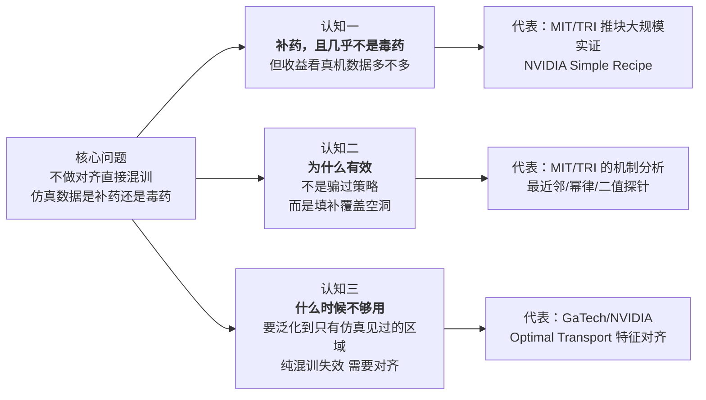
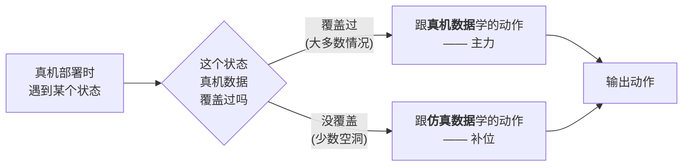
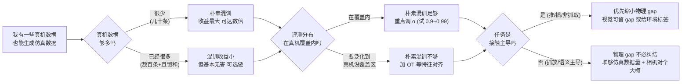

# Sim-and-Real 混训实证分析综述：不做对齐，直接把仿真和真机数据混在一起训，到底行不行

> **综述范围**：不是"先在仿真训完再迁移"（传统 Sim-to-Real），也不是"仿真跑在线 RL 增强真机"（那是另一条线），而是**最朴素的一种用法**——把仿真数据和真机数据当成两个数据集，按比例混在一起做行为克隆（BC），中间不加任何精心设计的对齐。这一大类做法叫 **sim-and-real co-training（仿真-真机混训）**。本文只关心一个实证问题：**这么干，真机上和仿真上的评测到底会得到什么结果？仿真数据是补药还是毒药？**
> **关键词**：Sim-and-Real Co-Training、Behavior Cloning、混合比例 α、数据覆盖、幂律、域可辨识性、特征对齐
> **适用读者**：了解 [行为克隆](/前置知识/000d_前置知识_行为克隆与RL微调范式) 和 [Diffusion Policy](/前置知识/000c_前置知识_Diffusion_Policy) 基本概念、手上真机数据不多、想知道"仿真数据能不能直接掺进来一起训"的人。

---

## 相关阅读

- [Sim-to-Real 迁移综述](/论文综述/S04_Sim_to_Real迁移综述) —— 传统"训完再迁移"范式（域随机化、系统辨识、域适应）。本文是它的对照面：**混训不追求缩小 gap，反而利用 gap**。
- [仿真增强真机的 Sim-Real 联合强化学习综述](/论文综述/S32_仿真增强真机的Sim_Real联合强化学习综述) —— 那篇讲的是让仿真跑**在线 RL** 来增强真机；那篇明确指出"把仿真当静态示范做 SFT 混训是一个强基线"，**本文正是把那个"强基线"拆开、做实证深挖**。两篇互补：一篇讲 RL 增强，一篇讲纯 BC 混训。
- [Diffusion Policy](/前置知识/000c_前置知识_Diffusion_Policy) —— 本文三篇代表作用的策略网络都是它。
- [行为克隆与 RL 微调范式](/前置知识/000d_前置知识_行为克隆与RL微调范式) —— 混训的训练范式就是纯 BC。
- [Wasserstein 距离与最优传输](/前置知识/002s_前置知识_Wasserstein距离与最优传输) —— 第五节"特征对齐"路线用的数学工具。

---

## 贯穿全文的例子：桌面上把一个 T 形块推到目标位姿

为了让"混训"这件事看得见，全文用一个具体任务当锚：

> **场景**：一台机械臂用一根圆柱形指头，把桌面上一个 T 形木块推到指定的目标位姿。相机从头顶和手腕两个视角拍 RGB 图，策略只看图（不给物体真实坐标），输出指头下一步该移到的 x-y 位置。

这个任务不是随便挑的——它正是本文第一篇代表作（MIT/TRI 的大规模实证研究）的核心 testbed。"推 T 形块"看着简单，却同时踩中两个最能暴露 sim-real 差异的点：**接触物理**（推的力道、摩擦、木块怎么转，仿真很难和真机完全一致）和**纯视觉输入**（策略只能看图，渲染差异直接进策略）。它又足够简单，能把真机试验重复几百次、仿真试验重复几万次，做到统计上可信。后面每引入一个结论，都尽量回到"推 T 形块"说清楚。

---

## 一、核心问题：仿真数据无限便宜，但它不是真机——掺进来到底帮忙还是添乱

先把这个领域要回答的**根本问题**摆出来，全文的组织逻辑都从这里长出来。

训练一个能在真机上干活的视觉操作策略，你面对一道天生失衡的题：

- **真机数据**：贵、慢、少。推 T 形块这种任务，人工遥操作采一条示范要几十秒，采几十上百条就很累。但它是**唯一真正代表部署环境**的数据——真机的摩擦、光照、相机畸变都写在里面。
- **仿真数据**：便宜、快、可近乎无限生成。用 MimicGen 这类工具，从几条人工示范就能自动"繁殖"出上万条仿真轨迹，一张 GPU 上批量渲染。但它和真机之间隔着一道 [Reality Gap](/论文综述/S04_Sim_to_Real迁移综述#1.-引言-reality-gap-是什么)：渲染不像、接触物理不准。

传统 [Sim-to-Real](/论文综述/S04_Sim_to_Real迁移综述) 的答卷是"在仿真里把 gap 想办法抹平（域随机化、系统辨识、数字孪生），再迁移过去"——这套在四足行走这种动力学任务上很成功，但要花大量人力调仿真。

本文关心的是一个**更懒、更朴素**的答卷：**什么对齐都不精调，直接把 $N$ 条真机数据和 $M$ 条仿真数据（通常 $M \gg N$）混在一个训练集里，按一个采样比例 $\alpha$ 抽 batch，做纯行为克隆。** 训完直接部署到真机。

这就带出了本综述要回答的实证问题，也是你会本能地担心的问题：

> **仿真数据和真机数据分布不一样，混在一起训，会不会把策略"带偏"——真机上反而更差？仿真数据到底是"补药"还是"毒药"？**

围绕这个问题，社区在 2025 年前后做了三批系统性的实证工作，它们不是简单地各说各话，而是**层层深入地回答了同一个问题的三个递进层面**。本文就按这三个认知层次组织：

> 这张图是全文地图。三个认知层次不是三堆平行的方法，而是对**同一个实证问题**越挖越深：先确认"到底行不行"（认知一），再追问"凭什么行"（认知二），最后划定"哪里不行、该怎么补"（认知三）。判断一份工作属于哪一层，只需问："它在回答'行不行'、'为什么行'、还是'哪里不行'？"

先给出全文最重要的一句话结论，后面逐层用数据支撑：

> **"补药 vs 毒药"这个二分法本身是错的。仿真数据是"填补真机数据覆盖空洞的补充材料"——它几乎从不是毒药（最坏是没用），它的价值大小取决于真机数据有多少空洞。真机越少、覆盖越差，仿真数据越像救命的补药；真机已经充足，仿真数据的边际收益趋近于零。**

---

## 二、认知一：混训确实是补药，而且几乎不会变毒药

要回答"行不行"，最扎实的一篇是 MIT / 丰田研究院（TRI）的 **Empirical Analysis of Sim-and-Real Cotraining of Diffusion Policies for Planar Pushing from Pixels**（arXiv 2503.22634）。它把注意力**故意收窄到"推 T 形块"这一个任务**，好处是能做到别的论文做不到的彻底：**它一共训了 40 多个真机策略、跑了 800 多次真机试验，另外训了 200 个仿真策略、跑了 40000 多次仿真试验**。结论因此不是"我们试了几次感觉不错"，而是有统计支撑的趋势。

### 2.1 混训用的就是最朴素的"按比例混"

先说清楚它研究的到底是什么算法，免得把它想复杂。它用的是最简单的 **vanilla co-training（朴素混训）**：把真机数据集 $\mathcal{D}_R$ 和仿真数据集 $\mathcal{D}_S$ 混在一起，每次组 batch 时，以概率 $\alpha$ 从真机集里抽样本、以概率 $1-\alpha$ 从仿真集里抽。这等价于最小化下面这个加权损失。

$$
\mathcal{L}_{\mathcal{D}^{\alpha}} = \alpha\,\mathcal{L}_{\mathcal{D}_R} + (1-\alpha)\,\mathcal{L}_{\mathcal{D}_S}
$$

**这个公式在做什么**：把"在真机数据上的模仿损失"和"在仿真数据上的模仿损失"按一个旋钮 $\alpha$ 加权求和——$\alpha$ 调大就更听真机的，调小就更听仿真的。整个"混训"就这么一个旋钮，没有任何额外机制。

::: details 📐 公式详解（点击展开）

| 子表达式 | 它是谁 | 它在干嘛 |
|---------|--------|---------|
| $\mathcal{L}_{\mathcal{D}_R}$ | **真机作业本的分数** | 策略在真机示范上模仿得有多差（[BC](/前置知识/000d_前置知识_行为克隆与RL微调范式) 的负对数似然损失） |
| $\mathcal{L}_{\mathcal{D}_S}$ | **仿真作业本的分数** | 策略在仿真示范上模仿得有多差 |
| $\alpha \in [0,1]$ | **偏心旋钮** | 决定优化时更在乎哪本作业本；也等于每个 batch 里真机样本的占比 |
| $\alpha\mathcal{L}_{\mathcal{D}_R}+(1-\alpha)\mathcal{L}_{\mathcal{D}_S}$ | **加权总分** | 两本作业本的分数按偏心程度合成一个要最小化的总损失 |

**用人话读**："让策略同时把真机示范和仿真示范都模仿好，但可以用 $\alpha$ 决定更偏向哪一边。"

**为什么需要 $\alpha$ 这个旋钮**：因为仿真数据通常远多于真机（$|\mathcal{D}_S|\gg|\mathcal{D}_R|$）。如果不加权、直接把两堆数据倒一起随机抽，真机数据会被仿真数据淹没，损失几乎全由仿真主导，真机那点宝贵信号被稀释掉。$\alpha$ 就是用来把真机的话语权重新提上来的。注意两个端点：$\alpha=1$ 等价于只用真机训（没混训），$\alpha=0$ 等价于只用仿真训。
:::

> ⚠️ 这里必须和 [S32 综述](/论文综述/S32_仿真增强真机的Sim_Real联合强化学习综述) 划清界限：本文研究的混训是**纯监督（BC）**——仿真数据是一批"静态示范"，策略不在仿真里跑、不拿奖励、不做在线试错。S32 讲的那条线才会让仿真跑在线 RL。本文的问题更基础："连在线交互都不用，光把仿真示范掺进 BC，有没有用？"

### 2.2 结论：真机数据越少，仿真数据越像救命补药

它把真机示范数量分成三档，得到一张非常干净的对照。真机侧的基线（只用真机训、$\alpha=1$）随数据量从 2/20 涨到 20/20，据此把三档叫作"低 / 中 / 高数据档"。混训（挑最优 $\alpha$）的结果如下：

| 真机示范数 | 只用真机（real-only） | 混入仿真后最佳 | 仿真数据扮演的角色 |
|---|---|---|---|
| 10（低数据档） | 2/20 = 10% | **14/20 = 70%** | **救命补药**，提升约 7 倍 |
| 50（中数据档） | 10/20 = 50% | **19/20 = 95%** | **强力补药**，几乎补满 |
| 150（高数据档，真机已饱和） | 20/20 = 100% | 略降，但落在统计误差内 | **中性**，既不补也几乎不毒 |

> 灰色虚线是只用真机、绿色实线是混训后的最佳成绩。看两条线的**间距**：真机数据越少（左端），间距越大——仿真数据把成功率从 10% 拉到 70%；真机数据饱和（右端），两条线几乎重合，仿真数据无功也几乎无过。这张图就是"补药还是毒药"的直接答案：**在真机数据不够的地方是猛药，在真机数据够的地方最多是安慰剂。**

这里有一个必须讲清楚、也最能打消"毒药"顾虑的细节：**高数据档那个"略降"，幅度落在统计误差范围内**。真机跑 20 次试验本身就有随机性，20/20 也不代表策略完美。所以严格地说，这篇大规模实证**没有观察到"加了仿真数据导致成功率显著下降"的情况**——最坏的结果是"没用"（plateau），而不是"变差"。这就是本文反复强调"仿真数据几乎从不是毒药"的第一手依据。

### 2.3 仿真数据的收益会触顶，真机数据才能抬高天花板

第二个关键趋势：**不停地加仿真数据，成功率会上升到某个天花板然后不动了；要抬高这个天花板，只能加真机数据。** 这篇论文在仿真-仿真的可控实验里把这个规律拟合成了一条幂律（用大量 checkpoint 拟合，$R^2$ 高达 0.945）：

$$
\mathcal{L}_{\mathcal{D}_T^{\text{test}}} \;\propto\; |\mathcal{D}_S|^{-0.332}\cdot|\mathcal{D}_T|^{-0.397}
$$

**这个公式在做什么**：它告诉你策略在目标域（真机/目标仿真）上的测试损失，会随着"仿真数据量"和"真机数据量"各自以一个幂次下降——**两者都能降低损失，但真机数据那一项的指数更大（0.397 > 0.332），说明每加一条真机数据比每加一条仿真数据更能压低损失。**

::: details 📐 公式详解（点击展开）

| 子表达式 | 它是谁 | 它在干嘛 |
|---------|--------|---------|
| $\mathcal{L}_{\mathcal{D}_T^{\text{test}}}$ | **目标域考试成绩** | 策略在目标域（真机）留出测试集上的模仿损失，越低越好 |
| $\lvert\mathcal{D}_S\rvert^{-0.332}$ | **仿真数据的贡献** | 仿真数据越多，这一项越小；但指数只有 0.332，边际递减明显 |
| $\lvert\mathcal{D}_T\rvert^{-0.397}$ | **真机数据的贡献** | 真机数据越多，这一项越小；指数 0.397 更大，"含金量"更高 |
| 两项相乘 | **联合缩放** | 损失同时被两种数据往下压，谁的指数大谁更值钱 |

**用人话读**："仿真和真机数据都能让策略学得更准，但真机数据每一条更顶用；而且仿真数据的作用是幂律递减的，堆到后面越来越不划算。"

**为什么会触顶**：指数是负的且绝对值小于 1，意味着损失随数据量下降但越来越慢——这正是"收益 plateau（触顶）"的数学形态。第四节会从机制上解释触顶的原因（仿真只能填真机的空洞，空洞填完就没活可干了）。这里先记住形态：**仿真数据不是线性地一直堆一直涨，而是很快进入边际递减。**
:::

> 三条线对应不同的真机数据量。看两点：(1) 每条线都随仿真数据增加而下降，但在对数坐标下是直线且斜率平缓——**加仿真数据有用，但边际递减**；(2) 三条线的**高低**由真机数据量决定——真机数据多的那条（绿）整体更低。这就是"仿真数据决定你爬多快、真机数据决定你的天花板在哪"的可视化。

### 2.4 NVIDIA 的大规模验证：换平台、换任务，混训依然是补药

如果担心上面结论只在"推 T 形块"一个任务成立，NVIDIA + UT Austin 的 **Sim-and-Real Co-Training: A Simple Recipe**（arXiv 2503.24361）在**两个完全不同的机器人平台（Franka Panda 机械臂 + Fourier GR-1 人形）、六个任务**（抓放、开关柜门、倒水等）上验证了同一件事。它的核心数字是：**朴素混训把真机成功率平均提升了 38%**（从只用真机的 45.3% 提到混入全部仿真数据的 83.2%），而且——**即使仿真和真机有明显差异，也不需要精确对齐**。

| 数据配方 | 六任务平均真机成功率 | 相对只用真机的提升 |
|---|---|---|
| 只用真机（Real） | 45.3% | — |
| 真机 + 任务无关的现成仿真数据（Prior） | 76.8% | +31.5% |
| 真机 + 任务相关的"数字表亲"仿真数据（DC） | 81.1% | +35.8% |
| 真机 + DC + Prior | **83.2%** | **+37.9%** |

这里有个反直觉、但对"仿真数据是不是毒药"极其重要的观察：**连"任务无关的现成仿真数据"（Prior，那是为别的任务采的、和目标任务只是同一个机器人）掺进来都能涨 31.5%。** 也就是说，仿真数据哪怕和你的目标任务对不太上，只要机器人和动作空间一致，掺进来大概率还是补药。论文标题"A Simple Recipe（一个简单配方）"本身就是态度：**不需要花哨对齐，朴素混训就是一个很强的基线。**

---

## 三、混训真正敏感的旋钮：混合比例 α，而不是"对齐做得多精"

既然朴素混训这么好用，那实操里最该操心什么？两篇论文的答案高度一致：**最该调的是混合比例 $\alpha$，而不是花大力气把仿真和真机对齐。**

### 3.1 混合比例 α：调对了封神，调过头翻车

Simple Recipe 在 CupPnP 任务上（20 条真机 + 1000 条仿真）系统扫了 $\alpha$，结果非常有教育意义：

| 混合比例（仿真占 batch 的比例） | 真机成功率 |
|---|---|
| 50%（1:1 混） | 次优 |
| **99%** | **95%（最佳）** |
| 99.5% / 99.9% | 掉到约 60% |

> 横轴是仿真在每个 batch 里的占比。看曲线形状：一路升到 99% 达到顶峰，再往右**急速跌落**。这说明两件事：(1) 因为仿真数据是真机的几十倍，batch 里必须让仿真占大头（99%）策略才有足够多样本可学；(2) 但**真机数据不能被彻底挤没**——从 99% 推到 99.9%，相当于每 1000 个样本才有 1 个真机的，那点真机锚定信号消失，成功率立刻从 95% 崩到 60%。

这条曲线把"真机数据不能被淹没"这件事量化了：**哪怕只保留极小一撮真机数据（1%），也远好于几乎不保留（0.1%）。** 呼应第二节 MIT/TRI 的发现——他们也观察到当 $\alpha\to 0^+$（真机占比趋近于 0）时性能近乎断崖式下跌，"哪怕掺一点点真机数据，都能大幅改善性能"。

### 3.2 什么该对齐、什么不必对齐：一张实证清单

Simple Recipe 逐个因素做了消融，给出了"哪些对齐值得花力气、哪些纯属浪费"的一手结论：

| 对齐因素 | 做对齐 vs 不做的成功率变化 | 结论 |
|---|---|---|
| **仿真数据量** | Panda 任务从 10k 减到 500 条：67% → 53%；GR-1 从 1k 减到 100 条：95% → 75% | 仿真数据要**足够多**（比真机多几个数量级），这是硬要求 |
| **相机视角对齐** | 用未对齐相机：Panda 67% → 56%，GR-1 95% → 70% | **值得对齐**，但不必完美（他们对齐后的相机甚至没建模真机的鱼眼畸变，照样有效） |
| **动力学（物理）对齐** | GR-1 CupPnP 调不调物理参数：成功率都是 95% | 对**这个抓放任务**没差别（见下方重要说明） |
| **任务语义 / 成功判据** | 必须一致 | 硬要求：仿真任务和真机任务得是"同一件事" |

### 3.3 一个关键的领域依赖：物理 gap 到底重不重要，看任务类型

上表里"动力学对齐没差别"和第二节里 MIT/TRI 强调的"物理 gap 很致命"看似矛盾，其实不矛盾——**取决于任务是不是接触主导的**，这一点必须讲清楚，否则会误导读者。

- **Simple Recipe 的 CupPnP 是抓放（prehensile）任务**：抓稳了物体，后续轨迹主要由机械臂运动决定，物体动力学参与得少。所以物理参数对不对齐几乎不影响——他们实测调不调都是 95%。
- **MIT/TRI 的推 T 形块是非抓取（non-prehensile）、接触丰富的任务**：全程靠指头推、靠摩擦让木块转，木块怎么动完全由接触物理决定。所以物理 gap 直接决定成败——他们实测**完全消除物理 gap 的策略，比留有一档物理 gap 的策略高 15.5% 成功率**（这是显著差异），而且这个初始的物理 gap 一旦出现，后续再增大 gap 反而没那么敏感了。

**综合成一句可操作的判断**：抓放/语义主导的任务，别太纠结物理对齐，把仿真数据量堆够、相机对个大概即可；**接触丰富的任务（推、插、非抓取操作），物理 gap 是第一优先级**，视觉渲染反而没那么关键。

---

## 四、认知二：混训凭什么有效？不是"骗过策略"，而是"填补空洞 + 分域切换"

第二节确认了"行"，这一节回答"凭什么行"。MIT/TRI 那篇最大的贡献，其实是它对**机制**的三项分析——而且结论彻底颠覆了很多人的朴素直觉。

朴素直觉是：混训之所以有效，是因为仿真数据"骗过了"策略，让它以为仿真就是真机，于是仿真里学到的技能能搬到真机。**这个直觉是错的。** 真实机制是下面两条。

### 4.1 机制一：仿真数据的作用是"填补真机没覆盖到的状态"

他们做了一个很巧妙的分析——**最近邻归因**：让训好的混训策略分别在真机和仿真里各跑一遍，对策略输出的每一小段动作，去看它的最近邻样本（相似的观测-动作对）更多来自真机数据集还是仿真数据集，以此判断"这个动作是跟真机学的还是跟仿真学的"。

结果很清楚：**策略在真机里跑时，绝大多数动作的最近邻来自真机数据；只有在真机数据没覆盖到的状态，才会去"查阅"仿真数据。** 注意这个策略是用 10 倍于真机的仿真数据训的，但真机 rollout 里大部分动作的最近邻依然是真机——说明策略**主要靠部署域自己的数据干活，仿真只在真机够不着的地方补位**。

这直接解释了两个之前的现象：

- **为什么收益会触顶（第 2.3 节的幂律 plateau）**：仿真的活是"填真机的空洞"。空洞一旦填满，再加仿真数据就没活可干了——所以边际收益递减、最终触顶。
- **为什么真机极少（10 条）时混训也救不满**：仿真能填空洞，但"真机物理下到底该怎么动"这种核心策略，还是得靠真机数据学。真机数据太少，连骨架都立不起来，仿真填得再多也白搭。

> 这张图是"填空洞"机制的示意：真机数据是主力、负责它见过的大多数状态；仿真数据是替补、只在真机没见过的空洞里顶上。理解了这张图，就理解了为什么"真机越少空洞越多、仿真越有用"，以及"真机饱和后仿真几乎没用"。

### 4.2 机制二：高性能策略会主动"分辨自己在仿真还是真机"，并切换动作

这是全篇最反直觉的发现。他们用**二值探针**（在策略网络不同层上接一个小分类器，测它能不能判断当前输入来自仿真还是真机）测量发现：**高性能的混训策略，在网络的最后一层激活上，仍能以 74%~93% 的准确率分辨出"我现在看到的是仿真还是真机"。**

正常来说，如果策略把仿真和真机当成一回事，这个信息在深层网络里早该被丢弃了（数据处理不等式）。但策略**主动把"我在哪个域"这个信息一路保留到了最后一层**——因为它需要这个信息来决定动作。原因很朴素：**仿真的物理和真机的物理不一样，同一个视觉观测下，正确的动作也不一样。** 策略学到的不是"把仿真当真机"，而是"看出这是仿真就用仿真那套动作，看出这是真机就用真机那套动作"。

由此引出一个彻底反直觉的结论，也是本领域最容易被误解的一点：

> **把仿真渲染做得和真机一模一样（消除视觉 gap），反而会让混训策略变差。**

MIT/TRI 实测：当仿真和真机之间**存在物理 gap** 时，如果强行抹掉视觉差异（让策略没法从画面分辨自己在哪个域），成功率会下降；而给策略一个**明确的 one-hot 环境标签**（直接告诉它"这是仿真/这是真机"），能把性能补回来。反过来，当仿真和真机**没有物理 gap** 时，抹掉视觉差异才是有益的。这条实证规律可以总结成：

- **两个域物理不同** → 策略**需要**能分辨域（视觉 gap 或 one-hot 标签都行），才能对不同域用不同动作 → 视觉太真实反而有害。
- **两个域物理相同** → 不需要分辨，抹平视觉差异反而更好。

他们还顺手验证了一个自然的想法：既然策略会为两个域预测不同动作，那用 [Classifier-Free Guidance](/前置知识/000c_前置知识_Diffusion_Policy)（CFG，扩散/流模型里放大条件作用的推理技巧）去**放大**这个"域差异"能不能进一步提升？实测 **CFG 引导强度 $w>0$ 并不带来提升**；反而是用 one-hot 环境标签、正常采样（相当于 $w=0$）效果最好。这给了实操一条明确建议：**想让策略分域，给它一个 one-hot 环境标签就够了，不用上 CFG。**

### 4.3 把认知一和认知二合起来看

现在"补药还是毒药"这个问题，可以给一个有机制支撑的完整回答了：

- 仿真数据是**填补真机覆盖空洞的补充材料**（机制一），所以真机空洞越多（数据越少）它越值钱——这解释了认知一里的数据档位规律。
- 混训成功**不依赖"骗过策略"，反而依赖"让策略能分辨域"**（机制二），所以留一点 gap（或给个环境标签）是好事，追求完美对齐是南辕北辙。
- 正因为策略只是"多学了一套仿真域的技能、并会切换"，仿真数据**不会污染真机域的行为**——这就是为什么它几乎从不是毒药。

---

## 五、认知三：混训什么时候"不够用"？——要泛化到只有仿真见过的区域

前两节把朴素混训夸得很好，但它有一个明确的软肋，之前两篇都没重点测：**当评测分布落在真机数据完全没覆盖、只有仿真覆盖的区域时，朴素混训会失效。** 这正是佐治亚理工 + NVIDIA 的 **Generalizable Domain Adaptation for Sim-and-Real Policy Co-Training**（arXiv 2509.18631）要解决的问题。

### 5.1 问题：真机数据只覆盖一小块，仿真覆盖一大片，中间的空当怎么办

这篇的设定很典型：仿真里用 MimicGen 自动生成上千条轨迹、覆盖很大的初始状态范围（记作 Source 区域）；真机只在其中一小块子区域采 10~25 条示范（Target 区域）；然后专门划出一块**真机完全没采、只有仿真覆盖过**的区域（Target-OOD）来考验泛化。

在真机覆盖到的区域内（in-distribution），朴素混训表现依然很好——这和前两节一致。问题出在 Target-OOD：

| 方法（真机、image 观测、OOD 区域平均全任务成功率） | Target-OOD 成功率 |
|---|---|
| 只用仿真（Source-only） | 0.00 |
| 只用真机（Target-only） | 0.00 |
| **朴素混训（Co-training）** | **0.10** |
| 加了最优传输特征对齐（本文 OT 方法） | **0.40** |

朴素混训在 OOD 区域只有 0.10——比只用真机（0.00）好，但远远不够用。**原因正是第四节的机制**：混训策略在真机部署时主要靠真机数据、仿真只填真机够得着的空洞（4.1 节）。可 Target-OOD 是真机**完全够不着**的地方，那里没有真机最近邻可依赖，策略就迁移不过去。**朴素混训能填"真机数据边缘的小空洞"，但填不了"真机完全没去过的大片新区域"。**

### 5.2 解法：用最优传输把仿真和真机的特征空间对齐

这篇的做法是给混训**加一个特征对齐的正则项**。核心想法：光靠 BC 损失，编码器没有动力把"同一个底层状态、但一个来自仿真一个来自真机"的两张图映射到相近的特征——它们的画面不一样，特征自然可能分开。于是策略在真机新区域拿到一个特征，如果这个特征和仿真里对应状态的特征对不上，就用不上仿真在那片区域学到的东西。

解法是用 [最优传输（Optimal Transport, OT）](/前置知识/002s_前置知识_Wasserstein距离与最优传输) 显式地把仿真和真机的**特征分布**对齐，让"底层状态相同"的仿真图和真机图在特征空间里靠在一起。它的关键洞察是：不只对齐观测的边缘分布，而是对齐**观测-动作（或观测-本体状态）的联合分布**——因为对操作任务来说，"两个状态是不是该做相似动作"比"两张图长不长得像"更有意义。整体训练目标是 BC 损失加一个 OT 对齐损失：

$$
L(f_\phi, \pi_\theta) = L_{\text{BC}}(f_\phi, \pi_\theta) + \lambda \cdot L_{\text{UOT}}(f_\phi)
$$

**这个公式在做什么**：一边照常让策略模仿示范（BC 损失），一边额外逼编码器把仿真特征和真机特征在几何上对齐（OT 损失），$\lambda$ 控制两者的力度平衡。这样仿真在 Target-OOD 学到的技能，就能通过对齐好的共享特征空间迁移到真机没去过的区域。

::: details 📐 公式详解（点击展开）

| 子表达式 | 它是谁 | 它在干嘛 |
|---------|--------|---------|
| $L_{\text{BC}}(f_\phi, \pi_\theta)$ | **模仿老师** | 标准行为克隆损失，同时在仿真和真机数据上算，负责让策略学会做任务 |
| $L_{\text{UOT}}(f_\phi)$ | **对齐裁判** | 不平衡最优传输损失，只作用在编码器 $f_\phi$ 上，逼它把仿真/真机相似状态的特征拉到一起 |
| $\lambda$ | **力度旋钮** | 平衡"学任务"和"对齐特征"两个目标（论文里取 0.1） |
| $f_\phi$ | **共享编码器** | 把仿真图和真机图都映射到同一个特征空间，是对齐真正落地的地方 |

**用人话读**："照常学模仿，但额外要求编码器给仿真和真机的相似状态生成相似特征——这样仿真在真机没见过的区域学到的本事，才能顺着对齐好的特征迁移过去。"

**为什么用"不平衡"OT（UOT）而不是标准 OT**：因为仿真数据远多于真机（$|\mathcal{D}_S|\gg|\mathcal{D}_R|$），而且两者覆盖的状态只部分重叠。标准 OT 强制所有质量都要配对，会硬把不对应的仿真状态和真机状态错配。不平衡 OT 放松了这个约束，允许"只对齐真正相似的那部分、忽略配不上的部分"，避免制造虚假对齐。
:::

对齐带来的收益是明确的：Target-OOD 从朴素混训的 0.10 提到 0.40；真机 in-distribution 平均成功率也从混训的 0.53 提到 0.73（image）。**这就界定了对齐的真正价值：对齐不是"让混训能用"——混训本来就能用——而是"扩展仿真数据的有效覆盖范围，让真机完全没见过的区域也能靠仿真泛化过去"。**

### 5.3 认知三给"补药还是毒药"补上的最后一块

把三层认知拼起来，"补药还是毒药"的完整地图就清楚了：

- 真机数据充足 + 评测在真机覆盖分布内 → 仿真是**中性添加剂**，加不加都行，最坏误差内微降。
- 真机数据稀缺 + 评测在真机覆盖分布内 → 仿真是**强力补药**，朴素混训就能涨 2~7 倍，无需对齐（认知一、二）。
- 评测落在只有仿真覆盖、真机没覆盖的区域 → 朴素混训**不够用**（不是毒，是够不着），需要特征对齐才能把仿真的覆盖迁过去（认知三）。

**始终没有出现"仿真数据把真机性能显著拉低"的情况。** 所谓风险，不在"毒"，而在两处：接触类任务物理 gap 大时天花板被压低（3.3 节）；混合比例 $\alpha$ 在真机数据极少时很敏感，选错会明显掉点（3.1 节）——但这些都是"没调好"而非"仿真本身有害"。

---

## 六、全景对比：三篇代表作横向看

把三篇工作放在同一张表里横向对比，能看清它们各自回答了问题的哪一层、以及关键的一手数字（所有数字均出自各论文原文）：

| 维度 | MIT/TRI 推块实证 (2503.22634) | NVIDIA Simple Recipe (2503.24361) | GaTech/NVIDIA OT 对齐 (2509.18631) |
|---|---|---|---|
| 回答的层次 | 认知一 + 认知二 （行不行 + 为什么行） | 认知一 （行不行，大规模验证） | 认知三 （哪里不行、怎么补） |
| 任务 | 推 T 形块（非抓取、接触丰富） | 抓放/开门/倒水（6 任务） | 抓放/插方/挂杯（6 任务） |
| 平台 | KUKA iiwa 单臂 | Franka Panda + Fourier GR-1 人形 | Franka Panda |
| 策略 | [Diffusion Policy](/前置知识/000c_前置知识_Diffusion_Policy) | Diffusion Policy | Diffusion Policy / 3D Diffusion Policy |
| 混训方式 | 朴素按比例混（vanilla） | 朴素按比例混（vanilla） | 混训 + [OT](/前置知识/002s_前置知识_Wasserstein距离与最优传输) 特征对齐 |
| 核心数字 | 真机 10 条：10%→70%（7×） 幂律 $\lvert D_S\rvert^{-0.332}\lvert D_T\rvert^{-0.397}$ | 平均 +38% （45.3%→83.2%） | Target-OOD 0.10→0.40 |
| 关键洞察 | 收益触顶；物理 gap 比视觉重要； 留视觉 gap 反而更好 | α=0.99 最佳；相机对齐值得、 动力学对齐（抓放任务）不必 | 朴素混训在真机没覆盖的区域失效， 需特征对齐才能泛化 |
| 是否观察到"仿真变毒药" | 否（最坏 plateau，在误差内） | 否 | 否（in-dist 混训仍优于只用真机） |

一个必须强调的边界：这三篇的评测**全部在准静态（quasi-static）、桌面操作任务**上。高动态、可变形物体、液体、长时序高精度插装等任务，仿真本身就难以准确建模，上面的结论不一定平移过去——这是三篇论文各自都在 Limitation 里承认的共同边界。

## 七、选型指南：手上是这个情况，我该怎么做

把上面所有实证结论压缩成一棵决策树，方便直接用：

> 这棵树把全文结论串成可执行的路径。三个分叉点分别对应三层认知：真机数据多不多（认知一）、评测在不在覆盖内（认知三）、任务接触主不主导（3.3 节的领域依赖）。**几乎所有分支的起点都是"先做朴素混训"——因为它是强基线且几乎无害；只有在"要泛化到真机没覆盖区"这一支，才需要升级到特征对齐。**

配套的实操建议清单（全部有实证支撑）：

- **仿真数据要比真机多几个数量级**：Simple Recipe 实测仿真从 10k 减到 500 条会明显掉点（67%→53%）。
- **混合比例 $\alpha$ 是第一要调的旋钮**：让仿真占大头（batch 里 90%~99%），但**必须保留一小撮真机**，别推到 99.9% 把真机挤没。
- **相机视角对个大概就行，不必完美**：Simple Recipe 对齐后的相机连鱼眼畸变都没建模，照样有效。
- **接触类任务优先对齐物理**：推块实验里消除物理 gap 能带来 15.5% 的显著提升。
- **想让策略分域，给个 one-hot 环境标签即可**，别指望 CFG 放大域差异（实测 $w>0$ 不涨）。

---

## 八、总结：仿真数据是"补充材料"，不是"替代品"，更不是"毒药"

回到你最初的问题——**不做对齐、直接把 sim 加 real 一起训，真机和仿真上到底什么结果？仿真数据是毒药还是补充？**

三批系统性实证给出的答案高度一致：

1. **是补充，而且几乎从不是毒药。** 三篇跨越两个机构、多个平台、上千次真机试验，都没有观察到"加仿真数据导致真机性能显著下降"。最坏的结果是"没帮上忙"（真机已饱和时），而不是"帮倒忙"。
2. **补充的力度取决于真机数据的稀缺程度。** 真机极少时是救命补药（10 条示范场景下涨 7 倍）；真机饱和时是中性添加剂。机制上，仿真数据的作用是**填补真机没覆盖到的状态空洞**——空洞越多它越值钱。
3. **有效的机制不是"骗过策略"，而是"让策略分辨域并切换动作"。** 所以追求完美对齐（尤其视觉）是南辕北辙，留一点 gap 或给个环境标签反而更好。
4. **朴素混训的软肋是泛化到真机完全没覆盖的区域**——那里它够不着（不是变毒），这时才需要用最优传输等特征对齐把仿真的覆盖迁移过去。

一句话收束：**把仿真数据当"填补真机数据空洞的补充材料"来用，几乎稳赚不赔；只有当你既想省真机数据、又要泛化到真机完全没去过的地方时，才需要在朴素混训之上加对齐这道工序。**

---

## 延伸阅读

- [Sim-to-Real 迁移综述](/论文综述/S04_Sim_to_Real迁移综述) —— 传统"训完再迁移"范式，本文的对照面。
- [仿真增强真机的 Sim-Real 联合强化学习综述](/论文综述/S32_仿真增强真机的Sim_Real联合强化学习综述) —— 用**在线 RL** 增强真机的那条线，本文补齐了它提到的"纯 BC 混训强基线"的实证细节。
- [Diffusion Policy](/前置知识/000c_前置知识_Diffusion_Policy) —— 三篇代表作共用的策略网络。
- [行为克隆与 RL 微调范式](/前置知识/000d_前置知识_行为克隆与RL微调范式) —— 混训的训练范式。
- [Wasserstein 距离与最优传输](/前置知识/002s_前置知识_Wasserstein距离与最优传输) —— 第五节特征对齐的数学工具。

### 本文引用的三篇论文

- Wei et al., *Empirical Analysis of Sim-and-Real Cotraining of Diffusion Policies for Planar Pushing from Pixels*, arXiv:2503.22634（MIT / 丰田研究院）。
- Maddukuri et al., *Sim-and-Real Co-Training: A Simple Recipe for Vision-Based Robotic Manipulation*, arXiv:2503.24361（NVIDIA / UT Austin / UC Berkeley）。
- Cheng et al., *Generalizable Domain Adaptation for Sim-and-Real Policy Co-Training*, arXiv:2509.18631（Georgia Tech / NVIDIA）。

